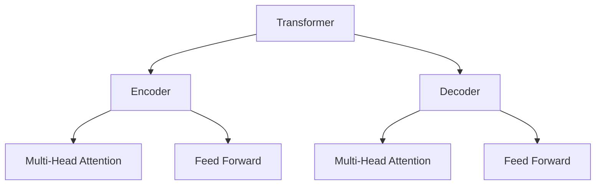
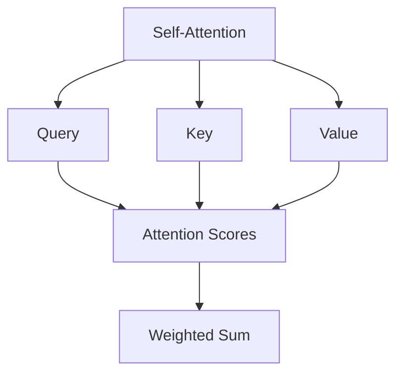
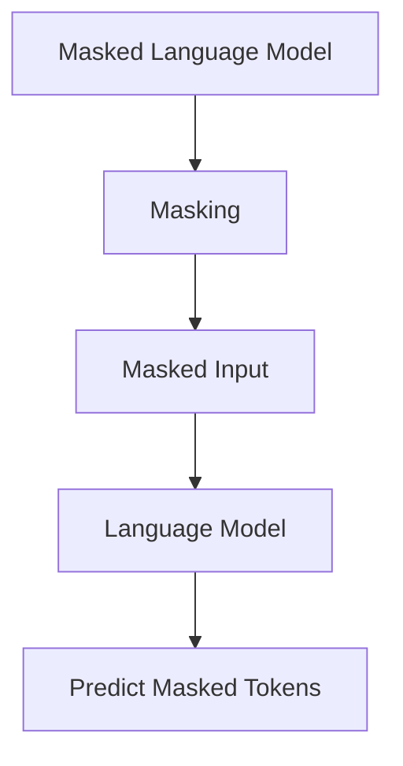

# RoBERTa原理与代码实例讲解

## 1. 背景介绍

### 1.1 问题的由来

在自然语言处理(NLP)领域,预训练语言模型(Pre-trained Language Model)已成为解决各种下游任务的关键技术。自2018年Transformer模型的出现以来,基于Transformer的预训练语言模型取得了巨大的进展,例如GPT、BERT等模型在多项NLP任务上取得了state-of-the-art的表现。

然而,这些模型在训练过程中存在一些缺陷和局限性,例如BERT采用的静态masked语言模型(Masked Language Model)预训练目标,无法很好地捕捉句子之间的关系;另外,BERT的下一句预测(Next Sentence Prediction)目标也存在一些争议。因此,我们需要一种更加高效和强大的预训练语言模型来弥补这些不足。

### 1.2 研究现状

为了解决上述问题,Facebook AI研究院于2019年提出了RoBERTa(Robustly Optimized BERT Pretraining Approach),它是在BERT模型的基础上进行改进和优化的新型预训练语言模型。RoBERTa通过调整训练策略、数据处理方式和超参数设置等方面,显著提升了模型的性能表现。

与BERT相比,RoBERTa主要有以下几个关键改进:

1. 更大规模的训练数据集
2. 更长的训练时间
3. 动态遮蔽策略
4. 去除下一句预测任务
5. 更大的批量大小
6. 更长的序列长度

这些改进措施使得RoBERTa在多个NLP基准测试中超越了BERT,展现出更加优秀的性能。

### 1.3 研究意义

RoBERTa的出现对NLP领域产生了深远的影响,它不仅在多项任务上取得了state-of-the-art的表现,而且为预训练语言模型的训练策略和优化方法提供了新的思路和启发。研究RoBERTa的原理和实现细节,有助于我们更好地理解和掌握这一领域的前沿技术,为解决实际问题提供有力的技术支持。

### 1.4 本文结构

本文将全面介绍RoBERTa模型的核心概念、算法原理、数学模型、代码实现和应用场景等内容。文章主要分为以下几个部分:

1. 核心概念与联系
2. 核心算法原理与具体操作步骤
3. 数学模型和公式详细讲解与案例分析
4. 项目实践:代码实例和详细解释说明
5. 实际应用场景
6. 工具和资源推荐
7. 总结:未来发展趋势与挑战
8. 附录:常见问题与解答

## 2. 核心概念与联系

RoBERTa是建立在BERT等先前工作的基础之上的,因此我们首先需要了解一些核心概念,如Transformer、自注意力机制(Self-Attention Mechanism)、掩码语言模型(Masked Language Model)等,它们是理解RoBERTa的前提和基础。

### 2.1 Transformer

Transformer是一种全新的基于注意力机制的序列到序列(Seq2Seq)模型,它完全摒弃了RNN和CNN等传统架构,使用多头自注意力机制来捕捉输入和输出之间的长程依赖关系。Transformer模型的核心组件有编码器(Encoder)和解码器(Decoder)两部分。

### 2.2 自注意力机制

自注意力机制(Self-Attention Mechanism)是Transformer的核心,它能够捕捉输入序列中任意两个位置之间的依赖关系,解决了RNN等模型难以学习长期依赖的问题。多头自注意力机制(Multi-Head Attention)则是将多个注意力机制并行运行,从不同的表示子空间捕捉信息,并将它们连接起来作为最终的注意力值。

### 2.3 掩码语言模型

掩码语言模型(Masked Language Model, MLM)是一种用于预训练语言模型的技术,它通过在输入序列中随机遮蔽部分单词,然后让模型去预测这些被遮蔽单词的标识。MLM的目标是最大化被遮蔽单词的条件概率,从而学习到上下文语义信息和单词之间的关系。BERT就是采用了MLM作为其中一个预训练目标。

### 2.4 RoBERTa与BERT的关系

RoBERTa是在BERT的基础上进行改进和优化的新型预训练语言模型。它保留了BERT中的Transformer编码器结构和MLM预训练目标,但是通过调整训练策略、数据处理方式和超参数设置等方面,显著提升了模型的性能表现。RoBERTa可以被视为BERT的"加强版",它们在核心概念上有很多共通之处。

## 3. 核心算法原理与具体操作步骤

### 3.1 算法原理概述

RoBERTa的核心算法原理可以概括为以下几个方面:

1. **基于Transformer的编码器结构**

   RoBERTa采用了与BERT相同的基于Transformer的编码器结构,利用多头自注意力机制来捕捉输入序列中的长程依赖关系。

2. **改进的掩码语言模型预训练目标**

   与BERT不同,RoBERTa只保留了掩码语言模型(MLM)作为预训练目标,去除了下一句预测(Next Sentence Prediction)任务。同时,RoBERTa采用了动态遮蔽策略,每次训练时随机选择遮蔽哪些单词,而不是像BERT那样固定遮蔽方式。

3. **更大规模的训练数据集**

   RoBERTa使用了更大规模的训练数据集,包括书籍语料、网页数据、维基百科等多种来源,总计达到160GB的文本数据。大规模的训练数据有助于模型学习到更丰富的语义和世界知识。

4. **更长的训练时间和更大的批量大小**

   相比BERT,RoBERTa采用了更长的训练时间(例如100万步训练)和更大的批量大小(如8192),以充分利用大规模数据集的优势,提高模型的泛化能力。

5. **更长的序列长度**

   RoBERTa将输入序列的最大长度从BERT的512增加到了514,以捕捉更长的上下文依赖关系。

通过上述改进措施,RoBERTa在多个NLP基准测试中超越了BERT,展现出更加优秀的性能表现。

### 3.2 算法步骤详解

RoBERTa的训练过程可以概括为以下几个主要步骤:

1. **数据预处理**

   首先需要对训练数据进行预处理,包括文本清洗、分词、构建词表等操作。RoBERTa采用了BytePair编码(BPE)的分词方式,能够有效地处理未见词。

2. **构建数据批次**

   将预处理后的数据按照指定的序列长度(如514)和批量大小(如8192)构建成数据批次,作为模型的输入。

3. **动态遮蔽**

   对于每个数据批次,RoBERTa会动态地选择15%的单词进行遮蔽,作为MLM预训练目标。遮蔽策略包括用特殊标记[MASK]替换原词、用随机词替换原词和保留原词三种方式。

4. **前向计算**

   将带有遮蔽标记的输入序列输入到基于Transformer的编码器模型中,利用自注意力机制捕捉上下文信息,并输出每个位置的词向量表示。

5. **MLM损失计算**

   对于被遮蔽的单词位置,计算其预测值与实际值之间的交叉熵损失,作为MLM预训练目标的损失函数。

6. **反向传播和参数更新**

   利用优化算法(如AdamW)对模型参数进行反向传播和更新,使损失函数最小化。

7. **模型保存和评估**

   在训练的过程中,定期保存模型参数,并在验证集上评估模型性能,选择最优模型用于下游任务的微调。

上述步骤反复迭代执行,直至训练收敛或达到预设的最大训练步数。通过这种方式,RoBERTa能够在大规模语料上学习到丰富的语义和世界知识表示。

### 3.3 算法优缺点

**优点:**

1. **性能卓越**:RoBERTa在多个NLP基准测试中超越了BERT,展现出更加优秀的性能表现。

2. **泛化能力强**:通过使用更大规模的训练数据、更长的训练时间和更大的批量大小,RoBERTa具有更强的泛化能力,能够更好地适应不同的下游任务。

3. **简单高效**:去除了BERT中存在争议的下一句预测任务,只保留了MLM预训练目标,使得RoBERTa的训练过程更加简单高效。

4. **灵活性高**:动态遮蔽策略使得RoBERTa在训练时能够更好地捕捉上下文信息,提高了模型的灵活性和鲁棒性。

**缺点:**

1. **计算资源需求高**:由于使用了更大规模的训练数据、更长的训练时间和更大的批量大小,RoBERTa对计算资源的需求较高,训练过程耗时较长。

2. **缺乏任务特定优化**:作为通用的预训练语言模型,RoBERTa在特定任务上的性能可能不如专门针对该任务优化的模型。

3. **解释性较差**:与其他一些具有更好解释性的模型(如决策树)相比,Transformer结构使得RoBERTa的内部机理较为黑盒,解释性较差。

4. **长期依赖捕捉能力有限**:尽管Transformer能够捕捉长程依赖关系,但对于超长序列,其捕捉能力仍然有一定限制。

### 3.4 算法应用领域

作为一种通用的预训练语言模型,RoBERTa可以应用于多个NLP任务领域,包括但不限于:

1. **文本分类**:情感分析、新闻分类、垃圾邮件检测等。
2. **序列标注**:命名实体识别、关系抽取、事件抽取等。
3. **文本生成**:文章自动生成、对话系统、自动摘要等。
4. **机器阅读理解**:问答系统、事实抽取、知识图谱构建等。
5. **机器翻译**:神经机器翻译、多语种翻译等。
6. **信息检索**:语义搜索、个性化推荐等。

通过对RoBERTa进行针对性的微调(Fine-tuning),可以将其应用于上述各种NLP任务中,发挥预训练语言模型的优势,提高任务性能表现。

## 4. 数学模型和公式详细讲解与举例说明

### 4.1 数学模型构建

RoBERTa的核心是基于Transformer的编码器结构,因此我们首先需要了解Transformer中自注意力机制的数学模型。

自注意力机制的核心思想是将输入序列中的每个单词映射为三个向量:Query(查询)向量 $\boldsymbol{q}$、Key(键)向量 $\boldsymbol{k}$ 和 Value(值)向量 $\boldsymbol{v}$,通过计算查询向量与所有键向量之间的相似性得分,对值向量进行加权求和,得到该单词的注意力表示。具体计算过程如下:

$$\begin{aligned}
\text{Attention}(\boldsymbol{Q}, \boldsymbol{K}, \boldsymbol{V}) &= \text{softmax}\left(\frac{\boldsymbol{Q}\boldsymbol{K}^\top}{\sqrt{d_k}}\right)\boldsymbol{V} \
\text{where } \boldsymbol{Q} &= \boldsymbol{X}\boldsymbol{W}^Q \
\boldsymbol