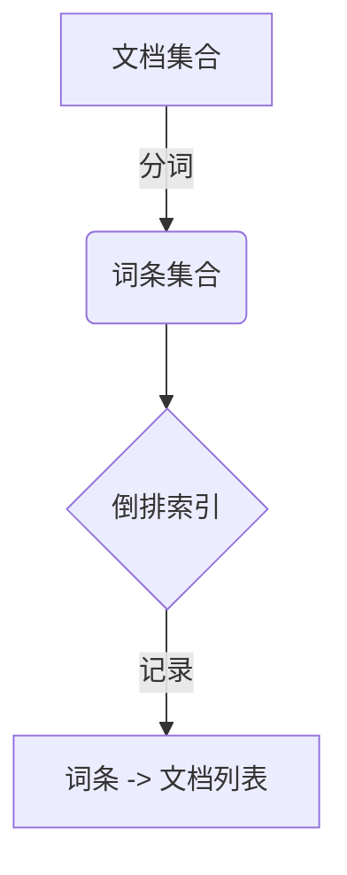
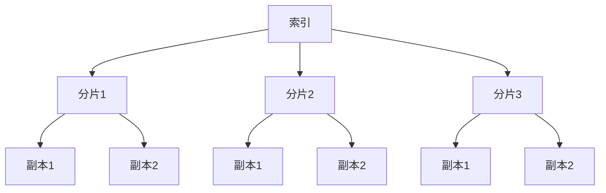
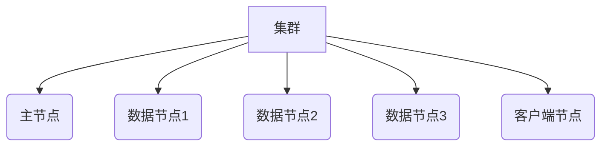
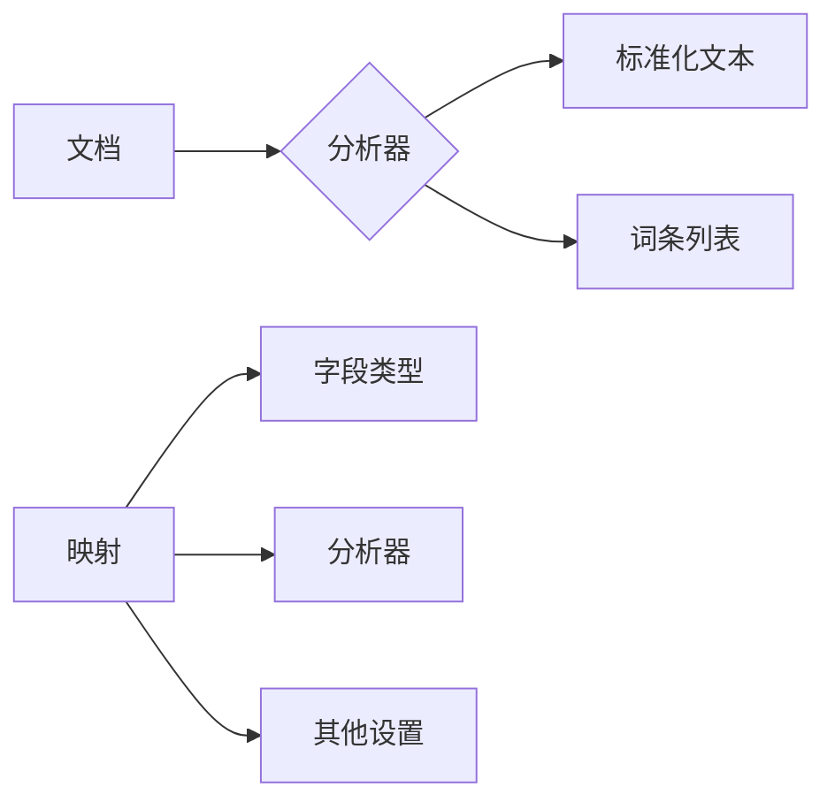
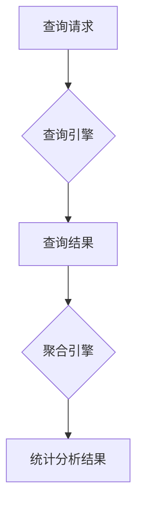

# ElasticSearch 原理与代码实例讲解

## 1. 背景介绍

### 1.1 问题的由来

在当今大数据时代，海量的数据每天都在被产生和积累。无论是来自网络日志、社交媒体还是物联网设备,这些数据都需要被高效地存储和检索。然而,传统的关系型数据库在处理非结构化和半结构化数据时存在诸多限制,无法满足现代应用对数据搜索和分析的需求。因此,一种新型的数据存储和检索解决方案应运而生 —— ElasticSearch。

### 1.2 研究现状

ElasticSearch是一个分布式、RESTful 风格的搜索和分析引擎,基于 Lucene 库构建。它能够快速存储、搜索和分析大量数据,并提供了一个简单且一致的 RESTful API,使其易于与各种编程语言集成。ElasticSearch 已经被广泛应用于各种领域,包括电子商务、日志分析、安全监控等。

### 1.3 研究意义

ElasticSearch 的出现为处理海量数据提供了一种高效、可扩展的解决方案。深入研究 ElasticSearch 的原理和实现,不仅能够帮助我们更好地利用这一强大工具,还能够加深对分布式系统、搜索引擎和数据处理的理解。本文将从理论和实践两个层面,全面探讨 ElasticSearch 的核心概念、算法原理、数学模型、代码实现和实际应用场景。

### 1.4 本文结构

本文将分为以下几个部分:

1. 背景介绍
2. ElasticSearch 核心概念与联系
3. 核心算法原理及具体操作步骤
4. 数学模型和公式详细讲解及案例分析
5. 项目实践:代码实例和详细解释说明
6. 实际应用场景
7. 工具和资源推荐
8. 总结:未来发展趋势与挑战
9. 附录:常见问题与解答

## 2. 核心概念与联系

在深入探讨 ElasticSearch 的细节之前,我们需要先了解一些核心概念及它们之间的关联。

### 2.1 倒排索引

ElasticSearch 的核心是基于倒排索引(Inverted Index)的全文搜索功能。倒排索引是一种将文档中的词条与它们所在文档的位置相关联的索引结构。与传统的正向索引相比,倒排索引更加高效地支持全文搜索。

### 2.2 分片与副本

为了实现水平扩展和高可用性,ElasticSearch 将索引划分为多个分片(Shard),每个分片可以在集群中的不同节点上进行并行操作。同时,每个分片都可以有一个或多个副本(Replica),用于提高数据冗余和查询吞吐量。

### 2.3 集群与节点

ElasticSearch 是一个分布式系统,由一个或多个节点(Node)组成集群(Cluster)。每个节点都可以承担不同的角色,如数据节点(Data Node)、主节点(Master Node)、客户端节点(Client Node)等。集群通过分片和副本实现数据的分布式存储和并行处理。

### 2.4 映射与分析器

在 ElasticSearch 中,映射(Mapping)用于定义索引中文档的结构,包括字段的数据类型、分析器等。分析器(Analyzer)则负责对文本进行分词和标准化处理,以提高搜索的准确性和效率。ElasticSearch 提供了多种内置分析器,也支持自定义分析器。

### 2.5 查询与聚合

ElasticSearch 支持多种查询方式,包括全文查询、结构化查询、地理查询等。查询的结果可以通过聚合(Aggregation)进行统计分析,如计算平均值、求和、分组等。查询和聚合功能使 ElasticSearch 不仅可以用于搜索,还可以用于数据分析和商业智能领域。

## 3. 核心算法原理 & 具体操作步骤

### 3.1 算法原理概述

ElasticSearch 的核心算法是基于 Lucene 的倒排索引和 BM25 相似度算法。

倒排索引算法通过构建词条到文档的映射关系,实现了高效的全文搜索功能。在索引构建过程中,文档会被分词,每个词条都会记录其所在文档的位置信息。查询时,只需要从倒排索引中查找包含查询词条的文档列表,就可以快速定位到相关文档。

BM25 算法是一种计算查询和文档相似度的算法,它考虑了词条在文档中出现的频率、文档长度等因素,从而能够更准确地评估文档与查询的相关性。ElasticSearch 使用 BM25 算法对搜索结果进行排序,将最相关的文档排在最前面。

### 3.2 算法步骤详解

1. **文档分析**

   首先,ElasticSearch 会对待索引的文档进行分析,包括字符过滤、分词和标准化等步骤。分析的目的是将文档转换为一个个词条,并去除无用的字符和词条。

2. **倒排索引构建**

   对于每个词条,ElasticSearch 会记录它出现的文档 ID 和在文档中的位置信息,构建倒排索引。倒排索引是一个特殊的数据结构,它将词条映射到包含该词条的文档列表。

3. **查询分析**

   当用户提交一个查询时,ElasticSearch 会对查询进行分析,将其转换为一个个词条。

4. **查询匹配**

   ElasticSearch 会从倒排索引中查找包含查询词条的文档列表,并计算每个文档与查询的相似度分数。

5. **相似度计算**

   ElasticSearch 使用 BM25 算法计算文档与查询的相似度分数。BM25 算法考虑了词条频率、文档长度等因素,能够更准确地评估相关性。

6. **结果排序**

   根据相似度分数,ElasticSearch 会将搜索结果按照相关性从高到低进行排序。

7. **返回结果**

   最后,ElasticSearch 会将排序后的搜索结果返回给用户。

### 3.3 算法优缺点

**优点:**

- 高效的全文搜索能力,能够快速从海量数据中检索相关文档。
- 支持模糊查询、短语查询等高级查询功能。
- 通过分片和副本实现了水平扩展和高可用性。
- 提供了丰富的聚合和分析功能。

**缺点:**

- 对于频繁更新的数据,倒排索引需要不断重建,会带来一定的性能开销。
- 对于关系型数据,ElasticSearch 的查询效率可能不如关系型数据库。
- 分布式架构带来了一定的复杂性,需要更多的维护和管理工作。

### 3.4 算法应用领域

ElasticSearch 的核心算法适用于以下领域:

- 全文搜索:如电商网站的商品搜索、网站内容搜索等。
- 日志分析:通过搜索和聚合功能分析系统日志,发现异常和问题。
- 安全监控:实时监控安全事件,快速发现和响应威胁。
- 商业智能:利用聚合功能进行数据分析和可视化。
- 推荐系统:基于用户行为数据,为用户推荐感兴趣的内容。

## 4. 数学模型和公式 & 详细讲解 & 举例说明

### 4.1 数学模型构建

ElasticSearch 的核心算法 BM25 是基于概率模型构建的。我们假设有一个查询 $q$,包含一组词条 $\{q_1, q_2, \ldots, q_m\}$,需要从文档集合 $D$ 中检索与查询相关的文档。

对于每个文档 $d \in D$,我们计算它与查询 $q$ 的相似度分数 $\text{score}(q, d)$。分数越高,表示文档与查询越相关。BM25 模型定义了 $\text{score}(q, d)$ 的计算公式如下:

$$\text{score}(q, d) = \sum_{i=1}^m \text{IDF}(q_i) \cdot \frac{\text{TF}(q_i, d) \cdot (k_1 + 1)}{\text{TF}(q_i, d) + k_1 \cdot (1 - b + b \cdot \frac{|d|}{\text{avgdl}})}$$

其中:

- $\text{IDF}(q_i)$ 是词条 $q_i$ 的逆向文档频率(Inverse Document Frequency),用于衡量词条的重要性。
- $\text{TF}(q_i, d)$ 是词条 $q_i$ 在文档 $d$ 中出现的词频(Term Frequency)。
- $k_1$ 和 $b$ 是调节因子,用于控制词频和文档长度对相似度分数的影响。
- $|d|$ 是文档 $d$ 的长度(词条数)。
- $\text{avgdl}$ 是文档集合的平均文档长度。

### 4.2 公式推导过程

BM25 公式的推导过程如下:

1. 假设每个文档 $d$ 都有一个相关性值 $\text{Rel}(d)$,表示它与查询 $q$ 的相关程度。
2. 根据概率理论,我们可以计算文档 $d$ 生成查询 $q$ 的概率 $P(q|d)$,并将其作为相似度分数:

   $$\text{score}(q, d) = P(q|d) \propto P(d) \cdot P(q|d, \text{Rel}(d))$$

3. 进一步假设查询词条之间是独立的,我们可以将 $P(q|d, \text{Rel}(d))$ 分解为:

   $$P(q|d, \text{Rel}(d)) = \prod_{i=1}^m P(q_i|d, \text{Rel}(d))$$

4. 引入 $\text{TF}(q_i, d)$ 和 $\text{IDF}(q_i)$ 作为估计 $P(q_i|d, \text{Rel}(d))$ 的因子,并经过一系列近似和简化,我们可以得到 BM25 公式。

### 4.3 案例分析与讲解

假设我们有一个文档集合 $D$,包含以下三个文档:

- $d_1$: "ElasticSearch is a distributed search engine."
- $d_2$: "ElasticSearch is based on Lucene."
- $d_3$: "Lucene is a full-text search library."

现在我们要搜索查询 $q = \text{"ElasticSearch Lucene"}$,计算每个文档与查询的相似度分数。

首先,我们需要计算每个词条的 $\text{IDF}$ 值:

- $\text{IDF}(\text{"ElasticSearch"}) = \log \frac{3 + 1}{2 + 1} \approx 0.29$
- $\text{IDF}(\text{"Lucene"}) = \log \frac{3 + 1}{2 + 1} \approx 0.29$

其次,计算每个文档中词条的 $\text{TF}$ 值:

- $\text{TF}(\text{"ElasticSearch"}, d_1) = 1$
- $\text{TF}(\text{"ElasticSearch"}, d_2) = 1$