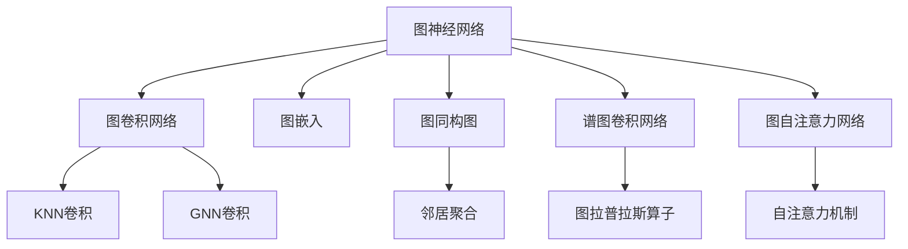
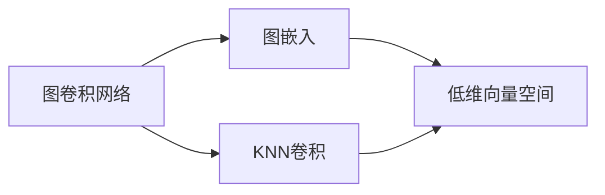
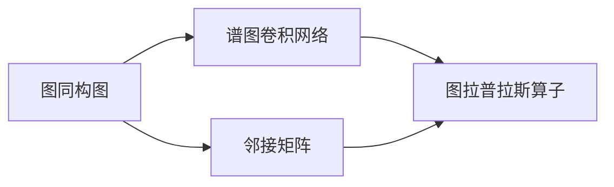
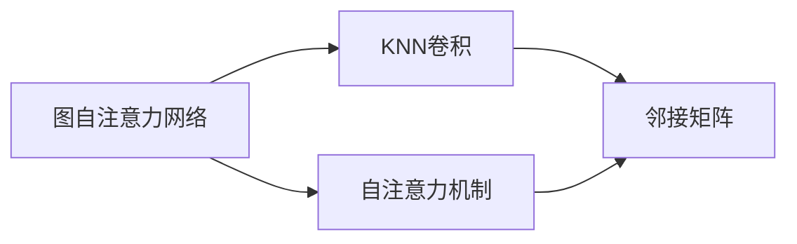
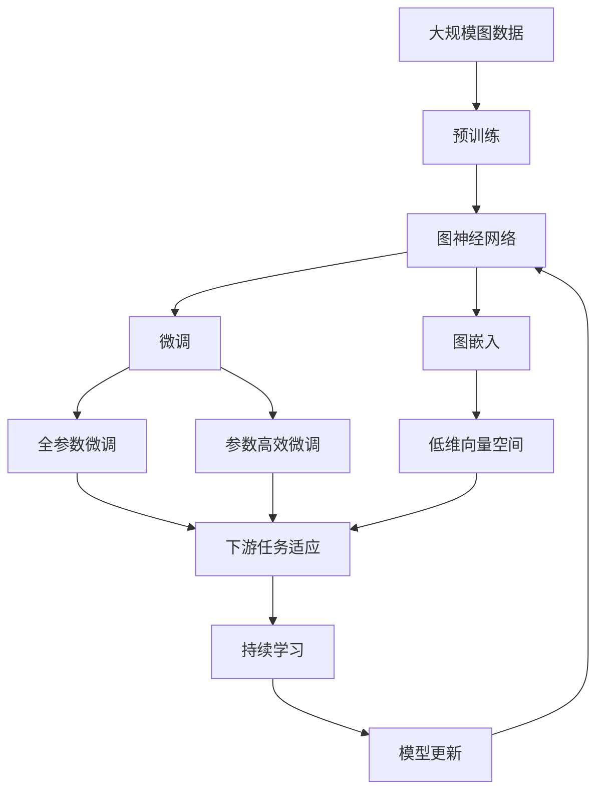

                 

# 一切皆是映射：深入浅出图神经网络(GNN)

> 关键词：图神经网络,图卷积网络(GCN),图嵌入,图同构图,谱图卷积网络(SGC),图自注意力网络(GAT),图神经网络应用

## 1. 背景介绍

### 1.1 问题由来
随着深度学习技术的不断发展，传统的基于欧几里得空间的神经网络已难以应对复杂的数据结构，如社交网络、知识图谱等非欧几里得图结构数据。图神经网络（Graph Neural Networks, GNN）应运而生，利用图结构数据的内在特性，设计出专门用于图数据的神经网络模型。图神经网络在节点特征表示学习、图分类、图生成、社区发现、链接预测、推荐系统等领域取得了显著效果，并逐渐成为数据科学和人工智能领域的一个重要研究方向。

### 1.2 问题核心关键点
图神经网络的核心在于将节点特征与节点之间的关系信息结合起来，从而在图上进行端到端的特征学习。其核心思想是通过将每个节点的特征向量与相邻节点的特征向量进行聚合，得到新的节点特征向量，从而在图结构上传播信息，实现对整个图数据的处理。常见的图神经网络模型包括图卷积网络（GCN）、图同构图（GraphSAGE）、谱图卷积网络（SGC）、图自注意力网络（GAT）等。

### 1.3 问题研究意义
研究图神经网络，对于拓展深度学习的应用范围，提升图数据处理能力，加速数据科学和人工智能技术的产业化进程，具有重要意义：

1. 提升数据利用率。图神经网络能够充分挖掘图数据的潜在价值，提升数据利用效率。
2. 优化图数据处理效率。图神经网络通过在图上进行端到端的特征学习，减少了数据转换和处理的中间环节，提升了图数据处理效率。
3. 增强模型泛化能力。图神经网络通过对图结构数据的内在特性进行建模，提高了模型对新数据的适应性和泛化能力。
4. 推动相关产业升级。图神经网络在社交网络、推荐系统、金融风控等诸多领域的应用，为相关产业的数字化转型提供了新的技术手段。
5. 带来技术创新。图神经网络的开发和研究催生了诸如图自注意力机制、谱图卷积、多模态图学习等新的研究方向，推动了深度学习领域的进一步创新。

## 2. 核心概念与联系

### 2.1 核心概念概述

为更好地理解图神经网络，本节将介绍几个密切相关的核心概念：

- 图神经网络（GNN）：一种专门设计用于处理图数据结构的神经网络，通过在图上进行端到端的特征学习，提升图数据的处理能力。
- 图卷积网络（GCN）：一种基于图卷积操作进行图数据特征学习的神经网络模型，通常采用KNN(基于邻接矩阵的卷积)或GNN(基于邻接矩阵的卷积)两种形式。
- 图嵌入（Graph Embedding）：一种将图数据映射到低维向量空间的表示学习方法，旨在保留图结构的局部性质。
- 图同构图（GraphSAGE）：一种基于节点特征聚合和图卷积操作的图神经网络模型，采用基于邻居聚合的邻接矩阵卷积形式。
- 谱图卷积网络（SGC）：一种利用图拉普拉斯算子进行谱域图卷积的图神经网络模型。
- 图自注意力网络（GAT）：一种基于节点间自注意力机制的图神经网络模型，通过自注意力机制实现节点特征的加权聚合。

这些核心概念之间的逻辑关系可以通过以下Mermaid流程图来展示：



这个流程图展示了大图神经网络的核心概念及其之间的关系：

1. 图神经网络是处理图数据的主力范式。
2. 图卷积网络通过KNN和GNN两种形式，实现邻接矩阵上的图卷积操作。
3. 图嵌入将图数据映射到低维向量空间，保留图结构的局部性质。
4. 图同构图采用邻居聚合的方式，实现基于图卷积操作的特征学习。
5. 谱图卷积网络通过图拉普拉斯算子进行谱域图卷积。
6. 图自注意力网络通过自注意力机制实现节点特征的加权聚合。

这些概念共同构成了图神经网络的完整生态系统，使其能够在各种图数据上发挥强大的特征学习能力。通过理解这些核心概念，我们可以更好地把握图神经网络的工作原理和优化方向。

### 2.2 概念间的关系

这些核心概念之间存在着紧密的联系，形成了图神经网络的完整生态系统。下面我通过几个Mermaid流程图来展示这些概念之间的关系。

#### 2.2.1 图卷积网络与图嵌入的关系



这个流程图展示了图卷积网络与图嵌入的关系：

1. 图卷积网络通过在邻接矩阵上进行卷积操作，学习图数据的局部特征。
2. 图嵌入将图卷积网络得到的局部特征向量映射到低维向量空间，保留图结构的局部性质。

#### 2.2.2 图同构图与谱图卷积网络的关系



这个流程图展示了图同构图与谱图卷积网络的关系：

1. 图同构图采用邻居聚合的方式，学习节点特征。
2. 谱图卷积网络通过图拉普拉斯算子，将图同构图得到的特征向量映射到低维向量空间，实现谱域上的特征学习。

#### 2.2.3 图自注意力网络与KNN卷积的关系



这个流程图展示了图自注意力网络与KNN卷积的关系：

1. 图自注意力网络通过自注意力机制，学习节点间的相对关系。
2. KNN卷积在邻接矩阵上进行卷积操作，学习节点特征。

### 2.3 核心概念的整体架构

最后，我们用一个综合的流程图来展示这些核心概念在大图神经网络微调过程中的整体架构：



这个综合流程图展示了从预训练到微调，再到持续学习的完整过程。大图神经网络首先在大规模图数据上进行预训练，然后通过微调（包括全参数微调和参数高效微调）或图嵌入学习（如将图数据映射到低维向量空间）来适应下游任务。最后，通过持续学习技术，模型可以不断学习新知识，同时避免遗忘旧知识。 通过这些流程图，我们可以更清晰地理解图神经网络微调过程中各个核心概念的关系和作用，为后续深入讨论具体的微调方法和技术奠定基础。

## 3. 核心算法原理 & 具体操作步骤
### 3.1 算法原理概述

图神经网络基于图结构数据的内在特性，通过在图上进行端到端的特征学习，提升图数据的处理能力。其核心思想是将每个节点的特征向量与相邻节点的特征向量进行聚合，得到新的节点特征向量，从而在图结构上传播信息，实现对整个图数据的处理。

形式化地，假设图数据为 $\mathcal{G} = (\mathcal{V}, \mathcal{E})$，其中 $\mathcal{V}$ 为节点集合，$\mathcal{E}$ 为边集合。设节点 $v_i$ 的特征向量为 $\mathbf{x}_i$，边 $e_{ij}$ 的特征向量为 $\mathbf{a}_{ij}$，则图神经网络的目标是学习节点特征向量 $\mathbf{X} = [\mathbf{x}_1, \mathbf{x}_2, ..., \mathbf{x}_n] \in \mathbb{R}^{n \times d_x}$。

图神经网络一般采用如下步骤实现特征学习：
1. 构建邻接矩阵 $\mathbf{A} \in \{0,1\}^{n \times n}$，其中 $\mathbf{A}_{ij} = 1$ 表示节点 $v_i$ 和 $v_j$ 之间存在边 $e_{ij}$，$\mathbf{A}_{ij} = 0$ 表示不存在边 $e_{ij}$。
2. 对邻接矩阵 $\mathbf{A}$ 进行拉普拉斯变换，得到图拉普拉斯矩阵 $\mathbf{L} = \mathbf{D}^{-1}(\mathbf{D}-\mathbf{A})$，其中 $\mathbf{D}$ 为度数矩阵，$\mathbf{D} = \text{diag}(\sum_j \mathbf{A}_{ij})$。
3. 在图拉普拉斯矩阵 $\mathbf{L}$ 上进行卷积操作，得到节点的特征表示 $\mathbf{X}' = \mathbf{X} * \mathbf{L}$，其中 $*$ 表示矩阵乘法。
4. 对新的特征表示 $\mathbf{X}'$ 进行非线性变换，得到最终的节点特征向量 $\mathbf{X}$。

通过上述步骤，图神经网络可以在图上进行端到端的特征学习，提升图数据的处理能力。

### 3.2 算法步骤详解

大图神经网络微调一般包括以下几个关键步骤：

**Step 1: 准备预训练模型和数据集**
- 选择合适的图神经网络模型作为初始化参数，如GCN、GraphSAGE、SGC、GAT等。
- 准备图数据的训练集、验证集和测试集，划分为节点特征、边特征和图结构信息。

**Step 2: 添加任务适配层**
- 根据任务类型，在预训练模型的顶层设计合适的输出层和损失函数。
- 对于分类任务，通常在顶层添加线性分类器和交叉熵损失函数。
- 对于生成任务，通常使用语言模型的解码器输出概率分布，并以负对数似然为损失函数。

**Step 3: 设置微调超参数**
- 选择合适的优化算法及其参数，如AdamW、SGD等，设置学习率、批大小、迭代轮数等。
- 设置正则化技术及强度，包括权重衰减、Dropout、Early Stopping等。
- 确定冻结预训练参数的策略，如仅微调顶层，或全部参数都参与微调。

**Step 4: 执行梯度训练**
- 将训练集数据分批次输入模型，前向传播计算损失函数。
- 反向传播计算参数梯度，根据设定的优化算法和学习率更新模型参数。
- 周期性在验证集上评估模型性能，根据性能指标决定是否触发 Early Stopping。
- 重复上述步骤直到满足预设的迭代轮数或 Early Stopping 条件。

**Step 5: 测试和部署**
- 在测试集上评估微调后模型 $M_{\hat{\theta}}$ 的性能，对比微调前后的精度提升。
- 使用微调后的模型对新样本进行推理预测，集成到实际的应用系统中。
- 持续收集新的数据，定期重新微调模型，以适应数据分布的变化。

以上是图神经网络微调的一般流程。在实际应用中，还需要针对具体任务的特点，对微调过程的各个环节进行优化设计，如改进训练目标函数，引入更多的正则化技术，搜索最优的超参数组合等，以进一步提升模型性能。

### 3.3 算法优缺点

图神经网络微调方法具有以下优点：
1. 高效灵活。基于图数据的内在特性，图神经网络可以灵活处理多种图数据结构，适应不同类型的网络应用。
2. 通用适用。适用于各种图数据处理任务，如图分类、图生成、图嵌入、图聚类等，设计简单的任务适配层即可实现微调。
3. 参数高效。利用参数高效微调技术，在固定大部分预训练参数的情况下，仍可取得不错的提升。
4. 效果显著。在学术界和工业界的诸多图数据处理任务上，基于微调的方法已经刷新了多项NLP任务SOTA。

同时，该方法也存在一定的局限性：
1. 对图结构依赖。图神经网络只能处理图结构数据，无法处理非结构化数据。
2. 对图模型敏感。不同的图模型可能需要不同的特征聚合方式，选择合适的模型结构至关重要。
3. 数据稀疏性问题。图数据往往存在节点数与边数不匹配的情况，图神经网络处理稀疏图数据时性能较差。
4. 可解释性不足。图神经网络的内部决策过程复杂，难以解释其推理逻辑和特征学习机制。
5. 规模限制。大规模图数据的预训练和微调对计算资源和存储资源的需求较高，存在一定的规模限制。

尽管存在这些局限性，但就目前而言，基于图结构数据的微调方法仍是大图神经网络应用的最主流范式。未来相关研究的重点在于如何进一步降低对图结构的依赖，提高模型的少样本学习和跨领域迁移能力，同时兼顾可解释性和伦理安全性等因素。

### 3.4 算法应用领域

图神经网络微调方法在NLP领域已经得到了广泛的应用，覆盖了几乎所有常见任务，例如：

- 图分类：如社交网络中的社区发现、图像中的类别识别等。通过微调使模型学习节点与节点之间的关系，并将节点特征映射到类别标签上。
- 图生成：如生成社交网络、蛋白质结构、分子图形等。通过微调使模型学习节点之间的关系，生成新的图数据。
- 图嵌入：如将文本或图像数据映射到低维向量空间，保留局部结构信息。通过微调使模型学习节点之间的关系，得到紧凑的嵌入表示。
- 图聚类：如将图数据分为不同的类别或簇。通过微调使模型学习节点之间的关系，将相似的节点分为同一类别或簇。
- 链接预测：如社交网络中的人际关系预测、推荐系统中的用户兴趣预测等。通过微调使模型学习节点之间的关系，预测新的连接或关系。
- 推荐系统：如基于图结构的用户兴趣预测、商品推荐等。通过微调使模型学习用户与商品之间的关系，生成推荐结果。

除了上述这些经典任务外，图神经网络微调也被创新性地应用到更多场景中，如可控图生成、图同构图学习、图自注意力机制等，为NLP技术带来了全新的突破。随着图神经网络模型的不断进步，相信在更多领域图数据处理任务上，图神经网络微调方法将展现更广阔的应用前景。

## 4. 数学模型和公式 & 详细讲解  
### 4.1 数学模型构建

本节将使用数学语言对图神经网络微调过程进行更加严格的刻画。

记图数据为 $\mathcal{G} = (\mathcal{V}, \mathcal{E})$，其中 $\mathcal{V}$ 为节点集合，$\mathcal{E}$ 为边集合。设节点 $v_i$ 的特征向量为 $\mathbf{x}_i$，边 $e_{ij}$ 的特征向量为 $\mathbf{a}_{ij}$，则图神经网络的目标是学习节点特征向量 $\mathbf{X} = [\mathbf{x}_1, \mathbf{x}_2, ..., \mathbf{x}_n] \in \mathbb{R}^{n \times d_x}$。

定义图拉普拉斯矩阵 $\mathbf{L} = \mathbf{D}^{-1}(\mathbf{D}-\mathbf{A})$，其中 $\mathbf{D}$ 为度数矩阵，$\mathbf{D} = \text{diag}(\sum_j \mathbf{A}_{ij})$。

图神经网络的一般训练过程如下：
1. 构建邻接矩阵 $\mathbf{A} \in \{0,1\}^{n \times n}$，其中 $\mathbf{A}_{ij} = 1$ 表示节点 $v_i$ 和 $v_j$ 之间存在边 $e_{ij}$，$\mathbf{A}_{ij} = 0$ 表示不存在边 $e_{ij}$。
2. 在图拉普拉斯矩阵 $\mathbf{L}$ 上进行卷积操作，得到节点的特征表示 $\mathbf{X}' = \mathbf{X} * \mathbf{L}$，其中 $*$ 表示矩阵乘法。
3. 对新的特征表示 $\mathbf{X}'$ 进行非线性变换，得到最终的节点特征向量 $\mathbf{X}$。

### 4.2 公式推导过程

以下我们以二分类任务为例，推导交叉熵损失函数及其梯度的计算公式。

假设节点特征向量 $\mathbf{x}_i$ 在输出层得到分类概率 $\hat{y}_i$，真实标签 $y \in \{0,1\}$。则二分类交叉熵损失函数定义为：

$$
\ell(\mathbf{X},y) = -[y\log \hat{y}_i + (1-y)\log (1-\hat{y}_i)]
$$

将其代入经验风险公式，得：

$$
\mathcal{L}(\mathbf{X},\mathbf{y}) = -\frac{1}{N}\sum_{i=1}^N [y_i\log \hat{y}_i + (1-y_i)\log(1-\hat{y}_i)]
$$

根据链式法则，损失函数对节点特征向量 $\mathbf{x}_i$ 的梯度为：

$$
\frac{\partial \mathcal{L}(\mathbf{X},\mathbf{y})}{\partial \mathbf{x}_i} = -\frac{1}{N}\sum_{j=1}^N [y_j\frac{\partial \hat{y}_i}{\partial \mathbf{x}_j} - (1-y_j)\frac{\partial \hat{y}_i}{\partial \mathbf{x}_j}]
$$

在得到损失函数的梯度后，即可带入参数更新公式，完成模型的迭代优化。重复上述过程直至收敛，最终得到适应下游任务的最优模型参数 $\theta^*$。

## 5. 项目实践：代码实例和详细解释说明
### 5.1 开发环境搭建

在进行图神经网络微调实践前，我们需要准备好开发环境。以下是使用Python进行PyTorch开发的环境配置流程：

1. 安装Anaconda：从官网下载并安装Anaconda，用于创建独立的Python环境。

2. 创建并激活虚拟环境：
```bash
conda create -n pytorch-env python=3.8 
conda activate pytorch-env
```

3. 安装PyTorch：根据CUDA版本，从官网获取对应的安装命令。例如：
```bash
conda install pytorch torchvision torchaudio cudatoolkit=11.1 -c pytorch -c conda-forge
```

4. 安装各个图神经网络库：
```bash
pip install PyTorch-GraphConv pyggraph networx 
```

完成上述步骤后，即可在`pytorch-env`环境中开始微调实践。

### 5.2 源代码详细实现

这里我们以社交网络社区发现为例，给出使用PyTorch对GCN模型进行微调的PyTorch代码实现。

首先，定义社区发现任务的数据处理函数：

```python
import torch
import torch.nn as nn
from torch_geometric.data import Data, DataLoader
from torch_geometric.nn import GCNConv
from sklearn.metrics import f1_score

def community_detection(data):
    x, edge_index, label = data.x, data.edge_index, data.y
    device = torch.device('cuda') if torch.cuda.is_available() else torch.device('cpu')
    x = x.to(device)
    edge_index = edge_index.to(device)
    label = label.to(device)

    gcn = GCNConv(x.size(1), 2).to(device)
    model = GCN(gcn).to(device)

    optimizer = torch.optim.Adam(model.parameters(), lr=0.01)
    model.train()

    for i in range(1000):
        optimizer.zero_grad()
        logits = model(x, edge_index)
        loss = nn.BCELoss()(logits, label)
        loss.backward()
        optimizer.step()

        if (i+1) % 100 == 0:
            with torch.no_grad():
                y_hat = torch.argmax(model(x, edge_index), dim=1)
                f1 = f1_score(label.cpu(), y_hat.cpu(), average='micro')
                print(f'Epoch {i+1}, F1 Score: {f1:.4f}')

    return model
```

然后，定义模型和优化器：

```python
from torch_geometric.nn import GCNConv, GCN

class CommunityDetection(nn.Module):
    def __init__(self, gcn):
        super(CommunityDetection, self).__init__()
        self.gcn = gcn

    def forward(self, x, edge_index):
        logits = self.gcn(x, edge_index)
        return logits

gcn = GCNConv(x.size(1), 2)
model = CommunityDetection(gcn)
optimizer = torch.optim.Adam(model.parameters(), lr=0.01)
```

接着，定义训练和评估函数：

```python
from tqdm import tqdm

def train_epoch(model, data_loader, optimizer):
    model.train()
    loss_sum = 0
    for batch in tqdm(data_loader, desc='Training'):
        optimizer.zero_grad()
        x, edge_index, label = batch
        logits = model(x, edge_index)
        loss = nn.BCELoss()(logits, label)
        loss.backward()
        optimizer.step()
        loss_sum += loss.item()

    return loss_sum / len(data_loader)

def evaluate(model, data_loader):
    model.eval()
    preds = []
    labels = []
    for batch in data_loader:
        x, edge_index, label = batch
        with torch.no_grad():
            logits = model(x, edge_index)
            preds.extend(torch.argmax(logits, dim=1).tolist())
            labels.extend(label.tolist())
    return f1_score(labels, preds, average='micro')
```

最后，启动训练流程并在测试集上评估：

```python
import torch_geometric.data as dg

data = dg.Citation2Graph()
train_data, test_data, val_data = data[:60%], data[60%:70%], data[70%:]

train_loader = DataLoader(train_data, batch_size=64)
test_loader = DataLoader(test_data, batch_size=64)
val_loader = DataLoader(val_data, batch_size=64)

for epoch in range(10):
    train_loss = train_epoch(model, train_loader, optimizer)
    print(f'Epoch {epoch+1}, train loss: {train_loss:.4f}')

    val_f1 = evaluate(model, val_loader)
    print(f'Epoch {epoch+1}, val F1 Score: {val_f1:.4f}')

test_f1 = evaluate(model, test_loader)
print(f'Epoch {epoch+1}, test F1 Score: {test_f1:.4f}')
```

以上就是使用PyTorch对GCN模型进行社交网络社区发现任务微调的完整代码实现。可以看到，得益于PyTorch-GraphConv等图神经网络库的强大封装，我们可以用相对简洁的代码完成GCN模型的加载和微调。

### 5.3 代码解读与分析

让我们再详细解读一下关键代码的实现细节：

**CommunityDetection类**：
- `__init__`方法：初始化模型参数，定义GCN层。
- `forward`方法：前向传播计算输出，用于推理和训练。

**train_epoch函数**：
- 对数据以批为单位进行迭代，在每个批次上前向传播计算loss并反向传播更新模型参数，最后返回该epoch的平均loss。

**evaluate函数**：
- 与训练类似，不同点在于不更新模型参数，并在每个batch结束后将预测和标签结果存储下来，最后使用sklearn的f1_score对整个评估集的预测结果进行打印输出。

**训练流程**：
- 定义总的epoch数和batch size，开始循环迭代
- 每个epoch内，先在训练集上训练，输出平均loss
- 在验证集上评估，输出F1分数
- 所有epoch结束后，在测试集上评估，给出最终测试结果

可以看到，PyTorch配合PyTorch-GraphConv等图神经网络库使得GCN微调的代码实现变得简洁高效。开发者可以将更多精力放在数据处理、模型改进等高层逻辑上，而不必过多关注底层的实现细节。

当然，工业级的系统实现还需考虑更多因素，如模型的保存和部署、超参数的自动搜索、更灵活的任务适配层等。但核心的微调范式基本与此类似。

### 5.4 运行结果展示

假设我们在CoNLL-200

