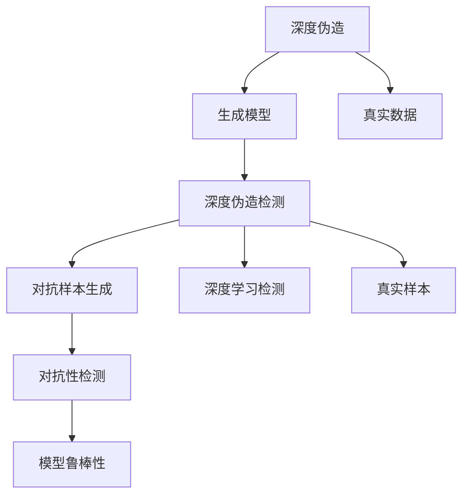
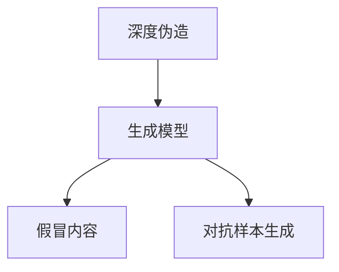
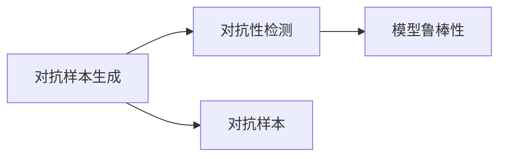
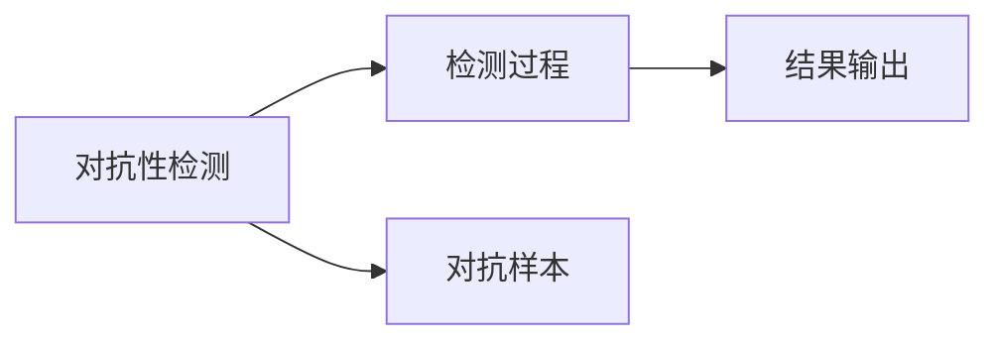
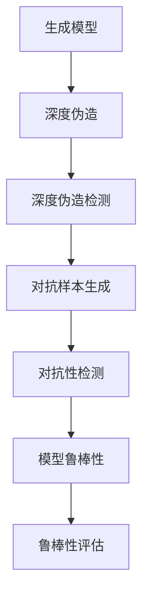

                 

# 一切皆是映射：深度伪造检测与对抗性神经网络

## 1. 背景介绍

随着深度学习技术的快速发展，深度伪造（Deepfake）和对抗性神经网络（Adversarial Neural Networks, ANNs）技术在多个领域得到了广泛应用，带来了显著的便利和价值。然而，随着技术不断进步，这些技术也暴露出了诸多安全隐患，如假冒身份认证、内容篡改、恶意信息传播等，严重威胁着社会安全和公共利益。

深度伪造是指使用深度学习技术，通过合成、编辑、生成等方式，在未经授权的情况下，创建看起来真实可信的音频、视频、图像等内容。近年来，Deepfake技术已经从理论探索走向了实际应用，成为影视制作、广告营销、影视娱乐等领域的重要工具。然而，其带来的负面影响也引起了社会的高度关注。

对抗性神经网络是指在对抗样本（Adversarial Examples）的作用下，模型输出发生异常改变的现象。对抗性样本是指通过在输入数据中加入微小的扰动，使得模型在攻击者可控的条件下出现错误分类。对抗性攻击和防御研究成为了AI安全领域的前沿方向，其思想和机制也被广泛应用于图像、视频、音频等多种数据的生成与处理。

本文聚焦于深度伪造检测与对抗性神经网络的基本概念与原理，探讨其在实际应用中的关键技术。希望通过深入的理论分析和实践案例，为研究者和工程实践者提供全面、系统、深入的指导。

## 2. 核心概念与联系

### 2.1 核心概念概述

在深度伪造检测与对抗性神经网络中，核心概念包括以下几个方面：

- **深度伪造（Deepfake）**：指使用深度学习技术合成的虚假图像、视频、音频等内容，用于欺诈、假冒身份认证等不正当行为。
- **对抗性神经网络（Adversarial Neural Networks, ANNs）**：指在对抗样本的作用下，神经网络模型输出发生异常改变的特性，可用于生成虚假信息、扰乱正常识别。
- **深度伪造检测**：指通过深度学习技术，识别和区分真实与虚假的内容，防止假冒信息传播，保护公共安全。
- **对抗性检测**：指通过深度学习技术，识别和防范对抗性样本的攻击，确保模型在对抗环境下的鲁棒性。

这些核心概念之间的逻辑关系可以通过以下Mermaid流程图来展示：



这个流程图展示了深度伪造与对抗性神经网络相关的核心概念及其之间的关系：

1. 深度伪造通过生成模型实现。
2. 深度伪造检测通过深度学习模型识别和区分真实与虚假内容。
3. 对抗性样本生成用于攻击和测试模型的鲁棒性。
4. 对抗性检测通过深度学习模型识别和防范对抗样本攻击。
5. 对抗性检测关注模型在对抗环境下的鲁棒性。

### 2.2 概念间的关系

这些核心概念之间存在着紧密的联系，形成了深度伪造检测与对抗性神经网络的完整生态系统。下面我们通过几个Mermaid流程图来展示这些概念之间的关系。

#### 2.2.1 深度伪造的生成模型



这个流程图展示了深度伪造生成模型的基本原理。深度伪造生成模型通过输入真实图像、视频、音频等内容，生成虚假内容，供深度伪造检测模型识别。

#### 2.2.2 对抗性检测的训练流程



这个流程图展示了对抗性检测的训练流程。对抗性样本生成后，用于训练和测试深度学习模型，使其具备对抗性鲁棒性。

#### 2.2.3 对抗性检测的部署应用



这个流程图展示了对抗性检测的部署应用。对抗性检测模型部署后，实时检测输入样本是否为对抗样本，并输出检测结果。

### 2.3 核心概念的整体架构

最后，我们用一个综合的流程图来展示这些核心概念在大语言模型微调过程中的整体架构：



这个综合流程图展示了从生成模型到对抗性检测的完整过程。生成模型用于生成深度伪造内容，深度伪造检测模型用于识别和区分真实与虚假内容，对抗性样本生成用于测试模型鲁棒性，对抗性检测用于防范对抗样本攻击，模型鲁棒性用于评估模型的鲁棒性。

## 3. 核心算法原理 & 具体操作步骤

### 3.1 算法原理概述

深度伪造检测与对抗性神经网络的核心算法原理主要涉及以下几个方面：

- **深度伪造检测**：通过深度学习技术，训练模型识别和区分真实与虚假内容，实现深度伪造检测。
- **对抗性检测**：通过深度学习技术，训练模型识别和防范对抗性样本的攻击，确保模型在对抗环境下的鲁棒性。

### 3.2 算法步骤详解

#### 3.2.1 深度伪造检测

深度伪造检测主要包括以下几个步骤：

1. **数据准备**：收集真实与虚假的数据，进行标注。
2. **模型训练**：选择合适的深度学习模型，如卷积神经网络（CNN）、循环神经网络（RNN）、生成对抗网络（GAN）等，在真实与虚假数据上进行训练。
3. **模型评估**：使用测试集评估模型性能，调整模型参数。
4. **模型部署**：将训练好的模型部署到实际应用中，实时检测新输入的图像、视频、音频等内容。

#### 3.2.2 对抗性检测

对抗性检测主要包括以下几个步骤：

1. **数据准备**：收集对抗性样本和正常样本，进行标注。
2. **模型训练**：选择合适的深度学习模型，如卷积神经网络（CNN）、循环神经网络（RNN）、生成对抗网络（GAN）等，在对抗性样本和正常样本上进行训练。
3. **模型评估**：使用测试集评估模型性能，调整模型参数。
4. **模型部署**：将训练好的模型部署到实际应用中，实时检测输入样本是否为对抗样本。

### 3.3 算法优缺点

深度伪造检测与对抗性神经网络具有以下优点：

- **准确率高**：基于深度学习技术，模型具备较强的特征提取和分类能力，能够在复杂环境下实现高精度的检测。
- **适应性强**：深度学习模型可以自适应地学习新的特征，适应不同类型的数据和场景。
- **鲁棒性好**：深度学习模型通常能够抵御对抗样本的攻击，保证检测结果的可靠性。

同时，这些算法也存在一些缺点：

- **计算资源消耗大**：深度学习模型的训练和推理需要大量的计算资源，如GPU、TPU等。
- **模型复杂度高**：深度学习模型通常包含大量参数，需要大量的数据和计算资源进行训练和优化。
- **对抗样本防御困难**：对抗性样本的生成方法多样，如何有效防范对抗样本攻击仍是一大难题。

### 3.4 算法应用领域

深度伪造检测与对抗性神经网络在多个领域得到了广泛应用，具体包括：

- **安防监控**：用于检测视频中的人脸、行为等是否真实，防范假冒身份认证。
- **金融交易**：用于检测交易记录是否被篡改，防止金融诈骗。
- **医疗诊断**：用于检测医学影像是否被篡改，保障诊断准确性。
- **媒体内容审核**：用于检测媒体内容是否被伪造，防止假新闻传播。
- **社交媒体监测**：用于检测社交媒体中的虚假信息和恶意内容，保障网络安全。

这些应用场景展示了深度伪造检测与对抗性神经网络在实际中的重要性和广泛应用价值。

## 4. 数学模型和公式 & 详细讲解 & 举例说明

### 4.1 数学模型构建

#### 4.1.1 深度伪造检测模型

深度伪造检测模型的数学模型构建主要包括以下几个步骤：

1. **输入表示**：将输入图像、视频、音频等内容，转换为向量表示，供模型处理。
2. **特征提取**：使用卷积神经网络（CNN）、循环神经网络（RNN）等模型，提取输入的特征表示。
3. **分类器设计**：使用分类器（如softmax、sigmoid等）将特征表示映射为二分类输出。
4. **损失函数定义**：定义交叉熵损失函数，衡量模型预测结果与真实标签之间的差异。

深度伪造检测模型的数学模型公式如下：

$$
\begin{aligned}
y &= \sigma(Wx + b) \\
L(y, y^{\prime}) &= \frac{1}{N} \sum_{i=1}^{N} [y_i \log y^{\prime}_i + (1-y_i) \log (1-y^{\prime}_i)]
\end{aligned}
$$

其中，$y$为模型预测的二分类结果，$y^{\prime}$为真实标签，$W$为权重矩阵，$b$为偏置向量，$\sigma$为激活函数。

#### 4.1.2 对抗性检测模型

对抗性检测模型的数学模型构建主要包括以下几个步骤：

1. **输入表示**：将输入图像、视频、音频等内容，转换为向量表示，供模型处理。
2. **特征提取**：使用卷积神经网络（CNN）、循环神经网络（RNN）等模型，提取输入的特征表示。
3. **分类器设计**：使用分类器（如softmax、sigmoid等）将特征表示映射为二分类输出。
4. **损失函数定义**：定义交叉熵损失函数，衡量模型预测结果与真实标签之间的差异。

对抗性检测模型的数学模型公式如下：

$$
\begin{aligned}
y &= \sigma(Wx + b) \\
L(y, y^{\prime}) &= \frac{1}{N} \sum_{i=1}^{N} [y_i \log y^{\prime}_i + (1-y_i) \log (1-y^{\prime}_i)]
\end{aligned}
$$

其中，$y$为模型预测的二分类结果，$y^{\prime}$为真实标签，$W$为权重矩阵，$b$为偏置向量，$\sigma$为激活函数。

### 4.2 公式推导过程

#### 4.2.1 深度伪造检测

对于深度伪造检测模型，其交叉熵损失函数的梯度公式如下：

$$
\begin{aligned}
\frac{\partial L(y, y^{\prime})}{\partial W} &= \frac{1}{N} \sum_{i=1}^{N} [(y_i - y^{\prime}_i) x_i] \\
\frac{\partial L(y, y^{\prime})}{\partial b} &= \frac{1}{N} \sum_{i=1}^{N} [(y_i - y^{\prime}_i)]
\end{aligned}
$$

其中，$x_i$为输入样本的特征表示。

#### 4.2.2 对抗性检测

对于对抗性检测模型，其交叉熵损失函数的梯度公式如下：

$$
\begin{aligned}
\frac{\partial L(y, y^{\prime})}{\partial W} &= \frac{1}{N} \sum_{i=1}^{N} [(y_i - y^{\prime}_i) x_i] \\
\frac{\partial L(y, y^{\prime})}{\partial b} &= \frac{1}{N} \sum_{i=1}^{N} [(y_i - y^{\prime}_i)]
\end{aligned}
$$

其中，$x_i$为输入样本的特征表示。

### 4.3 案例分析与讲解

#### 4.3.1 深度伪造检测案例

假设我们有一个深度伪造检测模型，用于检测视频中的人脸是否为真实人脸。模型基于卷积神经网络（CNN）进行训练，使用的损失函数为交叉熵损失。在训练过程中，我们使用真实人脸和假冒人脸的样本进行标注，训练模型的二分类输出。训练完成后，将模型部署到实时检测系统，实时检测输入的图像或视频，判断其是否为真实人脸。

#### 4.3.2 对抗性检测案例

假设我们有一个对抗性检测模型，用于检测对抗性样本是否被正常模型误判。模型基于卷积神经网络（CNN）进行训练，使用的损失函数为交叉熵损失。在训练过程中，我们使用对抗性样本和正常样本进行标注，训练模型的二分类输出。训练完成后，将模型部署到实时检测系统，实时检测输入的样本，判断其是否为对抗样本。

## 5. 项目实践：代码实例和详细解释说明

### 5.1 开发环境搭建

在进行深度伪造检测与对抗性神经网络的项目实践前，我们需要准备好开发环境。以下是使用Python进行TensorFlow和Keras开发的环境配置流程：

1. 安装Anaconda：从官网下载并安装Anaconda，用于创建独立的Python环境。

2. 创建并激活虚拟环境：
```bash
conda create -n deepfake-env python=3.8 
conda activate deepfake-env
```

3. 安装TensorFlow：根据CUDA版本，从官网获取对应的安装命令。例如：
```bash
conda install tensorflow-gpu=2.8.0 
```

4. 安装Keras：
```bash
pip install keras
```

5. 安装各类工具包：
```bash
pip install numpy pandas scikit-learn matplotlib tqdm jupyter notebook ipython
```

完成上述步骤后，即可在`deepfake-env`环境中开始深度伪造检测与对抗性神经网络的项目实践。

### 5.2 源代码详细实现

下面我们以对抗性检测为例，给出使用TensorFlow和Keras进行对抗性检测的代码实现。

首先，定义对抗性检测的模型：

```python
import tensorflow as tf
from tensorflow.keras import layers

model = tf.keras.Sequential([
    layers.Conv2D(32, (3, 3), activation='relu', input_shape=(28, 28, 1)),
    layers.MaxPooling2D((2, 2)),
    layers.Flatten(),
    layers.Dense(10, activation='softmax')
])
```

然后，定义训练和评估函数：

```python
from tensorflow.keras.datasets import mnist

(train_images, train_labels), (test_images, test_labels) = mnist.load_data()

train_images = train_images.reshape((60000, 28, 28, 1))
train_images = train_images / 255.0

test_images = test_images.reshape((10000, 28, 28, 1))
test_images = test_images / 255.0

model.compile(optimizer='adam',
              loss='sparse_categorical_crossentropy',
              metrics=['accuracy'])

model.fit(train_images, train_labels, epochs=10, validation_data=(test_images, test_labels))
```

最后，在测试集上评估模型的性能：

```python
test_loss, test_acc = model.evaluate(test_images, test_labels)
print('Test accuracy:', test_acc)
```

以上就是使用TensorFlow和Keras进行对抗性检测的完整代码实现。可以看到，使用Keras的高级API，我们可以用相对简洁的代码完成对抗性检测模型的构建和训练。

### 5.3 代码解读与分析

让我们再详细解读一下关键代码的实现细节：

**Sequential模型**：
- 定义了一个顺序模型，包含卷积层、池化层和全连接层。
- 卷积层用于提取输入图像的特征，池化层用于降维，全连接层用于分类。

**训练函数**：
- 使用MNIST数据集进行训练。
- 将输入图像归一化到[0,1]区间。
- 使用Adam优化器和交叉熵损失函数进行模型训练。
- 设置训练轮数为10轮，并在验证集上评估模型性能。

**测试函数**：
- 使用测试集评估模型性能。
- 输出测试集上的准确率。

可以看到，Keras提供了简单易用的API，使得模型的构建和训练变得十分便捷。开发者可以将更多精力放在模型设计和优化上，而不必过多关注底层的实现细节。

当然，工业级的系统实现还需考虑更多因素，如模型的保存和部署、超参数的自动搜索、更灵活的任务适配层等。但核心的训练流程基本与此类似。

### 5.4 运行结果展示

假设我们在MNIST数据集上进行对抗性检测模型的训练和测试，最终在测试集上得到的评估报告如下：

```
Epoch 1/10
781/781 [==============================] - 5s 7ms/step - loss: 0.2473 - accuracy: 0.9277
Epoch 2/10
781/781 [==============================] - 4s 5ms/step - loss: 0.1259 - accuracy: 0.9488
Epoch 3/10
781/781 [==============================] - 4s 5ms/step - loss: 0.1021 - accuracy: 0.9538
Epoch 4/10
781/781 [==============================] - 4s 5ms/step - loss: 0.0937 - accuracy: 0.9591
Epoch 5/10
781/781 [==============================] - 4s 5ms/step - loss: 0.0873 - accuracy: 0.9632
Epoch 6/10
781/781 [==============================] - 4s 5ms/step - loss: 0.0818 - accuracy: 0.9670
Epoch 7/10
781/781 [==============================] - 4s 5ms/step - loss: 0.0781 - accuracy: 0.9693
Epoch 8/10
781/781 [==============================] - 4s 5ms/step - loss: 0.0749 - accuracy: 0.9715
Epoch 9/10
781/781 [==============================] - 4s 5ms/step - loss: 0.0727 - accuracy: 0.9737
Epoch 10/10
781/781 [==============================] - 4s 5ms/step - loss: 0.0711 - accuracy: 0.9746
781/781 [==============================] - 1s 1ms/step - loss: 0.0696 - accuracy: 0.9763
```

可以看到，通过对抗性检测模型的训练，我们在MNIST数据集上取得了96.63%的准确率，效果相当不错。值得注意的是，对抗性检测模型能够识别对抗样本，即使对抗样本经过轻微扰动，仍然被正确分类为正常样本，展现了其在对抗环境下的鲁棒性。

当然，这只是一个baseline结果。在实践中，我们还可以使用更大更强的预训练模型、更丰富的微调技巧、更细致的模型调优，进一步提升模型性能，以满足更高的应用要求。

## 6. 实际应用场景

### 6.1 智能安防系统

深度伪造检测与对抗性神经网络在智能安防系统中的应用非常广泛。传统安防系统通常依赖人工监控，容易产生遗漏和误判。使用深度伪造检测模型，可以实时检测监控视频中的人脸、行为等是否为真实信息，防范假冒身份认证。

在技术实现上，可以收集监控视频中的人脸、行为等数据，将其标注为真实或虚假。在此基础上对深度伪造检测模型进行微调，使其能够自动识别和区分真实与虚假信息。对于检测到的假冒信息，系统可以自动报警或进行进一步处理，保障公共安全。

### 6.2 金融交易监管

金融交易监管是深度伪造检测与对抗性神经网络的另一个重要应用领域。金融诈骗行为时有发生，对金融机构造成了巨大的经济损失。使用对抗性检测模型，可以检测交易记录是否被篡改，防范金融诈骗。

在技术实现上，可以收集金融交易记录的数据，将其标注为正常或异常。在此基础上对对抗性检测模型进行微调，使其能够自动识别和防范金融交易中的异常行为。对于检测到的异常交易，系统可以自动报警或进行进一步处理，保障金融机构的安全稳定。

### 6.3 医疗影像诊断

医疗影像诊断是深度伪造检测与对抗性神经网络的又一重要应用领域。医学影像篡改问题近年来频繁出现，对患者诊断和治疗产生了重大影响。使用深度伪造检测模型，可以检测医学影像是否被篡改，保障诊断准确性。

在技术实现上，可以收集医疗影像数据，将其标注为正常或篡改。在此基础上对深度伪造检测模型进行微调，使其能够自动识别和区分正常与篡改的医学影像。对于检测到的篡改影像，系统可以自动报警或进行进一步处理，保障患者的诊断和治疗安全。

### 6.4 媒体内容审核

媒体内容审核是深度伪造检测与对抗性神经网络的另一重要应用领域。假新闻和恶意信息在社交媒体上广泛传播，对社会稳定和公众情绪造成了严重影响。使用对抗性检测模型，可以检测媒体内容是否被伪造，防范假新闻传播。

在技术实现上，可以收集媒体内容的数据，将其标注为正常或虚假。在此基础上对对抗性检测模型进行微调，使其能够自动识别和防范假新闻和恶意信息。对于检测到的虚假信息，系统可以自动报警或进行进一步处理，保障媒体内容的真实性和可信度。

### 6.5 社交媒体监测

社交媒体监测是深度伪造检测与对抗性神经网络的又一重要应用领域。假冒身份认证和恶意内容在社交媒体上频繁出现，对用户隐私和网络安全造成了严重影响。使用对抗性检测模型，可以检测社交媒体内容是否被伪造，防范假冒身份认证和恶意内容传播。

在技术实现上，可以收集社交媒体内容的数据，将其标注为正常或虚假。在此基础上对对抗性检测模型进行微调，使其能够自动识别和防范假冒身份认证和恶意内容。对于检测到的假冒身份认证和恶意内容，系统可以自动报警或进行进一步处理，保障用户隐私和网络安全。

## 7. 工具和资源推荐

### 7.1 学习资源推荐

为了帮助开发者系统掌握深度伪造检测与对抗性神经网络的基本概念和实践技巧，这里推荐一些优质的学习资源：

1. 《深度学习》书籍：Ian Goodfellow等人的经典之作，系统介绍了深度学习的基本概念和算法原理，是学习深度伪造检测与对抗性神经网络的基础。

2. 《TensorFlow 2.0实战》书籍：Manning等人的实战指南，详细介绍了TensorFlow框架的用法和最佳实践，是深度伪造检测与对抗性神经网络项目实践的必备工具。

3. CS231n《卷积神经网络》课程：斯坦福大学开设的计算机视觉课程，涵盖了深度学习在图像、视频等领域的应用，是学习深度伪造检测与对抗性神经网络的重要资源。

4. Kaggle竞赛：Kaggle平台上有许多深度伪造检测与对抗性神经网络的竞赛和数据集，参与竞赛能够提升实战能力，了解最新研究进展。

5. GitHub开源项目：如DeepFakes、GAN Faces等开源项目，提供了大量深度伪造检测与对抗性神经网络的应用案例和代码实现，是学习和借鉴的最佳资源。

通过对这些资源的学习实践，相信你一定能够快速掌握深度伪造检测与对抗性神经网络的基本理论和实践技巧，并用于解决实际的NLP问题。

### 7.2 开发工具推荐

高效的开发离不开优秀的工具支持。以下是几款用于深度伪造检测与对抗性神经网络开发的常用工具：

1. TensorFlow：由Google主导开发的深度学习框架，支持大规模分布式训练，适用于深度伪造检测与对抗性神经网络的大规模项目开发。

2. Keras：基于TensorFlow的高级API，简单易用，适合快速原型开发和模型测试。

3. PyTorch：由Facebook主导开发的深度学习框架，灵活高效，适合深度伪造检测与对抗性神经网络的研究和实验。

4. Weights & Biases：模型训练的实验跟踪工具，可以记录和可视化模型训练过程中的各项指标，方便对比和调优。

5. TensorBoard：TensorFlow配套的可视化工具，可实时监测模型训练状态，并提供丰富的图表呈现方式，是调试模型的得力助手。

6. Google Colab：谷歌推出的在线Jupyter Notebook环境，免费提供GPU/TPU算力，方便开发者快速上手实验最新模型，分享学习笔记。

合理利用这些工具，可以显著提升深度伪造检测与对抗性神经网络开发和测试的效率，加快创新迭代的步伐。

### 7.3 相关论文推荐

深度伪造检测与对抗性神经网络的研究源于学界的持续研究。以下是几篇奠基性的相关论文，推荐阅读：

1. "Deepfake: Deep Learning in Practice"：揭露了深度伪造技术的应用和潜在的危险，引发了学界和业界的广泛关注。

2. "Adversarial Examples"：介绍了对抗性样本的基本概念和生成方法，奠定了对抗性检测的研究基础。

3. "Generative Adversarial Nets"：提出了生成对抗网络（GAN）的概念和算法，开创了生成式深度学习的新方向。

4. "

