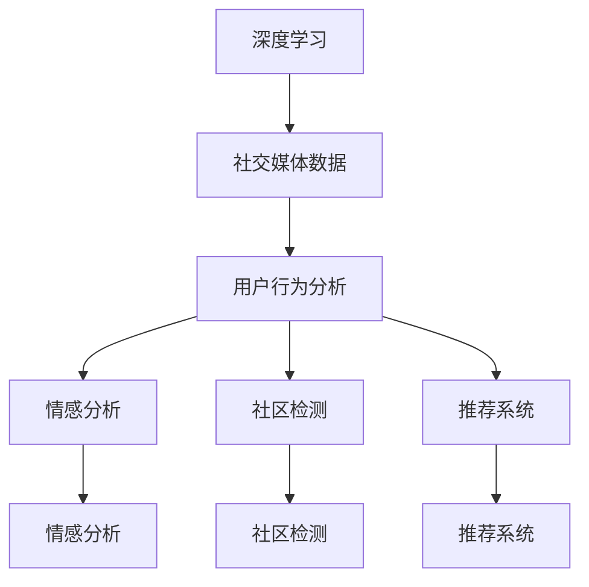

                 

# 一切皆是映射：深度学习在社交媒体数据分析中的应用

## 1. 背景介绍

随着社交媒体的兴起，大规模用户行为数据的产生，数据分析成为了新的热门领域。深度学习作为数据分析的重要工具，通过对数据的非线性映射能力，在社交媒体数据分析中展现出强大的应用潜力。本文聚焦于深度学习在社交媒体数据分析中的应用，深入浅出地介绍其核心概念、算法原理及实际应用。

## 2. 核心概念与联系

### 2.1 核心概念概述

要理解深度学习在社交媒体数据分析中的应用，首先需要了解几个核心概念：

- **深度学习**：通过多层次的非线性映射关系，构建复杂的数据表示模型。深度学习模型能够自动提取和挖掘数据中的高级特征，适合处理非线性关系的数据。

- **社交媒体数据**：指在社交网络、微博、微信等社交平台上的用户行为数据，包括用户的文本、图片、视频等。社交媒体数据具有海量、多模态、实时更新的特点，是数据挖掘和分析的良好数据源。

- **用户行为分析**：对社交媒体上的用户行为数据进行统计、分析和挖掘，理解用户兴趣、情感、社交关系等。

- **情感分析**：识别用户文本中的情感倾向（如积极、消极、中性），从而了解用户情绪状态和满意度。

- **社区检测**：将社交网络中的用户按照关系紧密程度划分成不同的社区，便于对不同社区的用户行为进行分析。

- **推荐系统**：根据用户的历史行为和兴趣，推荐符合用户需求的社交内容。

这些概念之间具有紧密的联系，深度学习作为核心技术，能够有效处理社交媒体数据的复杂特性，挖掘出有价值的用户行为信息，从而服务于用户行为分析、情感分析、社区检测和推荐系统等应用场景。

### 2.2 核心概念间的关系

通过Mermaid流程图，我们可以清晰地展示这些核心概念之间的关系：



这个流程图展示了深度学习如何在社交媒体数据分析中发挥作用。深度学习通过对社交媒体数据进行建模，自动提取高级特征，服务于用户行为分析、情感分析、社区检测和推荐系统等应用。

## 3. 核心算法原理 & 具体操作步骤

### 3.1 算法原理概述

深度学习在社交媒体数据分析中的应用，主要是通过构建深度神经网络模型，对社交媒体数据进行建模，从而挖掘出有用的用户行为信息。核心算法包括：

- **卷积神经网络（CNN）**：主要用于处理图片数据，可以提取图片中的局部特征。

- **循环神经网络（RNN）**：主要用于处理序列数据，可以捕捉时间序列中的动态变化。

- **长短时记忆网络（LSTM）**：一种特殊的RNN，能够有效处理长期依赖问题，适用于序列数据的建模。

- **图神经网络（GNN）**：用于处理社交网络数据，能够捕捉节点之间的关系和结构信息。

这些神经网络模型在社交媒体数据分析中的应用，主要是通过对用户行为数据进行建模，识别出用户的兴趣、情感、社交关系等，从而服务于情感分析、社区检测和推荐系统等应用。

### 3.2 算法步骤详解

深度学习在社交媒体数据分析中，主要包括以下步骤：

**Step 1: 数据预处理**

- 数据清洗：去除无关的噪声和异常值，保证数据质量。
- 特征提取：将原始数据转化为可用于模型训练的特征向量。

**Step 2: 模型训练**

- 选择合适的深度学习模型，如CNN、RNN、LSTM、GNN等。
- 设置训练超参数，如学习率、批量大小、迭代轮数等。
- 使用训练集进行模型训练，不断调整参数以优化模型性能。

**Step 3: 模型评估**

- 在验证集上评估模型性能，选择最佳的模型参数。
- 使用测试集对模型进行最终评估，确保模型在新数据上的泛化能力。

**Step 4: 模型应用**

- 将训练好的模型应用于实际数据分析任务，如图像分类、情感分析、社区检测、推荐系统等。
- 对新数据进行预测，输出分析结果。

### 3.3 算法优缺点

深度学习在社交媒体数据分析中，具有以下优点：

- **非线性映射能力**：能够自动提取数据中的非线性关系，适用于处理复杂的数据结构。
- **高泛化能力**：深度学习模型在大量标注数据上训练后，具有较强的泛化能力，能够处理新数据。
- **可解释性强**：深度学习模型中的特征权重可以通过可视化工具进行解释，有助于理解模型决策过程。

同时，也存在一些缺点：

- **模型复杂度高**：深度学习模型参数量巨大，训练和推理复杂度高。
- **需要大量标注数据**：深度学习模型需要大量的标注数据进行训练，标注成本高。
- **模型黑盒性**：深度学习模型复杂，难以解释其内部工作机制。

### 3.4 算法应用领域

深度学习在社交媒体数据分析中的应用领域广泛，主要包括：

- **情感分析**：通过分析用户评论、微博内容等文本数据，识别用户情感倾向。

- **社区检测**：通过分析社交网络中的用户关系，识别出社区结构和关系。

- **用户行为分析**：通过分析用户在社交媒体上的行为数据，了解用户兴趣和行为模式。

- **推荐系统**：通过分析用户历史行为和兴趣，推荐符合用户需求的社交内容。

这些应用领域中，深度学习能够自动提取和挖掘社交媒体数据的高级特征，帮助实现精确的情感分析、社区检测和个性化推荐等。

## 4. 数学模型和公式 & 详细讲解 & 举例说明

### 4.1 数学模型构建

深度学习在社交媒体数据分析中的数学模型构建，通常包括以下几个步骤：

1. **输入表示**：将社交媒体数据转化为向量形式，如文本数据转化为词向量，图片数据转化为像素向量。
2. **网络构建**：构建深度神经网络模型，如卷积神经网络（CNN）、循环神经网络（RNN）、长短时记忆网络（LSTM）、图神经网络（GNN）等。
3. **损失函数**：选择合适的损失函数，如交叉熵损失、均方误差损失、对数似然损失等。
4. **优化器**：选择合适的优化器，如SGD、Adam、Adagrad等。
5. **输出表示**：将模型输出转化为可解释的形式，如情感分析结果、社区结构等。

### 4.2 公式推导过程

以情感分析为例，假设我们有一个简单的二分类问题，即判断用户评论是积极还是消极的。我们可以使用CNN模型，其网络结构如下：


其中，输入层是文本数据，卷积层和池化层提取特征，全连接层进行分类，输出层输出预测结果。对于每个样本 $(x, y)$，我们使用交叉熵损失函数进行训练，公式如下：

$$
L(y, \hat{y}) = -\sum_{i=1}^n y_i \log \hat{y}_i + (1-y_i) \log (1-\hat{y}_i)
$$

其中 $y$ 是真实标签，$\hat{y}$ 是模型预测结果。使用梯度下降等优化算法对模型进行训练，最小化损失函数，更新模型参数。

### 4.3 案例分析与讲解

假设我们有一份Twitter上的情感数据集，包含用户的评论和对应的情感标签。我们可以使用CNN模型对这条评论进行情感分析。具体步骤如下：

1. **数据预处理**：将评论数据转化为词向量。
2. **模型训练**：使用CNN模型对评论数据进行建模，训练模型参数。
3. **模型评估**：在验证集上评估模型性能，选择最佳的模型参数。
4. **模型应用**：使用训练好的模型对新的评论进行情感分析。

以一条评论为例，假设其为“I love this movie!”，我们使用CNN模型对它进行情感分析。首先，将评论转化为词向量，然后通过卷积层提取特征，通过全连接层进行分类，输出预测结果。最终，模型给出预测结果为积极情感。

## 5. 项目实践：代码实例和详细解释说明

### 5.1 开发环境搭建

在进行深度学习实践前，我们需要准备好开发环境。以下是使用Python进行TensorFlow开发的环境配置流程：

1. 安装Anaconda：从官网下载并安装Anaconda，用于创建独立的Python环境。

2. 创建并激活虚拟环境：
```bash
conda create -n tf-env python=3.8 
conda activate tf-env
```

3. 安装TensorFlow：根据CUDA版本，从官网获取对应的安装命令。例如：
```bash
conda install tensorflow
```

4. 安装TensorBoard：
```bash
pip install tensorboard
```

5. 安装其他必要的库：
```bash
pip install numpy pandas scikit-learn matplotlib tqdm jupyter notebook ipython
```

完成上述步骤后，即可在`tf-env`环境中开始深度学习实践。

### 5.2 源代码详细实现

下面我们以情感分析任务为例，给出使用TensorFlow进行CNN模型训练的代码实现。

首先，定义情感分析的数据处理函数：

```python
import tensorflow as tf
from tensorflow.keras.preprocessing.text import Tokenizer
from tensorflow.keras.preprocessing.sequence import pad_sequences
import numpy as np

def load_data(file_path):
    with open(file_path, 'r', encoding='utf-8') as f:
        data = f.read().splitlines()
    sentences = [line[2:].split() for line in data]
    labels = [int(line[0] == '1') for line in data]
    tokenizer = Tokenizer(num_words=5000)
    tokenizer.fit_on_texts(sentences)
    sequences = tokenizer.texts_to_sequences(sentences)
    padded_sequences = pad_sequences(sequences, maxlen=50, padding='post')
    return padded_sequences, labels

train_data = load_data('train.txt')
dev_data = load_data('dev.txt')
test_data = load_data('test.txt')
```

然后，定义CNN模型的代码：

```python
from tensorflow.keras.models import Sequential
from tensorflow.keras.layers import Conv1D, MaxPooling1D, Flatten, Dense, Dropout

model = Sequential()
model.add(Conv1D(32, 3, activation='relu', input_shape=(len(train_data[0]),)))
model.add(MaxPooling1D(2))
model.add(Conv1D(64, 3, activation='relu'))
model.add(MaxPooling1D(2))
model.add(Flatten())
model.add(Dense(64, activation='relu'))
model.add(Dropout(0.5))
model.add(Dense(1, activation='sigmoid'))

model.compile(optimizer='adam', loss='binary_crossentropy', metrics=['accuracy'])
model.summary()
```

接着，定义训练和评估函数：

```python
def train(model, train_data, dev_data, batch_size=32, epochs=10):
    model.fit(train_data[0], train_data[1], epochs=epochs, batch_size=batch_size, validation_data=(dev_data[0], dev_data[1]))

def evaluate(model, dev_data):
    _, loss, acc = model.evaluate(dev_data[0], dev_data[1], batch_size=32)
    print(f'Dev loss: {loss:.4f}, Dev acc: {acc:.4f}')

train(model, train_data, dev_data, epochs=10)
evaluate(model, dev_data)
```

最后，启动训练流程并在测试集上评估：

```python
test_loss, test_acc = model.evaluate(test_data[0], test_data[1], batch_size=32)
print(f'Test loss: {test_loss:.4f}, Test acc: {test_acc:.4f}')
```

以上就是使用TensorFlow进行CNN模型训练的完整代码实现。可以看到，使用TensorFlow进行深度学习模型的训练和评估，代码简洁高效，能够快速上手实践。

### 5.3 代码解读与分析

让我们再详细解读一下关键代码的实现细节：

**load_data函数**：
- 读取数据文件，将数据按行分隔，去除首尾空格。
- 分割出句子列表和标签列表。
- 对句子列表进行分词，转化为序列形式。
- 对序列进行定长padding，保证所有序列长度一致。
- 返回处理后的序列和标签列表。

**model定义**：
- 创建序列模型，添加卷积层、池化层、全连接层和Dropout层。
- 设置优化器和损失函数。
- 输出模型概览。

**train函数**：
- 使用训练数据训练模型，设置迭代轮数和批量大小。
- 在验证集上评估模型性能。

**evaluate函数**：
- 使用验证集评估模型性能，输出损失和精度。

**训练流程**：
- 在训练集上训练模型，并在验证集上评估性能。
- 使用训练好的模型在测试集上评估性能。

可以看到，使用TensorFlow进行深度学习实践，代码实现相对简单，能够快速迭代和调试模型。但需要注意，在实际应用中，还需要考虑模型的优化、正则化、超参数调优等因素，以提升模型性能和泛化能力。

## 6. 实际应用场景

### 6.1 情感分析

情感分析是深度学习在社交媒体数据分析中的重要应用之一。通过分析用户评论、微博内容等文本数据，能够识别出用户的情感倾向，了解用户情绪状态和满意度。情感分析在社交媒体舆情监测、品牌营销、产品改进等方面具有重要价值。

以Twitter情感分析为例，我们可以收集用户对某产品的评论数据，使用深度学习模型对评论进行情感分类。通过分析情感分类结果，了解用户对产品的满意度和反馈，为产品改进提供依据。

### 6.2 社区检测

社区检测是指通过分析社交网络中的用户关系，识别出社区结构和关系。深度学习模型可以用于社区检测，通过捕捉用户之间的关系和动态变化，识别出社区结构，从而服务于社交网络分析和社区推荐等应用。

以Facebook社区检测为例，我们可以使用深度学习模型分析用户之间的关系和互动情况，识别出不同社区的结构和关系。通过社区检测，我们可以了解不同社区的用户特点和兴趣，从而为社区推荐提供依据。

### 6.3 用户行为分析

用户行为分析是指通过分析用户在社交媒体上的行为数据，了解用户兴趣和行为模式。深度学习模型可以用于用户行为分析，通过捕捉用户的行为特征和动态变化，分析出用户的兴趣和行为模式，从而服务于个性化推荐、广告投放等应用。

以YouTube用户行为分析为例，我们可以收集用户观看视频的行为数据，使用深度学习模型分析用户的行为特征和偏好。通过用户行为分析，我们可以了解用户的兴趣和行为模式，从而为个性化推荐和广告投放提供依据。

### 6.4 推荐系统

推荐系统是指根据用户的历史行为和兴趣，推荐符合用户需求的社交内容。深度学习模型可以用于推荐系统，通过分析用户的历史行为和兴趣，推荐符合用户需求的社交内容，从而提升用户满意度和黏性。

以Netflix推荐系统为例，我们可以使用深度学习模型分析用户的观看行为和偏好，推荐符合用户兴趣的电影和电视剧。通过推荐系统，我们可以提升用户满意度和黏性，增加用户活跃度和收入。

## 7. 工具和资源推荐

### 7.1 学习资源推荐

为了帮助开发者系统掌握深度学习在社交媒体数据分析中的应用，这里推荐一些优质的学习资源：

1. **《深度学习》系列书籍**：由深度学习领域的大师级学者撰写，深入浅出地介绍了深度学习的基本原理和应用。

2. **CS231n《深度学习中的计算机视觉》课程**：斯坦福大学开设的深度学习经典课程，涵盖了深度学习在计算机视觉中的应用。

3. **Kaggle竞赛平台**：提供了大量数据集和竞赛，可以参与深度学习实践，提升数据处理和模型训练能力。

4. **TensorFlow官方文档**：TensorFlow的官方文档，提供了丰富的教程和示例，适合快速上手实践。

5. **HuggingFace官方文档**：HuggingFace的官方文档，提供了丰富的深度学习模型和应用示例，适合探索前沿技术。

通过对这些资源的学习实践，相信你一定能够快速掌握深度学习在社交媒体数据分析中的应用，并用于解决实际的分析任务。

### 7.2 开发工具推荐

高效的开发离不开优秀的工具支持。以下是几款用于深度学习开发常用的工具：

1. **Jupyter Notebook**：Python脚本的交互式开发环境，支持代码编写、执行和数据可视化，适合快速迭代实验。

2. **Google Colab**：谷歌提供的免费在线Jupyter Notebook环境，支持GPU/TPU算力，方便快速上手实验最新模型，分享学习笔记。

3. **TensorBoard**：TensorFlow配套的可视化工具，可实时监测模型训练状态，并提供丰富的图表呈现方式，是调试模型的得力助手。

4. **Weights & Biases**：模型训练的实验跟踪工具，可以记录和可视化模型训练过程中的各项指标，方便对比和调优。

5. **PyTorch**：基于Python的开源深度学习框架，灵活动态的计算图，适合快速迭代研究。大部分深度学习模型都有PyTorch版本的实现。

6. **HuggingFace Transformers库**：提供了丰富的预训练模型和应用示例，适合快速构建深度学习模型。

合理利用这些工具，可以显著提升深度学习在社交媒体数据分析中的开发效率，加快创新迭代的步伐。

### 7.3 相关论文推荐

深度学习在社交媒体数据分析中的应用源于学界的持续研究。以下是几篇奠基性的相关论文，推荐阅读：

1. **《深度学习与自然语言处理》**：自然语言处理领域的经典书籍，介绍了深度学习在文本数据处理中的应用。

2. **《社交媒体数据分析》**：介绍了社交媒体数据分析的基本概念和应用场景，是社交数据分析的入门书籍。

3. **《大规模深度学习：一种新范式》**：介绍了大规模深度学习的基本原理和应用，是深度学习应用的入门书籍。

4. **《社交媒体情感分析》**：介绍了社交媒体情感分析的基本原理和应用，是情感分析应用的入门书籍。

5. **《社区检测：一种新方法》**：介绍了社区检测的基本原理和应用，是社区检测应用的入门书籍。

这些论文代表了大规模深度学习在社交媒体数据分析领域的研究脉络。通过学习这些前沿成果，可以帮助研究者把握学科前进方向，激发更多的创新灵感。

除上述资源外，还有一些值得关注的前沿资源，帮助开发者紧跟深度学习在社交媒体数据分析技术的最新进展，例如：

1. **arXiv论文预印本**：人工智能领域最新研究成果的发布平台，包括大量尚未发表的前沿工作，学习前沿技术的必读资源。

2. **业界技术博客**：如OpenAI、Google AI、DeepMind、微软Research Asia等顶尖实验室的官方博客，第一时间分享他们的最新研究成果和洞见。

3. **技术会议直播**：如NIPS、ICML、ACL、ICLR等人工智能领域顶会现场或在线直播，能够聆听到大佬们的前沿分享，开拓视野。

4. **GitHub热门项目**：在GitHub上Star、Fork数最多的社交媒体数据分析相关项目，往往代表了该技术领域的发展趋势和最佳实践，值得去学习和贡献。

5. **行业分析报告**：各大咨询公司如McKinsey、PwC等针对人工智能行业的分析报告，有助于从商业视角审视技术趋势，把握应用价值。

总之，深度学习在社交媒体数据分析中的学习和实践，需要开发者保持开放的心态和持续学习的意愿。多关注前沿资讯，多动手实践，多思考总结，必将收获满满的成长收益。

## 8. 总结：未来发展趋势与挑战

### 8.1 总结

本文对深度学习在社交媒体数据分析中的应用进行了全面系统的介绍。首先阐述了深度学习在社交媒体数据分析中的核心概念和算法原理，明确了其在情感分析、社区检测、用户行为分析、推荐系统等应用场景中的独特价值。其次，从原理到实践，详细讲解了深度学习模型的构建和训练方法，给出了实际应用中的代码实现。同时，本文还广泛探讨了深度学习在社交媒体数据分析中的未来发展趋势和面临的挑战，为未来的研究指明了方向。

通过本文的系统梳理，可以看到，深度学习在社交媒体数据分析中具有广阔的应用前景。深度学习模型通过对社交媒体数据的非线性映射，能够自动提取和挖掘出有用的用户行为信息，服务于情感分析、社区检测、用户行为分析、推荐系统等应用。未来，随着深度学习技术的不断发展，社交媒体数据分析的深度和广度将进一步拓展，为社会各领域的决策提供更有力的数据支撑。

### 8.2 未来发展趋势

展望未来，深度学习在社交媒体数据分析中将呈现以下几个发展趋势：

1. **多模态融合**：社交媒体数据具有图片、视频、音频等多模态的特性，深度学习模型将进一步融合多模态数据，提高数据的表示能力和分析效果。

2. **自监督学习**：通过利用未标注数据进行训练，自监督学习将进一步降低深度学习模型对标注数据的依赖，提高模型的泛化能力。

3. **对抗生成网络（GANs）**：通过生成对抗网络生成假数据，对抗生成网络将进一步提高深度学习模型的数据生成能力和数据增强效果。

4. **迁移学习**：通过将预训练模型应用于新任务，迁移学习将进一步提高深度学习模型的泛化能力和适应能力。

5. **强化学习**：通过将深度学习模型应用于智能代理，强化学习将进一步提高深度学习模型在社交媒体数据分析中的应用效果。

6. **联邦学习**：通过分布式协同学习，联邦学习将进一步提高深度学习模型的数据安全和隐私保护能力。

这些趋势凸显了深度学习在社交媒体数据分析中的巨大潜力，将进一步提升社交媒体数据分析的深度和广度，为社会各领域的决策提供更有力的数据支撑。

### 8.3 面临的挑战

尽管深度学习在社交媒体数据分析中已经取得了瞩目成就，但在迈向更加智能化、普适化应用的过程中，仍面临诸多挑战：

1. **数据隐私和安全**：社交媒体数据具有隐私性，深度学习模型需要保证数据的安全性和隐私性，防止数据泄露和滥用。

2. **模型可解释性**：深度学习模型通常是一个黑盒系统，难以解释其内部工作机制和决策逻辑，限制了其在高风险应用场景中的使用。

3. **计算资源需求**：深度学习模型需要大量的计算资源进行训练和推理，如何提高模型的计算效率和资源利用率，是一个重要的研究方向。

4. **模型鲁棒性**：深度学习模型容易受到输入噪声和数据分布变化的影响，如何提高模型的鲁棒性和泛化能力，是一个重要的研究方向。

5. **模型公平性**：深度学习模型容易受到数据偏见的影响，如何提高模型的公平性和鲁棒性，是一个重要的研究方向。

6. **模型可扩展性**：如何构建可扩展、可维护的深度学习模型，是一个重要的研究方向。

这些挑战凸显了深度学习在社交媒体数据分析中的复杂性和挑战性，需要进一步研究和优化。

### 8.4 研究展望

面对深度学习在社交媒体数据分析中面临的挑战，未来的研究需要在以下几个方面寻求新的突破：

1. **模型可解释性增强**：通过引入可解释性技术，如可视化、因果分析等，提高深度学习模型的可解释性，增强模型的可信度和可接受性。

2. **模型鲁棒性提高**：通过引入鲁棒性技术，如对抗训练、知识蒸馏等，提高深度学习模型的鲁棒性和泛化能力。

3. **模型公平性保障**：通过引入公平性技术，如对抗训练、数据重加权等，提高深度学习模型的公平性和鲁棒性。

4. **计算资源优化**：通过引入计算优化技术，如模型压缩、量化加速等，提高深度学习模型的计算效率和资源利用率。

5. **多模态融合增强**：通过引入多模态融合技术，如跨模态对齐、联合嵌入等，提高深度学习模型的数据表示能力和分析效果。

6. **自监督学习拓展**：通过引入自监督学习技术，如无监督学习、半监督学习等，提高深度学习模型的泛化能力和适应能力。

这些研究方向将引领深度学习在社交媒体数据分析中迈向更高的台阶，为构建安全、可靠、可解释、可控的智能系统铺平道路。面向未来，深度学习在社交媒体数据分析中的研究和应用还需要与其他人工智能技术进行更深入的融合，如知识表示、因果推理、强化学习等，多路径协同发力，共同推动社交媒体数据分析的进步。只有勇于创新、敢于突破，才能不断拓展深度学习在社交媒体数据分析的边界，让深度学习技术更好地造福人类社会。

## 9. 附录：常见问题与解答

**Q1：深度学习在社交媒体数据分析中是否需要大量的标注数据？**

A: 深度学习在社交媒体数据分析中，通常需要大量的标注数据进行训练，以确保模型的泛化能力。但也有一些技术，如自监督学习和对抗生成网络，可以通过利用未标注数据进行训练，降低深度学习模型对标注数据的依赖。

**Q2：如何提高深度学习模型在社交媒体数据分析中的鲁棒性？**

A: 提高深度学习模型在社交媒体数据分析中的鲁棒性，可以通过引入对抗训练、知识蒸馏、鲁棒正则化等技术。这些技术可以帮助模型更好地应对输入噪声和数据分布变化的影响，提高模型的鲁棒性和泛化能力。

**Q3：如何增强深度学习模型的可解释性？**

A: 增强深度学习模型的可解释性，可以通过引入可视化技术、因果分析、可解释性AI等方法。这些方法可以帮助开发者更好地理解模型的内部工作机制和决策逻辑，提升模型的可信度和可接受性。

**Q4：如何优化深度学习模型的计算资源需求？

