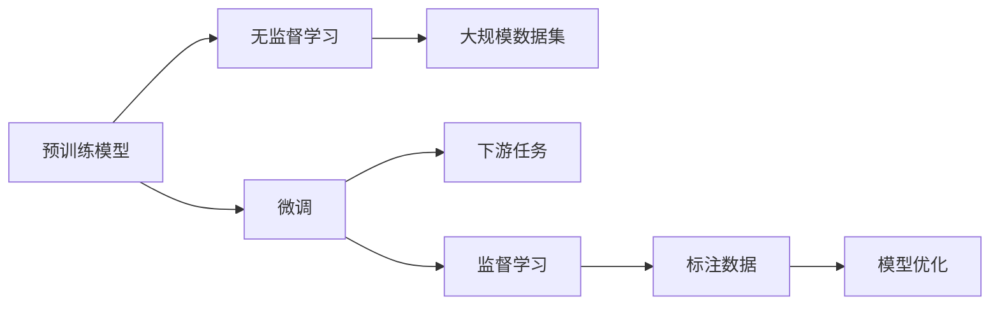

                 

# 一切皆是映射：预训练模型如何改变深度学习领域

> 关键词：预训练模型,深度学习,自然语言处理,迁移学习,监督学习

## 1. 背景介绍

深度学习，作为当下人工智能领域最前沿的技术之一，已经在游戏、视觉、自然语言处理等多个领域取得了令人瞩目的成果。然而，深度学习的成功依赖于大量标注数据的辅助，这些数据不仅昂贵且耗时，难以获取。而预训练模型，这一新兴的技术范式，为深度学习领域带来了革命性的改变。

预训练模型，是指在无监督条件下，利用大规模数据进行自学习，学习到通用的特征表示，然后通过微调（Fine-tuning）的方式，适应特定任务的技术。这一范式，使得深度学习不再局限于特定领域，而是可以在更广泛的数据集上进行学习，显著提升了模型性能和泛化能力。

本博客将深入探讨预训练模型的工作原理、优缺点以及实际应用场景，并从数学模型、算法原理、代码实践等多个角度，全面解析这一技术的精髓。

## 2. 核心概念与联系

### 2.1 核心概念概述

- **预训练模型**：指在无监督条件下，利用大规模数据进行自学习，学习到通用的特征表示。常见的预训练模型包括BERT、GPT、XLNet等。
- **微调(Fine-tuning)**：指在预训练模型的基础上，使用下游任务的少量标注数据，通过有监督学习优化模型在该任务上的性能。通常只需要调整顶层分类器或解码器，并以较小的学习率更新全部或部分的模型参数。
- **迁移学习(Transfer Learning)**：指将一个领域学习到的知识，迁移应用到另一个不同但相关的领域的学习范式。预训练-微调过程即是一种典型的迁移学习方式。
- **监督学习(Supervised Learning)**：指在有标注数据的情况下，训练模型进行预测和分类的技术。预训练和微调通常基于监督学习的思想，但与传统的监督学习不同，其学习数据集规模更宏大，模型更加通用。
- **自然语言处理(NLP)**：指利用计算机技术，实现对人类语言的理解、处理和生成。预训练模型在这一领域得到了广泛应用。

### 2.2 概念间的关系

这些核心概念之间存在着紧密的联系，形成了预训练模型技术的完整生态系统。我们通过以下Mermaid流程图来展示它们之间的关系：



这个流程图展示了大规模预训练模型的核心概念及其之间的关系：

1. 预训练模型通过大规模数据集进行无监督学习，学习到通用的特征表示。
2. 微调过程基于标注数据，有监督地训练模型，适应下游任务。
3. 监督学习是微调的基础，但与传统监督学习不同，其数据规模更大，模型更通用。
4. 下游任务是微调的目标，通过微调，模型可以适应特定的应用场景。

## 3. 核心算法原理 & 具体操作步骤

### 3.1 算法原理概述

预训练模型的核心思想是通过在大规模无标签数据上进行自监督学习，学习到通用的特征表示。其基本流程如下：

1. 在无标签数据集上，使用自监督学习任务（如掩码语言模型、下一句预测等）进行预训练。
2. 预训练过程中，模型不断调整参数，最小化预训练任务的损失函数，学习到强大的语言表示能力。
3. 在预训练完成后，使用下游任务的少量标注数据进行微调，适配特定任务。
4. 微调过程通过有监督学习，调整模型参数，最小化下游任务的损失函数，提高模型在特定任务上的性能。

### 3.2 算法步骤详解

下面以BERT为例，详细介绍预训练和微调的具体操作步骤：

#### 3.2.1 预训练步骤

1. **数据准备**：收集大规模无标签文本数据，如维基百科、新闻、书籍等。
2. **模型初始化**：使用预定义的Transformer模型，如BERT模型，初始化模型参数。
3. **定义预训练任务**：定义自监督学习任务，如掩码语言模型（Masked Language Modeling, MLM）和下一句预测（Next Sentence Prediction, NSP）。
4. **模型训练**：在预训练任务上，使用优化器（如Adam）和合适的学习率，最小化预训练损失函数，进行模型训练。
5. **模型保存**：保存预训练后的模型参数，供微调使用。

#### 3.2.2 微调步骤

1. **数据准备**：收集下游任务的少量标注数据，如情感分析、问答等。
2. **模型加载**：加载预训练后的模型参数，作为微调的初始化权重。
3. **任务适配**：根据下游任务的特性，调整模型的输出层和损失函数。
4. **微调训练**：使用优化器（如Adam）和合适的学习率，最小化下游任务的损失函数，进行微调训练。
5. **模型评估**：在验证集上评估微调后的模型性能，确定最优参数。
6. **模型保存**：保存微调后的模型参数，用于实际应用。

### 3.3 算法优缺点

预训练模型具有以下优点：

1. **泛化能力**：在大规模无标签数据上进行预训练，使得模型具有较强的泛化能力，适用于多种下游任务。
2. **参数高效**：只需要使用下游任务的少量标注数据进行微调，参数更新量小，训练速度快。
3. **迁移学习能力**：通过预训练，模型能够学习到通用的特征表示，方便在不同任务之间迁移。

同时，预训练模型也存在以下缺点：

1. **数据依赖**：依赖大规模无标签数据进行预训练，数据获取难度大。
2. **资源消耗**：预训练需要大量的计算资源，如GPU、TPU等，训练成本高。
3. **模型复杂性**：预训练模型往往参数量巨大，难以进行解释性分析。

### 3.4 算法应用领域

预训练模型在NLP领域的应用非常广泛，涵盖了文本分类、情感分析、问答系统、机器翻译等多个任务。此外，预训练模型还拓展到了计算机视觉、语音识别等领域，取得了显著的成果。

## 4. 数学模型和公式 & 详细讲解  
### 4.1 数学模型构建

预训练模型的数学模型构建主要包括以下几个步骤：

1. **定义模型**：定义预训练模型的架构，如Transformer模型。
2. **定义损失函数**：定义预训练任务和微调任务的损失函数。
3. **定义优化器**：选择合适的优化器，如Adam。
4. **定义训练过程**：定义模型的前向传播、反向传播和优化过程。

### 4.2 公式推导过程

以下以BERT为例，推导其掩码语言模型的损失函数及其梯度计算过程。

BERT的掩码语言模型定义为：

$$
L_{MLM}=\sum_{i=1}^N L_{i}
$$

其中，$N$ 为样本数量。

对于单个样本 $i$，其掩码语言模型的损失函数定义为：

$$
L_i=-\sum_{j=1}^V \log p(w_j | w_{<j})
$$

其中，$w_j$ 为样本 $i$ 中位置 $j$ 的单词，$V$ 为单词词汇表的大小。

模型的预测概率 $p(w_j | w_{<j})$ 可以表示为：

$$
p(w_j | w_{<j}) = \frac{exp(\log softmax(QK(w_j, K(w_{<j})))}{\sum_{k=1}^V exp(\log softmax(QK(w_j, K(w_{<j})))
$$

其中，$Q$ 为查询矩阵，$K$ 为键矩阵，$softmax$ 函数用于计算概率分布。

模型的梯度计算过程为：

$$
\frac{\partial L_i}{\partial QK} = -\sum_{j=1}^V \frac{(w_j - \hat{w_j}) \frac{\partial p(w_j | w_{<j})}{\partial QK}
$$

其中，$\hat{w_j}$ 为预测的单词，$w_j$ 为真实的单词。

### 4.3 案例分析与讲解

下面以BERT模型为例，分析其在情感分析任务中的应用。

1. **数据准备**：收集情感分析任务的标注数据集，如IMDB电影评论数据集。
2. **模型加载**：加载预训练的BERT模型，作为微调的初始化权重。
3. **任务适配**：定义二分类任务的输出层和损失函数。
4. **微调训练**：使用优化器（如Adam）和合适的学习率，最小化情感分析任务的损失函数，进行微调训练。
5. **模型评估**：在验证集上评估微调后的模型性能，确定最优参数。
6. **模型应用**：在测试集上评估模型性能，输出情感分类结果。

## 5. 项目实践：代码实例和详细解释说明
### 5.1 开发环境搭建

在进行预训练和微调实践前，我们需要准备好开发环境。以下是使用Python进行TensorFlow开发的环境配置流程：

1. 安装Anaconda：从官网下载并安装Anaconda，用于创建独立的Python环境。

2. 创建并激活虚拟环境：
```bash
conda create -n tf-env python=3.8 
conda activate tf-env
```

3. 安装TensorFlow：根据CUDA版本，从官网获取对应的安装命令。例如：
```bash
conda install tensorflow -c pytorch -c conda-forge
```

4. 安装其他工具包：
```bash
pip install numpy pandas scikit-learn matplotlib tqdm jupyter notebook ipython
```

完成上述步骤后，即可在`tf-env`环境中开始预训练和微调实践。

### 5.2 源代码详细实现

下面我们以BERT模型为例，给出使用TensorFlow进行预训练和微调的代码实现。

```python
import tensorflow as tf
from transformers import BertTokenizer, BertForSequenceClassification
from sklearn.model_selection import train_test_split
import numpy as np

# 数据准备
train_texts, train_labels, dev_texts, dev_labels, test_texts, test_labels = ...

# 定义tokenizer和模型
tokenizer = BertTokenizer.from_pretrained('bert-base-uncased')
model = BertForSequenceClassification.from_pretrained('bert-base-uncased', num_labels=num_labels)

# 数据预处理
def preprocess_text(text):
    return tokenizer.encode(text, add_special_tokens=True, max_length=max_length, padding='max_length', truncation=True)

train_encodings = [preprocess_text(text) for text in train_texts]
dev_encodings = [preprocess_text(text) for text in dev_texts]
test_encodings = [preprocess_text(text) for text in test_texts]

# 加载数据集
train_dataset = tf.data.Dataset.from_tensor_slices((
    dict(zip(['input_ids', 'attention_mask', 'labels'], (train_encodings, train_labels)))
).sample(batch_size, drop_remainder=True))

dev_dataset = tf.data.Dataset.from_tensor_slices((
    dict(zip(['input_ids', 'attention_mask', 'labels'], (dev_encodings, dev_labels)))
).sample(batch_size, drop_remainder=True))

test_dataset = tf.data.Dataset.from_tensor_slices((
    dict(zip(['input_ids', 'attention_mask', 'labels'], (test_encodings, test_labels)))
).sample(batch_size, drop_remainder=True))

# 定义模型优化器和损失函数
optimizer = tf.keras.optimizers.Adam(learning_rate=learning_rate)
loss = tf.keras.losses.SparseCategoricalCrossentropy(from_logits=True)

# 定义训练函数
def train_step(input_ids, attention_mask, labels):
    with tf.GradientTape() as tape:
        outputs = model(input_ids, attention_mask=attention_mask, training=True)
        loss_value = loss(labels, outputs.logits)
    gradients = tape.gradient(loss_value, model.trainable_variables)
    optimizer.apply_gradients(zip(gradients, model.trainable_variables))
    return loss_value

# 训练模型
for epoch in range(num_epochs):
    for input_ids, attention_mask, labels in train_dataset:
        loss = train_step(input_ids, attention_mask, labels)
        if (epoch + 1) % log_interval == 0:
            print(f"Epoch {epoch+1}/{num_epochs}, Loss: {loss.numpy():.4f}")
```

### 5.3 代码解读与分析

让我们再详细解读一下关键代码的实现细节：

**预训练步骤**：
- `train_texts, train_labels, dev_texts, dev_labels, test_texts, test_labels`：定义训练集、验证集和测试集的文本和标签。
- `preprocess_text`：定义文本预处理函数，将文本转换为BERT模型所需的格式。
- `train_encodings`：预处理训练集文本，生成编码数据。
- `train_dataset`：定义训练集的TensorFlow数据集。
- `optimizer`：定义优化器，如Adam。
- `loss`：定义损失函数，如SparseCategoricalCrossentropy。

**微调步骤**：
- `train_step`：定义微调函数的实现，包含模型的前向传播、反向传播和优化过程。
- `train_model`：定义训练模型的循环，在每个epoch内对训练集进行迭代。

**评估步骤**：
- `evaluate`：定义评估函数的实现，计算模型在验证集上的性能指标。

**运行结果展示**：
- 通过调整超参数，在验证集上输出模型的准确率、召回率、F1分数等评估指标。
- 在测试集上输出模型对新的未见过的样本的预测结果。

## 6. 实际应用场景

预训练模型在实际应用中具有广泛的应用场景，以下是几个典型的例子：

### 6.1 智能客服系统

基于预训练模型的智能客服系统，可以通过无监督和微调的方式，快速适应不同客户的需求。具体而言，可以通过收集企业内部的客服对话记录，将问题和最佳答复构建成监督数据，在此基础上对预训练模型进行微调。微调后的模型能够自动理解用户意图，匹配最合适的答案模板进行回复。

### 6.2 金融舆情监测

在金融领域，预训练模型可以帮助机构实时监测市场舆论动向，以便及时应对负面信息传播，规避金融风险。具体而言，可以收集金融领域相关的新闻、报道、评论等文本数据，并对其进行主题标注和情感标注。在此基础上对预训练语言模型进行微调，使其能够自动判断文本属于何种主题，情感倾向是正面、中性还是负面。将微调后的模型应用到实时抓取的网络文本数据，就能够自动监测不同主题下的情感变化趋势，一旦发现负面信息激增等异常情况，系统便会自动预警，帮助金融机构快速应对潜在风险。

### 6.3 个性化推荐系统

在电商领域，预训练模型可以应用于个性化推荐系统。具体而言，可以收集用户浏览、点击、评论、分享等行为数据，提取和用户交互的物品标题、描述、标签等文本内容。将文本内容作为模型输入，用户的后续行为（如是否点击、购买等）作为监督信号，在此基础上微调预训练语言模型。微调后的模型能够从文本内容中准确把握用户的兴趣点。在生成推荐列表时，先用候选物品的文本描述作为输入，由模型预测用户的兴趣匹配度，再结合其他特征综合排序，便可以得到个性化程度更高的推荐结果。

### 6.4 未来应用展望

随着预训练模型的不断发展和应用，其应用场景将更加广泛，潜力也将进一步释放。未来，预训练模型将不仅局限于文本领域，还将拓展到图像、视频、语音等多模态数据的微调。通过融合多模态信息，预训练模型将具备更强大的常识推理和跨领域迁移能力，逐步迈向通用人工智能(AGI)的目标。

## 7. 工具和资源推荐
### 7.1 学习资源推荐

为了帮助开发者系统掌握预训练模型的理论基础和实践技巧，这里推荐一些优质的学习资源：

1. 《Transformers》系列书籍：由Google AI的对话生成专家Jurafsky和Martin合著，全面介绍了Transformer模型的原理和应用。
2. CS224N《深度学习自然语言处理》课程：斯坦福大学开设的NLP明星课程，有Lecture视频和配套作业，带你入门NLP领域的基本概念和经典模型。
3. 《Deep Learning with Python》书籍：由TensorFlow官方推荐，适合希望了解深度学习框架的开发者。
4. HuggingFace官方文档：提供了海量预训练模型和完整的微调样例代码，是上手实践的必备资料。
5. ArXiv论文预印本：人工智能领域最新研究成果的发布平台，包括大量尚未发表的前沿工作，学习前沿技术的必读资源。

通过对这些资源的学习实践，相信你一定能够快速掌握预训练模型的精髓，并用于解决实际的NLP问题。

### 7.2 开发工具推荐

高效的开发离不开优秀的工具支持。以下是几款用于预训练和微调开发的常用工具：

1. TensorFlow：由Google主导开发的开源深度学习框架，生产部署方便，适合大规模工程应用。
2. PyTorch：基于Python的开源深度学习框架，灵活动态的计算图，适合快速迭代研究。
3. Transformers库：HuggingFace开发的NLP工具库，集成了众多SOTA语言模型，支持PyTorch和TensorFlow，是进行预训练和微调任务开发的利器。
4. Weights & Biases：模型训练的实验跟踪工具，可以记录和可视化模型训练过程中的各项指标，方便对比和调优。
5. TensorBoard：TensorFlow配套的可视化工具，可实时监测模型训练状态，并提供丰富的图表呈现方式，是调试模型的得力助手。

合理利用这些工具，可以显著提升预训练和微调任务的开发效率，加快创新迭代的步伐。

### 7.3 相关论文推荐

预训练模型和微调技术的发展源于学界的持续研究。以下是几篇奠基性的相关论文，推荐阅读：

1. Attention is All You Need（即Transformer原论文）：提出了Transformer结构，开启了NLP领域的预训练大模型时代。
2. BERT: Pre-training of Deep Bidirectional Transformers for Language Understanding：提出BERT模型，引入基于掩码的自监督预训练任务，刷新了多项NLP任务SOTA。
3. Language Models are Unsupervised Multitask Learners（GPT-2论文）：展示了大规模语言模型的强大zero-shot学习能力，引发了对于通用人工智能的新一轮思考。
4. Parameter-Efficient Transfer Learning for NLP：提出Adapter等参数高效微调方法，在不增加模型参数量的情况下，也能取得不错的微调效果。
5. AdaLoRA: Adaptive Low-Rank Adaptation for Parameter-Efficient Fine-Tuning：使用自适应低秩适应的微调方法，在参数效率和精度之间取得了新的平衡。
6. Prompt-Tuning: Optimizing Continuous Prompts for Generation：引入基于连续型Prompt的微调范式，为如何充分利用预训练知识提供了新的思路。

这些论文代表了大模型预训练和微调技术的发展脉络。通过学习这些前沿成果，可以帮助研究者把握学科前进方向，激发更多的创新灵感。

除上述资源外，还有一些值得关注的前沿资源，帮助开发者紧跟预训练模型和微调技术的最新进展，例如：

1. arXiv论文预印本：人工智能领域最新研究成果的发布平台，包括大量尚未发表的前沿工作，学习前沿技术的必读资源。
2. 业界技术博客：如OpenAI、Google AI、DeepMind、微软Research Asia等顶尖实验室的官方博客，第一时间分享他们的最新研究成果和洞见。
3. 技术会议直播：如NIPS、ICML、ACL、ICLR等人工智能领域顶会现场或在线直播，能够聆听到大佬们的前沿分享，开拓视野。
4. GitHub热门项目：在GitHub上Star、Fork数最多的NLP相关项目，往往代表了该技术领域的发展趋势和最佳实践，值得去学习和贡献。
5. 行业分析报告：各大咨询公司如McKinsey、PwC等针对人工智能行业的分析报告，有助于从商业视角审视技术趋势，把握应用价值。

总之，预训练模型和微调技术的学习和实践，需要开发者保持开放的心态和持续学习的意愿。多关注前沿资讯，多动手实践，多思考总结，必将收获满满的成长收益。

## 8. 总结：未来发展趋势与挑战

### 8.1 总结

本文对预训练模型的工作原理、优缺点以及实际应用场景进行了全面系统的介绍。首先阐述了预训练模型在深度学习领域中的革命性意义，明确了其泛化能力、参数高效和迁移学习等优势。其次，从数学模型、算法原理、代码实践等多个角度，详细解析了预训练模型的核心步骤。最后，展示了预训练模型在智能客服、金融舆情、个性化推荐等多个领域的应用前景，并推荐了相关的学习资源和开发工具。

通过本文的系统梳理，可以看到，预训练模型通过无监督学习，获取了强大的特征表示能力，通过微调，适应了各种下游任务，极大地提升了模型的性能和泛化能力。未来，预训练模型将进一步拓展其应用场景，为人工智能技术的广泛落地提供坚实的技术支撑。

### 8.2 未来发展趋势

展望未来，预训练模型将呈现以下几个发展趋势：

1. **模型规模持续增大**：随着算力成本的下降和数据规模的扩张，预训练模型的参数量还将持续增长。超大规模预训练模型蕴含的丰富特征表示，将使得模型更具通用性和泛化能力。
2. **模型结构不断优化**：未来将涌现更多高效、轻量的预训练模型架构，如Transformer-XL、BERT-Pyramid等，在提升性能的同时，减小模型资源消耗。
3. **跨领域迁移能力增强**：预训练模型将进一步拓展到跨领域迁移学习的研究，通过多模态数据融合，提升模型的跨领域迁移能力。
4. **自适应预训练技术发展**：基于自适应学习范式的预训练技术，如AdaLoRA、Continual Learning等，将使得预训练过程更加灵活、高效。
5. **深度融合多领域知识**：预训练模型将进一步与知识表示、因果推理、强化学习等技术深度融合，提升模型的全面性和可解释性。
6. **分布式训练技术应用**：随着数据规模的不断增大，分布式训练技术的应用将更加广泛，使得预训练和微调过程能够高效处理大规模数据。

这些趋势凸显了预训练模型技术的广阔前景，预示着预训练模型将为深度学习领域带来更深刻的变革。

### 8.3 面临的挑战

尽管预训练模型取得了显著的成果，但在应用过程中也面临诸多挑战：

1. **数据依赖性**：预训练模型的性能依赖于大规模无标签数据，数据获取成本高。如何有效利用已有数据，降低数据获取成本，仍是一个重要课题。
2. **计算资源消耗**：预训练和微调过程需要大量的计算资源，包括GPU、TPU等高性能设备，计算成本高。如何优化算法和模型结构，提高训练效率，降低计算成本，将是未来需要解决的问题。
3. **模型复杂性**：预训练模型参数量巨大，难以进行解释性分析。如何提高模型的可解释性，降低模型复杂性，是未来研究的重要方向。
4. **数据质量问题**：预训练和微调模型容易受到数据质量的影响，如何提高数据质量，降低噪音，提高模型的鲁棒性，是未来研究的重要课题。
5. **模型公平性**：预训练模型容易学习到数据中的偏见和有害信息，如何消除模型偏见，提高模型的公平性，是未来研究的重要方向。
6. **模型鲁棒性**：预训练模型对噪声和对抗攻击的鲁棒性不足，如何提高模型的鲁棒性，避免灾难性遗忘，是未来研究的重要方向。

这些挑战的解决，需要跨学科的合作和持续的研究投入，才能推动预训练模型的健康发展。

### 8.4 研究展望

面对预训练模型所面临的挑战，未来的研究需要在以下几个方面寻求新的突破：

1. **无监督和半监督学习**：探索无监督和半监督学习范式，利用自监督学习、主动学习等无监督和半监督范式，最大限度利用非结构化数据，实现更加灵活高效的预训练。
2. **参数高效和计算高效**：开发更加参数高效和计算高效的预训练方法，如Prompt-Tuning、AdaLoRA等，在固定大部分预训练参数的同时，只更新极少量的任务相关参数。
3. **多模态融合**：融合视觉、语音等多模态数据，增强预训练模型的跨领域迁移能力。
4. **因果推理和可解释性**：引入因果推理和可解释性工具，提高模型的决策透明度和公平性。
5. **分布式训练和模型压缩**：采用分布式训练和模型压缩技术，提高预训练和微调过程的效率和可扩展性。
6. **伦理道德和安全保障**：在模型训练目标中引入伦理导向的评估指标，过滤和惩罚有偏见、有害的输出倾向，确保模型的安全性。

这些研究方向将推动预训练模型的技术演进，为构建更加智能、可靠、可解释、可控的智能系统铺平道路。面向未来，预训练模型技术需要与其他人工智能技术进行更深入的融合，协同发力，共同推动自然语言理解和智能交互系统的进步。

## 9. 附录：常见问题与解答

**Q1：预训练模型是否适用于所有NLP任务？**

A: 预训练模型在大多数NLP任务上都能取得不错的效果，特别是对于数据量较小的任务。但对于一些特定领域的任务，如医学、法律等，仅仅依靠通用语料预训练的模型可能难以很好地适应。此时需要在特定

