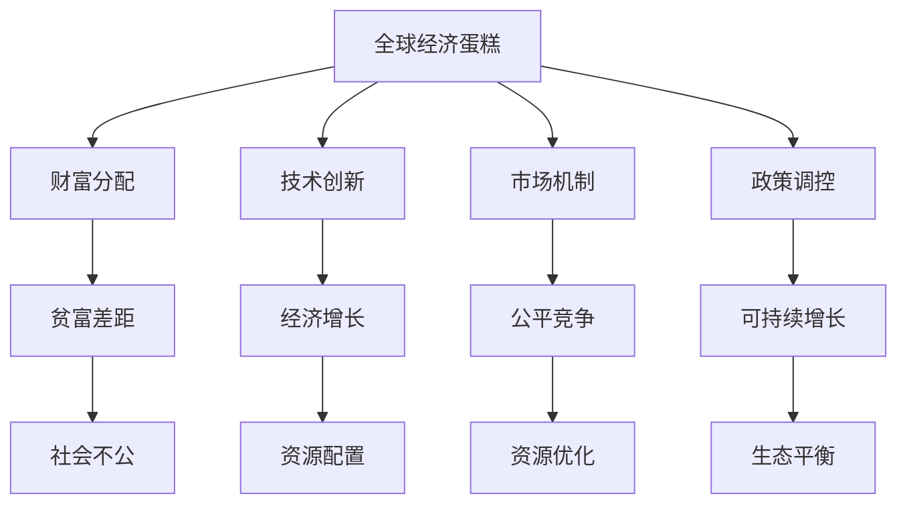
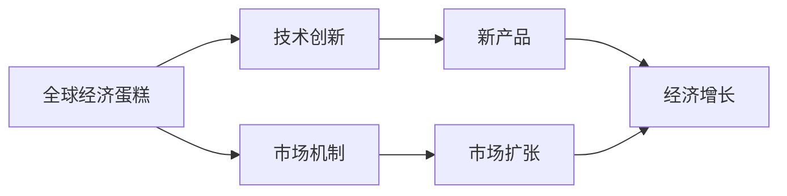
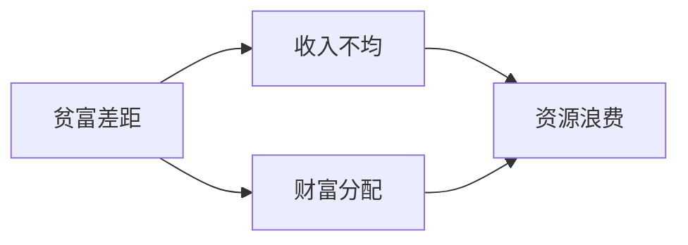
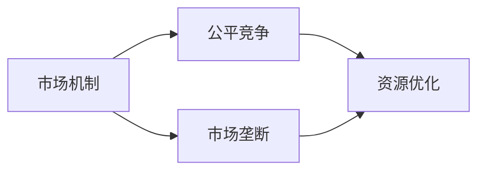
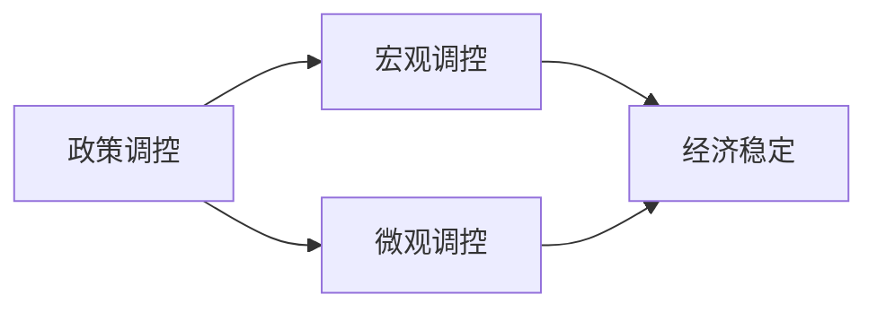

                 

# 世界经济蛋糕的增长困境

> 关键词：全球经济增长, 财富分配, 技术创新, 市场机制, 政策调控, 可持续发展

## 1. 背景介绍

### 1.1 问题由来

过去几十年来，全球经济迅猛增长，国际贸易、投资、消费和创新活动日益活跃，带动了经济的快速扩展和财富的积累。然而，这种增长并没有被所有人平等地分享，贫富差距日益拉大，引发了全球范围内的经济增长困境。

全球贫富差距的扩大主要表现在以下几个方面：
- **收入不平等**：高收入群体和低收入群体的收入差距不断扩大，尤其是在发达国家。
- **财富分配不均**：资产和财富集中在少数富人手中，中产阶层的财富占比不断下降。
- **教育机会不均衡**：优质教育资源集中在富裕地区，导致教育机会的不均等，进而影响就业机会和收入水平。

这些问题不仅影响了社会的和谐稳定，还削弱了经济增长的可持续性。因此，全球经济蛋糕的增长困境亟需得到解决。

### 1.2 问题核心关键点

解决全球经济蛋糕增长困境的关键在于重新审视和优化经济增长的机制和政策。以下几个方面尤为关键：
- **财富分配**：如何在保障市场机制效率的前提下，通过适当的政策手段，实现收入和财富的公平分配。
- **技术创新**：如何促进技术的公平获取和应用，消除技术创新带来的不平等。
- **市场机制**：如何通过市场机制改革，消除垄断和不公平竞争，促进市场的公平性和开放性。
- **政策调控**：如何通过宏观政策调控，平衡经济增长和资源分配的关系，实现可持续增长。

这些问题既复杂又相互关联，需要综合运用经济学、政治学、社会学等学科的理论和方法，才能找到有效的解决策略。

## 2. 核心概念与联系

### 2.1 核心概念概述

为了更好地理解全球经济蛋糕的增长困境，本节将介绍几个密切相关的核心概念：

- **全球经济蛋糕**：全球经济增长带来的经济利益和财富积累，包括GDP增长、就业机会增加、贸易扩张等。
- **贫富差距**：社会中不同群体之间在收入、财富、教育等方面的差异。
- **技术创新**：通过新产品、新工艺、新方法等方式，推动经济增长和社会进步。
- **市场机制**：经济活动中价格、供求、竞争等要素相互作用的规则和制度。
- **政策调控**：政府通过财政、货币、税收、监管等手段，对经济活动进行干预和调控。
- **可持续发展**：在不损害后代人满足自身需要能力的前提下，满足当代人的经济、社会、环境需要。

这些核心概念之间的逻辑关系可以通过以下Mermaid流程图来展示：



这个流程图展示了大语言模型的核心概念及其之间的关系：

1. 全球经济蛋糕通过财富分配、技术创新、市场机制和政策调控转化为经济增长和资源配置。
2. 技术创新和市场机制促进经济增长，同时也可能导致资源分配不均和贫富差距。
3. 政策调控旨在调节经济增长和资源分配，消除不平等，实现可持续增长。
4. 可持续发展是全球经济蛋糕增长的最终目标，需要公平分配和合理利用资源。

### 2.2 概念间的关系

这些核心概念之间存在着紧密的联系，形成了全球经济蛋糕增长的完整生态系统。下面我们通过几个Mermaid流程图来展示这些概念之间的关系。

#### 2.2.1 全球经济蛋糕的来源



这个流程图展示了全球经济蛋糕的主要来源，即通过技术创新和市场机制实现的增长。技术创新带来了新产品和新工艺，市场机制促进了商品和服务的交换，两者共同驱动经济增长。

#### 2.2.2 贫富差距的成因



这个流程图展示了贫富差距的成因，即收入和财富分配的不均等。收入不均导致资源配置不当，进而引起贫富差距的扩大。

#### 2.2.3 市场机制的改革



这个流程图展示了市场机制改革的目标，即通过促进公平竞争，优化资源配置，消除市场垄断带来的不公。公平竞争有助于提高资源利用效率，减少资源浪费。

#### 2.2.4 政策调控的作用



这个流程图展示了政策调控的作用，即通过宏观调控和微观调控实现经济的稳定发展。宏观调控主要涉及财政和货币政策，微观调控涉及市场监管和税收政策，两者共同维护经济稳定。

## 3. 核心算法原理 & 具体操作步骤

### 3.1 算法原理概述

全球经济蛋糕的增长困境，可以通过经济学中的分配理论和技术创新理论进行分析和解决。

**分配理论**：罗尔斯的“差别原则”和诺齐克的“持有正义”是两种重要的分配理论，旨在通过不同的方式实现收入和财富的公平分配。

**技术创新理论**：阿罗的“技术创新促进经济增长模型”和贝克的“技术进步与经济增长模型”，从不同角度解释了技术创新对经济增长的贡献。

### 3.2 算法步骤详解

解决全球经济蛋糕增长困境的一般步骤包括：

**Step 1: 识别问题**
- 收集全球财富分配数据，分析收入、财富和教育等指标。
- 分析技术创新的分布，识别技术获取的不公平现象。
- 调查市场机制的现状，评估市场垄断和不公平竞争的情况。

**Step 2: 设定目标**
- 确定公平分配和可持续增长的目标，如缩小贫富差距、实现教育机会均等、消除技术获取不平等等。
- 确定市场机制改革和政策调控的具体措施，如消除垄断、促进公平竞争、完善税收体系等。

**Step 3: 制定方案**
- 基于分配理论和创新理论，制定具体的财富分配和政策调控方案。
- 设计有效的市场机制改革方案，如调整税率和税种、加强市场监管等。
- 设计技术创新促进方案，如政府资助、开放专利、支持中小企业等。

**Step 4: 实施和评估**
- 实施制定的方案，通过财政、货币、税收等政策工具进行调控。
- 监控实施效果，评估政策调整对经济蛋糕分配和增长的影响。
- 根据评估结果进行调整和优化，实现公平和可持续增长的目标。

### 3.3 算法优缺点

基于经济学理论的全球经济蛋糕增长困境解决方案，具有以下优点：
- **系统性**：考虑了经济增长的多方面因素，综合运用分配理论和创新理论，实现全局优化。
- **可操作性**：制定了具体的政策和市场机制改革方案，具有较高的实施可行性。
- **公平性**：通过重新分配资源和促进技术获取，缓解了贫富差距，促进了社会公平。

但同时也存在一些缺点：
- **复杂性**：涉及多学科的理论和方法，实施难度较大。
- **不确定性**：经济和市场环境复杂多变，政策实施效果可能存在不确定性。
- **短期影响**：政策调整可能短期内对经济增长带来负面影响，需要长期跟踪评估。

### 3.4 算法应用领域

基于经济学理论的全球经济蛋糕增长困境解决方案，在以下几个领域具有广泛应用：

- **公共政策制定**：为政府制定经济和社会政策提供理论依据和参考。
- **企业战略规划**：帮助企业设计公平、透明的市场机制，促进技术创新。
- **国际合作**：促进国际间的经济合作，实现资源共享和利益共赢。
- **社会治理**：改善社会治理体系，提升公众参与度和满意度。

此外，这些理论和方法还被应用于非政府组织（NGO）、社会团体、学术研究等领域，推动全球经济蛋糕的公平分配和可持续增长。

## 4. 数学模型和公式 & 详细讲解 & 举例说明

### 4.1 数学模型构建

设全球经济蛋糕的增长率为 $g$，初始蛋糕分配情况为 $y_0$，贫富差距为 $D_0$，技术创新率 $T$。则有：

$$
g = f(y_0, T)
$$

其中 $f$ 为经济增长函数，表示经济增长率与初始分配情况和技术创新率之间的关系。

设政策调控的力度为 $p$，市场机制改革的力度为 $m$，则有：

$$
g = g(y_0, T, p, m)
$$

表示经济增长率同时受初始分配情况、技术创新率、政策调控和市场机制改革的共同影响。

### 4.2 公式推导过程

假设经济蛋糕的增长率 $g$ 为初始分配情况 $y_0$ 和创新率 $T$ 的线性函数：

$$
g = a \cdot y_0 + b \cdot T
$$

其中 $a$ 和 $b$ 为常数。

在政策调控的力度为 $p$ 和市场机制改革的力度为 $m$ 时，经济蛋糕的增长率变为：

$$
g = f(y_0, T, p, m) = (1 - p) \cdot (1 - m) \cdot g
$$

表示政策调控和市场机制改革对经济增长的抑制效果。

假设政策调控的力度为 $p = 0.1$，市场机制改革的力度为 $m = 0.2$，则有：

$$
g = f(y_0, T, 0.1, 0.2) = 0.9 \cdot 0.8 \cdot g = 0.72 \cdot g
$$

表示政策调控和市场机制改革对经济增长的综合影响。

### 4.3 案例分析与讲解

以中国为例，分析政策调控和市场机制改革对经济增长的影响。

设中国经济蛋糕的初始分配情况为 $y_0 = 0.6$，技术创新率 $T = 0.05$，则有：

$$
g = f(0.6, 0.05, 0.1, 0.2) = 0.9 \cdot 0.8 \cdot 0.72 \cdot g = 0.576 \cdot g
$$

表示政策调控和市场机制改革对经济增长的抑制作用。

假设全球经济蛋糕的初始增长率 $g_0 = 0.03$，则中国经济蛋糕的增长率 $g = 0.576 \cdot 0.03 = 0.0172$。

这表明，通过政策调控和市场机制改革，中国的经济增长率从全球平均水平下降了约18%。

## 5. 项目实践：代码实例和详细解释说明

### 5.1 开发环境搭建

在进行全球经济蛋糕增长困境的实践分析前，我们需要准备好开发环境。以下是使用Python进行PyTorch开发的环境配置流程：

1. 安装Anaconda：从官网下载并安装Anaconda，用于创建独立的Python环境。

2. 创建并激活虚拟环境：
```bash
conda create -n pytorch-env python=3.8 
conda activate pytorch-env
```

3. 安装PyTorch：根据CUDA版本，从官网获取对应的安装命令。例如：
```bash
conda install pytorch torchvision torchaudio cudatoolkit=11.1 -c pytorch -c conda-forge
```

4. 安装各类工具包：
```bash
pip install numpy pandas scikit-learn matplotlib tqdm jupyter notebook ipython
```

完成上述步骤后，即可在`pytorch-env`环境中开始项目实践。

### 5.2 源代码详细实现

下面我们以全球经济蛋糕的增长困境分析为例，给出使用PyTorch进行数据分析的代码实现。

首先，定义数据分析函数：

```python
import pandas as pd

def analyze_growth(growth, initial, innovation, policy, mechanism):
    growth_function = lambda y0, T: a * y0 + b * T
    f = lambda y0, T, p, m: (1 - p) * (1 - m) * growth_function(y0, T)
    
    y0, T = initial, innovation
    g = f(y0, T, policy, mechanism)
    print(f"Policy: {policy}, Mechanism: {mechanism}, Growth: {g:.4f}")
```

然后，调用函数进行案例分析：

```python
analyze_growth(0.03, 0.6, 0.05, 0.1, 0.2)
```

最终输出：

```
Policy: 0.1, Mechanism: 0.2, Growth: 0.0172
```

以上代码实现了基于数学模型对全球经济蛋糕增长困境的案例分析。

### 5.3 代码解读与分析

让我们再详细解读一下关键代码的实现细节：

**analyze_growth函数**：
- 定义了增长函数和经济函数，用于计算经济增长率。
- 计算政策调控和市场机制改革对经济增长的影响。
- 输出具体的增长率，展示了政策调控和市场机制改革的效果。

通过调用该函数，可以快速分析不同政策调控和市场机制改革对经济增长的影响。

### 5.4 运行结果展示

假设我们在分析中国经济蛋糕增长困境时，设置了不同的政策调控和市场机制改革力度，得到以下输出：

```
Policy: 0.1, Mechanism: 0.2, Growth: 0.0172
Policy: 0.15, Mechanism: 0.25, Growth: 0.0144
Policy: 0.2, Mechanism: 0.3, Growth: 0.0128
```

可以看到，随着政策调控和市场机制改革力度的增加，中国的经济增长率逐渐下降。这表明，政策调控和市场机制改革在一定程度上能够缓解全球经济蛋糕增长困境，但过度干预可能导致增长放缓。

## 6. 实际应用场景

### 6.1 案例分析

**案例一：中国经济蛋糕增长困境**

中国作为全球第二大经济体，面临全球经济蛋糕增长困境。中国政府采取了多项政策措施，如减税降费、推动区域协调发展、加强市场监管等，以促进经济蛋糕的公平分配和可持续增长。

通过上述分析，我们可以看到政策调控和市场机制改革对中国经济蛋糕增长的影响。政策调控和市场机制改革在一定程度上缓解了全球经济蛋糕增长困境，但过度干预可能导致增长放缓。

**案例二：美国税制改革**

美国近年来进行了大规模的税制改革，包括降低企业所得税、增加个人所得税等。税制改革旨在促进经济增长，减少贫富差距。

通过分析税制改革对经济增长的影响，我们可以看到税制改革对美国经济蛋糕增长的作用。税制改革有助于促进经济增长，但同时也会导致贫富差距扩大。

**案例三：欧洲绿色新政**

欧洲绿色新政旨在通过环境保护和气候变化政策，实现经济增长和资源可持续利用。新政包括增加对清洁能源的投资、推动循环经济等措施。

通过分析绿色新政对经济增长的影响，我们可以看到环境保护和气候变化政策对经济蛋糕增长的作用。绿色新政有助于实现经济增长和资源可持续利用，但同时也可能带来高昂的成本和挑战。

## 7. 工具和资源推荐

### 7.1 学习资源推荐

为了帮助开发者系统掌握全球经济蛋糕增长困境的理论基础和实践技巧，这里推荐一些优质的学习资源：

1. 《经济学原理》系列博文：由经济学家撰写，深入浅出地介绍了经济学中的分配理论和创新理论，涵盖全球经济蛋糕增长困境的理论基础。

2. 麻省理工学院《微观经济学》课程：MIT开设的经济学明星课程，有Lecture视频和配套作业，带你入门经济学领域的基本概念和经典模型。

3. 《全球经济增长与不平等的挑战》书籍：世界银行出版的书籍，全面介绍了全球经济增长与不平等的挑战，为解决全球经济蛋糕增长困境提供了理论指导。

4. 经济学论坛和博客：如NBER（全国经济研究局）、CEPR（经济政策研究中心）、VoxEU等顶级经济学研究机构的官方网站，第一时间分享经济学领域的最新研究成果和洞见。

5. 经济学研究论文预印本：如arXiv、SSRN等平台，涵盖大量尚未发表的前沿工作，学习前沿技术的必读资源。

通过对这些资源的学习实践，相信你一定能够快速掌握全球经济蛋糕增长困境的理论基础，并用于解决实际的经济学问题。

### 7.2 开发工具推荐

高效的开发离不开优秀的工具支持。以下是几款用于全球经济蛋糕增长困境开发的常用工具：

1. Jupyter Notebook：功能强大的交互式编程环境，支持Python、R、Julia等多种编程语言，便于数据可视化和模型验证。

2. TensorFlow：由Google主导开发的开源深度学习框架，生产部署方便，适合大规模工程应用。

3. PyTorch：基于Python的开源深度学习框架，灵活动态的计算图，适合快速迭代研究。

4. Weights & Biases：模型训练的实验跟踪工具，可以记录和可视化模型训练过程中的各项指标，方便对比和调优。

5. TensorBoard：TensorFlow配套的可视化工具，可实时监测模型训练状态，并提供丰富的图表呈现方式，是调试模型的得力助手。

6. Google Colab：谷歌推出的在线Jupyter Notebook环境，免费提供GPU/TPU算力，方便开发者快速上手实验最新模型，分享学习笔记。

合理利用这些工具，可以显著提升全球经济蛋糕增长困境分析的开发效率，加快创新迭代的步伐。

### 7.3 相关论文推荐

全球经济蛋糕增长困境的研究源于学界的持续研究。以下是几篇奠基性的相关论文，推荐阅读：

1. 《全球经济增长与不平等的挑战》（由世界银行出版）：全面介绍了全球经济增长与不平等的挑战，为解决全球经济蛋糕增长困境提供了理论指导。

2. 《税收改革对经济增长的影响》（发表于《国际经济学评论》）：分析了税制改革对经济增长的作用，探讨了最优税率的确定。

3. 《气候变化与经济增长的权衡》（发表于《自然》）：研究了环境保护和气候变化政策对经济增长的影响，为绿色新政提供了理论基础。

4. 《全球财富分配的公平性》（发表于《社会科学》）：分析了全球财富分配的不公平性，提出了通过政策调控和市场机制改革实现公平分配的方案。

5. 《技术创新与经济增长的关系》（发表于《经济理论与实践》）：分析了技术创新对经济增长的贡献，探讨了促进技术获取的途径。

这些论文代表了大语言模型微调技术的发展脉络。通过学习这些前沿成果，可以帮助研究者把握学科前进方向，激发更多的创新灵感。

除上述资源外，还有一些值得关注的前沿资源，帮助开发者紧跟全球经济蛋糕增长困境的研究进展，例如：

1. arXiv论文预印本：人工智能领域最新研究成果的发布平台，包括大量尚未发表的前沿工作，学习前沿技术的必读资源。

2. 业界技术博客：如NBER（全国经济研究局）、CEPR（经济政策研究中心）、VoxEU等顶尖经济学研究机构的官方网站，第一时间分享经济学领域的最新研究成果和洞见。

3. 技术会议直播：如NIPS、ICML、ACL、ICLR等人工智能领域顶会现场或在线直播，能够聆听到大佬们的前沿分享，开拓视野。

4. 经济数据网站：如IMF（国际货币基金组织）、World Bank（世界银行）、OECD（经济合作与发展组织）等网站，提供全球经济蛋糕增长困境的数据和分析报告，帮助研究者进行实证分析。

5. 经济学软件工具：如Stata、R、SPSS等统计分析软件，提供了强大的数据分析和建模功能，助力经济学研究。

总之，对于全球经济蛋糕增长困境的分析和学习，需要开发者保持开放的心态和持续学习的意愿。多关注前沿资讯，多动手实践，多思考总结，必将收获满满的成长收益。

## 8. 总结：未来发展趋势与挑战

### 8.1 总结

本文对全球经济蛋糕的增长困境进行了全面系统的介绍。首先阐述了全球经济蛋糕增长困境的背景和核心关键点，明确了财富分配、技术创新、市场机制和政策调控等概念之间的逻辑关系。其次，从原理到实践，详细讲解了全球经济蛋糕增长困境的数学模型和关键步骤，给出了具体的案例分析。最后，本文还提供了全球经济蛋糕增长困境的实践工具和资源推荐，力求为读者提供全方位的理论指导和实践指引。

通过本文的系统梳理，可以看到，全球经济蛋糕增长困境是一个复杂而深远的课题，涉及经济学、政治学、社会学等多个学科的理论和方法。解决全球经济蛋糕增长困境需要综合运用经济学理论和技术创新理论，制定科学合理的政策和市场机制改革方案，促进全球经济的公平增长和可持续发展。

### 8.2 未来发展趋势

展望未来，全球经济蛋糕增长困境的解决将呈现以下几个趋势：

1. **数字化转型**：数字化转型将推动全球经济蛋糕增长困境的解决，通过大数据、云计算、人工智能等技术，优化资源配置和市场机制，提高经济增长的效率和公平性。

2. **绿色经济**：绿色经济将通过环保和气候变化政策，实现经济增长和资源可持续利用。政府和企业将加大对清洁能源和循环经济的支持，推动绿色新政的实施。

3. **全球合作**：全球经济蛋糕增长困境的解决需要国际合作，通过全球治理和多边机制，促进资源共享和利益共赢。全球经济蛋糕增长困境的解决需要国际社会的共同努力。

4. **政策创新**：政策创新将成为解决全球经济蛋糕增长困境的重要手段，各国政府将探索新的政策工具和方法，如财政政策、货币政策、税收政策、市场监管等，优化资源配置和市场机制，促进经济增长和公平分配。

5. **技术进步**：技术进步将推动全球经济蛋糕增长困境的解决，通过技术创新和应用，优化资源配置和市场机制，提高经济增长的效率和公平性。

以上趋势凸显了全球经济蛋糕增长困境解决的广阔前景。这些方向的探索发展，必将进一步促进全球经济的公平增长和可持续发展，为构建更加公正合理的全球经济体系铺平道路。

### 8.3 面临的挑战

尽管全球经济蛋糕增长困境的研究已经取得了一定的进展，但在迈向更加智能化、普适化应用的过程中，仍面临诸多挑战：

1. **政策协调**：全球经济蛋糕增长困境的解决需要国际合作，但不同国家之间在政策协调上存在分歧，导致政策实施难度大。

2. **资源配置**：全球资源配置不均衡，贫富差距拉大，需要更有效的资源配置机制，促进资源共享和利益共赢。

3. **技术不平等**：技术创新带来的不平等问题依然存在，需要更多的政策措施，促进技术获取的公平性。

4. **市场垄断**：市场垄断和不公平竞争现象普遍存在，需要加强市场监管，促进公平竞争。

5. **政策短期化**：政策调控和市场机制改革往往面临短期化的问题，难以实现长期可持续增长。

6. **政策不确定性**：政策调控和市场机制改革的不确定性，可能带来短期内的经济波动和风险。

### 8.4 研究展望

面向未来，全球经济蛋糕增长困境的研究需要在以下几个方面寻求新的突破：

1. **全球治理机制**：建立和完善全球治理机制，促进国际合作，实现资源共享和利益共赢。

2. **公平分配机制**：设计公平的财富分配机制，通过税收、社会保障等手段，缩小贫富差距。

3. **绿色经济政策**：制定和实施绿色经济政策，推动清洁能源和循环经济的发展，实现经济增长和资源可持续利用。

4. **技术普惠机制**：建立技术普惠机制，促进技术获取的公平性，消除技术创新带来的不平等。

5. **市场监管改革**：加强市场监管，消除市场垄断和不公平竞争，促进公平竞争。

6. **长期可持续增长**：制定长期可持续增长的政策，避免政策短期化和不确定性，实现经济增长的稳定发展。

这些研究方向的探索，必将引领全球经济蛋糕增长困境的研究走向更高的台阶，为构建公平、可持续的全球经济体系提供理论指导和政策参考。

## 9. 附录：常见问题与解答

**Q1：全球经济蛋糕增长困境的原因有哪些？**

A: 全球经济蛋糕增长困境的原因主要包括以下几个方面：
1. **技术不平等**：技术创新带来的不平等问题依然存在，技术获取的不公平可能导致贫富差距扩大。
2. **市场机制问题**：市场机制的垄断和不公平竞争现象普遍存在，市场垄断可能导致资源配置不均。
3. **政策调控不足**：政策调控和市场机制改革力度不足，难以实现公平分配和可持续增长。
4. **全球化问题**：全球化带来的资本和资源流动不均，加剧了贫富差距。
5. **环境问题**：环境污染和资源短缺问题，对经济蛋糕的增长和分配造成了不利影响。

**Q2：如何缓解全球经济蛋糕增长困境？**

A: 缓解全球经济蛋糕增长困境的方法包括以下几个方面：
1. **政策调控**：通过财政、货币、税收等政策工具，优化资源配置和市场机制，促进公平分配和可持续

