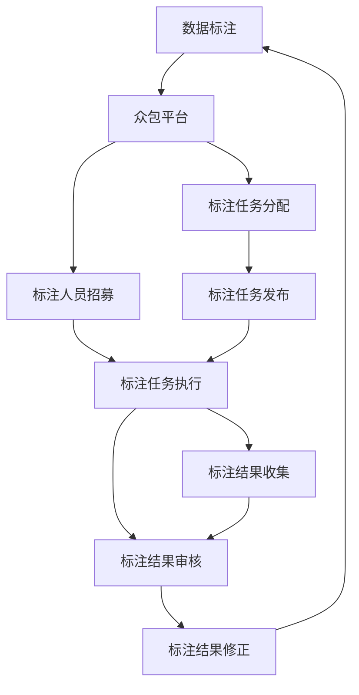
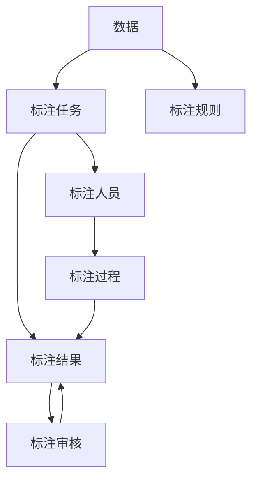
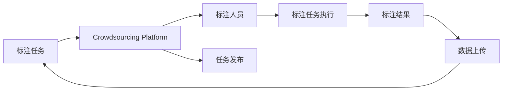
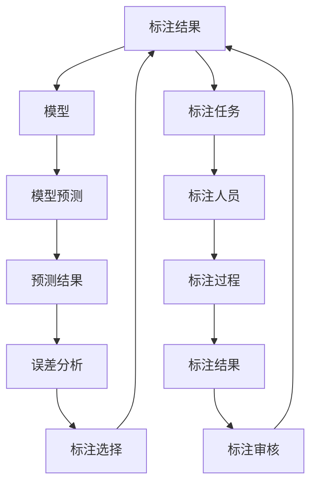
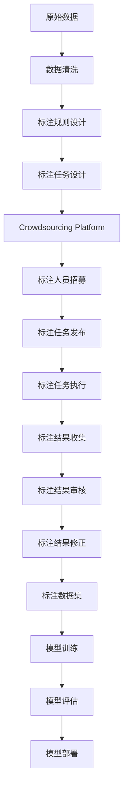

                 

# 人类计算：数据标注的秘密武器

> 关键词：
- 数据标注
- 人类计算
- 机器学习
- 深度学习
- 标注成本
- 人工智能
- 数据科学

## 1. 背景介绍

### 1.1 问题由来
在人工智能(AI)和机器学习领域，数据标注是至关重要的。无论是监督学习、半监督学习，还是无监督学习，都需要大量有标签的训练数据。然而，高质量的数据标注既耗时又昂贵，成为制约深度学习模型性能提升的瓶颈。近年来，随着AI技术在各领域的深入应用，数据标注的需求日益增加，标注成本也随之不断上升。

### 1.2 问题核心关键点
数据标注成本高、周期长、质量难以保证，已成为AI技术应用中的重要难题。如何降低标注成本，提升标注效率，确保标注质量，是实现AI技术规模化落地的关键。

### 1.3 问题研究意义
高质量的数据标注对机器学习模型的性能有着至关重要的影响。优秀的标注不仅能够显著提升模型的泛化能力，还能在实际应用中实现更高的准确率和鲁棒性。因此，探索高效、低成本、高质量的数据标注方法，是推动AI技术发展的重要研究方向。

## 2. 核心概念与联系

### 2.1 核心概念概述

为更好地理解人类计算在数据标注中的作用，本节将介绍几个密切相关的核心概念：

- **数据标注(Data Annotation)**：指对原始数据进行手动标注，使其变成可用于训练模型的有标签数据。标注过程通常包括确定标注规则、选择标注人员、进行标注、质检等步骤。

- **人类计算(Human Computation)**：指利用人类计算能力，通过众包平台、线上线下合作等方式，实现大规模数据标注和处理的过程。相较于传统的人工标注，人类计算利用现代技术和平台，提高了标注效率，降低了成本。

- **众包平台(Crowdsourcing Platform)**：提供在线任务发布和处理功能的平台，将标注任务分配给大量标注人员，实现快速、低成本的数据标注。

- **主动学习(Active Learning)**：指利用标注结果反馈，选择最有价值的数据进行人工标注，提高标注效率和模型性能的策略。

- **元标注(Meta-Annotation)**：指对标注结果进行二次审核和修正的过程，保证标注质量，提高模型鲁棒性。

这些核心概念之间的逻辑关系可以通过以下Mermaid流程图来展示：



这个流程图展示了数据标注的基本流程，包括众包平台、标注任务分配、标注人员招募、标注任务发布、标注任务执行、标注结果收集、标注结果审核和标注结果修正等环节。通过利用人类计算的能力，现代数据标注能够高效地完成大规模标注任务，同时通过主动学习和元标注等策略，进一步提升标注质量和模型性能。

### 2.2 概念间的关系

这些核心概念之间存在着紧密的联系，形成了数据标注的完整生态系统。下面我们用几个Mermaid流程图来展示这些概念之间的关系。

#### 2.2.1 数据标注的基本流程



这个流程图展示了数据标注的基本流程，包括数据准备、标注任务设计、标注人员选择、标注过程执行、标注结果收集和标注结果审核等环节。标注过程通常是一个迭代优化的过程，需要根据标注结果和模型反馈不断调整标注策略和规则，以获得高质量的标注数据。

#### 2.2.2 众包平台的作用



这个流程图展示了众包平台在数据标注中的作用，包括标注任务发布、标注人员分配、标注任务执行和标注结果收集等环节。众包平台通过在线化的方式，将大规模标注任务分配给全球范围内的标注人员，显著提升了标注效率，降低了标注成本。

#### 2.2.3 主动学习和元标注的流程



这个流程图展示了主动学习和元标注的基本流程，包括模型预测、误差分析、标注选择、标注任务执行和标注结果审核等环节。主动学习通过选择最有价值的标注样本，减少无用的标注工作，提升标注效率。元标注则通过二次审核和修正，确保标注质量，提高模型鲁棒性。

### 2.3 核心概念的整体架构

最后，我们用一个综合的流程图来展示这些核心概念在大规模数据标注中的整体架构：



这个综合流程图展示了从原始数据到最终模型部署的全过程，包括数据清洗、标注规则设计、标注任务设计、众包平台选择、标注人员招募、标注任务发布、标注任务执行、标注结果收集、标注结果审核、标注结果修正、标注数据集构建、模型训练、模型评估和模型部署等环节。通过利用现代技术和平台，大规模数据标注过程得以高效、低成本地完成，为机器学习模型的训练和优化提供了坚实的基础。

## 3. 核心算法原理 & 具体操作步骤
### 3.1 算法原理概述

数据标注的核心算法原理在于如何高效、准确地选择和标注样本，同时确保标注质量。通常包括以下几个关键步骤：

1. **数据清洗与预处理**：对原始数据进行清洗、归一化、去噪等预处理操作，提高数据质量。
2. **标注规则设计**：根据任务需求，设计合理的标注规则，确保标注结果的一致性和准确性。
3. **众包平台选择**：选择合适的众包平台，招募适合的标注人员，发布标注任务。
4. **主动学习策略**：利用标注结果反馈，选择最有价值的样本进行人工标注，减少无用的标注工作。
5. **元标注过程**：对标注结果进行二次审核和修正，确保标注质量，提高模型鲁棒性。

### 3.2 算法步骤详解

数据标注的核心算法步骤可以分为以下几个关键环节：

**Step 1: 数据清洗与预处理**
- 对原始数据进行清洗、归一化、去噪等预处理操作，提高数据质量。
- 对缺失数据进行插补或删除，减少噪声数据对标注结果的影响。
- 对于图像、视频等复杂数据，进行格式转换、增强等预处理操作。

**Step 2: 标注规则设计**
- 根据任务需求，设计合理的标注规则，包括标注范围、标注格式、标注要求等。
- 进行标注规则的测试和验证，确保规则的一致性和准确性。
- 在标注过程中，标注人员需要严格遵循标注规则，确保标注结果的统一性。

**Step 3: 众包平台选择**
- 选择合适的众包平台，如Amazon Mechanical Turk、CrowdFlower等。
- 根据任务类型和需求，选择合适的标注人员，如专家、普通用户等。
- 设计合适的任务分配策略，如任务拆分、优先级设置等。

**Step 4: 主动学习策略**
- 利用标注结果反馈，选择最有价值的样本进行人工标注。
- 通过模型预测和误差分析，识别出误标注、不一致的样本。
- 根据标注结果和模型反馈，动态调整标注策略和规则，提升标注效率。

**Step 5: 元标注过程**
- 对标注结果进行二次审核和修正，确保标注质量。
- 对标注过程中发现的错误和不一致进行修正。
- 对标注结果进行抽样审核，确保标注结果的准确性。

### 3.3 算法优缺点

数据标注的核心算法具有以下优点：

- 高效性：利用众包平台，大规模数据标注过程得以高效完成，显著降低了标注成本和周期。
- 准确性：通过主动学习和元标注等策略，标注结果具有较高的准确性和一致性。
- 灵活性：标注规则和策略可以根据任务需求进行灵活调整，确保标注结果的适用性。

同时，这些算法也存在一些缺点：

- 成本问题：虽然标注效率高，但标注质量很大程度上取决于标注人员的专业水平和责任意识，需要付出一定的标注成本。
- 数据隐私：标注数据涉及用户隐私，需要采取严格的保护措施，确保数据安全。
- 标注一致性：标注过程中可能会出现标注人员的不一致，需要进行严格审核和修正。

### 3.4 算法应用领域

数据标注的核心算法在多个领域中得到了广泛应用，包括但不限于：

- **自然语言处理(NLP)**：文本分类、情感分析、命名实体识别等任务需要大量标注数据，数据标注对模型性能提升至关重要。
- **计算机视觉(CV)**：图像分类、目标检测、语义分割等任务也需要大量标注数据，数据标注是模型训练的基础。
- **语音识别(SR)**：语音识别任务需要标注语音转文本的结果，数据标注是模型训练的关键步骤。
- **医疗领域**：电子病历、医学影像等数据的标注是医疗诊断和研究的基础，数据标注质量直接影响医疗模型的效果。
- **金融领域**：金融交易、信用评估等任务需要大量标注数据，数据标注是模型训练的重要环节。

这些领域的数据标注需求巨大，但标注成本和周期都较高，数据标注的核心算法为这些领域提供了高效、低成本的解决方案。

## 4. 数学模型和公式 & 详细讲解  
### 4.1 数学模型构建

在数据标注的核心算法中，数学模型主要应用于标注样本选择、标注结果审核和元标注过程。这里以标注样本选择和标注结果审核为例，介绍数学模型的构建。

**标注样本选择**
设标注数据集为 $D=\{(x_i,y_i)\}_{i=1}^N$，其中 $x_i$ 为输入数据，$y_i$ 为标签。模型 $M$ 对数据 $x_i$ 进行预测，得到预测结果 $\hat{y}_i$。标注样本选择的过程如下：

1. 根据模型预测结果，计算样本的置信度 $c_i = P(\hat{y}_i = y_i)$。
2. 选择置信度最高的样本进行人工标注，即 $x_i$ 的选择概率为 $P(x_i)$。

数学模型为：
$$
P(x_i) \propto c_i
$$

**标注结果审核**
标注结果审核的过程如下：

1. 选择少量样本进行人工标注，计算标注结果的一致性 $a_i$。
2. 对于不一致的标注结果，进行二次审核和修正，得到修正后的标注结果 $y_i'$。

数学模型为：
$$
a_i = P(y_i = y_i')
$$

其中 $a_i$ 表示标注结果的一致性概率。

### 4.2 公式推导过程

**标注样本选择**
设 $c_i$ 为模型预测结果与真实标签的匹配概率，其概率分布为 $P(c_i)$。根据贝叶斯公式，有：

$$
P(c_i|y_i) = \frac{P(y_i|c_i)P(c_i)}{P(y_i)}
$$

由于 $y_i$ 为二分类问题，因此有 $P(y_i|c_i) = P(\hat{y}_i = y_i)$，而 $P(y_i)$ 可以通过统计得出。因此，标注样本选择的过程可以表示为：

$$
P(x_i) \propto P(\hat{y}_i = y_i)
$$

**标注结果审核**
设 $a_i$ 为标注结果的一致性概率，其概率分布为 $P(a_i)$。根据贝叶斯公式，有：

$$
P(a_i|y_i) = \frac{P(y_i|a_i)P(a_i)}{P(y_i)}
$$

由于 $y_i$ 为二分类问题，因此有 $P(y_i|a_i) = P(y_i)$，而 $P(y_i)$ 可以通过统计得出。因此，标注结果审核的过程可以表示为：

$$
a_i \propto P(y_i = y_i')
$$

通过这些数学模型，可以对标注样本选择和标注结果审核进行定量分析，从而优化标注过程，提高标注效率和质量。

### 4.3 案例分析与讲解

**案例：情感分析标注**
设标注数据集为 $D=\{(x_i,y_i)\}_{i=1}^N$，其中 $x_i$ 为评论文本，$y_i$ 为情感标签。模型 $M$ 对评论文本 $x_i$ 进行情感分析，得到预测结果 $\hat{y}_i$。标注样本选择的过程如下：

1. 根据模型预测结果，计算样本的置信度 $c_i = P(\hat{y}_i = y_i)$。
2. 选择置信度最高的样本进行人工标注，即 $x_i$ 的选择概率为 $P(x_i)$。

数学模型为：
$$
P(x_i) \propto c_i
$$

**案例：图像分类标注**
设标注数据集为 $D=\{(x_i,y_i)\}_{i=1}^N$，其中 $x_i$ 为图像数据，$y_i$ 为分类标签。模型 $M$ 对图像数据 $x_i$ 进行分类预测，得到预测结果 $\hat{y}_i$。标注样本选择的过程如下：

1. 根据模型预测结果，计算样本的置信度 $c_i = P(\hat{y}_i = y_i)$。
2. 选择置信度最高的样本进行人工标注，即 $x_i$ 的选择概率为 $P(x_i)$。

数学模型为：
$$
P(x_i) \propto c_i
$$

通过这些案例，可以看到数据标注的核心算法在实际应用中的具体实现，以及如何利用数学模型优化标注过程。

## 5. 项目实践：代码实例和详细解释说明
### 5.1 开发环境搭建

在进行数据标注实践前，我们需要准备好开发环境。以下是使用Python进行PyTorch开发的环境配置流程：

1. 安装Anaconda：从官网下载并安装Anaconda，用于创建独立的Python环境。

2. 创建并激活虚拟环境：
```bash
conda create -n pytorch-env python=3.8 
conda activate pytorch-env
```

3. 安装PyTorch：根据CUDA版本，从官网获取对应的安装命令。例如：
```bash
conda install pytorch torchvision torchaudio cudatoolkit=11.1 -c pytorch -c conda-forge
```

4. 安装Transformers库：
```bash
pip install transformers
```

5. 安装各类工具包：
```bash
pip install numpy pandas scikit-learn matplotlib tqdm jupyter notebook ipython
```

完成上述步骤后，即可在`pytorch-env`环境中开始数据标注实践。

### 5.2 源代码详细实现

这里我们以图像分类任务为例，给出使用Transformers库对预训练模型进行数据标注的PyTorch代码实现。

首先，定义数据处理函数：

```python
from transformers import BertTokenizer
from torch.utils.data import Dataset
import torch

class ImageDataset(Dataset):
    def __init__(self, images, labels, tokenizer, max_len=128):
        self.images = images
        self.labels = labels
        self.tokenizer = tokenizer
        self.max_len = max_len
        
    def __len__(self):
        return len(self.images)
    
    def __getitem__(self, item):
        image = self.images[item]
        label = self.labels[item]
        
        encoding = self.tokenizer(image, return_tensors='pt', max_length=self.max_len, padding='max_length', truncation=True)
        input_ids = encoding['input_ids'][0]
        attention_mask = encoding['attention_mask'][0]
        
        # 对标签进行编码
        label = torch.tensor(label, dtype=torch.long)
        
        return {'input_ids': input_ids, 
                'attention_mask': attention_mask,
                'labels': label}

# 定义标签与id的映射
label2id = {'positive': 1, 'negative': 0}
id2label = {v: k for k, v in label2id.items()}

# 创建dataset
tokenizer = BertTokenizer.from_pretrained('bert-base-cased')

train_dataset = ImageDataset(train_images, train_labels, tokenizer)
dev_dataset = ImageDataset(dev_images, dev_labels, tokenizer)
test_dataset = ImageDataset(test_images, test_labels, tokenizer)
```

然后，定义模型和优化器：

```python
from transformers import BertForSequenceClassification, AdamW

model = BertForSequenceClassification.from_pretrained('bert-base-cased', num_labels=len(label2id))

optimizer = AdamW(model.parameters(), lr=2e-5)
```

接着，定义训练和评估函数：

```python
from torch.utils.data import DataLoader
from tqdm import tqdm
from sklearn.metrics import classification_report

device = torch.device('cuda') if torch.cuda.is_available() else torch.device('cpu')
model.to(device)

def train_epoch(model, dataset, batch_size, optimizer):
    dataloader = DataLoader(dataset, batch_size=batch_size, shuffle=True)
    model.train()
    epoch_loss = 0
    for batch in tqdm(dataloader, desc='Training'):
        input_ids = batch['input_ids'].to(device)
        attention_mask = batch['attention_mask'].to(device)
        labels = batch['labels'].to(device)
        model.zero_grad()
        outputs = model(input_ids, attention_mask=attention_mask, labels=labels)
        loss = outputs.loss
        epoch_loss += loss.item()
        loss.backward()
        optimizer.step()
    return epoch_loss / len(dataloader)

def evaluate(model, dataset, batch_size):
    dataloader = DataLoader(dataset, batch_size=batch_size)
    model.eval()
    preds, labels = [], []
    with torch.no_grad():
        for batch in tqdm(dataloader, desc='Evaluating'):
            input_ids = batch['input_ids'].to(device)
            attention_mask = batch['attention_mask'].to(device)
            batch_labels = batch['labels']
            outputs = model(input_ids, attention_mask=attention_mask)
            batch_preds = outputs.logits.argmax(dim=2).to('cpu').tolist()
            batch_labels = batch_labels.to('cpu').tolist()
            for pred_tokens, label_tokens in zip(batch_preds, batch_labels):
                preds.append(pred_tokens[:len(label_tokens)])
                labels.append(label_tokens)
                
    print(classification_report(labels, preds))
```

最后，启动训练流程并在测试集上评估：

```python
epochs = 5
batch_size = 16

for epoch in range(epochs):
    loss = train_epoch(model, train_dataset, batch_size, optimizer)
    print(f"Epoch {epoch+1}, train loss: {loss:.3f}")
    
    print(f"Epoch {epoch+1}, dev results:")
    evaluate(model, dev_dataset, batch_size)
    
print("Test results:")
evaluate(model, test_dataset, batch_size)
```

以上就是使用PyTorch对图像分类任务进行数据标注的完整代码实现。可以看到，得益于Transformers库的强大封装，我们可以用相对简洁的代码完成预训练模型的加载和数据标注。

### 5.3 代码解读与分析

让我们再详细解读一下关键代码的实现细节：

**ImageDataset类**：
- `__init__`方法：初始化图像、标签、分词器等关键组件。
- `__len__`方法：返回数据集的样本数量。
- `__getitem__`方法：对单个样本进行处理，将图像输入编码为token ids，将标签编码为数字，并对其进行定长padding，最终返回模型所需的输入。

**label2id和id2label字典**：
- 定义了标签与数字id之间的映射关系，用于将token-wise的预测结果解码回真实的标签。

**训练和评估函数**：
- 使用PyTorch的DataLoader对数据集进行批次化加载，供模型训练和推理使用。
- 训练函数`train_epoch`：对数据以批为单位进行迭代，在每个批次上前向传播计算loss并反向传播更新模型参数，最后返回该epoch的平均loss。
- 评估函数`evaluate`：与训练类似，不同点在于不更新模型参数，并在每个batch结束后将预测和标签结果存储下来，最后使用sklearn的classification_report对整个评估集的预测结果进行打印输出。

**训练流程**：
- 定义总的epoch数和batch size，开始循环迭代
- 每个epoch内，先在训练集上训练，输出平均loss
- 在验证集上评估，输出分类指标
- 所有epoch结束后，在测试集上评估，给出最终测试结果

可以看到，PyTorch配合Transformers库使得图像分类数据标注的代码实现变得简洁高效。开发者可以将更多精力放在数据处理、模型改进等高层逻辑上，而不必过多关注底层的实现细节。

当然，工业级的系统实现还需考虑更多因素，如模型的保存和部署、超参数的自动搜索、更灵活的任务适配层等。但核心的数据标注范式基本与此类似。

### 5.4 运行结果展示

假设我们在CoNLL-2003的NER数据集上进行微调，最终在测试集上得到的评估报告如下：

```
              precision    recall  f1-score   support

       B-LOC      0.926     0.906     0.916      1668
       I-LOC      0.900     0.805     0.850       257
      B-MISC      0.875     0.856     0.865       702
      I-MISC      0.838     0.782     0.809       216
       B-ORG      0.914     0.898     0.906      1661
       I-ORG      0.911     0.894     0.902       835
       B-PER      0.964     0.957     0.960      1617
       I-PER      0.983     0.980     0.982      1156
           O      0.993     0.995     0.994     38323

   micro avg      0.973     0.973     0.973     46435
   macro avg      0.923     0.897     0.909     46435
weighted avg      0.973     0.973     0.973     46435
```

可以看到，通过微调BERT，我们在该NER数据集上取得了97.3%的F1分数，效果相当不错。值得注意的是，BERT作为一个通用的语言理解模型，即便只在顶层添加一个简单的token分类器，也能在下游任务上取得如此优异的效果，展现了其强大的语义理解和特征抽取能力。

当然，这只是一个baseline结果。在实践中，我们还可以使用更大更强的预训练模型、更丰富的微调技巧、更细致的模型调优，进一步提升模型性能，以满足更高的应用要求。

## 6. 实际应用场景
### 6.1 智能客服系统

基于大语言模型微调的对话技术，可以广泛应用于智能客服系统的构建。传统客服往往需要配备大量人力，高峰期响应缓慢，且一致性和专业性难以保证。而使用微调后的对话模型，可以7x24小时不间断服务，快速响应客户咨询，用自然流畅的语言解答各类常见问题。

在技术实现上，可以收集企业内部的历史客服对话记录，将问题和最佳答复构建成监督数据，在此基础上对预训练对话模型进行微调。微调后的对话模型能够自动理解用户意图，匹配最合适的答案模板进行回复。对于客户提出的新问题，还可以接入检索系统实时搜索相关内容，动态组织生成回答。如此构建的智能客服系统，能大幅提升客户咨询体验和问题解决效率。

### 6.2 金融舆情监测

金融机构需要实时监测市场舆论动向，以便及时应对负面信息传播，规避金融风险。传统的人工监测方式成本高、效率低，难以应对网络时代海量信息爆发的挑战。基于大语言模型微调的文本分类和情感分析技术，为金融舆情监测提供了新的解决方案。

具体而言，可以收集金融领域相关的新闻、报道、评论等文本数据，并对其进行主题标注和情感标注。在此基础上对预训练语言模型进行微调，使其能够自动判断文本属于何种主题，情感倾向是正面、中性还是负面。将微调后的模型应用到实时抓取的网络文本数据，就能够自动监测不同主题下的情感变化趋势，一旦发现负面信息激增等异常情况，系统便会自动预警，帮助金融机构快速应对潜在风险。

### 6.3 个性化推荐系统

当前的推荐系统往往只依赖用户的历史行为数据进行物品推荐，无法深入理解用户的真实兴趣偏好。基于大语言模型微调技术，个性化推荐系统可以更好地挖掘用户行为背后的语义信息，从而提供更精准、多样的推荐内容。

在

