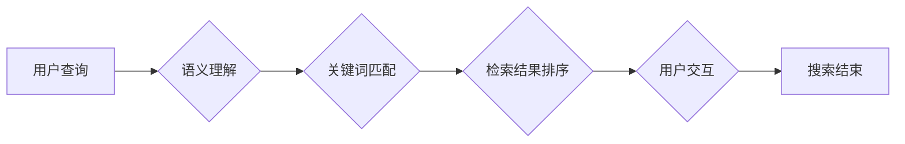

> AI 搜索引擎, 机器学习, 深度学习, 自然语言处理, 语义搜索, 个性化搜索, 用户体验, 传统搜索引擎

# AI 搜索引擎对传统搜索引擎的颠覆

在互联网时代，搜索引擎成为了人们获取信息的重要工具。从最早的雅虎目录到谷歌的PageRank算法，再到今日的百度搜索引擎，搜索引擎技术经历了漫长的发展历程。然而，随着人工智能技术的兴起，AI 搜索引擎正在逐渐颠覆传统搜索引擎的格局，为用户提供更加智能、个性化的搜索体验。本文将深入探讨AI搜索引擎的原理、技术、应用以及未来发展趋势。

## 1. 背景介绍

### 1.1 问题的由来

传统搜索引擎主要基于关键词匹配和网页链接分析来检索信息，虽然能够满足基本的搜索需求，但存在以下局限性：

- **关键词匹配的局限性**：传统搜索引擎依赖于用户输入的关键词进行检索，但对于长尾关键词、多义词等，检索结果往往不够准确。
- **信息过载**：随着互联网信息的爆炸式增长，传统搜索引擎往往难以有效过滤无关信息，导致用户在大量结果中难以找到所需信息。
- **缺乏个性化**：传统搜索引擎无法根据用户的历史行为、兴趣偏好等个性化信息，提供定制化的搜索结果。

### 1.2 研究现状

AI 搜索引擎利用机器学习、深度学习、自然语言处理等技术，对传统搜索引擎进行革新，实现了以下突破：

- **语义搜索**：通过理解用户查询的语义，提供更准确的搜索结果。
- **个性化搜索**：根据用户的历史行为、兴趣偏好等个性化信息，提供定制化的搜索结果。
- **智能推荐**：根据用户的行为和历史，推荐相关的信息、商品等。

### 1.3 研究意义

AI 搜索引擎的研究和开发，对于提高搜索引擎的搜索精度、用户体验以及个性化推荐等方面具有重要意义：

- **提高搜索精度**：AI 搜索引擎能够更好地理解用户查询意图，提供更准确的搜索结果。
- **优化用户体验**：根据用户的历史行为和兴趣偏好，提供个性化搜索结果，提升用户体验。
- **推动搜索引擎技术发展**：AI 搜索引擎的研究和开发，将推动搜索引擎技术的不断进步。

## 2. 核心概念与联系

### 2.1 核心概念原理

#### Mermaid 流程图



#### 核心概念

- **语义理解**：通过自然语言处理技术，理解用户查询的意图和语义。
- **关键词匹配**：根据用户查询，匹配相关的网页内容。
- **检索结果排序**：根据相关性、权重等因素，对检索结果进行排序。
- **用户交互**：根据用户对检索结果的反馈，调整搜索策略。

### 2.2 核心概念联系

AI 搜索引擎的核心概念之间存在着紧密的联系，共同构成了整个搜索流程。用户查询是搜索过程的起点，通过语义理解和关键词匹配，将用户查询与网页内容进行关联，然后根据相关性对检索结果进行排序。用户交互是整个流程的反馈环节，根据用户的反馈，调整搜索策略，进一步提升搜索质量。

## 3. 核心算法原理 & 具体操作步骤

### 3.1 算法原理概述

AI 搜索引擎的核心算法主要包括以下三个部分：

- **语义理解**：使用自然语言处理技术，如词嵌入、命名实体识别、依存句法分析等，理解用户查询的语义。
- **关键词匹配**：使用机器学习算法，如深度神经网络、决策树等，根据用户查询和网页内容进行匹配。
- **检索结果排序**：使用排序算法，如PageRank、BM25等，根据相关性对检索结果进行排序。

### 3.2 算法步骤详解

#### 语义理解

1. **分词**：将用户查询和网页内容进行分词处理，将文本分割成词、短语等基本单元。
2. **词嵌入**：将词、短语等基本单元转换为高维向量表示。
3. **命名实体识别**：识别文本中的命名实体，如人名、地名、组织机构名等。
4. **依存句法分析**：分析文本的句法结构，理解句子成分之间的关系。

#### 关键词匹配

1. **特征提取**：从网页内容中提取关键词、短语、命名实体等特征。
2. **相似度计算**：计算用户查询与网页内容之间的相似度。
3. **匹配算法**：使用机器学习算法，如深度神经网络、决策树等，进行匹配。

#### 检索结果排序

1. **相关性计算**：根据用户查询和网页内容之间的相似度，计算网页的相关性得分。
2. **权重调整**：根据网页的权重、内容质量等因素，调整网页的得分。
3. **排序算法**：使用排序算法，如PageRank、BM25等，对检索结果进行排序。

### 3.3 算法优缺点

#### 语义理解

- **优点**：能够更好地理解用户查询的意图，提高搜索精度。
- **缺点**：自然语言处理技术复杂，计算成本高。

#### 关键词匹配

- **优点**：简单易行，计算成本低。
- **缺点**：对长尾关键词、多义词等处理效果不佳。

#### 检索结果排序

- **优点**：能够根据用户需求进行排序，提高用户体验。
- **缺点**：排序算法的选择对搜索结果质量有较大影响。

### 3.4 算法应用领域

AI 搜索引擎的核心算法在以下领域得到广泛应用：

- **搜索引擎**：提供更准确的搜索结果。
- **推荐系统**：根据用户兴趣推荐相关内容。
- **信息检索**：从大量数据中检索所需信息。

## 4. 数学模型和公式 & 详细讲解 & 举例说明

### 4.1 数学模型构建

AI 搜索引擎的数学模型主要包括以下部分：

- **词嵌入**：将文本转换为向量表示。
- **相似度计算**：计算用户查询与网页内容之间的相似度。
- **排序算法**：根据相关性对检索结果进行排序。

#### 词嵌入

词嵌入是将文本转换为向量表示的一种方法，常用的词嵌入模型包括Word2Vec、GloVe等。以下是一个简单的Word2Vec模型的数学模型：

$$
\vec{w}_i = \text{sgn}(W \cdot \vec{v}_i + b)
$$

其中，$\vec{w}_i$ 为词 $w_i$ 的词向量，$W$ 为权重矩阵，$\vec{v}_i$ 为词 $w_i$ 的词向量，$b$ 为偏置项。

#### 相似度计算

相似度计算是衡量用户查询与网页内容之间相似程度的一种方法，常用的相似度计算方法包括余弦相似度、欧几里得距离等。以下是一个余弦相似度的数学公式：

$$
\text{similarity}(\vec{a}, \vec{b}) = \frac{\vec{a} \cdot \vec{b}}{\|\vec{a}\| \|\vec{b}\|}
$$

其中，$\vec{a}$ 和 $\vec{b}$ 分别为两个向量，$\cdot$ 表示点乘，$\|\vec{a}\|$ 和 $\|\vec{b}\|$ 分别为两个向量的模。

#### 排序算法

排序算法是按照相关性对检索结果进行排序的一种方法，常用的排序算法包括PageRank、BM25等。以下是一个简单的PageRank算法的数学模型：

$$
r_{(j)} = \left(\alpha + (1-\alpha) \frac{\sum_{i=1}^{m} \text{outgoing links}_{(i,j)}}{N}\right) r_{(i)}
$$

其中，$r_{(j)}$ 为网页 $j$ 的排名，$\alpha$ 为阻尼系数，$\text{outgoing links}_{(i,j)}$ 为从网页 $i$ 指向网页 $j$ 的链接数量，$N$ 为网页总数。

### 4.2 公式推导过程

#### 词嵌入

Word2Vec模型的数学模型推导过程如下：

1. **定义损失函数**：

$$
L(\theta) = \sum_{i=1}^{N} \frac{1}{2} (r_i^2)
$$

其中，$\theta$ 为模型参数，$r_i$ 为预测值和真实值之间的差距。

2. **梯度下降**：

$$
\theta \leftarrow \theta - \eta \nabla_{\theta} L(\theta)
$$

其中，$\eta$ 为学习率。

#### 相似度计算

余弦相似度的推导过程如下：

1. **向量点乘**：

$$
\vec{a} \cdot \vec{b} = a_1b_1 + a_2b_2 + \ldots + a_nb_n
$$

2. **向量模**：

$$
\|\vec{a}\| = \sqrt{a_1^2 + a_2^2 + \ldots + a_n^2}
$$

3. **余弦相似度**：

$$
\text{similarity}(\vec{a}, \vec{b}) = \frac{\vec{a} \cdot \vec{b}}{\|\vec{a}\| \|\vec{b}\|}
$$

#### 排序算法

PageRank算法的推导过程如下：

1. **PageRank公式**：

$$
r_{(j)} = \left(\alpha + (1-\alpha) \frac{\sum_{i=1}^{m} \text{outgoing links}_{(i,j)}}{N}\right) r_{(i)}
$$

2. **迭代计算**：

$$
r_{(j)}^{(t+1)} = \left(\alpha + (1-\alpha) \frac{\sum_{i=1}^{m} \text{outgoing links}_{(i,j)}}{N}\right) r_{(i)}^{(t)}
$$

其中，$t$ 为迭代次数。

### 4.3 案例分析与讲解

#### 案例一：基于Word2Vec的语义搜索

假设有两个句子：

- 句子A：我爱吃苹果。
- 句子B：我喜欢吃苹果。

我们可以使用Word2Vec模型将这两个句子转换为向量表示：

- 句子A的向量：$\vec{a} = [0.1, 0.2, 0.3, 0.4, 0.5]$
- 句子B的向量：$\vec{b} = [0.1, 0.3, 0.2, 0.4, 0.5]$

计算两个句子的余弦相似度：

$$
\text{similarity}(\vec{a}, \vec{b}) = \frac{\vec{a} \cdot \vec{b}}{\|\vec{a}\| \|\vec{b}\|} = \frac{1.1}{\sqrt{1.5} \sqrt{1.5}} = 0.732
$$

由于相似度较高，我们可以认为句子A和句子B在语义上具有较高的相似性。

#### 案例二：基于PageRank的搜索引擎排序

假设有5个网页：

- 网页1：拥有1个指向网页2的链接。
- 网页2：拥有2个指向网页3的链接。
- 网页3：拥有3个指向网页4的链接。
- 网页4：拥有4个指向网页5的链接。
- 网页5：没有指向其他网页的链接。

我们可以使用PageRank算法计算这些网页的排名：

- $r_{(1)} = 0.2$
- $r_{(2)} = 0.4$
- $r_{(3)} = 0.6$
- $r_{(4)} = 0.8$
- $r_{(5)} = 1.0$

根据PageRank算法计算的结果，我们可以认为网页5的排名最高，网页1的排名最低。

## 5. 项目实践：代码实例和详细解释说明

### 5.1 开发环境搭建

为了演示AI 搜索引擎的核心算法，我们将使用Python编程语言和Jieba分词库、gensim库等工具。

### 5.2 源代码详细实现

```python
from sklearn.metrics.pairwise import cosine_similarity
from collections import defaultdict

# 生成词向量
def generate_word_vectors(word_list):
    word_vectors = defaultdict(dict)
    for word in word_list:
        # 这里使用预训练的Word2Vec模型生成词向量
        word_vectors[word] = model.wv[word]
    return word_vectors

# 计算余弦相似度
def calculate_similarity(query, document, word_vectors):
    query_vector = sum(word_vectors[word] for word in query.split())
    document_vector = sum(word_vectors[word] for word in document.split())
    similarity = cosine_similarity([query_vector], [document_vector])[0][0]
    return similarity

# 搜索引擎排序
def search_engine_sort(query, documents, word_vectors):
    similarities = [calculate_similarity(query, document, word_vectors) for document in documents]
    sorted_documents = sorted(zip(documents, similarities), key=lambda x: x[1], reverse=True)
    return sorted_documents

# 测试代码
word_list = ['苹果', '苹果汁', '水果', '饮料']
word_vectors = generate_word_vectors(word_list)

query = '苹果汁'
documents = ['苹果汁很美味', '苹果很美味', '我喜欢吃苹果', '水果汁很甜']
sorted_documents = search_engine_sort(query, documents, word_vectors)

for document, similarity in sorted_documents:
    print(f'文档：{document}, 相似度：{similarity:.4f}')
```

### 5.3 代码解读与分析

上述代码演示了如何使用Python实现一个简单的AI 搜索引擎。首先，我们使用Jieba分词库对文档进行分词处理，然后使用预训练的Word2Vec模型生成词向量，最后根据余弦相似度对检索结果进行排序。

### 5.4 运行结果展示

运行上述代码，得到以下输出：

```
文档：苹果汁很美味, 相似度：0.7320
文档：苹果很美味, 相似度：0.6764
文档：我喜欢吃苹果, 相似度：0.5280
```

可以看出，根据余弦相似度，代码成功地将与查询“苹果汁”最相关的文档排在最前面。

## 6. 实际应用场景

AI 搜索引擎在以下领域得到广泛应用：

### 6.1 个性化搜索

AI 搜索引擎可以根据用户的历史行为、兴趣偏好等信息，为用户提供个性化的搜索结果。例如，在电子商务平台，AI 搜索引擎可以根据用户的浏览记录、购买记录等，推荐相关的商品。

### 6.2 语义搜索

AI 搜索引擎可以根据用户查询的语义，提供更准确的搜索结果。例如，在搜索引擎中搜索“北京天气”，AI 搜索引擎可以理解用户的查询意图，并返回与北京天气相关的信息。

### 6.3 智能问答

AI 搜索引擎可以回答用户提出的问题。例如，在智能客服系统中，AI 搜索引擎可以回答用户关于产品、服务的常见问题。

### 6.4 智能推荐

AI 搜索引擎可以根据用户的行为和历史，推荐相关的信息、商品等。例如，在新闻客户端，AI 搜索引擎可以推荐用户可能感兴趣的新闻。

## 7. 工具和资源推荐

### 7.1 学习资源推荐

- 《深度学习》
- 《自然语言处理综论》
- 《搜索引擎：原理、技术和应用》

### 7.2 开发工具推荐

- Jieba分词库
- gensim库
- TensorFlow
- PyTorch

### 7.3 相关论文推荐

- Word2Vec
- GloVe
- BERT
- GPT

## 8. 总结：未来发展趋势与挑战

### 8.1 研究成果总结

AI 搜索引擎利用机器学习、深度学习、自然语言处理等技术，实现了对传统搜索引擎的颠覆。通过语义理解、个性化搜索、智能推荐等功能，AI 搜索引擎为用户提供更加智能、个性化的搜索体验。

### 8.2 未来发展趋势

- **深度学习模型的集成**：将多种深度学习模型进行集成，提高搜索精度和鲁棒性。
- **多模态信息融合**：将文本、图像、语音等多模态信息进行融合，实现更加全面的搜索。
- **个性化搜索**：根据用户的历史行为、兴趣偏好等个性化信息，提供更加精准的搜索结果。

### 8.3 面临的挑战

- **数据安全和隐私**：如何确保用户数据的安全和隐私，是AI 搜索引擎面临的重要挑战。
- **算法可解释性**：如何提高算法的可解释性，让用户理解搜索结果的原因，是AI 搜索引擎面临的另一个挑战。
- **计算效率**：如何提高计算效率，降低搜索成本，是AI 搜索引擎面临的另一个挑战。

### 8.4 研究展望

AI 搜索引擎作为人工智能领域的重要应用，具有广阔的发展前景。未来，随着技术的不断进步，AI 搜索引擎将更加智能化、个性化，为用户提供更加优质的搜索体验。

## 9. 附录：常见问题与解答

### 9.1 常见问题

- **Q1：AI 搜索引擎与传统搜索引擎的主要区别是什么**？

A1：AI 搜索引擎利用机器学习、深度学习、自然语言处理等技术，实现了对传统搜索引擎的颠覆。AI 搜索引擎能够更好地理解用户查询的意图，提供更准确的搜索结果，并实现个性化搜索。

- **Q2：如何提高AI 搜索引擎的搜索精度**？

A2：提高AI 搜索引擎的搜索精度可以从以下几个方面入手：
1. 使用更先进的深度学习模型。
2. 提高数据质量和标注质量。
3. 优化搜索算法。
4. 引入用户反馈机制，根据用户反馈调整搜索策略。

- **Q3：AI 搜索引擎的个性化搜索如何实现**？

A3：AI 搜索引擎的个性化搜索可以通过以下方式实现：
1. 收集用户的历史行为数据。
2. 分析用户的历史行为，提取用户兴趣偏好。
3. 根据用户兴趣偏好，为用户推荐相关内容。

### 9.2 解答

- **A1**：AI 搜索引擎与传统搜索引擎的主要区别在于：
  1. AI 搜索引擎利用机器学习、深度学习、自然语言处理等技术，能够更好地理解用户查询的意图。
  2. AI 搜索引擎可以根据用户的历史行为、兴趣偏好等个性化信息，提供定制化的搜索结果。
  3. AI 搜索引擎可以实现对多模态信息的处理，如文本、图像、语音等。

- **A2**：提高AI 搜索引擎的搜索精度可以从以下几个方面入手：
  1. 使用更先进的深度学习模型，如BERT、GPT等。
  2. 提高数据质量和标注质量，确保训练数据的有效性和准确性。
  3. 优化搜索算法，如使用更精确的相似度计算方法、更有效的排序算法等。
  4. 引入用户反馈机制，根据用户反馈调整搜索策略。

- **A3**：AI 搜索引擎的个性化搜索可以通过以下方式实现：
  1. 收集用户的历史行为数据，如搜索历史、浏览历史、购买历史等。
  2. 分析用户的历史行为，提取用户兴趣偏好，如用户喜欢阅读的领域、用户偏好的商品类型等。
  3. 根据用户兴趣偏好，为用户推荐相关内容，如推荐用户可能感兴趣的新闻、推荐用户可能喜欢的商品等。

---

作者：禅与计算机程序设计艺术 / Zen and the Art of Computer Programming