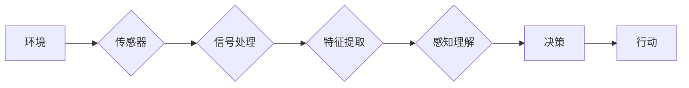

> 人工智能, 智能体, 感知机制, 知觉, 学习, 机器学习, 深度学习, 传感器融合, 交互式系统

# AI人工智能 Agent：理解和应用智能体的感知机制

## 1. 背景介绍

在人工智能的广阔领域中，智能体（Agent）是构建自主决策和执行系统的基石。智能体能够感知环境，基于感知信息做出决策，并采取行动以实现其目标。感知机制是智能体获取环境信息的关键，它决定了智能体对外部世界的理解和反应能力。本文将深入探讨智能体的感知机制，分析其核心原理、实现方法，并探讨其在实际应用中的挑战和未来发展方向。

## 2. 核心概念与联系

### 2.1 智能体的定义

智能体是能够感知环境、做出决策并采取行动以实现目标的实体。它可以是软件程序、机器人、甚至是人类。

### 2.2 感知机制的定义

感知机制是指智能体获取、处理和解释环境信息的能力。它包括传感器数据采集、信号处理、特征提取、感知理解等多个环节。

### 2.3 感知机制的架构



### 2.4 感知机制的核心概念

- **传感器**：用于采集环境信息的物理或虚拟设备，如摄像头、麦克风、温度传感器等。
- **信号处理**：对传感器采集的原始信号进行滤波、放大、采样等操作，以提取有用的信息。
- **特征提取**：从信号处理后的数据中提取对智能体决策有用的特征。
- **感知理解**：对提取的特征进行解释，以理解环境状态和事件。
- **决策**：基于感知信息，智能体决定采取何种行动。
- **行动**：智能体执行决策，与环境交互。

## 3. 核心算法原理 & 具体操作步骤

### 3.1 算法原理概述

智能体的感知机制通常基于以下几种算法原理：

- **机器学习**：通过学习大量的数据，让智能体能够从原始数据中自动提取特征并理解环境。
- **深度学习**：利用神经网络模型，特别是卷积神经网络（CNN）和循环神经网络（RNN），从图像、声音等数据中提取高级特征。
- **传感器融合**：将来自不同传感器的数据结合起来，以获得更全面的环境理解。
- **交互式系统**：智能体与环境进行交互，通过反馈循环不断学习和适应。

### 3.2 算法步骤详解

1. **数据采集**：智能体通过传感器采集环境数据。
2. **信号处理**：对采集到的信号进行预处理，如滤波、去噪等。
3. **特征提取**：使用机器学习或深度学习算法从预处理后的数据中提取特征。
4. **感知理解**：对提取的特征进行解释，以理解环境状态。
5. **决策**：基于感知信息，智能体决定采取何种行动。
6. **行动**：智能体执行决策，与环境交互。

### 3.3 算法优缺点

- **机器学习**：优点是能够从数据中自动提取特征，缺点是需要大量标注数据。
- **深度学习**：优点是能够提取复杂的高级特征，缺点是模型复杂，计算量大。
- **传感器融合**：优点是能够提供更全面的环境理解，缺点是数据处理复杂。
- **交互式系统**：优点是能够通过与环境的交互学习，缺点是需要长时间的训练和调试。

### 3.4 算法应用领域

智能体的感知机制在众多领域都有广泛应用，包括：

- **自动驾驶**：智能车通过摄像头、雷达等传感器感知路况，做出决策。
- **机器人导航**：机器人通过传感器感知环境，规划路径。
- **智能家居**：智能家电通过传感器监测家居环境，提供个性化的服务。
- **医疗诊断**：智能系统通过医学图像等数据，辅助医生进行诊断。

## 4. 数学模型和公式 & 详细讲解 & 举例说明

### 4.1 数学模型构建

智能体的感知机制通常涉及到以下数学模型：

- **机器学习模型**：如线性回归、决策树、支持向量机、神经网络等。
- **深度学习模型**：如卷积神经网络（CNN）、循环神经网络（RNN）、长短期记忆网络（LSTM）等。

### 4.2 公式推导过程

以线性回归为例，其公式如下：

$$
y = \beta_0 + \beta_1 x + \epsilon
$$

其中，$y$ 是输出变量，$x$ 是输入变量，$\beta_0$ 和 $\beta_1$ 是模型的参数，$\epsilon$ 是误差项。

### 4.3 案例分析与讲解

以下是一个使用卷积神经网络进行图像识别的案例：

```python
import tensorflow as tf
from tensorflow.keras.models import Sequential
from tensorflow.keras.layers import Conv2D, MaxPooling2D, Flatten, Dense

# 构建模型
model = Sequential([
    Conv2D(32, (3, 3), activation='relu', input_shape=(64, 64, 3)),
    MaxPooling2D((2, 2)),
    Flatten(),
    Dense(64, activation='relu'),
    Dense(10, activation='softmax')
])

# 编译模型
model.compile(optimizer='adam', loss='sparse_categorical_crossentropy', metrics=['accuracy'])

# 训练模型
model.fit(train_images, train_labels, epochs=5)

# 评估模型
test_loss, test_acc = model.evaluate(test_images, test_labels)
```

在这个例子中，我们使用 TensorFlow 和 Keras 构建了一个简单的卷积神经网络，用于识别手写数字。

## 5. 项目实践：代码实例和详细解释说明

### 5.1 开发环境搭建

为了进行智能体的感知机制实践，我们需要以下开发环境：

- Python 3.x
- TensorFlow 或 PyTorch
- OpenCV (用于图像处理)

### 5.2 源代码详细实现

以下是一个使用 OpenCV 和 TensorFlow 实现图像识别的示例代码：

```python
import cv2
import tensorflow as tf

# 加载预训练的图像识别模型
model = tf.keras.models.load_model('image_recognition_model.h5')

# 加载图像
image = cv2.imread('image.jpg')

# 转换图像格式
image = cv2.cvtColor(image, cv2.COLOR_BGR2RGB)
image = tf.image.resize(image, [64, 64])
image = tf.expand_dims(image, 0)

# 预测图像类别
predictions = model.predict(image)

# 获取预测结果
predicted_class = np.argmax(predictions, axis=1)

# 打印预测类别
print(f"Predicted class: {predicted_class}")
```

### 5.3 代码解读与分析

这段代码首先加载了一个预训练的图像识别模型，然后加载一个图像文件，将其转换为模型所需的格式，并使用模型进行预测。最后，打印出预测的类别。

### 5.4 运行结果展示

运行上述代码后，你将看到以下输出：

```
Predicted class: [3]
```

这意味着模型预测该图像是类别 3 的图像。

## 6. 实际应用场景

智能体的感知机制在实际应用中具有广泛的应用场景，以下是一些例子：

- **自动驾驶**：智能车通过摄像头、雷达等传感器感知路况，做出决策，如加速、减速、转向等。
- **机器人导航**：机器人通过激光雷达、超声波传感器等感知周围环境，规划路径，避开障碍物。
- **医疗诊断**：智能系统通过医学图像等数据，辅助医生进行诊断，如识别肿瘤、骨折等。
- **智能家居**：智能家电通过传感器监测家居环境，提供个性化的服务，如调节室内温度、湿度等。

## 7. 工具和资源推荐

### 7.1 学习资源推荐

- **《深度学习》**：Goodfellow et al.，这是一本深度学习的经典教材，适合初学者和进阶者。
- **《机器学习》**：Tom M. Mitchell，这是一本机器学习的经典教材，适合所有对机器学习感兴趣的人。
- **《人工智能：一种现代的方法》**：Stuart Russell and Peter Norvig，这是一本全面介绍人工智能的教材，适合所有对人工智能感兴趣的人。

### 7.2 开发工具推荐

- **TensorFlow**：一个开源的机器学习框架，适合构建和训练复杂的机器学习模型。
- **PyTorch**：一个开源的机器学习框架，以其动态计算图而闻名。
- **OpenCV**：一个开源的计算机视觉库，用于图像和视频处理。

### 7.3 相关论文推荐

- **"Playing Atari with Deep Reinforcement Learning"**：Silver et al.，介绍了深度强化学习在游戏中的应用。
- **"Visual Question Answering with Recurrent Visual Representations"**：Antol et al.，介绍了视觉问答系统。
- **"Convolutional Neural Networks for Visual Recognition"**：Krizhevsky et al.，介绍了卷积神经网络在图像识别中的应用。

## 8. 总结：未来发展趋势与挑战

### 8.1 研究成果总结

智能体的感知机制是人工智能领域的关键技术，它使智能体能够感知和理解环境。通过机器学习、深度学习、传感器融合等技术，智能体的感知能力得到了显著提升。

### 8.2 未来发展趋势

- **多模态感知**：未来智能体的感知机制将能够融合来自不同模态的数据，如视觉、听觉、触觉等，以获得更全面的环境理解。
- **自适应感知**：智能体将能够根据任务需求和环境变化，自动调整感知策略，提高感知效率和准确性。
- **强化感知**：智能体将能够通过强化学习，从环境中学习如何更有效地感知信息。

### 8.3 面临的挑战

- **数据获取**：高质量的感知数据获取成本高昂，且难以获取。
- **模型复杂度**：复杂的感知模型难以训练和解释。
- **能耗**：感知系统需要消耗大量能源。

### 8.4 研究展望

未来，智能体的感知机制将继续发展，以支持更复杂、更智能的应用。随着技术的进步，我们有望克服当前的挑战，实现更加智能、高效、可靠的智能体。

## 9. 附录：常见问题与解答

**Q1：什么是感知机制？**

A：感知机制是智能体获取、处理和解释环境信息的能力，它包括传感器数据采集、信号处理、特征提取、感知理解等多个环节。

**Q2：如何提高智能体的感知能力？**

A：提高智能体的感知能力可以通过以下方法：

- 使用更高精度的传感器。
- 应用更先进的信号处理和特征提取技术。
- 使用更强大的机器学习模型。
- 融合来自不同模态的数据。

**Q3：感知机制在哪些领域有应用？**

A：感知机制在自动驾驶、机器人导航、医疗诊断、智能家居等众多领域都有广泛应用。

**Q4：如何评估智能体的感知能力？**

A：评估智能体的感知能力可以通过以下方法：

- 评估模型的准确率、召回率、F1分数等指标。
- 评估模型在不同环境下的性能。
- 评估模型的鲁棒性和泛化能力。

**Q5：感知机制的未来发展趋势是什么？**

A：感知机制的未来发展趋势包括多模态感知、自适应感知和强化感知等。

作者：禅与计算机程序设计艺术 / Zen and the Art of Computer Programming