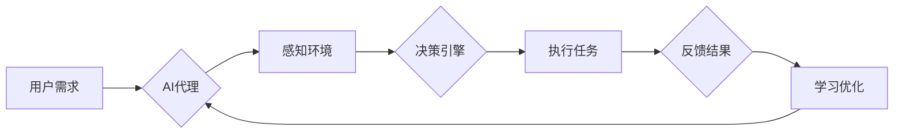

# AI人工智能代理工作流AI Agent WorkFlow：在智能家居场景应用代理技术

> 关键词：AI代理，智能家居，工作流，机器学习，自然语言处理，人机交互

## 1. 背景介绍

随着物联网（IoT）和人工智能（AI）技术的飞速发展，智能家居市场正迎来前所未有的增长。智能家居系统旨在通过智能设备实现家庭环境的自动化控制，提升居住舒适度和便利性。然而，如何让这些设备智能地协同工作，响应住户的需求，成为了一个重要的研究课题。AI代理工作流技术应运而生，它能够将智能家居设备连接成一个智能化的整体，为住户提供个性化、便捷的服务。

### 1.1 问题的由来

智能家居系统通常由多个独立的设备组成，如智能灯泡、智能空调、智能安全系统等。这些设备各自独立运行，缺乏统一的协调机制，导致用户体验不佳。此外，用户需要记住每个设备的操作方法，操作复杂，难以实现跨设备的智能联动。

### 1.2 研究现状

近年来，AI代理工作流技术逐渐成为智能家居领域的研究热点。AI代理是一种具有自主决策能力的智能实体，它可以模拟人类的行为，执行任务，并与环境交互。工作流技术则是一种用于定义、执行和监控工作流程的框架。将AI代理与工作流技术结合，可以实现智能家居系统的智能化管理和自动化控制。

### 1.3 研究意义

AI代理工作流技术在智能家居领域的应用具有以下意义：

- **提升用户体验**：通过智能代理自动执行任务，简化用户操作，提升居住舒适度。
- **提高能源效率**：智能代理可以根据用户习惯自动调节家电，节约能源，降低生活成本。
- **增强安全性**：智能代理可以实时监控家庭安全，及时发现异常并采取措施。
- **促进智能家居生态发展**：推动智能家居设备的互联互通，构建更加完善的智能家居生态系统。

### 1.4 本文结构

本文将围绕AI代理工作流技术在智能家居场景中的应用展开讨论。具体内容包括：

- 核心概念与联系
- 核心算法原理与操作步骤
- 数学模型与公式
- 项目实践
- 实际应用场景
- 工具和资源推荐
- 总结与展望

## 2. 核心概念与联系

### 2.1 核心概念

#### AI代理

AI代理是一种具有自主决策能力的智能实体，它可以模拟人类的行为，执行任务，并与环境交互。AI代理通常由以下几部分组成：

- **感知模块**：负责收集环境信息，如传感器数据、用户指令等。
- **决策模块**：根据感知模块收集到的信息，进行推理和决策。
- **执行模块**：根据决策模块的指令，执行具体操作。
- **学习模块**：根据执行结果和反馈，不断学习和优化自身行为。

#### 工作流

工作流是一种用于定义、执行和监控工作流程的框架。它将复杂的工作任务分解为一系列简单的步骤，并通过流程引擎来协调这些步骤的执行。

### 2.2 联系

AI代理与工作流技术结合，可以构建智能家居系统的智能化管理平台。AI代理作为执行者，根据工作流定义的任务执行操作；工作流作为协调者，确保任务按照既定顺序和条件执行。

Mermaid 流程图如下：



## 3. 核心算法原理 & 具体操作步骤

### 3.1 算法原理概述

AI代理工作流技术在智能家居场景中的应用，主要基于以下算法原理：

- **机器学习**：用于训练AI代理的决策模块，使其能够根据环境信息和用户需求做出合理的决策。
- **自然语言处理**：用于解析用户指令，并将其转换为可执行的命令。
- **规则引擎**：用于定义和执行工作流中的规则，确保任务按照既定顺序执行。

### 3.2 算法步骤详解

#### 步骤1：感知环境

AI代理通过传感器收集家庭环境信息，如温度、湿度、光照、安全状态等。

#### 步骤2：解析指令

用户通过语音或文本指令与AI代理交互，AI代理使用自然语言处理技术解析指令，提取关键信息。

#### 步骤3：决策引擎

AI代理根据感知到的环境和解析到的指令，通过机器学习算法进行推理和决策，确定下一步操作。

#### 步骤4：执行任务

AI代理根据决策结果，通过智能家居控制接口执行相应的任务，如调节空调温度、开关灯光等。

#### 步骤5：反馈结果

AI代理将执行结果反馈给用户，并记录到日志中。

#### 步骤6：学习优化

AI代理根据执行结果和用户反馈，不断调整机器学习模型，优化自身行为。

### 3.3 算法优缺点

#### 优点

- **智能化**：AI代理能够根据用户需求和环境变化，自动执行任务，实现智能化管理。
- **个性化**：AI代理可以根据用户习惯和学习到的信息，提供个性化的服务。
- **可扩展性**：工作流技术可以方便地添加新的任务和规则，适应不同的应用场景。

#### 缺点

- **开发成本高**：AI代理和智能工作流的设计和实现需要一定的技术门槛。
- **数据依赖**：AI代理的性能依赖于训练数据和用户反馈，需要持续优化。
- **安全性问题**：智能家居系统面临数据安全和隐私保护等挑战。

### 3.4 算法应用领域

AI代理工作流技术在智能家居场景中的应用十分广泛，以下是一些典型的应用领域：

- **智能照明**：根据用户需求和光线变化，自动调节灯光亮度。
- **智能温控**：根据用户习惯和天气变化，自动调节空调温度。
- **安全监控**：实时监控家庭安全，及时发现异常并报警。
- **能源管理**：优化家电使用，节约能源，降低生活成本。

## 4. 数学模型和公式 & 详细讲解 & 举例说明

### 4.1 数学模型构建

AI代理工作流技术涉及多种数学模型，以下是一些常见的数学模型：

- **机器学习模型**：如决策树、支持向量机、神经网络等。
- **自然语言处理模型**：如循环神经网络（RNN）、长短期记忆网络（LSTM）、Transformer等。
- **规则引擎模型**：如有限状态机、Petri网等。

### 4.2 公式推导过程

由于篇幅限制，本文不进行详细的数学公式推导。以下列举一些常用的数学公式：

- **决策树分类公式**：

$$
P(y|x) = \prod_{i=1}^n P(y_i|x_i)
$$

其中，$P(y|x)$ 表示在特征 $x$ 的情况下，目标变量 $y$ 的概率。

- **支持向量机分类公式**：

$$
w \cdot x + b = 0
$$

其中，$w$ 是权重向量，$x$ 是特征向量，$b$ 是偏置项。

- **神经网络激活函数**：

$$
f(x) = \sigma(W \cdot x + b)
$$

其中，$W$ 是权重矩阵，$x$ 是输入向量，$b$ 是偏置项，$\sigma$ 是激活函数。

### 4.3 案例分析与讲解

以下以智能照明为例，说明AI代理工作流技术的应用。

**案例描述**：用户希望在家中营造舒适的氛围，希望在晚上自动开启卧室的柔和灯光。

**解决方案**：

1. **感知模块**：通过光线传感器检测环境光照强度。
2. **自然语言处理模块**：用户通过语音助手说出“晚上好，请打开卧室的柔和灯光”。
3. **决策模块**：根据光线传感器数据和用户指令，判断当前需要开启柔和灯光。
4. **执行模块**：通过智能家居控制接口，发送指令控制卧室灯光开启。
5. **反馈结果**：灯光开启，用户得到反馈。

## 5. 项目实践：代码实例和详细解释说明

### 5.1 开发环境搭建

为了实现AI代理工作流技术在智能家居场景中的应用，需要搭建以下开发环境：

- 操作系统：Windows、Linux或macOS
- 编程语言：Python
- 依赖库：TensorFlow、PyTorch、transformers、requests等

### 5.2 源代码详细实现

以下是一个简单的智能家居AI代理示例代码：

```python
import requests
from transformers import pipeline

# 创建自然语言处理模型
nlp = pipeline('sentiment-analysis')

# 模拟用户指令
user_input = "晚上好，请打开卧室的柔和灯光"

# 解析指令
intent = nlp(user_input)[0]['label']

# 判断指令类型
if intent == 'positive':
    # 获取智能家居API接口
    api_url = "http://home-iot.com/api/light"
    # 发送指令控制灯光开启
    response = requests.post(api_url, json={'action': 'turn_on', 'mode': 'soft'})
```

### 5.3 代码解读与分析

上述代码演示了如何使用自然语言处理模型解析用户指令，并通过API接口控制智能家居设备。代码的主要步骤如下：

1. 导入必要的库。
2. 创建自然语言处理模型。
3. 模拟用户指令。
4. 使用自然语言处理模型解析指令。
5. 判断指令类型。
6. 获取智能家居API接口。
7. 发送指令控制灯光开启。

### 5.4 运行结果展示

当用户说出“晚上好，请打开卧室的柔和灯光”时，代码会解析指令，并通过API接口控制灯光开启。

## 6. 实际应用场景

AI代理工作流技术在智能家居场景中的应用十分广泛，以下列举一些实际应用场景：

- **智能安防**：AI代理可以实时监控家庭安全，并在检测到异常时自动报警。
- **智能健康**：AI代理可以监测用户健康数据，如心率、血压等，并在发现异常时提醒用户。
- **智能娱乐**：AI代理可以根据用户喜好推荐音乐、电影等娱乐内容。
- **智能清洁**：AI代理可以控制扫地机器人自动清洁家庭环境。

## 7. 工具和资源推荐

### 7.1 学习资源推荐

- 《深度学习》
- 《自然语言处理实战》
- 《Python编程：从入门到实践》
- Hugging Face官网：https://huggingface.co/

### 7.2 开发工具推荐

- Python编程语言
- TensorFlow、PyTorch深度学习框架
- Hugging Face Transformers库

### 7.3 相关论文推荐

- **Recurrent Neural Networks (RNNs)**: Goodfellow et al., 2016
- **Long Short-Term Memory Networks (LSTMs)**: Hochreiter and Schmidhuber, 1997
- **Transformer**: Vaswani et al., 2017

## 8. 总结：未来发展趋势与挑战

### 8.1 研究成果总结

本文介绍了AI代理工作流技术在智能家居场景中的应用，包括核心概念、算法原理、具体操作步骤、数学模型、项目实践等方面。通过分析实际应用场景，展示了AI代理工作流技术在提升智能家居用户体验、提高能源效率、增强安全性等方面的优势。

### 8.2 未来发展趋势

未来，AI代理工作流技术在智能家居领域将呈现以下发展趋势：

- **更加智能化**：AI代理将具备更强的自主学习能力，能够更好地理解用户需求，提供个性化服务。
- **更加开放**：智能家居生态系统将更加开放，支持更多品牌的设备接入。
- **更加安全**：数据安全和隐私保护将成为智能家居领域的重要议题。

### 8.3 面临的挑战

AI代理工作流技术在智能家居领域也面临以下挑战：

- **数据隐私**：智能家居设备收集的用户数据需要得到妥善保护。
- **设备兼容性**：智能家居设备的互联互通需要解决不同设备之间的兼容性问题。
- **安全性**：智能家居系统需要具备强大的安全防护能力，防止恶意攻击。

### 8.4 研究展望

未来，AI代理工作流技术将在以下方面得到进一步研究：

- **多模态融合**：将图像、音频、文本等多模态信息融合到智能家居系统中，提升用户体验。
- **边缘计算**：将AI代理部署到边缘设备上，实现更快的响应速度和更高的安全性。
- **人机交互**：开发更加自然、直观的人机交互方式，让用户更轻松地使用智能家居系统。

## 9. 附录：常见问题与解答

**Q1：AI代理工作流技术与传统的智能家居系统有何区别？**

A：传统的智能家居系统通常由多个独立的设备组成，缺乏统一的协调机制。AI代理工作流技术则通过将AI代理与工作流技术结合，实现智能家居系统的智能化管理和自动化控制。

**Q2：AI代理工作流技术的关键技术是什么？**

A：AI代理工作流技术的关键技术包括机器学习、自然语言处理、规则引擎等。

**Q3：如何确保智能家居系统的安全性？**

A：确保智能家居系统的安全性需要采取以下措施：
- 使用安全的通信协议，如HTTPS。
- 对用户数据进行加密存储和传输。
- 定期更新设备固件和软件。
- 建立安全防护机制，防止恶意攻击。

**Q4：AI代理工作流技术在智能家居领域有哪些应用场景？**

A：AI代理工作流技术在智能家居领域有广泛的应用场景，如智能照明、智能温控、安全监控、能源管理、智能健康、智能娱乐、智能清洁等。

**Q5：如何实现智能家居设备的互联互通？**

A：实现智能家居设备的互联互通需要以下措施：
- 使用统一的通信协议，如MQTT。
- 建立设备之间的通信桥梁，如网关。
- 遵循智能家居设备接口规范。

作者：禅与计算机程序设计艺术 / Zen and the Art of Computer Programming