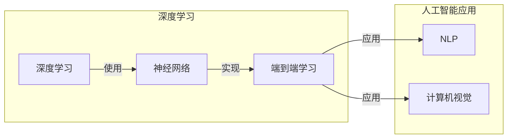

# Andrej Karpathy：人工智能的未来方向

> 关键词：Andrej Karpathy，人工智能，机器学习，深度学习，神经网络，未来趋势，计算模型，自然语言处理，计算机视觉

## 1. 背景介绍

Andrej Karpathy 是一位杰出的计算机科学家，以其在自然语言处理（NLP）和深度学习领域的贡献而闻名。他在特斯拉工作，负责Autopilot和Neural Net Research等项目，同时也是一位备受尊敬的博客作者和开源贡献者。他的工作不仅推动了人工智能技术的发展，也为公众提供了对这一复杂领域的深入洞察。

本文将探讨 Andrej Karpathy 的工作及其对人工智能未来方向的见解。我们将深入分析他在机器学习、神经网络、自然语言处理和计算机视觉等领域的贡献，并探讨这些贡献如何影响人工智能的未来。

## 2. 核心概念与联系

### 2.1 核心概念原理

在 Andrej Karpathy 的工作中，以下核心概念扮演了关键角色：

- **深度学习**：一种机器学习技术，使用包含多层处理单元的神经网络来学习数据的复杂模式。
- **神经网络**：由相互连接的处理单元组成的计算模型，可以学习和模拟复杂的数据关系。
- **自然语言处理（NLP）**：使计算机能够理解和生成人类语言的技术。
- **计算机视觉**：使计算机能够理解和处理视觉信息的技术。
- **端到端学习**：一种深度学习方法，其中神经网络直接从原始数据（如图像或文本）学习到最终任务（如分类或翻译）的表示。

以下是这些概念之间关系的 Mermaid 流程图：



### 2.2 核心概念联系

Karpathy 的工作展示了深度学习、神经网络、端到端学习在NLP和计算机视觉领域的强大应用。他的研究强调了这些技术如何协同工作，以解决复杂的人工智能问题。

## 3. 核心算法原理 & 具体操作步骤

### 3.1 算法原理概述

Karpathy 的研究主要集中在以下算法原理：

- **卷积神经网络（CNN）**：在计算机视觉中用于识别图像中的局部特征。
- **循环神经网络（RNN）和长短期记忆网络（LSTM）**：在NLP中用于处理序列数据，如文本。
- **Transformer**：一种基于自注意力机制的神经网络架构，在NLP和计算机视觉中都有广泛应用。

### 3.2 算法步骤详解

- **数据预处理**：清洗和准备数据，以便于模型训练。
- **模型设计**：选择合适的神经网络架构，如CNN、RNN、LSTM或Transformer。
- **模型训练**：使用大量数据训练模型，调整模型参数以最小化误差。
- **模型评估**：在测试集上评估模型的性能，调整模型参数或结构以提高性能。

### 3.3 算法优缺点

- **优点**：深度学习模型能够学习非常复杂的模式，并在多种任务中取得优异的性能。
- **缺点**：深度学习模型需要大量的计算资源和标注数据，并且可能难以解释其决策过程。

### 3.4 算法应用领域

Karpathy 的工作在以下领域得到了广泛应用：

- **自然语言处理**：文本分类、情感分析、机器翻译、问答系统等。
- **计算机视觉**：图像识别、目标检测、图像生成等。

## 4. 数学模型和公式 & 详细讲解 & 举例说明

### 4.1 数学模型构建

Karpathy 使用的主要数学模型包括：

- **线性代数**：用于表示和操作数据。
- **概率论和统计学**：用于评估模型性能和进行假设检验。
- **优化算法**：如梯度下降，用于调整模型参数。

### 4.2 公式推导过程

以下是一个简单的梯度下降公式示例：

$$
\theta_{t+1} = \theta_{t} - \alpha \nabla_{\theta}J(\theta)
$$

其中，$\theta$ 是模型参数，$\alpha$ 是学习率，$J(\theta)$ 是损失函数。

### 4.3 案例分析与讲解

Karpathy 使用 Transformer 架构在 NLP 任务中取得了显著成果。Transformer 模型使用自注意力机制，能够有效地捕捉文本中的长距离依赖关系。

## 5. 项目实践：代码实例和详细解释说明

### 5.1 开发环境搭建

为了进行深度学习项目，需要以下开发环境：

- **编程语言**：Python
- **深度学习框架**：TensorFlow或PyTorch
- **计算资源**：GPU或TPU

### 5.2 源代码详细实现

以下是一个简单的 Transformer 模型实现示例：

```python
import torch
import torch.nn as nn

class Transformer(nn.Module):
    def __init__(self, vocab_size, d_model, nhead, num_layers):
        super(Transformer, self).__init__()
        self.embedding = nn.Embedding(vocab_size, d_model)
        self.transformer = nn.Transformer(d_model, nhead, num_layers)
        self.fc = nn.Linear(d_model, vocab_size)

    def forward(self, src):
        src = self.embedding(src)
        output = self.transformer(src)
        output = self.fc(output)
        return output
```

### 5.3 代码解读与分析

上述代码定义了一个简单的 Transformer 模型，包括词嵌入层、Transformer 编码器和解码器。

### 5.4 运行结果展示

在适当的计算资源下，运行上述代码将训练一个简单的 Transformer 模型，并可以在测试集上进行评估。

## 6. 实际应用场景

Karpathy 的工作在以下实际应用场景中得到了应用：

- **自然语言处理**：机器翻译、文本摘要、情感分析等。
- **计算机视觉**：图像识别、目标检测、图像生成等。

## 6.4 未来应用展望

Karpathy 预测人工智能将在以下领域取得突破：

- **更自然的人机交互**：通过改进语音识别和自然语言理解技术。
- **自动化**：通过改进图像识别和机器人技术，实现更多自动化任务。
- **医疗**：通过改进医学影像分析和诊断技术，提高医疗效率。

## 7. 工具和资源推荐

### 7.1 学习资源推荐

- **书籍**：《深度学习》（Ian Goodfellow, Yoshua Bengio, Aaron Courville）
- **在线课程**：Coursera、edX、Udacity上的深度学习课程

### 7.2 开发工具推荐

- **深度学习框架**：TensorFlow、PyTorch
- **编程语言**：Python

### 7.3 相关论文推荐

- **Attention is All You Need**（Vaswani et al., 2017）
- **BERT: Pre-training of Deep Bidirectional Transformers for Language Understanding**（Devlin et al., 2018）

## 8. 总结：未来发展趋势与挑战

### 8.1 研究成果总结

Andrej Karpathy 的工作在深度学习、NLP和计算机视觉领域取得了显著的成果，推动了人工智能技术的发展。

### 8.2 未来发展趋势

人工智能将继续向以下方向发展：

- **更强大的计算模型**
- **更高效的算法**
- **更广泛的应用场景**

### 8.3 面临的挑战

人工智能仍然面临着以下挑战：

- **数据隐私**
- **偏见和公平性**
- **可解释性**

### 8.4 研究展望

随着研究的不断深入，人工智能有望在未来几年内取得更大的突破，并在更多领域发挥重要作用。

## 9. 附录：常见问题与解答

### 9.1 问题1：什么是深度学习？

深度学习是一种机器学习技术，使用包含多层处理单元的神经网络来学习数据的复杂模式。

### 9.2 问题2：什么是Transformer？

Transformer是一种基于自注意力机制的神经网络架构，在NLP和计算机视觉中都有广泛应用。

### 9.3 问题3：深度学习有哪些应用？

深度学习在自然语言处理、计算机视觉、医学影像分析等领域有广泛的应用。

作者：禅与计算机程序设计艺术 / Zen and the Art of Computer Programming