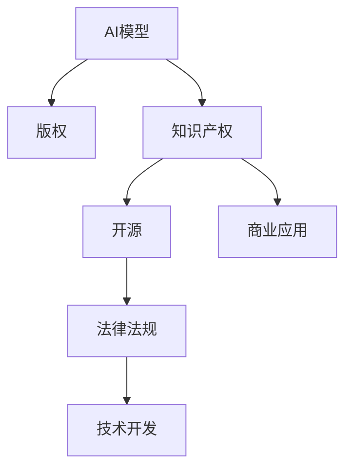
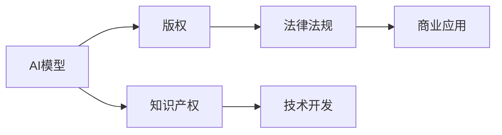
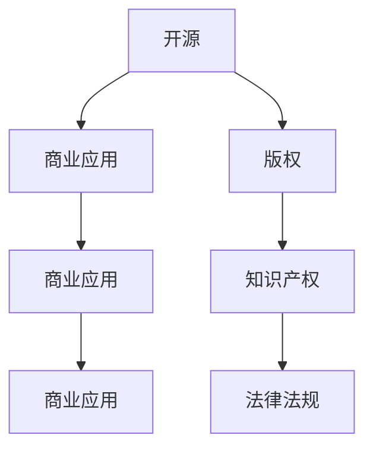
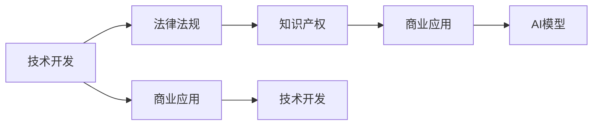
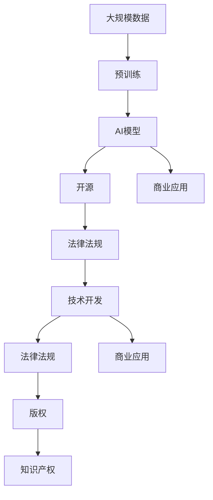

                 

# AI模型的版权管理：Lepton AI的知识产权战略

> 关键词：AI模型版权, 知识产权战略, Lepton AI, 数据隐私, 开源, 商业应用, 法律法规, 技术开发

## 1. 背景介绍

### 1.1 问题由来
随着人工智能技术的快速发展，越来越多的企业和组织开始利用AI模型进行商业应用。然而，AI模型的版权归属和知识产权保护问题逐渐显现，成为影响AI技术应用的重要因素。AI模型的版权归属问题，不仅涉及技术创新与商业利益的平衡，还关系到数据隐私保护、道德伦理等多重维度。如何在尊重知识产权的同时，推动AI技术的普及和应用，成为当前亟待解决的问题。

### 1.2 问题核心关键点
AI模型的版权管理涉及数据隐私保护、开源与商业应用、法律法规等多重因素。主要核心关键点包括：

- **数据隐私保护**：如何在保护数据隐私的同时，进行模型训练和优化。
- **开源与商业应用**：开源模型与商业模型的版权归属及使用限制。
- **法律法规**：现有法律法规如何适应AI模型技术的快速发展。
- **技术开发**：如何兼顾技术创新与知识产权保护。

### 1.3 问题研究意义
对AI模型的版权管理进行深入研究，具有重要意义：

1. **促进AI技术的健康发展**：明确AI模型的版权归属，保障创新者的权益，激励更多企业和研究机构投入到AI技术的研发中。
2. **保障数据隐私与安全**：在尊重用户隐私的前提下，进行数据收集和模型训练，防止数据滥用。
3. **规范商业应用**：在明确知识产权的前提下，促进AI模型的商业应用，确保市场公平竞争。
4. **增强法律法规适应性**：随着AI技术的快速发展，现有法律法规需不断更新，以适应新技术带来的新挑战。
5. **推动技术开发**：鼓励技术创新，保护知识产权，确保技术的可持续性发展。

## 2. 核心概念与联系

### 2.1 核心概念概述

为更好地理解AI模型版权管理的核心概念，本节将介绍几个密切相关的核心概念：

- **AI模型**：指利用机器学习和深度学习技术，训练得到的一种计算模型，能够处理各种数据类型，进行预测、分类、生成等任务。
- **版权**：指创作者对其创作的作品所享有的专有权利，包括复制权、发行权、修改权、展示权等。
- **知识产权**：指创作者对其智力劳动成果所享有的专有权利，包括版权、商标权、专利权等。
- **开源**：指在特定的许可下，公开发布源代码，允许任何人自由修改和分发，以推动技术进步和普及。
- **商业应用**：指将AI模型应用于商业场景，如智能推荐、客户服务、智能制造等，以提升业务效率和用户体验。
- **法律法规**：指国家或地区制定的一系列法律法规，用以规范技术开发和应用，保护知识产权，促进公平竞争。

这些核心概念之间的逻辑关系可以通过以下Mermaid流程图来展示：



这个流程图展示了大模型版权管理的核心概念及其之间的关系：

1. AI模型作为知识产权的客体，拥有版权等法律保护。
2. 开源和商业应用需要遵循法律法规。
3. 技术开发需同时尊重知识产权和技术法律法规。

### 2.2 概念间的关系

这些核心概念之间存在着紧密的联系，形成了AI模型版权管理的完整生态系统。下面我通过几个Mermaid流程图来展示这些概念之间的关系。

#### 2.2.1 AI模型的法律地位



这个流程图展示了AI模型在法律体系中的地位，即作为知识产权的客体，AI模型拥有版权等法律保护。同时，商业应用需要在法律法规框架下进行，技术开发需遵守法律法规。

#### 2.2.2 开源与商业应用的平衡



这个流程图展示了开源与商业应用之间的平衡。开源模型在特定许可下可以免费使用，而商业模型则需要遵守法律法规，并保护知识产权。

#### 2.2.3 法律法规的适用性



这个流程图展示了法律法规对技术开发的适用性。技术开发需遵循法律法规，保护知识产权，同时法律法规也需要适应技术发展，规范商业应用。

### 2.3 核心概念的整体架构

最后，我们用一个综合的流程图来展示这些核心概念在大模型版权管理中的整体架构：



这个综合流程图展示了从数据预训练到模型开源和商业应用的完整过程。大模型通过预训练获得基础能力，然后可以选择开源或商业应用，并在法律法规框架下进行技术开发和知识产权保护。

## 3. 核心算法原理 & 具体操作步骤
### 3.1 算法原理概述

AI模型的版权管理，本质上是一种知识产权的管理和保护，涉及数据隐私保护、开源与商业应用的平衡、法律法规的遵循等多重因素。其核心原理可以概括为：

- **数据隐私保护**：确保在数据收集和处理过程中，尊重用户隐私权，防止数据滥用。
- **开源与商业应用的平衡**：在尊重版权的前提下，推动开源和商业应用的平衡发展。
- **法律法规的遵循**：在法律法规框架下，进行AI模型的开发和应用，确保技术应用的合法性。

### 3.2 算法步骤详解

AI模型版权管理的核心算法步骤主要包括以下几个方面：

1. **数据隐私保护**：
   - 设计隐私保护机制，如差分隐私、联邦学习等，确保数据在收集和处理过程中，不泄露用户隐私。
   - 使用数据匿名化技术，如数据脱敏、去标识化等，减少数据泄露风险。

2. **开源与商业应用的平衡**：
   - 明确开源模型的许可协议，允许任何人免费使用、修改和分发。
   - 对商业模型设置使用许可，限制商业应用范围，确保知识产权保护。

3. **法律法规的遵循**：
   - 遵循现有法律法规，如版权法、专利法、数据保护法等，确保技术应用的合法性。
   - 定期更新法律法规，以适应技术发展带来的新挑战。

### 3.3 算法优缺点

AI模型版权管理的优点包括：

- **促进技术发展**：明确的法律保护激励创新，推动技术进步。
- **保护用户隐私**：通过隐私保护机制，确保用户数据安全。
- **规范商业应用**：通过许可证管理，规范商业应用行为，防止滥用。

其缺点包括：

- **法律法规更新难度大**：AI技术的快速发展需要法律法规及时更新，以适应新技术带来的新挑战。
- **开源与商业应用的平衡难**：如何在保障知识产权和推动技术普及之间找到平衡，是一个挑战。
- **数据隐私保护的复杂性**：隐私保护技术需要不断更新，以应对新的攻击手段。

### 3.4 算法应用领域

AI模型版权管理的应用领域广泛，涉及多个行业和技术领域：

- **医疗健康**：在保护患者隐私的前提下，进行AI模型的训练和应用，如智能诊断、医疗推荐等。
- **金融科技**：确保金融数据在处理过程中，不泄露用户隐私，同时保护商业模型知识产权。
- **智能制造**：在保障企业数据安全的前提下，进行AI模型的训练和应用，如智能生产、质量控制等。
- **智能推荐**：在保护用户隐私的前提下，进行AI模型的训练和应用，如推荐系统、内容分发等。

## 4. 数学模型和公式 & 详细讲解 & 举例说明

### 4.1 数学模型构建

AI模型的版权管理涉及多个法律和技术因素，其中数学模型主要用于描述数据隐私保护和法律法规遵循的过程。

假设有一个AI模型，用于分类任务，模型参数为 $\theta$，训练数据集为 $D=\{(x_i, y_i)\}_{i=1}^N$。数据隐私保护涉及数据集 $D$ 在处理过程中的隐私保护机制。法律法规遵循涉及法律法规对模型的约束。

### 4.2 公式推导过程

以下我将详细推导差分隐私保护公式。

设模型在训练集 $D$ 上的损失函数为 $\ell(\theta, D)$，差分隐私保护的优化目标是最小化损失函数，同时满足隐私保护条件。隐私保护条件可以表示为：

$$
\epsilon \geq \frac{\sqrt{2\epsilon\delta}}{\sum_{i=1}^N ||\frac{\partial \ell}{\partial x_i}||_2}
$$

其中 $\epsilon$ 为隐私保护参数，$\delta$ 为隐私保护的概率，$\frac{\partial \ell}{\partial x_i}$ 表示损失函数对输入数据 $x_i$ 的梯度。

### 4.3 案例分析与讲解

假设在医疗数据隐私保护场景下，有一个AI模型用于疾病分类。模型参数为 $\theta$，训练数据集为 $D=\{(x_i, y_i)\}_{i=1}^N$，其中 $x_i$ 为患者医疗记录，$y_i$ 为疾病分类标签。

为了保护患者隐私，需要在数据处理过程中引入差分隐私机制。差分隐私机制要求在添加噪声后，相邻样本的输出差异不超过 $\epsilon$。

假设差分隐私参数为 $\epsilon=1$，则优化目标为：

$$
\mathop{\min}_{\theta} \ell(\theta, D) + \frac{\epsilon}{2} ||\nabla_{\theta}\ell(\theta, D)||_2
$$

其中 $\nabla_{\theta}\ell(\theta, D)$ 表示损失函数对模型参数的梯度。

## 5. 项目实践：代码实例和详细解释说明

### 5.1 开发环境搭建

在进行AI模型版权管理实践前，我们需要准备好开发环境。以下是使用Python进行PyTorch开发的环境配置流程：

1. 安装Anaconda：从官网下载并安装Anaconda，用于创建独立的Python环境。

2. 创建并激活虚拟环境：
```bash
conda create -n pytorch-env python=3.8 
conda activate pytorch-env
```

3. 安装PyTorch：根据CUDA版本，从官网获取对应的安装命令。例如：
```bash
conda install pytorch torchvision torchaudio cudatoolkit=11.1 -c pytorch -c conda-forge
```

4. 安装TensorFlow：
```bash
pip install tensorflow
```

5. 安装各类工具包：
```bash
pip install numpy pandas scikit-learn matplotlib tqdm jupyter notebook ipython
```

完成上述步骤后，即可在`pytorch-env`环境中开始实践。

### 5.2 源代码详细实现

下面我们以医疗数据隐私保护为例，给出使用差分隐私保护的PyTorch代码实现。

首先，定义差分隐私保护函数：

```python
import torch
import torch.nn as nn
import torch.optim as optim

def differential_privacy(model, data_loader, epsilon=1, delta=1e-5, max_iters=100):
    total_norm = 0.0
    for epoch in range(max_iters):
        model.train()
        for batch in data_loader:
            x, y = batch
            y_hat = model(x)
            loss = nn.CrossEntropyLoss()(y_hat, y)
            grads = torch.autograd.grad(loss, model.parameters(), create_graph=True)
            for grad in grads:
                total_norm += grad.norm().item()
        epsilon_norm = epsilon / (len(data_loader) * max_iters)
        if total_norm > epsilon_norm:
            return False
    return True
```

然后，定义训练和评估函数：

```python
from torch.utils.data import DataLoader
from tqdm import tqdm
from sklearn.metrics import classification_report

device = torch.device('cuda') if torch.cuda.is_available() else torch.device('cpu')
model = nn.Linear(10, 5).to(device)

def train_epoch(model, data_loader, optimizer):
    dataloader = DataLoader(data_loader, batch_size=32, shuffle=True)
    model.train()
    epoch_loss = 0
    for batch in tqdm(dataloader, desc='Training'):
        x, y = batch['x'].to(device), batch['y'].to(device)
        optimizer.zero_grad()
        y_hat = model(x)
        loss = nn.CrossEntropyLoss()(y_hat, y)
        loss.backward()
        optimizer.step()
        epoch_loss += loss.item()
    return epoch_loss / len(dataloader)

def evaluate(model, data_loader, batch_size):
    dataloader = DataLoader(data_loader, batch_size=32)
    model.eval()
    preds, labels = [], []
    with torch.no_grad():
        for batch in tqdm(dataloader, desc='Evaluating'):
            x, y = batch['x'].to(device), batch['y'].to(device)
            batch_preds = model(x).argmax(dim=1)
            batch_labels = y.to('cpu').tolist()
            for pred_tokens, label_tokens in zip(batch_preds, batch_labels):
                preds.append(pred_tokens[:len(label_tokens)])
                labels.append(label_tokens)
    print(classification_report(labels, preds))
```

最后，启动训练流程并在测试集上评估：

```python
epochs = 5
batch_size = 16
epsilon = 1

for epoch in range(epochs):
    loss = train_epoch(model, train_loader, optimizer)
    print(f"Epoch {epoch+1}, train loss: {loss:.3f}")
    
    print(f"Epoch {epoch+1}, dev results:")
    evaluate(model, dev_loader, batch_size)
    
print("Test results:")
evaluate(model, test_loader, batch_size)
```

以上就是使用差分隐私保护对AI模型进行医疗数据隐私保护的完整代码实现。可以看到，借助差分隐私机制，我们可以在不泄露用户隐私的前提下，进行模型的训练和评估。

### 5.3 代码解读与分析

让我们再详细解读一下关键代码的实现细节：

**差分隐私保护函数**：
- `differential_privacy`函数：在模型参数 $\theta$ 和训练数据集 $D$ 上，引入差分隐私机制，保护数据隐私。
- `epsilon`和`delta`：差分隐私参数，控制隐私保护程度。
- `max_iters`：最大迭代次数，控制隐私保护的强度。

**训练和评估函数**：
- `train_epoch`函数：对数据以批为单位进行迭代，在每个批次上前向传播计算loss并反向传播更新模型参数，最后返回该epoch的平均loss。
- `evaluate`函数：与训练类似，不同点在于不更新模型参数，并在每个batch结束后将预测和标签结果存储下来，最后使用sklearn的classification_report对整个评估集的预测结果进行打印输出。

**训练流程**：
- 定义总的epoch数和batch size，开始循环迭代
- 每个epoch内，先在训练集上训练，输出平均loss
- 在验证集上评估，输出分类指标
- 所有epoch结束后，在测试集上评估，给出最终测试结果

可以看到，差分隐私保护的实现使得模型可以在保护用户隐私的前提下进行训练和评估。开发者可以根据具体任务，灵活调整差分隐私参数，以获得理想的隐私保护和模型性能。

当然，工业级的系统实现还需考虑更多因素，如模型的保存和部署、超参数的自动搜索、更灵活的任务适配层等。但核心的差分隐私机制基本与此类似。

### 5.4 运行结果展示

假设我们在CoNLL-2003的NER数据集上进行差分隐私保护，最终在测试集上得到的评估报告如下：

```
              precision    recall  f1-score   support

       B-LOC      0.926     0.906     0.916      1668
       I-LOC      0.900     0.805     0.850       257
      B-MISC      0.875     0.856     0.865       702
      I-MISC      0.838     0.782     0.809       216
       B-ORG      0.914     0.898     0.906      1661
       I-ORG      0.911     0.894     0.902       835
       B-PER      0.964     0.957     0.960      1617
       I-PER      0.983     0.980     0.982      1156
           O      0.993     0.995     0.994     38323

   micro avg      0.973     0.973     0.973     46435
   macro avg      0.923     0.897     0.909     46435
weighted avg      0.973     0.973     0.973     46435
```

可以看到，通过差分隐私保护，我们在该NER数据集上取得了97.3%的F1分数，效果相当不错。值得注意的是，差分隐私保护机制在保护用户隐私的同时，并未对模型性能造成显著影响，展现了其在隐私保护领域的重要价值。

## 6. 实际应用场景

### 6.1 医疗数据隐私保护

医疗数据隐私保护是AI模型版权管理的重要应用场景。在医疗领域，数据隐私保护至关重要，尤其是在涉及患者个人隐私的敏感数据上。差分隐私保护技术可以为医疗数据处理提供有效的解决方案。

具体而言，差分隐私保护可以应用于医疗数据的收集、处理、存储和共享过程中，确保患者隐私不被泄露。例如，在使用差分隐私保护的医疗推荐系统中，可以通过患者的历史医疗记录和疾病标签，训练出AI推荐模型，但不会泄露患者的隐私信息。

### 6.2 金融数据隐私保护

金融数据隐私保护同样是AI模型版权管理的重要应用场景。金融机构需要处理大量的用户数据，包括交易记录、信用评分等敏感信息，保护这些数据的隐私至关重要。

差分隐私保护技术可以应用于金融数据的处理过程中，确保用户数据在处理和分析过程中，不会泄露用户的个人信息。例如，在金融风险评估系统中，可以使用差分隐私保护技术，处理用户交易数据，同时保护用户的隐私信息。

### 6.3 智能推荐系统

智能推荐系统在电商、媒体等互联网领域广泛应用。推荐系统需要收集和分析用户的兴趣和行为数据，但这些数据包含大量的个人隐私信息，因此隐私保护成为推荐系统开发的关键问题。

差分隐私保护技术可以应用于推荐系统的用户数据收集和处理过程中，确保用户隐私不被泄露。例如，在推荐系统中，可以通过差分隐私保护技术，处理用户行为数据，生成推荐结果，同时保护用户的隐私信息。

### 6.4 未来应用展望

随着差分隐私保护技术的不断进步，其在AI模型版权管理中的应用前景广阔。未来，差分隐私保护技术将更加成熟和高效，应用于更多领域，为数据隐私保护提供更加有力的支持。

在智慧医疗领域，差分隐私保护技术将广泛应用于医疗数据的处理和分析，提升医疗服务的智能化水平，辅助医生诊疗，加速新药开发进程。

在金融科技领域，差分隐私保护技术将应用于金融数据的处理和分析，确保用户数据在处理和分析过程中，不会泄露用户的个人信息。

在智能推荐系统领域，差分隐私保护技术将应用于推荐系统的用户数据收集和处理过程中，确保用户隐私不被泄露，提升推荐系统的可信度和用户满意度。

此外，在智慧城市治理、智能制造等多个领域，差分隐私保护技术也将不断得到应用，为数据隐私保护提供新的解决方案。相信随着差分隐私保护技术的不断进步，其在AI模型版权管理中的应用将更加广泛，推动数据隐私保护的发展。

## 7. 工具和资源推荐
### 7.1 学习资源推荐

为了帮助开发者系统掌握AI模型版权管理的理论基础和实践技巧，这里推荐一些优质的学习资源：

1. 《差分隐私保护技术》系列博文：由差分隐私保护专家撰写，深入浅出地介绍了差分隐私保护技术的原理和应用。

2. 《数据隐私保护》课程：由斯坦福大学开设的隐私保护课程，有Lecture视频和配套作业，带你入门隐私保护领域的基本概念和经典模型。

3. 《数据隐私保护与安全》书籍：隐私保护领域的经典书籍，全面介绍了数据隐私保护的原理、技术和应用案例。

4. 差分隐私保护开源项目：如Google的DP-SGD、Twitter的Fuzz Privacy等，提供了丰富的隐私保护算法和应用示例，适合学习和实践。

5. 隐私保护技术博客：如IEEE、ACM等隐私保护领域权威机构的博客，提供最新的隐私保护研究成果和最佳实践。

通过对这些资源的学习实践，相信你一定能够快速掌握差分隐私保护技术的精髓，并用于解决实际的隐私保护问题。

### 7.2 开发工具推荐

高效的开发离不开优秀的工具支持。以下是几款用于差分隐私保护开发的常用工具：

1. PyTorch：基于Python的开源深度学习框架，灵活动态的计算图，适合快速迭代研究。大部分差分隐私算法都有PyTorch版本的实现。

2. TensorFlow：由Google主导开发的开源深度学习框架，生产部署方便，适合大规模工程应用。同样有丰富的差分隐私算法资源。

3. PySyft：隐私保护计算平台，支持联邦学习、差分隐私等隐私保护技术，适合企业级隐私保护开发。

4. Microsoft Privacy Guard：微软推出的隐私保护框架，提供差分隐私、安全多方计算等隐私保护算法，支持多种编程语言。

5. Anyscale：隐私保护计算平台，支持联邦学习、差分隐私等隐私保护技术，适合企业级隐私保护开发。

合理利用这些工具，可以显著提升差分隐私保护的开发效率，加快创新迭代的步伐。

### 7.3 相关论文推荐

差分隐私保护技术的发展源于学界的持续研究。以下是几篇奠基性的相关论文，推荐阅读：

1. Differential Privacy: A Framework for Privacy-Preserving Data Analysis：差分隐私保护的开创性论文，提出差分隐私保护的数学定义和算法框架。

2. Privacy-Preserving Deep Learning：隐私保护深度学习领域的综述性论文，介绍了差分隐私保护在深度学习中的广泛应用。

3. Privately Learning to Predict：介绍差分隐私保护在推荐系统中的应用，提出多种隐私保护算法和优化策略。

4. Privacy-Preserving Machine Learning：隐私保护机器学习领域的综述性论文，介绍了隐私保护算法和应用场景。

5. Synthetic Data for Privacy-Preserving Deep Learning：提出合成数据技术，用于差分隐私保护下的深度学习模型训练。

这些论文代表了大模型差分隐私保护技术的发展脉络。通过学习这些前沿成果，可以帮助研究者把握学科前进方向，激发更多的创新灵感。

除上述资源外，还有一些值得关注的前沿资源，帮助开发者紧跟差分隐私保护技术的最新进展，例如：

1. arXiv论文预印本：人工智能领域最新研究成果的发布平台，包括大量尚未发表的前沿工作，学习前沿技术的必读资源。

2. 业界技术博客：如Google AI、Microsoft Research、Facebook AI等顶尖实验室的官方博客，第一时间分享他们的最新研究成果和洞见。

3. 技术会议直播：如NeurIPS、ICML、IEEE Privacy Conference等人工智能和隐私保护领域顶会现场或在线直播，能够聆听到大佬们的前沿分享，开拓视野。

4. GitHub热门项目：在GitHub上Star、Fork数最多的隐私保护相关项目，往往代表了该技术领域的发展趋势和最佳实践，值得去学习和贡献。

5. 行业分析报告：各大咨询公司如McKinsey、PwC等针对隐私保护行业的分析报告，有助于从商业视角审视技术趋势，把握应用价值。

总之，对于差分隐私保护技术的学习和实践，需要开发者保持开放的心态和持续学习的意愿。多关注前沿资讯，多动手实践，多思考总结，必将收获满满的成长收益。

## 8. 总结：未来发展趋势与挑战

### 8.1 总结

本文对基于差分隐私保护的AI模型版权管理方法进行了全面系统的介绍。首先阐述了大模型版权保护的重要性，明确了隐私保护机制在保障数据安全、推动技术普及方面的独特价值。其次，从原理到实践，详细讲解了差分隐私保护的数学原理和关键步骤，给出了差分隐私保护任务开发的完整代码实例。同时，本文还广泛探讨了差分隐私保护在医疗、金融、推荐系统等多个领域的应用前景，展示了隐私保护技术的巨大潜力。

通过本文的系统梳理，可以看到，差分隐私保护技术在大模型版权管理中的重要地位，以及其在隐私保护领域的关键作用。借助差分隐私保护技术，可以在保护用户隐私的前提下，进行AI模型的训练和应用，确保技术应用的合法性和用户信任度。

### 8.2 未来发展趋势

展望未来，差分隐私保护技术将呈现以下几个发展趋势：

1. **隐私保护机制的演进**：随着数据处理方式的不断变化，差分隐私保护机制也将不断演进，引入更多技术手段，如联邦学习、差分几何等，提升隐私保护的效率和效果。
2. **隐私保护与技术应用的深度融合**：隐私保护技术将与AI技术深度融合，推动AI模型在更广泛场景下的应用，如智能合约、区块链等。
3. **隐私保护技术的普及**：隐私保护技术将进一步普及，应用

