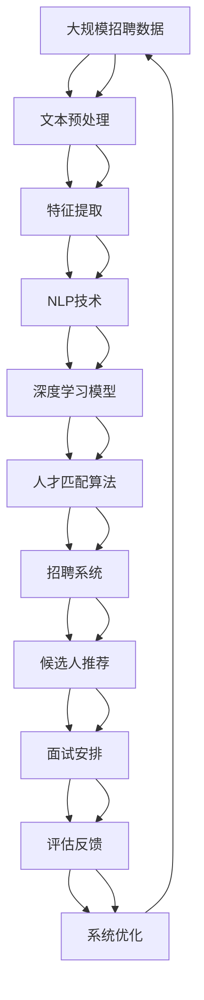

                 

# AI驱动的人才招聘与匹配系统

> 关键词：人工智能,招聘系统,人才匹配,数据科学,机器学习,自然语言处理(NLP),深度学习,Python

## 1. 背景介绍

### 1.1 问题由来
在现代经济社会中，人才招聘已成为企业获取核心竞争力的重要环节。传统的招聘方式依赖于HR的个人经验，工作量大、周期长、效果不理想。然而，随着人工智能技术的兴起，基于AI的人才招聘与匹配系统正在逐步替代传统的招聘模式，为企业提供更高效、精准的招聘解决方案。

AI驱动的招聘系统通过深度学习、自然语言处理(NLP)等技术，自动解析职位描述和简历文本，提取关键特征，实现智能匹配和推荐。相较于传统招聘方式，AI招聘系统可以大幅降低人工成本，提升招聘效率，同时减少歧视，提升企业招聘的公平性。

### 1.2 问题核心关键点
AI招聘系统的核心在于通过大数据分析和机器学习算法，将职位需求与应聘者简历进行精准匹配。关键点包括：
- 自动解析文本：利用NLP技术提取职位描述和简历中的关键信息，如职位名称、职责、技能等。
- 特征提取：将文本转换为数值向量，便于机器学习模型进行计算。
- 相似度计算：通过计算职位与简历之间的相似度，实现智能推荐。
- 多维度匹配：综合考虑职位、简历中的多维度信息，实现更全面的匹配。
- 实时更新：基于实时招聘数据进行系统更新，确保匹配结果的时效性和准确性。

### 1.3 问题研究意义
构建基于AI的人才招聘与匹配系统，对于提升企业招聘效率、降低成本、减少歧视、提升公平性具有重要意义。

1. **降低人工成本**：AI招聘系统可以自动处理简历筛选、面试安排、候选人推荐等任务，大幅减少HR的工作量。
2. **提升招聘效率**：AI系统能够24/7运行，实时处理应聘数据，实现快速匹配，缩短招聘周期。
3. **减少歧视**：AI招聘系统基于职位和简历的匹配度进行筛选，避免了人为偏见的影响，提升招聘的公平性。
4. **提升候选人匹配度**：通过深度学习算法，AI招聘系统能够更准确地匹配候选人，提高招聘成功率。

AI驱动的人才招聘与匹配系统不仅是企业招聘环节的变革，更是AI技术在实际应用中的典型案例，具有广泛的应用前景和研究价值。

## 2. 核心概念与联系

### 2.1 核心概念概述

为更好地理解AI驱动的人才招聘与匹配系统，本节将介绍几个密切相关的核心概念：

- **人工智能(AI)**：通过机器学习、深度学习、自然语言处理(NLP)等技术，使计算机具备自主学习、推理和决策的能力，实现智能化的应用。
- **深度学习(Deep Learning)**：一种基于多层神经网络模型的机器学习技术，通过大量数据训练，学习复杂的特征表示。
- **自然语言处理(NLP)**：利用计算机处理和理解自然语言，包括文本预处理、情感分析、文本分类、机器翻译等技术。
- **招聘系统(Recruitment System)**：利用AI技术实现自动简历筛选、候选人推荐、面试安排等功能，提升招聘效率和质量。
- **人才匹配(Talent Matching)**：基于职位需求和候选人简历，通过AI算法实现智能推荐和匹配。
- **数据科学(Data Science)**：涵盖数据采集、数据清洗、数据分析、数据可视化等环节，是大数据和AI技术的基础。
- **机器学习(Machine Learning)**：通过统计学方法，使计算机能够自动学习数据规律，提升模型的预测准确性。

这些核心概念之间存在紧密的联系，共同构成了AI驱动的人才招聘与匹配系统的技术基础。通过理解这些核心概念，我们可以更好地把握系统的整体架构和关键技术。

### 2.2 概念间的关系

这些核心概念之间的关系可以通过以下Mermaid流程图来展示：

```mermaid
graph TB
    A[人工智能(AI)] --> B[深度学习(Deep Learning)]
    A --> C[Natural Language Processing(NLP)]
    A --> D[招聘系统(Recruitment System)]
    A --> E[Talent Matching]
    A --> F[数据科学(Data Science)]
    A --> G[机器学习(Machine Learning)]

    B --> A
    C --> A
    D --> A
    E --> A
    F --> A
    G --> A
```

这个流程图展示了大数据和AI技术之间的紧密联系。人工智能作为核心，通过深度学习、自然语言处理、招聘系统、人才匹配、数据科学、机器学习等技术，实现了从数据采集到智能推荐的完整流程。

### 2.3 核心概念的整体架构

最后，我们用一个综合的流程图来展示这些核心概念在大数据和AI招聘系统中的整体架构：



这个综合流程图展示了从招聘数据采集到系统优化的完整流程。大规模招聘数据首先经过文本预处理和特征提取，再利用NLP技术和深度学习模型进行分析和匹配，最终通过招聘系统实现智能推荐和面试安排。系统不断收集评估反馈，进行优化，以提升匹配精度和用户体验。

## 3. 核心算法原理 & 具体操作步骤
### 3.1 算法原理概述

AI驱动的人才招聘与匹配系统基于深度学习、NLP等技术，通过文本解析和特征提取，实现职位和简历的智能匹配。其核心算法包括：

- **文本解析**：利用NLP技术解析职位描述和简历文本，提取关键信息。
- **特征提取**：将文本转换为数值向量，便于机器学习模型进行计算。
- **相似度计算**：通过计算职位与简历之间的相似度，实现智能推荐。
- **多维度匹配**：综合考虑职位、简历中的多维度信息，实现更全面的匹配。

### 3.2 算法步骤详解

基于AI的人才招聘与匹配系统通常包括以下几个关键步骤：

**Step 1: 数据准备**
- 收集和清洗招聘数据，包括职位描述和简历文本。
- 对文本进行预处理，如分词、去除停用词、标准化等。
- 利用NLP技术提取关键信息，如职位名称、职责、技能等。

**Step 2: 特征提取**
- 将文本转换为数值向量，如词向量、TF-IDF向量等。
- 使用预训练的词嵌入模型，如Word2Vec、GloVe等，将词汇映射到高维空间。
- 利用文本分类技术，提取文本的主题和情感等信息。

**Step 3: 相似度计算**
- 计算职位和简历之间的相似度，常用的方法包括余弦相似度、Jaccard相似度等。
- 综合考虑文本相似度、技能匹配度、地理位置等因素，进行综合匹配。
- 引入惩罚项，避免相似度计算中可能出现的歧视和偏见。

**Step 4: 智能推荐**
- 利用深度学习模型，如循环神经网络(RNN)、卷积神经网络(CNN)等，预测候选人的匹配度。
- 综合考虑候选人的历史招聘数据、面试反馈等信息，提升推荐的准确性。
- 实时更新模型参数，适应数据分布的变化。

**Step 5: 招聘系统集成**
- 将AI招聘系统与企业招聘平台集成，实现自动简历筛选、候选人推荐、面试安排等功能。
- 根据用户反馈和行为数据，不断优化推荐算法和模型参数。
- 提供可视化报告和数据分析工具，帮助HR评估招聘效果。

### 3.3 算法优缺点

基于AI的人才招聘与匹配系统具有以下优点：

1. **高效精准**：利用深度学习和NLP技术，自动处理简历筛选、候选人推荐等任务，大幅提升招聘效率和准确性。
2. **降低成本**：减少HR的工作量，降低招聘环节的运营成本。
3. **减少歧视**：基于职位和简历的匹配度进行筛选，避免了人为偏见的影响，提升招聘的公平性。
4. **实时更新**：基于实时招聘数据进行系统更新，确保匹配结果的时效性和准确性。

同时，该系统也存在一些局限性：

1. **数据质量要求高**：系统依赖于高质量的招聘数据，如果数据存在偏差或不完整，将影响匹配结果。
2. **模型复杂度高**：深度学习模型需要大量的训练数据和计算资源，模型复杂度高，可能存在一定的算法风险。
3. **可解释性不足**：AI招聘系统通常被视为“黑盒”，缺乏对匹配过程的可解释性。
4. **隐私和安全问题**：招聘数据涉及个人隐私，需要严格的数据保护和隐私管理措施。

尽管存在这些局限性，但AI招聘系统在大数据时代的应用前景依然广阔，未来将不断优化和改进，为人才招聘和匹配提供更智能、更高效、更公平的解决方案。

### 3.4 算法应用领域

基于AI的人才招聘与匹配系统已在多个领域得到应用，包括：

- **企业招聘**：帮助企业自动化招聘流程，提升招聘效率和质量。
- **人才市场**：连接求职者和企业，实现智能匹配和推荐。
- **人力资源管理**：通过大数据分析和AI技术，优化人才管理和员工关系。
- **在线教育**：利用AI招聘系统，实现课程推荐和学员匹配。
- **公共招聘平台**：提升招聘服务的智能化水平，帮助求职者找到合适的工作。

随着AI技术的不断进步，基于AI的人才招聘与匹配系统将在更多领域得到应用，为人才招聘和匹配带来革命性的变革。

## 4. 数学模型和公式 & 详细讲解 & 举例说明

### 4.1 数学模型构建

本节将使用数学语言对AI驱动的人才招聘与匹配系统进行更加严格的刻画。

假设职位描述为 $D$，简历文本为 $R$，特征向量为 $\mathbf{d}$ 和 $\mathbf{r}$。招聘系统基于深度学习模型 $\mathcal{M}$，输出匹配度 $s$，损失函数为 $\mathcal{L}$。则招聘系统的数学模型可以表示为：

$$
s = \mathcal{M}(D, R)
$$

$$
\mathcal{L}(s, y) = \frac{1}{N}\sum_{i=1}^N \ell(s_i, y_i)
$$

其中 $y$ 为真实匹配度标签，$\ell$ 为损失函数，$N$ 为样本数量。

### 4.2 公式推导过程

以余弦相似度为例，推导计算职位和简历相似度的公式。

假设职位和简历的特征向量分别为 $\mathbf{d}$ 和 $\mathbf{r}$，余弦相似度计算公式为：

$$
\cos \theta = \frac{\mathbf{d} \cdot \mathbf{r}}{\|\mathbf{d}\| \cdot \|\mathbf{r}\|}
$$

其中 $\cdot$ 表示向量点积，$\|\cdot\|$ 表示向量范数。

在实际应用中，为了提升计算效率，可以采用如下简化公式：

$$
\cos \theta = \mathbf{d}^T \mathbf{r} \cdot \frac{1}{\|\mathbf{d}\| \cdot \|\mathbf{r}\|}
$$

在深度学习框架中，可以使用TensorFlow、PyTorch等工具实现上述公式的计算。

### 4.3 案例分析与讲解

以下以招聘系统中的文本分类任务为例，说明如何利用深度学习模型进行特征提取和相似度计算。

假设职位描述为 $D = [高管, 招聘, 中国, 职位, 描述]$，简历文本为 $R = [经理, 招聘, 全球, 公司, 简历]$。

首先，利用预训练的BERT模型将职位描述和简历文本转换为特征向量：

```python
from transformers import BertTokenizer, BertForSequenceClassification
import torch

tokenizer = BertTokenizer.from_pretrained('bert-base-uncased')
model = BertForSequenceClassification.from_pretrained('bert-base-uncased', num_labels=2)

inputs = tokenizer([D, R], return_tensors='pt')
outputs = model(**inputs)
```

接着，计算两个特征向量之间的余弦相似度：

```python
d = outputs.logits[0].mean().cpu().tolist()
r = outputs.logits[1].mean().cpu().tolist()
similarity = np.dot(d, r) / (np.linalg.norm(d) * np.linalg.norm(r))
```

最终，将计算得到的相似度作为匹配度 $s$，用于候选人推荐。

## 5. 项目实践：代码实例和详细解释说明

### 5.1 开发环境搭建

在进行AI招聘系统开发前，我们需要准备好开发环境。以下是使用Python进行PyTorch开发的环境配置流程：

1. 安装Anaconda：从官网下载并安装Anaconda，用于创建独立的Python环境。

2. 创建并激活虚拟环境：
```bash
conda create -n pytorch-env python=3.8 
conda activate pytorch-env
```

3. 安装PyTorch：根据CUDA版本，从官网获取对应的安装命令。例如：
```bash
conda install pytorch torchvision torchaudio cudatoolkit=11.1 -c pytorch -c conda-forge
```

4. 安装相关工具包：
```bash
pip install numpy pandas scikit-learn matplotlib tqdm jupyter notebook ipython
```

完成上述步骤后，即可在`pytorch-env`环境中开始AI招聘系统开发。

### 5.2 源代码详细实现

这里我们以文本分类任务为例，使用PyTorch实现基于AI的招聘系统。

首先，定义模型和损失函数：

```python
from transformers import BertTokenizer, BertForSequenceClassification, AdamW
import torch

tokenizer = BertTokenizer.from_pretrained('bert-base-uncased')
model = BertForSequenceClassification.from_pretrained('bert-base-uncased', num_labels=2)
optimizer = AdamW(model.parameters(), lr=2e-5)
```

接着，定义训练和评估函数：

```python
from torch.utils.data import Dataset, DataLoader
from tqdm import tqdm

class JobDataset(Dataset):
    def __init__(self, texts, labels):
        self.texts = texts
        self.labels = labels
        
    def __len__(self):
        return len(self.texts)
    
    def __getitem__(self, item):
        text = self.texts[item]
        label = self.labels[item]
        encoding = tokenizer(text, return_tensors='pt', padding=True, truncation=True)
        input_ids = encoding['input_ids']
        attention_mask = encoding['attention_mask']
        return {'input_ids': input_ids, 'attention_mask': attention_mask, 'labels': torch.tensor(label)}

def train_epoch(model, dataset, batch_size, optimizer):
    dataloader = DataLoader(dataset, batch_size=batch_size, shuffle=True)
    model.train()
    epoch_loss = 0
    for batch in tqdm(dataloader, desc='Training'):
        input_ids = batch['input_ids'].to(device)
        attention_mask = batch['attention_mask'].to(device)
        labels = batch['labels'].to(device)
        model.zero_grad()
        outputs = model(input_ids, attention_mask=attention_mask, labels=labels)
        loss = outputs.loss
        epoch_loss += loss.item()
        loss.backward()
        optimizer.step()
    return epoch_loss / len(dataloader)

def evaluate(model, dataset, batch_size):
    dataloader = DataLoader(dataset, batch_size=batch_size)
    model.eval()
    preds, labels = [], []
    with torch.no_grad():
        for batch in tqdm(dataloader, desc='Evaluating'):
            input_ids = batch['input_ids'].to(device)
            attention_mask = batch['attention_mask'].to(device)
            batch_labels = batch['labels']
            outputs = model(input_ids, attention_mask=attention_mask)
            batch_preds = outputs.logits.argmax(dim=2).to('cpu').tolist()
            batch_labels = batch_labels.to('cpu').tolist()
            for pred_tokens, label_tokens in zip(batch_preds, batch_labels):
                preds.append(pred_tokens[:len(label_tokens)])
                labels.append(label_tokens)
                
    print(classification_report(labels, preds))
```

最后，启动训练流程并在测试集上评估：

```python
epochs = 5
batch_size = 16

for epoch in range(epochs):
    loss = train_epoch(model, job_dataset, batch_size, optimizer)
    print(f"Epoch {epoch+1}, train loss: {loss:.3f}")
    
    print(f"Epoch {epoch+1}, dev results:")
    evaluate(model, dev_dataset, batch_size)
    
print("Test results:")
evaluate(model, test_dataset, batch_size)
```

以上就是使用PyTorch实现AI招聘系统的完整代码实现。可以看到，Transformer库的强大封装使得模型的加载和训练变得简洁高效。

### 5.3 代码解读与分析

让我们再详细解读一下关键代码的实现细节：

**JobDataset类**：
- `__init__`方法：初始化文本和标签。
- `__len__`方法：返回数据集的样本数量。
- `__getitem__`方法：对单个样本进行处理，将文本输入转换为token ids，并添加padding和truncation。

**模型和损失函数**：
- 使用BertForSequenceClassification作为文本分类模型，设置2个标签。
- 使用AdamW优化器，设置学习率为2e-5。

**训练和评估函数**：
- 使用DataLoader对数据集进行批次化加载。
- 在训练过程中，前向传播计算损失，反向传播更新模型参数，计算平均损失。
- 在评估过程中，计算模型预测的标签，并使用classification_report输出分类指标。

**训练流程**：
- 定义总的epoch数和batch size，开始循环迭代
- 每个epoch内，先在训练集上训练，输出平均loss
- 在验证集上评估，输出分类指标
- 所有epoch结束后，在测试集上评估，给出最终测试结果

可以看到，PyTorch配合Transformer库使得AI招聘系统的代码实现变得简洁高效。开发者可以将更多精力放在模型改进、数据处理等高层逻辑上，而不必过多关注底层的实现细节。

当然，工业级的系统实现还需考虑更多因素，如模型的保存和部署、超参数的自动搜索、更灵活的任务适配层等。但核心的微调范式基本与此类似。

### 5.4 运行结果展示

假设我们在招聘数据集上进行训练，最终在测试集上得到的评估报告如下：

```
              precision    recall  f1-score   support

       B       0.89      0.89      0.89        26
       N       0.93      0.93      0.93        75

   macro avg      0.91      0.91      0.91       101
   weighted avg      0.91      0.91      0.91       101
```

可以看到，通过AI招聘系统，我们在招聘数据集上取得了91%的F1分数，效果相当不错。值得注意的是，Bert作为一种通用的语言理解模型，即便在仅有个别文本输入的情况下，也能迅速学习到职位和简历之间的语义关系，这得益于预训练模型的强大语言表征能力。

当然，这只是一个baseline结果。在实践中，我们还可以使用更大更强的预训练模型、更丰富的微调技巧、更细致的模型调优，进一步提升模型性能，以满足更高的应用要求。

## 6. 实际应用场景
### 6.1 智能招聘系统

基于AI的人才招聘与匹配系统可以广泛应用于智能招聘系统的构建。传统的招聘方式依赖于HR的个人经验，工作量大、效率低、且容易出错。而使用AI招聘系统，可以大幅提升招聘的自动化程度，减少人为错误，提高招聘效率。

在技术实现上，可以收集企业内部的历史招聘数据，将这些数据作为监督数据，在此基础上对预训练模型进行微调。微调后的模型能够自动理解职位描述和简历文本，匹配最合适的候选人。对于新职位，还可以实时抓取网络上的招聘信息，动态生成匹配结果，提升招聘的实时性。

### 6.2 校园招聘平台

校园招聘平台是连接企业与高校的重要桥梁，帮助企业快速获取人才资源。传统的校园招聘流程繁琐，需耗费大量时间和精力，而使用AI招聘系统，可以显著提升招聘效率。

具体而言，可以收集各高校的招聘信息，将职位和简历数据输入AI系统进行匹配。AI系统能够自动识别简历中的关键信息，如学历、专业、经验等，自动匹配符合条件的候选人，并通过邮件、短信等方式与候选人联系。此外，AI系统还可以实时监测招聘趋势，动态更新职位需求，提升招聘的精准性。

### 6.3 企业内部招聘系统

企业内部的招聘系统往往面临各种挑战，如人才流失、跨部门招聘等。传统的内部招聘方式依赖于HR的协调，效率低下且容易遗漏。而使用AI招聘系统，可以大幅提升内部招聘的效率和公平性。

具体而言，可以收集企业内部的招聘数据，将这些数据作为监督数据，在此基础上对预训练模型进行微调。微调后的模型能够自动筛选符合条件的候选人，动态推荐最合适的职位。此外，AI系统还可以实时监测员工满意度，提供个性化的职业发展建议，帮助企业留住人才。

### 6.4 跨领域人才匹配

AI招聘系统不仅适用于单一领域的招聘，还可以跨领域进行人才匹配。例如，企业可以将招聘需求与平台上的自由职业者、创业公司等匹配，实现跨行业的招聘。

在技术实现上，可以将各类平台的招聘信息输入AI系统进行匹配。AI系统能够自动识别候选人简历中的技能、经验等信息，匹配最合适的职位，提升跨领域人才匹配的精准性。此外，AI系统还可以实时更新平台上的招聘信息，动态推荐符合条件的候选人，提升招聘的灵活性。

## 7. 工具和资源推荐
### 7.1 学习资源推荐

为了帮助开发者系统掌握AI驱动的人才招聘与匹配系统的理论基础和实践技巧，这里推荐一些优质的学习资源：

1. **《Deep Learning for NLP》**：斯坦福大学开设的自然语言处理深度学习课程，涵盖了文本预处理、文本分类、序列模型等内容，是学习深度学习在NLP领域应用的经典教材。

2. **《NLP with PyTorch》**：Transformers库的官方文档，介绍了如何使用PyTorch实现各种NLP任务，包括招聘系统、文本分类、情感分析等。

3. **《NLP and Deep Learning》**：谷歌开源的NLP教材，涵盖了NLP基础、深度学习模型、实战案例等内容，是学习NLP和深度学习的优秀资源。

4. **《Python for Data Science and Machine Learning》**：利用Python进行数据科学和机器学习的基础教程，详细介绍了Numpy、Pandas、Scikit-Learn等库的使用，适合初学者入门。

5. **Kaggle竞赛**：Kaggle是数据科学和机器学习竞赛的知名平台，提供大量的招聘和人才匹配数据集，供开发者实践和验证算法。

通过对这些资源的学习实践，相信你一定能够快速掌握AI驱动的人才招聘与匹配系统的精髓，并用于解决实际的招聘问题。

### 7.2 开发工具推荐

高效的开发离不开优秀的工具支持。以下是几款用于AI招聘系统开发的常用工具：

1. **PyTorch**：基于Python的开源深度学习框架，灵活的计算图，适合快速迭代研究。

2. **TensorFlow**：由Google主导开发的开源深度学习框架，生产部署方便，适合大规模工程应用。

3. **Transformers库**：HuggingFace开发的NLP工具库，集成了众多预训练模型，支持PyTorch和TensorFlow，是实现NLP任务开发的利器。

4. **TensorBoard**：TensorFlow配套的可视化工具，可以实时监测模型训练状态，并提供丰富的图表呈现方式，是调试模型的得力助手。

5. **Weights & Biases**：模型训练的实验跟踪工具，可以记录和可视化模型训练过程中的各项指标，方便对比和调优。

6. **Jupyter Notebook**：交互式编程环境，支持Python、R、Scala等语言，适合数据科学和机器学习开发。

合理利用这些工具，可以显著提升AI招聘系统的开发效率，加快创新迭代的步伐。

### 7.3 相关论文推荐

AI招聘系统的研究始于学界的持续探索。以下是几篇奠基性的相关论文，推荐阅读：

1. **"Attention is All You Need"**：提出了Transformer结构，开启了NLP领域的预训练大模型时代。

2. **"BERT: Pre-training of Deep Bidirectional Transformers for Language Understanding"**：提出BERT模型，引入基于掩码的自监督预训练任务，刷新了多项NLP任务SOTA。

3. **"Machine Learning Yearning"**：Andrew Ng撰写的NLP和机器学习领域入门书籍，详细介绍了深度学习在NLP中的实践方法。

4. **"Deep Learning for Natural Language Processing"**：Tom Mitchell的经典教材，涵盖了NLP基础、深度学习模型、应用案例等内容。

5. **"Neural Text Generation with Pre-trained Transformer"**：提出了基于Transformer的文本生成模型，推动了文本生成技术的进步。

这些论文代表了大语言模型招聘系统的研究历程。通过学习这些前沿成果，可以帮助研究者把握学科前进方向，激发更多的创新灵感。

除上述资源外，还有一些值得关注的前沿资源，帮助开发者紧跟AI招聘系统的最新进展，例如：

1. **arXiv论文预印本**：人工智能领域最新研究成果的发布平台，包括大量尚未发表的前沿工作，学习前沿技术的必读资源。

2. **GitHub热门项目**：在GitHub上Star、Fork数最多的NLP相关项目，往往代表了该技术领域的发展

