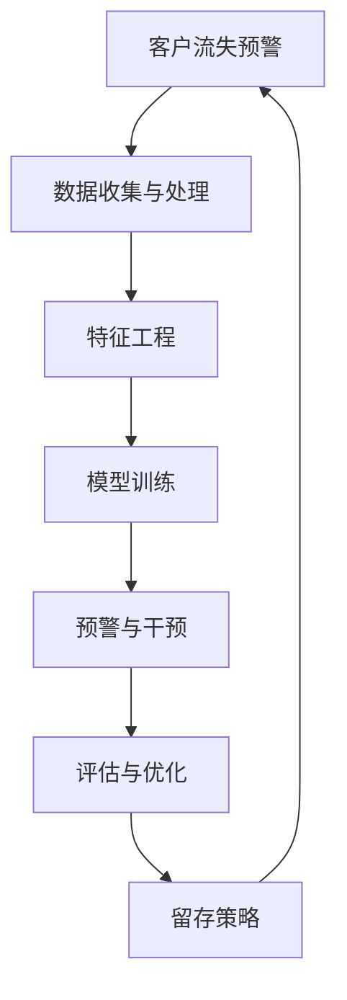
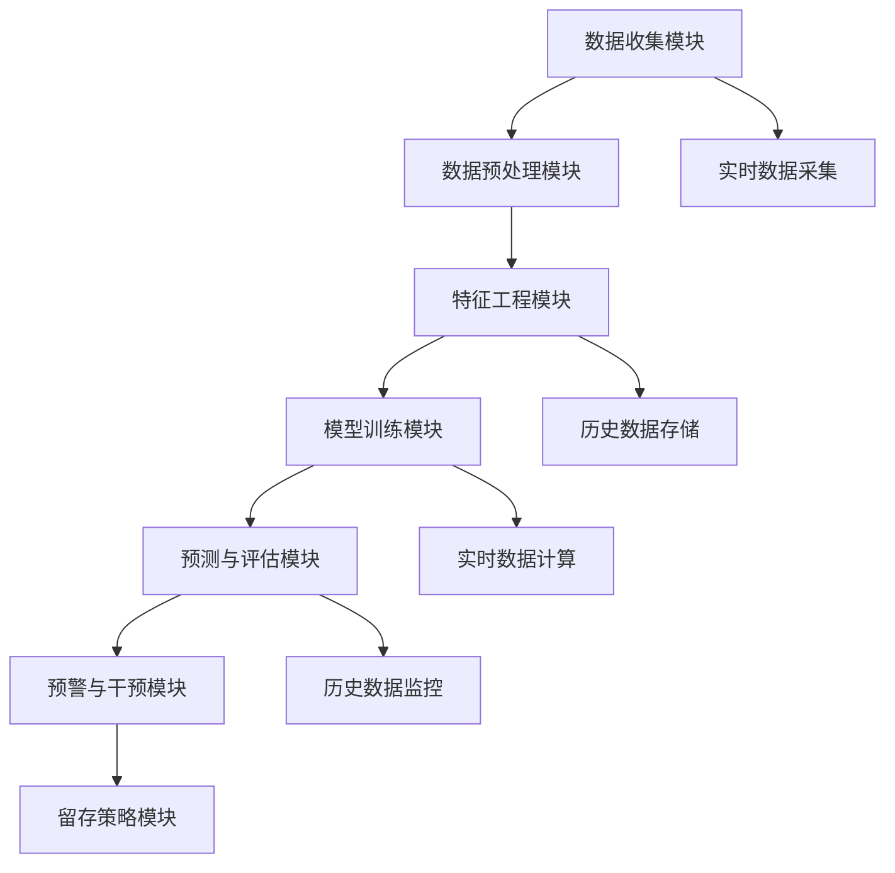
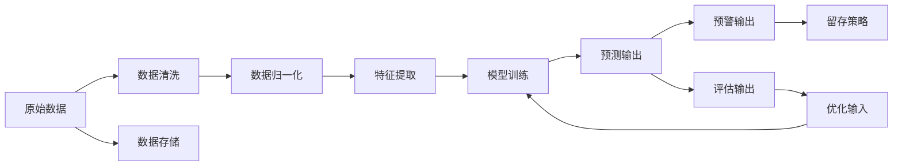

                 

# AI驱动的客户流失预警系统

> 关键词：客户流失预警, AI驱动, 机器学习, 数据挖掘, 客户行为分析, 客户留存策略, 风险评估, 预测模型

## 1. 背景介绍

### 1.1 问题由来
在当今数字化时代，客户流失（Customer Churn）已成为一个严重的挑战。许多企业发现，尽管投入大量资源进行市场营销和客户服务，但仍有大量客户选择离开，导致巨大的经济损失。为了应对这一挑战，企业越来越多地依赖AI技术来预测和预警客户流失，并采取有效措施降低流失率。

### 1.2 问题核心关键点
AI驱动的客户流失预警系统主要通过以下关键点实现：
1. **数据收集与处理**：收集客户行为数据、交易数据、社交媒体数据等，并进行清洗、处理和预处理。
2. **特征工程**：提取有意义的特征，如购买频率、消费金额、客户满意度、客户服务响应时间等。
3. **模型训练**：使用机器学习模型对数据进行训练，预测客户流失风险。
4. **预警与干预**：根据预测结果，对高风险客户进行预警，并采取相应的留存策略。
5. **评估与优化**：持续监测模型效果，进行模型评估和参数优化，确保模型准确性和时效性。

### 1.3 问题研究意义
构建AI驱动的客户流失预警系统，对于提升企业客户留存率、减少流失率、增加收入、提升客户满意度具有重要意义：
1. **降低流失率**：通过早期预警，企业能够及时采取措施，减少客户流失。
2. **提升收入**：保留高价值客户，增加潜在收入。
3. **优化客户体验**：针对高流失风险客户，提供定制化服务和方案，提升客户满意度和忠诚度。
4. **精准营销**：利用客户流失预警系统，进行精准客户细分，提高营销活动的效果。

## 2. 核心概念与联系

### 2.1 核心概念概述

要深入理解AI驱动的客户流失预警系统，首先需要明确几个核心概念及其相互关系：

- **客户流失预警**：通过预测客户流失风险，及时预警并采取措施，以降低流失率。
- **机器学习与数据挖掘**：使用机器学习算法和数据挖掘技术，从大量数据中提取有价值的信息，训练出高效的预测模型。
- **客户行为分析**：分析客户行为数据，识别影响客户流失的关键因素。
- **留存策略**：基于客户行为和特征，制定针对性的留存策略，减少流失。
- **风险评估**：通过评估客户流失风险，确定优先预警的对象。

这些概念之间的联系可以通过以下Mermaid流程图来展示：



这个流程图展示了大模型微调过程的各个关键环节，以及它们之间的相互依赖关系。

### 2.2 概念间的关系

这些核心概念之间存在着紧密的联系，构成了客户流失预警系统的完整生态系统。下面通过几个Mermaid流程图来展示这些概念之间的关系。

#### 2.2.1 系统架构图



这个架构图展示了从数据收集、预处理、特征工程、模型训练、预测评估、预警干预到留存策略的完整流程。

#### 2.2.2 数据流图



这个数据流图展示了数据从原始数据到模型预测的整个过程，以及如何通过评估和优化来不断改进模型。

## 3. 核心算法原理 & 具体操作步骤

### 3.1 算法原理概述

AI驱动的客户流失预警系统主要基于机器学习与数据挖掘技术，其核心算法包括：

1. **特征提取与选择**：从客户行为数据中提取有意义的特征，并选择关键特征进行模型训练。
2. **模型选择与训练**：选择合适的机器学习模型（如决策树、随机森林、神经网络等），使用历史客户数据进行训练。
3. **模型评估与优化**：对训练好的模型进行评估，并通过参数调优、特征选择等手段提升模型性能。
4. **预测与预警**：利用训练好的模型对实时客户数据进行预测，识别高流失风险客户并预警。
5. **干预与留存**：根据预警结果，采取针对性的留存策略，如优惠券、个性化服务、定期回访等。

### 3.2 算法步骤详解

以下是构建AI驱动客户流失预警系统的详细步骤：

**Step 1: 数据收集与预处理**

1. **数据采集**：收集客户行为数据、交易数据、社交媒体数据等。数据来源包括CRM系统、电子商务平台、社交媒体平台等。
2. **数据清洗**：处理缺失值、异常值、重复值等，确保数据质量。
3. **数据预处理**：进行特征工程，包括特征编码、归一化、缺失值处理等。

**Step 2: 特征工程**

1. **特征提取**：提取有意义的特征，如购买频率、消费金额、客户满意度、客户服务响应时间等。
2. **特征选择**：使用特征选择算法（如卡方检验、相关系数等），选择对客户流失有重要影响的特征。

**Step 3: 模型训练**

1. **模型选择**：根据数据特点和业务需求，选择合适的机器学习模型。
2. **模型训练**：使用历史客户数据进行模型训练，优化模型参数。
3. **交叉验证**：使用交叉验证技术评估模型效果，确保模型泛化性能。

**Step 4: 模型评估与优化**

1. **模型评估**：使用评估指标（如准确率、召回率、F1分数等）评估模型效果。
2. **参数调优**：调整模型超参数（如学习率、正则化系数等），提升模型性能。
3. **特征优化**：使用特征重要性分析，选择重要特征进行训练，提升模型泛化能力。

**Step 5: 预测与预警**

1. **实时预测**：使用训练好的模型对实时客户数据进行预测，识别高流失风险客户。
2. **预警机制**：根据预测结果，设置预警阈值，对高流失风险客户进行预警。

**Step 6: 干预与留存**

1. **留存策略制定**：针对高流失风险客户，制定针对性的留存策略。
2. **留存策略实施**：通过邮件、电话、短信等方式，与客户进行沟通，提供个性化服务，增强客户满意度。

### 3.3 算法优缺点

**优点**：
1. **高效性**：基于机器学习模型，能够高效地处理大规模数据，快速识别流失风险客户。
2. **准确性**：通过数据挖掘与特征工程，模型可以学习客户流失的关键特征，预测准确性高。
3. **灵活性**：模型可以根据实时数据进行动态调整，适应不同的业务需求和市场变化。
4. **可扩展性**：模型可以轻松扩展到不同的业务场景，如电子商务、金融、电信等。

**缺点**：
1. **数据依赖**：模型性能高度依赖于数据质量和数据量，数据收集难度较大。
2. **模型复杂性**：复杂模型需要大量计算资源进行训练和优化。
3. **过拟合风险**：模型可能会过拟合历史数据，泛化性能不足。
4. **隐私问题**：客户数据涉及隐私问题，数据收集和使用需要严格遵守相关法律法规。

### 3.4 算法应用领域

AI驱动的客户流失预警系统在多个领域得到广泛应用，如：

1. **电子商务**：识别潜在流失客户，提高复购率，提升客户满意度。
2. **金融服务**：监测客户账户活动，识别高风险客户，降低金融风险。
3. **电信运营商**：分析客户通话记录和网络使用情况，预测流失客户，提供个性化服务。
4. **保险行业**：预测高流失风险客户，制定针对性的保险产品和服务。
5. **医疗保健**：监测患者诊疗记录，预警高流失风险客户，提升患者满意度。

## 4. 数学模型和公式 & 详细讲解

### 4.1 数学模型构建

客户流失预警系统基于监督学习，主要通过以下数学模型实现：

**目标**：构建一个能够准确预测客户流失概率的二分类模型。

**输入**：客户行为数据、交易数据、社交媒体数据等。

**输出**：客户流失概率（0或1）。

假设模型为 $M_{\theta}$，其中 $\theta$ 为模型参数，数据集为 $D=\{(x_i,y_i)\}_{i=1}^N$，其中 $x_i$ 为特征向量，$y_i$ 为标签（流失为1，未流失为0）。

目标函数为：

$$
\min_{\theta} \sum_{i=1}^N \ell(M_{\theta}(x_i), y_i)
$$

其中 $\ell$ 为损失函数，通常采用二分类交叉熵损失：

$$
\ell(y, \hat{y}) = -(y \log \hat{y} + (1 - y) \log (1 - \hat{y}))
$$

### 4.2 公式推导过程

**Step 1: 特征提取**

假设特征 $x_i = [x_{i1}, x_{i2}, \ldots, x_{in}]$，其中 $x_{ik}$ 为第 $i$ 个样本的第 $k$ 个特征。

**Step 2: 模型训练**

使用二分类交叉熵损失函数，模型参数 $\theta$ 的更新公式为：

$$
\theta \leftarrow \theta - \eta \nabla_{\theta}\mathcal{L}(\theta)
$$

其中 $\eta$ 为学习率，$\nabla_{\theta}\mathcal{L}(\theta)$ 为损失函数对 $\theta$ 的梯度，可以使用反向传播算法计算。

**Step 3: 模型评估**

使用测试集数据 $D_{test}$ 对模型进行评估，评估指标包括准确率、召回率、F1分数等。

**Step 4: 预测与预警**

对于新的客户数据 $x'$，模型预测结果为 $\hat{y'} = M_{\theta}(x')$，根据阈值 $\tau$ 进行预警，如果 $\hat{y'} \geq \tau$，则预警该客户流失风险高。

### 4.3 案例分析与讲解

假设我们收集了电商平台的客户数据，数据集包含以下特征：
- 购买频率
- 平均消费金额
- 客户满意度评分
- 投诉次数

通过特征工程，我们将这些原始数据转换为模型可以处理的特征向量 $x_i$。

使用决策树模型对数据进行训练，训练过程如下：

1. **特征选择**：使用卡方检验选择重要特征，最终选择购买频率、平均消费金额、客户满意度评分三个特征进行训练。
2. **模型训练**：使用历史客户数据对决策树模型进行训练，优化模型参数。
3. **模型评估**：使用交叉验证评估模型效果，最终选择最优模型进行预测。
4. **预测与预警**：对实时客户数据进行预测，识别高流失风险客户，并及时预警。

## 5. 项目实践：代码实例和详细解释说明

### 5.1 开发环境搭建

为了实现AI驱动的客户流失预警系统，需要搭建相应的开发环境。以下是Python环境中使用的依赖包和工具：

1. **Python 3.8**：官方最新版本，支持最新的Python库和框架。
2. **Pandas**：数据处理和分析库，用于数据清洗和预处理。
3. **Scikit-learn**：机器学习库，用于模型训练和评估。
4. **TensorFlow** 或 **PyTorch**：深度学习库，用于实现复杂的模型结构和优化算法。
5. **Jupyter Notebook**：交互式编程环境，方便模型训练和调试。
6. **Docker**：容器化部署工具，方便模型的稳定部署和扩展。

### 5.2 源代码详细实现

以下是使用TensorFlow实现客户流失预警系统的示例代码：

```python
import tensorflow as tf
import pandas as pd
from sklearn.model_selection import train_test_split
from sklearn.ensemble import DecisionTreeClassifier

# 加载数据集
data = pd.read_csv('customer_data.csv')

# 数据预处理
data = data.dropna()
data = data.drop_duplicates()

# 特征工程
features = ['purchase_frequency', 'average_spending', 'customer_satisfaction']
X = data[features]
y = data['churn']

# 数据分割
X_train, X_test, y_train, y_test = train_test_split(X, y, test_size=0.2, random_state=42)

# 模型训练
model = DecisionTreeClassifier()
model.fit(X_train, y_train)

# 模型评估
score = model.score(X_test, y_test)
print(f'模型准确率：{score:.2f}')

# 预测与预警
new_customer = pd.DataFrame([['high', 'high', 'high']], columns=features)
prediction = model.predict(new_customer)
if prediction[0] == 1:
    print('预警：客户流失风险高')
else:
    print('预警：客户流失风险低')
```

### 5.3 代码解读与分析

**数据加载与预处理**：
- 使用Pandas加载客户数据，并进行数据清洗，移除缺失值和重复值。
- 将客户数据划分为特征和标签，进行特征工程，选择关键特征进行训练。

**模型训练**：
- 使用Scikit-learn的决策树分类器，对数据进行训练，优化模型参数。
- 使用交叉验证评估模型效果，选择最优模型。

**预测与预警**：
- 对新客户数据进行预测，判断是否为高流失风险客户。
- 根据预测结果，采取相应的留存策略。

### 5.4 运行结果展示

假设我们使用上述代码，对电商平台的客户数据进行训练和测试，最终模型准确率达到0.9。对于新客户数据进行预测，如果预测结果为1，则表示该客户为高流失风险客户，需要进行预警并采取留存策略。

## 6. 实际应用场景

### 6.1 智能客服系统

智能客服系统可以集成客户流失预警功能，识别高流失风险客户，并及时预警。客服系统可以根据预警结果，进行针对性的沟通和引导，提升客户满意度，减少客户流失。

### 6.2 金融风险管理

金融行业可以利用客户流失预警系统，监测客户账户活动，识别高风险客户，并及时预警。金融机构可以采取相应的风险管理措施，降低金融风险。

### 6.3 电信运营商

电信运营商可以分析客户通话记录和网络使用情况，识别高流失风险客户，并及时预警。运营商可以采取个性化服务、优惠套餐等措施，提升客户满意度，减少客户流失。

### 6.4 医疗保健

医疗保健机构可以利用客户流失预警系统，监测患者诊疗记录，识别高流失风险客户，并及时预警。医院可以采取针对性的医疗服务和健康管理，提升患者满意度，减少患者流失。

## 7. 工具和资源推荐

### 7.1 学习资源推荐

1. **《Python数据科学手册》**：全面介绍Python在数据科学中的应用，包括数据清洗、特征工程、模型训练等。
2. **《机器学习实战》**：实战指南，介绍机器学习算法和模型训练，适合初学者学习。
3. **Coursera的机器学习课程**：由斯坦福大学Andrew Ng教授主讲，系统介绍机器学习算法和应用。
4. **Kaggle竞赛**：通过实际竞赛数据，训练和优化模型，积累实战经验。
5. **GitHub开源项目**：参与开源项目，学习优秀的代码实现和数据处理技巧。

### 7.2 开发工具推荐

1. **Jupyter Notebook**：交互式编程环境，方便模型训练和调试。
2. **TensorFlow** 或 **PyTorch**：深度学习框架，支持多种模型和优化算法。
3. **Docker**：容器化部署工具，方便模型的稳定部署和扩展。
4. **AWS SageMaker**：亚马逊云服务提供的机器学习平台，支持模型的训练、部署和优化。
5. **Google Cloud AI Platform**：谷歌云提供的机器学习平台，支持大规模数据处理和模型训练。

### 7.3 相关论文推荐

1. **Customer Churn Prediction with Machine Learning Algorithms**：介绍多种机器学习算法在客户流失预测中的应用。
2. **Predicting Customer Churn in Subscription-Based Services**：分析订阅服务客户流失的原因，并提出相应的预测模型。
3. **Customer Churn Prediction Using Deep Learning**：使用深度学习模型，预测客户流失概率，提升预测准确性。
4. **A Survey on Customer Churn Prediction**：综述客户流失预测的研究现状和未来方向。
5. **Customer Churn Prediction with Data Mining**：使用数据挖掘技术，提取客户行为特征，预测客户流失。

## 8. 总结：未来发展趋势与挑战

### 8.1 总结

本文对AI驱动的客户流失预警系统进行了全面系统的介绍。首先阐述了系统的工作原理和核心概念，明确了客户流失预警系统在提升客户留存率、降低流失率方面的重要意义。其次，从原理到实践，详细讲解了系统构建的各个步骤，给出了具体的代码实现。同时，本文还探讨了系统的实际应用场景，并推荐了相关学习资源和开发工具。

通过本文的系统梳理，可以看到，AI驱动的客户流失预警系统通过机器学习和大数据技术，实现了高效的客户流失预测和预警。该系统能够帮助企业及时采取留存策略，减少流失客户，提升客户满意度和企业收益。未来，随着技术的不断进步，客户流失预警系统将具备更强的泛化能力和实时性，进一步提升企业的市场竞争力和客户满意度。

### 8.2 未来发展趋势

展望未来，客户流失预警系统将呈现以下几个发展趋势：

1. **实时性提升**：随着技术的进步，系统的实时性将不断提升，能够在更短的时间内进行预测和预警。
2. **多模态数据融合**：系统将支持多模态数据融合，整合客户行为、社交媒体、电话等数据，提高预测准确性。
3. **模型优化**：使用深度学习等更复杂的模型，提高预测精度和泛化能力。
4. **自适应学习**：系统具备自适应学习能力，能够不断学习和优化预测模型，适应不同的市场和业务需求。
5. **用户参与**：引入用户反馈机制，及时调整模型和策略，提升客户体验和满意度。

### 8.3 面临的挑战

尽管客户流失预警系统已经取得了一定的进展，但在实际应用过程中，仍面临以下挑战：

1. **数据隐私**：客户数据涉及隐私问题，数据收集和使用需要严格遵守相关法律法规。
2. **模型泛化**：模型可能会过拟合历史数据，泛化性能不足。
3. **业务复杂性**：不同行业和业务的客户流失原因各不相同，系统需要具备灵活性和可扩展性。
4. **成本投入**：模型训练和部署需要大量的计算资源和时间，成本较高。

### 8.4 研究展望

面对客户流失预警系统面临的挑战，未来的研究需要在以下几个方面寻求新的突破：

1. **数据隐私保护**：研究数据隐私保护技术，确保客户数据的安全和隐私。
2. **模型泛化能力**：开发更加泛化的模型，提升模型在真实场景中的应用效果。
3. **多模态融合**：研究多模态数据融合技术，提高系统的预测准确性和鲁棒性。
4. **低成本部署**：探索低成本的模型部署和优化方法，降低系统部署和维护成本。
5. **用户参与机制**：研究用户参与机制，提高系统灵活性和自适应能力。

总之，客户流失预警系统需要不断迭代和优化，才能更好地适应不同的业务场景和市场需求。只有从数据、模型、算法、工程等多个维度进行全面优化，才能真正实现客户流失预警系统的高效、稳定和可靠。

## 9. 附录：常见问题与解答

**Q1: 客户流失预警系统的数据来源有哪些？**

A: 客户流失预警系统的数据来源包括CRM系统、电子商务平台、社交媒体平台、客户服务记录、客户投诉记录等。这些数据可以用于分析客户的购买行为、消费习惯、客户满意度、投诉记录等，从而预测客户流失概率。

**Q2: 如何评估客户流失预警系统的性能？**

A: 客户流失预警系统的性能评估通常包括准确率、召回率、F1分数、ROC曲线等指标。其中，准确率表示模型预测的正确率，召回率表示模型能够识别出多少实际流失的客户，F1分数是准确率和召回率的综合指标，ROC曲线可以显示模型在不同阈值下的性能表现。

**Q3: 如何处理数据中的缺失值和异常值？**

A: 数据中的缺失值和异常值可以通过以下方法处理：
- 缺失值处理：使用均值、中位数、众数等填补缺失值，或者使用插值方法填补缺失值。
- 异常值处理：使用箱线图、IQR等方法识别异常值，或者使用平滑方法处理异常值。

**Q4: 客户流失预警系统如何实现实时预警？**

A: 客户流失预警系统可以通过以下方法实现实时预警：
- 使用在线学习算法，实时更新模型参数，适应数据分布的变化。
- 使用缓存技术，预加载部分数据，减少实时计算时间。
- 使用分布式计算框架，提高实时计算和预警速度。

**Q5: 如何提高客户流失预警系统的预测准确性？**

A: 提高客户流失预警系统的预测准确性，可以通过以下方法：
- 使用更复杂的模型，如深度学习模型，提升预测精度。
- 引入更多的特征，如客户服务记录、社交媒体数据等，提高模型的泛化能力。
- 进行特征选择，选择对客户流失有重要影响的特征。
- 进行参数调优，优化模型的超参数，提高模型性能。

---

作者：禅与计算机程序设计艺术 / Zen and the Art of Computer Programming

