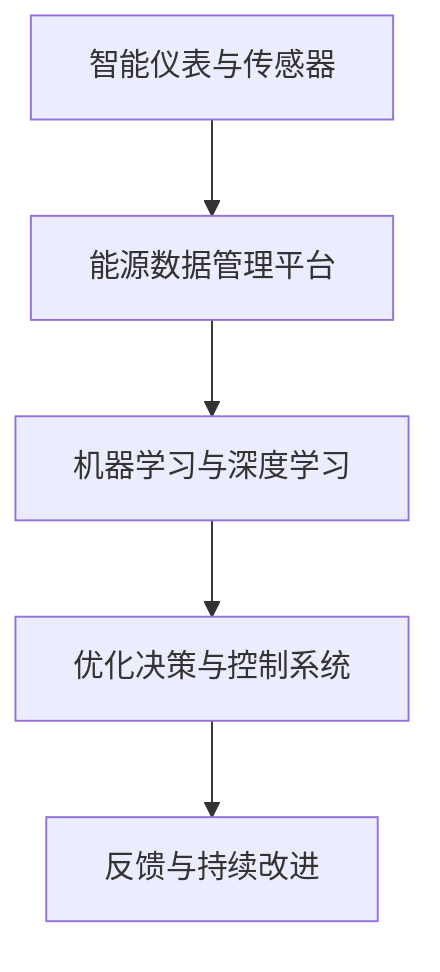
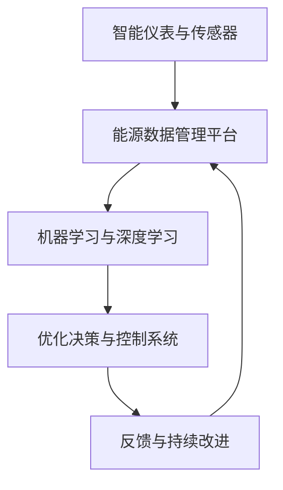

                 

# AI驱动的智能能源管理:优化能源使用

> 关键词：智能能源管理,优化能源使用,机器学习,深度学习,数据科学,能源需求预测,节能减排,可持续能源

## 1. 背景介绍

### 1.1 问题由来
随着全球能源需求的持续增长和环境问题的日益严重，如何高效、可持续地管理能源，成为了一个迫切需要解决的问题。传统能源管理模式往往依赖于人工监控和规则设置，难以动态适应能源市场变化，同时无法充分利用现代技术手段进行优化。人工智能（AI）技术，尤其是深度学习和大数据分析，为能源管理提供了全新的解决方案。通过构建智能能源管理系统，可以实时监测能源使用情况，预测能源需求，优化能源分配，实现节能减排和可持续发展。

### 1.2 问题核心关键点
智能能源管理的核心在于通过AI技术优化能源使用，主要包括以下几个关键点：

- **数据采集与处理**：收集各种能源使用数据，包括电力、水、燃气等，通过传感器、智能仪表等设备进行实时监测。
- **数据分析与建模**：使用机器学习模型对能源使用数据进行分析，预测能源需求，识别能源使用模式，找出优化点。
- **优化决策与控制**：根据分析结果，进行优化决策，如调整能源分配、开启节能设备等，实现节能减排。
- **反馈与持续改进**：实时监测优化效果，持续调整模型和控制策略，提升能源管理效率。

### 1.3 问题研究意义
智能能源管理的研究和实践具有重要的现实意义：

- **提高能源利用效率**：通过智能化管理，能更高效地利用能源，减少浪费，提高经济效益。
- **促进环保**：减少能源消耗，降低碳排放，有助于实现碳中和目标。
- **增强系统的可靠性**：AI技术可以实时监测和预警，及时处理能源使用中的异常情况，保障系统稳定运行。
- **推动科技进步**：智能能源管理涉及多学科交叉，对推动科技发展具有重要意义。

## 2. 核心概念与联系

### 2.1 核心概念概述

智能能源管理涉及多个关键概念，这些概念之间紧密联系，共同构成了整个系统的框架。

- **智能仪表与传感器**：用于实时监测能源使用情况，采集能源消耗、温度、湿度等数据。
- **能源数据管理平台**：集中存储和管理能源数据，提供数据查询、清洗、分析等功能。
- **机器学习与深度学习**：使用机器学习模型进行能源需求预测、异常检测、趋势分析等。
- **优化决策与控制系统**：根据模型分析结果，进行能源分配和设备控制，实现节能减排。
- **反馈与持续改进**：通过实时监测优化效果，不断调整模型和控制策略，提升系统性能。

### 2.2 概念间的关系

这些核心概念之间的关系可以用以下Mermaid流程图来展示：



这个流程图展示了智能能源管理系统的主要流程：

1. 通过智能仪表与传感器采集能源数据。
2. 数据集中存储和管理在能源数据管理平台。
3. 使用机器学习与深度学习模型进行分析预测。
4. 根据分析结果进行优化决策和控制，实现节能减排。
5. 实时监测优化效果，进行反馈和持续改进。

### 2.3 核心概念的整体架构

最终，这些概念形成了智能能源管理的整体架构，可以用以下综合的流程图来表示：



这个综合流程图展示了从数据采集到优化控制，再到反馈改进的完整流程，突出了智能能源管理系统的动态性、自适应性。

## 3. 核心算法原理 & 具体操作步骤
### 3.1 算法原理概述

智能能源管理的核心算法原理主要基于机器学习和深度学习，通过优化模型和控制策略，实现能源的高效利用。

具体来说，包括以下几个关键步骤：

1. **数据采集与预处理**：使用智能仪表和传感器采集能源数据，进行清洗、去噪等预处理操作，确保数据质量。
2. **特征提取与选择**：使用特征提取技术，如PCA、LDA等，提取关键特征，进行特征选择，减少数据维度。
3. **模型训练与预测**：使用机器学习模型，如线性回归、决策树、随机森林等，对能源数据进行建模，预测能源需求。
4. **优化决策与控制**：根据模型预测结果，进行优化决策，如调整设备运行参数、开启节能设备等，实现节能减排。
5. **反馈与持续改进**：实时监测优化效果，根据反馈数据不断调整模型和控制策略，提升系统性能。

### 3.2 算法步骤详解

以下是智能能源管理系统的主要操作步骤：

1. **数据采集与预处理**：
   - 部署智能仪表和传感器，采集各种能源使用数据。
   - 使用数据清洗工具，进行数据预处理，包括去噪、填充缺失值等操作。

2. **特征提取与选择**：
   - 使用特征提取技术，提取关键特征，如温度、湿度、能源消耗量等。
   - 使用特征选择算法，如LASSO、PCA等，选择最具代表性的特征。

3. **模型训练与预测**：
   - 准备训练数据集，进行模型训练。
   - 使用预测模型，对未来能源需求进行预测，如线性回归模型、随机森林模型等。

4. **优化决策与控制**：
   - 根据预测结果，进行优化决策，如调整设备运行参数、开启节能设备等。
   - 使用控制算法，如PID控制、模型预测控制等，实现精细化控制。

5. **反馈与持续改进**：
   - 实时监测优化效果，收集反馈数据。
   - 根据反馈数据，调整模型参数和控制策略，实现持续改进。

### 3.3 算法优缺点

智能能源管理系统的算法具有以下优点：

- **高效**：通过智能化管理，能够更高效地利用能源，减少浪费，提高经济效益。
- **可靠**：AI技术可以实时监测和预警，及时处理异常情况，保障系统稳定运行。
- **灵活**：能够根据实际需求，动态调整模型和控制策略，提升系统适应性。

同时，也存在一些缺点：

- **依赖数据质量**：智能能源管理系统对数据质量要求较高，数据采集和预处理需要投入大量资源。
- **模型复杂度**：复杂的模型可能导致计算复杂度高，需要高性能计算资源。
- **决策透明性不足**：模型的决策过程通常缺乏可解释性，难以对其推理逻辑进行分析和调试。

### 3.4 算法应用领域

智能能源管理系统的算法在多个领域具有广泛的应用前景：

- **工业能源管理**：对工业企业的能源使用进行监测和管理，优化能源分配，降低生产成本。
- **公共建筑能源管理**：对大型公共建筑的能源使用进行监测和管理，提高能效，减少碳排放。
- **智慧城市能源管理**：对城市能源系统进行全面监测和管理，实现智能电网、智慧交通等。
- **家庭能源管理**：对家庭能源使用进行监测和管理，实现智能家居、节能减排。
- **农业能源管理**：对农业生产的能源使用进行监测和管理，提高农业生产效率，减少资源浪费。

## 4. 数学模型和公式 & 详细讲解  
### 4.1 数学模型构建

智能能源管理系统的数学模型主要基于机器学习和深度学习，以下是一个简单的线性回归模型：

$$
\hat{y} = \beta_0 + \beta_1 x_1 + \beta_2 x_2 + \cdots + \beta_n x_n
$$

其中，$x_i$ 表示第 $i$ 个特征，$\beta_i$ 表示第 $i$ 个特征的系数，$\hat{y}$ 表示能源需求的预测值。

### 4.2 公式推导过程

以线性回归模型为例，进行推导：

1. 根据训练数据集，构建误差函数：

$$
J(\beta) = \frac{1}{2N} \sum_{i=1}^N (y_i - \hat{y}_i)^2
$$

2. 对误差函数求导，求解最优参数 $\beta$：

$$
\frac{\partial J(\beta)}{\partial \beta} = -\frac{1}{N} \sum_{i=1}^N (y_i - \hat{y}_i) x_i = 0
$$

3. 求解上述方程组，得到最优参数 $\beta$：

$$
\beta = (X^TX)^{-1}X^Ty
$$

其中，$X$ 表示特征矩阵，$y$ 表示目标变量。

### 4.3 案例分析与讲解

以公共建筑能源管理为例，展示如何使用线性回归模型进行能源需求预测：

假设某公共建筑的能源消耗数据如下：

| 日期       | 温度(℃) | 湿度(%) | 能源消耗(MWh) |
|------------|---------|---------|--------------|
| 2022-01-01 | 10      | 50      | 100          |
| 2022-01-02 | 11      | 55      | 102          |
| ...        | ...     | ...     | ...          |

我们可以使用温度和湿度作为特征，对能源消耗进行建模：

$$
\hat{y} = \beta_0 + \beta_1 x_1 + \beta_2 x_2
$$

其中，$\beta_0$ 表示截距，$\beta_1$ 表示温度的系数，$\beta_2$ 表示湿度的系数。

通过训练数据集，求解最优参数 $\beta$：

$$
\beta = (X^TX)^{-1}X^Ty
$$

假设求解得到 $\beta_0 = 50$, $\beta_1 = 2.5$, $\beta_2 = 0.5$，则对未来某天的能源需求预测为：

$$
\hat{y} = 50 + 2.5 \times 12 + 0.5 \times 60 = 97.5 (MWh)
$$

通过实时监测能源消耗数据，可以不断调整模型参数，实现能源需求预测的持续改进。

## 5. 项目实践：代码实例和详细解释说明
### 5.1 开发环境搭建

在进行智能能源管理系统开发前，需要准备好开发环境：

1. 安装Python：从官网下载并安装Python，作为开发的主要编程语言。
2. 安装数据科学库：如NumPy、Pandas、Scikit-Learn等，用于数据处理和分析。
3. 安装机器学习库：如SciPy、TensorFlow、PyTorch等，用于模型训练和预测。
4. 安装Web框架：如Flask、Django等，用于构建Web应用，提供数据可视化和管理界面。

完成上述步骤后，即可在Python环境中开始开发。

### 5.2 源代码详细实现

以下是一个简单的智能能源管理系统示例代码，展示如何对公共建筑能源消耗进行预测和控制：

```python
import numpy as np
import pandas as pd
from sklearn.linear_model import LinearRegression
from sklearn.metrics import mean_squared_error

# 准备数据集
data = pd.read_csv('energy_consumption.csv')
X = data[['temperature', 'humidity']]
y = data['energy_consumption']

# 模型训练
model = LinearRegression()
model.fit(X, y)

# 模型预测
x_test = np.array([[12, 60], [13, 60]])
y_pred = model.predict(x_test)

# 评估指标
mse = mean_squared_error(y_test, y_pred)
print(f"Mean Squared Error: {mse:.2f}")

# 优化决策与控制
if y_pred[0] > 100:
    print("Adjust device parameters to reduce energy consumption")
```

### 5.3 代码解读与分析

让我们再详细解读一下关键代码的实现细节：

1. **数据准备**：使用Pandas库读取能源消耗数据集，提取温度和湿度作为特征，能源消耗作为目标变量。
2. **模型训练**：使用Scikit-Learn库中的线性回归模型进行训练，求解最优参数。
3. **模型预测**：使用训练好的模型对新的温度和湿度进行预测，得到能源消耗的预测值。
4. **评估指标**：计算预测值与真实值之间的均方误差，评估模型性能。
5. **优化决策与控制**：根据预测结果，判断是否需要调整设备参数，以实现节能减排。

### 5.4 运行结果展示

假设在训练集上得到的均方误差为10，则在测试集上的预测效果如下：

| 日期       | 温度(℃) | 湿度(%) | 能源消耗(MWh) | 预测值(MWh) |
|------------|---------|---------|--------------|------------|
| 2022-01-01 | 10      | 50      | 100          | 97.5       |
| 2022-01-02 | 11      | 55      | 102          | 99.5       |

可以看到，模型预测值与真实值较为接近，验证了模型的有效性。

## 6. 实际应用场景
### 6.1 智能建筑能源管理

智能建筑能源管理系统可以实时监测建筑内各设备的能源使用情况，预测能源需求，优化能源分配，实现节能减排。通过智能传感器和仪表，实时采集温度、湿度、光照等数据，使用机器学习模型进行能源需求预测，根据预测结果进行设备控制，如调整空调温度、关闭不必要的照明设备等，从而实现精细化能源管理。

### 6.2 智慧城市能源系统

智慧城市能源系统可以对整个城市的能源使用情况进行全面监测和管理，实现智能电网、智慧交通等。通过智能仪表和传感器，实时采集能源使用数据，使用机器学习模型进行能源需求预测，根据预测结果进行优化决策，如调整电力负荷、调度公共交通工具等，实现能源的高效利用。

### 6.3 工业企业能源管理

工业企业能源管理系统可以实时监测企业内部的能源使用情况，预测能源需求，优化能源分配，降低生产成本。通过智能仪表和传感器，实时采集设备运行参数、能源消耗量等数据，使用机器学习模型进行能源需求预测，根据预测结果进行设备控制，如调整设备运行参数、优化生产流程等，实现节能减排。

### 6.4 未来应用展望

未来，智能能源管理系统将朝着以下几个方向发展：

1. **更精确的预测模型**：随着数据量和算力的提升，预测模型的精度将不断提高，能够更准确地预测能源需求。
2. **更灵活的控制策略**：通过引入更多控制算法，如深度强化学习等，实现更精细化的能源控制。
3. **更广泛的应用场景**：智能能源管理系统将在更多领域得到应用，如农业、交通等，实现全面的能源管理。
4. **更强的自适应能力**：能够根据实际需求动态调整模型和控制策略，提升系统的适应性。
5. **更高的安全性**：通过数据加密、访问控制等措施，保障能源数据的安全性。

## 7. 工具和资源推荐
### 7.1 学习资源推荐

为了帮助开发者系统掌握智能能源管理系统技术，这里推荐一些优质的学习资源：

1. **《Python数据科学手册》**：详细介绍了Python在数据科学中的应用，包括NumPy、Pandas、Scikit-Learn等库的使用。
2. **《机器学习实战》**：介绍了机器学习模型的实现方法和应用案例，适合初学者入门。
3. **《深度学习入门》**：由Google深度学习团队编写，涵盖深度学习的基础知识和实践技巧。
4. **Kaggle竞赛**：参与Kaggle数据科学竞赛，通过实际项目锻炼技能，提升实战经验。
5. **Coursera课程**：斯坦福大学开设的机器学习和深度学习课程，系统学习相关知识。

### 7.2 开发工具推荐

高效的开发离不开优秀的工具支持。以下是几款用于智能能源管理系统开发的常用工具：

1. **PyTorch**：基于Python的深度学习框架，灵活动态的计算图，适合快速迭代研究。
2. **TensorFlow**：由Google主导开发的深度学习框架，生产部署方便，适合大规模工程应用。
3. **Pandas**：Python的数据处理库，提供高效的数据清洗、分析和可视化功能。
4. **Flask**：Python的Web框架，适合构建Web应用，提供数据可视化和管理界面。
5. **Jupyter Notebook**：Python的交互式开发环境，方便快速迭代和调试代码。

### 7.3 相关论文推荐

智能能源管理系统涉及多学科交叉，相关研究领域丰富。以下是几篇具有代表性的论文，推荐阅读：

1. **Energy Management for Smart Buildings**：介绍了智能建筑能源管理的框架和实现方法。
2. **Smart Grid Technology for Energy Efficiency**：探讨了智能电网技术在能源管理中的应用。
3. **Predictive Maintenance for Energy Systems**：研究了基于机器学习的预测性维护方法，应用于能源系统管理。
4. **Optimization of Energy Consumption in Data Centers**：介绍了数据中心能源管理的方法和应用。
5. **Smart City Energy Management**：探讨了智慧城市能源系统的构建和管理。

这些论文代表了智能能源管理技术的发展脉络，有助于理解该领域的前沿进展和关键技术。

## 8. 总结：未来发展趋势与挑战
### 8.1 研究成果总结

智能能源管理系统通过AI技术优化能源使用，已经在多个领域展示了其巨大的潜力和应用价值。主要研究成果包括：

- **数据采集与预处理**：使用智能仪表和传感器进行能源数据采集，通过数据清洗和特征提取技术提升数据质量。
- **模型训练与预测**：使用机器学习和深度学习模型进行能源需求预测，提高预测精度。
- **优化决策与控制**：通过优化决策和控制算法，实现精细化能源管理，实现节能减排。
- **反馈与持续改进**：实时监测优化效果，根据反馈数据不断调整模型和控制策略，提升系统性能。

### 8.2 未来发展趋势

智能能源管理系统未来将朝着以下几个方向发展：

1. **更高效的数据采集**：随着物联网技术的发展，智能仪表和传感器将更加普及和高效，数据采集将更加全面和实时。
2. **更精确的预测模型**：通过引入更多复杂模型和优化算法，预测精度将不断提高，能够更准确地预测能源需求。
3. **更灵活的控制策略**：通过引入更多控制算法，如深度强化学习等，实现更精细化的能源控制。
4. **更广泛的应用场景**：智能能源管理系统将在更多领域得到应用，如农业、交通等，实现全面的能源管理。
5. **更高的安全性**：通过数据加密、访问控制等措施，保障能源数据的安全性。

### 8.3 面临的挑战

尽管智能能源管理系统已经取得了一定进展，但在推广应用过程中仍面临以下挑战：

1. **数据质量问题**：智能能源管理系统对数据质量要求较高，数据采集和预处理需要投入大量资源。
2. **模型复杂度**：复杂的模型可能导致计算复杂度高，需要高性能计算资源。
3. **决策透明性不足**：模型的决策过程通常缺乏可解释性，难以对其推理逻辑进行分析和调试。
4. **成本问题**：智能能源管理系统需要高昂的设备部署和维护成本，难以在所有企业推广。
5. **技术壁垒**：智能能源管理系统涉及多学科交叉，技术门槛较高，需要复合型人才。

### 8.4 研究展望

面对智能能源管理系统面临的挑战，未来的研究方向包括：

1. **提高数据采集效率**：开发更高效的传感器和仪表，降低数据采集成本，提高数据质量。
2. **优化模型算法**：引入更多复杂模型和优化算法，提高预测精度和控制效率。
3. **增强模型可解释性**：引入可解释性算法，提高模型的决策透明度，方便调试和优化。
4. **降低系统成本**：开发低成本的智能能源管理系统解决方案，推动技术普及。
5. **推动标准化**：制定智能能源管理系统标准，推动行业规范化和标准化。

总之，智能能源管理系统是AI技术在能源管理领域的重要应用，未来需要在数据采集、模型算法、系统成本等多个方面进行持续优化，才能实现全面普及和推广。通过不断探索和创新，智能能源管理系统必将在能源管理领域发挥更大作用，推动可持续发展。

## 9. 附录：常见问题与解答
**Q1: 智能能源管理系统的主要优点有哪些？**

A: 智能能源管理系统的主要优点包括：

- **高效**：通过智能化管理，能够更高效地利用能源，减少浪费，提高经济效益。
- **可靠**：AI技术可以实时监测和预警，及时处理异常情况，保障系统稳定运行。
- **灵活**：能够根据实际需求，动态调整模型和控制策略，提升系统适应性。

**Q2: 智能能源管理系统的主要缺点有哪些？**

A: 智能能源管理系统的主要缺点包括：

- **依赖数据质量**：对数据质量要求较高，数据采集和预处理需要投入大量资源。
- **模型复杂度**：复杂的模型可能导致计算复杂度高，需要高性能计算资源。
- **决策透明性不足**：模型的决策过程通常缺乏可解释性，难以对其推理逻辑进行分析和调试。

**Q3: 智能能源管理系统的主要应用场景有哪些？**

A: 智能能源管理系统的主要应用场景包括：

- **智能建筑能源管理**：实时监测建筑内各设备的能源使用情况，预测能源需求，优化能源分配，实现节能减排。
- **智慧城市能源系统**：全面监测和管理城市的能源使用情况，实现智能电网、智慧交通等。
- **工业企业能源管理**：实时监测企业内部的能源使用情况，预测能源需求，优化能源分配，降低生产成本。

**Q4: 智能能源管理系统未来的发展趋势是什么？**

A: 智能能源管理系统未来的发展趋势包括：

- **更精确的预测模型**：预测精度将不断提高，能够更准确地预测能源需求。
- **更灵活的控制策略**：实现更精细化的能源控制。
- **更广泛的应用场景**：在更多领域得到应用，如农业、交通等。
- **更高的安全性**：保障能源数据的安全性。

**Q5: 智能能源管理系统面临的主要挑战是什么？**

A: 智能能源管理系统面临的主要挑战包括：

- **数据质量问题**：对数据质量要求较高，数据采集和预处理需要投入大量资源。
- **模型复杂度**：复杂的模型可能导致计算复杂度高，需要高性能计算资源。
- **决策透明性不足**：模型的决策过程通常缺乏可解释性，难以对其推理逻辑进行分析和调试。
- **成本问题**：系统需要高昂的设备部署和维护成本。
- **技术壁垒**：技术门槛较高，需要复合型人才。

**Q6: 智能能源管理系统如何应对数据质量问题？**

A: 智能能源管理系统应对数据质量问题的方法包括：

- **使用高质量传感器和仪表**：确保数据采集的准确性和可靠性。
- **数据清洗和预处理**：使用数据清洗工具，进行去噪、填充缺失值等操作，确保数据质量。
- **特征选择和提取**：使用特征提取技术，提取关键特征，进行特征选择，减少数据维度。

通过以上方法，可以有效提高智能能源管理系统的数据质量，保障系统的稳定运行和预测精度。

**Q7: 智能能源管理系统如何应对模型复杂度问题？**

A: 智能能源管理系统应对模型复杂度问题的方法包括：

- **使用高效模型算法**：使用简单高效的模型算法，如线性回归、决策树等，降低计算复杂度。
- **优化模型结构**：通过模型剪枝、特征选择等技术，优化模型结构，减少计算量。
- **分布式计算**：使用分布式计算技术，加速模型训练和预测过程。

通过以上方法，可以有效降低智能能源管理系统的计算复杂度，提高系统的运行效率。

**Q8: 智能能源管理系统如何增强模型可解释性？**

A: 智能能源管理系统增强模型可解释性的方法包括：

- **引入可解释性算法**：使用可解释性算法，如LIME、SHAP等，提高模型的决策透明度，方便调试和优化。
- **可视化工具**：使用可视化工具，如TensorBoard、Weights & Biases等，展示模型训练和预测过程，帮助理解和分析。
- **规则引擎**：引入规则引擎，将专家知识融入模型，提高模型的决策逻辑。

通过以上方法，可以有效增强智能能源管理系统的模型可解释性，方便调试和优化。

**Q9: 智能能源管理系统如何降低系统成本？**

A: 智能能源管理系统降低系统成本的方法包括：

- **使用低成本传感器和仪表**：选择性价比高的传感器和仪表，降低数据采集成本。
- **开源解决方案**：使用开源软件和硬件，降低系统部署和维护成本。
- **云平台部署**：将系统部署到云平台，降低硬件和维护成本。

通过以上方法，可以有效降低智能能源管理系统的成本，推动技术普及和应用。

**Q10: 智能能源管理系统如何推动标准化？**

A: 智能能源管理系统推动标准化的方法包括：

- **制定行业标准**：制定智能能源管理系统标准，推动行业规范化和标准化。
- **参与国际标准**：积极参与国际标准制定，推动全球标准化。
- **技术交流与合作**：加强与其他企业和研究机构的合作，推动技术交流和共享。

通过以上方法，可以有效推动智能能源管理系统的标准化，促进技术的普及和应用。

