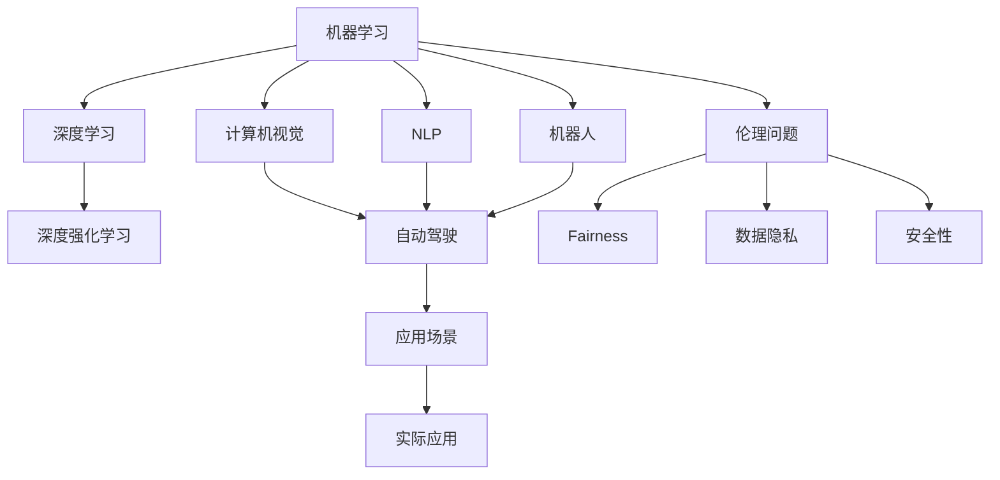
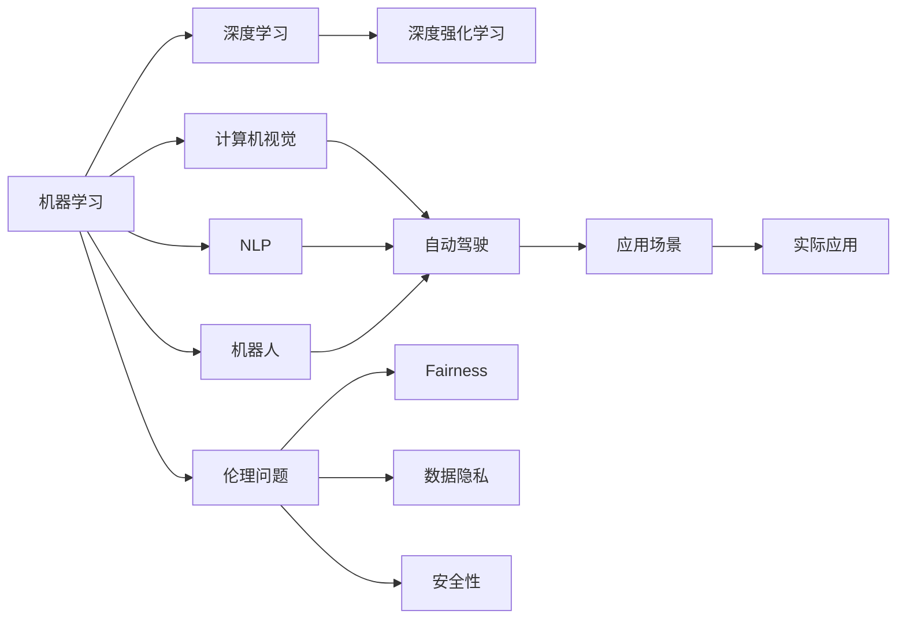

                 

# 安德烈·卡帕西谈人工智能的未来展望

> 关键词：人工智能,机器学习,深度学习,神经网络,深度强化学习,自动驾驶,机器人,计算机视觉,自然语言处理,未来趋势,伦理问题

## 1. 背景介绍

### 1.1 问题由来

自从1956年达特茅斯会议确立了人工智能作为独立研究领域以来，人工智能（AI）和机器学习（ML）在过去几十年里取得了迅猛发展。特别是在深度学习（DL）和深度强化学习（DRL）的推动下，人工智能在许多领域取得了前所未有的突破。

从自动驾驶汽车到机器人，从计算机视觉到自然语言处理（NLP），AI技术正在迅速改变着我们的生活方式和工作方式。但同时，AI技术的发展也面临着诸多挑战，包括伦理问题、安全性、数据隐私等。

在这篇文章中，我们将深入探讨AI和ML的未来发展趋势，以及它们将如何影响我们的生活和工作。我们还将讨论AI技术在实际应用中面临的挑战，以及如何克服这些挑战。

## 2. 核心概念与联系

### 2.1 核心概念概述

AI和ML是两个紧密相关的领域，它们都致力于构建能够执行各种任务的智能系统。以下是几个核心概念及其相互联系：

- **机器学习（Machine Learning, ML）**：通过数据和算法训练计算机程序，使其能够自动学习并执行特定任务。
- **深度学习（Deep Learning, DL）**：一种机器学习技术，通过构建多层神经网络来处理复杂的数据和任务。
- **深度强化学习（Deep Reinforcement Learning, DRL）**：结合了深度学习和强化学习的技术，用于构建自主学习的智能系统。
- **计算机视觉（Computer Vision）**：使用AI技术来分析和理解图像和视频数据。
- **自然语言处理（Natural Language Processing, NLP）**：使用AI技术来理解和生成自然语言文本。
- **自动驾驶（Autonomous Driving）**：使用AI技术来开发无人驾驶汽车和智能交通系统。
- **机器人（Robots）**：使用AI技术来构建自主移动和执行任务的机器人。
- **伦理问题（Ethical Issues）**：在使用AI技术时，必须考虑的道德和法律问题，如数据隐私、公平性、安全性等。

这些概念通过一个复杂的网络相互连接，形成了AI和ML的生态系统。

### 2.2 核心概念的整体架构



这个图展示了机器学习、深度学习、深度强化学习、计算机视觉、自然语言处理、自动驾驶、机器人、伦理问题等核心概念之间的关系。通过这些概念，我们可以构建出复杂的AI系统，并应用于各种实际场景。

### 2.3 核心概念的整体架构



这个图展示了机器学习、深度学习、深度强化学习、计算机视觉、自然语言处理、自动驾驶、机器人、伦理问题等核心概念之间的关系。通过这些概念，我们可以构建出复杂的AI系统，并应用于各种实际场景。

## 3. 核心算法原理 & 具体操作步骤

### 3.1 算法原理概述

AI和ML的核心算法原理可以归纳为以下几个方面：

- **监督学习（Supervised Learning）**：使用标记数据来训练模型，使其能够预测未标记数据的标签。
- **无监督学习（Unsupervised Learning）**：使用未标记数据来训练模型，使其能够自动发现数据中的结构和模式。
- **强化学习（Reinforcement Learning）**：通过与环境的交互来学习最优策略，以最大化长期奖励。
- **神经网络（Neural Networks）**：一种由多层神经元组成的模型，能够处理复杂的数据和非线性关系。
- **卷积神经网络（Convolutional Neural Networks, CNNs）**：一种特殊类型的神经网络，用于图像和视频数据的处理。
- **循环神经网络（Recurrent Neural Networks, RNNs）**：一种能够处理序列数据的神经网络，用于文本和语音数据的处理。
- **生成对抗网络（Generative Adversarial Networks, GANs）**：一种用于生成新数据的神经网络，通过两个对抗神经网络进行训练。
- **Transformer模型**：一种用于处理序列数据的神经网络架构，特别适用于NLP任务。

### 3.2 算法步骤详解

#### 3.2.1 监督学习

1. **数据准备**：收集和预处理数据集，包括标记和未标记的数据。
2. **模型选择**：选择适合任务的机器学习模型。
3. **特征提取**：提取数据集中的特征。
4. **模型训练**：使用训练数据集来训练模型。
5. **模型评估**：使用测试数据集来评估模型性能。
6. **模型优化**：根据评估结果，优化模型参数。
7. **模型应用**：使用训练好的模型进行预测或分类。

#### 3.2.2 深度学习

1. **数据准备**：收集和预处理数据集。
2. **模型构建**：构建深度神经网络模型。
3. **模型训练**：使用训练数据集来训练模型。
4. **模型评估**：使用测试数据集来评估模型性能。
5. **模型优化**：根据评估结果，优化模型参数。
6. **模型应用**：使用训练好的模型进行预测或分类。

#### 3.2.3 深度强化学习

1. **环境设计**：设计合适的环境，以便智能体进行交互。
2. **智能体设计**：设计智能体的决策过程。
3. **训练过程**：使用强化学习算法，如Q-learning或DQN，训练智能体。
4. **模型评估**：使用测试环境来评估智能体性能。
5. **模型优化**：根据评估结果，优化智能体参数。
6. **模型应用**：使用训练好的智能体进行自主决策。

### 3.3 算法优缺点

#### 3.3.1 监督学习

**优点**：
- 可以直接使用标记数据，无需进行特征工程。
- 模型性能稳定，泛化能力较强。
- 可以处理多种类型的数据。

**缺点**：
- 需要大量标记数据，成本较高。
- 容易出现过拟合现象。
- 模型复杂度较高，训练时间较长。

#### 3.3.2 深度学习

**优点**：
- 能够处理复杂的数据和非线性关系。
- 模型的泛化能力较强。
- 可以自动提取特征。

**缺点**：
- 需要大量数据和计算资源。
- 模型复杂度较高，难以解释。
- 容易出现过拟合现象。

#### 3.3.3 深度强化学习

**优点**：
- 能够自主学习和适应环境。
- 模型具有较强的鲁棒性。
- 可以处理不确定性和动态环境。

**缺点**：
- 需要大量的训练时间和计算资源。
- 模型的稳定性较差。
- 模型难以解释。

### 3.4 算法应用领域

AI和ML技术已经被广泛应用于多个领域，包括：

- **计算机视觉**：图像分类、对象检测、图像分割、图像生成等。
- **自然语言处理**：机器翻译、文本生成、语音识别、情感分析等。
- **自动驾驶**：环境感知、路径规划、行为决策等。
- **机器人**：自主导航、任务执行、人机交互等。
- **医疗**：疾病诊断、药物发现、基因组学等。
- **金融**：风险评估、投资组合优化、信用评分等。
- **物流**：路径规划、货物跟踪、智能仓储等。
- **游戏**：游戏AI、游戏设计、游戏开发等。

## 4. 数学模型和公式 & 详细讲解 & 举例说明

### 4.1 数学模型构建

机器学习模型的核心是数学模型。常见的数学模型包括线性回归、逻辑回归、决策树、随机森林、支持向量机（SVM）等。

以线性回归为例，其数学模型为：

$$ y = \theta_0 + \theta_1x_1 + \theta_2x_2 + ... + \theta_nx_n $$

其中，$y$ 为预测值，$x_1, x_2, ..., x_n$ 为输入特征，$\theta_0, \theta_1, \theta_2, ..., \theta_n$ 为模型参数。

### 4.2 公式推导过程

以线性回归为例，其最小二乘法公式推导如下：

假设已知训练数据集 $\{(x_1, y_1), (x_2, y_2), ..., (x_m, y_m)\}$，其中 $x_i = [x_{i1}, x_{i2}, ..., x_{in}]$，$y_i$ 为预测值。

线性回归的目标是找到一组最优参数 $\theta_0, \theta_1, \theta_2, ..., \theta_n$，使得模型能够最小化预测误差。

目标函数为：

$$ J(\theta) = \frac{1}{2m}\sum_{i=1}^m(y_i - \hat{y}_i)^2 $$

其中，$\hat{y}_i = \theta_0 + \theta_1x_{i1} + \theta_2x_{i2} + ... + \theta_nx_{in}$。

对目标函数求导，得到：

$$ \frac{\partial J(\theta)}{\partial \theta_j} = \frac{1}{m}\sum_{i=1}^m(x_{ij} - \bar{x}_{ij})(y_i - \hat{y}_i) $$

其中，$\bar{x}_{ij}$ 为第 $j$ 个特征的平均值，$\hat{y}_i$ 为模型预测值。

将上述公式代入目标函数，得到：

$$ \theta_j = \frac{1}{m}\sum_{i=1}^m(x_{ij} - \bar{x}_{ij})(y_i - \bar{y}) $$

其中，$\bar{y}$ 为 $y_i$ 的平均值。

### 4.3 案例分析与讲解

以图像分类为例，使用卷积神经网络（CNN）进行分类。

假设有一个简单的CNN模型，包含两个卷积层和两个池化层。输入图像为 $28 \times 28$ 的灰度图像，输出为 10 个类别的概率分布。

模型前向传播过程如下：

1. 卷积层 1：对输入图像进行卷积操作，提取特征。
2. ReLU 层 1：激活卷积层 1 的输出。
3. 池化层 1：对 ReLU 层 1 的输出进行池化操作。
4. 卷积层 2：对池化层 1 的输出进行卷积操作，提取更高级的特征。
5. ReLU 层 2：激活卷积层 2 的输出。
6. 池化层 2：对 ReLU 层 2 的输出进行池化操作。
7. 全连接层：将池化层 2 的输出展开成一维向量，进行分类。

模型反向传播过程如下：

1. 计算损失函数：将模型预测的概率分布与真实标签进行比较，计算损失函数。
2. 计算梯度：根据损失函数，计算每个参数的梯度。
3. 更新参数：使用梯度下降算法，更新模型参数。

## 5. 项目实践：代码实例和详细解释说明

### 5.1 开发环境搭建

在开发环境搭建方面，主要使用Python语言，以及TensorFlow和PyTorch两个深度学习框架。

#### 5.1.1 TensorFlow

TensorFlow是Google开发的深度学习框架，支持多种硬件和平台，具有丰富的API和工具支持。

安装TensorFlow的过程如下：

```bash
pip install tensorflow
```

#### 5.1.2 PyTorch

PyTorch是Facebook开发的深度学习框架，以其动态计算图和灵活性著称，特别适合研究和原型开发。

安装PyTorch的过程如下：

```bash
pip install torch
```

#### 5.1.3 数据准备

数据准备是机器学习项目的关键步骤之一。可以使用Python中的Pandas库来处理数据，如读取CSV文件、数据清洗、数据转换等。

### 5.2 源代码详细实现

以线性回归为例，使用TensorFlow进行实现。

```python
import tensorflow as tf
import numpy as np

# 数据准备
x = np.array([1, 2, 3, 4, 5, 6, 7, 8, 9, 10])
y = np.array([2, 4, 6, 8, 10, 12, 14, 16, 18, 20])

# 构建模型
model = tf.keras.Sequential([
    tf.keras.layers.Dense(1, input_shape=(1,))
])

# 编译模型
model.compile(optimizer=tf.keras.optimizers.SGD(learning_rate=0.01), loss='mse')

# 训练模型
model.fit(x, y, epochs=100, verbose=0)

# 预测新数据
x_new = np.array([11, 22, 33])
y_pred = model.predict(x_new)
print(y_pred)
```

### 5.3 代码解读与分析

上述代码实现了线性回归模型的训练和预测。具体步骤如下：

1. 数据准备：将输入数据和输出数据分别存储在x和y数组中。
2. 模型构建：使用Sequential模型，定义一个全连接层，输入维度为1，输出维度为1。
3. 模型编译：使用SGD优化器，学习率为0.01，损失函数为均方误差（mse）。
4. 模型训练：使用训练数据集进行模型训练，迭代次数为100。
5. 模型预测：使用训练好的模型对新数据进行预测。

## 6. 实际应用场景

### 6.1 计算机视觉

计算机视觉是AI技术的重要应用领域之一。通过AI技术，计算机可以对图像和视频数据进行理解和处理，广泛应用于医疗影像分析、智能监控、自动驾驶等场景。

以医疗影像分析为例，使用CNN模型对医学图像进行分类和标注。医学影像数据具有高维性和复杂性，需要大量的训练数据和计算资源。使用CNN模型，可以通过多层次的卷积操作，提取图像的高级特征，并进行分类和标注。

### 6.2 自然语言处理

自然语言处理是AI技术的另一个重要应用领域。通过AI技术，计算机可以对自然语言文本进行理解和生成，广泛应用于机器翻译、情感分析、语音识别等场景。

以机器翻译为例，使用Transformer模型进行翻译。Transformer模型是一种基于自注意力机制的神经网络架构，能够处理长序列数据，适用于自然语言处理任务。通过Transformer模型，可以将源语言文本转换为目标语言文本，实现自然语言翻译。

### 6.3 自动驾驶

自动驾驶是AI技术的另一个重要应用领域。通过AI技术，车辆可以实现自主驾驶和路径规划，提高交通安全和运输效率。

以自动驾驶为例，使用强化学习技术，训练智能体进行决策。智能体通过与环境的交互，学习最优的决策策略，实现自主驾驶。自动驾驶技术需要处理复杂的传感器数据和动态环境，使用强化学习技术，可以适应多种场景和条件。

### 6.4 未来应用展望

未来，AI和ML技术将进一步普及和深化，广泛应用于更多领域。以下是一些未来应用展望：

1. **智能医疗**：使用AI技术进行疾病诊断、药物发现和基因组学研究，提高医疗水平和效率。
2. **智能交通**：使用AI技术进行交通管理、智能交通分析和自动驾驶，提高交通效率和安全性。
3. **智能制造**：使用AI技术进行预测性维护、质量控制和生产优化，提高制造效率和质量。
4. **智能金融**：使用AI技术进行风险评估、投资组合优化和信用评分，提高金融服务的智能化和个性化。
5. **智能家居**：使用AI技术进行智能控制、语音识别和图像识别，提高家居生活的便捷性和安全性。
6. **智能客服**：使用AI技术进行智能客服和自然语言处理，提高客户服务效率和质量。
7. **智能农业**：使用AI技术进行农业数据分析、作物预测和智能灌溉，提高农业生产效率和可持续性。
8. **智能城市**：使用AI技术进行城市管理、环境保护和灾害预警，提高城市管理的智能化和安全性。

## 7. 工具和资源推荐

### 7.1 学习资源推荐

以下是一些优秀的学习资源，可以帮助读者深入学习AI和ML技术：

1. **《深度学习》（Deep Learning）**：由Goodfellow等著，是深度学习领域的经典教材，涵盖深度学习的理论基础和实践技术。
2. **《机器学习》（Pattern Recognition and Machine Learning）**：由Bishop著，是机器学习领域的经典教材，涵盖机器学习的理论基础和应用技术。
3. **《强化学习》（Reinforcement Learning: An Introduction）**：由Sutton和Barto著，是强化学习领域的经典教材，涵盖强化学习的理论基础和应用技术。
4. **《自然语言处理综论》（Speech and Language Processing）**：由Jurafsky和Martin著，是自然语言处理领域的经典教材，涵盖自然语言处理的技术和应用。
5. **《计算机视觉：模型、学习和推理》（Computer Vision: Models, Learning, and Inference）**：由Hinton等著，是计算机视觉领域的经典教材，涵盖计算机视觉的理论基础和应用技术。
6. **《TensorFlow实战》（TensorFlow in Practice）**：由Google TensorFlow团队著，是一本TensorFlow实战指南，涵盖TensorFlow的实践技术。
7. **《PyTorch实战》（Deep Learning with PyTorch）**：由Sukhbaatar等著，是一本PyTorch实战指南，涵盖PyTorch的实践技术。

### 7.2 开发工具推荐

以下是一些优秀的开发工具，可以帮助开发者进行AI和ML项目的开发：

1. **TensorFlow**：Google开发的深度学习框架，支持多种硬件和平台，具有丰富的API和工具支持。
2. **PyTorch**：Facebook开发的深度学习框架，以其动态计算图和灵活性著称，特别适合研究和原型开发。
3. **Keras**：一种基于TensorFlow和Theano的高级API，易于使用，适合初学者和研究者。
4. **Scikit-learn**：一个Python机器学习库，包含各种常见的机器学习算法和工具，适合数据科学家和研究者。
5. **Matplotlib**：一个Python绘图库，适合可视化机器学习模型的输出结果。
6. **Seaborn**：一个Python绘图库，适合进行数据可视化分析。
7. **Jupyter Notebook**：一个交互式的Python开发环境，适合进行机器学习实验和数据处理。

### 7.3 相关论文推荐

以下是一些优秀的AI和ML论文，涵盖机器学习、深度学习、强化学习、自然语言处理等领域：

1. **《深度学习》（Deep Learning）**：Goodfellow等著，Nature杂志2016年年度论文。
2. **《一个用于所有人类对话的对话系统》（A Neural Conversation Model）**：Vinyals等著，NIPS 2015年最佳论文。
3. **《机器学习：一种新的视角》（Learning from Data）**：Bishop著，MIT Press出版社2011年书籍。
4. **《强化学习：一种新方法》（Reinforcement Learning: An Introduction）**：Sutton和Barto著，MIT Press出版社2018年书籍。
5. **《自然语言处理综论》（Speech and Language Processing）**：Jurafsky和Martin著，Pearson出版社2013年书籍。
6. **《计算机视觉：模型、学习和推理》（Computer Vision: Models, Learning, and Inference）**：Hinton等著，MIT Press出版社2017年书籍。
7. **《一种用于大规模图像识别的通用架构》（A General Architecture for Named Entity Recognition）**：Stanford NLP组2016年ACL论文。

## 8. 总结：未来发展趋势与挑战

### 8.1 研究成果总结

在AI和ML领域，近年来取得了诸多突破性成果。以下是一些主要的成就：

1. **深度学习**：通过深度神经网络，实现了在图像识别、语音识别、自然语言处理等领域的显著提升。
2. **强化学习**：通过强化学习技术，实现了智能体在复杂环境中的自主学习和决策。
3. **计算机视觉**：通过深度神经网络，实现了在医学影像分析、自动驾驶等领域的广泛应用。
4. **自然语言处理**：通过深度神经网络，实现了在机器翻译、情感分析等领域的突破。
5. **自动驾驶**：通过深度神经网络和强化学习技术，实现了自动驾驶技术的快速发展。
6. **机器人**：通过深度神经网络和强化学习技术，实现了在智能制造、智能家居等领域的广泛应用。

### 8.2 未来发展趋势

未来，AI和ML技术将继续快速发展和普及，以下是一些主要趋势：

1. **更强大的模型和算法**：未来将会出现更多更强大的模型和算法，如更深的神经网络、更好的优化算法等。
2. **更广泛的应用场景**：AI和ML技术将应用于更多领域，如智能医疗、智能交通、智能制造等。
3. **更高效的数据处理和分析**：未来将会出现更多高效的数据处理和分析工具，如自动数据标注、数据清洗等。
4. **更智能的决策和预测**：未来将会出现更多智能的决策和预测工具，如预测性维护、智能交通等。
5. **更高效的学习和训练**：未来将会出现更多高效的学习和训练工具，如模型压缩、分布式训练等。
6. **更智能的交互和控制**：未来将会出现更多智能的交互和控制技术，如自然语言处理、智能家居等。
7. **更高效的计算和存储**：未来将会出现更多高效的计算和存储技术，如GPU、TPU、分布式存储等。

### 8.3 面临的挑战

在AI和ML技术的发展过程中，仍面临诸多挑战：

1. **数据隐私和安全**：AI技术需要大量的数据，如何保护用户隐私和数据安全是一个重要问题。
2. **模型偏见和歧视**：AI模型可能会学习到偏见和歧视，如何消除模型偏见，确保模型公平性是一个重要问题。
3. **模型可解释性和透明性**：AI模型通常是黑盒模型，如何提高模型的可解释性和透明性是一个重要问题。
4. **模型鲁棒性和稳定性**：AI模型在面对新的数据和场景时，可能会表现不稳定，如何提高模型的鲁棒性和稳定性是一个重要问题。
5. **模型的公平性和公正性**：AI模型可能会表现出不公平和偏见，如何确保模型的公平性和公正性是一个重要问题。
6. **模型的伦理和道德问题**：AI模型的应用可能会带来伦理和道德问题，如何规范和约束模型的应用是一个重要问题。
7. **模型的计算和存储资源**：AI模型需要大量的计算和存储资源，如何高效利用计算和存储资源是一个重要问题。

### 8.4 研究展望

未来，AI和ML技术将继续在各个领域得到广泛应用，以下是一些未来研究方向：

1. **更高效的数据处理和分析**：未来将会出现更多高效的数据处理和分析工具，如自动数据标注、数据清洗等。
2. **更智能的决策和预测**：未来将会出现更多智能的决策和预测工具，如预测性维护、智能交通等。
3. **更高效的学习和训练**：未来将会出现更多高效的学习和训练工具，如模型压缩、分布式训练等。
4. **更智能的交互和控制**：未来将会出现更多智能的交互和控制技术，如自然语言处理、智能家居等。
5. **更高效的计算和存储**：未来将会出现更多高效的计算和存储技术，如GPU、TPU、分布式存储等。
6. **更智能的优化和调度**：未来将会出现更多智能的优化和调度算法，如分布式优化、自适应调度等。
7. **更智能的安全和隐私保护**：未来将会出现更多智能的安全和隐私保护技术，如差分隐私、安全多方计算等。
8. **更智能的伦理和道德约束**：未来将会出现更多智能的伦理和道德约束技术，如公平性评估、隐私保护等。

## 9. 附录：常见问题与解答

**Q1：AI和ML技术的发展前景如何？**

A：AI和ML技术的发展前景非常广阔。未来，AI和ML技术将应用于更多领域，如智能医疗、智能交通、智能制造等。同时，AI和ML技术也将不断突破，出现更强大的模型和算法，带来更多的应用场景和商业机会。

**Q2：AI和ML技术有哪些应用场景？**

A：AI和ML技术在许多领域都有广泛的应用，以下是一些主要的应用场景：

1. **计算机视觉**：图像分类、对象检测、图像分割、图像生成等。
2. **自然语言处理**：机器翻译、文本生成、语音识别、

