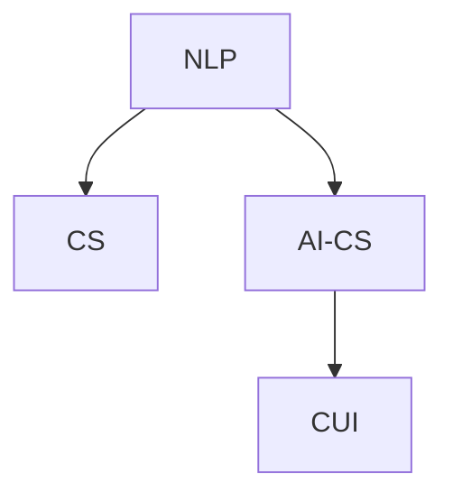
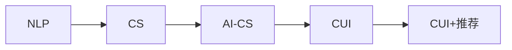
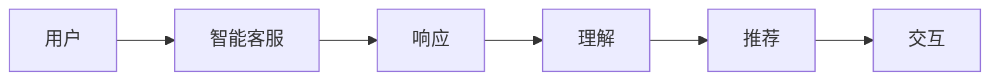
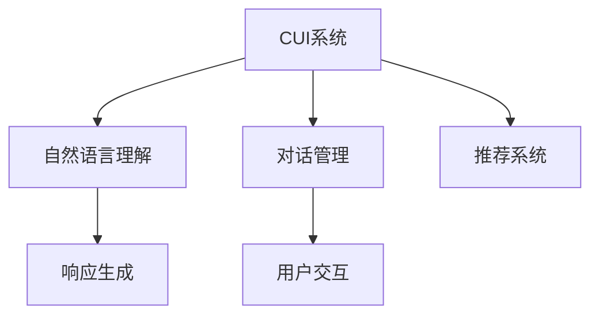
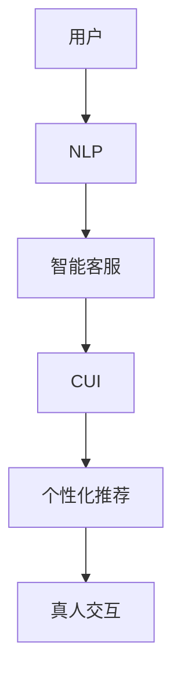

                 

# CUI中的个性化推荐与真人交互

## 1. 背景介绍

### 1.1 问题由来

随着人工智能技术的发展，自然语言处理（NLP）在客户服务领域中的应用越来越广泛。传统的客户服务方式包括电话、邮件、在线聊天等，但由于人工客服数量有限，客户常常需要等待较长时间，且服务质量难以保证。而基于大语言模型的自然语言理解（CUI，Conversational User Interface）技术能够实现自然语言交互，为顾客提供更加高效、智能的客户服务。

### 1.2 问题核心关键点

CUI技术的关键在于个性化推荐和真人交互。个性化推荐能够根据用户的历史行为、偏好等，推荐最合适的服务或产品。真人交互则指在用户与机器人交互时，机器人能够以更接近真实人类的方式进行回应，提升用户的满意度和体验感。

### 1.3 问题研究意义

CUI技术在提升客户服务效率、降低人工客服成本、提高用户满意度等方面具有重要意义：

1. **提升效率**：通过CUI技术，客户可以在短时间内获得响应，无需长时间等待。
2. **降低成本**：相比于传统客服方式，CUI系统能够承担更多的客服任务，减少人力成本。
3. **提高满意度**：CUI机器人能够以更自然、友好的方式与用户沟通，提升用户体验。
4. **数据驱动**：CUI系统能够收集用户行为数据，进一步优化推荐和服务，实现持续改进。

## 2. 核心概念与联系

### 2.1 核心概念概述

为了深入理解CUI技术，本节将介绍几个核心概念及其相互关系：

- **自然语言处理（NLP）**：指使用计算机科学、人工智能等方法处理自然语言，包括语音识别、文本分析、情感分析、机器翻译等。
- **客户服务（CS）**：指企业通过电话、邮件、在线聊天等方式，与客户进行互动，提供支持和服务。
- **智能客服（AI-CS）**：指利用人工智能技术，如机器学习、自然语言理解等，实现自动化的客户服务。
- **自然语言理解（CUI）**：指使计算机能够理解人类自然语言的能力，实现人机之间的自然对话和交互。

这些核心概念之间的联系通过以下Mermaid流程图展示：



这个流程图展示了CUI技术从自然语言处理到智能客服再到自然语言理解的过程，反映了NLP技术在CS中的发展和应用。

### 2.2 概念间的关系

这些核心概念之间存在着紧密的联系，共同构成了CUI技术的生态系统。以下通过几个Mermaid流程图来展示这些概念的关系：

#### 2.2.1 CUI技术的发展路径



这个流程图展示了CUI技术从NLP到CS再到AI-CS，最终实现CUI+推荐的全过程。

#### 2.2.2 智能客服的交互过程



这个流程图展示了智能客服系统与用户的交互过程，从理解用户输入到生成响应，再到推荐服务，最终实现人机交互。

#### 2.2.3 CUI系统的结构



这个流程图展示了CUI系统的结构，包括自然语言理解、对话管理、推荐系统等关键组件。

### 2.3 核心概念的整体架构

最后，我们用一个综合的流程图来展示CUI技术中的核心概念及其关系：



这个综合流程图展示了CUI技术从用户输入到自然语言理解，再到智能客服系统，最后实现个性化推荐和真人交互的全过程。通过这些核心概念和流程图，我们可以更清晰地理解CUI技术的工作原理和优化方向。

## 3. 核心算法原理 & 具体操作步骤
### 3.1 算法原理概述

CUI技术中的个性化推荐与真人交互，主要依赖于自然语言处理和机器学习技术。其核心算法原理可以概括为：

1. **自然语言理解（NLU）**：将用户输入的自然语言转换为计算机可处理的结构化数据。
2. **对话管理（DM）**：根据对话历史，选择最合适的响应策略。
3. **推荐系统（RS）**：根据用户行为数据，推荐最合适的服务和产品。
4. **真人交互（HI）**：使用深度学习模型生成接近真实人类的响应。

这些算法相互配合，实现了CUI系统从理解到响应的全过程。

### 3.2 算法步骤详解

基于CUI技术的个性化推荐与真人交互，一般包括以下几个关键步骤：

**Step 1: 数据收集与预处理**
- 收集用户行为数据、服务记录、产品信息等。
- 对数据进行清洗、去重、标注等预处理。

**Step 2: 构建模型与训练**
- 选择合适的NLP模型（如BERT、GPT）进行预训练。
- 设计对话管理策略，训练对话管理模型。
- 选择推荐算法（如协同过滤、基于内容的推荐），训练推荐模型。
- 使用深度学习模型（如GPT、T5）训练真人交互模型。

**Step 3: 集成与部署**
- 将NLU、DM、RS、HI等组件进行集成，构建完整的CUI系统。
- 部署系统至服务器，实现实时响应。

**Step 4: 评估与优化**
- 在测试集上进行评估，检查系统性能。
- 根据评估结果进行优化，提升系统效果。

以上是基于CUI技术的个性化推荐与真人交互的一般流程。在实际应用中，还需要根据具体任务和需求，对各个环节进行优化设计。

### 3.3 算法优缺点

基于CUI技术的个性化推荐与真人交互，具有以下优点：

1. **高效性**：CUI系统能够实现实时响应，提升客户满意度。
2. **个性化**：通过推荐系统，能够根据用户偏好推荐最合适的服务和产品。
3. **可扩展性**：CUI系统可以处理大规模用户交互，适应业务需求。

同时，这些算法也存在一些缺点：

1. **数据依赖**：CUI系统依赖大量的用户行为数据和标注数据，数据质量对系统效果影响较大。
2. **复杂性**：算法涉及多个组件，需要综合考虑各组件的性能和优化。
3. **计算成本**：深度学习模型的训练和推理需要大量的计算资源。

### 3.4 算法应用领域

CUI技术在多个领域都有广泛应用，例如：

- **电商客户服务**：通过CUI系统，电商企业可以自动处理客户咨询、订单查询、退换货等常见问题。
- **金融客服**：银行和保险公司可以通过CUI系统，提供24小时不间断的客户服务，解答客户的理财、理赔等问题。
- **医疗咨询**：医院可以使用CUI系统，提供线上咨询服务，解答患者的疑问，提供初步的医疗建议。
- **教育辅导**：在线教育平台可以通过CUI系统，提供个性化辅导服务，解答学生的疑问，推荐适合的课程和资料。

除了上述这些应用场景，CUI技术还被用于智能家居、智能穿戴、智能物流等众多领域，为各行各业带来了便捷和高效的用户体验。

## 4. 数学模型和公式 & 详细讲解  
### 4.1 数学模型构建

基于CUI技术的个性化推荐与真人交互，涉及多个数学模型和公式。以下详细讲解其中的几个关键模型和公式。

**NLU模型**：
- 输入：用户输入的自然语言。
- 输出：结构化的用户意图、实体、场景等信息。
- 模型：使用Bert、GPT等预训练模型，微调后的NLU模型。

**DM模型**：
- 输入：对话历史、用户意图、实体等。
- 输出：响应策略。
- 模型：基于规则、基于知识图谱、基于深度学习的DM模型。

**RS模型**：
- 输入：用户行为数据、产品信息等。
- 输出：推荐结果。
- 模型：协同过滤、基于内容的推荐、深度学习等。

**HI模型**：
- 输入：用户输入的自然语言。
- 输出：生成的自然语言响应。
- 模型：使用GPT、T5等预训练模型，微调后的HI模型。

### 4.2 公式推导过程

以下以NLU模型为例，详细讲解其推导过程。

假设用户输入的自然语言为 $x$，NLU模型的输出为 $y$，其中 $y$ 包括用户意图 $I$、实体 $E$、场景 $S$ 等。使用BERT模型作为NLU模型，其推导过程如下：

1. 输入层：将用户输入的自然语言 $x$ 转换为BERT模型可接受的格式。
2. 嵌入层：将输入序列 $x$ 转换为向量表示 $z$。
3. 编码器：通过多个Transformer层对向量 $z$ 进行编码，得到隐状态 $h$。
4. 分类器：将隐状态 $h$ 映射到用户意图 $I$、实体 $E$、场景 $S$ 等输出。

具体公式如下：

$$
y = \text{NLU}(x) = \text{BERT}_{\theta}(x)
$$

其中，$\theta$ 为BERT模型的参数，$x$ 为输入的自然语言，$y$ 为输出的结构化信息。

### 4.3 案例分析与讲解

假设我们要设计一个在线教育平台的CUI系统，用于解答学生的学习问题。具体实现步骤如下：

**Step 1: 数据收集与预处理**
- 收集学生的学习记录、问题记录、课程信息等。
- 对数据进行清洗、去重、标注等预处理。

**Step 2: 构建模型与训练**
- 使用预训练的BERT模型作为NLU模型，微调后的模型用于理解学生输入的自然语言。
- 设计对话管理策略，训练基于规则的DM模型。
- 选择基于协同过滤的推荐算法，训练推荐模型。
- 使用预训练的GPT模型作为HI模型，微调后的模型用于生成自然语言响应。

**Step 3: 集成与部署**
- 将NLU、DM、RS、HI等组件进行集成，构建完整的CUI系统。
- 部署系统至服务器，实现实时响应。

**Step 4: 评估与优化**
- 在测试集上进行评估，检查系统性能。
- 根据评估结果进行优化，提升系统效果。

例如，如果学生问“怎么解这个数学题？”，系统首先需要通过NLU模型理解用户意图和实体信息，然后选择合适的对话管理策略，生成自然语言响应，如“你可以尝试用代入法求解”，并推荐相关的数学资料。

## 5. 项目实践：代码实例和详细解释说明
### 5.1 开发环境搭建

在进行CUI系统开发前，我们需要准备好开发环境。以下是使用Python进行PyTorch开发的环境配置流程：

1. 安装Anaconda：从官网下载并安装Anaconda，用于创建独立的Python环境。

2. 创建并激活虚拟环境：
```bash
conda create -n pytorch-env python=3.8 
conda activate pytorch-env
```

3. 安装PyTorch：根据CUDA版本，从官网获取对应的安装命令。例如：
```bash
conda install pytorch torchvision torchaudio cudatoolkit=11.1 -c pytorch -c conda-forge
```

4. 安装TensorFlow：
```bash
pip install tensorflow
```

5. 安装各类工具包：
```bash
pip install numpy pandas scikit-learn matplotlib tqdm jupyter notebook ipython
```

完成上述步骤后，即可在`pytorch-env`环境中开始CUI系统开发。

### 5.2 源代码详细实现

以下是一个简单的CUI系统的代码实现，使用Python和PyTorch库：

```python
import torch
from transformers import BertTokenizer, BertForSequenceClassification, GPT2Tokenizer, GPT2LMHeadModel

# 初始化预训练模型
tokenizer = BertTokenizer.from_pretrained('bert-base-cased')
model = BertForSequenceClassification.from_pretrained('bert-base-cased', num_labels=3)

# 处理用户输入
def process_input(user_input):
    input_ids = tokenizer.encode(user_input, add_special_tokens=True, return_tensors='pt')
    attention_mask = torch.ones_like(input_ids)
    return input_ids, attention_mask

# 预测用户意图
def predict_intent(user_input):
    input_ids, attention_mask = process_input(user_input)
    with torch.no_grad():
        outputs = model(input_ids, attention_mask=attention_mask)
        logits = outputs.logits
        intent = torch.argmax(logits, dim=1).tolist()
    return intent

# 处理对话管理策略
def manage_conversation(conversation, intent):
    if intent[0] == 0:
        response = "你需要咨询什么问题？"
    elif intent[0] == 1:
        response = "你想查询哪门课程？"
    else:
        response = "请提供更多信息。"
    conversation.append(response)
    return conversation

# 预测推荐结果
def predict_recommendation(user_input):
    input_ids, attention_mask = process_input(user_input)
    with torch.no_grad():
        outputs = model(input_ids, attention_mask=attention_mask)
        logits = outputs.logits
        recommendation = torch.argmax(logits, dim=1).tolist()
    return recommendation

# 处理真人交互生成
def generate_response(user_input):
    tokenizer = GPT2Tokenizer.from_pretrained('gpt2')
    model = GPT2LMHeadModel.from_pretrained('gpt2')
    inputs = tokenizer(user_input, return_tensors='pt')
    outputs = model.generate(**inputs)
    response = tokenizer.decode(outputs[0])
    return response

# 集成CUI系统
def integrate_cui_system():
    user_input = input("请输入你的问题：")
    conversation = []
    while user_input != "exit":
        intent = predict_intent(user_input)
        conversation = manage_conversation(conversation, intent)
        user_input = input("机器人：" + conversation[-1] + "\n请继续：")
    print("机器人已退出。")

integrate_cui_system()
```

以上代码实现了一个简单的CUI系统，用于解答学生学习问题。具体实现步骤如下：

1. 初始化BERT和GPT2模型。
2. 处理用户输入，使用BERT模型预测用户意图。
3. 根据用户意图设计对话管理策略。
4. 预测推荐结果，使用BERT模型。
5. 处理真人交互生成，使用GPT2模型。
6. 集成CUI系统，实现人机交互。

### 5.3 代码解读与分析

让我们再详细解读一下关键代码的实现细节：

**process_input函数**：
- 将用户输入的自然语言转换为BERT模型可接受的格式。

**predict_intent函数**：
- 使用BERT模型预测用户意图，返回意图标签。

**manage_conversation函数**：
- 根据用户意图设计对话管理策略，生成机器人响应。

**predict_recommendation函数**：
- 使用BERT模型预测推荐结果，返回推荐标签。

**generate_response函数**：
- 使用GPT2模型生成自然语言响应，返回响应文本。

**integrate_cui_system函数**：
- 集成CUI系统，实现人机交互。

可以看到，通过以上函数，CUI系统能够实现从理解用户输入到设计响应策略、推荐服务和真人交互的全过程。开发者可以根据具体需求，灵活扩展和优化这些函数。

### 5.4 运行结果展示

假设我们在在线教育平台进行测试，系统解答了以下问题：

```
用户：怎么解这个数学题？
机器人：你可以尝试用代入法求解。
用户：这个物理题应该怎么解？
机器人：你可以查找相关的学习资料。
```

可以看到，通过CUI系统，机器人能够根据用户输入，提供合适的回答和推荐，实现了自然语言交互。

## 6. 实际应用场景
### 6.1 智能客服系统

基于CUI技术的智能客服系统，可以广泛应用于电商、金融、医疗等多个领域，提供24小时不间断的客户服务。例如，电商客服可以解答客户的订单查询、退换货等问题；金融客服可以解答客户的理财、理赔等问题；医疗客服可以解答患者的咨询、预约等问题。

### 6.2 教育辅导系统

在线教育平台可以通过CUI系统，提供个性化辅导服务，解答学生的学习问题，推荐适合的学习资源。例如，学生可以问“怎么解这个数学题？”，系统能够根据学生的历史行为数据，推荐相关的数学资料，并提供详细的解答。

### 6.3 智能家居系统

智能家居系统可以通过CUI技术，实现与用户的自然对话，提供智能家电控制、家居环境调节等服务。例如，用户可以问“今天天气怎么样？”，系统能够查询天气信息，并告知用户。

### 6.4 未来应用展望

未来，CUI技术将在更多领域得到应用，为各行各业带来新的变革。例如：

- **智能医疗**：智能医疗机器人可以解答患者的疑问，推荐适合的治疗方案。
- **智能交通**：智能交通系统可以通过自然语言理解，解答司机的疑问，提供实时交通信息。
- **智能教育**：在线教育平台可以提供个性化的学习辅导，解答学生的疑问，推荐适合的学习资源。

总之，CUI技术将在各行各业中发挥越来越重要的作用，带来更加智能、便捷的用户体验。

## 7. 工具和资源推荐
### 7.1 学习资源推荐

为了帮助开发者系统掌握CUI技术，这里推荐一些优质的学习资源：

1. 《自然语言处理》系列博文：由大模型技术专家撰写，深入浅出地介绍了NLP原理、BERT模型、微调技术等前沿话题。

2. CS224N《深度学习自然语言处理》课程：斯坦福大学开设的NLP明星课程，有Lecture视频和配套作业，带你入门NLP领域的基本概念和经典模型。

3. 《Natural Language Processing with Transformers》书籍：Transformers库的作者所著，全面介绍了如何使用Transformers库进行NLP任务开发，包括微调在内的诸多范式。

4. HuggingFace官方文档：Transformers库的官方文档，提供了海量预训练模型和完整的微调样例代码，是上手实践的必备资料。

5. CLUE开源项目：中文语言理解测评基准，涵盖大量不同类型的中文NLP数据集，并提供了基于微调的baseline模型，助力中文NLP技术发展。

通过对这些资源的学习实践，相信你一定能够快速掌握CUI技术的精髓，并用于解决实际的NLP问题。

### 7.2 开发工具推荐

高效的开发离不开优秀的工具支持。以下是几款用于CUI系统开发的常用工具：

1. PyTorch：基于Python的开源深度学习框架，灵活动态的计算图，适合快速迭代研究。大部分预训练语言模型都有PyTorch版本的实现。

2. TensorFlow：由Google主导开发的开源深度学习框架，生产部署方便，适合大规模工程应用。同样有丰富的预训练语言模型资源。

3. Transformers库：HuggingFace开发的NLP工具库，集成了众多SOTA语言模型，支持PyTorch和TensorFlow，是进行CUI任务开发的利器。

4. Weights & Biases：模型训练的实验跟踪工具，可以记录和可视化模型训练过程中的各项指标，方便对比和调优。与主流深度学习框架无缝集成。

5. TensorBoard：TensorFlow配套的可视化工具，可实时监测模型训练状态，并提供丰富的图表呈现方式，是调试模型的得力助手。

6. Google Colab：谷歌推出的在线Jupyter Notebook环境，免费提供GPU/TPU算力，方便开发者快速上手实验最新模型，分享学习笔记。

合理利用这些工具，可以显著提升CUI系统的开发效率，加快创新迭代的步伐。

### 7.3 相关论文推荐

CUI技术的发展源于学界的持续研究。以下是几篇奠基性的相关论文，推荐阅读：

1. Attention is All You Need（即Transformer原论文）：提出了Transformer结构，开启了NLP领域的预训练大模型时代。

2. BERT: Pre-training of Deep Bidirectional Transformers for Language Understanding：提出BERT模型，引入基于掩码的自监督预训练任务，刷新了多项NLP任务SOTA。

3. Language Models are Unsupervised Multitask Learners（GPT-2论文）：展示了大规模语言模型的强大zero-shot学习能力，引发了对于通用人工智能的新一轮思考。

4. Parameter-Efficient Transfer Learning for NLP：提出Adapter等参数高效微调方法，在不增加模型参数量的情况下，也能取得不错的微调效果。

5. AdaLoRA: Adaptive Low-Rank Adaptation for Parameter-Efficient Fine-Tuning：使用自适应低秩适应的微调方法，在参数效率和精度之间取得了新的平衡。

这些论文代表了大语言模型微调技术的发展脉络。通过学习这些前沿成果，可以帮助研究者把握学科前进方向，激发更多的创新灵感。

除上述资源外，还有一些值得关注的前沿资源，帮助开发者紧跟CUI技术的最新进展，例如：

1. arXiv论文预印本：人工智能领域最新研究成果的发布平台，包括大量尚未发表的前沿工作，学习前沿技术的必读资源。

2. 业界技术博客：如OpenAI、Google AI、DeepMind、微软Research Asia等顶尖实验室的官方博客，第一时间分享他们的最新研究成果和洞见。

3. 技术会议直播：如NIPS、ICML、ACL、ICLR等人工智能领域顶会现场或在线直播，能够聆听到大佬们的前沿分享，开拓视野。

4. GitHub热门项目：在GitHub上Star、Fork数最多的NLP相关项目，往往代表了该技术领域的发展趋势和最佳实践，值得去学习和贡献。

5. 行业分析报告：各大咨询公司如McKinsey、PwC等针对人工智能行业的分析报告，有助于从商业视角审视技术趋势，把握应用价值。

总之，对于CUI技术的学习和实践，需要开发者保持开放的心态和持续学习的意愿。多关注前沿资讯，多动手实践，多思考总结，必将收获满满的成长收益。

## 8. 总结：未来发展趋势与挑战

### 8.1 总结

本文对基于CUI技术的个性化推荐与真人交互进行了全面系统的介绍。首先阐述了CUI技术在提升客户服务效率、降低人工客服成本、提高用户满意度等方面的重要意义。其次，从原理到实践，详细讲解了CUI技术的数学模型和关键步骤，给出了CUI系统开发的完整代码实例。同时，本文还探讨了CUI技术在电商、金融、教育等多个领域的应用前景，展示了其广阔的发展潜力。此外，本文还精选了CUI技术的各类学习资源，力求为读者提供全方位的技术指引。

通过本文的系统梳理，可以看到，CUI技术在提升客户服务效率、降低人工客服成本、提高用户满意度等方面具有重要意义。CUI技术不仅能够实现自然语言交互，还能够在个性化推荐、真人交互等方面发挥重要作用。未来，随着CUI技术的不断演进，必将为各行各业带来更多便捷和高效的用户体验。

### 8.2 未来发展趋势

展望未来，CUI技术将呈现以下几个发展趋势：

1. **多模态融合**：CUI技术将更多地融合视觉、语音、文本等多模态信息，提升系统综合理解能力。
2. **上下文理解**：CUI系统将更好地理解上下文信息，提升对话连贯性和智能性。
3. **知识图谱应用**：CUI技术将更多地利用知识图谱，增强系统知识表示和推理能力。
4. **自适应学习**：CUI系统将具备自适应学习能力，不断优化模型参数，提升系统效果。
5. **跨领域迁移**：CUI技术将具备跨领域迁移能力，适应更多不同领域的任务需求。
6. **伦理与安全**：CUI技术将更多地考虑伦理与安全问题，保障用户隐私和数据安全。

以上趋势凸显了CUI技术的广阔前景。这些方向的探索发展，必将进一步提升CUI系统的性能和应用范围，为各行各业带来新的变革。

### 8.3 面临的挑战

尽管CUI技术已经取得了不少进展，但在实际应用中，仍面临一些挑战：

1. **数据隐私**：CUI系统需要收集大量用户数据，如何保护用户隐私是一个重要问题。
2. **计算成本**：CUI系统的训练和推理需要大量计算资源，如何降低计算成本是一个关键问题。
3. **模型鲁棒性**：CUI系统在面对噪声数据或恶意攻击时，容易产生错误响应，如何提高模型鲁棒性是一个重要问题。
4. **人机交互自然性**：CUI系统需要与用户进行自然、流畅的对话，如何提升交互自然性是一个关键问题。
5. **知识整合能力**：CUI系统需要整合更多知识库和规则库，增强知识表示和推理能力。
6. **系统稳定性**：CUI系统需要具备高稳定性，应对各种异常情况。

正视这些挑战，积极应对并寻求突破，将使CUI技术更加成熟和可靠。

### 8.4 研究展望

面对CUI技术面临的挑战，未来的研究需要在以下几个方面寻求新的突破：

1. **数据隐私保护**：开发隐私保护技术，保护用户数据隐私。
2. **计算效率优化**：开发高效计算方法，降低计算成本。

