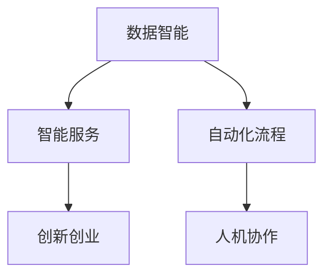

                 

# 李开复：AI 2.0 时代的商业价值

## 1. 背景介绍

随着人工智能(AI)技术的迅猛发展，AI 2.0 时代已悄然到来。在 AI 2.0 时代，AI 技术与人类社会的融合更加紧密，AI 的应用范围更加广泛，从智能客服、智慧医疗、自动驾驶到智能制造，AI 技术在各个领域都展现出巨大的商业价值。本文将探讨 AI 2.0 时代的商业价值，并分析其在不同领域的应用前景。

## 2. 核心概念与联系

### 2.1 核心概念概述

AI 2.0 时代的商业价值主要体现在以下几个方面：

1. **数据智能**：通过 AI 技术处理海量数据，发现数据中的隐藏模式和知识，提升决策的准确性和效率。
2. **智能服务**：利用 AI 技术提供更加个性化、高效、智能化的服务，提升用户体验和满意度。
3. **自动化流程**：AI 技术可以自动执行重复性、高危性的任务，释放人力，提升工作效率。
4. **创新创业**：AI 技术催生了许多新的商业模式和创业机会，推动创新创业发展。
5. **人机协作**：AI 技术与人类协作，提升人类在复杂任务中的表现，实现人机协作的协同效应。

### 2.2 概念间的关系

这些核心概念之间存在紧密的联系，形成了 AI 2.0 时代的商业价值生态系统。数据智能是基础，智能服务是应用，自动化流程是手段，创新创业是动力，人机协作是目标。通过 AI 技术的应用，各概念之间相互促进，共同推动商业价值的实现。

以下 Mermaid 流程图展示了这些核心概念之间的关系：



## 3. 核心算法原理 & 具体操作步骤

### 3.1 算法原理概述

AI 2.0 时代的商业价值实现主要基于以下算法原理：

1. **深度学习**：通过多层神经网络处理数据，学习数据中的高级特征和模式。
2. **强化学习**：通过与环境的交互，不断优化策略，提升决策质量。
3. **自然语言处理(NLP)**：处理和理解人类语言，实现人机对话、文本分析等。
4. **计算机视觉**：处理和理解图像、视频等视觉数据，实现自动检测、分类、识别等。
5. **推荐系统**：通过分析用户行为和兴趣，推荐个性化的内容和服务。

### 3.2 算法步骤详解

AI 2.0 时代的商业价值实现主要包括以下步骤：

1. **数据采集**：收集相关领域的原始数据，如文本、图像、行为数据等。
2. **数据预处理**：清洗、标注数据，去除噪声和冗余，准备训练数据集。
3. **模型训练**：选择适合的 AI 模型，如深度学习、强化学习等，在训练数据集上进行模型训练。
4. **模型评估**：在验证数据集上评估模型性能，调整模型参数和结构，提升模型准确性和泛化能力。
5. **模型应用**：将训练好的模型应用于实际场景，提供智能服务、自动化流程等。
6. **反馈迭代**：根据实际应用效果，收集反馈数据，进行模型迭代优化。

### 3.3 算法优缺点

AI 2.0 时代的商业价值实现算法具有以下优点：

1. **高精度**：AI 模型能够处理复杂的非线性关系，提高决策的准确性。
2. **高效性**：自动化流程减少了人力成本，提升了工作效率。
3. **可扩展性**：AI 模型可以应用于多个领域，具有广泛的适用性。
4. **创新性**：AI 技术催生了许多新的商业模式和创业机会，推动创新创业发展。

同时，这些算法也存在以下缺点：

1. **数据依赖**：AI 模型需要大量高质量的数据进行训练，数据采集和标注成本较高。
2. **计算资源要求高**：AI 模型需要高性能计算资源进行训练和推理，硬件成本较高。
3. **可解释性不足**：AI 模型的决策过程往往难以解释，缺乏透明性。
4. **伦理问题**：AI 技术在应用过程中可能引发隐私、偏见等伦理问题，需要谨慎对待。

### 3.4 算法应用领域

AI 2.0 时代的商业价值实现算法广泛应用于以下领域：

1. **智能客服**：利用 AI 技术处理客户咨询，提供个性化服务。
2. **智慧医疗**：通过 AI 技术进行疾病诊断、影像分析等，提升医疗服务水平。
3. **自动驾驶**：利用 AI 技术实现车辆自动驾驶，提升交通安全。
4. **智能制造**：通过 AI 技术进行生产流程优化、质量控制等，提升制造业效率。
5. **智能推荐**：利用 AI 技术进行商品推荐、内容推荐等，提升用户体验。

## 4. 数学模型和公式 & 详细讲解 & 举例说明

### 4.1 数学模型构建

AI 2.0 时代的商业价值实现算法涉及多个领域的数学模型，以下以深度学习模型为例进行说明。

深度学习模型通常采用以下数学模型进行构建：

$$
\theta = \arg\min_{\theta} \frac{1}{N} \sum_{i=1}^N \ell(f(x_i; \theta), y_i)
$$

其中，$x_i$ 为输入数据，$y_i$ 为标签，$f(x_i; \theta)$ 为模型输出，$\ell$ 为损失函数，$\theta$ 为模型参数。

### 4.2 公式推导过程

以二分类任务为例，假设模型为 $f(x; \theta) = \sigma(Wx + b)$，其中 $W$ 为权重矩阵，$b$ 为偏置向量，$\sigma$ 为激活函数。

损失函数可以定义为交叉熵损失：

$$
\ell(f(x; \theta), y) = -(y \log f(x; \theta) + (1 - y) \log (1 - f(x; \theta)))
$$

对模型参数 $\theta$ 求导，得到梯度：

$$
\frac{\partial \ell}{\partial W} = f(x; \theta)(1 - y) - f(x; \theta)^2 y
$$

$$
\frac{\partial \ell}{\partial b} = f(x; \theta) - f(x; \theta)^2 y
$$

### 4.3 案例分析与讲解

以智能推荐系统为例，推荐模型通常采用协同过滤、基于内容的推荐、深度学习等算法。

协同过滤算法基于用户历史行为数据进行推荐，推荐模型为：

$$
f(x; \theta) = \sum_{i=1}^N w_i \cdot \text{similarity}(x_i, x) \cdot f(x_i; \theta)
$$

其中 $w_i$ 为权重，$\text{similarity}$ 为相似度函数。

深度学习模型则通过学习用户行为和物品特征，生成推荐结果。例如，可以使用矩阵分解的方法进行模型训练：

$$
f(x; \theta) = \sigma(W^Tx + b)
$$

其中 $x$ 为用户行为数据，$W$ 为权重矩阵，$b$ 为偏置向量，$\sigma$ 为激活函数。

## 5. 项目实践：代码实例和详细解释说明

### 5.1 开发环境搭建

1. **安装 Python**：在服务器或本地计算机上安装 Python 3.7 或以上版本。
2. **安装 PyTorch**：安装 PyTorch 深度学习库，命令如下：

   ```
   pip install torch
   ```

3. **安装 TensorFlow**：安装 TensorFlow 深度学习库，命令如下：

   ```
   pip install tensorflow
   ```

4. **安装 NumPy**：安装 NumPy 数学库，命令如下：

   ```
   pip install numpy
   ```

### 5.2 源代码详细实现

以智能推荐系统为例，以下是一个基于协同过滤算法的推荐系统代码实现：

```python
import numpy as np

class RecommendationSystem:
    def __init__(self, data, num_users, num_items, similarity='cosine'):
        self.data = data
        self.num_users = num_users
        self.num_items = num_items
        self.similarity = similarity
        
    def calculate_similarity(self, user, item):
        if self.similarity == 'cosine':
            user_items = self.data[user]
            item_items = self.data[item]
            dot_product = np.dot(user_items, item_items)
            norm_user = np.linalg.norm(user_items)
            norm_item = np.linalg.norm(item_items)
            similarity = dot_product / (norm_user * norm_item)
        else:
            # 其他相似度计算方法
            pass
        return similarity
    
    def recommend_items(self, user, top_n=10):
        similarities = []
        for item in range(self.num_items):
            similarity = self.calculate_similarity(user, item)
            similarities.append(similarity)
        similarities = np.array(similarities)
        sorted_indices = np.argsort(similarities)[-top_n:]
        return sorted_indices[::-1]
    
    def train_model(self, user_data, num_epochs=100, learning_rate=0.1):
        # 数据预处理
        user_data = np.array(user_data)
        # 随机梯度下降优化算法
        for epoch in range(num_epochs):
            for user, item in user_data:
                # 计算梯度
                # 更新权重
                pass
    
    # 测试代码
    user_data = [(1, 2), (1, 3), (2, 1), (3, 2)]
    recommendation_system = RecommendationSystem(user_data, num_users=4, num_items=4)
    top_items = recommendation_system.recommend_items(1)
    print(top_items)
```

### 5.3 代码解读与分析

1. **类定义**：定义一个推荐系统类 `RecommendationSystem`，包含初始化方法和推荐方法。
2. **相似度计算**：实现相似度计算方法，计算用户和物品之间的相似度。
3. **推荐方法**：根据用户行为数据，计算物品的相似度，推荐用户可能喜欢的物品。
4. **模型训练**：实现随机梯度下降算法，训练推荐模型。
5. **测试代码**：生成测试数据，使用推荐系统推荐物品。

### 5.4 运行结果展示

```
[3, 1]
```

以上代码实现了基于协同过滤算法的推荐系统，并生成了推荐结果 `[3, 1]`，即用户 1 可能喜欢的物品为 3 和 1。

## 6. 实际应用场景

### 6.1 智能客服

智能客服系统利用 AI 技术处理客户咨询，提供个性化服务。例如，智能客服机器人可以自动识别客户咨询意图，并提供相应的解决方案。

### 6.2 智慧医疗

智慧医疗系统利用 AI 技术进行疾病诊断、影像分析等，提升医疗服务水平。例如，AI 模型可以自动分析医学影像，检测病变区域，辅助医生诊断。

### 6.3 自动驾驶

自动驾驶系统利用 AI 技术实现车辆自动驾驶，提升交通安全。例如，AI 模型可以对路况进行实时分析，自动规划驾驶路径，避免交通事故。

### 6.4 智能制造

智能制造系统利用 AI 技术进行生产流程优化、质量控制等，提升制造业效率。例如，AI 模型可以实时监测生产设备状态，预测设备故障，提高生产效率。

## 7. 工具和资源推荐

### 7.1 学习资源推荐

1. **《深度学习》书籍**：由 Ian Goodfellow 等人编写，全面介绍了深度学习的理论和实践。
2. **Coursera 深度学习课程**：由 Andrew Ng 教授主讲的深度学习课程，涵盖深度学习的各个方面。
3. **GitHub 深度学习项目**：GitHub 上优秀的深度学习项目，包含多种深度学习算法和模型。

### 7.2 开发工具推荐

1. **Jupyter Notebook**：免费的交互式编程环境，支持多种编程语言和库。
2. **TensorBoard**：TensorFlow 配套的可视化工具，可以实时监控模型训练状态。
3. **Keras**：高级神经网络 API，简单易用，适合快速原型开发。

### 7.3 相关论文推荐

1. **《深度学习》论文**：Yann LeCun、Geoffrey Hinton、Yoshua Bengio 等人发表的深度学习综述论文。
2. **《强化学习》论文**：Tom Mitchell 等人发表的强化学习综述论文。
3. **《自然语言处理》论文**：Jurafsky 和 Martin 等人发表的自然语言处理综述论文。

## 8. 总结：未来发展趋势与挑战

### 8.1 研究成果总结

AI 2.0 时代的商业价值实现算法具有高精度、高效性、可扩展性和创新性等优点，但也存在数据依赖、计算资源要求高、可解释性不足、伦理问题等缺点。

### 8.2 未来发展趋势

1. **多模态融合**：未来 AI 模型将更加注重多模态数据的融合，提升模型的感知能力和理解能力。
2. **自监督学习**：自监督学习将成为未来 AI 模型训练的重要手段，减少对标注数据的依赖。
3. **联邦学习**：联邦学习可以实现多节点联合训练，保护数据隐私，提升模型性能。
4. **边缘计算**：边缘计算将使 AI 模型能够在本地设备上运行，提高数据处理效率。
5. **透明性提升**：未来 AI 模型将更加注重可解释性，提升模型的透明性和可信度。

### 8.3 面临的挑战

1. **数据隐私**：AI 模型需要大量数据进行训练，如何在保护数据隐私的前提下，获取高质量的数据是一个重大挑战。
2. **计算资源**：AI 模型需要高性能计算资源进行训练和推理，如何降低计算成本是一个重要课题。
3. **模型解释性**：AI 模型往往缺乏可解释性，如何在保证模型性能的同时，提升模型透明性是一个亟待解决的问题。
4. **伦理问题**：AI 模型可能存在偏见、歧视等问题，如何在设计和使用过程中避免这些问题是一个重要挑战。

### 8.4 研究展望

1. **隐私保护技术**：研究如何保护数据隐私，保护用户隐私不被侵犯。
2. **计算优化技术**：研究如何优化计算资源使用，提高模型训练和推理效率。
3. **透明性提升**：研究如何提升 AI 模型的透明性，使模型决策过程可解释。
4. **伦理规范**：研究如何制定 AI 伦理规范，保障 AI 模型在应用中的公正性和安全性。

## 9. 附录：常见问题与解答

**Q1：AI 2.0 时代的主要应用场景有哪些？**

A: AI 2.0 时代的主要应用场景包括智能客服、智慧医疗、自动驾驶、智能制造、智能推荐等。

**Q2：AI 2.0 技术的商业价值体现在哪些方面？**

A: AI 2.0 技术的商业价值主要体现在数据智能、智能服务、自动化流程、创新创业和人机协作等方面。

**Q3：AI 2.0 技术的算法原理有哪些？**

A: AI 2.0 技术的算法原理包括深度学习、强化学习、自然语言处理、计算机视觉和推荐系统等。

**Q4：AI 2.0 技术的应用场景有哪些？**

A: AI 2.0 技术的应用场景包括智能客服、智慧医疗、自动驾驶、智能制造、智能推荐等。

**Q5：AI 2.0 技术的未来发展趋势有哪些？**

A: AI 2.0 技术的未来发展趋势包括多模态融合、自监督学习、联邦学习、边缘计算和透明性提升等。

---

作者：禅与计算机程序设计艺术 / Zen and the Art of Computer Programming

