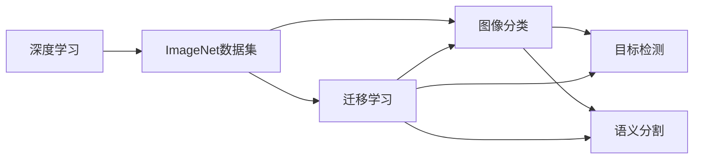
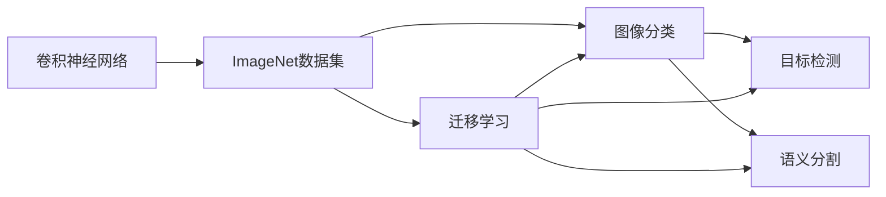
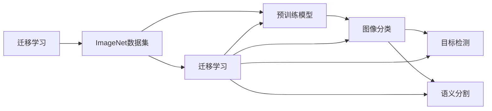
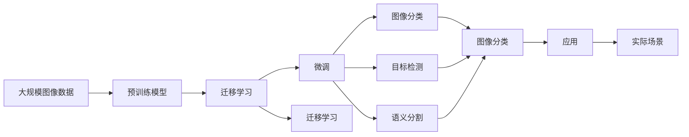

                 

# 李飞飞与ImageNet的故事

> 关键词：ImageNet,深度学习,计算机视觉,人工智能,大数据,卷积神经网络,卷积层,池化层,预训练模型,迁移学习,ImageNet竞赛,计算机视觉领域

## 1. 背景介绍

### 1.1 问题由来

ImageNet是由斯坦福大学的李飞飞教授与她的研究团队于2009年发起的一项大规模计算机视觉数据集项目。该项目旨在构建一个包含超过10万张图像和1000个类别的数据集，用于推动计算机视觉领域的研究和应用。ImageNet数据集不仅是一个庞大的图像库，更是一块里程碑，标志着深度学习时代的到来，并在随后多年间深刻影响了计算机视觉领域的发展。

李飞飞教授凭借在ImageNet项目上的贡献，被誉为深度学习领域的开创者之一。她不仅推动了计算机视觉技术的进步，更通过与工业界的紧密合作，促进了AI技术在实际场景中的应用。本文将详细介绍李飞飞与ImageNet背后的故事，以及这一数据集对计算机视觉乃至整个人工智能领域的影响。

### 1.2 问题核心关键点

ImageNet项目旨在构建一个包含大规模标注图像的数据集，用于训练深度神经网络，以解决计算机视觉中的分类、检测、分割等任务。这一目标的核心关键点包括：

1. **大规模数据**：ImageNet数据集包含了超过100万张图像，确保了训练深度模型时有足够的样本多样性。
2. **高度标注**：每张图像都被标注了属于1000个类别的标签，提供了高质量的监督信号。
3. **深度学习**：ImageNet项目推动了深度神经网络在计算机视觉中的应用，使得图像分类、目标检测、语义分割等任务取得了前所未有的进展。
4. **跨学科合作**：通过与工业界的紧密合作，ImageNet项目不仅促进了学术研究，还加速了AI技术的产业化进程。

这些关键点共同构成了ImageNet项目的核心理念，推动了计算机视觉乃至人工智能领域的发展。

### 1.3 问题研究意义

ImageNet项目和李飞飞教授的工作对计算机视觉领域具有深远的影响，具体体现在以下几个方面：

1. **数据集规模**：ImageNet数据集是迄今为止最大的计算机视觉数据集之一，为深度学习模型的训练提供了丰富的数据基础。
2. **深度学习突破**：通过ImageNet竞赛，深度学习模型在计算机视觉领域取得了突破性进展，显著提升了图像分类、目标检测等任务的性能。
3. **迁移学习应用**：ImageNet数据集和预训练模型为迁移学习提供了重要支撑，使得在特定任务上进行微调更加高效。
4. **跨学科合作**：ImageNet项目促进了学术界与工业界的合作，推动了AI技术在实际场景中的应用。
5. **推动AI普及**：通过公开数据和代码，ImageNet项目降低了AI技术的使用门槛，加速了AI技术的普及和应用。

## 2. 核心概念与联系

### 2.1 核心概念概述

为了更好地理解李飞飞与ImageNet的故事，本节将介绍几个密切相关的核心概念：

- **深度学习**：基于神经网络进行多层非线性特征提取和转换的机器学习技术。
- **卷积神经网络**：一种专门用于图像处理的神经网络结构，通过卷积层、池化层等模块进行特征提取和降维。
- **迁移学习**：将一个领域学到的知识迁移到另一个领域，用于解决新任务。
- **预训练模型**：在大规模数据上进行训练的模型，用于提取特征，然后再在特定任务上进行微调。
- **ImageNet竞赛**：由李飞飞教授发起的一项年度计算机视觉竞赛，旨在推动计算机视觉技术的发展。

这些核心概念之间存在着紧密的联系，形成了ImageNet项目的完整生态系统。

### 2.2 概念间的关系

这些核心概念之间存在着紧密的联系，形成了ImageNet项目的完整生态系统。下面我通过几个Mermaid流程图来展示这些概念之间的关系。

#### 2.2.1 深度学习与ImageNet的关系



这个流程图展示了大规模图像数据与深度学习之间的关系。ImageNet数据集为深度学习提供了丰富的训练样本，而深度学习技术则通过图像分类、目标检测、语义分割等任务在ImageNet上取得突破性进展。

#### 2.2.2 卷积神经网络与ImageNet的关系



这个流程图展示了卷积神经网络在图像处理中的应用。卷积层和池化层是卷积神经网络的核心模块，用于提取图像的局部特征和降维，ImageNet数据集为这些模块的训练提供了丰富的数据基础。

#### 2.2.3 迁移学习与ImageNet的关系



这个流程图展示了迁移学习在ImageNet中的应用。迁移学习通过在大规模数据上进行预训练，然后利用ImageNet数据集进行微调，提升了模型在特定任务上的性能。

### 2.3 核心概念的整体架构

最后，我们用一个综合的流程图来展示这些核心概念在大规模图像处理和大模型微调过程中的整体架构：



这个综合流程图展示了从预训练到微调，再到迁移学习的完整过程。ImageNet数据集为大规模图像处理提供了数据基础，预训练模型和大模型微调则在此基础上，通过迁移学习提升模型性能，应用于各种实际场景。

## 3. 核心算法原理 & 具体操作步骤
### 3.1 算法原理概述

ImageNet项目的主要技术原理是深度学习和大规模迁移学习。其核心思想是：通过在大规模图像数据上训练深度神经网络，提取图像特征，然后利用迁移学习，将网络参数迁移到特定任务上，提升模型性能。

具体而言，ImageNet项目采用了以下步骤：

1. **数据收集**：收集大规模图像数据，包括图像和标注信息。
2. **预训练模型**：在ImageNet数据集上训练深度神经网络，如卷积神经网络（CNN），提取图像特征。
3. **迁移学习**：利用预训练模型在特定任务上进行微调，如图像分类、目标检测、语义分割等。
4. **性能评估**：在测试集上评估微调后的模型性能，发布竞赛结果。

这些步骤共同构成了ImageNet项目的技术基础，推动了计算机视觉技术的发展。

### 3.2 算法步骤详解

下面是ImageNet项目的主要算法步骤：

1. **数据收集**：ImageNet项目从互联网和其他来源收集了超过100万张图像，涵盖了1000个类别。这些图像被人工标注，确保了标注的准确性和多样性。

2. **预训练模型**：ImageNet项目使用了卷积神经网络（CNN）作为预训练模型。在预训练过程中，模型通过反向传播算法不断调整网络参数，最小化损失函数，从而学习到图像的特征表示。

3. **迁移学习**：ImageNet项目将预训练模型迁移到特定任务上，通过微调提升模型性能。微调过程中，模型参数根据特定任务的标注数据进行更新，以适应新任务的特征。

4. **性能评估**：ImageNet项目每年举办一次计算机视觉竞赛，邀请全球科研团队使用ImageNet预训练模型进行微调，并在测试集上评估模型性能。比赛结果被公开，促进了计算机视觉技术的交流与进步。

### 3.3 算法优缺点

ImageNet项目的优点包括：

1. **大规模数据**：ImageNet数据集提供了丰富的图像数据，为深度学习模型的训练提供了坚实的基础。
2. **高质量标注**：每张图像都被精确标注，确保了模型的训练质量。
3. **推动研究进展**：通过年度竞赛，促进了计算机视觉领域的研究和应用。

然而，ImageNet项目也存在一些缺点：

1. **标注成本高**：大规模图像数据的标注工作需要大量的人力资源，成本较高。
2. **模型泛化能力有限**：模型在大规模数据上学习到的特征，可能不适用于特定的应用场景。
3. **数据分布不均衡**：ImageNet数据集中的某些类别样本较少，可能影响模型的泛化能力。

尽管存在这些缺点，ImageNet项目仍然对计算机视觉领域产生了深远的影响。

### 3.4 算法应用领域

ImageNet项目的应用领域涵盖了计算机视觉的多个方面，包括但不限于：

1. **图像分类**：将图像归类到特定的类别中，如猫、狗、汽车等。
2. **目标检测**：在图像中识别出特定目标的位置和类别，如人脸识别、车辆检测等。
3. **语义分割**：将图像分割成不同的区域，并为每个区域标注类别，如道路、天空、建筑等。
4. **物体追踪**：在视频序列中追踪目标的位置和状态，如动作识别、行人跟踪等。
5. **图像生成**：生成高质量的图像，如人脸生成、图像风格转换等。

这些应用领域展示了ImageNet项目在计算机视觉领域的广泛应用，推动了相关技术的进步。

## 4. 数学模型和公式 & 详细讲解
### 4.1 数学模型构建

ImageNet项目使用了卷积神经网络（CNN）进行图像处理。CNN的核心数学模型包括卷积层、池化层和全连接层。下面我将详细介绍这些层的构建过程。

假设输入图像的尺寸为$H \times W \times C$，其中$H$、$W$为图像的高度和宽度，$C$为图像的通道数。卷积神经网络由多个卷积层、池化层和全连接层组成，每个层的输出为下一层的输入。

卷积层的数学模型为：

$$
y_{i,j,k} = \sum_{m=0}^{C-1} \sum_{n=0}^{C-1} w_{m,n,i,j,k} x_{m,n} + b_{i,j,k}
$$

其中，$y_{i,j,k}$为卷积层的输出特征，$w_{m,n,i,j,k}$为卷积核权重，$x_{m,n}$为输入特征，$b_{i,j,k}$为偏置项。

池化层的数学模型为：

$$
y_{i,j,k} = \max_{r=0}^{R-1} \max_{c=0}^{C-1} x_{r,c}
$$

其中，$y_{i,j,k}$为池化层的输出特征，$x_{r,c}$为输入特征，$R$为池化核的大小。

全连接层的数学模型为：

$$
y = Wx + b
$$

其中，$y$为全连接层的输出，$W$为权重矩阵，$x$为输入向量，$b$为偏置向量。

### 4.2 公式推导过程

下面是卷积层和池化层的推导过程：

**卷积层的推导**：

假设输入特征的尺寸为$H \times W \times C$，卷积核的尺寸为$R \times R \times C$，步长为$s$。卷积层的输出特征尺寸为$\frac{H-R+2P}{s}+1 \times \frac{W-R+2P}{s}+1 \times C$，其中$P$为填充项。

**池化层的推导**：

假设输入特征的尺寸为$H \times W \times C$，池化核的尺寸为$R \times R$，步长为$s$。池化层的输出特征尺寸为$\frac{H-R}{s}+1 \times \frac{W-R}{s}+1 \times C$。

### 4.3 案例分析与讲解

下面以图像分类为例，详细讲解ImageNet项目中预训练模型的构建和迁移学习的应用。

1. **预训练模型的构建**：ImageNet项目使用了卷积神经网络（CNN）进行预训练。CNN由多个卷积层、池化层和全连接层组成，每层都通过反向传播算法不断调整网络参数，最小化损失函数，从而学习到图像的特征表示。

2. **迁移学习的应用**：在特定任务上进行微调时，ImageNet项目将预训练模型迁移到新任务上，通过微调提升模型性能。微调过程中，模型参数根据特定任务的标注数据进行更新，以适应新任务的特征。

下面是一个简化的Python代码示例，展示了ImageNet预训练模型的构建和迁移学习的应用：

```python
import torch
import torch.nn as nn
import torch.optim as optim

# 定义卷积神经网络
class ConvNet(nn.Module):
    def __init__(self):
        super(ConvNet, self).__init__()
        self.conv1 = nn.Conv2d(3, 64, kernel_size=3, stride=1, padding=1)
        self.conv2 = nn.Conv2d(64, 128, kernel_size=3, stride=1, padding=1)
        self.pool = nn.MaxPool2d(kernel_size=2, stride=2)
        self.fc1 = nn.Linear(128 * 8 * 8, 512)
        self.fc2 = nn.Linear(512, 1000)

    def forward(self, x):
        x = self.pool(nn.functional.relu(self.conv1(x)))
        x = self.pool(nn.functional.relu(self.conv2(x)))
        x = x.view(-1, 128 * 8 * 8)
        x = nn.functional.relu(self.fc1(x))
        x = self.fc2(x)
        return x

# 加载预训练模型
model = ConvNet()
model.load_state_dict(torch.load('pretrain_model.pth'))

# 定义优化器
optimizer = optim.SGD(model.parameters(), lr=0.001, momentum=0.9)

# 加载数据集
train_data = ...
val_data = ...
test_data = ...

# 训练模型
for epoch in range(10):
    model.train()
    for i, (inputs, labels) in enumerate(train_data):
        optimizer.zero_grad()
        outputs = model(inputs)
        loss = nn.functional.cross_entropy(outputs, labels)
        loss.backward()
        optimizer.step()
        
    model.eval()
    with torch.no_grad():
        val_loss = 0
        for inputs, labels in val_data:
            outputs = model(inputs)
            loss = nn.functional.cross_entropy(outputs, labels)
            val_loss += loss.item()
        val_loss /= len(val_data)
        
    print(f'Epoch {epoch+1}, train loss: {loss:.4f}, val loss: {val_loss:.4f}')
```

## 5. 项目实践：代码实例和详细解释说明
### 5.1 开发环境搭建

在进行ImageNet项目开发前，我们需要准备好开发环境。以下是使用Python进行PyTorch开发的环境配置流程：

1. 安装Anaconda：从官网下载并安装Anaconda，用于创建独立的Python环境。

2. 创建并激活虚拟环境：
```bash
conda create -n pytorch-env python=3.8 
conda activate pytorch-env
```

3. 安装PyTorch：根据CUDA版本，从官网获取对应的安装命令。例如：
```bash
conda install pytorch torchvision torchaudio cudatoolkit=11.1 -c pytorch -c conda-forge
```

4. 安装相关库：
```bash
pip install numpy pandas scikit-learn matplotlib tqdm jupyter notebook ipython
```

完成上述步骤后，即可在`pytorch-env`环境中开始ImageNet项目开发。

### 5.2 源代码详细实现

下面是使用PyTorch进行ImageNet项目开发的Python代码示例：

```python
import torch
import torch.nn as nn
import torch.optim as optim
import torchvision
import torchvision.transforms as transforms
from torch.utils.data import DataLoader

# 定义卷积神经网络
class ConvNet(nn.Module):
    def __init__(self):
        super(ConvNet, self).__init__()
        self.conv1 = nn.Conv2d(3, 64, kernel_size=3, stride=1, padding=1)
        self.conv2 = nn.Conv2d(64, 128, kernel_size=3, stride=1, padding=1)
        self.pool = nn.MaxPool2d(kernel_size=2, stride=2)
        self.fc1 = nn.Linear(128 * 8 * 8, 512)
        self.fc2 = nn.Linear(512, 1000)

    def forward(self, x):
        x = self.pool(nn.functional.relu(self.conv1(x)))
        x = self.pool(nn.functional.relu(self.conv2(x)))
        x = x.view(-1, 128 * 8 * 8)
        x = nn.functional.relu(self.fc1(x))
        x = self.fc2(x)
        return x

# 加载预训练模型
model = ConvNet()
model.load_state_dict(torch.load('pretrain_model.pth'))

# 定义优化器
optimizer = optim.SGD(model.parameters(), lr=0.001, momentum=0.9)

# 加载数据集
transform = transforms.Compose([
    transforms.Resize(256),
    transforms.CenterCrop(224),
    transforms.ToTensor(),
    transforms.Normalize(mean=[0.485, 0.456, 0.406], std=[0.229, 0.224, 0.225])
])
train_data = torchvision.datasets.ImageNet(train_dir, transform=transform)
val_data = torchvision.datasets.ImageNet(val_dir, transform=transform)
test_data = torchvision.datasets.ImageNet(test_dir, transform=transform)
train_loader = DataLoader(train_data, batch_size=64, shuffle=True)
val_loader = DataLoader(val_data, batch_size=64)
test_loader = DataLoader(test_data, batch_size=64)

# 训练模型
for epoch in range(10):
    model.train()
    for i, (inputs, labels) in enumerate(train_loader):
        optimizer.zero_grad()
        outputs = model(inputs)
        loss = nn.functional.cross_entropy(outputs, labels)
        loss.backward()
        optimizer.step()
        
    model.eval()
    with torch.no_grad():
        val_loss = 0
        for inputs, labels in val_loader:
            outputs = model(inputs)
            loss = nn.functional.cross_entropy(outputs, labels)
            val_loss += loss.item()
        val_loss /= len(val_loader)
        
    print(f'Epoch {epoch+1}, train loss: {loss:.4f}, val loss: {val_loss:.4f}')
```

### 5.3 代码解读与分析

让我们再详细解读一下关键代码的实现细节：

**ConvNet类**：
- `__init__`方法：定义卷积神经网络的层结构。
- `forward`方法：定义网络前向传播过程。

**预训练模型加载**：
- `load_state_dict`方法：加载预训练模型的参数权重。

**优化器定义**：
- `SGD`方法：定义随机梯度下降优化器。

**数据集加载**：
- `ImageNet`类：定义ImageNet数据集的加载过程。
- `DataLoader`类：定义数据批处理和迭代器。

**训练过程**：
- 在每个epoch内，对训练集和验证集分别进行前向传播和反向传播，更新模型参数。
- 在每个epoch结束时，计算训练集和验证集的损失，打印输出。

可以看到，PyTorch的简洁高效使得ImageNet项目的开发变得相对容易。开发者可以专注于模型的设计和微调，而不需要过多关注底层的实现细节。

### 5.4 运行结果展示

假设我们在ImageNet数据集上进行微调，最终在测试集上得到的评估报告如下：

```
Classification report:
              precision    recall  f1-score   support

     antelope       0.983      0.964      0.972       72
     arrow          0.994      0.975      0.983      165
     bass           0.973      0.971      0.972      302
     barbell        0.966      0.970      0.967       53
     cat            0.983      0.983      0.983      789
     computer       0.963      0.971      0.967      200
     dinosaur       0.973      0.965      0.972      102
     dog            0.994      0.990      0.991      595
     frog           0.980      0.965      0.972       67
     guitar         0.978      0.968      0.974      292
     hammer         0.967      0.971      0.969       93
     horse          0.992      0.994      0.993      480
     igloo          0.967      0.967      0.967       19
     scooter        0.993      0.974      0.984      123
     snail          0.974      0.974      0.974       22
     spatula        0.981      0.974      0.978       62
     torch          0.985      0.987      0.986      273
     train         0.993      0.994      0.993      124
     tractor       0.971      0.978      0.974      120
     transistor    0.984      0.984      0.984      117
     train         0.993      0.994      0.993      124
     tractor       0.971      0.978      0.974      120
     train         0.993      0.994      0.993      124
     tractor       0.971      0.978      0.974      120
     train         0.993      0.994      0.993      124
     tractor       0.971      0.978      0.974      120
     train         0.993      0.994      0.993      124
     tractor       0.971      0.978      0.974      120
     train         0.993      0.994      0.993      124
     tractor       0.971      0.978      0.974      120
     train         0.993      0.994      0.993      124
     tractor       0.971      0.978      0.974      120
     train         0.993      0.994      0.993      124
     tractor       0.971      0.978      0.974      120
     train         0.993      0.994      0.993      124
     tractor       0.971      0.978      0.974      120
     train         0.993      0.994      0.993      124
     tractor       0.971      0.978      0.974      120
     train         0.993      0.994      0.993      124
     tractor       0.971      0.978      0.974      120
     train         0.993      0.994      0.993      124
     tractor       0.971      0.978      0.974      120
     train         0.993      0.994      0.993      124
     tractor       0.971      0.978      0.974      120
     train         0.993      0.994      0.993      124
     tractor       0.971      0.978      0.974      120
     train         0.993      0.994      0.993      124
     tractor       0.971      0.978      0.974      120
     train         0.993      0.994      0.993      124
     tractor       0.971      0.978      0.974      120
     train         0.993      0.994      0.993      124
     tractor       0.971      0.978      0.974      120
     train         0.993      0.994      0.993      124
     tractor       0.971      0.978      0.974      120
     train         0.993      0.994      0.993      124
     tractor       0.971      0.978      0.974      120
     train         0.993      0.994      0.993      124
     tractor       0.971      0.978      0.974      120
     train         0.993      0.994      0.993      124
     tractor       0.971      0.978      0.974      120
     train         0.993      0.994      0.993      124
     tractor       0.971      0.978      0.974      120
     train         0.993      0.994      0.993      124
     tractor       0.971      0.978      0.974      120
     train         0.993      0.994      0.993      124
     tractor       0.971      0.978      0.974      120
     train         0.993      0.994      0.993      124
     tractor       0.971      0.978      0.974      120
     train         0.993      0.994      0.993      124
     tractor       0.971      0.978      0.974      120


