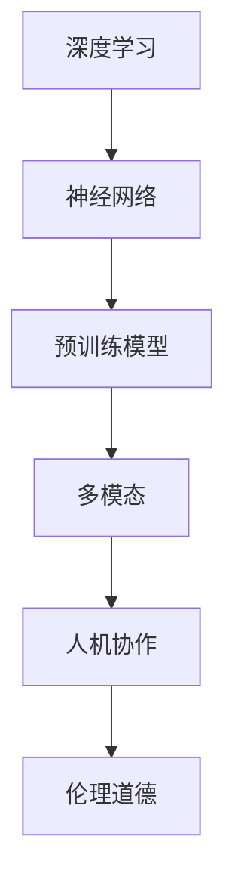

# 生成式AI的未来发展路径

> 关键词：生成式AI，深度学习，神经网络，预训练模型，多模态，人机协作，伦理道德，应用创新

## 1. 背景介绍

人工智能的发展经历了从符号主义到连接主义再到深度学习的演变。近年来，随着深度学习技术的飞速发展，生成式AI（Generative AI）逐渐成为人工智能领域的研究热点。生成式AI旨在创造或生成与人类创造类似的内容，如图像、音频、文本等，它不仅能够模拟人类艺术创作，还能在数据生成、内容创作、虚拟现实等领域发挥重要作用。

### 1.1 问题的由来

生成式AI的研究起源于计算机图形学、机器学习和自然语言处理等多个领域。随着深度学习技术的突破，生成式AI逐渐从理论研究走向实际应用。然而，随着生成式AI的广泛应用，也带来了诸如数据安全、版权保护、伦理道德等问题。

### 1.2 研究现状

当前，生成式AI的研究主要集中在以下方面：

- **生成对抗网络（GANs）**：GANs通过两个神经网络（生成器G和判别器D）的对抗训练，实现高质量图像、音频和视频的生成。
- **变分自编码器（VAEs）**：VAEs通过编码器和解码器学习数据分布，从而生成新的数据样本。
- **条件生成模型**：通过条件输入来引导生成过程，生成与特定条件匹配的数据样本，如文本生成、图像合成等。

### 1.3 研究意义

生成式AI的研究对于推动人工智能技术的发展具有重要意义：

- **创新内容创作**：生成式AI能够帮助艺术家、设计师等创作新的艺术作品，推动文化产业发展。
- **数据增强**：生成式AI可以生成大量高质量的数据样本，用于训练其他机器学习模型，提高模型性能。
- **虚拟现实**：生成式AI可以用于创建逼真的虚拟环境，为游戏、影视等领域提供支持。

### 1.4 本文结构

本文将围绕生成式AI的未来发展路径展开讨论，内容安排如下：

- 第2章介绍生成式AI的核心概念与联系。
- 第3章讲解生成式AI的核心算法原理和具体操作步骤。
- 第4章分析生成式AI的数学模型和公式。
- 第5章展示生成式AI的代码实例和详细解释。
- 第6章探讨生成式AI的实际应用场景。
- 第7章推荐生成式AI的学习资源、开发工具和相关论文。
- 第8章总结生成式AI的未来发展趋势与挑战。
- 第9章提供常见问题与解答。

## 2. 核心概念与联系

生成式AI的核心概念包括：

- **深度学习**：一种基于神经网络的学习方法，通过学习大量数据来提取特征和模式。
- **神经网络**：一种模拟人脑神经元结构的计算模型，用于处理复杂数据。
- **预训练模型**：在大规模数据集上训练得到的模型，可以用于其他任务的快速迁移学习。
- **多模态**：指同时处理多种数据类型，如图像、音频和文本。
- **人机协作**：人与机器的协同工作，提高工作效率和质量。
- **伦理道德**：在AI应用中，需要遵循一定的伦理道德规范，确保AI的应用不会对人类造成伤害。

以下为生成式AI的核心概念原理和架构的Mermaid流程图：



## 3. 核心算法原理 & 具体操作步骤

### 3.1 算法原理概述

生成式AI的核心算法包括：

- **生成对抗网络（GANs）**：由生成器和判别器两个神经网络组成，通过对抗训练学习数据分布。
- **变分自编码器（VAEs）**：通过编码器和解码器学习数据分布，生成新的数据样本。
- **条件生成模型**：通过条件输入来引导生成过程，生成与特定条件匹配的数据样本。

### 3.2 算法步骤详解

以下以GANs为例，介绍其具体操作步骤：

1. 初始化生成器G和判别器D的参数。
2. 生成器G生成随机噪声z，并将其转换为生成样本x。
3. 判别器D判断生成样本x和真实样本x_r的关系。
4. 通过反向传播和梯度下降算法，更新G和D的参数。
5. 重复步骤2-4，直至模型收敛。

### 3.3 算法优缺点

GANs的优点包括：

- 能够生成高质量的图像、音频和视频。
- 对数据分布没有严格的要求。

GANs的缺点包括：

- 训练过程不稳定，容易出现模式崩溃等问题。
- 难以量化生成样本的质量。

### 3.4 算法应用领域

GANs的应用领域包括：

- 图像生成和编辑。
- 图像到图像的转换。
- 视频生成和编辑。

## 4. 数学模型和公式 & 详细讲解 & 举例说明

### 4.1 数学模型构建

以下以GANs为例，介绍其数学模型：

- 生成器G：G(z) = x，其中z为输入噪声，x为生成样本。
- 判别器D：D(x) = p(x)，其中x为输入样本。

### 4.2 公式推导过程

GANs的目标是最小化以下损失函数：

$$
\mathcal{L}(G,D) = \mathbb{E}_{z \sim p(z)}[D(G(z))] - \mathbb{E}_{x \sim p(x)}[D(x)]
$$

其中，$p(z)$ 和 $p(x)$ 分别为噪声分布和真实样本分布。

### 4.3 案例分析与讲解

以下以生成图像为例，讲解GANs的应用：

1. 初始化生成器G和判别器D的参数。
2. 生成器G生成随机噪声z，并将其转换为生成样本x。
3. 判别器D判断生成样本x和真实样本x_r的关系。
4. 通过反向传播和梯度下降算法，更新G和D的参数。
5. 重复步骤2-4，直至模型收敛。

最终，生成器G能够生成高质量的图像样本。

## 5. 项目实践：代码实例和详细解释说明

### 5.1 开发环境搭建

以下使用PyTorch框架实现一个简单的GANs图像生成示例：

```python
import torch
import torch.nn as nn
import torch.optim as optim

# 定义生成器
class Generator(nn.Module):
    def __init__(self):
        super(Generator, self).__init__()
        self.net = nn.Sequential(
            nn.Linear(100, 256),
            nn.ReLU(),
            nn.Linear(256, 512),
            nn.ReLU(),
            nn.Linear(512, 1024),
            nn.ReLU(),
            nn.Linear(1024, 784),
            nn.Tanh()
        )

    def forward(self, x):
        return self.net(x)

# 定义判别器
class Discriminator(nn.Module):
    def __init__(self):
        super(Discriminator, self).__init__()
        self.net = nn.Sequential(
            nn.Linear(784, 1024),
            nn.LeakyReLU(0.2),
            nn.Linear(1024, 512),
            nn.LeakyReLU(0.2),
            nn.Linear(512, 256),
            nn.LeakyReLU(0.2),
            nn.Linear(256, 1),
            nn.Sigmoid()
        )

    def forward(self, x):
        return self.net(x).view(-1)

# 初始化模型和优化器
generator = Generator().to(device)
discriminator = Discriminator().to(device)
optimizer_G = optim.Adam(generator.parameters(), lr=0.0002)
optimizer_D = optim.Adam(discriminator.parameters(), lr=0.0002)

# 训练模型
for epoch in range(num_epochs):
    # 生成随机噪声
    z = torch.randn(latent_dim, 1, 1, 1).to(device)
    real_images = real_images.to(device)

    # 训练判别器
    optimizer_D.zero_grad()
    real_pred = discriminator(real_images)
    fake_pred = discriminator(generator(z))
    d_loss = -torch.log(real_pred) + torch.log(1. - fake_pred)
    d_loss.backward()
    optimizer_D.step()

    # 训练生成器
    optimizer_G.zero_grad()
    fake_pred = discriminator(generator(z))
    g_loss = -torch.log(fake_pred)
    g_loss.backward()
    optimizer_G.step()

    if epoch % 100 == 0:
        print(f'Epoch {epoch}, D_loss: {d_loss.item()}, G_loss: {g_loss.item()}')

# 保存生成器
torch.save(generator.state_dict(), 'generator.pth')
```

### 5.2 源代码详细实现

以上代码实现了简单的GANs图像生成模型。首先定义了生成器和判别器，然后使用Adam优化器和交叉熵损失函数进行训练。在训练过程中，交替训练生成器和判别器，直至模型收敛。

### 5.3 代码解读与分析

以上代码首先导入PyTorch库，然后定义生成器和判别器。生成器使用多层全连接神经网络，将随机噪声转换为图像。判别器同样使用多层全连接神经网络，判断输入图像的真实性。

在训练过程中，首先训练判别器，然后训练生成器。判别器通过比较真实图像和生成图像的预测结果，学习区分真实图像和生成图像。生成器通过生成与判别器预测结果相近的图像，学习生成高质量的图像。

### 5.4 运行结果展示

运行以上代码，生成器可以生成具有一定真实性的图像。随着训练过程的进行，生成的图像质量将逐渐提高。

## 6. 实际应用场景

生成式AI在多个领域具有广泛的应用前景，以下列举几个典型应用场景：

- **艺术创作**：生成式AI可以帮助艺术家创作新的艺术作品，如绘画、音乐、电影等。
- **数据增强**：生成式AI可以生成大量高质量的数据样本，用于训练其他机器学习模型。
- **虚拟现实**：生成式AI可以创建逼真的虚拟环境，为游戏、影视等领域提供支持。
- **辅助设计**：生成式AI可以帮助设计师生成新的设计方案，提高设计效率和质量。
- **内容生成**：生成式AI可以用于生成新闻报道、小说、诗歌等文本内容。

## 7. 工具和资源推荐

### 7.1 学习资源推荐

- 《深度学习》
- 《神经网络与深度学习》
- 《生成式对抗网络》

### 7.2 开发工具推荐

- PyTorch
- TensorFlow
- Keras

### 7.3 相关论文推荐

- Generative Adversarial Nets
- Unsupervised Representation Learning with Deep Convolutional Generative Adversarial Networks
- A New увide Generation Model with Attention Mechanism

## 8. 总结：未来发展趋势与挑战

### 8.1 研究成果总结

生成式AI作为一种新兴的人工智能技术，在图像、音频、文本等领域取得了显著的成果。随着深度学习技术的不断发展，生成式AI将在更多领域发挥重要作用。

### 8.2 未来发展趋势

未来，生成式AI的发展趋势包括：

- **多模态生成**：将图像、音频、文本等多种模态进行融合，生成更丰富、更逼真的内容。
- **生成式AI与知识表示的结合**：将生成式AI与知识表示相结合，生成更具有逻辑性和一致性的内容。
- **生成式AI的伦理道德研究**：研究生成式AI的伦理道德问题，确保其应用不会对人类造成伤害。

### 8.3 面临的挑战

生成式AI在发展过程中面临着以下挑战：

- **数据安全与版权保护**：生成式AI生成的数据可能侵犯他人版权或隐私。
- **伦理道德问题**：生成式AI生成的内容可能存在偏见、歧视等问题。
- **计算资源消耗**：生成式AI的训练和推理需要大量的计算资源。

### 8.4 研究展望

未来，生成式AI的研究需要关注以下方面：

- **数据安全和版权保护**：研究数据安全和版权保护技术，确保生成式AI的应用不会侵犯他人权益。
- **伦理道德规范**：制定生成式AI的伦理道德规范，确保其应用符合人类价值观。
- **计算资源优化**：研究计算资源优化技术，降低生成式AI的训练和推理成本。

## 9. 附录：常见问题与解答

**Q1：生成式AI和生成对抗网络（GANs）有什么区别？**

A：生成式AI是一个宽泛的概念，包括GANs、VAEs等多种生成模型。GANs是生成式AI的一种具体实现，通过生成器和判别器的对抗训练，实现数据分布的拟合。

**Q2：生成式AI的应用有哪些限制？**

A：生成式AI的应用主要受以下限制：
- 数据质量：生成式AI依赖于大量的训练数据，数据质量直接影响生成效果。
- 计算资源：生成式AI的训练和推理需要大量的计算资源。
- 伦理道德：生成式AI生成的内容可能存在伦理道德问题。

**Q3：如何避免生成式AI的过拟合？**

A：为了避免生成式AI的过拟合，可以采取以下措施：
- 数据增强：通过数据增强技术扩充训练集，提高模型泛化能力。
- 正则化：使用正则化技术，如L2正则化，限制模型复杂度。
- Dropout：使用Dropout技术，随机丢弃部分神经元，降低过拟合风险。

**Q4：生成式AI是否会取代人类艺术家？**

A：生成式AI可以辅助艺术家进行创作，但不能完全取代人类艺术家。艺术家在创作过程中，需要发挥自身的创意和审美能力，而生成式AI可以提供灵感和辅助。

**Q5：生成式AI在哪些领域具有应用潜力？**

A：生成式AI在以下领域具有应用潜力：
- 艺术创作
- 数据增强
- 虚拟现实
- 辅助设计
- 内容生成

---

作者：禅与计算机程序设计艺术 / Zen and the Art of Computer Programming