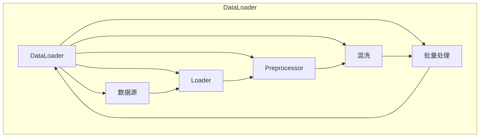

# 用DataLoader提供的数据进行训练

> 关键词：DataLoader，PyTorch，数据加载，批量处理，多线程，模型训练，效率优化

## 1. 背景介绍

在深度学习中，数据的加载和预处理是整个流程中不可或缺的一环。高效、稳定的数据加载机制对于模型的训练速度和最终性能有着至关重要的影响。PyTorch框架提供了一个强大的数据加载工具——DataLoader，它能够帮助我们实现批量加载数据、多线程处理、数据混洗等功能，从而显著提升模型训练的效率。本文将深入探讨DataLoader的工作原理，并提供实际应用案例，帮助读者更好地理解和利用这一工具。

## 2. 核心概念与联系

### 2.1 核心概念

- **DataLoader**：PyTorch中用于批量加载和预处理数据的一个类，它支持数据的混洗、多线程加载等功能。
- **批量处理（Batching）**：将数据分成小批次进行训练，以提高内存利用率和训练效率。
- **多线程处理**：利用多线程并行读取数据，加快数据加载速度。
- **数据混洗（Shuffling）**：随机打乱数据顺序，防止模型在训练过程中出现数据泄露。

### 2.2 Mermaid 流程图



### 2.3 节点解释

- **数据源（S）**：提供数据的源头，可以是本地文件、数据库或远程服务。
- **Loader（L）**：负责将数据从数据源中读取出来。
- **Preprocessor（P）**：对数据进行预处理，如归一化、标准化等。
- **混洗（M）**：随机打乱数据顺序，防止数据泄露。
- **批量处理（B）**：将数据分批次输出，为模型训练提供输入。

## 3. 核心算法原理 & 具体操作步骤

### 3.1 算法原理概述

DataLoader的核心原理是通过自定义的数据迭代器（`Dataset`子类）来封装数据加载和预处理的逻辑，然后利用PyTorch的多线程机制并行加载数据。

### 3.2 算法步骤详解

1. **创建Dataset类**：根据实际数据集的特点，继承`torch.utils.data.Dataset`类，实现`__init__`、`__len__`和`__getitem__`方法。
2. **数据加载**：使用`torch.utils.data.DataLoader`类创建迭代器，传入Dataset对象和相关参数。
3. **多线程处理**：DataLoader内部使用`torch.utils.data.dataloader.DataLoader`类，该类会自动使用多线程来加载数据。
4. **数据混洗**：通过`shuffle`参数控制是否在每次迭代前进行数据混洗。
5. **批量处理**：通过`batch_size`参数控制每个批次的数据量。

### 3.3 算法优缺点

#### 优点：

- **高效**：利用多线程并行加载数据，大大加快了数据加载速度。
- **灵活**：支持自定义数据预处理、混洗、批量处理等功能。
- **方便**：与PyTorch的其余组件无缝集成，易于使用。

#### 缺点：

- **复杂**：需要自定义Dataset类，对于复杂的数据集，编写代码可能较为繁琐。
- **内存占用**：批量处理会增加内存占用，对于大型数据集可能需要调整批大小。

### 3.4 算法应用领域

DataLoader在深度学习模型的训练中得到了广泛应用，包括但不限于以下领域：

- 图像识别
- 语音识别
- 自然语言处理
- 强化学习
- 其他需要大规模数据训练的任务

## 4. 数学模型和公式 & 详细讲解 & 举例说明

### 4.1 数学模型构建

DataLoader本身并不涉及复杂的数学模型，其核心是数据的加载和预处理。以下是一个简单的数据加载流程的数学模型：

$$
\text{DataLoader}(\text{Dataset}, \text{batch\_size}, \text{shuffle}) \rightarrow \text{Mini-batch} \rightarrow \text{Model} \rightarrow \text{Loss} \rightarrow \text{Optimization}
$$

### 4.2 公式推导过程

该公式描述了DataLoader在模型训练中的基本工作流程：

1. DataLoader加载Dataset中的数据。
2. 将数据分批次输出，形成Mini-batch。
3. Mini-batch作为模型的输入，模型进行前向传播和后向传播。
4. 计算损失函数，并利用优化器更新模型参数。

### 4.3 案例分析与讲解

以下是一个使用DataLoader进行图像分类任务的数据加载流程的例子：

```python
from torch.utils.data import DataLoader, Dataset
from torchvision import transforms
from PIL import Image
import os

class ImageDataset(Dataset):
    def __init__(self, root_dir, transform=None):
        self.root_dir = root_dir
        self.transform = transform
        self.image_paths = [os.path.join(root_dir, f) for f in os.listdir(root_dir)]

    def __len__(self):
        return len(self.image_paths)

    def __getitem__(self, idx):
        image_path = self.image_paths[idx]
        image = Image.open(image_path)
        if self.transform:
            image = self.transform(image)
        label = image_path.split('/')[-1].split('.')[0]
        label = int(label)
        return image, label

transform = transforms.Compose([
    transforms.Resize((256, 256)),
    transforms.ToTensor()
])

dataset = ImageDataset(root_dir='data/train', transform=transform)
dataloader = DataLoader(dataset, batch_size=32, shuffle=True)

for images, labels in dataloader:
    # 将images和labels传入模型进行训练
    pass
```

在这个例子中，我们首先定义了一个`ImageDataset`类，继承自`torch.utils.data.Dataset`。然后，我们对图像进行了预处理，包括调整大小和转换为张量。最后，我们使用`DataLoader`创建迭代器，并在训练循环中使用它来加载数据。

## 5. 项目实践：代码实例和详细解释说明

### 5.1 开发环境搭建

在进行DataLoader实践前，我们需要准备好开发环境。以下是使用PyTorch的开发环境配置流程：

1. 安装Anaconda：从官网下载并安装Anaconda，用于创建独立的Python环境。
2. 创建并激活虚拟环境：
```bash
conda create -n pytorch-env python=3.8
conda activate pytorch-env
```
3. 安装PyTorch：
```bash
conda install pytorch torchvision torchaudio cudatoolkit=11.1 -c pytorch -c conda-forge
```
4. 安装Pillow库：
```bash
pip install Pillow
```
完成上述步骤后，即可在`pytorch-env`环境中开始DataLoader实践。

### 5.2 源代码详细实现

下面是一个使用DataLoader进行图像分类任务的完整代码示例：

```python
import torch
from torch.utils.data import DataLoader, Dataset
from torchvision import transforms
from PIL import Image
import os

# 定义数据集类
class ImageDataset(Dataset):
    def __init__(self, root_dir, transform=None):
        self.root_dir = root_dir
        self.transform = transform
        self.image_paths = [os.path.join(root_dir, f) for f in os.listdir(root_dir)]

    def __len__(self):
        return len(self.image_paths)

    def __getitem__(self, idx):
        image_path = self.image_paths[idx]
        image = Image.open(image_path)
        if self.transform:
            image = self.transform(image)
        label = image_path.split('/')[-1].split('.')[0]
        label = int(label)
        return image, label

# 定义数据预处理
transform = transforms.Compose([
    transforms.Resize((256, 256)),
    transforms.ToTensor(),
    transforms.Normalize(mean=[0.485, 0.456, 0.406], std=[0.229, 0.224, 0.225])
])

# 创建数据集
dataset = ImageDataset(root_dir='data/train', transform=transform)

# 创建DataLoader
dataloader = DataLoader(dataset, batch_size=32, shuffle=True)

# 模拟模型训练
for images, labels in dataloader:
    # 将images和labels传入模型进行训练
    pass
```

### 5.3 代码解读与分析

- **ImageDataset类**：继承自`torch.utils.data.Dataset`，负责加载图像数据。
- **transform**：用于对图像进行预处理，包括调整大小、转换为张量和归一化。
- **dataset**：创建ImageDataset实例，传入图像数据目录和预处理函数。
- **dataloader**：创建DataLoader实例，传入dataset对象、批大小和是否混洗。
- **训练循环**：迭代dataloader，将批量数据传入模型进行训练。

### 5.4 运行结果展示

由于代码中没有具体的模型训练逻辑，这里不展示运行结果。但通过上述代码，我们可以清晰地看到如何使用DataLoader加载数据并进行模型训练。

## 6. 实际应用场景

DataLoader在深度学习模型的训练中得到了广泛应用，以下是一些典型的应用场景：

- **图像识别**：加载图像数据，进行图像分类、目标检测、图像分割等任务。
- **语音识别**：加载语音数据，进行语音识别、语音合成等任务。
- **自然语言处理**：加载文本数据，进行情感分析、机器翻译、问答系统等任务。
- **其他领域**：加载其他类型的数据，如时间序列数据、点云数据等。

## 7. 工具和资源推荐

### 7.1 学习资源推荐

- PyTorch官方文档：https://pytorch.org/docs/stable/index.html
- 《深度学习》书籍：Goodfellow、Bengio和Courville所著，介绍了深度学习的理论基础和常用算法。
- Hugging Face Transformers库：https://huggingface.co/transformers/
- PyTorch教程：https://pytorch.org/tutorials/

### 7.2 开发工具推荐

- PyCharm：一款功能强大的Python集成开发环境，支持PyTorch的开发。
- Jupyter Notebook：一款流行的交互式计算环境，可以方便地编写和运行Python代码。
- Colab：Google提供的免费在线Jupyter Notebook环境，支持GPU加速。

### 7.3 相关论文推荐

- "Batch Normalization: Accelerating Deep Network Training by Reducing Internal Covariate Shift"：介绍了批量归一化技术，可以显著提高模型训练速度。
- "Very Deep Convolutional Networks for Large-Scale Image Recognition"：介绍了VGG模型，是深度学习领域的经典模型之一。
- "Imagenet Classification with Deep Convolutional Neural Networks"：介绍了AlexNet模型，是深度学习领域的重要突破之一。

## 8. 总结：未来发展趋势与挑战

### 8.1 研究成果总结

DataLoader是PyTorch框架中一个强大的数据加载工具，它能够帮助我们实现批量加载数据、多线程处理、数据混洗等功能，从而显著提升模型训练的效率。通过本文的介绍，读者应该对DataLoader的工作原理、使用方法以及实际应用场景有了较为深入的了解。

### 8.2 未来发展趋势

随着深度学习技术的不断发展，DataLoader可能会在以下几个方面得到进一步的改进：

- **自动化数据预处理**：DataLoader可能会内置更多的数据预处理功能，如归一化、标准化、数据增强等，降低用户使用门槛。
- **支持更多数据源**：DataLoader可能会支持更多类型的数据源，如云存储、分布式存储等。
- **更高效的并行加载**：随着硬件技术的发展，DataLoader可能会实现更高效的并行加载机制，进一步加快数据加载速度。

### 8.3 面临的挑战

尽管DataLoader已经非常成熟，但它在实际应用中仍面临一些挑战：

- **内存占用**：批量处理会增加内存占用，对于大型数据集可能需要调整批大小。
- **数据泄露**：在进行数据混洗时，需要确保标签的一致性，防止数据泄露。
- **数据预处理**：对于复杂的数据集，可能需要自定义复杂的数据预处理逻辑。

### 8.4 研究展望

为了应对上述挑战，未来的研究可以从以下几个方面进行：

- **内存优化**：研究更高效的数据加载和预处理方法，降低内存占用。
- **数据一致性**：开发更可靠的数据混洗算法，确保标签的一致性。
- **自动化预处理**：开发自动化数据预处理工具，降低用户使用门槛。

总之，DataLoader是深度学习领域的重要工具之一，它在模型训练中发挥着重要作用。随着技术的不断发展，DataLoader将会变得更加高效、易用，为深度学习研究者和开发者提供更强大的支持。

## 9. 附录：常见问题与解答

**Q1：DataLoader如何支持多线程加载？**

A：DataLoader内部使用`torch.utils.data.dataloader.DataLoader`类，该类会使用`torch.multiprocessing`模块实现多线程加载。通过设置`num_workers`参数，可以控制线程的数量。

**Q2：如何避免DataLoader的数据泄露？**

A：在进行数据混洗时，需要确保标签的一致性。可以通过使用`torch.utils.data.Subset`类来创建数据子集，并进行混洗，然后再将子集合并到DataLoader中。

**Q3：如何调整DataLoader的批大小？**

A：可以通过设置`batch_size`参数来调整DataLoader的批大小。对于不同的任务和数据集，可能需要尝试不同的批大小，以找到最优的配置。

**Q4：DataLoader如何支持自定义数据预处理？**

A：可以通过自定义`torch.utils.data.Dataset`的`__getitem__`方法来实现自定义数据预处理。在`__getitem__`方法中，可以对数据进行任何形式的预处理。

**Q5：DataLoader是否支持多进程加载？**

A：是的，DataLoader支持多进程加载。可以通过设置`num_workers`参数为负值，来启用多进程加载。

作者：禅与计算机程序设计艺术 / Zen and the Art of Computer Programming