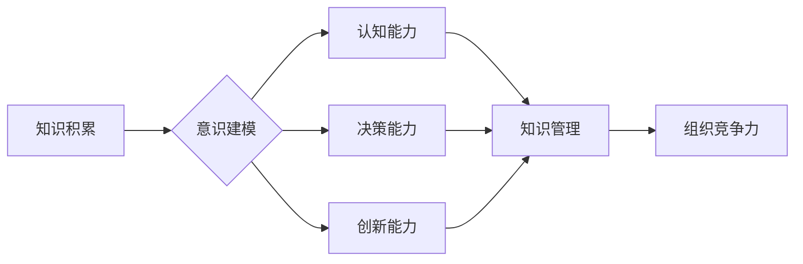

> 知识管理，意识模型，认知科学，机器学习，人工智能，知识图谱，知识表示，知识推理

# 知识积累在意识管理中的作用

在信息爆炸的现代社会，知识管理已成为企业和个人提升竞争力的关键。然而，知识的管理并非简单的信息存储，而是涉及对知识积累、组织、应用和创新的全面管理。本文将深入探讨知识积累在意识管理中的作用，分析其背后的原理、操作步骤，并展望未来发展趋势与挑战。

## 1. 背景介绍

### 1.1 问题的由来

随着全球化和数字化的加速发展，知识已成为企业核心竞争力的重要组成部分。然而，知识管理的复杂性使得知识积累和有效利用成为一大难题。如何有效地积累、组织、应用和创新知识，成为企业和个人亟待解决的问题。

### 1.2 研究现状

近年来，知识管理领域的研究取得了显著进展。研究者们从认知科学、机器学习、人工智能等多个学科视角，探索了知识积累的原理和方法。其中，意识管理作为一种新兴的领域，逐渐引起了广泛关注。

### 1.3 研究意义

研究知识积累在意识管理中的作用，有助于：

1. 提升企业创新能力。
2. 增强个人学习能力。
3. 促进知识共享和协作。
4. 推动知识管理体系建设。

### 1.4 本文结构

本文将从以下方面展开：

- 介绍知识积累和意识管理的基本概念。
- 分析意识管理中知识积累的原理和架构。
- 探讨知识积累在意识管理中的应用。
- 展望知识管理未来的发展趋势与挑战。

## 2. 核心概念与联系

### 2.1 知识管理

知识管理是指通过系统地识别、获取、处理、存储、共享、应用和创新知识，以提高组织和个人竞争力的过程。知识管理包括以下几个方面：

- 知识识别：识别组织内外部存在的各种知识资源。
- 知识获取：通过各种途径获取知识，如学习、研究、交流等。
- 知识处理：对获取到的知识进行筛选、整合、分类、存储等处理。
- 知识共享：通过各种方式将知识传递给他人，促进知识的传播和共享。
- 知识应用：将知识应用于实际工作中，创造价值。
- 知识创新：在知识应用的基础上，产生新的知识。

### 2.2 意识管理

意识管理是指通过构建和完善个体和组织的意识模型，提高其认知能力、决策能力和创新能力的过程。意识管理包括以下几个方面：

- 意识建模：构建个体和组织的意识模型，包括知识结构、认知风格、价值观等。
- 意识识别：识别个体和组织的意识特征，如认知能力、决策模式、价值观等。
- 意识优化：通过训练、学习、交流等方式提高个体和组织的意识水平。
- 意识应用：将意识模型应用于实际工作中，提高决策效率和创新能力。

### 2.3 知识积累与意识管理的联系

知识积累是意识管理的基础，为意识模型提供丰富的知识资源。以下是知识积累与意识管理的联系：

- 知识积累为意识建模提供素材。
- 知识积累丰富个体的知识结构，提高认知能力。
- 知识积累促进个体和组织的知识共享与协作。
- 知识积累推动意识优化和创新。

以下为知识积累与意识管理的Mermaid流程图：



## 3. 核心算法原理 & 具体操作步骤

### 3.1 算法原理概述

意识管理中的知识积累主要通过以下几种算法实现：

- 知识图谱：将知识表示为图结构，方便知识检索和推理。
- 知识表示：将知识表示为计算机可处理的形式，如自然语言处理、符号化表示等。
- 知识推理：根据已知知识推断未知知识，提高认知能力。

### 3.2 算法步骤详解

以下是知识积累在意识管理中的具体操作步骤：

1. **知识识别**：通过数据挖掘、文本挖掘等技术，识别组织内外部的知识资源。
2. **知识获取**：通过各种途径获取知识，如学习、研究、交流等。
3. **知识处理**：对获取到的知识进行清洗、整合、分类、存储等处理。
4. **知识表示**：将知识表示为计算机可处理的形式，如知识图谱、自然语言处理等。
5. **知识推理**：根据已知知识推断未知知识，提高认知能力。
6. **知识应用**：将知识应用于实际工作中，创造价值。
7. **知识创新**：在知识应用的基础上，产生新的知识。

### 3.3 算法优缺点

#### 优点：

- 提高认知能力：通过知识积累，个体和组织的知识结构更加完善，认知能力得到提升。
- 提高决策能力：基于丰富的知识资源，决策过程更加科学合理。
- 促进知识共享与协作：知识积累有助于知识的传播和共享，促进团队合作。

#### 缺点：

- 知识质量难以保证：获取到的知识可能存在错误、过时等问题。
- 知识更新速度慢：知识更新速度快，但知识积累过程可能滞后。
- 知识应用难度大：将知识应用于实际工作中，需要具备相应的技能和经验。

### 3.4 算法应用领域

知识积累在意识管理中的应用领域广泛，包括：

- 企业知识管理
- 个人知识管理
- 教育领域
- 咨询领域
- 医疗领域

## 4. 数学模型和公式 & 详细讲解 & 举例说明

### 4.1 数学模型构建

在知识积累过程中，常用的数学模型包括：

- 知识图谱：使用图论表示知识之间的关系。
- 知识表示：使用自然语言处理、符号化表示等方法表示知识。
- 知识推理：使用逻辑推理、概率推理等方法推理未知知识。

### 4.2 公式推导过程

以下以知识图谱为例，介绍数学模型的推导过程。

假设知识图谱中包含两个节点 $A$ 和 $B$，它们之间存在一种关系 $R$。则知识图谱的表示可以表示为：

$$
G = (V,E,R)
$$

其中，$V$ 是节点集合，$E$ 是边集合，$R$ 是关系集合。

### 4.3 案例分析与讲解

以下以企业知识管理为例，分析知识积累在意识管理中的应用。

假设某企业希望构建一个企业知识图谱，以方便员工检索和利用知识资源。企业可以使用以下步骤进行：

1. **知识识别**：通过问卷调查、访谈等方式，识别企业内部的知识资源。
2. **知识获取**：从内部文档、数据库、外部数据库等渠道获取知识。
3. **知识处理**：对获取到的知识进行清洗、整合、分类、存储等处理。
4. **知识表示**：使用知识图谱技术将知识表示为图结构。
5. **知识推理**：根据已知知识推断未知知识，丰富知识图谱。
6. **知识应用**：在企业内部构建知识检索系统，方便员工查询和利用知识资源。

## 5. 项目实践：代码实例和详细解释说明

### 5.1 开发环境搭建

以下是使用Python和Neo4j构建企业知识图谱的代码实例：

```python
from neo4j import GraphDatabase

class KnowledgeGraph:
    def __init__(self, uri, user, password):
        self.driver = GraphDatabase.driver(uri, auth=(user, password))

    def create_node(self, label, properties):
        with self.driver.session() as session:
            session.run("CREATE (n:" + label + " " + properties + ")")

    def create_relationship(self, node1, relationship, node2):
        with self.driver.session() as session:
            session.run("MATCH (n1:" + node1 + "), (n2:" + node2 + ") CREATE (n1)-[r:" + relationship + "]->(n2)")

    def close(self):
        self.driver.close()

# 创建知识图谱实例
kg = KnowledgeGraph("bolt://localhost:7687", "neo4j", "password")

# 创建节点
kg.create_node("Person", "name='Alice'")
kg.create_node("Person", "name='Bob'")

# 创建关系
kg.create_relationship("Alice", "Knows", "Bob")

# 关闭连接
kg.close()
```

### 5.2 源代码详细实现

以上代码实现了以下功能：

- 创建Neo4j数据库连接。
- 创建节点，并设置节点属性。
- 创建关系，连接两个节点。
- 关闭数据库连接。

### 5.3 代码解读与分析

以上代码演示了如何使用Python和Neo4j构建一个简单的企业知识图谱。首先创建Neo4j数据库连接，然后创建节点和关系，最后关闭连接。

### 5.4 运行结果展示

运行以上代码后，可以在Neo4j数据库中看到一个包含两个节点和一个关系的知识图谱。

## 6. 实际应用场景

### 6.1 企业知识管理

企业可以通过知识积累构建企业知识图谱，方便员工检索和利用知识资源，提高企业创新能力。

### 6.2 个人知识管理

个人可以通过知识积累构建个人知识图谱，提高个人认知能力和学习能力。

### 6.3 教育领域

教育领域可以通过知识积累构建学科知识图谱，帮助学生更好地理解和掌握知识。

### 6.4 咨询领域

咨询领域可以通过知识积累构建行业知识图谱，为客户提供更加专业的咨询服务。

### 6.5 医疗领域

医疗领域可以通过知识积累构建医学知识图谱，提高医生诊疗水平和患者就医体验。

## 7. 工具和资源推荐

### 7.1 学习资源推荐

- 《知识管理》
- 《认知科学》
- 《人工智能》
- 《知识图谱》

### 7.2 开发工具推荐

- Neo4j
- Python
- Neo4j Python Driver

### 7.3 相关论文推荐

- 《知识图谱》
- 《知识表示》
- 《知识推理》

## 8. 总结：未来发展趋势与挑战

### 8.1 研究成果总结

本文从知识管理和意识管理的角度，探讨了知识积累在意识管理中的作用。通过分析意识管理的原理和架构，阐述了知识积累在意识管理中的重要性。同时，介绍了知识积累的算法原理和操作步骤，并以企业知识管理为例，展示了知识积累在实际应用中的效果。

### 8.2 未来发展趋势

未来，知识积累在意识管理中将呈现以下发展趋势：

- 知识表示更加多样化：除了传统的文本、图像等，还将出现更多样化的知识表示形式，如视频、音频、三维模型等。
- 知识推理更加智能化：通过引入机器学习、人工智能等技术，实现更加智能的知识推理，提高认知能力。
- 知识应用更加广泛：知识积累将在更多领域得到应用，如医疗、教育、金融等。
- 知识共享更加便捷：随着网络技术的发展，知识共享将更加便捷，促进知识的传播和共享。

### 8.3 面临的挑战

知识积累在意识管理中面临的挑战主要包括：

- 知识获取困难：获取高质量的知识资源需要投入大量的人力、物力和财力。
- 知识表示困难：将知识表示为计算机可处理的形式需要专业的知识背景和技术能力。
- 知识应用困难：将知识应用于实际工作中需要具备相应的技能和经验。

### 8.4 研究展望

为了应对以上挑战，未来的研究可以从以下几个方面展开：

- 研究更加高效的知识获取方法。
- 开发更加智能的知识表示和推理技术。
- 探索知识应用的实用场景和最佳实践。
- 建立知识共享和协同创新的平台。

通过不断探索和创新，知识积累在意识管理中的作用将得到进一步发挥，为人类社会带来更多福祉。

## 9. 附录：常见问题与解答

**Q1：知识积累在意识管理中有什么作用？**

A：知识积累在意识管理中的作用主要体现在以下几个方面：

- 丰富知识结构，提高认知能力。
- 促进知识共享和协作。
- 推动意识优化和创新。
- 提升个人和组织的竞争力。

**Q2：知识积累需要哪些技术支持？**

A：知识积累需要以下技术支持：

- 知识获取技术：如数据挖掘、文本挖掘、网络爬虫等。
- 知识表示技术：如知识图谱、自然语言处理、符号化表示等。
- 知识推理技术：如逻辑推理、概率推理、机器学习等。

**Q3：知识积累在意识管理中存在哪些挑战？**

A：知识积累在意识管理中存在的挑战主要包括：

- 知识获取困难。
- 知识表示困难。
- 知识应用困难。

**Q4：如何克服知识积累在意识管理中的挑战？**

A：为了克服知识积累在意识管理中的挑战，可以从以下几个方面着手：

- 研究更加高效的知识获取方法。
- 开发更加智能的知识表示和推理技术。
- 探索知识应用的实用场景和最佳实践。
- 建立知识共享和协同创新的平台。

**Q5：知识积累在意识管理中有什么应用场景？**

A：知识积累在意识管理中的应用场景广泛，包括：

- 企业知识管理
- 个人知识管理
- 教育领域
- 咨询领域
- 医疗领域

作者：禅与计算机程序设计艺术 / Zen and the Art of Computer Programming