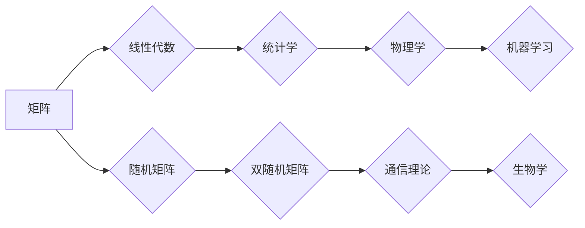

> 关键词：矩阵理论，随机矩阵，双随机矩阵，特征值，特征向量，线性代数，统计物理学，机器学习

# 矩阵理论与应用：随机矩阵与双随机矩阵

矩阵理论是现代数学和工程学中的一个基础分支，它在物理学、计算机科学、经济学和统计学等多个领域都有广泛应用。本文将深入探讨随机矩阵和双随机矩阵的概念、理论以及在实际应用中的重要性。

## 1. 背景介绍

### 1.1 矩阵理论的历史与发展

矩阵理论起源于19世纪，当时主要用于解决线性方程组的问题。随着时间的推移，矩阵理论逐渐发展成为一个独立的数学分支，并在20世纪初形成了完整的理论体系。矩阵理论的发展推动了其他数学领域的进步，如线性代数、概率论和统计学。

### 1.2 随机矩阵与双随机矩阵的提出

随机矩阵理论是矩阵理论的一个分支，它研究的是具有随机性质的矩阵。双随机矩阵是随机矩阵的一个子类，它具有两个独立同分布的随机元素。

### 1.3 研究意义

随机矩阵和双随机矩阵在许多领域都有重要的应用，包括：

- 统计物理学：用于研究粒子系统的热力学性质。
- 机器学习：用于理解高维数据的分布和特征。
- 通信理论：用于分析信道容量和编码理论。
- 生物学：用于研究基因表达数据和蛋白质相互作用。

## 2. 核心概念与联系

### 2.1 核心概念原理

- **矩阵**：一个矩阵是一个由数字组成的矩形数组，用于表示线性变换或数据集。
- **随机矩阵**：矩阵的元素是随机变量，其分布可以是均匀分布、高斯分布等。
- **双随机矩阵**：矩阵的行和列都是独立同分布的随机矩阵。

### 2.2 Mermaid 流程图



## 3. 核心算法原理 & 具体操作步骤

### 3.1 算法原理概述

随机矩阵和双随机矩阵的理论研究主要集中在以下几个方面：

- **特征值和特征向量的分布**：研究随机矩阵和双随机矩阵的特征值和特征向量的统计性质。
- **矩阵分解**：研究随机矩阵和双随机矩阵的奇异值分解和特征分解。
- **矩阵函数**：研究随机矩阵和双随机矩阵的矩阵函数的性质。

### 3.2 算法步骤详解

1. **特征值和特征向量分析**：通过计算随机矩阵和双随机矩阵的特征值和特征向量，分析其分布和性质。
2. **矩阵分解**：使用奇异值分解或特征分解来分析矩阵的结构和性质。
3. **矩阵函数**：研究矩阵函数的性质，如矩阵的对数、指数等。

### 3.3 算法优缺点

- **优点**：随机矩阵和双随机矩阵可以提供对高维数据分布的直观理解。
- **缺点**：计算复杂度高，对计算资源要求较高。

### 3.4 算法应用领域

- **统计学**：用于分析高维数据的分布和聚类。
- **机器学习**：用于特征选择和降维。
- **信号处理**：用于信号检测和噪声消除。

## 4. 数学模型和公式 & 详细讲解 & 举例说明

### 4.1 数学模型构建

随机矩阵和双随机矩阵的数学模型通常基于概率论和随机过程的理论。

### 4.2 公式推导过程

- **特征值分布**：对于单位矩阵 $I$，其特征值都是1，因此特征值分布为 $\delta_1$。
- **特征向量**：对于随机矩阵 $A$，其特征向量可以通过随机变量 $X$ 和 $Y$ 的联合分布来描述。

### 4.3 案例分析与讲解

假设我们有一个 $2 \times 2$ 的随机矩阵 $A = \begin{pmatrix} X & Y \\ Y & X \end{pmatrix}$，其中 $X$ 和 $Y$ 是独立同分布的随机变量。

我们可以计算该矩阵的特征值和特征向量：

$$
\text{特征方程} \quad \det(A - \lambda I) = 0
$$

解得特征值为 $\lambda_1 = X + Y$ 和 $\lambda_2 = X - Y$。

特征向量可以通过求解线性方程组得到：

$$
(A - \lambda_1 I) v_1 = 0 \quad \text{和} \quad (A - \lambda_2 I) v_2 = 0
$$

解得特征向量 $v_1 = \begin{pmatrix} 1 \\ 1 \end{pmatrix}$ 和 $v_2 = \begin{pmatrix} 1 \\ -1 \end{pmatrix}$。

## 5. 项目实践：代码实例和详细解释说明

### 5.1 开发环境搭建

为了进行随机矩阵和双随机矩阵的实践，我们需要一个Python环境，并安装NumPy和SciPy库。

### 5.2 源代码详细实现

```python
import numpy as np

# 创建一个2x2的随机矩阵
A = np.random.rand(2, 2)

# 计算特征值和特征向量
eigenvalues, eigenvectors = np.linalg.eig(A)

# 输出结果
print("特征值：", eigenvalues)
print("特征向量：", eigenvectors)
```

### 5.3 代码解读与分析

上面的代码首先导入了NumPy库，并创建了一个2x2的随机矩阵 $A$。然后使用NumPy的 `eig` 函数计算了矩阵 $A$ 的特征值和特征向量。最后，代码输出了特征值和特征向量的结果。

### 5.4 运行结果展示

运行上述代码将输出一个2x2随机矩阵的特征值和特征向量。由于矩阵是随机生成的，每次运行的结果都可能不同。

## 6. 实际应用场景

### 6.1 统计物理学

在统计物理学中，随机矩阵用于描述粒子系统的热力学性质，如相变和临界现象。

### 6.2 机器学习

在机器学习中，随机矩阵和双随机矩阵用于特征选择和降维，如主成分分析(PCA)。

### 6.3 通信理论

在通信理论中，随机矩阵用于分析信道容量和编码理论。

### 6.4 未来应用展望

随着计算能力的提升和算法的改进，随机矩阵和双随机矩阵将在更多领域得到应用，如生物学、材料科学和金融学。

## 7. 工具和资源推荐

### 7.1 学习资源推荐

- 《随机矩阵理论及其应用》
- 《矩阵理论》
- 《概率论与数理统计》

### 7.2 开发工具推荐

- NumPy
- SciPy
- MATLAB

### 7.3 相关论文推荐

- "Random Matrices and Their Applications"
- "The Analysis of Large Dimensional Random Matrices"
- "Random Matrices: Theory and Applications"

## 8. 总结：未来发展趋势与挑战

### 8.1 研究成果总结

随机矩阵和双随机矩阵理论在物理学、统计学和机器学习等领域取得了显著的成果。

### 8.2 未来发展趋势

未来，随机矩阵和双随机矩阵理论将继续在以下方向得到发展：

- 算法效率的提升
- 新的应用领域的探索
- 与其他数学领域的交叉融合

### 8.3 面临的挑战

随机矩阵和双随机矩阵理论研究面临的挑战包括：

- 计算复杂度
- 理论与实际应用的结合
- 新模型的构建

### 8.4 研究展望

随着随机矩阵和双随机矩阵理论的不断发展，我们有理由相信，这一理论将在未来的人工智能和科学研究领域发挥更加重要的作用。

## 9. 附录：常见问题与解答

**Q1：什么是随机矩阵？**

A：随机矩阵是一个矩阵，其元素是随机变量，可以是均匀分布、高斯分布等。

**Q2：随机矩阵有什么应用？**

A：随机矩阵在统计学、物理学、机器学习等领域都有广泛的应用。

**Q3：什么是双随机矩阵？**

A：双随机矩阵是一个矩阵，其行和列都是独立同分布的随机矩阵。

**Q4：随机矩阵和双随机矩阵有什么区别？**

A：随机矩阵的元素是随机变量，而双随机矩阵的行和列都是随机矩阵。

**Q5：如何计算随机矩阵的特征值和特征向量？**

A：可以使用NumPy库中的 `eig` 函数来计算随机矩阵的特征值和特征向量。

---

作者：禅与计算机程序设计艺术 / Zen and the Art of Computer Programming