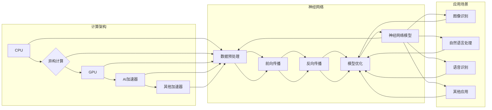

# 神经网络计算架构的崛起

> 关键词：神经网络，计算架构，GPU，深度学习，异构计算，张量计算，高性能计算，AI加速器

## 1. 背景介绍
### 1.1 神经网络的发展历程
神经网络作为一种模拟人脑工作原理的计算模型，自20世纪50年代被提出以来，经历了多次兴衰。特别是在近年来，随着深度学习技术的兴起，神经网络在图像识别、自然语言处理、语音识别等领域的应用取得了突破性进展。这一现象的背后，离不开计算架构的支撑。

### 1.2 计算架构的演变
从早期的CPU到GPU，再到如今的AI加速器，计算架构的演进为神经网络的发展提供了强大的算力支持。本文将探讨神经网络计算架构的崛起，分析其原理、技术特点以及应用场景。

### 1.3 研究意义
深入理解神经网络计算架构，有助于我们更好地设计、开发和优化神经网络模型，推动人工智能技术的进一步发展。同时，对于构建高性能计算平台，提升计算效率具有重要意义。

## 2. 核心概念与联系
### 2.1 神经网络计算架构的Mermaid流程图



### 2.2 核心概念
- **CPU（中央处理器）**：传统的通用计算处理器，适用于通用计算任务。
- **GPU（图形处理单元）**：具备强大并行计算能力的处理器，适用于大规模并行计算任务，如神经网络训练。
- **AI加速器**：专门为人工智能应用设计的处理器，如TPU、FPGA等，具备更高的计算效率。
- **神经网络模型**：模拟人脑神经元连接方式的计算模型，包括前向传播、反向传播等计算过程。
- **数据预处理**：对原始数据进行处理，使其适合神经网络模型输入。
- **前向传播**：将输入数据传递至神经网络模型，计算中间层的输出。
- **反向传播**：根据预测误差，反向传播梯度，更新网络权重。
- **模型优化**：根据损失函数，优化模型参数，提升模型性能。
- **应用场景**：神经网络模型在各个领域的应用，如图像识别、自然语言处理、语音识别等。

## 3. 核心算法原理 & 具体操作步骤
### 3.1 算法原理概述
神经网络计算架构的核心在于利用并行计算技术，加速神经网络模型的前向传播和反向传播过程。具体而言，主要包括以下步骤：

1. **数据预处理**：对原始数据进行标准化、归一化等操作，使其符合神经网络模型输入要求。
2. **前向传播**：将预处理后的数据输入神经网络模型，计算中间层的输出。
3. **反向传播**：根据预测误差，反向传播梯度，更新网络权重。
4. **模型优化**：根据损失函数，优化模型参数，提升模型性能。

### 3.2 算法步骤详解
- **数据预处理**：包括数据清洗、数据增强、数据归一化等步骤，旨在提高数据质量和模型训练效果。
- **前向传播**：通过多层神经网络进行计算，逐层传递数据，最终得到输出结果。
- **反向传播**：利用反向传播算法，根据预测误差计算梯度，并反向更新网络权重。
- **模型优化**：根据损失函数，利用梯度下降、Adam等优化算法，调整模型参数。

### 3.3 算法优缺点
- **优点**：并行计算能力强，能够有效提高神经网络模型的训练速度。
- **缺点**：对硬件资源要求较高，成本较高。

### 3.4 算法应用领域
神经网络计算架构广泛应用于各个领域，如：

- **图像识别**：人脸识别、物体检测、图像分类等。
- **自然语言处理**：机器翻译、文本分类、情感分析等。
- **语音识别**：语音合成、语音识别、语音翻译等。
- **其他领域**：自动驾驶、机器人控制、金融风控等。

## 4. 数学模型和公式 & 详细讲解 & 举例说明
### 4.1 数学模型构建
神经网络计算架构的核心在于神经网络模型。以下是神经网络模型的数学模型：

$$
y = f(W \cdot x + b)
$$

其中，$y$ 为输出，$W$ 为权重，$x$ 为输入，$b$ 为偏置，$f$ 为激活函数。

### 4.2 公式推导过程
以下以全连接神经网络为例，介绍神经网络模型的公式推导过程。

1. **前向传播**：

$$
z_1 = W_1 \cdot x_1 + b_1
$$

$$
a_1 = f(z_1)
$$

$$
z_2 = W_2 \cdot a_1 + b_2
$$

$$
a_2 = f(z_2)
$$

...

$$
z_L = W_L \cdot a_{L-1} + b_L
$$

$$
a_L = f(z_L)
$$

2. **反向传播**：

$$
\delta_L = \frac{\partial J}{\partial z_L}
$$

...

$$
\delta_{L-1} = \frac{\partial J}{\partial z_{L-1}} = \frac{\partial J}{\partial z_{L-1}} \cdot \frac{\partial z_{L-1}}{\partial W_{L-1}} \cdot \frac{\partial W_{L-1}}{\partial z_{L-1}}
$$

...

$$
\delta_1 = \frac{\partial J}{\partial z_1} = \frac{\partial J}{\partial z_1} \cdot \frac{\partial z_1}{\partial W_1} \cdot \frac{\partial W_1}{\partial z_1}
$$

3. **权重更新**：

$$
W_1 := W_1 - \alpha \cdot \delta_1 \cdot x_1
$$

...

$$
W_L := W_L - \alpha \cdot \delta_L \cdot a_{L-1}
$$

其中，$J$ 为损失函数，$\alpha$ 为学习率。

### 4.3 案例分析与讲解
以下以卷积神经网络（CNN）为例，介绍神经网络计算架构在实际应用中的案例。

1. **数据预处理**：对图像数据进行分析，提取特征，如颜色、纹理、形状等。
2. **前向传播**：将预处理后的图像数据输入CNN模型，经过卷积、池化等操作，提取图像特征，最终得到分类结果。
3. **反向传播**：根据预测误差，反向传播梯度，更新模型参数。
4. **模型优化**：根据损失函数，优化模型参数，提升模型性能。

## 5. 项目实践：代码实例和详细解释说明
### 5.1 开发环境搭建
以下是使用PyTorch框架进行神经网络计算架构项目实践的步骤：

1. 安装PyTorch：从PyTorch官网下载并安装相应版本的PyTorch。
2. 安装依赖库：安装NumPy、PIL等依赖库。
3. 创建项目文件夹：创建项目文件夹，存放代码和模型。

### 5.2 源代码详细实现
以下是一个简单的CNN模型实现：

```python
import torch
import torch.nn as nn

class SimpleCNN(nn.Module):
    def __init__(self):
        super(SimpleCNN, self).__init__()
        self.conv1 = nn.Conv2d(1, 16, 3, 1)  # 1通道输入，16通道输出，3x3卷积核
        self.relu = nn.ReLU()
        self.max_pool = nn.MaxPool2d(2, 2)
        self.fc = nn.Linear(16 * 16 * 16, 10)  # 16x16x16特征图，10分类

    def forward(self, x):
        x = self.relu(self.conv1(x))
        x = self.max_pool(x)
        x = x.view(x.size(0), -1)  # 展平特征图
        x = self.fc(x)
        return x
```

### 5.3 代码解读与分析
- `SimpleCNN`类继承自`nn.Module`，实现了神经网络模型的基本结构。
- `__init__`方法中定义了卷积层、ReLU激活函数、最大池化层和全连接层。
- `forward`方法实现了模型的前向传播过程。

### 5.4 运行结果展示
以下是模型训练和测试的代码示例：

```python
# 训练
cnn = SimpleCNN()
criterion = nn.CrossEntropyLoss()
optimizer = torch.optim.SGD(cnn.parameters(), lr=0.01)

for epoch in range(10):
    for data, target in train_loader:
        optimizer.zero_grad()
        output = cnn(data)
        loss = criterion(output, target)
        loss.backward()
        optimizer.step()

# 测试
correct = 0
total = 0
with torch.no_grad():
    for data, target in test_loader:
        output = cnn(data)
        _, predicted = torch.max(output.data, 1)
        total += target.size(0)
        correct += (predicted == target).sum().item()

print('Accuracy of the network on the 10000 test images: %d %%' % (100 * correct / total))
```

## 6. 实际应用场景
### 6.1 图像识别
神经网络计算架构在图像识别领域取得了显著成果，如人脸识别、物体检测、图像分类等。

### 6.2 自然语言处理
神经网络计算架构在自然语言处理领域也取得了突破性进展，如机器翻译、文本分类、情感分析等。

### 6.3 语音识别
神经网络计算架构在语音识别领域得到了广泛应用，如语音合成、语音识别、语音翻译等。

### 6.4 未来应用展望
随着计算架构的不断发展，神经网络计算架构将在更多领域得到应用，如自动驾驶、机器人控制、金融风控等。

## 7. 工具和资源推荐
### 7.1 学习资源推荐
1. 《深度学习》书籍：Goodfellow、Bengio和Courville合著的经典教材，系统介绍了深度学习的基本概念和技术。
2. PyTorch官方文档：PyTorch官方文档提供了丰富的教程、API文档和模型实现示例。
3. TensorFlow官方文档：TensorFlow官方文档提供了丰富的教程、API文档和模型实现示例。

### 7.2 开发工具推荐
1. PyTorch：开源的深度学习框架，具有简洁的API和灵活的扩展性。
2. TensorFlow：Google开源的深度学习框架，具有强大的生态系统和工具支持。
3. Keras：Python深度学习库，提供了易于使用的API和预训练模型。

### 7.3 相关论文推荐
1. "A Comprehensive Survey on Deep Learning in Big Data Analysis"：对深度学习在大数据分析中的应用进行了全面综述。
2. "Deep Learning with Neural Networks for Classification: A Review"：对神经网络在分类任务中的应用进行了综述。
3. "Deep Learning for Natural Language Processing"：对深度学习在自然语言处理中的应用进行了综述。

## 8. 总结：未来发展趋势与挑战
### 8.1 研究成果总结
本文从背景介绍、核心概念、算法原理、项目实践、实际应用场景等方面，对神经网络计算架构的崛起进行了全面探讨。总结了神经网络计算架构的发展历程、技术特点、应用领域以及面临的挑战。

### 8.2 未来发展趋势
1. 计算架构将进一步向异构化、并行化方向发展，以适应更复杂的神经网络模型。
2. 深度学习算法将更加高效、灵活，更好地适应不同领域的应用需求。
3. 人工智能与边缘计算、物联网等领域的融合将进一步推动计算架构的创新。

### 8.3 面临的挑战
1. 计算架构在算力、功耗、存储等方面仍面临挑战，需要持续优化。
2. 神经网络模型的可解释性、鲁棒性、泛化能力等方面仍需提升。
3. 人工智能算法在伦理、隐私、安全等方面需要进一步规范。

### 8.4 研究展望
神经网络计算架构作为人工智能技术的重要基础，将在未来持续发展。未来研究将重点关注以下方向：

1. 高效、节能的计算架构设计。
2. 深度学习算法的创新与优化。
3. 人工智能技术在各个领域的应用探索。
4. 人工智能伦理和安全问题的研究。

## 9. 附录：常见问题与解答
### 9.1 常见问题
1. 神经网络计算架构是什么？
2. 为什么要使用神经网络计算架构？
3. 神经网络计算架构有哪些优点和缺点？
4. 神经网络计算架构在哪些领域有应用？
5. 神经网络计算架构的未来发展趋势是什么？

### 9.2 解答
1. 神经网络计算架构是一种利用并行计算技术加速神经网络模型计算的计算模型。
2. 使用神经网络计算架构可以提高神经网络模型的训练速度和推理速度，降低训练成本。
3. 神经网络计算架构的优点是计算速度快、效率高，缺点是对硬件资源要求较高。
4. 神经网络计算架构在图像识别、自然语言处理、语音识别等众多领域有广泛应用。
5. 神经网络计算架构的未来发展趋势是向异构化、并行化方向发展，以适应更复杂的神经网络模型。