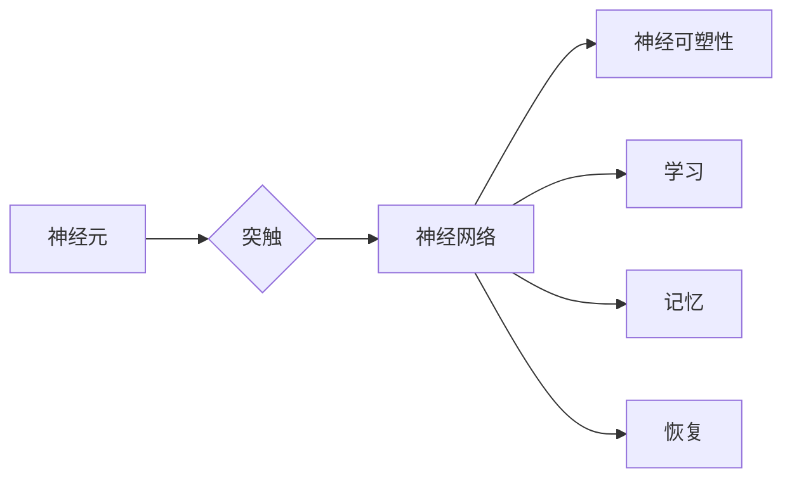

# 类脑智能与认知计算原理与代码实战案例讲解

> 关键词：类脑智能，认知计算，神经网络，深度学习，脑启发算法，计算模型，神经可塑性，人工神经网络，智能模拟

## 1. 背景介绍
### 1.1 问题的由来

在过去的几十年里，人工智能（AI）领域取得了惊人的进展，特别是在机器学习，尤其是深度学习的推动下。然而，尽管取得了显著的成就，现有的AI系统仍然在很大程度上依赖于大量数据和复杂的算法，缺乏对人类认知过程的深刻理解。类脑智能与认知计算领域应运而生，旨在通过模拟人脑的结构和功能，开发出更智能、更高效的人工智能系统。

### 1.2 研究现状

类脑智能与认知计算领域的研究主要集中在以下几个方面：

- **生物脑模拟**：研究人脑的结构和功能，包括神经元、突触和神经网络等。
- **脑启发算法**：设计受脑启发的人工神经网络和计算模型。
- **神经可塑性**：研究大脑如何通过学习适应环境变化，并将其应用于AI系统。
- **智能模拟**：开发能够模拟人类认知过程的AI系统。

### 1.3 研究意义

类脑智能与认知计算的研究对于以下几个方面具有重要意义：

- **提高AI系统的智能水平**：通过模拟人脑的认知过程，开发出更智能、更自适应的AI系统。
- **理解人脑的工作原理**：通过对类脑智能的研究，我们可以更深入地理解人脑的工作原理。
- **开发新的计算模型**：类脑智能的研究可能会催生新的计算模型，为AI系统的发展提供新的思路。

### 1.4 本文结构

本文将分为以下几个部分：

- **第2章**：介绍类脑智能与认知计算的核心概念与联系。
- **第3章**：阐述类脑智能的核心算法原理与具体操作步骤。
- **第4章**：讲解数学模型和公式，并提供案例分析。
- **第5章**：提供代码实例和详细解释说明。
- **第6章**：探讨实际应用场景和未来应用展望。
- **第7章**：推荐相关学习资源和开发工具。
- **第8章**：总结研究进展、未来发展趋势与挑战。
- **第9章**：提供常见问题与解答。

## 2. 核心概念与联系
### 2.1 核心概念原理
- **神经元**：人脑的基本处理单元，负责信息的接收、处理和传递。
- **突触**：神经元之间的连接点，负责信息的传递。
- **神经网络**：由多个神经元组成的复杂网络，负责执行复杂的计算任务。
- **神经可塑性**：大脑适应环境变化的能力，包括学习、记忆和恢复。
- **人工神经网络**：模拟人脑结构的计算模型，用于解决复杂问题。

### 2.2 架构的 Mermaid 流程图



## 3. 核心算法原理 & 具体操作步骤
### 3.1 算法原理概述

类脑智能算法的核心思想是模拟人脑的结构和功能，通过神经元和神经网络实现信息的处理和传递。以下是一些常见的类脑智能算法：

- **神经网络**：通过模拟神经元和突触，实现信息的传递和处理。
- **深度学习**：一种特殊的神经网络，通过多层神经网络实现复杂的特征提取和分类。
- **强化学习**：通过奖励和惩罚机制，使智能体学习如何做出最优决策。

### 3.2 算法步骤详解

1. **数据收集**：收集用于训练的数据，包括输入和输出。
2. **模型构建**：根据任务需求，构建合适的神经网络模型。
3. **训练**：使用收集到的数据对模型进行训练，调整模型参数。
4. **评估**：使用测试数据评估模型的性能，调整模型结构或参数。
5. **应用**：将训练好的模型应用到实际任务中。

### 3.3 算法优缺点

**优点**：

- **高效率**：类脑智能算法能够快速处理大量数据。
- **强鲁棒性**：类脑智能算法具有较强的鲁棒性，能够在复杂环境中稳定工作。
- **自适应性**：类脑智能算法能够通过学习不断适应环境变化。

**缺点**：

- **计算复杂度高**：类脑智能算法通常需要大量的计算资源。
- **可解释性差**：类脑智能算法的决策过程通常难以解释。

### 3.4 算法应用领域

类脑智能算法在以下领域有广泛的应用：

- **图像识别**：如人脸识别、物体识别等。
- **语音识别**：如语音识别、语音合成等。
- **自然语言处理**：如机器翻译、文本分类等。
- **医疗诊断**：如疾病诊断、药物发现等。

## 4. 数学模型和公式 & 详细讲解 & 举例说明
### 4.1 数学模型构建

类脑智能的数学模型主要包括以下几个方面：

- **神经元模型**：如Leaky ReLU、Sigmoid等。
- **神经网络模型**：如全连接神经网络、卷积神经网络等。
- **学习算法**：如梯度下降、随机梯度下降等。

### 4.2 公式推导过程

以下是一个简单的神经网络模型公式推导过程：

- **神经元激活函数**：$$ f(x) = \sigma(w \cdot x + b) $$
- **梯度下降**：$$ \theta_{\text{new}} = \theta_{\text{old}} - \alpha \cdot \nabla_{\theta}J(\theta) $$

### 4.3 案例分析与讲解

以下是一个简单的神经网络模型案例分析：

- **任务**：图像分类
- **模型**：卷积神经网络（CNN）
- **数据集**：MNIST手写数字数据集
- **训练过程**：使用梯度下降算法训练模型，调整模型参数。

## 5. 项目实践：代码实例和详细解释说明
### 5.1 开发环境搭建

1. 安装Python和Anaconda
2. 安装TensorFlow或PyTorch等深度学习框架
3. 安装必要的依赖库

### 5.2 源代码详细实现

以下是一个简单的神经网络模型实现：

```python
import tensorflow as tf

model = tf.keras.Sequential([
    tf.keras.layers.Flatten(input_shape=(28, 28)),
    tf.keras.layers.Dense(128, activation='relu'),
    tf.keras.layers.Dropout(0.2),
    tf.keras.layers.Dense(10, activation='softmax')
])

model.compile(optimizer='adam',
              loss='sparse_categorical_crossentropy',
              metrics=['accuracy'])

model.fit(x_train, y_train, epochs=5)
```

### 5.3 代码解读与分析

这段代码实现了一个简单的卷积神经网络模型，用于MNIST手写数字数据集的分类任务。

- **Flatten**：将输入数据展平为一维向量。
- **Dense**：全连接层，用于特征提取和分类。
- **Dropout**：防止过拟合。
- **Compile**：编译模型，指定优化器、损失函数和评估指标。
- **Fit**：训练模型，调整模型参数。

### 5.4 运行结果展示

训练完成后，可以在测试集上评估模型的性能：

```python
test_loss, test_acc = model.evaluate(x_test,  y_test, verbose=2)
print('
Test accuracy:', test_acc)
```

## 6. 实际应用场景
### 6.1 医学图像分析

类脑智能算法在医学图像分析中有着广泛的应用，如：

- **病理切片分析**：自动识别病理切片中的病变区域。
- **X光图像分析**：检测骨折、肿瘤等病变。

### 6.2 自动驾驶

类脑智能算法在自动驾驶领域也有着重要的应用，如：

- **环境感知**：通过摄像头、雷达等传感器感知周围环境。
- **决策规划**：根据感知信息做出合理的驾驶决策。

### 6.3 语音识别

类脑智能算法在语音识别领域也有着重要的应用，如：

- **语音转文字**：将语音信号转换为文字。
- **语音合成**：将文字转换为语音。

## 7. 工具和资源推荐
### 7.1 学习资源推荐

- **书籍**：
  - 《深度学习》（Ian Goodfellow、Yoshua Bengio、Aaron Courville 著）
  - 《人工神经网络与深度学习》（邱锡鹏 著）
- **在线课程**：
  - Coursera上的《深度学习专项课程》
  - edX上的《深度学习基础》

### 7.2 开发工具推荐

- **编程语言**：Python
- **深度学习框架**：TensorFlow、PyTorch
- **数据集**：
  - MNIST手写数字数据集
  - CIFAR-10图像数据集

### 7.3 相关论文推荐

- **卷积神经网络**：
  - "A Guide to Convolutional Neural Networks"
- **递归神经网络**：
  - "Sequence to Sequence Learning with Neural Networks"
- **生成对抗网络**：
  - "Generative Adversarial Nets"

## 8. 总结：未来发展趋势与挑战
### 8.1 研究成果总结

类脑智能与认知计算领域的研究取得了显著的进展，为AI系统的发展提供了新的思路。然而，这一领域仍然面临着诸多挑战。

### 8.2 未来发展趋势

未来，类脑智能与认知计算领域的研究将主要集中在以下几个方面：

- **更高效的计算模型**：设计更高效的计算模型，降低计算复杂度。
- **更智能的学习算法**：设计更智能的学习算法，提高学习效率和准确性。
- **更广泛的应用领域**：将类脑智能与认知计算应用到更多领域。

### 8.3 面临的挑战

类脑智能与认知计算领域面临着以下挑战：

- **计算资源**：类脑智能算法通常需要大量的计算资源。
- **数据质量**：数据质量对模型性能至关重要。
- **可解释性**：类脑智能算法的决策过程通常难以解释。

### 8.4 研究展望

随着技术的不断发展，相信类脑智能与认知计算领域将会取得更大的突破，为AI系统的发展提供新的动力。

## 9. 附录：常见问题与解答

**Q1：什么是类脑智能？**

A：类脑智能是指通过模拟人脑的结构和功能，开发出更智能、更高效的人工智能系统。

**Q2：类脑智能有哪些应用？**

A：类脑智能在图像识别、语音识别、自然语言处理、医疗诊断等领域有着广泛的应用。

**Q3：类脑智能与深度学习有什么区别？**

A：深度学习是一种特殊的神经网络，而类脑智能则是通过模拟人脑的结构和功能，开发出更智能、更高效的人工智能系统。

**Q4：类脑智能有哪些挑战？**

A：类脑智能面临着计算资源、数据质量和可解释性等挑战。

作者：禅与计算机程序设计艺术 / Zen and the Art of Computer Programming