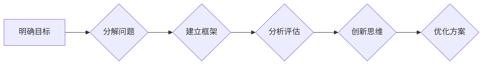

# 结构化思维的应用：从理论到实践

> 关键词：结构化思维，逻辑框架，决策，沟通，问题解决，创新，项目管理

## 1. 背景介绍

在信息爆炸和复杂多变的现代社会，结构化思维已成为提高工作效率、优化决策质量、促进沟通理解和推动创新的重要工具。结构化思维强调的是对信息进行有序组织、系统分析和逻辑推理的能力，它不仅是一种思考方式，更是一种高效解决问题的方法论。

本文将深入探讨结构化思维的应用，从理论到实践，帮助读者掌握这一宝贵的思维工具。

## 2. 核心概念与联系

### 2.1 核心概念原理

结构化思维的核心概念包括：

- **明确目标**：在思考和分析问题时，首先要明确目标，确保所有努力都围绕目标展开。
- **分解问题**：将复杂问题分解为可管理的子问题，逐步深入，直至找到解决方法。
- **逻辑框架**：建立逻辑清晰的框架，确保思考和沟通的一致性和条理性。
- **分析评估**：对信息进行分析和评估，识别关键因素，得出结论。
- **创新思维**：在结构化思维的基础上，鼓励创新和创造性思考，寻找最佳解决方案。

以下为结构化思维的核心概念原理的Mermaid流程图：



### 2.2 关联性分析

结构化思维与其他思维方法之间存在紧密的关联性：

- **系统思维**：结构化思维强调对整个系统的分析，与系统思维相辅相成。
- **批判性思维**：结构化思维要求对信息进行深入分析和评估，与批判性思维有着共同的底色。
- **创造性思维**：结构化思维为创造性思维提供基础框架，有助于激发创新灵感。

## 3. 核心算法原理 & 具体操作步骤

### 3.1 算法原理概述

结构化思维的原理可以概括为以下几个步骤：

1. **定义问题**：明确问题的性质和目标。
2. **收集信息**：收集与问题相关的所有信息。
3. **分析信息**：对收集到的信息进行整理和分析。
4. **构建框架**：根据分析结果，建立逻辑清晰的框架。
5. **评估方案**：评估不同解决方案的优缺点。
6. **选择方案**：根据评估结果，选择最佳解决方案。
7. **实施方案**：执行解决方案，并进行监控和调整。

### 3.2 算法步骤详解

#### 步骤1：定义问题

定义问题是结构化思维的第一步，它要求我们明确问题的性质、目标和范围。具体包括：

- **问题的类型**：确定问题属于哪一类问题，如决策问题、规划问题、分析问题等。
- **问题的目标**：明确解决问题的期望结果。
- **问题的范围**：界定问题的边界，避免过度泛化。

#### 步骤2：收集信息

收集信息是解决问题的前提，需要从多个渠道获取与问题相关的数据和信息。具体包括：

- **内部数据**：组织内部的各种报告、文件、记录等。
- **外部数据**：行业报告、市场分析、专家意见等。
- **个人经验**：个人在类似问题上的处理经验。

#### 步骤3：分析信息

分析信息是对收集到的信息进行整理、分类、归纳和总结。具体包括：

- **识别关键因素**：找出影响问题解决的关键因素。
- **建立联系**：分析不同因素之间的关系。
- **识别模式**：总结问题出现的规律和模式。

#### 步骤4：构建框架

构建框架是根据分析结果，建立逻辑清晰的框架。具体包括：

- **确定问题解决流程**：明确解决问题的步骤和顺序。
- **划分问题领域**：将问题分解为不同的领域和子问题。
- **建立逻辑关系**：明确不同领域和子问题之间的逻辑关系。

#### 步骤5：评估方案

评估方案是对不同解决方案的优缺点进行分析，选择最佳方案。具体包括：

- **列举方案**：列出所有可能的解决方案。
- **评估标准**：确定评估方案的标准和指标。
- **比较方案**：比较不同方案的优缺点。

#### 步骤6：选择方案

根据评估结果，选择最佳解决方案。具体包括：

- **权衡利弊**：权衡不同方案的利弊，选择最符合目标要求的方案。
- **制定实施计划**：制定详细的实施计划，确保方案能够顺利实施。

#### 步骤7：实施方案

实施方案是执行解决方案，并进行监控和调整。具体包括：

- **执行计划**：按照实施计划执行方案。
- **监控进度**：监控方案实施进度，确保按时完成。
- **调整方案**：根据实际情况调整方案，以确保目标的实现。

### 3.3 算法优缺点

结构化思维具有以下优点：

- **提高效率**：结构化思维可以帮助人们更快地解决问题，提高工作效率。
- **提升质量**：结构化思维可以帮助人们更好地分析问题，提高决策质量。
- **增强沟通**：结构化思维可以帮助人们更清晰地表达思想，增强沟通效果。

结构化思维也存在一定的缺点：

- **思维局限性**：结构化思维可能导致思维僵化，难以应对突发情况。
- **时间消耗**：结构化思维需要花费一定的时间来分析和整理信息。

### 3.4 算法应用领域

结构化思维广泛应用于以下领域：

- **项目管理**：帮助项目管理者明确项目目标、规划项目进度、管理项目风险。
- **决策制定**：帮助决策者明确决策目标、收集信息、分析方案、制定决策。
- **问题解决**：帮助人们分析问题、寻找解决方案、评估方案、选择方案。
- **沟通表达**：帮助人们清晰地表达思想、增强沟通效果。
- **创新创造**：帮助人们进行创新思维、寻找新的解决方案。

## 4. 数学模型和公式 & 详细讲解 & 举例说明

### 4.1 数学模型构建

结构化思维可以借助数学模型来辅助分析和解决问题。以下是一个简单的数学模型示例：

假设有一个投资项目，其收益 $R$ 与投入 $I$ 之间存在以下关系：

$$
R = f(I)
$$

其中 $f(I)$ 是一个函数，表示收益与投入之间的关系。我们可以通过以下步骤来分析和解决问题：

1. **确定函数关系**：根据实际情况，确定收益与投入之间的函数关系。
2. **分析函数性质**：分析函数的性质，如单调性、连续性、可导性等。
3. **求解最优解**：求解函数的最大值或最小值，找到最优的投资方案。

### 4.2 公式推导过程

以下是一个简单的公式推导示例：

假设有一个线性回归模型，其预测值 $y$ 与自变量 $x$ 之间存在以下关系：

$$
y = \beta_0 + \beta_1x
$$

其中 $\beta_0$ 和 $\beta_1$ 是模型的参数。我们可以通过最小化损失函数来求解参数 $\beta_0$ 和 $\beta_1$：

$$
\beta = \mathop{\arg\min}_{\beta} \sum_{i=1}^N (y_i - \beta_0 - \beta_1x_i)^2
$$

使用最小二乘法求解，得到参数 $\beta_0$ 和 $\beta_1$ 的表达式：

$$
\beta_0 = \frac{1}{N} \sum_{i=1}^N (y_i - \beta_1x_i)
$$

$$
\beta_1 = \frac{1}{N} \sum_{i=1}^N x_i(y_i - \beta_0 - \beta_1x_i)
$$

### 4.3 案例分析与讲解

以下是一个结构化思维在项目管理中的应用案例：

**案例背景**：某公司计划开发一款新产品，需要确定产品功能和开发计划。

**解决方案**：

1. **明确目标**：确定产品功能、性能指标、交付时间等目标。
2. **收集信息**：收集市场调研报告、竞品分析报告、用户需求等。
3. **分析信息**：分析市场需求、技术可行性、成本效益等。
4. **构建框架**：将项目分解为需求分析、设计、开发、测试、上线等阶段。
5. **评估方案**：评估不同开发计划的时间、成本、风险等。
6. **选择方案**：选择最优的开发计划。
7. **实施方案**：按照开发计划执行项目，并进行监控和调整。

## 5. 项目实践：代码实例和详细解释说明

### 5.1 开发环境搭建

为了更好地理解结构化思维在项目中的应用，以下是一个简单的Python代码实例，用于实现一个简单的项目管理工具。

```python
# 导入所需库
import sys

# 定义项目类
class Project:
    def __init__(self, name, start_date, end_date):
        self.name = name
        self.start_date = start_date
        self.end_date = end_date
        self.tasks = []

    def add_task(self, task_name, start_date, end_date):
        self.tasks.append(Task(task_name, start_date, end_date))

    def get_tasks(self):
        return self.tasks

# 定义任务类
class Task:
    def __init__(self, name, start_date, end_date):
        self.name = name
        self.start_date = start_date
        self.end_date = end_date

# 创建项目实例
project = Project("新项目", "2023-01-01", "2023-06-30")

# 添加任务
project.add_task("需求分析", "2023-01-01", "2023-01-15")
project.add_task("设计", "2023-01-16", "2023-02-28")
project.add_task("开发", "2023-03-01", "2023-05-31")
project.add_task("测试", "2023-06-01", "2023-06-30")

# 打印项目信息
print(f"项目名称：{project.name}")
print(f"开始日期：{project.start_date}")
print(f"结束日期：{project.end_date}")
print("项目任务：")
for task in project.get_tasks():
    print(f" - {task.name}：{task.start_date} - {task.end_date}")
```

### 5.2 源代码详细实现

以上代码定义了两个类：`Project` 和 `Task`。`Project` 类代表一个项目，包含项目名称、开始日期、结束日期和任务列表。`Task` 类代表一个任务，包含任务名称、开始日期和结束日期。

代码中创建了一个 `Project` 实例，并添加了四个任务。最后，打印出项目信息和任务信息。

### 5.3 代码解读与分析

以上代码展示了如何使用结构化思维来设计一个简单的项目管理工具。通过定义项目类和任务类，可以将项目分解为不同的组成部分，并清晰地展示项目结构和任务信息。这种结构化的设计方式有助于项目管理者更好地理解项目状态，并进行有效的项目管理。

### 5.4 运行结果展示

运行以上代码，将得到以下输出：

```
项目名称：新项目
开始日期：2023-01-01
结束日期：2023-06-30
项目任务：
 - 需求分析：2023-01-01 - 2023-01-15
 - 设计：2023-01-16 - 2023-02-28
 - 开发：2023-03-01 - 2023-05-31
 - 测试：2023-06-01 - 2023-06-30
```

## 6. 实际应用场景

### 6.1 项目管理

结构化思维在项目管理中的应用非常广泛。例如，项目经理可以使用结构化思维来规划项目进度、管理项目风险、制定项目预算等。

### 6.2 决策制定

在决策制定过程中，结构化思维可以帮助决策者收集信息、分析方案、评估风险、选择最佳方案等。

### 6.3 问题解决

在解决问题时，结构化思维可以帮助人们分析问题、寻找解决方案、评估方案、选择方案等。

### 6.4 沟通表达

结构化思维可以帮助人们清晰地表达思想，增强沟通效果。

### 6.5 创新创造

结构化思维为创新和创造性思考提供基础框架，有助于激发创新灵感。

## 7. 工具和资源推荐

### 7.1 学习资源推荐

- 《结构化思维：如何理性思考、高效沟通、正确决策》
- 《金字塔原理：如何清晰表达、高效沟通》
- 《决策与判断：如何做出更好的选择》

### 7.2 开发工具推荐

- XMind：思维导图软件，可以帮助用户构建结构化的思维框架。
- Miro：在线协作白板，可以用于团队协作，共同构建结构化的思维模型。

### 7.3 相关论文推荐

- "Structured Thinking in Software Development" by Tony Buzan
- "The Pyramid Principle" by Barbara Minto
- "The Art of Problem Solving" by George Polya

## 8. 总结：未来发展趋势与挑战

### 8.1 研究成果总结

结构化思维作为一种重要的思维工具，在各个领域都取得了显著的成果。未来，结构化思维的应用将更加广泛，并与人工智能、大数据等新技术相结合，为解决问题、推动创新提供更强大的支持。

### 8.2 未来发展趋势

- **结构化思维的自动化**：开发基于人工智能的结构化思维辅助工具，帮助人们更高效地应用结构化思维。
- **结构化思维的个性化**：根据不同个体和场景，提供定制化的结构化思维框架和解决方案。
- **结构化思维的跨学科融合**：将结构化思维与其他学科知识相结合，推动跨学科研究和创新。

### 8.3 面临的挑战

- **思维习惯的改变**：人们需要克服原有的思维定式，培养和应用结构化思维。
- **知识体系的更新**：随着新技术和新知识的发展，结构化思维的知识体系需要不断更新和完善。
- **工具的局限性**：现有的结构化思维工具在功能、性能和易用性等方面仍有待提升。

### 8.4 研究展望

结构化思维作为一种重要的思维工具，将在未来发挥越来越重要的作用。通过对结构化思维的理论研究和实践探索，相信我们能够构建更加完善的结构化思维体系，为人类社会的进步和发展提供强有力的智力支持。

## 9. 附录：常见问题与解答

**Q1：如何培养结构化思维？**

A1：培养结构化思维需要不断练习和积累。以下是一些建议：

- **多读书、多思考**：广泛阅读、学习相关知识，培养批判性思维。
- **练习思维导图**：使用思维导图软件，构建结构化的知识体系。
- **参与团队协作**：在团队项目中，与他人合作，学习他人的思维方式和沟通技巧。
- **反思和总结**：在解决问题和完成任务后，反思总结经验教训。

**Q2：结构化思维是否适用于所有人？**

A2：结构化思维是一种通用的思维工具，适用于所有人。不同人的思维方式可能存在差异，但通过学习和实践，任何人都可以培养和应用结构化思维。

**Q3：结构化思维与创造性思维有何关系？**

A3：结构化思维和创造性思维是相辅相成的。结构化思维为创造性思维提供基础框架，有助于激发创新灵感。而创造性思维则可以丰富结构化思维的内容和形式。

**Q4：如何将结构化思维应用于实际工作？**

A4：将结构化思维应用于实际工作，可以从以下几个方面入手：

- **明确目标**：在开始工作前，明确工作目标。
- **分解任务**：将任务分解为可管理的子任务。
- **收集信息**：收集与任务相关的信息。
- **分析信息**：对信息进行分析和整理。
- **制定计划**：制定详细的实施计划。
- **执行计划**：按照计划执行任务。
- **监控进度**：监控任务进度，及时调整计划。

**Q5：结构化思维是否会导致思维僵化？**

A5：结构化思维本身并不会导致思维僵化。相反，结构化思维可以帮助人们更好地组织信息、分析问题、解决问题。关键在于，在应用结构化思维时，要保持开放的心态，不断学习和创新。

---

作者：禅与计算机程序设计艺术 / Zen and the Art of Computer Programming