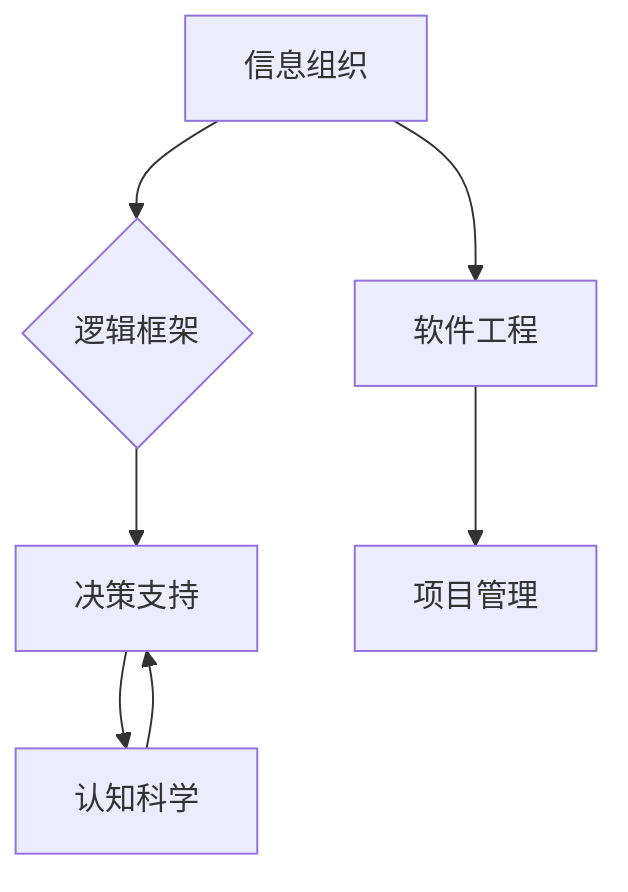

# 结构化思维：从混沌到清晰

> 关键词：结构化思维，逻辑框架，信息组织，决策支持，认知科学，软件工程，项目管理

## 1. 背景介绍

在信息爆炸和知识更新的时代，我们每天都要处理大量的信息。如何有效地组织这些信息，使之成为可理解和应用的智慧，成为了一个重要的挑战。结构化思维提供了一种系统的方法，帮助我们从混沌中提炼出清晰的逻辑框架，为决策、沟通和问题解决提供坚实的支撑。

### 1.1 问题的由来

随着互联网和移动设备的普及，信息的获取变得前所未有的容易。然而，这也带来了信息过载的问题。面对大量的信息，人们往往感到迷茫和不知所措。传统的线性思维模式，如线性规划、演绎推理等，在处理复杂问题时显得力不从心。

### 1.2 研究现状

结构化思维作为一种认知工具，已经被广泛应用于各个领域，包括管理学、心理学、教育学、工程学等。近年来，随着认知科学的发展，结构化思维的理论基础得到了进一步的完善。

### 1.3 研究意义

结构化思维的意义在于：

- 提高信息处理效率
- 增强决策质量
- 提升沟通效果
- 促进知识管理
- 支持创新思维

### 1.4 本文结构

本文将探讨结构化思维的概念、原理、方法及其在IT领域的应用。文章将分为以下几个部分：

- 核心概念与联系
- 核心算法原理 & 具体操作步骤
- 数学模型和公式 & 详细讲解 & 举例说明
- 项目实践：代码实例和详细解释说明
- 实际应用场景
- 工具和资源推荐
- 总结：未来发展趋势与挑战
- 附录：常见问题与解答

## 2. 核心概念与联系

### 2.1 核心概念

#### 2.1.1 信息组织

信息组织是指将信息按照一定的规则和结构进行分类、编码和存储的过程。良好的信息组织能够提高信息的可检索性和可理解性。

#### 2.1.2 逻辑框架

逻辑框架是指对信息进行逻辑分类和连接的方式。常见的逻辑框架包括层次结构、网络结构、矩阵结构等。

#### 2.1.3 决策支持

决策支持是指通过分析信息来辅助决策的过程。结构化思维可以帮助决策者更全面、更系统地分析问题。

#### 2.1.4 认知科学

认知科学是研究人类认知过程的科学。结构化思维的理论基础部分来源于认知科学。

#### 2.1.5 软件工程

在软件工程中，结构化思维被用于需求分析、系统设计、代码编写等环节。

#### 2.1.6 项目管理

在项目管理中，结构化思维被用于项目规划、风险管理、进度管理等环节。

### 2.2 联系

结构化思维是一个跨学科的领域，其核心概念之间相互联系，形成一个有机整体。

#### 2.2.1 信息组织与逻辑框架

信息组织是构建逻辑框架的基础，而逻辑框架又指导信息的进一步组织。

#### 2.2.2 决策支持与认知科学

认知科学为结构化思维提供了理论支持，而结构化思维则帮助决策者更有效地利用认知资源。

#### 2.2.3 软件工程与项目管理

结构化思维在软件工程和项目管理中的应用，可以帮助开发者和项目经理更好地完成工作。

#### 2.2.4 Mermaid 流程图

以下是一个Mermaid流程图，展示了结构化思维的核心概念及其相互关系：



## 3. 核心算法原理 & 具体操作步骤

### 3.1 算法原理概述

结构化思维的算法原理可以概括为以下几个步骤：

1. 信息收集：收集与问题相关的所有信息。
2. 信息筛选：对收集到的信息进行筛选，保留与问题相关的信息。
3. 信息分类：将筛选后的信息按照一定的逻辑进行分类。
4. 信息关联：将分类后的信息进行关联，形成一个逻辑框架。
5. 信息分析：对关联后的信息进行分析，得出结论。
6. 决策支持：根据分析结果，为决策提供支持。

### 3.2 算法步骤详解

#### 3.2.1 信息收集

信息收集是结构化思维的第一步，也是最为关键的一步。它要求我们全面、系统地收集与问题相关的信息。信息来源可以包括文献资料、专家访谈、实地调研等。

#### 3.2.2 信息筛选

在收集到大量信息后，我们需要对其进行筛选，只保留与问题相关的信息。筛选的过程可以基于关键词、主题、重要性等因素。

#### 3.2.3 信息分类

对筛选后的信息进行分类，可以帮助我们更好地理解问题的本质。常见的分类方法包括层次结构、网络结构、矩阵结构等。

#### 3.2.4 信息关联

将分类后的信息进行关联，形成一个逻辑框架。这个框架可以帮助我们更好地理解问题之间的关系。

#### 3.2.5 信息分析

对关联后的信息进行分析，得出结论。分析的方法可以基于逻辑推理、统计分析、案例研究等。

#### 3.2.6 决策支持

根据分析结果，为决策提供支持。决策的过程可以基于结构化思维框架，结合专家知识和其他相关因素。

### 3.3 算法优缺点

#### 3.3.1 优点

- 提高信息处理效率
- 增强决策质量
- 提升沟通效果
- 促进知识管理

#### 3.3.2 缺点

- 容易陷入思维定式
- 需要一定的训练和经验
- 不适用于所有问题

### 3.4 算法应用领域

结构化思维在以下领域有广泛的应用：

- 管理学
- 心理学
- 教育学
- 工程学
- 项目管理
- 软件工程
- 研究方法

## 4. 数学模型和公式 & 详细讲解 & 举例说明

### 4.1 数学模型构建

结构化思维的核心是逻辑框架，可以用数学模型进行描述。以下是一个简单的数学模型：

$$
\text{逻辑框架} = \text{信息组织} + \text{信息关联}
$$

其中，信息组织可以用集合论进行描述，信息关联可以用关系代数进行描述。

### 4.2 公式推导过程

#### 4.2.1 信息组织

信息组织可以用集合论进行描述，例如：

$$
\text{信息集合} = \bigcup_{i=1}^n \text{信息子集合}_i
$$

其中，$\text{信息子集合}_i$ 表示与问题相关的不同类型的信息。

#### 4.2.2 信息关联

信息关联可以用关系代数进行描述，例如：

$$
\text{关联关系} = \text{信息集合}_1 \bowtie \text{信息集合}_2
$$

其中，$\bowtie$ 表示关联操作。

### 4.3 案例分析与讲解

#### 4.3.1 案例一：项目管理

假设我们需要对一个新的项目进行规划。首先，我们需要收集与项目相关的所有信息，包括项目目标、范围、需求、资源等。然后，我们将这些信息进行分类，形成项目范围、项目进度、项目资源等类别。接下来，我们将这些类别进行关联，形成一个逻辑框架，即项目规划框架。最后，根据项目规划框架，我们进行分析，并制定项目计划。

#### 4.3.2 案例二：软件工程

在软件工程中，结构化思维被用于需求分析、系统设计、代码编写等环节。例如，在需求分析阶段，我们需要收集用户的需求，并对其进行分类，如功能需求、性能需求、安全性需求等。然后，我们将这些需求进行关联，形成一个需求模型。最后，根据需求模型，我们进行分析，并编写软件需求规格说明书。

## 5. 项目实践：代码实例和详细解释说明

### 5.1 开发环境搭建

为了演示结构化思维在软件工程中的应用，我们将使用Python编写一个简单的项目管理工具。

### 5.2 源代码详细实现

以下是一个使用Python编写的简单项目管理工具的代码示例：

```python
class Project:
    def __init__(self, name, description):
        self.name = name
        self.description = description
        self.tasks = []
    
    def add_task(self, task):
        self.tasks.append(task)
    
    def get_tasks(self):
        return self.tasks

class Task:
    def __init__(self, name, description, duration):
        self.name = name
        self.description = description
        self.duration = duration

# 创建项目实例
project = Project('新项目', '这是一个新项目的描述')

# 添加任务
project.add_task(Task('任务1', '这是任务1的描述', '5天'))
project.add_task(Task('任务2', '这是任务2的描述', '3天'))

# 获取任务列表
tasks = project.get_tasks()
for task in tasks:
    print(f"任务名称：{task.name}, 描述：{task.description}, 时长：{task.duration}")
```

### 5.3 代码解读与分析

在这个代码示例中，我们定义了两个类：`Project` 和 `Task`。`Project` 类表示一个项目，包含项目名称、描述和任务列表。`Task` 类表示一个任务，包含任务名称、描述和时长。

我们首先创建了一个 `Project` 实例，并添加了两个任务。然后，我们通过 `get_tasks` 方法获取任务列表，并遍历打印每个任务的详细信息。

### 5.4 运行结果展示

运行上述代码，将得到以下输出：

```
任务名称：任务1, 描述：这是任务1的描述, 时长：5天
任务名称：任务2, 描述：这是任务2的描述, 时长：3天
```

这个简单的例子展示了如何使用结构化思维进行软件工程实践。通过定义类和对象，我们可以清晰地组织和表示项目信息，方便进行后续的开发和维护。

## 6. 实际应用场景

### 6.1 管理学

在管理学中，结构化思维被用于战略规划、组织设计、人力资源管理等方面。

### 6.2 心理学

在心理学中，结构化思维被用于认知心理学、社会心理学、发展心理学等方面。

### 6.3 教育学

在教育学中，结构化思维被用于课程设计、教学评估、学生评价等方面。

### 6.4 未来应用展望

随着结构化思维的不断发展和完善，它将在更多领域得到应用，如：

- 智能决策支持系统
- 智能推荐系统
- 智能搜索引擎
- 智能客服系统

## 7. 工具和资源推荐

### 7.1 学习资源推荐

- 《结构化思维：从混沌到清晰》
- 《思维导图》
- 《金字塔原理》
- 《批判性思维》

### 7.2 开发工具推荐

- XMind
- MindManager
- Miro

### 7.3 相关论文推荐

- 《结构化思维的认知心理学基础》
- 《结构化思维在项目管理中的应用》
- 《结构化思维在软件工程中的应用》

## 8. 总结：未来发展趋势与挑战

### 8.1 研究成果总结

本文从结构化思维的概念、原理、方法及其在IT领域的应用等方面进行了探讨，展示了结构化思维在信息处理、决策支持、知识管理等方面的价值和意义。

### 8.2 未来发展趋势

- 结构化思维将与人工智能技术结合，开发智能结构化思维工具。
- 结构化思维将应用于更多领域，如健康医疗、教育、法律等。
- 结构化思维将与认知科学相结合，深入研究人类思维的本质。

### 8.3 面临的挑战

- 如何将结构化思维与具体领域知识相结合。
- 如何开发更有效的结构化思维工具。
- 如何在跨文化背景下推广结构化思维。

### 8.4 研究展望

结构化思维作为一种重要的认知工具，将在未来发挥越来越重要的作用。通过不断的研究和实践，结构化思维将帮助我们更好地理解和应用知识，创造更大的价值。

## 9. 附录：常见问题与解答

**Q1：结构化思维与线性思维有什么区别？**

A1：结构化思维是一种系统化的思维方式，它强调逻辑性和层次性。线性思维是一种线性化的思维方式，它强调顺序性和因果关系。

**Q2：如何提高结构化思维能力？**

A2：提高结构化思维能力需要不断学习和实践。以下是一些建议：
- 阅读相关书籍和资料。
- 参加结构化思维培训。
- 实践结构化思维方法。

**Q3：结构化思维在项目管理中的应用有哪些？**

A3：在项目管理中，结构化思维可以用于：
- 项目规划
- 风险管理
- 进度管理
- 质量管理

**Q4：结构化思维在软件工程中的应用有哪些？**

A4：在软件工程中，结构化思维可以用于：
- 需求分析
- 系统设计
- 代码编写
- 测试

**Q5：结构化思维在沟通中的应用有哪些？**

A5：在沟通中，结构化思维可以用于：
- 演讲
- 写作
- 协作

---

作者：禅与计算机程序设计艺术 / Zen and the Art of Computer Programming