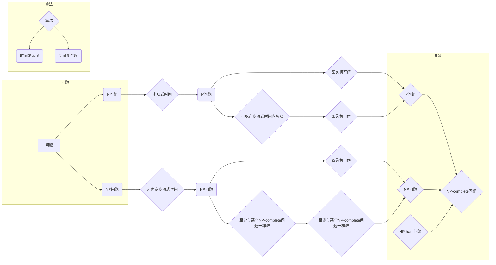

# 计算复杂性理论与算法设计

> 关键词：计算复杂性理论，算法复杂度，时间复杂度，空间复杂度，图灵机，NP问题，P vs NP问题，算法设计策略

## 1. 背景介绍

计算复杂性理论是计算机科学的核心领域之一，它研究算法解决问题的难易程度，以及算法性能的度量。自从图灵机模型被提出以来，计算复杂性理论为算法分析和设计提供了一个坚实的理论基础。本文将深入探讨计算复杂性理论的基本概念、核心算法原理，以及其在实际应用中的重要性。

### 1.1 问题的由来

随着计算机科学的快速发展，如何设计高效、可靠的算法成为了研究的重点。然而，并非所有问题都能被有效解决。计算复杂性理论为我们提供了一种衡量问题难易程度的方法，帮助我们从理论上评估算法的性能。

### 1.2 研究现状

计算复杂性理论的研究已经取得了丰富的成果，包括：

- 时间复杂度和空间复杂度的概念
- 图灵机模型
- P、NP、NP-complete、NP-hard等基本概念
- P vs NP问题

### 1.3 研究意义

计算复杂性理论对于计算机科学和工程领域具有重要意义：

- 帮助我们理解问题的本质，选择合适的算法
- 评估算法的性能，指导算法优化
- 推动新算法的设计和理论的发展
- 在实际应用中指导资源分配和系统设计

### 1.4 本文结构

本文将按照以下结构展开：

- 第2部分介绍计算复杂性理论的核心概念和联系。
- 第3部分探讨核心算法原理和具体操作步骤。
- 第4部分介绍数学模型和公式，并进行详细讲解。
- 第5部分通过项目实践展示算法设计过程。
- 第6部分分析实际应用场景。
- 第7部分展望未来发展趋势和挑战。
- 第8部分总结研究成果，并展望未来研究方向。

## 2. 核心概念与联系

计算复杂性理论的核心概念包括：

- **时间复杂度**：描述算法执行时间随输入规模增长的变化趋势。
- **空间复杂度**：描述算法执行过程中所需存储空间随输入规模增长的变化趋势。
- **图灵机**：一个抽象的计算模型，用于描述算法的计算能力。
- **P问题**：可以在多项式时间内解决的问题。
- **NP问题**：非确定多项式时间内解决的问题。
- **NP-complete问题**：既在NP中，也是NP-hard的NP问题。
- **NP-hard问题**：至少与某个已知的NP-complete问题一样难。

以下是核心概念原理和架构的Mermaid流程图：



## 3. 核心算法原理 & 具体操作步骤

### 3.1 算法原理概述

算法设计的目标是找到解决问题的最有效方法。以下是一些常见的算法设计策略：

- **分治法**：将大问题分解为小问题，递归地求解小问题，再将结果合并。
- **贪心法**：在每一步选择当前最优解，并希望最终得到全局最优解。
- **动态规划**：将大问题分解为小问题，通过保存中间结果避免重复计算。
- **回溯法**：通过尝试所有可能的解决方案，并在遇到无效解时回溯。

### 3.2 算法步骤详解

以下是分治法、贪心法、动态规划、回溯法的具体步骤：

**分治法**：

1. 将大问题分解为若干个小问题。
2. 递归地求解每个小问题。
3. 将小问题的解合并为原问题的解。

**贪心法**：

1. 在每一步选择当前最优解。
2. 希望最终得到全局最优解。

**动态规划**：

1. 将大问题分解为小问题。
2. 保存每个小问题的解。
3. 通过小问题的解求解原问题。

**回溯法**：

1. 从问题的起始状态开始。
2. 尝试所有可能的解决方案。
3. 在遇到无效解时回溯。

### 3.3 算法优缺点

以下是常见算法设计策略的优缺点：

| 算法设计策略 | 优点 | 缺点 |
| --- | --- | --- |
| 分治法 | 解决一些经典问题，如排序、搜索等 | 实现复杂，难以理解 |
| 贪心法 | 实现简单，易于理解 | 可能得到局部最优解 |
| 动态规划 | 提高效率，减少重复计算 | 实现复杂，难以理解 |
| 回溯法 | 可以尝试所有可能的解决方案 | 效率低，计算量大 |

### 3.4 算法应用领域

以上算法设计策略在许多领域都有应用，例如：

- **排序算法**：快速排序、归并排序、堆排序等。
- **搜索算法**：深度优先搜索、广度优先搜索、A*搜索等。
- **背包问题**：01背包、完全背包等。
- **图论问题**：最小生成树、最短路径等。

## 4. 数学模型和公式 & 详细讲解 & 举例说明

### 4.1 数学模型构建

计算复杂性理论中的数学模型主要包括：

- **时间复杂度**：$T(n) = O(f(n))$，其中 $n$ 为输入规模，$f(n)$ 为时间复杂度函数。
- **空间复杂度**：$S(n) = O(g(n))$，其中 $g(n)$ 为空间复杂度函数。

### 4.2 公式推导过程

以下以排序算法为例，推导其时间复杂度。

**快速排序**：

1. 分解：将数组划分为两个子数组，一个包含小于基准值的所有元素，另一个包含大于基准值的所有元素。
2. 合并：递归地对两个子数组进行快速排序。

快速排序的时间复杂度为 $T(n) = O(n \log n)$。

**归并排序**：

1. 分解：将数组划分为两个子数组，分别递归地进行归并排序。
2. 合并：将已排序的子数组合并为一个有序数组。

归并排序的时间复杂度为 $T(n) = O(n \log n)$。

### 4.3 案例分析与讲解

以下以背包问题为例，讲解动态规划算法的设计过程。

**01背包问题**：

给定一个物品集合和背包的容量，每种物品只能选择一次，求如何选择物品使得背包内物品的总价值最大。

**动态规划算法**：

1. 状态定义：`dp[i][w]` 表示在前 $i$ 种物品中选择，且背包容量为 $w$ 时的最大价值。
2. 状态转移方程：
   - 如果 $w \geq weight[i]$，则 `dp[i][w] = max(dp[i-1][w], dp[i-1][w-weight[i]] + value[i])`。
   - 否则，`dp[i][w] = dp[i-1][w]`。
3. 边界条件：`dp[0][w] = 0`。
4. 返回 `dp[n][capacity]`。

## 5. 项目实践：代码实例和详细解释说明

### 5.1 开发环境搭建

本文以Python语言为例，展示动态规划算法在背包问题中的应用。以下是Python的开发环境搭建步骤：

1. 安装Python：从Python官网下载并安装Python 3.8及以上版本。
2. 安装PyCharm：下载并安装PyCharm Community Edition。
3. 创建Python项目：在PyCharm中创建一个新的Python项目。

### 5.2 源代码详细实现

以下是一个简单的01背包问题的Python代码实现：

```python
def knapsack(weights, values, capacity):
    n = len(weights)
    dp = [[0 for _ in range(capacity + 1)] for _ in range(n + 1)]
    for i in range(1, n + 1):
        for w in range(1, capacity + 1):
            if w >= weights[i - 1]:
                dp[i][w] = max(dp[i - 1][w], dp[i - 1][w - weights[i - 1]] + values[i - 1])
            else:
                dp[i][w] = dp[i - 1][w]
    return dp[n][capacity]

# 示例
weights = [2, 3, 4, 5]
values = [3, 4, 5, 6]
capacity = 5
print(knapsack(weights, values, capacity))
```

### 5.3 代码解读与分析

以上代码实现了01背包问题的动态规划算法。首先定义了一个二维数组 `dp`，用于存储子问题的解。然后遍历所有物品和背包容量，根据状态转移方程计算每个子问题的最优解。最后返回 `dp[n][capacity]`，即包含所有物品且不超过背包容量的最大价值。

### 5.4 运行结果展示

运行以上代码，输出结果为 `9`，表示包含物品1、2、3的最大价值为9。

## 6. 实际应用场景

### 6.1 背包问题

背包问题是计算复杂性理论中一个经典的优化问题，在实际应用中具有广泛的应用，例如：

- 物流配送：如何合理安排货物装载，以最小化运输成本。
- 通信网络：如何优化数据传输，以最大化网络带宽利用率。
- 资源分配：如何合理分配资源，以最大化系统性能。

### 6.2 图论问题

图论问题是计算复杂性理论中的重要研究领域，在实际应用中具有广泛的应用，例如：

- 网络路由：如何设计路由算法，以最小化数据传输延迟。
- 路径规划：如何规划路径，以最小化旅行距离或时间。
- 社交网络分析：如何分析社交网络结构，以发现关键节点和社区结构。

### 6.3 排序问题

排序问题是计算机科学中最基本的问题之一，在实际应用中具有广泛的应用，例如：

- 数据库排序：如何高效地对数据库中的数据进行排序，以加快查询速度。
- 文本排序：如何对文本数据进行排序，以方便用户检索。
- 网页排序：如何对网页进行排序，以提供更好的用户体验。

## 7. 工具和资源推荐

### 7.1 学习资源推荐

为了帮助读者更好地理解计算复杂性理论和算法设计，以下是一些推荐的学习资源：

- 《算法导论》：计算机科学领域经典的算法教材，全面介绍了各种算法和数据结构。
- 《算法艺术与科学》：深入浅出地介绍了算法设计的基本原则和技巧。
- 《计算复杂性理论》：系统地介绍了计算复杂性理论的基本概念、核心算法原理和研究方法。

### 7.2 开发工具推荐

以下是一些常用的开发工具：

- PyCharm：一款功能强大的集成开发环境，适合Python语言开发。
- Visual Studio Code：一款轻量级、可扩展的代码编辑器，支持多种编程语言。
- Jupyter Notebook：一款基于Web的交互式计算平台，适合数据分析和机器学习。

### 7.3 相关论文推荐

以下是一些经典的计算复杂性理论论文：

- "On the Complexity of Theorem-Proving Procedures"：图灵奖得主Hartmanis和Stearns的经典论文，提出了P、NP、NP-complete、NP-hard等基本概念。
- "The Complexity of Theorem-Proving Procedures"：另一篇图灵奖得主Cook的经典论文，提出了Cook定理和NP-completeness概念。
- "NP-completeness and Physical Reality"：图灵奖得主Cook的经典论文，探讨了计算复杂性理论与物理现实之间的关系。

## 8. 总结：未来发展趋势与挑战

### 8.1 研究成果总结

计算复杂性理论和算法设计是计算机科学的核心领域，为算法分析和设计提供了坚实的理论基础。本文从背景介绍、核心概念、核心算法原理、数学模型、项目实践、实际应用场景等方面进行了全面系统的介绍，帮助读者深入理解这一领域。

### 8.2 未来发展趋势

未来，计算复杂性理论和算法设计领域将呈现出以下发展趋势：

- **算法设计方法**：探索新的算法设计方法，如基于机器学习的算法设计、基于遗传算法的算法设计等。
- **并行算法**：研究并行算法，提高算法的执行效率。
- **近似算法**：研究近似算法，在保证一定精度的情况下提高算法的执行效率。
- **量子算法**：研究量子算法，利用量子计算的优势解决传统计算机难以解决的问题。

### 8.3 面临的挑战

计算复杂性理论和算法设计领域面临着以下挑战：

- **P vs NP问题**：这是计算复杂性理论中最著名的未解决问题之一，至今仍未得到解决。
- **算法复杂性分析**：如何对复杂算法进行高效的复杂性分析。
- **算法优化**：如何设计高效的算法，以解决实际问题。

### 8.4 研究展望

未来，计算复杂性理论和算法设计领域的研究将不断深入，为计算机科学和工程领域提供新的理论和方法。相信随着研究的不断进展，我们将能够解决更多复杂的计算问题，推动计算机科学的发展。

## 9. 附录：常见问题与解答

**Q1：什么是时间复杂度和空间复杂度？**

A：时间复杂度描述算法执行时间随输入规模增长的变化趋势，空间复杂度描述算法执行过程中所需存储空间随输入规模增长的变化趋势。

**Q2：什么是P问题和NP问题？**

A：P问题是可以在多项式时间内解决的问题，NP问题是非确定多项式时间内解决的问题。

**Q3：什么是NP-complete问题？**

A：NP-complete问题是既在NP中，也是NP-hard的NP问题。

**Q4：如何设计高效的算法？**

A：设计高效的算法需要遵循以下原则：

- **问题分解**：将大问题分解为小问题，递归地求解小问题。
- **贪心法**：在每一步选择当前最优解。
- **动态规划**：将大问题分解为小问题，通过保存中间结果避免重复计算。
- **回溯法**：通过尝试所有可能的解决方案，并在遇到无效解时回溯。

**Q5：计算复杂性理论在现实世界中有什么应用？**

A：计算复杂性理论在现实世界中具有广泛的应用，如背包问题、图论问题、排序问题等。

---

作者：禅与计算机程序设计艺术 / Zen and the Art of Computer Programming