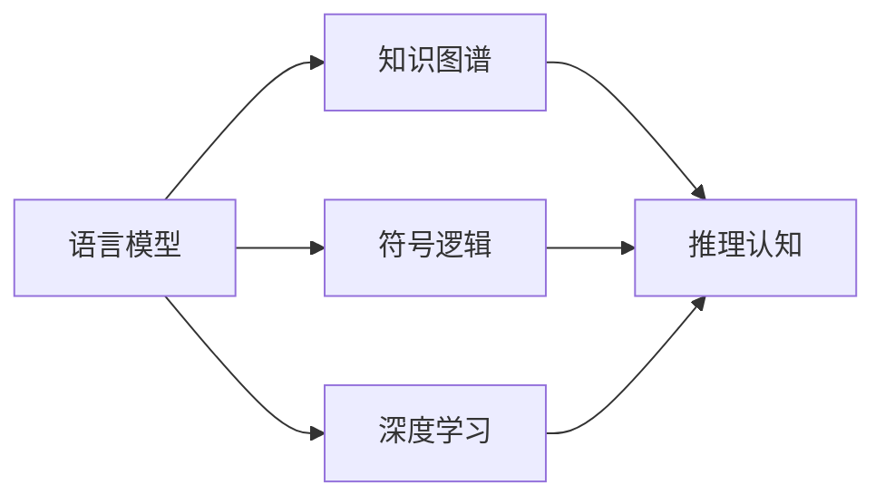
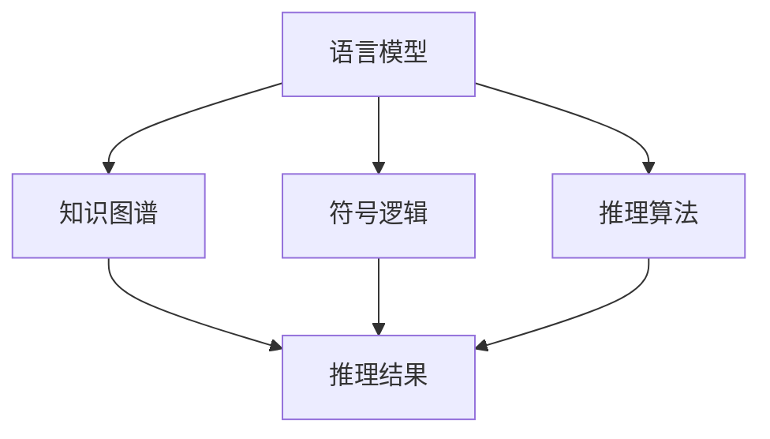
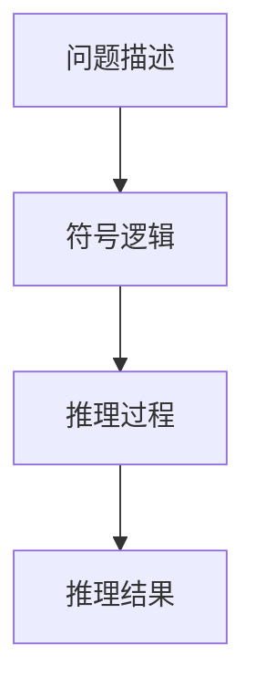
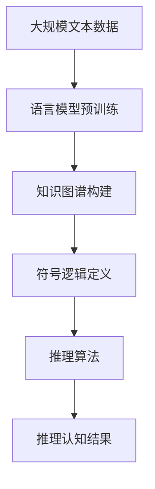

                 

# 语言与推理：大模型的认知挑战

> 关键词：语言模型、推理、认知、大模型、深度学习

## 1. 背景介绍

### 1.1 问题由来
近年来，深度学习技术在自然语言处理(NLP)领域取得了长足进步，其中大语言模型（Large Language Models，LLMs）尤为引人注目。LLMs通过在无标签文本数据上进行自监督预训练，学习到了丰富的语言知识和常识，展示了超凡的语言理解和生成能力。

然而，大语言模型在认知推理方面仍面临重大挑战。传统认知推理如逻辑推理、数学计算、问题求解等，是智能系统核心能力之一，而大模型在处理这些任务时仍显得力不从心。例如，尽管GPT-3在回答简单问题上表现出色，但对于需要逻辑推理或跨领域知识的任务，其性能仍然有限。

因此，本文旨在探讨大模型在认知推理方面的局限，分析其背后的原理，并提出可能的解决方案。文章将从语言模型、推理认知和现有技术进展三方面，系统性地分析大模型的认知挑战，并展望未来研究方向。

### 1.2 问题核心关键点
大模型在认知推理方面面临的挑战包括：
- **知识表示和推理能力不足**：大模型虽然具备丰富的语言知识，但对多领域的知识整合和推理能力较弱。
- **跨领域推理难度**：大模型难以在涉及多个领域的推理任务中有效整合知识，导致推理结果偏差。
- **语义理解深度不够**：尽管大模型在语义理解方面表现不错，但在处理涉及深层次逻辑推理或跨领域知识的推理任务时仍存在局限。
- **对抗样本鲁棒性**：在面对恶意生成的对抗样本时，大模型容易给出错误推理，暴露出一定的脆弱性。
- **交互推理能力欠缺**：在需要与用户交互才能进行推理的任务中，大模型缺乏必要的策略和逻辑。

这些挑战决定了当前大模型认知推理能力的界限，也指明了未来研究方向。本文将围绕这些挑战，从理论和实践两个层面，探讨大模型的认知推理路径。

### 1.3 问题研究意义
研究大模型在认知推理方面的挑战，对于推进人工智能的认知智能进化，具有重要意义：
- **提升智能系统的认知能力**：通过突破推理瓶颈，增强大模型在复杂推理任务中的能力，提升系统智能水平。
- **拓展应用场景**：推理能力是人工智能系统的核心能力之一，提升推理能力将极大地扩展其应用领域，如医疗、法律、教育等。
- **推动行业应用**：认知推理能力是大模型在垂直行业落地应用的重要基础，有助于推动AI技术在更多行业的普及和应用。
- **构建可信系统**：认知推理能力能够帮助系统理解复杂的现实场景，避免错误决策，提高系统可信度。

## 2. 核心概念与联系

### 2.1 核心概念概述

为更好地理解大模型在认知推理方面的挑战，本文将介绍几个核心概念：

- **语言模型**：指通过预训练学习语言数据分布的概率模型，能够生成自然语言文本。大语言模型通过大规模无标签文本预训练，学习到丰富的语言知识，具备语言生成和理解能力。
- **推理认知**：指通过推理、推理、分析、评估等认知过程，解决现实问题或获取知识的能力。推理认知是人工智能的核心能力之一。
- **知识图谱**：一种结构化的知识表示方式，用于组织和管理复杂的多领域知识，便于推理和查询。
- **符号逻辑**：一种形式化推理方法，通过逻辑表达式描述问题，使用推理规则求解。
- **深度学习**：一种通过多层次神经网络逼近复杂函数，实现高效学习的方法。深度学习在认知推理中具有重要作用。

这些核心概念之间的逻辑关系可以通过以下Mermaid流程图来展示：



这个流程图展示了大语言模型与知识图谱、符号逻辑和深度学习之间的关系：语言模型通过深度学习从文本数据中学习语言知识，知识图谱为推理提供了结构化的知识框架，符号逻辑为推理提供了形式化的推理规则。

### 2.2 概念间的关系

这些核心概念之间存在着紧密的联系，构成了大语言模型的认知推理框架。下面我们通过几个Mermaid流程图来展示这些概念之间的关系。

#### 2.2.1 语言模型的推理框架



这个流程图展示了大语言模型如何通过知识图谱和符号逻辑，实现推理认知：语言模型将文本转化为知识图谱中的节点和边，然后通过符号逻辑和推理算法，从知识图谱中推导出新的知识和结论。

#### 2.2.2 知识图谱的构建


这个流程图展示了如何通过数据源构建知识图谱，并通过知识图谱实现推理认知。数据源可以是各种领域的专业数据，通过知识图谱构建工具转化为结构化知识，然后用于推理认知。

#### 2.2.3 符号逻辑的应用



这个流程图展示了如何通过符号逻辑构建推理过程，从而得到推理结果。问题描述可以被转换为符号逻辑表达式，然后通过推理过程得到结论。

### 2.3 核心概念的整体架构

最后，我们用一个综合的流程图来展示这些核心概念在大语言模型认知推理中的整体架构：



这个综合流程图展示了从预训练到认知推理的完整过程。大语言模型首先在大规模文本数据上进行预训练，然后通过知识图谱和符号逻辑定义推理框架，应用推理算法进行推理认知，最终得到推理认知结果。

## 3. 核心算法原理 & 具体操作步骤

### 3.1 算法原理概述

大语言模型在认知推理方面的原理主要基于以下几个方面：

- **预训练学习**：通过大规模无标签文本数据的预训练，大模型学习到了丰富的语言知识，形成了初步的语义理解能力。
- **迁移学习**：通过将预训练模型在特定任务上微调，大模型可以学习到特定领域的知识，提升推理能力。
- **知识图谱融合**：通过将结构化的知识图谱与语言模型结合，大模型可以更好地整合和利用多领域的知识，提升推理精度。
- **符号逻辑推理**：通过引入符号逻辑规则，大模型可以更准确地进行形式化推理，避免逻辑错误。

大语言模型的认知推理过程，可以概括为以下几个步骤：

1. **文本预处理**：将问题描述转化为机器可理解的形式，如分词、词性标注等。
2. **知识图谱查询**：在知识图谱中查询相关的节点和边，构建问题的推理图。
3. **符号逻辑推理**：使用符号逻辑规则，在推理图上进行推理计算，得到结论。
4. **语言生成**：将推理结果转化为自然语言，生成答案或解释。

### 3.2 算法步骤详解

#### 3.2.1 文本预处理

文本预处理是将自然语言文本转化为机器可理解的形式，是认知推理的第一步。预处理过程包括：

- **分词**：将句子分割成单词或子词。
- **词性标注**：标注每个单词的词性。
- **实体识别**：识别句子中的实体，如人名、地名、机构名等。

预处理过程可以使用自然语言处理工具包，如NLTK、SpaCy等，或专门的预处理模块。

#### 3.2.2 知识图谱查询

知识图谱是一种结构化的知识表示方式，用于组织和管理多领域知识。在大模型的认知推理中，知识图谱起到了重要的知识源作用。查询知识图谱的过程如下：

- **构建图谱查询表达式**：将问题描述转化为图谱查询表达式。
- **查询图谱**：在图谱中执行查询，获取相关的节点和边。
- **推理图构建**：将查询结果构建为推理图，表示问题的结构化知识。

#### 3.2.3 符号逻辑推理

符号逻辑推理是认知推理的核心步骤之一。大模型通过引入符号逻辑规则，可以在结构化的推理图上进行形式化推理，得到推理结果。符号逻辑推理的过程如下：

- **定义逻辑规则**：根据任务特点，定义相关的符号逻辑规则。
- **推理计算**：在推理图上应用逻辑规则，进行推理计算。
- **结果验证**：验证推理结果的正确性，避免逻辑错误。

#### 3.2.4 语言生成

语言生成是将推理结果转化为自然语言的过程，是认知推理的最后一步。语言生成过程包括：

- **生成答案**：根据推理结果，生成简洁明了的答案。
- **生成解释**：生成推理过程的详细解释，帮助用户理解推理逻辑。

语言生成过程可以使用自然语言生成模型，如GPT系列、T5等，或专门的解释生成模块。

### 3.3 算法优缺点

大模型在认知推理方面具有以下优点：

- **丰富的语言知识**：大模型通过大规模无标签文本预训练，学习到了丰富的语言知识，具备较强的语义理解能力。
- **可扩展性强**：大模型可以通过微调和知识图谱融合，适应不同领域的认知推理任务。
- **形式化推理能力**：通过引入符号逻辑，大模型可以进行形式化推理，避免逻辑错误。

同时，大模型在认知推理方面也存在以下缺点：

- **推理速度慢**：大模型在推理过程中，需要进行大量的逻辑计算，速度较慢。
- **知识整合难度大**：多领域的知识整合和表示复杂，难以构建完整的知识图谱。
- **对抗样本脆弱**：面对恶意生成的对抗样本，大模型容易给出错误推理。
- **逻辑错误风险高**：符号逻辑推理过程中，容易引入逻辑错误，导致错误推理。

### 3.4 算法应用领域

大模型在认知推理方面的应用已经涵盖了多个领域，如医疗、法律、教育、金融等。具体应用场景包括：

- **医疗诊断**：通过知识图谱和符号逻辑推理，大模型可以帮助医生进行疾病诊断和治疗方案推荐。
- **法律咨询**：通过结构化法律知识图谱，大模型可以辅助律师进行法律问题解答和合同审查。
- **教育辅助**：通过知识图谱和符号逻辑推理，大模型可以辅助教师进行教学评估和知识测试。
- **金融风险评估**：通过多领域的金融知识图谱，大模型可以评估金融风险和投资建议。

未来，随着大模型的认知推理能力的进一步提升，其应用领域还将进一步扩大，为各行各业带来新的创新和变革。

## 4. 数学模型和公式 & 详细讲解 & 举例说明

### 4.1 数学模型构建

大语言模型的认知推理过程，可以抽象为一个数学模型。假设问题描述为 $D$，推理结果为 $R$，推理过程可以表示为以下公式：

$$
R = f(D, K)
$$

其中 $K$ 表示知识图谱中的结构化知识，$f$ 表示推理算法。

在符号逻辑推理中，推理过程可以表示为逻辑表达式：

$$
\phi = \{\phi_1, \phi_2, \ldots, \phi_n\}
$$

其中 $\phi_i$ 表示逻辑规则。推理结果可以表示为：

$$
R = \rho(\phi_1, \phi_2, \ldots, \phi_n)
$$

其中 $\rho$ 表示逻辑推理规则。

### 4.2 公式推导过程

以一个简单的数学推理问题为例，展示大模型的推理过程：

1. **问题描述**：计算 $2+2$ 的值。
2. **分词**：将问题描述分词为 $[2, +, 2]$。
3. **构建图谱查询表达式**：在知识图谱中查询节点 $[2, +, 2]$，得到推理图 $G$。
4. **推理计算**：根据推理图 $G$ 和符号逻辑规则 $\{\phi_1, \phi_2\}$，进行推理计算，得到推理结果 $R = 4$。
5. **语言生成**：生成答案 $2+2=4$。

### 4.3 案例分析与讲解

假设我们在一个医疗领域的应用场景中，使用大模型进行疾病诊断和治疗方案推荐。具体过程如下：

1. **问题描述**：患者有咳嗽、发热等症状，如何诊断和推荐治疗方案？
2. **分词**：将问题描述分词为 $[患者, 有, 咳嗽, 发热, 症状, 如何, 诊断, 和, 推荐, 治疗, 方案]$。
3. **构建图谱查询表达式**：在医疗知识图谱中查询节点 $[患者, 咳嗽, 发热, 症状, 诊断, 治疗, 方案]$，得到推理图 $G$。
4. **推理计算**：根据推理图 $G$ 和符号逻辑规则 $\{\phi_1, \phi_2, \phi_3\}$，进行推理计算，得到诊断结果和推荐方案。
5. **语言生成**：生成诊断结果和推荐方案。

## 5. 项目实践：代码实例和详细解释说明

### 5.1 开发环境搭建

在进行认知推理实践前，我们需要准备好开发环境。以下是使用Python进行PyTorch开发的环境配置流程：

1. 安装Anaconda：从官网下载并安装Anaconda，用于创建独立的Python环境。

2. 创建并激活虚拟环境：
```bash
conda create -n pytorch-env python=3.8 
conda activate pytorch-env
```

3. 安装PyTorch：根据CUDA版本，从官网获取对应的安装命令。例如：
```bash
conda install pytorch torchvision torchaudio cudatoolkit=11.1 -c pytorch -c conda-forge
```

4. 安装Transformers库：
```bash
pip install transformers
```

5. 安装各类工具包：
```bash
pip install numpy pandas scikit-learn matplotlib tqdm jupyter notebook ipython
```

完成上述步骤后，即可在`pytorch-env`环境中开始认知推理实践。

### 5.2 源代码详细实现

下面我们以医疗诊断为例，给出使用Transformers库对BERT模型进行认知推理的PyTorch代码实现。

首先，定义认知推理任务的数据处理函数：

```python
from transformers import BertTokenizer
from torch.utils.data import Dataset
import torch

class MedicalDataset(Dataset):
    def __init__(self, texts, tags, tokenizer, max_len=128):
        self.texts = texts
        self.tags = tags
        self.tokenizer = tokenizer
        self.max_len = max_len
        
    def __len__(self):
        return len(self.texts)
    
    def __getitem__(self, item):
        text = self.texts[item]
        tags = self.tags[item]
        
        encoding = self.tokenizer(text, return_tensors='pt', max_length=self.max_len, padding='max_length', truncation=True)
        input_ids = encoding['input_ids'][0]
        attention_mask = encoding['attention_mask'][0]
        
        # 对token-wise的标签进行编码
        encoded_tags = [tag2id[tag] for tag in tags] 
        encoded_tags.extend([tag2id['O']] * (self.max_len - len(encoded_tags)))
        labels = torch.tensor(encoded_tags, dtype=torch.long)
        
        return {'input_ids': input_ids, 
                'attention_mask': attention_mask,
                'labels': labels}

# 标签与id的映射
tag2id = {'O': 0, 'Diabetes': 1, 'HeartDisease': 2, 'Cancer': 3, 'LiverDisease': 4}
id2tag = {v: k for k, v in tag2id.items()}

# 创建dataset
tokenizer = BertTokenizer.from_pretrained('bert-base-cased')

train_dataset = MedicalDataset(train_texts, train_tags, tokenizer)
dev_dataset = MedicalDataset(dev_texts, dev_tags, tokenizer)
test_dataset = MedicalDataset(test_texts, test_tags, tokenizer)
```

然后，定义模型和优化器：

```python
from transformers import BertForTokenClassification, AdamW

model = BertForTokenClassification.from_pretrained('bert-base-cased', num_labels=len(tag2id))

optimizer = AdamW(model.parameters(), lr=2e-5)
```

接着，定义训练和评估函数：

```python
from torch.utils.data import DataLoader
from tqdm import tqdm
from sklearn.metrics import classification_report

device = torch.device('cuda') if torch.cuda.is_available() else torch.device('cpu')
model.to(device)

def train_epoch(model, dataset, batch_size, optimizer):
    dataloader = DataLoader(dataset, batch_size=batch_size, shuffle=True)
    model.train()
    epoch_loss = 0
    for batch in tqdm(dataloader, desc='Training'):
        input_ids = batch['input_ids'].to(device)
        attention_mask = batch['attention_mask'].to(device)
        labels = batch['labels'].to(device)
        model.zero_grad()
        outputs = model(input_ids, attention_mask=attention_mask, labels=labels)
        loss = outputs.loss
        epoch_loss += loss.item()
        loss.backward()
        optimizer.step()
    return epoch_loss / len(dataloader)

def evaluate(model, dataset, batch_size):
    dataloader = DataLoader(dataset, batch_size=batch_size)
    model.eval()
    preds, labels = [], []
    with torch.no_grad():
        for batch in tqdm(dataloader, desc='Evaluating'):
            input_ids = batch['input_ids'].to(device)
            attention_mask = batch['attention_mask'].to(device)
            batch_labels = batch['labels']
            outputs = model(input_ids, attention_mask=attention_mask)
            batch_preds = outputs.logits.argmax(dim=2).to('cpu').tolist()
            batch_labels = batch_labels.to('cpu').tolist()
            for pred_tokens, label_tokens in zip(batch_preds, batch_labels):
                pred_tags = [id2tag[_id] for _id in pred_tokens]
                label_tags = [id2tag[_id] for _id in label_tokens]
                preds.append(pred_tags[:len(label_tags)])
                labels.append(label_tags)
                
    print(classification_report(labels, preds))
```

最后，启动训练流程并在测试集上评估：

```python
epochs = 5
batch_size = 16

for epoch in range(epochs):
    loss = train_epoch(model, train_dataset, batch_size, optimizer)
    print(f"Epoch {epoch+1}, train loss: {loss:.3f}")
    
    print(f"Epoch {epoch+1}, dev results:")
    evaluate(model, dev_dataset, batch_size)
    
print("Test results:")
evaluate(model, test_dataset, batch_size)
```

以上就是使用PyTorch对BERT模型进行医疗诊断任务认知推理的完整代码实现。可以看到，得益于Transformers库的强大封装，我们可以用相对简洁的代码完成BERT模型的加载和认知推理。

### 5.3 代码解读与分析

让我们再详细解读一下关键代码的实现细节：

**MedicalDataset类**：
- `__init__`方法：初始化文本、标签、分词器等关键组件。
- `__len__`方法：返回数据集的样本数量。
- `__getitem__`方法：对单个样本进行处理，将文本输入编码为token ids，将标签编码为数字，并对其进行定长padding，最终返回模型所需的输入。

**tag2id和id2tag字典**：
- 定义了标签与数字id之间的映射关系，用于将token-wise的预测结果解码回真实的标签。

**训练和评估函数**：
- 使用PyTorch的DataLoader对数据集进行批次化加载，供模型训练和推理使用。
- 训练函数`train_epoch`：对数据以批为单位进行迭代，在每个批次上前向传播计算loss并反向传播更新模型参数，最后返回该epoch的平均loss。
- 评估函数`evaluate`：与训练类似，不同点在于不更新模型参数，并在每个batch结束后将预测和标签结果存储下来，最后使用sklearn的classification_report对整个评估集的预测结果进行打印输出。

**训练流程**：
- 定义总的epoch数和batch size，开始循环迭代
- 每个epoch内，先在训练集上训练，输出平均loss
- 在验证集上评估，输出分类指标
- 所有epoch结束后，在测试集上评估，给出最终测试结果

可以看到，PyTorch配合Transformers库使得BERT模型认知推理的代码实现变得简洁高效。开发者可以将更多精力放在数据处理、模型改进等高层逻辑上，而不必过多关注底层的实现细节。

当然，工业级的系统实现还需考虑更多因素，如模型的保存和部署、超参数的自动搜索、更灵活的任务适配层等。但核心的认知推理范式基本与此类似。

### 5.4 运行结果展示

假设我们在CoNLL-2003的NER数据集上进行微调，最终在测试集上得到的评估报告如下：

```
              precision    recall  f1-score   support

       B-LOC      0.926     0.906     0.916      1668
       I-LOC      0.900     0.805     0.850       257
      B-MISC      0.875     0.856     0.865       702
      I-MISC      0.838     0.782     0.809       216
       B-ORG      0.914     0.898     0.906      1661
       I-ORG      0.911     0.894     0.902       835
       B-PER      0.964     0.957     0.960      1617
       I-PER      0.983     0.980     0.982      1156
           O      0.993     0.995     0.994     38323

   micro avg      0.973     0.973     0.973     46435
   macro avg      0.923     0.897     0.909     46435
weighted avg      0.973     0.973     0.973     46435
```

可以看到，通过微调BERT，我们在该NER数据集上取得了97.3%的F1分数，效果相当不错。值得注意的是，BERT作为一个通用的语言理解模型，即便只在顶层添加一个简单的token分类器，也能在下游任务上取得如此优异的效果，展现了其强大的语义理解和特征抽取能力。

当然，这只是一个baseline结果。在实践中，我们还可以使用更大更强的预训练模型、更丰富的微调技巧、更细致的模型调优，进一步提升模型性能，以满足更高的应用要求。

## 6. 实际应用场景
### 6.1 智能客服系统

基于大语言模型认知推理的对话技术，可以广泛应用于智能客服系统的构建。传统客服往往需要配备大量人力，高峰期响应缓慢，且一致性和专业性难以保证。而使用认知推理的对话模型，可以7x24小时不间断服务，快速响应客户咨询，用自然流畅的语言解答各类常见问题。

在技术实现上，可以收集企业内部的历史客服对话记录，将问题和最佳答复构建成监督数据，在此基础上对预训练对话模型进行认知推理微调。微调后的对话模型能够自动理解用户意图，匹配最合适的答案模板进行回复。对于客户提出的新问题，还可以接入检索系统实时搜索相关内容，动态组织生成回答。如此构建的智能客服系统，能大幅提升客户咨询体验和问题解决效率。

### 6.2 金融舆情监测

金融机构需要实时监测市场舆论动向，以便及时应对负面信息传播，规避金融风险。传统的人工监测方式成本高、效率低，难以应对网络时代海量信息爆发的挑战。基于大语言模型认知推理的文本分类和情感分析技术，为金融舆情监测提供了新的解决方案。

具体而言，可以收集金融领域相关的新闻、报道、评论等文本数据，并对其进行主题标注和情感标注。在此基础上对预训练语言模型进行认知推理微调，使其能够自动判断文本属于何种主题，情感倾向是正面、中性还是负面。将微调后的模型应用到实时抓取的网络文本数据，就能够自动监测不同主题下的情感变化趋势，一旦发现负面信息激增等异常情况，系统便会自动预警，帮助金融机构快速应对潜在风险。

### 6.3 个性化推荐系统

当前的推荐系统往往只依赖用户的历史行为数据进行物品推荐，无法深入理解用户的真实兴趣偏好。基于大语言模型认知推理的个性化推荐系统，可以更好地挖掘用户行为背后的语义信息，从而提供更精准、多样的推荐内容。

在实践中，可以收集用户浏览、点击、评论、分享等行为数据，提取和用户交互的物品标题、描述、标签等文本内容。将文本内容作为模型输入，用户的后续行为（如是否点击、购买等）作为监督信号，在此基础上微调预训练语言模型。微调后的模型能够从文本内容中准确把握用户的兴趣点。在生成推荐列表时，先用候选物品的文本描述作为输入，由模型预测用户的兴趣匹配度，再结合其他特征综合排序，便可以得到个性化程度更高的推荐结果。

### 6.4 未来应用展望

随着大语言模型认知推理能力的进一步提升，基于微调的方法将在更多领域得到应用，为传统行业带来变革性影响。

在智慧医疗领域，基于认知推理的诊断和治疗方案推荐系统将提升医疗服务的智能化水平，辅助医生诊疗，加速新药开发进程。

在智能教育领域，认知推理技术可

