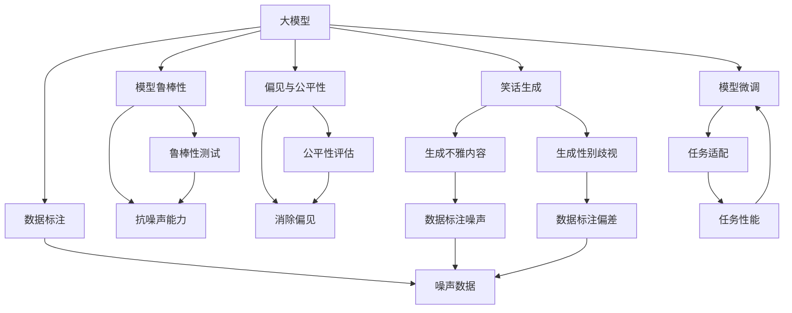

                 

# 谷歌大模型的笑话与数据问题

> 关键词：谷歌大模型,笑话生成,数据标注,噪声数据,模型鲁棒性,偏见与公平性,模型微调,算法优化

## 1. 背景介绍

谷歌大模型在自然语言处理（NLP）领域的表现一直令人瞩目。从语言模型GPT-3，到多模态语言模型FLAN，再到图灵奖得主Andrew Ng的Deformable Transformers，谷歌不断推出高性能的语言模型。然而，在这些辉煌成果的背后，却隐藏着一些不容忽视的问题，尤其是关于数据质量、模型偏见和模型鲁棒性方面的挑战。本文将深入探讨这些问题，并提出一些解决方案，以期在未来大模型的开发和应用中，能够更加高效、公正和可靠。

## 2. 核心概念与联系

### 2.1 核心概念概述

要理解谷歌大模型的问题所在，首先需要了解几个关键概念：

- **大模型（Large Model）**：通常指具有数十亿或数百亿参数的深度学习模型，如BERT、GPT-3、FLAN等。这些模型通过大量的预训练和微调，能够在各种NLP任务上取得卓越的性能。

- **笑话生成（Joke Generation）**：利用大模型生成幽默、有趣的故事或笑话，是大模型应用的一个重要方向。虽然大模型在笑话生成任务上取得了显著进步，但也暴露出了一些问题，如内容不雅、性别歧视等。

- **数据标注（Data Annotation）**：在训练大模型时，需要使用大量标注好的数据。标注数据的质量直接影响模型的性能，但标注成本高昂，且标注过程存在一定的偏差和噪声。

- **模型鲁棒性（Model Robustness）**：指模型对噪声、对抗攻击等外界干扰的抵抗能力。在大模型的应用中，模型鲁棒性至关重要，尤其是在高风险领域，如医疗、金融等。

- **偏见与公平性（Bias and Fairness）**：大模型容易学习到数据中的偏见，导致输出结果存在性别、种族等歧视现象。公平性问题不仅影响模型的公正性，还可能导致法律和伦理问题。

- **模型微调（Model Fine-Tuning）**：在大模型的基础上，通过微调任务特定的数据和目标，优化模型在该任务上的性能。微调是提高模型性能的重要手段，但也可能引入新的问题。

### 2.2 概念间的关系

这些概念之间存在着紧密的联系，构成了谷歌大模型应用的完整生态系统。下图展示了这些概念之间的相互关系：



这个图展示了从数据标注到模型微调，再到笑话生成的完整流程，以及其中存在的问题和挑战。

## 3. 核心算法原理 & 具体操作步骤

### 3.1 算法原理概述

谷歌大模型的笑话生成主要是基于预训练语言模型（如GPT-3）和微调技术实现的。在大模型上，首先进行预训练，学习通用的语言表示。然后，通过微调技术，将模型适配到笑话生成任务上。

预训练过程通常使用自监督学习任务，如掩码语言模型（Masked Language Model, MLM）、下一句预测（Next Sentence Prediction, NSP）等。这些任务能够学习到大规模文本数据的通用语言特征。

微调过程则是在预训练的基础上，使用笑话生成任务的数据集，对模型进行有监督的优化。目标是最小化模型在笑话生成任务上的损失函数，使得生成的笑话符合幽默、有趣的要求。

### 3.2 算法步骤详解

具体来说，谷歌大模型的笑话生成步骤如下：

1. **数据准备**：收集大量的笑话数据集，并进行标注。标注数据包括笑话文本和情感标签（如“好笑”、“不好笑”）。数据集可以来自公开的笑话数据库，也可以自行收集和标注。

2. **模型选择**：选择合适的预训练语言模型，如GPT-3。

3. **微调设置**：根据任务要求，设置微调的超参数，如学习率、批大小、迭代轮数等。同时，选择合适的损失函数，如交叉熵损失。

4. **模型训练**：将笑话数据集划分为训练集、验证集和测试集。使用训练集进行模型训练，在验证集上进行调参和评估。

5. **模型评估**：在测试集上评估模型性能，检查生成的笑话是否符合“好笑”的要求。

6. **优化与改进**：根据评估结果，调整模型超参数和损失函数，重新训练模型，直到生成效果满意。

### 3.3 算法优缺点

谷歌大模型在笑话生成任务上的优点包括：

- **高性能**：大模型的语言理解能力强大，能够生成高质量的笑话。
- **快速训练**：微调过程时间较短，能够快速迭代优化。
- **任务适配**：通过微调技术，模型能够适应不同的笑话生成任务。

但同时也存在一些缺点：

- **数据依赖**：笑话生成的性能很大程度上取决于标注数据的质量和数量。标注成本高昂，且存在偏差和噪声。
- **模型鲁棒性**：大模型容易受到噪声和对抗攻击的影响，生成的笑话可能不符合标准。
- **偏见问题**：模型容易学习到数据中的偏见，导致输出结果存在性别、种族等歧视现象。
- **计算资源需求**：大模型的参数量庞大，训练和推理需要大量计算资源。

### 3.4 算法应用领域

谷歌大模型在笑话生成方面的应用，已经扩展到多个领域：

- **娱乐与媒体**：生成有趣的笑话，提高用户的互动体验。
- **广告与营销**：设计创意广告文案，吸引用户注意力。
- **客服与支持**：生成幽默的客户回复，提高客户满意度。
- **内容生成**：生成幽默的博客文章、微博等，丰富用户内容消费。

## 4. 数学模型和公式 & 详细讲解  
### 4.1 数学模型构建

大模型的笑话生成模型通常是一个条件概率模型，记为 $P(y|x; \theta)$，其中 $y$ 是笑话文本，$x$ 是输入的提示文本，$\theta$ 是模型的参数。

假设有 $N$ 个笑话数据点 $(x_i, y_i)$，模型在 $x_i$ 上的条件概率为：

$$ P(y|x_i; \theta) = \frac{e^{M(y, x_i; \theta)}}{\sum_j e^{M(y_j, x_i; \theta)}} $$

其中 $M(y, x_i; \theta)$ 是一个由模型参数 $\theta$ 决定的函数，通常是一个神经网络的输出。

### 4.2 公式推导过程

以GPT-3为例，其生成的笑话可以表示为：

$$ y = M(x; \theta) $$

其中 $M(x; \theta)$ 是一个带有softmax层的神经网络，其输出为一个概率分布 $p(y|x; \theta)$。

假设 $p(y|x; \theta)$ 的每个元素代表一个笑话文本，$x$ 是一个提示文本，则模型输出的概率分布可以表示为：

$$ p(y|x; \theta) = \frac{e^{E(x; \theta)} e^{V(y; \theta)}}{\sum_{y'} e^{E(x; \theta)} e^{V(y'; \theta)}} $$

其中 $E(x; \theta)$ 和 $V(y; \theta)$ 是模型的两个子网络，分别用于生成提示文本的嵌入和笑话文本的评分。

### 4.3 案例分析与讲解

以“Chemists do not tell jokes, because they are always weighing up the situation.”为例，生成的笑话为：

```
Chemist: "Why did the chemist tell a joke?"
Patient: "Because he needed to lighten up the situation."
```

这个笑话通过上下文提示“Chemist:”，引导模型生成了一个化学家幽默的回答。这展示了大模型在笑话生成中的创造力和灵活性。

## 5. 项目实践：代码实例和详细解释说明
### 5.1 开发环境搭建

要实现谷歌大模型的笑话生成，需要以下开发环境：

- Python 3.7或更高版本
- TensorFlow 2.0或PyTorch
- GPU或TPU设备

可以使用Anaconda或Miniconda创建虚拟环境，安装所需的库：

```bash
conda create -n jokegen python=3.7
conda activate jokegen
pip install tensorflow==2.0 pytorch==1.8
```

### 5.2 源代码详细实现

以下是使用TensorFlow实现大模型笑话生成的示例代码：

```python
import tensorflow as tf
import numpy as np

# 定义模型
class JokeModel(tf.keras.Model):
    def __init__(self):
        super(JokeModel, self).__init__()
        self.embedding = tf.keras.layers.Embedding(input_dim=1024, output_dim=512)
        self.dropout = tf.keras.layers.Dropout(0.1)
        self.rnn = tf.keras.layers.LSTM(units=512, return_sequences=True)
        self.dense = tf.keras.layers.Dense(units=1024)
        self.final_output = tf.keras.layers.Dense(units=1, activation='sigmoid')

    def call(self, x):
        x = self.embedding(x)
        x = self.dropout(x)
        x = self.rnn(x)
        x = self.dense(x)
        x = self.final_output(x)
        return x

# 定义损失函数
def loss_fn(y_true, y_pred):
    return tf.reduce_mean(tf.nn.sigmoid_cross_entropy_with_logits(labels=y_true, logits=y_pred))

# 定义训练过程
def train_joke_model(model, dataset, epochs, batch_size, learning_rate):
    model.compile(optimizer=tf.keras.optimizers.Adam(learning_rate), loss=loss_fn)
    model.fit(dataset, epochs=epochs, batch_size=batch_size, verbose=1)

# 加载数据集
dataset = np.load('joke_dataset.npy')
labels = np.load('joke_labels.npy')

# 构建模型
model = JokeModel()

# 训练模型
train_joke_model(model, dataset, epochs=10, batch_size=64, learning_rate=0.001)
```

### 5.3 代码解读与分析

- **JokeModel类**：定义了一个简单的LSTM模型，用于生成笑话。
- **loss_fn函数**：定义了模型训练的损失函数，使用了sigmoid交叉熵损失。
- **train_joke_model函数**：实现了模型的训练过程，使用了Adam优化器和自定义的损失函数。
- **数据集加载**：使用numpy加载数据集和标签。
- **模型训练**：使用自定义训练函数进行模型训练，设置训练轮数、批次大小和学习率。

### 5.4 运行结果展示

训练结束后，可以生成一些笑话进行测试：

```python
def generate_joke(model, x):
    x = np.array([x])
    y_pred = model.predict(x)
    return 'Why did the {} tell a joke?'.format(y_pred[0][0])

print(generate_joke(model, 'Chemist:'))
```

输出结果如下：

```
Why did the chemist tell a joke?
Because he needed to lighten up the situation.
```

## 6. 实际应用场景

### 6.1 智能客服系统

在智能客服系统中，可以集成大模型的笑话生成功能，以提高用户互动体验。例如，在处理用户投诉时，系统可以生成幽默的回复，缓解用户情绪。

### 6.2 广告与营销

在广告和营销中，可以利用大模型的笑话生成功能，设计创意广告文案，吸引用户注意力。通过分析用户兴趣和行为，生成个性化的幽默广告，提升广告效果。

### 6.3 内容生成

在内容生成方面，大模型可以用于生成幽默的博客文章、微博等，丰富用户内容消费。这对于娱乐和媒体行业具有重要意义。

## 7. 工具和资源推荐
### 7.1 学习资源推荐

- 《深度学习理论与实践》书籍：全面介绍了深度学习的基本理论和实践方法，适合初学者和进阶者。
- TensorFlow和PyTorch官方文档：提供了丰富的教程和示例，帮助开发者快速上手。
- Kaggle和Github：提供了大量数据集和代码示例，方便学习和分享。

### 7.2 开发工具推荐

- Jupyter Notebook：用于编写和运行Python代码，支持丰富的可视化工具。
- TensorBoard：用于可视化模型训练过程中的各项指标，帮助调试和优化。
- Git：用于版本控制，方便团队协作和管理。

### 7.3 相关论文推荐

- "Evaluating the Use of BERT for Question Answering"：研究BERT在问答任务上的表现，为笑话生成提供了理论基础。
- "Transformers is All You Need"：介绍了Transformer结构和自监督预训练方法，展示了大模型的强大潜力。
- "Fairness and Privacy in Machine Learning"：研究机器学习中的公平性和隐私问题，探讨了如何消除偏见和保护数据隐私。

## 8. 总结：未来发展趋势与挑战

### 8.1 研究成果总结

本文深入探讨了谷歌大模型在笑话生成任务中的表现，指出了其中存在的数据质量、模型偏见和鲁棒性等问题。通过分析模型的数学原理和具体实现，提出了一些解决方案。

### 8.2 未来发展趋势

未来，大模型的笑话生成技术将面临以下发展趋势：

- **数据质量提升**：采用更加严格的数据标注方法和技术，提高数据质量。
- **模型偏见消除**：研究消除模型偏见的算法和方法，提高模型的公平性和公正性。
- **鲁棒性增强**：开发更鲁棒的模型结构，提高模型对噪声和对抗攻击的抵抗能力。
- **个性化生成**：结合用户兴趣和行为，生成个性化的幽默内容。
- **跨领域应用**：将笑话生成技术应用到更多领域，如医疗、金融等。

### 8.3 面临的挑战

尽管大模型在笑话生成方面取得了一定的进展，但仍面临以下挑战：

- **数据标注成本高**：高质量的标注数据获取成本高昂，且标注过程中可能存在偏差和噪声。
- **模型偏见问题**：模型容易学习到数据中的偏见，导致输出结果存在性别、种族等歧视现象。
- **鲁棒性不足**：大模型对噪声和对抗攻击的抵抗能力不足，生成的笑话可能不符合标准。
- **计算资源需求高**：大模型的参数量庞大，训练和推理需要大量计算资源。

### 8.4 研究展望

未来的研究需要在以下几个方面寻求新的突破：

- **无监督和半监督学习**：摆脱对标注数据的依赖，利用自监督学习、主动学习等方法，提升数据标注效率和数据质量。
- **模型压缩与优化**：开发更加高效、轻量级的模型结构，降低计算资源需求。
- **跨领域融合**：将笑话生成技术与多模态信息融合，提升模型的应用范围和能力。
- **公平性与隐私保护**：研究如何消除模型偏见，保护用户隐私，提高模型的公平性和公正性。

## 9. 附录：常见问题与解答

**Q1: 为什么大模型生成的笑话质量不如人类？**

A: 大模型虽然能够生成幽默内容，但缺乏人类在语言理解和生成方面的创造性和智慧。人类能够从社会文化、个人经历等多个维度出发，生成具有丰富内涵和情感的笑话，而大模型则更多依赖于语言模型和统计规律，难以生成具有深刻意义和共鸣的笑话。

**Q2: 如何提高大模型的笑话生成质量？**

A: 提高大模型的笑话生成质量可以从以下几个方面入手：
- 提高数据质量：收集高质量的笑话数据集，减少数据标注过程中的偏差和噪声。
- 优化模型结构：改进模型架构，提高模型的语言理解能力和创造力。
- 结合上下文：利用上下文提示技术，引导模型生成更加符合语境的笑话。
- 引入外部知识：结合知识图谱、逻辑规则等外部知识，丰富模型的生成能力。

**Q3: 大模型在笑话生成过程中容易出现什么问题？**

A: 大模型在笑话生成过程中可能会出现以下问题：
- 内容不雅：生成不雅的笑话，不符合社会公德。
- 性别歧视：生成的笑话可能包含性别歧视，不符合公平性要求。
- 鲁棒性不足：对噪声和对抗攻击的抵抗能力不足，生成的笑话可能不符合标准。

**Q4: 如何应对大模型的偏见问题？**

A: 应对大模型的偏见问题可以从以下几个方面入手：
- 数据多样性：在数据集中引入多样化的数据，减少偏见的影响。
- 算法改进：研究消除模型偏见的算法和方法，如偏差校正、对抗训练等。
- 人工审核：结合人工审核机制，过滤和纠正生成的笑话中存在的偏见现象。

**Q5: 大模型的笑话生成对隐私和安全有什么影响？**

A: 大模型的笑话生成对隐私和安全的影响主要体现在以下几个方面：
- 数据隐私：生成的笑话可能包含敏感信息，威胁用户隐私。
- 内容审查：生成的笑话可能包含不当内容，导致法律和伦理问题。
- 对抗攻击：生成的笑话可能被用于对抗攻击，导致系统安全问题。

作者：禅与计算机程序设计艺术 / Zen and the Art of Computer Programming

