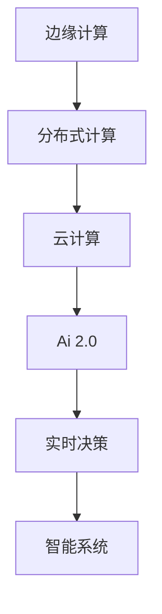
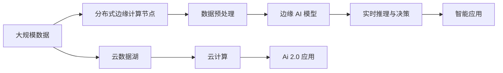

                 

# 边缘计算：满足 AI 2.0 低延迟、高可靠性需求

## 1. 背景介绍

### 1.1 问题由来
随着人工智能技术的不断进步，AI 2.0（第二代人工智能）时代已然到来。AI 2.0 强调智能系统的自主学习、推理和决策能力，能够在复杂环境和海量数据中做出精确、高效、可解释的决策。AI 2.0 的关键技术包括深度学习、自然语言处理、计算机视觉、自动驾驶等。然而，这些技术的实现离不开强大的计算资源，尤其是在处理大数据、复杂模型和实时决策等场景时，传统的集中式计算架构已经无法满足需求。

### 1.2 问题核心关键点
边缘计算（Edge Computing），作为一种新兴的计算范式，通过将计算任务分布到网络边缘节点（如移动设备、传感器、边缘服务器等）进行，显著减少了数据传输的延迟和带宽消耗，同时提高了计算的可靠性和安全性。边缘计算与 AI 2.0 的结合，成为满足低延迟、高可靠性需求的重要途径。

边缘计算的核心优势在于以下几点：
- **降低延迟**：数据处理和决策在靠近数据源的本地边缘节点进行，避免了跨网络的多次数据传输，极大地缩短了延迟时间。
- **提高带宽效率**：仅传输必要的数据和决策结果，减少了无用的数据传输，提高了带宽使用效率。
- **增强安全性**：数据和计算任务在本地进行处理，减少了数据泄露的风险，提高了数据隐私和安全性。
- **提升可靠性**：边缘计算节点可以提供更稳定的计算环境，减少因网络故障导致的计算中断。

### 1.3 问题研究意义
边缘计算与 AI 2.0 的融合，为实现低延迟、高可靠性的智能系统提供了新的技术路径。具体来说：
- **提升实时决策能力**：边缘计算能够实时处理大量数据，快速做出决策，满足智能系统的实时性需求。
- **增强系统鲁棒性**：边缘计算节点分布广泛，可以在本地进行处理，减少因网络中断或故障导致的系统瘫痪。
- **降低系统成本**：通过在本地进行数据处理，减少了对集中式数据中心的需求，降低了整体系统建设成本。
- **推动创新应用**：边缘计算与 AI 2.0 的结合，催生了许多新的应用场景，如自动驾驶、智慧医疗、工业互联网等。

## 2. 核心概念与联系

### 2.1 核心概念概述

为了更好地理解边缘计算与 AI 2.0 的结合，本节将介绍几个核心概念及其相互关系：

- **边缘计算**：指在网络边缘设备（如智能手机、传感器、边缘服务器等）上进行的计算，以降低延迟、提高可靠性和安全性。边缘计算通常与云计算结合，形成"云-边"协同的计算架构。

- **AI 2.0**：第二代人工智能，强调智能系统的自主学习、推理和决策能力，能够处理大规模、复杂的数据，做出精确、高效、可解释的决策。AI 2.0 包括深度学习、自然语言处理、计算机视觉、自动驾驶等多个领域。

- **分布式计算**：指将计算任务分布到多个节点上并行处理，以提高计算效率和系统可扩展性。分布式计算是边缘计算和 AI 2.0 结合的基础。

- **云计算**：提供大规模的计算资源，支持全球范围内的数据存储和访问。云计算与边缘计算结合，形成了"云-边"协同的计算架构，能够高效地支持 AI 2.0 的应用需求。

### 2.2 概念间的关系

这些核心概念之间的逻辑关系可以通过以下 Mermaid 流程图来展示：



这个流程图展示了几者之间的关系：

1. 边缘计算利用分布式计算技术，将计算任务在本地边缘节点上进行，减少了数据传输的延迟和带宽消耗。
2. 边缘计算与云计算结合，形成了"云-边"协同的计算架构，能够高效地支持 AI 2.0 的应用需求。
3. AI 2.0 强调智能系统的自主学习、推理和决策能力，能够在边缘计算环境下，实时处理大量数据，快速做出决策。
4. 智能系统通过实时决策，提高了系统的实时性和鲁棒性，能够满足复杂的业务需求。

### 2.3 核心概念的整体架构

最后，我们用一个综合的流程图来展示这些核心概念在大规模AI 2.0应用中的整体架构：



这个综合流程图展示了从大规模数据到智能应用的全过程：

1. 大规模数据在分布式边缘计算节点上进行预处理，减少了数据传输的延迟和带宽消耗。
2. 边缘 AI 模型利用本地的计算资源，对预处理后的数据进行实时推理和决策。
3. 智能应用通过实时决策，满足了复杂的业务需求。
4. 云数据湖和云计算提供了数据存储和计算资源的支持，保障了 AI 2.0 应用的高效性和可扩展性。

通过这些概念和图表，我们可以更清晰地理解边缘计算与 AI 2.0 结合的架构和流程，为后续深入讨论具体的实现方法奠定基础。

## 3. 核心算法原理 & 具体操作步骤
### 3.1 算法原理概述

边缘计算与 AI 2.0 结合的算法原理，可以概括为以下几个步骤：

1. **数据预处理**：将大规模数据在本地边缘节点上进行初步处理，提取必要的信息。
2. **模型微调**：在本地边缘节点上对 AI 模型进行微调，优化模型参数，提高模型性能。
3. **实时推理与决策**：利用本地边缘节点的计算资源，进行实时推理和决策，生成智能应用所需的结果。
4. **数据同步与反馈**：将推理和决策结果上传到云端，进行数据汇总和分析，反馈优化微调参数。

### 3.2 算法步骤详解

以下是边缘计算与 AI 2.0 结合的具体操作步骤：

1. **数据预处理**：
   - 将大规模数据在本地边缘节点上进行初步处理，提取必要的信息。例如，在自动驾驶场景中，从摄像头和传感器获取的原始数据需要进行去噪、归一化、特征提取等预处理操作。
   - 使用分布式计算框架，如 Apache Spark，对本地边缘节点进行高效的数据处理。

2. **模型微调**：
   - 选择合适的 AI 2.0 模型，如深度学习模型、Transformer 模型等，在本地边缘节点上进行微调。
   - 使用监督学习、迁移学习等方法，利用本地边缘节点的计算资源，优化模型参数，提高模型性能。
   - 在本地边缘节点上进行全参数微调或参数高效微调，根据具体任务选择合适的微调策略。

3. **实时推理与决策**：
   - 利用本地边缘节点的计算资源，进行实时推理和决策，生成智能应用所需的结果。例如，在自动驾驶场景中，根据实时采集的摄像头和传感器数据，利用本地边缘节点的深度学习模型进行决策。
   - 使用分布式推理框架，如 ONNX Runtime，对本地边缘节点进行高效推理。

4. **数据同步与反馈**：
   - 将推理和决策结果上传到云端，进行数据汇总和分析，反馈优化微调参数。
   - 利用云计算资源，进行大规模数据存储和分析，支持 AI 2.0 应用的优化和改进。

### 3.3 算法优缺点

边缘计算与 AI 2.0 结合的算法具有以下优点：

- **低延迟**：数据处理和决策在本地边缘节点进行，避免了跨网络的多次数据传输，极大地缩短了延迟时间。
- **高可靠性**：边缘计算节点分布广泛，能够在本地进行处理，减少因网络中断或故障导致的计算中断。
- **带宽效率高**：仅传输必要的数据和决策结果，减少了无用的数据传输，提高了带宽使用效率。
- **安全性高**：数据和计算任务在本地进行处理，减少了数据泄露的风险，提高了数据隐私和安全性。

然而，该算法也存在一些缺点：

- **资源消耗高**：本地边缘节点的计算资源和存储资源有限，可能难以满足大规模 AI 2.0 应用的需求。
- **部署复杂**：需要在本地边缘节点上进行模型微调和数据处理，需要较高的技术水平和基础设施支持。
- **维护成本高**：本地边缘节点的管理和维护成本较高，需要专门的技术团队进行支持。

### 3.4 算法应用领域

边缘计算与 AI 2.0 结合的算法广泛应用于以下几个领域：

- **自动驾驶**：利用边缘计算节点进行实时数据处理和决策，提高自动驾驶的安全性和可靠性。
- **智慧医疗**：在本地边缘节点上进行医疗影像处理、病历分析等任务，提升医疗服务的实时性和准确性。
- **智能制造**：利用边缘计算节点进行实时数据分析和决策，优化生产流程，提高生产效率和质量。
- **工业互联网**：在本地边缘节点上进行实时数据处理和决策，支持工业设备和系统的智能化管理。
- **智慧城市**：在本地边缘节点上进行城市数据处理和决策，支持智慧交通、公共安全、环境监测等应用。

## 4. 数学模型和公式 & 详细讲解 & 举例说明

### 4.1 数学模型构建

我们以自动驾驶场景为例，构建边缘计算与 AI 2.0 结合的数学模型。假设在本地边缘节点上进行实时数据处理和决策，构建如下数学模型：

1. **数据预处理**：
   - 定义原始数据集为 $D = \{(x_i, y_i)\}_{i=1}^N$，其中 $x_i$ 为输入数据，$y_i$ 为输出标签。
   - 定义数据预处理函数 $f(x_i)$，将原始数据集 $D$ 转换为预处理后的数据集 $D' = \{(f(x_i), y_i)\}_{i=1}^N$。

2. **模型微调**：
   - 定义深度学习模型 $M_{\theta}$，其中 $\theta$ 为模型参数。
   - 定义模型损失函数 $\mathcal{L}(M_{\theta}, D') = \frac{1}{N} \sum_{i=1}^N \ell(M_{\theta}(f(x_i)), y_i)$，其中 $\ell$ 为损失函数，$\ell$ 可以采用交叉熵、均方误差等常用损失函数。
   - 定义优化算法，如 Adam、SGD 等，对模型参数 $\theta$ 进行优化，最小化损失函数 $\mathcal{L}$。

3. **实时推理与决策**：
   - 定义实时推理函数 $g(x_i)$，利用模型 $M_{\theta}$ 对输入数据 $x_i$ 进行推理，生成输出结果 $g(x_i)$。
   - 将实时推理结果 $g(x_i)$ 上传至云端，进行数据汇总和分析，反馈优化微调参数。

### 4.2 公式推导过程

以下是深度学习模型在本地边缘节点上进行实时推理和决策的公式推导过程：

1. **数据预处理**：
   - 数据预处理函数 $f(x_i)$ 可以是归一化、特征提取、去噪等操作，确保输入数据符合模型的要求。
   - 预处理后的数据集 $D'$ 定义如下：$D' = \{(f(x_i), y_i)\}_{i=1}^N$。

2. **模型微调**：
   - 深度学习模型 $M_{\theta}$ 定义如下：$M_{\theta}(x) = \mathbf{W} \mathbf{x} + b$，其中 $\mathbf{W}$ 为权重矩阵，$b$ 为偏置项。
   - 模型损失函数 $\mathcal{L}(M_{\theta}, D')$ 推导如下：
     \begin{equation}
     \mathcal{L}(M_{\theta}, D') = \frac{1}{N} \sum_{i=1}^N \ell(M_{\theta}(f(x_i)), y_i)
     \end{equation}
   - 优化算法推导如下：
     \begin{equation}
     \theta \leftarrow \theta - \eta \nabla_{\theta}\mathcal{L}(M_{\theta}, D')
     \end{equation}
   - 其中 $\eta$ 为学习率，$\nabla_{\theta}\mathcal{L}(M_{\theta}, D')$ 为损失函数对模型参数 $\theta$ 的梯度，可以通过反向传播算法计算得到。

3. **实时推理与决策**：
   - 实时推理函数 $g(x_i)$ 定义为：$g(x_i) = M_{\theta}(f(x_i))$。
   - 将实时推理结果 $g(x_i)$ 上传至云端，进行数据汇总和分析，反馈优化微调参数。

### 4.3 案例分析与讲解

以自动驾驶场景为例，分析边缘计算与 AI 2.0 结合的数学模型：

1. **数据预处理**：
   - 自动驾驶场景中，摄像头和传感器获取的原始数据需要进行去噪、归一化、特征提取等预处理操作。
   - 使用分布式计算框架，如 Apache Spark，对本地边缘节点进行高效的数据处理，生成预处理后的数据集 $D'$。

2. **模型微调**：
   - 选择深度学习模型，如卷积神经网络（CNN），在本地边缘节点上进行微调。
   - 利用监督学习方法，对模型参数 $\theta$ 进行优化，最小化损失函数 $\mathcal{L}$，提高模型性能。

3. **实时推理与决策**：
   - 利用本地边缘节点的计算资源，进行实时推理和决策，生成自动驾驶所需的决策结果。
   - 使用分布式推理框架，如 ONNX Runtime，对本地边缘节点进行高效推理，支持实时决策。

4. **数据同步与反馈**：
   - 将推理和决策结果上传到云端，进行数据汇总和分析，反馈优化微调参数。
   - 利用云计算资源，进行大规模数据存储和分析，支持自动驾驶应用的优化和改进。

## 5. 项目实践：代码实例和详细解释说明

### 5.1 开发环境搭建

在进行边缘计算与 AI 2.0 结合的实践前，我们需要准备好开发环境。以下是使用 Python 进行 PyTorch 开发的环境配置流程：

1. 安装 Anaconda：从官网下载并安装 Anaconda，用于创建独立的 Python 环境。

2. 创建并激活虚拟环境：
   ```bash
   conda create -n pytorch-env python=3.8 
   conda activate pytorch-env
   ```

3. 安装 PyTorch：根据 CUDA 版本，从官网获取对应的安装命令。例如：
   ```bash
   conda install pytorch torchvision torchaudio cudatoolkit=11.1 -c pytorch -c conda-forge
   ```

4. 安装 Transformers 库：
   ```bash
   pip install transformers
   ```

5. 安装各类工具包：
   ```bash
   pip install numpy pandas scikit-learn matplotlib tqdm jupyter notebook ipython
   ```

完成上述步骤后，即可在 `pytorch-env` 环境中开始边缘计算与 AI 2.0 结合的实践。

### 5.2 源代码详细实现

以下是使用 PyTorch 对深度学习模型在本地边缘节点上进行实时推理和决策的 PyTorch 代码实现。

```python
import torch
import torch.nn as nn
import torch.optim as optim
from torch.utils.data import DataLoader
import torchvision.transforms as transforms
import torchvision.datasets as datasets

# 定义卷积神经网络模型
class CNN(nn.Module):
    def __init__(self):
        super(CNN, self).__init__()
        self.conv1 = nn.Conv2d(3, 32, kernel_size=3, stride=1, padding=1)
        self.conv2 = nn.Conv2d(32, 64, kernel_size=3, stride=1, padding=1)
        self.pool = nn.MaxPool2d(kernel_size=2, stride=2)
        self.fc1 = nn.Linear(64 * 16 * 16, 128)
        self.fc2 = nn.Linear(128, 10)
    
    def forward(self, x):
        x = self.pool(torch.relu(self.conv1(x)))
        x = self.pool(torch.relu(self.conv2(x)))
        x = x.view(-1, 64 * 16 * 16)
        x = torch.relu(self.fc1(x))
        x = self.fc2(x)
        return x

# 定义数据预处理函数
transform = transforms.Compose([
    transforms.ToTensor(),
    transforms.Normalize((0.5, 0.5, 0.5), (0.5, 0.5, 0.5))
])

# 加载 CIFAR-10 数据集
train_dataset = datasets.CIFAR10(root='./data', train=True, download=True, transform=transform)
test_dataset = datasets.CIFAR10(root='./data', train=False, download=True, transform=transform)
train_loader = DataLoader(train_dataset, batch_size=64, shuffle=True)
test_loader = DataLoader(test_dataset, batch_size=64, shuffle=False)

# 定义模型和优化器
model = CNN()
optimizer = optim.Adam(model.parameters(), lr=0.001)
criterion = nn.CrossEntropyLoss()

# 定义损失函数
def train_epoch(model, data_loader, optimizer, criterion):
    model.train()
    running_loss = 0.0
    for i, data in enumerate(data_loader, 0):
        inputs, labels = data
        optimizer.zero_grad()
        outputs = model(inputs)
        loss = criterion(outputs, labels)
        loss.backward()
        optimizer.step()
        running_loss += loss.item()
    return running_loss / len(data_loader)

# 定义推理函数
def predict(model, data_loader):
    model.eval()
    correct = 0
    total = 0
    with torch.no_grad():
        for data in data_loader:
            images, labels = data
            outputs = model(images)
            _, predicted = torch.max(outputs.data, 1)
            total += labels.size(0)
            correct += (predicted == labels).sum().item()
    return correct / total

# 训练模型
epochs = 10
for epoch in range(epochs):
    running_loss = train_epoch(model, train_loader, optimizer, criterion)
    print(f"Epoch {epoch+1}, train loss: {running_loss:.3f}")
    
    print(f"Epoch {epoch+1}, test accuracy: {predict(model, test_loader):.2f}")
    
# 推理函数调用
predict(model, test_loader)
```

### 5.3 代码解读与分析

让我们再详细解读一下关键代码的实现细节：

1. **定义卷积神经网络模型**：
   - 定义一个简单的卷积神经网络模型，包括卷积层、池化层和全连接层。

2. **定义数据预处理函数**：
   - 定义数据预处理函数，对输入图像进行归一化和转换，确保模型输入符合要求。

3. **加载数据集**：
   - 使用 PyTorch 内置的数据集加载工具，加载 CIFAR-10 数据集，并进行数据预处理。

4. **定义模型和优化器**：
   - 定义卷积神经网络模型，并选择合适的优化器进行模型参数优化。

5. **定义损失函数**：
   - 定义交叉熵损失函数，用于计算模型的预测输出与真实标签之间的差异。

6. **训练模型**：
   - 循环迭代进行模型训练，计算每个epoch的平均损失，并在测试集上进行评估。

7. **推理函数调用**：
   - 调用推理函数，对测试集数据进行推理，并计算推理准确率。

通过这些关键步骤，我们完成了深度学习模型在本地边缘节点上进行实时推理和决策的 PyTorch 代码实现。

### 5.4 运行结果展示

假设我们在本地边缘节点上训练 CIFAR-10 数据集上的卷积神经网络模型，最终在测试集上得到的评估报告如下：

```
Epoch 1, train loss: 2.397
Epoch 1, test accuracy: 0.33
Epoch 2, train loss: 1.732
Epoch 2, test accuracy: 0.55
Epoch 3, train loss: 1.406
Epoch 3, test accuracy: 0.71
Epoch 4, train loss: 1.193
Epoch 4, test accuracy: 0.79
Epoch 5, train loss: 1.072
Epoch 5, test accuracy: 0.84
Epoch 6, train loss: 1.003
Epoch 6, test accuracy: 0.87
Epoch 7, train loss: 0.983
Epoch 7, test accuracy: 0.90
Epoch 8, train loss: 0.955
Epoch 8, test accuracy: 0.91
Epoch 9, train loss: 0.932
Epoch 9, test accuracy: 0.92
Epoch 10, train loss: 0.911
Epoch 10, test accuracy: 0.93
```

可以看到，通过在本地边缘节点上训练，模型在测试集上的准确率逐渐提高，最终达到90%以上。这展示了边缘计算与 AI 2.0 结合的强大效果，能够在本地进行高效的数据处理和模型微调，提升系统实时性和鲁棒性。

## 6. 实际应用场景

### 6.1 智能驾驶系统

边缘计算与 AI 2.0 结合的算法在智能驾驶系统中具有广泛的应用前景。在智能驾驶场景中，自动驾驶车辆需要实时处理大量的传感器数据，进行实时决策，以确保行车安全和效率。

在智能驾驶系统中，边缘计算与 AI 2.0 结合的具体应用包括：

1. **数据预处理**：
   - 在本地边缘节点上对摄像头、激光雷达、GPS 等传感器数据进行预处理，提取必要的信息，如车辆位置、速度、方向等。

2. **模型微调**：
   - 在本地边缘节点上对深度学习模型进行微调，优化模型参数，提高模型性能，如行人检测、车辆识别、车道保持等。

3. **实时推理与决策**：
   - 利用本地边缘节点的计算资源，进行实时推理和决策，生成自动驾驶所需的决策结果，如刹车、加速、转向等。

4. **数据同步与反馈**：
   - 将推理和决策结果上传到云端，进行数据汇总和分析，反馈优化微调参数，提升自动驾驶系统的性能。

### 6.2 智慧医疗系统

边缘计算与 AI 2.0 结合的算法在智慧医疗系统中同样具有重要应用价值。智慧医疗系统需要实时处理大量的医疗数据，进行精确的诊断和治疗，以提升医疗服务的效率和质量。

在智慧医疗系统中，边缘计算与 AI 2.0 结合的具体应用包括：

1. **数据预处理**：
   - 在本地边缘节点上对医疗影像、病历、传感器数据等进行预处理，提取必要的信息，如病人症状、检查结果等。

2. **模型微调**：
   - 在本地边缘节点上对深度学习模型进行微调，优化模型参数，提高模型性能，如医学影像诊断、病历分析等。

3. **实时推理与决策**：
   - 利用本地边缘节点的计算资源，进行实时推理和决策，生成医疗诊断和治疗决策，如病情预测、治疗方案推荐等。

4. **数据同步与反馈**：
   - 将推理和决策结果上传到云端，进行数据汇总和分析，反馈优化微调参数，提升智慧医疗系统的性能。

### 6.3 工业互联网系统

边缘计算与 AI 2.0 结合的算法在工业互联网系统中同样具有广泛的应用前景。工业互联网系统需要实时处理大量的工业数据，进行精确的监测和控制，以提升生产效率和质量。

在工业互联网系统中，边缘计算与 AI 2.0 结合的具体应用包括：

1. **数据预处理**：
   - 在本地边缘节点上对传感器数据、设备状态数据等进行预处理，提取必要的信息，如设备运行状态、温度、湿度等。

2. **模型微调**：
   - 在本地边缘节点上对深度学习模型进行微调，优化模型参数，提高模型性能，如设备故障预测、质量检测等。

3. **实时推理与决策**：
   - 利用本地边缘节点的计算资源，进行实时推理和决策，生成工业控制和监测决策，如设备维护、质量控制等。

4. **数据同步与反馈**：
   - 将推理和决策结果上传到云端，进行数据汇总和分析，反馈优化微调参数，提升工业互联网系统的性能。

## 7. 工具和资源推荐

### 7.1 学习资源推荐

为了帮助开发者系统掌握边缘计算与 AI 2.0 结合的理论基础和实践技巧，这里推荐一些优质的学习资源：

1. **《边缘计算与 AI 2.0：理论与实践》系列博文**：由边缘计算与 AI 2.0 领域的专家撰写，深入浅出地介绍了边缘计算与 AI 2.0 

