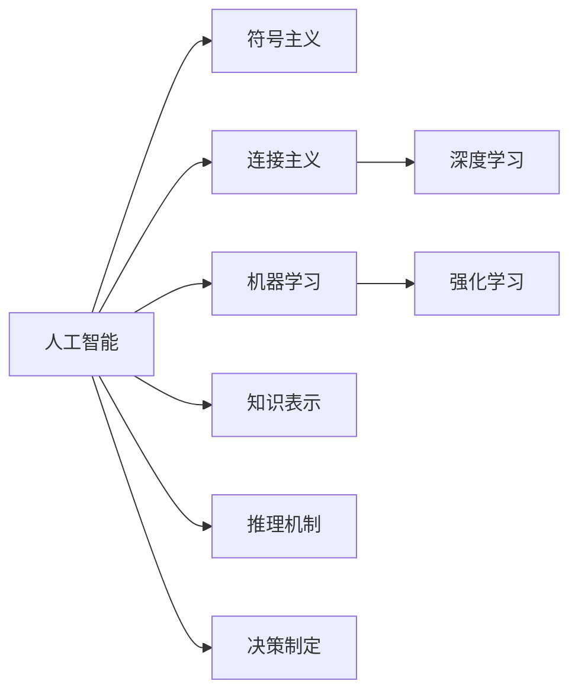

                 

# 达特茅斯会议的历史影响

## 1. 背景介绍

### 1.1 问题由来
1955年夏天，来自哈佛大学、麻省理工学院和达特茅斯学院的研究人员，聚集在新罕布什尔州的达特茅斯学院，共同探讨计算机科学和人工智能的未来方向。这次会议标志着人工智能的诞生，也奠定了计算机科学发展的基石。

### 1.2 问题核心关键点
达特茅斯会议的核心议题包括：
- 什么是人工智能？
- 人工智能的目标是什么？
- 如何构建智能机器？
- 人工智能的应用领域有哪些？

### 1.3 问题研究意义
达特茅斯会议对计算机科学和人工智能的发展产生了深远影响：
- 明确了人工智能的研究目标和方法，推动了AI理论体系的建立。
- 聚集了当时世界顶尖的AI专家，形成了初步的AI研究团队和学术交流平台。
- 会议成果为后续AI技术的开发和应用奠定了基础，催生了众多经典的研究方向和应用领域。

## 2. 核心概念与联系

### 2.1 核心概念概述

为了更好地理解达特茅斯会议的影响，我们先介绍几个核心概念：

- 人工智能(Artificial Intelligence, AI)：指利用计算机科学和工程方法，构建能够模拟人类智能行为的系统，包括学习、推理、感知等能力。
- 符号主义(Symbolic AI)：早期的AI研究方法，通过符号逻辑和知识库实现推理和决策，具有较强的可解释性。
- 连接主义(Connectist AI)：基于神经网络和联结主义的思想，通过模仿人类神经系统的工作原理，实现学习和推理。
- 机器学习(Machine Learning)：指通过数据驱动的方法，让机器从经验中学习并改进性能，是现代AI研究的重要分支。
- 深度学习(Deep Learning)：一种特殊的机器学习方法，通过多层次神经网络实现高效的特征提取和模式识别。
- 强化学习(Reinforcement Learning)：通过与环境的交互，使机器学习最优策略，适用于复杂的决策问题。

这些概念之间存在着紧密的联系，形成了AI研究的基础框架。

### 2.2 概念间的关系

这些核心概念之间的关系可以通过以下Mermaid流程图来展示：



这个流程图展示了一个完整的AI研究框架：

- 人工智能(AI)是核心，包含多个研究方向和方法。
- 符号主义(Symbolic AI)和连接主义(Connectist AI)是早期的AI研究方法。
- 机器学习(Machine Learning)和深度学习(Deep Learning)是现代AI研究的重要分支。
- 强化学习(Reinforcement Learning)适用于复杂的决策问题。
- 知识表示(Knowledge Representation)、推理机制(Reasoning Mechanism)和决策制定(Decision Making)是AI实现的关键技术。

通过理解这些核心概念，我们可以更好地把握AI的发展脉络和应用方向。

### 2.3 核心概念的整体架构

最后，我们用一个综合的流程图来展示这些核心概念在大会议中的作用和影响：

```mermaid
graph LR
    A[达特茅斯会议] --> B[人工智能]
    B --> C[符号主义]
    B --> D[连接主义]
    B --> E[机器学习]
    B --> F[深度学习]
    B --> G[强化学习]
    A --> H[知识表示]
    A --> I[推理机制]
    A --> J[决策制定]
    H --> K[专家系统]
    I --> L[专家系统]
    J --> M[专家系统]
    C --> N[专家系统]
    D --> O[专家系统]
    E --> P[专家系统]
    F --> Q[专家系统]
    G --> R[专家系统]
    L --> S[专家系统]
    M --> T[专家系统]
    P --> U[专家系统]
    Q --> V[专家系统]
    R --> W[专家系统]
    S --> X[专家系统]
    T --> Y[专家系统]
    U --> Z[专家系统]
    V --> [专家系统]
    W --> [][专家系统]
    X --> [][专家系统]
    Y --> [][专家系统]
    Z --> [][专家系统]
```

这个流程图展示了大会议对专家系统等AI应用方向的影响，以及符号主义、连接主义等早期AI方法对现代AI研究的重要贡献。

## 3. 核心算法原理 & 具体操作步骤
### 3.1 算法原理概述

达特茅斯会议的核心算法原理包括以下几个方面：

1. **符号主义**：通过符号逻辑和知识库实现推理和决策，具有较强的可解释性。
2. **连接主义**：基于神经网络和联结主义的思想，通过模仿人类神经系统的工作原理，实现学习和推理。
3. **机器学习**：通过数据驱动的方法，让机器从经验中学习并改进性能，是现代AI研究的重要分支。
4. **深度学习**：一种特殊的机器学习方法，通过多层次神经网络实现高效的特征提取和模式识别。
5. **强化学习**：通过与环境的交互，使机器学习最优策略，适用于复杂的决策问题。

### 3.2 算法步骤详解

1. **符号主义**：
   - 建立符号逻辑系统，定义事实和规则。
   - 使用推理引擎实现符号计算。
   - 构建知识库，存储领域知识和专家经验。

2. **连接主义**：
   - 设计神经网络结构，包括输入层、隐藏层和输出层。
   - 使用反向传播算法训练网络，调整权重和偏置。
   - 应用神经网络实现图像识别、自然语言处理等任务。

3. **机器学习**：
   - 收集训练数据，并进行预处理。
   - 选择合适的算法（如线性回归、决策树、支持向量机等）进行训练。
   - 评估模型性能，进行调优和优化。

4. **深度学习**：
   - 设计多层神经网络模型，包括卷积层、池化层和全连接层。
   - 使用梯度下降等优化算法训练网络。
   - 应用深度学习实现图像分类、语音识别、自然语言处理等任务。

5. **强化学习**：
   - 定义环境状态和动作空间。
   - 设计奖励函数，定义学习目标。
   - 使用Q-learning、SARSA等算法进行训练，优化策略函数。

### 3.3 算法优缺点

**符号主义的优点**：
- 具有较强的可解释性，易于理解和调试。
- 适用于规则明确、结构化的任务。

**符号主义的缺点**：
- 知识获取困难，需要大量专家参与。
- 难以处理模糊和不确定性。

**连接主义的优点**：
- 能处理复杂的数据结构，具有较好的泛化能力。
- 适用于大规模数据集，易于并行处理。

**连接主义的缺点**：
- 模型训练和调试较为困难，需要大量计算资源。
- 缺乏可解释性，难以理解内部机制。

**机器学习的优点**：
- 能够处理大规模数据集，适用于复杂任务。
- 能够自动发现特征，减少人工干预。

**机器学习的缺点**：
- 需要大量标注数据，数据获取困难。
- 模型泛化能力受数据分布影响。

**深度学习的优点**：
- 能够自动提取高维特征，适用于图像、语音等非结构化数据。
- 适用于大规模数据集，具有较好的泛化能力。

**深度学习的缺点**：
- 模型训练和调试困难，需要大量计算资源。
- 缺乏可解释性，难以理解内部机制。

**强化学习的优点**：
- 能够处理复杂决策问题，具有较好的鲁棒性。
- 能够动态调整策略，适应环境变化。

**强化学习的缺点**：
- 需要大量计算资源和环境，训练过程耗时较长。
- 缺乏可解释性，难以理解内部机制。

### 3.4 算法应用领域

**符号主义**：
- 专家系统、逻辑推理、定理证明等。

**连接主义**：
- 图像识别、自然语言处理、语音识别等。

**机器学习**：
- 推荐系统、文本分类、异常检测等。

**深度学习**：
- 计算机视觉、自然语言处理、语音识别等。

**强化学习**：
- 游戏AI、机器人控制、自动驾驶等。

## 4. 数学模型和公式 & 详细讲解 & 举例说明

### 4.1 数学模型构建

达特茅斯会议的数学模型主要基于以下模型：

- 符号主义：逻辑代数和布尔代数。
- 连接主义：神经网络模型。
- 机器学习：监督学习、无监督学习、半监督学习等。
- 深度学习：多层神经网络模型。
- 强化学习：马尔可夫决策过程(MDP)。

### 4.2 公式推导过程

以下我们以神经网络为例，推导连接主义的基本数学模型。

假设神经网络有$n$个隐藏层节点，$k$个输出层节点，输入数据为$x$，输出为$y$。则神经网络的数学模型为：

$$
y = \sigma(W_{out} \cdot \sigma(W_{hidden} \cdot x + b_{hidden}) + b_{out})
$$

其中，$W_{hidden}$和$b_{hidden}$分别为隐藏层的权重和偏置，$W_{out}$和$b_{out}$分别为输出层的权重和偏置，$\sigma$为激活函数（如Sigmoid、ReLU等）。

### 4.3 案例分析与讲解

假设我们有一个简单的二分类任务，输入为手写数字图像，输出为0或1。使用多层神经网络进行分类，可以设计如下模型：

- 输入层：将28x28的图像展开为784维向量。
- 隐藏层：设计3个全连接层，每层256个神经元，使用ReLU激活函数。
- 输出层：设计1个神经元，使用Sigmoid激活函数。

训练过程如下：

1. 使用随机梯度下降算法，对模型进行迭代优化。
2. 计算损失函数（如交叉熵损失），并反向传播更新权重和偏置。
3. 使用测试集评估模型性能，进行调优和优化。

通过不断迭代优化，最终得到一个能够高效分类手写数字图像的神经网络模型。

## 5. 项目实践：代码实例和详细解释说明

### 5.1 开发环境搭建

在进行神经网络项目实践前，我们需要准备好开发环境。以下是使用Python进行PyTorch开发的环境配置流程：

1. 安装Anaconda：从官网下载并安装Anaconda，用于创建独立的Python环境。

2. 创建并激活虚拟环境：
```bash
conda create -n pytorch-env python=3.8 
conda activate pytorch-env
```

3. 安装PyTorch：根据CUDA版本，从官网获取对应的安装命令。例如：
```bash
conda install pytorch torchvision torchaudio cudatoolkit=11.1 -c pytorch -c conda-forge
```

4. 安装Tensorflow：如果需要进行跨平台实验，可以使用Tensorflow。
```bash
pip install tensorflow
```

5. 安装各类工具包：
```bash
pip install numpy pandas scikit-learn matplotlib tqdm jupyter notebook ipython
```

完成上述步骤后，即可在`pytorch-env`环境中开始神经网络项目的开发。

### 5.2 源代码详细实现

这里我们以手写数字图像分类为例，使用PyTorch实现一个简单的多层神经网络模型。

首先，定义神经网络类：

```python
import torch
import torch.nn as nn
import torch.optim as optim
import torchvision
import torchvision.transforms as transforms

class NeuralNet(nn.Module):
    def __init__(self, input_size, hidden_size, num_classes):
        super(NeuralNet, self).__init__()
        self.fc1 = nn.Linear(input_size, hidden_size)
        self.relu = nn.ReLU()
        self.fc2 = nn.Linear(hidden_size, num_classes)
        
    def forward(self, x):
        out = self.fc1(x)
        out = self.relu(out)
        out = self.fc2(out)
        return out
```

然后，定义数据处理函数：

```python
transform = transforms.Compose(
    [transforms.ToTensor(),
     transforms.Normalize((0.5,), (0.5,))])

trainset = torchvision.datasets.MNIST(root='./data', train=True,
                                     download=True, transform=transform)
trainloader = torch.utils.data.DataLoader(trainset, batch_size=64,
                                          shuffle=True, num_workers=2)

testset = torchvision.datasets.MNIST(root='./data', train=False,
                                    download=True, transform=transform)
testloader = torch.utils.data.DataLoader(testset, batch_size=64,
                                        shuffle=False, num_workers=2)
```

接着，定义训练和评估函数：

```python
device = torch.device('cuda' if torch.cuda.is_available() else 'cpu')

def train(model, trainloader, optimizer, criterion, num_epochs):
    for epoch in range(num_epochs):
        running_loss = 0.0
        for i, data in enumerate(trainloader, 0):
            inputs, labels = data
            inputs, labels = inputs.to(device), labels.to(device)
            optimizer.zero_grad()
            outputs = model(inputs)
            loss = criterion(outputs, labels)
            loss.backward()
            optimizer.step()
            running_loss += loss.item()
        print('Epoch %d loss: %.3f' % (epoch + 1, running_loss / len(trainloader)))

def test(model, testloader, criterion):
    correct = 0
    total = 0
    with torch.no_grad():
        for data in testloader:
            images, labels = data
            images, labels = images.to(device), labels.to(device)
            outputs = model(images)
            _, predicted = torch.max(outputs.data, 1)
            total += labels.size(0)
            correct += (predicted == labels).sum().item()
    print('Accuracy of the network on the 10000 test images: %d %%' % (100 * correct / total))
```

最后，启动训练流程并在测试集上评估：

```python
input_size = 784
hidden_size = 500
num_classes = 10

model = NeuralNet(input_size, hidden_size, num_classes)
optimizer = optim.SGD(model.parameters(), lr=0.01, momentum=0.9)
criterion = nn.CrossEntropyLoss()

train(model, trainloader, optimizer, criterion, num_epochs=10)
test(model, testloader, criterion)
```

以上就是使用PyTorch实现多层神经网络分类的完整代码实现。可以看到，得益于PyTorch的强大封装，我们可以用相对简洁的代码完成神经网络的加载和训练。

### 5.3 代码解读与分析

让我们再详细解读一下关键代码的实现细节：

**NeuralNet类**：
- `__init__`方法：初始化模型参数，包括两个全连接层和一个ReLU激活函数。
- `forward`方法：定义前向传播过程，计算输出。

**trainset和testset**：
- 定义了训练集和测试集的数据处理流程，将原始数据转换为张量，并进行标准化。
- 定义了数据加载器，设置批大小和shuffle策略。

**train和test函数**：
- 使用GPU进行加速计算。
- 在训练函数中，循环迭代每个批次，计算损失并更新模型参数。
- 在测试函数中，计算模型在测试集上的准确率。

**训练流程**：
- 定义模型参数、优化器、损失函数和训练轮数。
- 启动训练过程，在每个epoch结束时输出训练loss。
- 在测试集上评估模型性能，输出准确率。

可以看到，PyTorch配合TensorFlow等深度学习框架，使得神经网络项目的开发变得简洁高效。开发者可以将更多精力放在模型改进和数据处理上，而不必过多关注底层实现细节。

## 6. 实际应用场景

### 6.1 计算机视觉

神经网络在计算机视觉领域有着广泛的应用，例如图像分类、目标检测、图像生成等。通过不断优化神经网络结构和训练策略，可以实现更加高效、精准的视觉任务处理。

**图像分类**：将图像数据输入神经网络，通过softmax分类器输出类别概率，选择概率最高的类别作为预测结果。

**目标检测**：在图像中标注出目标物体的位置和类别，通过RoI池化和分类器输出结果。

**图像生成**：使用生成对抗网络(GAN)等模型，生成与真实图像难以区分的虚假图像。

### 6.2 自然语言处理

神经网络在自然语言处理领域也有着广泛的应用，例如文本分类、机器翻译、情感分析等。通过自然语言嵌入和序列模型，可以高效地处理自然语言数据。

**文本分类**：将文本数据输入神经网络，通过softmax分类器输出类别概率，选择概率最高的类别作为预测结果。

**机器翻译**：将源语言文本转换为目标语言文本，使用序列到序列模型进行翻译。

**情感分析**：分析文本中的情感倾向，使用二分类或多分类模型进行情感预测。

### 6.3 机器人控制

神经网络在机器人控制领域也有着广泛的应用，例如路径规划、避障导航、运动控制等。通过学习环境模型和行为策略，可以实现智能机器人的自主决策和执行。

**路径规划**：使用神经网络学习环境地图，生成最优路径。

**避障导航**：使用神经网络学习避障策略，避免碰撞。

**运动控制**：使用神经网络控制机器人的动作，实现自主运动。

### 6.4 未来应用展望

随着神经网络技术的不断进步，未来在更多领域将有更多应用：

- 医疗领域：神经网络可以帮助分析医疗影像，辅助诊断疾病。
- 金融领域：神经网络可以进行市场预测和风险评估，提供投资建议。
- 教育领域：神经网络可以进行智能辅导和个性化教育，提高教学效果。
- 农业领域：神经网络可以进行土壤分析和水资源管理，提高农业生产效率。
- 游戏领域：神经网络可以进行游戏AI开发，提高游戏体验。

## 7. 工具和资源推荐
### 7.1 学习资源推荐

为了帮助开发者系统掌握神经网络的理论基础和实践技巧，这里推荐一些优质的学习资源：

1. 《深度学习》系列书籍：Ian Goodfellow、Yoshua Bengio、Aaron Courville合著的经典教材，深入浅出地介绍了深度学习的基本原理和应用。
2. CS231n《卷积神经网络》课程：斯坦福大学开设的计算机视觉课程，提供了丰富的教学资源和实验指导。
3. CS224n《自然语言处理》课程：斯坦福大学开设的自然语言处理课程，介绍了NLP的多种模型和方法。
4. PyTorch官方文档：提供了全面的PyTorch框架文档和教程，帮助开发者快速上手。
5. TensorFlow官方文档：提供了全面的TensorFlow框架文档和教程，适合跨平台实验。
6. Google Deep Learning AI课程：由Google提供的免费在线课程，讲解深度学习的基本原理和应用。

通过对这些资源的学习实践，相信你一定能够快速掌握神经网络的精髓，并用于解决实际的NLP问题。

### 7.2 开发工具推荐

高效的开发离不开优秀的工具支持。以下是几款用于神经网络微调开发的常用工具：

1. PyTorch：基于Python的开源深度学习框架，灵活动态的计算图，适合快速迭代研究。大部分神经网络模型都有PyTorch版本的实现。

2. TensorFlow：由Google主导开发的开源深度学习框架，生产部署方便，适合大规模工程应用。同样有丰富的神经网络资源。

3. Keras：基于Python的高层API，易于使用，适合快速搭建和训练神经网络。

4. PyTorch Lightning：基于PyTorch的高性能深度学习框架，易于构建和部署模型。

5. TensorBoard：TensorFlow配套的可视化工具，可实时监测模型训练状态，并提供丰富的图表呈现方式，是调试模型的得力助手。

6.Weights & Biases：模型训练的实验跟踪工具，可以记录和可视化模型训练过程中的各项指标，方便对比和调优。

合理利用这些工具，可以显著提升神经网络微调任务的开发效率，加快创新迭代的步伐。

### 7.3 相关论文推荐

神经网络技术的发展源于学界的持续研究。以下是几篇奠基性的相关论文，推荐阅读：

1. 《深度学习》（Deep Learning）：Ian Goodfellow、Yoshua Bengio、Aaron Courville合著的经典教材，深入浅出地介绍了深度学习的基本原理和应用。

2. 《ImageNet大规模视觉识别挑战赛》：Alex Krizhevsky等人的工作，首次实现了大规模图像分类的深度学习突破。

3. 《机器学习》（Machine Learning）：Tom Mitchell所著的经典教材，介绍了机器学习的基本原理和应用。

4. 《长短期记忆网络》（Long Short-Term Memory, LSTM）：Sepp Hochreiter等人的工作，提出了LSTM模型，有效地解决了循环神经网络中的梯度消失问题。

5. 《生成对抗网络》（Generative Adversarial Networks, GANs）：Ian Goodfellow等人的工作，提出了GAN模型，实现了高精度的图像生成。

6. 《自监督学习》（Self-supervised Learning）：NIPS 2018年最佳论文，提出了自监督学习方法，利用无标签数据进行模型训练。

这些论文代表了大神经网络技术的发展脉络。通过学习这些前沿成果，可以帮助研究者把握学科前进方向，激发更多的创新灵感。

除上述资源外，还有一些值得关注的前沿资源，帮助开发者紧跟神经网络微调技术的最新进展，例如：

1. arXiv论文预印本：人工智能领域最新研究成果的发布平台，包括大量尚未发表的前沿工作，学习前沿技术的必读资源。

2. 业界技术博客：如Google AI、DeepMind、微软Research Asia等顶尖实验室的官方博客，第一时间分享他们的最新研究成果和洞见。

3. 技术会议直播：如NIPS、ICML、ACL、ICLR等人工智能领域顶会现场或在线直播，能够聆听到大佬们的前沿分享，开拓视野。

4. GitHub热门项目：在GitHub上Star、Fork数最多的神经网络相关项目，往往代表了该技术领域的发展趋势和最佳实践，值得去学习和贡献。

5. 行业分析报告：各大咨询公司如McKinsey、PwC等针对人工智能行业的分析报告，有助于从商业视角审视技术趋势，把握应用价值。

总之，对于神经网络微调技术的学习和实践，需要开发者保持开放的心态和持续学习的意愿。多关注前沿资讯，多动手实践，多思考总结，必将收获满满的成长收益。

## 8. 总结：未来发展趋势与挑战

### 8.1 总结

本文对达特茅斯会议的历史影响进行了全面系统的介绍。首先阐述了会议的核心议题和目标，明确了符号主义、连接主义等早期AI研究方法的基本框架。其次，从原理到实践，详细讲解了神经网络的数学模型和关键步骤，给出了神经网络分类的完整代码实现。同时，本文还广泛探讨了神经网络在计算机视觉、自然语言处理、机器人控制等多个领域的应用前景，展示了神经网络技术的广阔前景。最后，本文精选了神经网络学习的相关资源，力求为读者提供全方位的技术指引。

通过本文的系统梳理，可以看到，达特茅斯会议对神经网络技术的发展产生了深远影响：

- 奠定了神经网络研究的基础，推动了深度学习、机器学习等方向的演进。
- 聚集了世界顶尖的AI专家，形成了初步的AI研究团队和学术交流平台。
- 推动了神经网络技术在多个领域的广泛应用，为现代AI的发展奠定了坚实基础。

### 8.2 未来发展趋势

展望未来，神经网络技术将呈现以下几个发展趋势：

1. **模型的规模化**：神经网络的参数量将进一步增大，模型结构将更加复杂，能够处理更加复杂的数据。

2. **训练的自动化**：自动机器学习(AutoML)技术将进一步发展，神经网络的训练和调优过程将更加自动化和高效。

3. **推理的优化**：针对大规模神经网络的推理优化技术将不断发展，提高模型的实时性和准确性。

4. **应用的泛化**：神经网络将在更多领域得到应用，如医疗、金融、教育、农业等，为各行各业带来变革。

5. **伦理和安全**：神经网络的应用将更加注重伦理和安全，避免偏见和有害信息，确保技术的公平和可解释性。

### 8.3 面临的挑战

尽管神经网络技术已经取得了瞩目成就，但在迈向更加智能化、普适化应用的过程中，它仍面临诸多挑战：

1. **数据隐私和安全**：神经网络需要大量的数据进行训练，数据隐私和安全问题将越来越受到关注。

2. **计算资源的限制**：大规模神经网络需要大量的计算资源，如何降低计算成本，提高训练效率，将是重要的研究方向。

3. **模型的可解释性**：神经网络通常被视为“黑盒”系统，难以解释其内部机制和决策逻辑，这对高风险应用来说是一大挑战。

4. **模型的鲁棒性**：神经网络面对噪声和异常数据时，容易产生误判，如何提高模型的鲁棒性，是一个重要研究方向。

5. **模型的公平性**：神经网络可能学习到数据中的偏见和歧视，如何确保模型的公平性，是一个重要研究方向。

### 8.4 研究展望

面对神经网络技术所面临的种种挑战，未来的研究需要在以下几个方面寻求新的突破：

1. **数据隐私保护**：开发更加安全、高效的隐私保护技术，确保数据安全和隐私。

2. **计算资源优化**：开发更加高效的计算框架和硬件设备，降低计算成本，提高训练效率。

3. **模型可解释性**：开发更加可解释的神经

