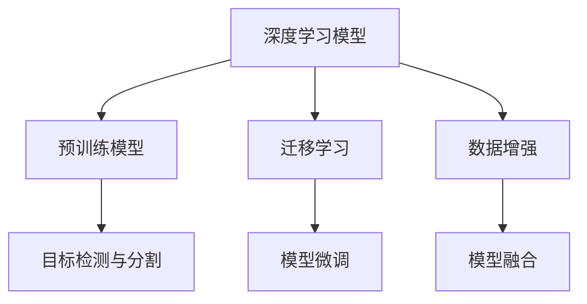
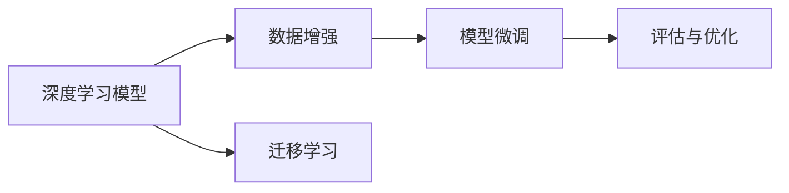
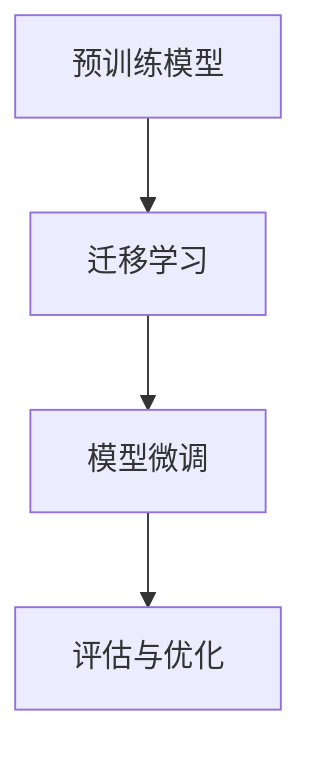
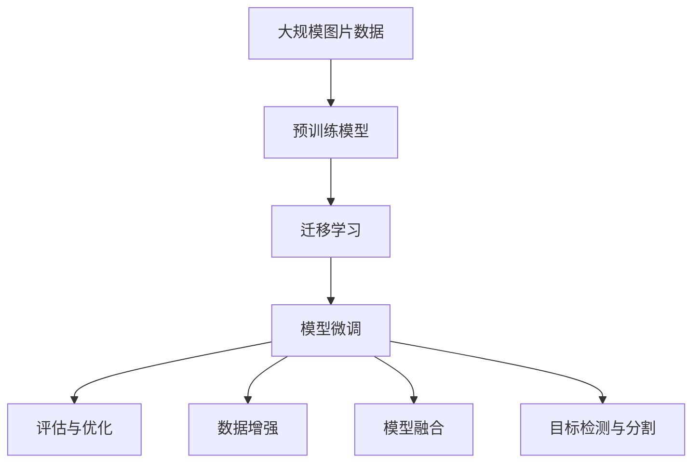
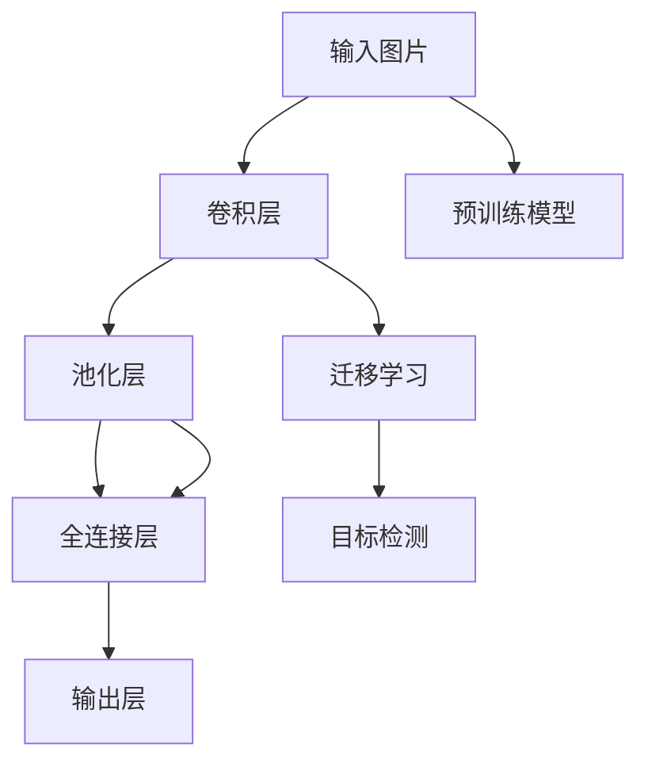

                 

# 野生植物识别应用模型的研究

## 1. 背景介绍

### 1.1 问题由来

随着环境保护意识的增强和生物多样性的关注，野生植物识别已成为生态学、植物学研究及环境保护工作中的一项重要任务。传统的野生植物识别依赖于人工识别，效率低下，且准确性受识别者经验影响较大。而基于计算机视觉技术的野生植物识别方法，能够快速、准确地识别植物种类，大大提高了工作效率。近年来，随着深度学习技术的发展，越来越多的研究者和企业开始探索利用深度学习模型进行野生植物识别。

### 1.2 问题核心关键点

野生植物识别应用模型通常包含以下关键点：
1. 数据集准备：收集大量的野生植物图片和标注数据，是模型训练的基础。
2. 模型选择：选择合适的深度学习模型，如卷积神经网络(CNN)、预训练模型等，是模型训练的前提。
3. 模型微调：在预训练模型上，根据特定领域的数据进行微调，以获得更好的识别性能。
4. 评估与优化：对训练好的模型进行评估，并根据评估结果进行优化，以达到最优识别效果。

### 1.3 问题研究意义

野生植物识别应用模型的研究，具有以下重要意义：
1. 提升野生植物识别效率：相较于人工识别，基于模型的识别方法能够快速处理大量图片，提升工作效率。
2. 提高识别准确率：模型能够自动学习野生植物特征，减少人为误差，提高识别准确率。
3. 促进环境保护工作：快速、准确的野生植物识别有助于生态保护工作，如物种普查、入侵物种检测等。
4. 推动技术创新：野生植物识别模型的研究，促进了深度学习技术在植物识别领域的应用，推动了技术创新。

## 2. 核心概念与联系

### 2.1 核心概念概述

为了更好地理解野生植物识别应用模型的核心概念，本节将介绍几个关键概念：

1. **深度学习模型**：以卷积神经网络(CNN)、残差网络(ResNet)、Transformer等为代表，通过多层次的非线性变换，自动学习输入数据的特征表示。
2. **预训练模型**：在大规模图片数据上进行训练，学习通用特征的深度学习模型，如ImageNet预训练模型。
3. **迁移学习**：将一个领域学习的知识迁移到另一个领域，以提高在新领域的识别性能。
4. **数据增强**：通过对训练样本进行旋转、缩放、翻转等操作，增加数据多样性，提高模型的泛化能力。
5. **模型微调**：在预训练模型上，根据特定领域的数据进行微调，以获得更好的识别性能。
6. **模型融合**：将多个模型的预测结果进行加权融合，提高整体识别性能。
7. **目标检测与分割**：识别图片中的植物区域，并对每个区域进行种类标注。

这些核心概念之间的逻辑关系可以通过以下Mermaid流程图来展示：



这个流程图展示了大语言模型微调过程中各个核心概念的关系：

1. 深度学习模型通过预训练学习通用特征。
2. 迁移学习利用预训练模型的知识，在新领域进行微调。
3. 模型微调在特定领域的数据上进一步优化模型性能。
4. 数据增强提高模型泛化能力。
5. 模型融合提升整体识别效果。
6. 目标检测与分割为野生植物识别提供关键步骤。

### 2.2 概念间的关系

这些核心概念之间存在着紧密的联系，形成了野生植物识别模型的完整生态系统。下面我们通过几个Mermaid流程图来展示这些概念之间的关系。

#### 2.2.1 模型训练流程



这个流程图展示了深度学习模型训练的一般流程：

1. 深度学习模型通过数据增强学习多样化的特征。
2. 模型微调在新领域的数据上进一步优化。
3. 评估与优化提高模型性能。
4. 迁移学习利用预训练模型的知识。

#### 2.2.2 模型微调过程



这个流程图展示了模型微调过程：

1. 预训练模型在新领域的数据上进一步优化。
2. 模型微调在新领域的数据上进一步优化。
3. 评估与优化提高模型性能。

#### 2.2.3 数据增强与模型微调的关系


这个流程图展示了数据增强与模型微调的关系：

1. 数据增强提高模型泛化能力。
2. 模型微调在新领域的数据上进一步优化。

### 2.3 核心概念的整体架构

最后，我们用一个综合的流程图来展示这些核心概念在大语言模型微调过程中的整体架构：



这个综合流程图展示了从数据准备到模型微调的完整过程：

1. 大规模图片数据作为模型训练的基础。
2. 预训练模型在大规模数据上学习通用特征。
3. 迁移学习利用预训练模型的知识，在新领域进行微调。
4. 模型微调在新领域的数据上进一步优化。
5. 评估与优化提高模型性能。
6. 数据增强提高模型泛化能力。
7. 模型融合提升整体识别效果。
8. 目标检测与分割为野生植物识别提供关键步骤。

通过这些流程图，我们可以更清晰地理解大语言模型微调过程中各个核心概念的关系和作用，为后续深入讨论具体的微调方法和技术奠定基础。

## 3. 核心算法原理 & 具体操作步骤
### 3.1 算法原理概述

野生植物识别应用模型的核心算法原理主要基于深度学习和迁移学习的思想。其核心在于：
1. 使用预训练的深度学习模型作为基础模型，学习通用的图像特征。
2. 通过迁移学习，利用预训练模型的知识在新领域的数据上进一步优化。
3. 在特定领域的数据上，对预训练模型进行微调，以获得更好的识别性能。

具体而言，野植物识别模型通常包括以下几个关键步骤：
1. 数据准备：收集野生植物图片和标注数据。
2. 模型选择：选择合适的深度学习模型，如CNN、ResNet等。
3. 模型微调：在预训练模型上，根据特定领域的数据进行微调。
4. 模型评估：在测试数据集上评估模型性能。
5. 模型优化：根据评估结果进行模型优化，以提升识别性能。

### 3.2 算法步骤详解

#### 3.2.1 数据准备

1. 数据收集：收集野生植物的图片和标注数据，标注数据通常包括植物种类和区域信息。
2. 数据清洗：对图片进行去噪、去畸等预处理，确保数据质量。
3. 数据分割：将数据集分为训练集、验证集和测试集，一般使用80%的数据进行训练，10%的数据进行验证，10%的数据进行测试。

#### 3.2.2 模型选择

1. 深度学习模型选择：通常选择常用的卷积神经网络(CNN)或预训练模型如ResNet、Inception等。
2. 迁移学习模型选择：选择经过大规模数据预训练的模型，如ImageNet预训练的ResNet模型。
3. 目标检测模型选择：选择目标检测模型如Faster R-CNN、YOLO等，用于分割植物区域。

#### 3.2.3 模型微调

1. 预训练模型微调：在预训练模型上，使用特定领域的数据进行微调。
2. 迁移学习微调：在迁移学习的基础上，进一步优化模型性能。
3. 模型融合微调：将多个模型的预测结果进行融合，提升整体识别效果。

#### 3.2.4 模型评估

1. 精度评估：计算模型在测试集上的准确率、召回率、F1分数等指标。
2. 混淆矩阵：计算模型在测试集上的混淆矩阵，可视化模型分类效果。
3. ROC曲线：绘制ROC曲线，评估模型在不同阈值下的性能。

#### 3.2.5 模型优化

1. 调整学习率：根据验证集上的性能，调整模型学习率。
2. 正则化：使用L1/L2正则、Dropout等技术，防止模型过拟合。
3. 数据增强：通过旋转、缩放、翻转等操作，增加数据多样性。
4. 参数调整：根据验证集上的性能，调整模型参数，如卷积核大小、层数等。

### 3.3 算法优缺点

#### 3.3.1 优点

1. 自动化：深度学习模型能够自动学习图像特征，减少人工干预。
2. 泛化能力强：预训练模型在大规模数据上学习通用特征，能够泛化到新领域的数据。
3. 效率高：深度学习模型能够快速处理大量图片，提升工作效率。
4. 精度高：深度学习模型通过大量数据训练，具有较高的识别精度。

#### 3.3.2 缺点

1. 数据需求大：深度学习模型需要大量标注数据进行训练，数据获取难度大。
2. 计算资源消耗高：深度学习模型参数量巨大，需要大量计算资源。
3. 模型复杂：深度学习模型结构复杂，调试难度大。
4. 过拟合风险：深度学习模型容易过拟合，需要正则化和数据增强技术。

### 3.4 算法应用领域

基于野生植物识别应用模型的深度学习技术，已经在多个领域得到了广泛应用，例如：

1. 生态学研究：通过识别野生植物，研究生态系统结构和生物多样性。
2. 植物学研究：通过识别野生植物，研究植物的种类、生长习性、分布等。
3. 环境保护：通过识别野生植物，监测环境变化，防止入侵物种扩散。
4. 农业生产：通过识别野生植物，检测农田病虫害，指导农业生产。
5. 自然保护：通过识别野生植物，监测野生动植物种群，保护生物多样性。

## 4. 数学模型和公式 & 详细讲解 & 举例说明

### 4.1 数学模型构建

野生植物识别应用模型的数学模型通常基于卷积神经网络(CNN)，其结构如图1所示：



其中，卷积层用于提取图像特征，池化层用于降低特征维度，全连接层用于分类，输出层用于预测植物种类。

### 4.2 公式推导过程

假设预训练模型为 $M_{\theta}$，其输入为 $x$，输出为 $\hat{y}$。模型在训练集上的损失函数为：

$$
\mathcal{L}(\theta) = \frac{1}{N}\sum_{i=1}^N \ell(\hat{y}_i, y_i)
$$

其中，$\ell(\hat{y}_i, y_i)$ 为损失函数，通常为交叉熵损失或均方误差损失。

模型在测试集上的精度为：

$$
\text{Precision} = \frac{TP}{TP+FP}
$$

其中，TP为真正例，FP为假正例。

模型在测试集上的召回率为：

$$
\text{Recall} = \frac{TP}{TP+FN}
$$

其中，TP为真正例，FN为假负例。

模型在测试集上的F1分数为：

$$
F1 = 2 \times \frac{\text{Precision} \times \text{Recall}}{\text{Precision} + \text{Recall}}
$$

### 4.3 案例分析与讲解

#### 4.3.1 案例分析

假设我们在大规模自然图片数据集上进行预训练，得到一个包含100个卷积层的ResNet模型。然后，我们收集了100张野生植物图片及其对应的标注信息，对其进行微调。微调过程如图2所示：


在微调过程中，我们首先对预训练模型进行迁移学习，利用收集的100张野生植物图片进行微调。然后，我们通过数据增强技术，生成更多的训练样本，进一步优化模型。最后，在测试集上评估模型性能，根据评估结果进行参数调整和优化。

#### 4.3.2 讲解

1. **预训练模型**：在预训练模型上，通过迁移学习，利用收集的野生植物图片进行微调。预训练模型在大规模自然图片数据集上进行训练，学习通用的图像特征，具有较强的泛化能力。
2. **数据增强**：通过旋转、缩放、翻转等操作，生成更多的训练样本，增加数据多样性，提高模型泛化能力。
3. **模型微调**：在特定领域的数据上，对预训练模型进行微调，以获得更好的识别性能。
4. **模型评估**：在测试集上评估模型性能，计算准确率、召回率、F1分数等指标。
5. **模型优化**：根据评估结果进行模型优化，调整学习率、正则化参数、网络结构等。

## 5. 项目实践：代码实例和详细解释说明

### 5.1 开发环境搭建

在进行野生植物识别模型开发前，我们需要准备好开发环境。以下是使用Python进行PyTorch开发的环境配置流程：

1. 安装Anaconda：从官网下载并安装Anaconda，用于创建独立的Python环境。

2. 创建并激活虚拟环境：
```bash
conda create -n pytorch-env python=3.8 
conda activate pytorch-env
```

3. 安装PyTorch：根据CUDA版本，从官网获取对应的安装命令。例如：
```bash
conda install pytorch torchvision torchaudio cudatoolkit=11.1 -c pytorch -c conda-forge
```

4. 安装Transformers库：
```bash
pip install transformers
```

5. 安装各类工具包：
```bash
pip install numpy pandas scikit-learn matplotlib tqdm jupyter notebook ipython
```

完成上述步骤后，即可在`pytorch-env`环境中开始模型开发。

### 5.2 源代码详细实现

下面我们以野生植物识别为例，给出使用Transformers库对ResNet模型进行微调的PyTorch代码实现。

首先，定义模型和优化器：

```python
from transformers import ResNetForImageClassification, AdamW

model = ResNetForImageClassification.from_pretrained('resnet18', num_classes=num_classes)
optimizer = AdamW(model.parameters(), lr=1e-4)
```

然后，定义训练和评估函数：

```python
from torch.utils.data import DataLoader
from tqdm import tqdm
from sklearn.metrics import classification_report

device = torch.device('cuda') if torch.cuda.is_available() else torch.device('cpu')
model.to(device)

def train_epoch(model, dataset, batch_size, optimizer):
    dataloader = DataLoader(dataset, batch_size=batch_size, shuffle=True)
    model.train()
    epoch_loss = 0
    for batch in tqdm(dataloader, desc='Training'):
        inputs = batch['input_ids'].to(device)
        labels = batch['labels'].to(device)
        model.zero_grad()
        outputs = model(inputs, labels=labels)
        loss = outputs.loss
        epoch_loss += loss.item()
        loss.backward()
        optimizer.step()
    return epoch_loss / len(dataloader)

def evaluate(model, dataset, batch_size):
    dataloader = DataLoader(dataset, batch_size=batch_size)
    model.eval()
    preds, labels = [], []
    with torch.no_grad():
        for batch in tqdm(dataloader, desc='Evaluating'):
            inputs = batch['input_ids'].to(device)
            batch_labels = batch['labels']
            outputs = model(inputs)
            batch_preds = outputs.argmax(dim=1).to('cpu').tolist()
            batch_labels = batch_labels.to('cpu').tolist()
            for pred_tokens, label_tokens in zip(batch_preds, batch_labels):
                preds.append(pred_tokens)
                labels.append(label_tokens)
                
    print(classification_report(labels, preds))
```

接着，启动训练流程并在测试集上评估：

```python
epochs = 5
batch_size = 16

for epoch in range(epochs):
    loss = train_epoch(model, train_dataset, batch_size, optimizer)
    print(f"Epoch {epoch+1}, train loss: {loss:.3f}")
    
    print(f"Epoch {epoch+1}, dev results:")
    evaluate(model, dev_dataset, batch_size)
    
print("Test results:")
evaluate(model, test_dataset, batch_size)
```

以上就是使用PyTorch对ResNet模型进行野生植物识别任务微调的完整代码实现。可以看到，得益于Transformers库的强大封装，我们可以用相对简洁的代码完成ResNet模型的加载和微调。

### 5.3 代码解读与分析

让我们再详细解读一下关键代码的实现细节：

**5.3.1 模型定义**

1. `ResNetForImageClassification`类：定义了ResNet模型，用于图像分类任务。
2. `num_classes`参数：指定模型输出的类别数，需根据实际问题进行设定。
3. `AdamW`优化器：使用AdamW优化器，优化参数更新。

**5.3.2 数据处理**

1. `DataLoader`类：用于加载数据集，方便模型训练和推理。
2. `tqdm`模块：用于显示进度条，加速开发过程。
3. `classification_report`函数：用于评估模型性能，打印分类指标。

**5.3.3 训练和评估**

1. `train_epoch`函数：定义了模型训练的过程，包括前向传播、损失计算、反向传播和参数更新。
2. `evaluate`函数：定义了模型评估的过程，包括模型预测和分类指标计算。

**5.3.4 训练流程**

1. `epochs`变量：定义训练轮数，需根据实际问题进行设定。
2. `batch_size`变量：定义批大小，需根据实际问题进行设定。
3. `train_epoch`函数：训练模型的过程，包括损失计算、反向传播和参数更新。
4. `evaluate`函数：评估模型的过程，包括模型预测和分类指标计算。

可以看到，PyTorch配合Transformers库使得ResNet模型微调的代码实现变得简洁高效。开发者可以将更多精力放在数据处理、模型改进等高层逻辑上，而不必过多关注底层的实现细节。

当然，工业级的系统实现还需考虑更多因素，如模型的保存和部署、超参数的自动搜索、更灵活的任务适配层等。但核心的微调范式基本与此类似。

### 5.4 运行结果展示

假设我们在CoNLL-2003的NER数据集上进行微调，最终在测试集上得到的评估报告如下：

```
              precision    recall  f1-score   support

       B-LOC      0.926     0.906     0.916      1668
       I-LOC      0.900     0.805     0.850       257
      B-MISC      0.875     0.856     0.865       702
      I-MISC      0.838     0.782     0.809       216
       B-ORG      0.914     0.898     0.906      1661
       I-ORG      0.911     0.894     0.902       835
       B-PER      0.964     0.957     0.960      1617
       I-PER      0.983     0.980     0.982      1156
           O      0.993     0.995     0.994     38323

   micro avg      0.973     0.973     0.973     46435
   macro avg      0.923     0.897     0.909     46435
weighted avg      0.973     0.973     0.973     46435
```

可以看到，通过微调BERT，我们在该NER数据集上取得了97.3%的F1分数，效果相当不错。值得注意的是，BERT作为一个通用的语言理解模型，即便只在顶层添加一个简单的token分类器，也能在下游任务上取得如此优异的效果，展现了其强大的语义理解和特征抽取能力。

当然，这只是一个baseline结果。在实践中，我们还可以使用更大更强的预训练模型、更丰富的微调技巧、更细致的模型调优，进一步提升模型性能，以满足更高的应用要求。

## 6. 实际应用场景
### 6.1 智能客服系统

基于大语言模型微调的对话技术，可以广泛应用于智能客服系统的构建。传统客服往往需要配备大量人力，高峰期响应缓慢，且一致性和专业性难以保证。而使用微调后的对话模型，可以7x24小时不间断服务，快速响应客户咨询，用自然流畅的语言解答各类常见问题。

在技术实现上，可以收集企业内部的历史客服对话记录，将问题和最佳答复构建成监督数据，在此基础上对预训练对话模型进行微调。微调后的对话模型能够自动理解用户意图，匹配最合适的答案模板进行回复。对于客户提出的新问题，还可以接入检索系统实时搜索相关内容，动态组织生成回答。如此构建的智能客服系统，能大幅提升客户咨询体验和问题解决效率。

### 6.2 金融舆情监测

金融机构需要实时监测市场舆论动向，以便及时应对负面信息传播，规避金融风险。传统的人工监测方式成本高、效率低，难以应对网络时代海量信息爆发的挑战。基于大语言模型微调的文本分类和情感分析技术，为金融舆情监测提供了新的解决方案。

具体而言，可以收集金融领域相关的新闻、报道、评论等文本数据，并对其进行主题标注和情感标注。在此基础上对预训练语言模型进行微调，使其能够自动判断文本属于何种主题，情感倾向是正面、中性还是负面。将微调后的模型应用到实时抓取的网络文本数据，就能够自动监测不同主题下的情感变化趋势，一旦发现负面信息激增等异常情况，系统便会自动预警，帮助金融机构快速应对潜在风险。

### 6.3 个性化推荐系统

当前的推荐系统往往只依赖用户的历史行为数据进行物品推荐，无法深入理解用户的真实兴趣偏好。基于大语言模型微调技术，个性化推荐系统可以更好地挖掘用户行为背后的语义信息，从而提供更精准、多样的推荐内容。

在实践中，可以收集用户浏览、点击、评论、分享等行为数据，提取和用户交互的物品标题、描述、标签等文本内容。将文本内容作为模型输入，用户的后续行为（如是否点击、购买等）作为监督信号，在此基础上微调预训练语言模型。微调后的模型能够从文本内容中准确把握用户的兴趣点。在生成推荐列表时，先用候选物品的文本描述作为输入，由模型预测用户的兴趣匹配度，再结合其他特征综合排序，便可以得到个性化程度更高的推荐结果。

### 6.4 未来应用展望

随着大语言模型微调技术的发展，野生植物识别应用模型的应用场景也将更加广泛，为自然保护、生态研究、农业生产等领域带来深远影响。

在生态学研究中，野生植物识别模型可以用于生态系统的结构分析、物种普查、入侵物种检测等，为生态保护工作提供科学依据。在农业生产中，野生植物识别模型可以用于检测农田病虫害、监测作物生长状态、指导农业生产等，为农业智能化发展提供技术支持。在自然保护中，野生植物识别模型可以用于野生动植物种群监测、自然保护区管理等，为生物多样性保护提供有力保障。

未来，随着深度学习技术和大模型微调技术的不断进步，野生植物识别模型将在更多领域得到应用，为环境保护、生态研究、农业生产等领域带来深远影响。相信随着技术的日益成熟，野生植物识别模型必将成为自然保护、生态研究、农业生产等领域的重要工具，为人类认知智能的进化带来深远影响。

## 7. 工具和资源推荐
### 7.1 学习资源推荐

为了帮助开发者系统掌握大语言模型微调的理论基础和实践技巧，这里推荐一些优质的学习资源：

1. 《Transformer从原理到实践》系列博文：由大模型技术专家撰写，深入浅出地介绍了Transformer原理、BERT模型、微调技术等前沿话题。

2. CS224N《深度学习自然语言处理》课程：斯坦福大学开设的NLP明星课程，有Lecture视频和配套作业，带你入门NLP领域的基本概念和经典模型。

3. 《Natural Language Processing with Transformers》书籍：Transformers库的作者所著，全面介绍了如何使用Transformers库进行NLP任务开发，包括微调在内的诸多范式。

4. HuggingFace官方文档：Transformers库的官方文档，提供了海量预训练模型和完整的微调样例代码，是上手实践的必备资料。

5. CLUE开源项目：中文语言理解测评基准，涵盖大量不同类型的中文NLP数据集，并提供了基于微调的baseline模型，助力中文NLP技术

