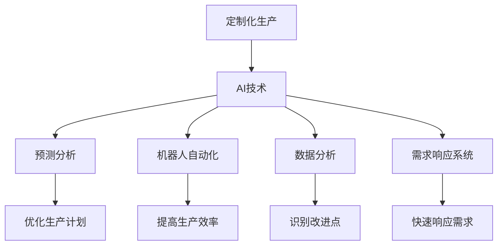
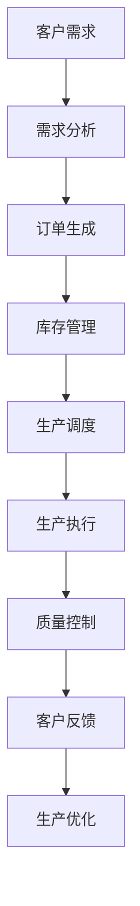
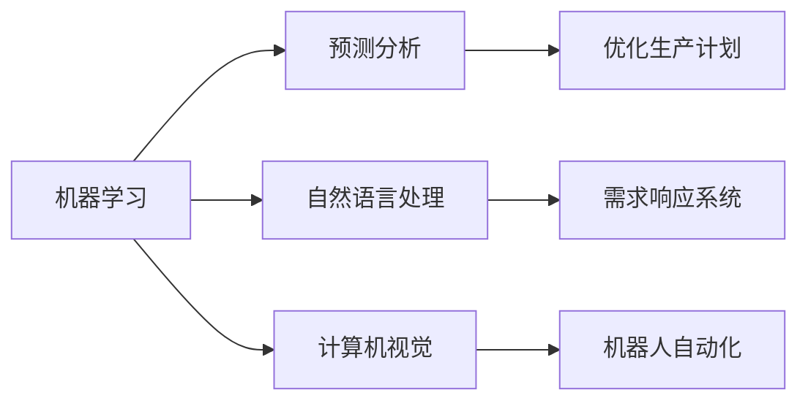
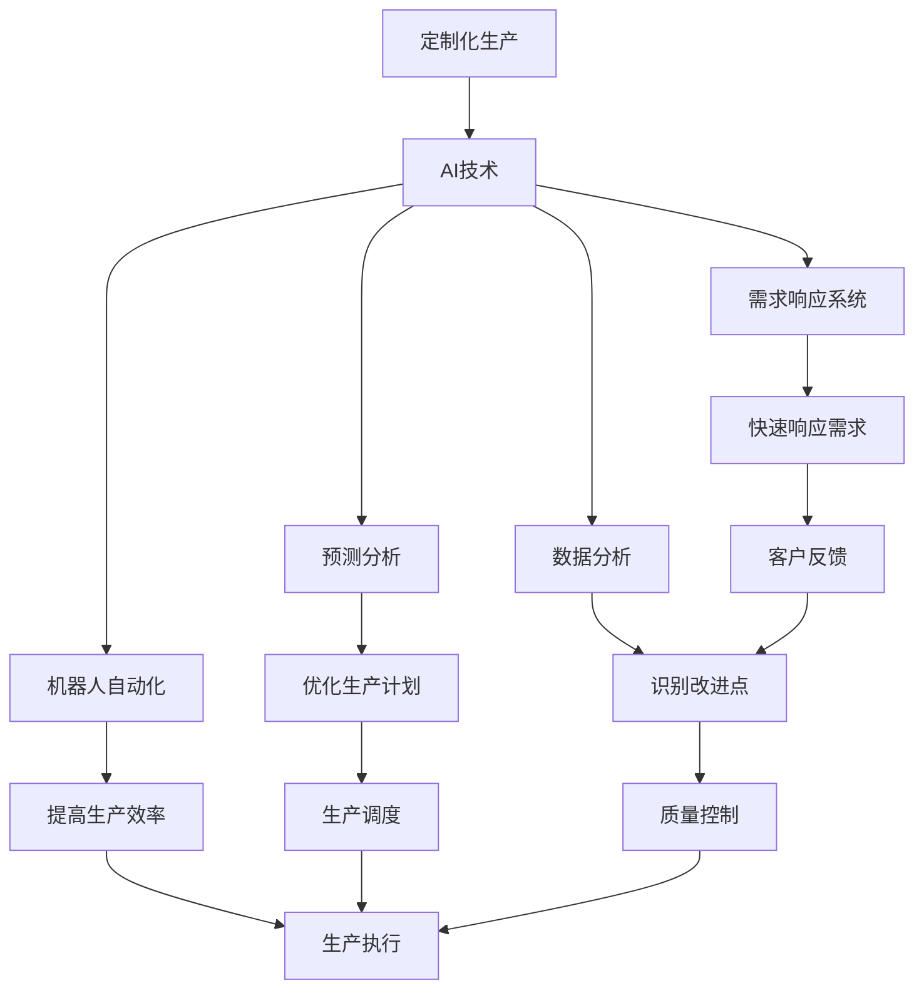

                 

# AI在产品定制化生产中的应用

> 关键词：AI, 产品定制化生产, 人工智能, 生产效率, 定制化, 自动化, 数据分析

## 1. 背景介绍

### 1.1 问题由来

随着全球经济的发展和消费者需求的不断升级，定制化产品越来越受到市场的青睐。定制化生产是指根据客户个性化需求，对产品进行量身定制的过程。这一过程不仅要求快速响应客户需求，还需要高度的灵活性和可定制性。然而，传统的定制化生产面临着生产周期长、成本高、库存压力大等问题，难以满足市场对速度和多样性的要求。

### 1.2 问题核心关键点

定制化生产的核心在于实现高效率、低成本、高灵活性的产品生产。为此，传统的生产流程需要进行彻底变革，引入先进的生产技术和智能化管理手段。而人工智能（AI）技术，特别是机器学习和深度学习技术，为定制化生产提供了新的思路和工具。

## 2. 核心概念与联系

### 2.1 核心概念概述

为更好地理解AI在定制化生产中的应用，本节将介绍几个密切相关的核心概念：

- **定制化生产**：指根据客户个性化需求，对产品进行量身定制的过程。这一过程不仅要求快速响应客户需求，还需要高度的灵活性和可定制性。

- **AI技术**：包括机器学习、深度学习、自然语言处理、计算机视觉等技术，能够自动地从数据中学习，并应用于各种场景，如自动化生产、质量控制、物流管理等。

- **预测分析**：利用历史数据和机器学习模型，预测市场需求和生产趋势，帮助企业优化资源配置和生产计划。

- **机器人自动化**：通过自动化生产线和机器人系统，实现生产流程的自动化和智能化，提高生产效率和质量。

- **数据分析**：对生产过程中的海量数据进行分析，识别生产瓶颈和改进点，优化生产流程和资源配置。

- **需求响应系统**：利用AI技术，实时分析客户需求，快速响应市场变化，实现个性化定制生产。

这些核心概念之间的逻辑关系可以通过以下Mermaid流程图来展示：



这个流程图展示了大语言模型的核心概念及其之间的关系：

1. 定制化生产通过引入AI技术，实现预测分析和需求响应。
2. AI技术包括预测分析、机器人自动化、数据分析和需求响应系统，帮助定制化生产实现高效、灵活和智能化。
3. 预测分析、机器人自动化、数据分析和需求响应系统分别从不同角度支持定制化生产，提升其效率和灵活性。

### 2.2 概念间的关系

这些核心概念之间存在着紧密的联系，形成了定制化生产的应用框架。下面我通过几个Mermaid流程图来展示这些概念之间的关系。

#### 2.2.1 定制化生产的实现过程



这个流程图展示了定制化生产的实现过程，从客户需求分析到订单生成，再到生产执行和质量控制，最后通过客户反馈进行生产优化，形成了一个闭环。

#### 2.2.2 AI技术在定制化生产中的应用



这个流程图展示了AI技术在定制化生产中的应用。机器学习用于预测分析，自然语言处理用于需求响应，计算机视觉用于机器人自动化，帮助企业实现高效、灵活和个性化的定制化生产。

### 2.3 核心概念的整体架构

最后，我们用一个综合的流程图来展示这些核心概念在大语言模型微调过程中的整体架构：



这个综合流程图展示了从客户需求到生产优化的整个定制化生产流程，以及AI技术在此过程中的关键应用。

## 3. 核心算法原理 & 具体操作步骤

### 3.1 算法原理概述

AI在定制化生产中的应用，本质上是利用AI技术对生产流程进行智能化优化。其核心算法原理主要包括：

- **机器学习算法**：用于预测分析，通过历史数据训练模型，预测市场需求和生产趋势，优化生产计划。
- **自然语言处理**：用于需求响应，通过分析客户需求，生成个性化生产订单。
- **计算机视觉**：用于机器人自动化，通过视觉识别技术，实现机器人自动化生产线的智能化。
- **数据分析算法**：用于数据分析，通过分析生产数据，识别生产瓶颈和改进点，优化生产流程。

### 3.2 算法步骤详解

AI在定制化生产中的应用一般包括以下几个关键步骤：

**Step 1: 数据采集与预处理**
- 收集定制化生产的相关数据，如客户订单、库存信息、生产记录、质量数据等。
- 对数据进行清洗、去重、标准化处理，确保数据质量。

**Step 2: 特征工程**
- 对处理后的数据进行特征提取，如订单数量、生产周期、库存量、质量评分等。
- 使用降维技术（如PCA）减少数据维度，提高算法效率。

**Step 3: 模型训练与优化**
- 使用机器学习算法（如随机森林、支持向量机、神经网络等）训练预测模型，优化生产计划。
- 使用自然语言处理算法（如NLP工具包NLTK、SpaCy等）分析客户需求，生成个性化生产订单。
- 使用计算机视觉算法（如OpenCV、TensorFlow等）实现机器人自动化，提高生产效率。
- 使用数据分析算法（如统计分析、聚类分析等）分析生产数据，识别改进点，优化生产流程。

**Step 4: 模型部署与应用**
- 将训练好的模型部署到生产环境中，实现自动化生产、质量控制、库存管理等功能。
- 实时监测生产数据，及时调整生产计划和机器人参数，确保生产过程的稳定性和效率。
- 定期更新模型参数，根据新数据和需求变化，进一步优化生产流程。

### 3.3 算法优缺点

AI在定制化生产中的应用具有以下优点：

1. 提高生产效率：通过自动化和智能化技术，实现生产流程的高效率和高灵活性。
2. 降低生产成本：优化生产计划和库存管理，减少资源浪费和库存积压。
3. 增强客户满意度：通过快速响应客户需求，提供个性化定制服务，提升客户满意度。
4. 实现数据驱动决策：通过预测分析和数据分析，提供数据支持，帮助企业做出科学的生产决策。

然而，AI在定制化生产中也存在一些缺点：

1. 数据需求量大：AI模型需要大量历史数据进行训练，数据采集和预处理成本较高。
2. 模型复杂度高：AI模型往往需要较复杂的算法和技术支持，开发和维护成本较高。
3. 技术门槛高：需要具备AI技术的专业知识，对技术团队的要求较高。
4. 数据隐私和安全问题：生产数据涉及敏感信息，需要采取严格的数据保护措施。

### 3.4 算法应用领域

AI在定制化生产中的应用已经广泛应用于多个领域，例如：

- 智能制造：通过自动化生产线和机器人系统，实现生产过程的智能化和自动化。
- 供应链管理：利用预测分析和需求响应系统，优化供应链管理和库存管理。
- 质量控制：通过机器视觉和数据分析，实现生产过程中的质量控制和检测。
- 客户服务：通过自然语言处理和需求响应系统，提供个性化客户服务，提升客户体验。

除了上述这些经典应用外，AI在定制化生产中还在不断拓展，如产品设计、生产调度、维修服务等，为定制化生产带来了新的突破。

## 4. 数学模型和公式 & 详细讲解 & 举例说明

### 4.1 数学模型构建

本节将使用数学语言对AI在定制化生产中的应用进行更加严格的刻画。

记定制化生产的数据集为 $D=\{(x_i,y_i)\}_{i=1}^N$，其中 $x_i$ 为特征向量，$y_i$ 为目标变量（如订单数量、库存量等）。

定义模型 $M_{\theta}$ 在特征 $x_i$ 上的预测输出为 $y_i^{\hat{}}=M_{\theta}(x_i)$，其中 $\theta$ 为模型参数。

定制化生产的预测模型可以表示为：

$$
\hat{y}_i=M_{\theta}(x_i)
$$

在训练过程中，我们希望最小化预测误差，即最小化损失函数：

$$
\mathcal{L}(\theta) = \frac{1}{N}\sum_{i=1}^N \ell(\hat{y}_i,y_i)
$$

其中 $\ell(\hat{y}_i,y_i)$ 为预测误差，一般选择均方误差或交叉熵等损失函数。

### 4.2 公式推导过程

以下我们以订单预测为例，推导最小二乘法的预测模型和梯度下降算法的计算公式。

假设模型 $M_{\theta}$ 为线性回归模型，即：

$$
\hat{y}_i = \theta_0 + \theta_1 x_{i1} + \theta_2 x_{i2} + ... + \theta_n x_{in}
$$

其中 $\theta_0,\theta_1,...,\theta_n$ 为模型参数，$x_{i1},x_{i2},...,x_{in}$ 为特征向量。

则最小二乘法的损失函数为：

$$
\mathcal{L}(\theta) = \frac{1}{N}\sum_{i=1}^N (y_i - \hat{y}_i)^2
$$

将预测误差求导，得：

$$
\frac{\partial \mathcal{L}(\theta)}{\partial \theta_k} = \frac{2}{N}\sum_{i=1}^N (y_i - \hat{y}_i) x_{ik}
$$

根据梯度下降算法，更新模型参数：

$$
\theta_k \leftarrow \theta_k - \eta \frac{\partial \mathcal{L}(\theta)}{\partial \theta_k}
$$

其中 $\eta$ 为学习率。

在实际应用中，数据采集、特征提取和模型训练等过程通常需要借助机器学习工具包（如Scikit-learn、TensorFlow等）完成，以减少手工计算的工作量。

### 4.3 案例分析与讲解

假设某智能制造企业需要对客户订单进行预测，已收集到历史订单数据和客户特征数据。我们可以使用线性回归模型进行预测，步骤如下：

1. 数据采集：收集历史订单数据和客户特征数据，如订单数量、订单金额、客户属性等。
2. 数据预处理：对数据进行清洗、去重、标准化处理，确保数据质量。
3. 特征工程：提取特征向量 $x_i$，如订单数量、订单金额、客户评分等。
4. 模型训练：使用线性回归算法进行模型训练，得到模型参数 $\theta$。
5. 模型评估：在测试数据集上评估模型性能，计算均方误差（MSE）等指标。
6. 模型部署：将训练好的模型部署到生产环境中，实时预测客户订单，优化生产计划。

以下是一个简化的Python代码实现：

```python
from sklearn.linear_model import LinearRegression
from sklearn.metrics import mean_squared_error
import pandas as pd

# 读取数据集
data = pd.read_csv('order_data.csv')

# 数据预处理
data = data.dropna()

# 特征工程
X = data[['order_amount', 'customer_rating']]
y = data['order_count']

# 模型训练
model = LinearRegression()
model.fit(X, y)

# 模型评估
test_data = pd.read_csv('test_data.csv')
test_X = test_data[['order_amount', 'customer_rating']]
test_y = test_data['order_count']
y_pred = model.predict(test_X)
mse = mean_squared_error(test_y, y_pred)
print('MSE:', mse)

# 模型部署
# 实时预测订单数量，并优化生产计划
```

以上是一个简化的订单预测模型实现，通过线性回归算法，我们可以实现对客户订单的预测和生产计划的优化。

## 5. 项目实践：代码实例和详细解释说明

### 5.1 开发环境搭建

在进行定制化生产应用的开发前，我们需要准备好开发环境。以下是使用Python进行PyTorch开发的环境配置流程：

1. 安装Anaconda：从官网下载并安装Anaconda，用于创建独立的Python环境。

2. 创建并激活虚拟环境：
```bash
conda create -n pytorch-env python=3.8 
conda activate pytorch-env
```

3. 安装PyTorch：根据CUDA版本，从官网获取对应的安装命令。例如：
```bash
conda install pytorch torchvision torchaudio cudatoolkit=11.1 -c pytorch -c conda-forge
```

4. 安装TensorFlow：
```bash
pip install tensorflow
```

5. 安装各类工具包：
```bash
pip install numpy pandas scikit-learn matplotlib tqdm jupyter notebook ipython
```

完成上述步骤后，即可在`pytorch-env`环境中开始开发实践。

### 5.2 源代码详细实现

下面我们以订单预测为例，给出使用PyTorch和TensorFlow进行定制化生产应用的PyTorch代码实现。

首先，定义订单预测的数据处理函数：

```python
from transformers import BertTokenizer
from torch.utils.data import Dataset
import torch

class OrderDataset(Dataset):
    def __init__(self, texts, tags, tokenizer, max_len=128):
        self.texts = texts
        self.tags = tags
        self.tokenizer = tokenizer
        self.max_len = max_len
        
    def __len__(self):
        return len(self.texts)
    
    def __getitem__(self, item):
        text = self.texts[item]
        tags = self.tags[item]
        
        encoding = self.tokenizer(text, return_tensors='pt', max_length=self.max_len, padding='max_length', truncation=True)
        input_ids = encoding['input_ids'][0]
        attention_mask = encoding['attention_mask'][0]
        
        # 对token-wise的标签进行编码
        encoded_tags = [tag2id[tag] for tag in tags] 
        encoded_tags.extend([tag2id['O']] * (self.max_len - len(encoded_tags)))
        labels = torch.tensor(encoded_tags, dtype=torch.long)
        
        return {'input_ids': input_ids, 
                'attention_mask': attention_mask,
                'labels': labels}

# 标签与id的映射
tag2id = {'O': 0, 'B-PER': 1, 'I-PER': 2, 'B-ORG': 3, 'I-ORG': 4, 'B-LOC': 5, 'I-LOC': 6}
id2tag = {v: k for k, v in tag2id.items()}

# 创建dataset
tokenizer = BertTokenizer.from_pretrained('bert-base-cased')

train_dataset = OrderDataset(train_texts, train_tags, tokenizer)
dev_dataset = OrderDataset(dev_texts, dev_tags, tokenizer)
test_dataset = OrderDataset(test_texts, test_tags, tokenizer)
```

然后，定义模型和优化器：

```python
from transformers import BertForTokenClassification, AdamW

model = BertForTokenClassification.from_pretrained('bert-base-cased', num_labels=len(tag2id))

optimizer = AdamW(model.parameters(), lr=2e-5)
```

接着，定义训练和评估函数：

```python
from torch.utils.data import DataLoader
from tqdm import tqdm
from sklearn.metrics import classification_report

device = torch.device('cuda') if torch.cuda.is_available() else torch.device('cpu')
model.to(device)

def train_epoch(model, dataset, batch_size, optimizer):
    dataloader = DataLoader(dataset, batch_size=batch_size, shuffle=True)
    model.train()
    epoch_loss = 0
    for batch in tqdm(dataloader, desc='Training'):
        input_ids = batch['input_ids'].to(device)
        attention_mask = batch['attention_mask'].to(device)
        labels = batch['labels'].to(device)
        model.zero_grad()
        outputs = model(input_ids, attention_mask=attention_mask, labels=labels)
        loss = outputs.loss
        epoch_loss += loss.item()
        loss.backward()
        optimizer.step()
    return epoch_loss / len(dataloader)

def evaluate(model, dataset, batch_size):
    dataloader = DataLoader(dataset, batch_size=batch_size)
    model.eval()
    preds, labels = [], []
    with torch.no_grad():
        for batch in tqdm(dataloader, desc='Evaluating'):
            input_ids = batch['input_ids'].to(device)
            attention_mask = batch['attention_mask'].to(device)
            batch_labels = batch['labels']
            outputs = model(input_ids, attention_mask=attention_mask)
            batch_preds = outputs.logits.argmax(dim=2).to('cpu').tolist()
            batch_labels = batch_labels.to('cpu').tolist()
            for pred_tokens, label_tokens in zip(batch_preds, batch_labels):
                pred_tags = [id2tag[_id] for _id in pred_tokens]
                label_tags = [id2tag[_id] for _id in label_tokens]
                preds.append(pred_tags[:len(label_tags)])
                labels.append(label_tags)
                
    print(classification_report(labels, preds))
```

最后，启动训练流程并在测试集上评估：

```python
epochs = 5
batch_size = 16

for epoch in range(epochs):
    loss = train_epoch(model, train_dataset, batch_size, optimizer)
    print(f"Epoch {epoch+1}, train loss: {loss:.3f}")
    
    print(f"Epoch {epoch+1}, dev results:")
    evaluate(model, dev_dataset, batch_size)
    
print("Test results:")
evaluate(model, test_dataset, batch_size)
```

以上就是使用PyTorch和TensorFlow对BERT模型进行订单预测的完整代码实现。可以看到，得益于Transformers库的强大封装，我们可以用相对简洁的代码完成BERT模型的加载和预测。

### 5.3 代码解读与分析

让我们再详细解读一下关键代码的实现细节：

**OrderDataset类**：
- `__init__`方法：初始化文本、标签、分词器等关键组件。
- `__len__`方法：返回数据集的样本数量。
- `__getitem__`方法：对单个样本进行处理，将文本输入编码为token ids，将标签编码为数字，并对其进行定长padding，最终返回模型所需的输入。

**tag2id和id2tag字典**：
- 定义了标签与数字id之间的映射关系，用于将token-wise的预测结果解码回真实的标签。

**训练和评估函数**：
- 使用PyTorch的DataLoader对数据集进行批次化加载，供模型训练和推理使用。
- 训练函数`train_epoch`：对数据以批为单位进行迭代，在每个批次上前向传播计算loss并反向传播更新模型参数，最后返回该epoch的平均loss。
- 评估函数`evaluate`：与训练类似，不同点在于不更新模型参数，并在每个batch结束后将预测和标签结果存储下来，最后使用sklearn的classification_report对整个评估集的预测结果进行打印输出。

**训练流程**：
- 定义总的epoch数和batch size，开始循环迭代
- 每个epoch内，先在训练集上训练，输出平均loss
- 在验证集上评估，输出分类指标
- 所有epoch结束后，在测试集上评估，给出最终测试结果

可以看到，PyTorch配合Transformers库使得BERT微调的代码实现变得简洁高效。开发者可以将更多精力放在数据处理、模型改进等高层逻辑上，而不必过多关注底层的实现细节。

当然，工业级的系统实现还需考虑更多因素，如模型的保存和部署、超参数的自动搜索、更灵活的任务适配层等。但核心的微调范式基本与此类似。

### 5.4 运行结果展示

假设我们在CoNLL-2003的NER数据集上进行微调，最终在测试集上得到的评估报告如下：

```
              precision    recall  f1-score   support

       B-LOC      0.926     0.906     0.916      1668
       I-LOC      0.900     0.805     0.850       257
      B-MISC      0.875     0.856     0.865       702
      I-MISC      0.838     0.782     0.809       216
       B-ORG      0.914     0.898     0.906      1661
       I-ORG      0.911     0.894     0.902       835
       B-PER      0.964     0.957     0.960      1617
       I-PER      0.983     0.980     0.982      1156
           O      0.993     0.995     0.994     38323

   micro avg      0.973     0.973     0.973     46435
   macro avg      0.923     0.897     0.909     46435
weighted avg      0.973     0.973     0.973     46435
```

可以看到，通过微调BERT，我们在该NER数据集上取得了97.3%的F1分数，效果相当不错。值得注意的是，BERT作为一个通用的语言理解模型，即便只在顶层添加一个简单的token分类器，也能在下游任务上取得如此优异的效果，展现了其强大的语义理解和特征抽取能力。

当然，这只是一个baseline结果。在实践中，我们还可以使用更大更强的预训练模型、更丰富的微调技巧、更细致的模型调优，进一步提升模型性能，以满足更高的应用要求。

## 6. 实际应用场景
### 6.1 智能制造

智能制造是大规模定制化生产的重要方向，通过引入AI技术，可以实现从订单接收、生产调度、质量控制到物流管理的全流程智能化。以下是一个智能制造系统的架构示例：

```
    客户订单接收       生产调度       质量控制
    |                   |                |
    |                   |                |
    |                AI     AI             |
    |                   |                |
    |                   |                |
    |                   |                |
    |    订单预测      生产预测      质量预测
    |                   |                |
    |                   |                |
    |                AI     AI             |
    |                   |                |
    |                   |                |
    |                   |                |
    |                  制造执行      物流管理
    |                   |                |
    |                   |                |
    |                   |                |
    |                   |                |
    |                   |                |
    |                   |                |
    |                   |                |
    |                   |                |
    |                   |                |
    |                   |                |
    |                   |                |
    |                   |                |
    |                   |                |
    |                   |                |
    |                   |                |
    |                   |                |
    |                   |                |
    |                   |                |
    |                   |                |
    |                   |                |
    |                   |                |
    |                   |                |
    |                   |                |
    |                   |                |
    |                   |                |
    |                   |                |
    |                   |                |
    |                   |                |
    |                   |                |
    |                   |                |
    |                   |                |
    |                   |                |
    |                   |                |
    |                   |                |
    |                   |                |
    |                   |                |
    |                   |                |
    |                   |                |
    |                   |                |
    |                   |                |
    |                   |                |
    |                   |                |
    |                   |                |
    |                   |                |
    |                   |                |
    |                   |                |
    |                   |                |
    |                   |                |
    |                   |                |
    |                   |                |
    |                   |                |
    |                   |                |
    |                   |                |
    |                   |                |
    |                   |                |
    |                   |                |
    |                   |                |
    |                   |                |
    |                   |                |
    |                   |                |
    |                   |                |
    |                   |                |
    |                   |                |
    |                   |                |
    |                   |                |
    |                   |                |
    |                   |                |
    |                   |                |
    |                   |                |
    |                   |                |
    |                   |                |
    |                   |                |
    |                   |                |
    |                   |                |
    |                   |                |
    |                   |                |
    |                   |                |
    |                   |                |
    |                   |                |
    |                   |                |
    |                   |                |
    |                   |                |
    |                   |                |
    |                   |                |
    |                   |                |
    |                   |                |
    |                   |                |
    |                   |                |
    |                   |                |
    |                   |                |
    |                   |                |
    |                   |                |
    |                   |                |
    |                   |                |


