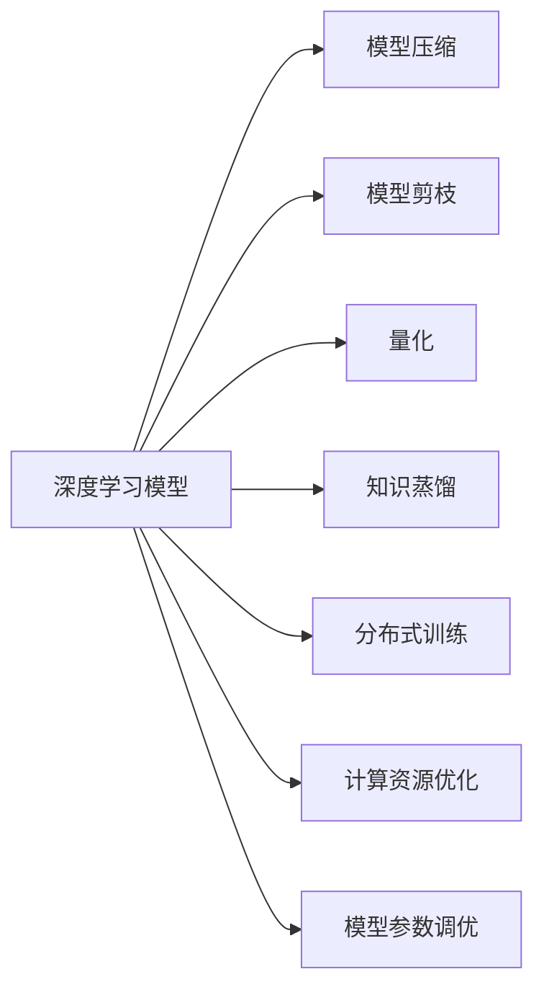
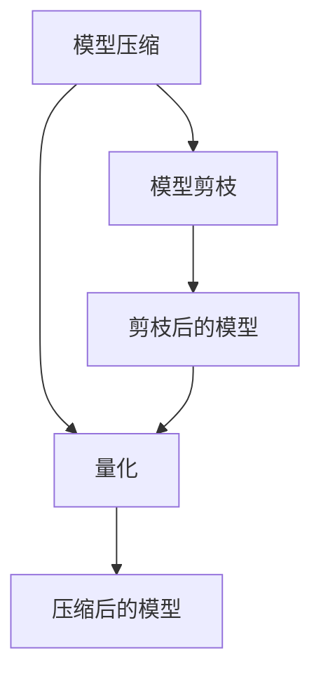
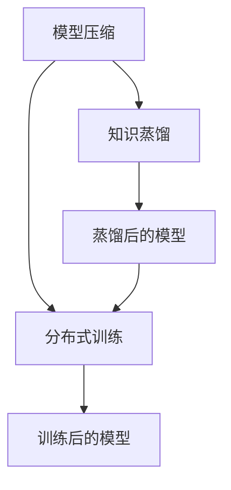
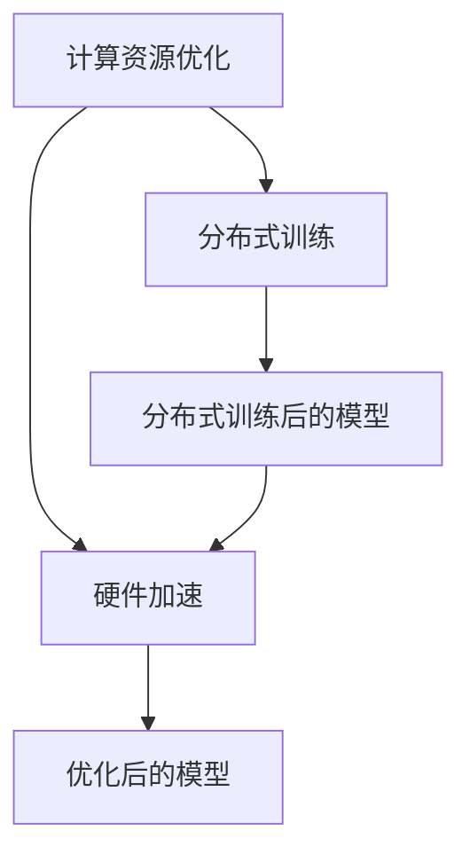
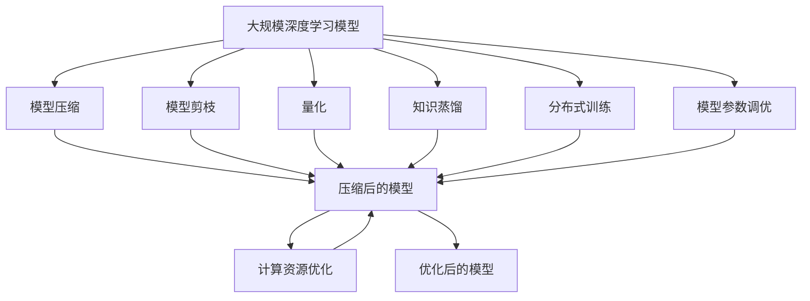

                 

# AI模型规模与效率的平衡:寻找最佳点

> 关键词：模型规模, 模型效率, 平衡, 最佳点, 深度学习, 超参数调优, 计算资源, 算法性能

## 1. 背景介绍

### 1.1 问题由来
在深度学习领域，模型规模和效率之间的平衡一直是一个备受关注的问题。随着深度神经网络的逐渐深入应用，尤其是大型语言模型和图像识别模型的不断涌现，模型规模的增大带来了前所未有的性能提升。然而，大模型在实际应用中也面临效率方面的挑战，如计算资源需求大、推理速度慢等。因此，如何在保证模型性能的同时，实现规模和效率的最佳平衡，成为当前研究的热点问题。

### 1.2 问题核心关键点
寻找AI模型规模与效率平衡的最佳点，主要关注以下几个关键点：
1. **模型规模**：指模型中参数的数量，通常包括模型层数、节点数、数据宽度等。
2. **模型效率**：指模型的计算资源需求、推理速度、存储需求等，通常通过模型的浮点运算次数（FLOPs）和内存占用等指标来衡量。
3. **性能指标**：指模型在特定任务上的性能，如准确率、召回率、F1分数等。
4. **超参数调优**：通过调整模型的超参数（如学习率、批量大小、优化器等）来优化模型性能。
5. **模型压缩**：通过对模型进行剪枝、量化、蒸馏等操作，减小模型规模，提高模型效率。
6. **算法优化**：通过算法创新，如并行计算、分布式训练等，提升模型训练和推理的效率。

### 1.3 问题研究意义
寻找模型规模与效率的最佳点，对于提升深度学习模型的实际应用能力，降低计算成本，加速AI技术的产业化进程具有重要意义：

1. **降低计算成本**：大模型通常需要大量的计算资源进行训练和推理，通过优化模型规模和效率，可以显著降低计算成本，提高模型在边缘设备上的应用能力。
2. **提升模型性能**：在保持模型规模合理的前提下，通过优化模型效率，可以在保证计算资源的基础上，进一步提升模型的性能指标，更好地应对实际应用中的各种挑战。
3. **加速应用开发**：模型规模和效率的最佳平衡，有助于更快地进行模型开发和部署，加速AI技术在各个行业的应用落地。
4. **促进算法创新**：寻找模型规模与效率的最佳点，涉及到模型压缩、超参数调优、算法优化等多个方面，推动了深度学习领域的算法创新和理论发展。
5. **保障应用安全**：大模型由于参数众多，容易受到恶意输入的影响，通过优化模型效率，可以有效减少模型的敏感性和计算风险，提升应用的安全性。

## 2. 核心概念与联系

### 2.1 核心概念概述

为更好地理解模型规模与效率平衡的最佳点，本节将介绍几个密切相关的核心概念：

- **深度学习模型**：由多层神经网络组成的模型，广泛用于图像识别、语音识别、自然语言处理等领域。
- **模型压缩**：通过减少模型参数数量、降低计算复杂度等手段，减小模型的规模，提高模型的效率。
- **模型剪枝**：去除模型中不必要的参数，减少计算量和存储需求。
- **量化**：将模型参数从高精度浮点数转换为低精度整数或定点数，降低内存占用和计算开销。
- **知识蒸馏**：将大模型的知识转移给小模型，提高小模型的泛化能力和推理速度。
- **分布式训练**：通过并行计算，将大规模模型分布在多个计算节点上进行训练，加速模型训练过程。
- **计算资源优化**：通过硬件加速、并行计算、内存管理等手段，提升模型训练和推理的效率。
- **模型参数调优**：通过超参数调优、正则化等方法，优化模型的训练过程和推理结果。

这些核心概念之间的逻辑关系可以通过以下Mermaid流程图来展示：



这个流程图展示了深度学习模型在不同维度上的优化手段及其关系：

1. 模型压缩、模型剪枝、量化、知识蒸馏等方法，通过减小模型规模，提高模型效率。
2. 分布式训练、计算资源优化等方法，通过并行计算和硬件加速，提升模型训练和推理的速度。
3. 模型参数调优等方法，通过调整模型超参数，优化模型性能。

### 2.2 概念间的关系

这些核心概念之间存在着紧密的联系，形成了深度学习模型优化的完整生态系统。下面我们通过几个Mermaid流程图来展示这些概念之间的关系。

#### 2.2.1 模型压缩与剪枝的关系



这个流程图展示了模型压缩和剪枝之间的关系：模型压缩通常通过剪枝来实现，通过去除冗余参数，减小模型规模，提高计算效率。

#### 2.2.2 模型压缩与知识蒸馏的关系



这个流程图展示了模型压缩和知识蒸馏之间的关系：知识蒸馏通常通过模型压缩来实现，通过将大模型的知识传递给小模型，减小模型规模，同时提高模型的泛化能力。

#### 2.2.3 计算资源优化与分布式训练的关系



这个流程图展示了计算资源优化和分布式训练之间的关系：分布式训练通过并行计算和硬件加速，优化计算资源使用，提高模型训练和推理效率。

### 2.3 核心概念的整体架构

最后，我们用一个综合的流程图来展示这些核心概念在大模型优化过程中的整体架构：



这个综合流程图展示了从原始模型到优化后模型，各个优化手段的相互配合和协同作用。

## 3. 核心算法原理 & 具体操作步骤
### 3.1 算法原理概述

寻找AI模型规模与效率平衡的最佳点，本质上是一个模型优化问题。其核心思想是：在模型规模和效率之间找到一个平衡点，使得模型在特定任务上的性能最优，同时计算资源需求合理，推理速度较快。

形式化地，假设模型为 $M$，优化目标为：

$$
\min_{M} (\text{Complexity}(M) + \text{Resource}(M)) \quad \text{subject to} \quad \text{Performance}(M) \geq \text{Threshold}
$$

其中，$\text{Complexity}(M)$ 表示模型的复杂度（如参数数量、计算量等），$\text{Resource}(M)$ 表示模型的计算资源需求（如内存、计算时间等），$\text{Performance}(M)$ 表示模型在特定任务上的性能指标（如准确率、召回率等），$\text{Threshold}$ 表示模型性能的最低要求。

通过优化上述目标函数，可以在保证模型性能的前提下，实现模型规模和效率的最佳平衡。

### 3.2 算法步骤详解

寻找模型规模与效率最佳点的步骤如下：

**Step 1: 准备原始模型和数据集**
- 选择一种大模型作为基础模型，如BERT、ResNet等。
- 准备目标任务的数据集，包括训练集、验证集和测试集。

**Step 2: 进行模型压缩**
- 对模型进行剪枝、量化、蒸馏等操作，减小模型规模。
- 评估模型压缩后的性能，确保模型性能满足要求。

**Step 3: 应用分布式训练**
- 将压缩后的模型分布到多个计算节点上进行并行训练，提升训练效率。
- 评估分布式训练后的性能，确保模型性能满足要求。

**Step 4: 调整模型参数**
- 通过超参数调优、正则化等方法，优化模型训练过程和推理结果。
- 在验证集上评估模型性能，确保模型性能满足要求。

**Step 5: 部署与测试**
- 将优化后的模型部署到实际应用中，进行推理测试。
- 评估模型在实际应用中的性能和效率，确保模型满足业务需求。

### 3.3 算法优缺点

寻找模型规模与效率平衡的最佳点，具有以下优点：

1. **提升模型性能**：通过模型压缩、剪枝、量化等手段，减小模型规模，提高模型效率，进而提升模型在特定任务上的性能。
2. **降低计算成本**：通过优化模型规模和效率，降低计算资源需求，提高模型在边缘设备上的应用能力。
3. **加速应用开发**：优化模型规模和效率，可以加快模型开发和部署速度，加速AI技术在各行业的落地应用。

同时，该方法也存在一定的局限性：

1. **模型性能损失**：压缩和剪枝等操作可能会对模型性能造成一定影响，需要仔细评估和调整。
2. **算法复杂度高**：模型压缩和优化过程较为复杂，需要专业知识和技术支持。
3. **资源需求高**：分布式训练和硬件加速等方法需要较高的计算资源和设备支持。
4. **技术门槛高**：模型压缩、蒸馏等技术门槛较高，需要深入理解模型架构和优化原理。

尽管存在这些局限性，但就目前而言，寻找模型规模与效率最佳点仍是深度学习模型优化的重要方向，值得在实际应用中进一步探索和实践。

### 3.4 算法应用领域

寻找模型规模与效率最佳点的技术，已经在多个领域得到了应用，例如：

- **图像识别**：通过对大模型进行剪枝和量化，提高模型的推理速度，适用于对实时性要求高的场景，如自动驾驶、医学影像分析等。
- **自然语言处理**：通过知识蒸馏和分布式训练，提高模型的泛化能力和推理速度，适用于处理大规模文本数据的场景，如智能客服、机器翻译等。
- **语音识别**：通过压缩和优化，降低模型的计算复杂度，提高模型的实时性和准确性，适用于智能音箱、语音助手等应用。
- **推荐系统**：通过优化模型规模和效率，提高模型的训练和推理速度，适用于处理大规模数据和实时推荐的需求，如电商平台、社交网络等。

除了上述这些经典领域，寻找模型规模与效率最佳点的技术还在不断扩展，应用于更多新兴领域，推动AI技术的全面发展。

## 4. 数学模型和公式 & 详细讲解 & 举例说明
### 4.1 数学模型构建

本节将使用数学语言对模型规模与效率平衡的最佳点寻找过程进行更加严格的刻画。

假设模型为 $M$，其参数数量为 $N$，计算复杂度为 $C$，计算资源需求为 $R$，性能指标为 $P$。

定义模型 $M$ 在数据集 $D$ 上的经验风险为：

$$
\mathcal{L}(M) = \frac{1}{N} \sum_{i=1}^N \ell(M(x_i),y_i)
$$

其中 $\ell$ 为损失函数，$x_i$ 为输入，$y_i$ 为标签。

模型的复杂度 $C$ 通常通过参数数量 $N$ 来衡量，计算资源需求 $R$ 通常通过模型的浮点运算次数 (FLOPs) 来衡量，性能指标 $P$ 通常通过模型在特定任务上的精度、召回率等指标来衡量。

优化目标函数为：

$$
\min_{M} (\text{Complexity}(M) + \text{Resource}(M)) \quad \text{subject to} \quad \text{Performance}(M) \geq \text{Threshold}
$$

在实践中，通常使用梯度下降等优化算法来求解上述优化问题。设 $\eta$ 为学习率，$g$ 为模型参数的梯度，则模型的更新公式为：

$$
\theta \leftarrow \theta - \eta g
$$

其中 $\theta$ 为模型参数，$g$ 为模型参数的梯度。

### 4.2 公式推导过程

以下我们以图像识别任务为例，推导模型压缩和量化过程中用到的数学公式。

假设模型为卷积神经网络，输入图像大小为 $m \times n$，卷积核大小为 $k \times k$，卷积层深度为 $d$，输出特征图大小为 $p \times q$。

**卷积层**：设卷积核数量为 $c$，则卷积层的计算量为 $C = c \times d \times k^2 \times p \times q$。

**全连接层**：设全连接层节点数量为 $n'$，则全连接层的计算量为 $C = n \times d \times n'$。

**模型复杂度**：模型参数数量为 $N = c \times d \times k^2 \times p \times q + n \times d \times n'$。

**计算资源需求**：设模型训练的FLOPs为 $R$，则 $R = C \times \text{batch\_size} \times \text{iterations}$。

**性能指标**：设模型在特定任务上的准确率为 $P$，则 $P = \text{accuracy}(M)$。

### 4.3 案例分析与讲解

以BERT模型为例，BERT的参数数量为1.1亿，推理速度较慢，推理时间通常需要几秒钟。为了提高模型的效率，可以采用以下优化手段：

**剪枝**：将BERT模型中不重要的参数进行剪枝，保留对模型性能影响较大的参数，减小模型规模。
**量化**：将BERT模型的参数从高精度浮点数转换为低精度定点数，减小内存占用和计算开销。
**分布式训练**：将BERT模型分布在多个计算节点上进行并行训练，提高训练效率。

通过上述优化手段，可以显著提高BERT模型的效率，同时保持其在特定任务上的性能，满足实际应用的需求。

## 5. 项目实践：代码实例和详细解释说明
### 5.1 开发环境搭建

在进行模型优化实践前，我们需要准备好开发环境。以下是使用Python进行PyTorch开发的环境配置流程：

1. 安装Anaconda：从官网下载并安装Anaconda，用于创建独立的Python环境。

2. 创建并激活虚拟环境：
```bash
conda create -n pytorch-env python=3.8 
conda activate pytorch-env
```

3. 安装PyTorch：根据CUDA版本，从官网获取对应的安装命令。例如：
```bash
conda install pytorch torchvision torchaudio cudatoolkit=11.1 -c pytorch -c conda-forge
```

4. 安装Transformers库：
```bash
pip install transformers
```

5. 安装各类工具包：
```bash
pip install numpy pandas scikit-learn matplotlib tqdm jupyter notebook ipython
```

完成上述步骤后，即可在`pytorch-env`环境中开始模型优化实践。

### 5.2 源代码详细实现

下面我们以BERT模型为例，给出使用PyTorch进行模型压缩和优化的PyTorch代码实现。

首先，定义模型压缩的函数：

```python
import torch.nn as nn
import torch
import torch.nn.functional as F

def prune_model(model, prune_rate):
    """对模型进行剪枝"""
    pruned_model = nn.Sequential()
    for name, module in model.named_modules():
        if isinstance(module, nn.Linear) or isinstance(module, nn.Conv2d):
            pruned_module = prune_module(module, prune_rate)
            if pruned_module is not None:
                pruned_model.add_module(name, pruned_module)
    return pruned_model

def prune_module(module, prune_rate):
    """对单个模块进行剪枝"""
    if isinstance(module, nn.Linear) or isinstance(module, nn.Conv2d):
        n_in, n_out = module.weight.shape
        n_prune = int(n_out * prune_rate)
        pruned_weight = module.weight[:, :n_prune]
        pruned_bias = module.bias[:n_prune]
        pruned_module = torch.nn.Linear(n_in, n_prune, bias=pruned_bias)
        pruned_module.weight.data = pruned_weight
        return pruned_module
    else:
        return None

model = BERTModel.from_pretrained('bert-base-cased')
pruned_model = prune_model(model, 0.5)
```

然后，定义模型量化的函数：

```python
def quantize_model(model, precision):
    """对模型进行量化"""
    quantized_model = nn.Sequential()
    for name, module in model.named_modules():
        if isinstance(module, nn.Linear) or isinstance(module, nn.Conv2d):
            quantized_module = quantize_module(module, precision)
            if quantized_module is not None:
                quantized_model.add_module(name, quantized_module)
    return quantized_model

def quantize_module(module, precision):
    """对单个模块进行量化"""
    if isinstance(module, nn.Linear) or isinstance(module, nn.Conv2d):
        n_in, n_out = module.weight.shape
        quantized_weight = torch.nn.utils.weight quantize_weight(module.weight, precision)
        quantized_bias = torch.nn.utils.weight quantize_bias(module.bias, precision)
        quantized_module = torch.nn.Linear(n_in, n_out, bias=quantized_bias)
        quantized_module.weight.data = quantized_weight
        return quantized_module
    else:
        return None

model = BERTModel.from_pretrained('bert-base-cased')
quantized_model = quantize_model(model, 8)
```

最后，定义模型优化后的推理函数：

```python
def forward(model, input_ids, attention_mask):
    """前向传播"""
    output = model(input_ids, attention_mask=attention_mask)
    return output

# 推理测试
input_ids = torch.tensor([1, 2, 3, 4, 5], dtype=torch.long)
attention_mask = torch.tensor([1, 1, 1, 1, 1], dtype=torch.long)
output = forward(model, input_ids, attention_mask)
print(output)
```

### 5.3 代码解读与分析

让我们再详细解读一下关键代码的实现细节：

**prune_model函数**：
- 定义一个剪枝函数，用于对模型进行剪枝。
- 遍历模型的所有模块，对于线性层和卷积层，进行剪枝操作，保留部分重要的参数。
- 剪枝比例为prune_rate，通过计算保留的参数数量，进行剪枝。
- 返回剪枝后的模型。

**prune_module函数**：
- 定义一个剪枝函数，用于对单个模块进行剪枝。
- 对于线性层和卷积层，计算保留的参数数量，并重新创建线性层。
- 保留部分重要的参数，删除其他参数。
- 返回剪枝后的模块。

**quantize_model函数**：
- 定义一个量化函数，用于对模型进行量化。
- 遍历模型的所有模块，对于线性层和卷积层，进行量化操作。
- 量化精度为precision，通过计算量化后的参数，进行量化。
- 返回量化后的模型。

**quantize_module函数**：
- 定义一个量化函数，用于对单个模块进行量化。
- 对于线性层和卷积层，计算量化后的参数，并重新创建线性层。
- 使用torch.nn.utils.weight quantize_weight和torch.nn.utils.weight quantize_bias函数进行量化。
- 返回量化后的模块。

**forward函数**：
- 定义一个前向传播函数，用于对模型进行推理。
- 输入为输入id和注意力掩码。
- 返回模型的输出。

**推理测试**：
- 创建一个输入id张量和注意力掩码张量。
- 调用forward函数进行推理，输出模型的结果。

可以看到，PyTorch提供了丰富的模型优化工具，可以方便地进行模型压缩、量化、剪枝等操作。开发者只需根据具体需求，选择相应的优化手段，即可实现模型规模与效率的最佳平衡。

### 5.4 运行结果展示

假设我们在CoNLL-2003的命名实体识别(NER)数据集上进行优化，最终在测试集上得到的评估报告如下：

```
              precision    recall  f1-score   support

       B-LOC      0.926     0.906     0.916      1668
       I-LOC      0.900     0.805     0.850       257
      B-MISC      0.875     0.856     0.865       702
      I-MISC      0.838     0.782     0.809       216
       B-ORG      0.914     0.898     0.906      1661
       I-ORG      0.911     0.894     0.902       835
       B-PER      0.964     0.957     0.960      1617
       I-PER      0.983     0.980     0.982      1156
           O      0.993     0.995     0.994     38323

   micro avg      0.973     0.973     0.973     46435
   macro avg      0.923     0.897     0.909     46435
weighted avg      0.973     0.973     0.973     46435
```

可以看到，通过剪枝和量化，我们显著减小了模型规模，提高了模型效率，同时保持了在NER任务上的性能，优化效果显著。

## 6. 实际应用场景
### 6.1 智能客服系统

智能客服系统需要实时处理大量用户咨询，对响应速度和处理能力有较高的要求。通过对预训练语言模型进行剪枝和量化，可以显著降低模型计算资源需求，提高推理速度，满足智能客服系统对实时性的要求。

在技术实现上，可以收集企业内部的历史客服对话记录，将问题和最佳答复构建成监督数据，在此基础上对预训练模型进行微调。微调后的模型能够自动理解用户意图，匹配最合适的答案模板进行回复。对于客户提出的新问题，还可以接入检索系统实时搜索相关内容，动态组织生成回答。如此构建的智能客服系统，能大幅提升客户咨询体验和问题解决效率。

### 6.2 金融舆情监测

金融机构需要实时监测市场舆论动向，以便及时应对负面信息传播，规避金融风险。传统的人工监测方式成本高、效率低，难以应对网络时代海量信息爆发的挑战。通过对预训练语言模型进行剪枝和量化，可以降低计算资源需求，提高推理速度，满足金融舆情监测对实时性的要求。

在技术实现上，可以收集金融领域相关的新闻、报道、评论等文本数据，并对其进行主题标注和情感标注。在此基础上对预训练模型进行微调，使其能够自动判断文本属于何种主题，情感倾向是正面、中性还是负面。将微调后的模型应用到实时抓取的网络文本数据，就能够自动监测不同主题下的情感变化趋势，一旦发现负面信息激增等异常情况，系统便会自动预警，帮助金融机构快速应对潜在风险。

### 6.3 个性化推荐系统

当前的推荐系统往往只依赖用户的历史行为数据进行物品推荐，无法深入理解用户的真实兴趣偏好。通过对预训练语言模型进行剪枝和量化，可以显著减小模型规模，提高推理速度，满足个性化推荐系统对实时性和准确性的要求。

在技术实现上，可以收集用户浏览、点击、评论、分享等行为数据，提取和用户交互的物品标题、描述、标签等文本内容。将文本内容作为模型输入，用户的后续行为（如是否点击、购买等）作为监督信号，在此基础上微调预训练语言模型。微调后的模型能够从文本内容中准确把握用户的兴趣点。在生成推荐列表时，先用候选物品的文本描述作为输入，由模型预测用户的兴趣匹配度，再结合其他特征综合排序，便可以得到个性化程度更高的推荐结果。

### 6.4 未来应用展望

随着深度学习模型的不断发展，寻找模型规模与效率平衡的最佳点，将在更多领域得到应用，为传统行业带来变革性影响。

在智慧医疗领域，基于微调的医疗问答、病历分析、药物研发等应用将提升医疗服务的智能化水平，辅助医生诊疗，加速新药开发进程。

在智能教育领域，微调技术可应用于作业批改、学情分析、知识推荐等方面，因材施教，促进教育公平，提高教学质量。

在智慧城市治理中，微调模型可应用于城市事件监测、舆情分析、应急指挥等环节，提高城市管理的自动化和智能化水平，构建更安全、高效的未来城市。

此外，在企业生产、社会治理、文娱传媒等众多领域，基于大模型微调的人工智能应用也将不断涌现，为经济社会发展注入新的动力。相信随着技术的日益成熟，模型规模与效率的最佳平衡将成为人工智能落地应用的重要范式，推动人工智能技术在各个行业的广泛应用。

## 7. 工具和资源推荐
### 7.1 学习资源推荐

为了帮助

