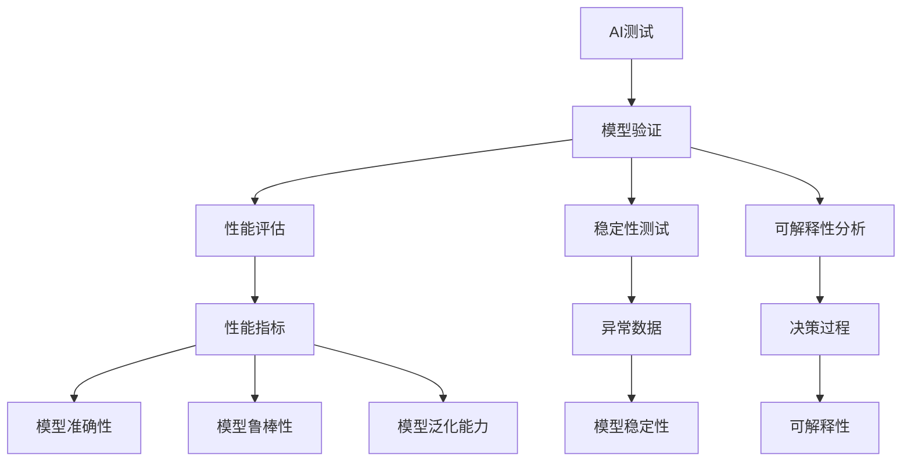
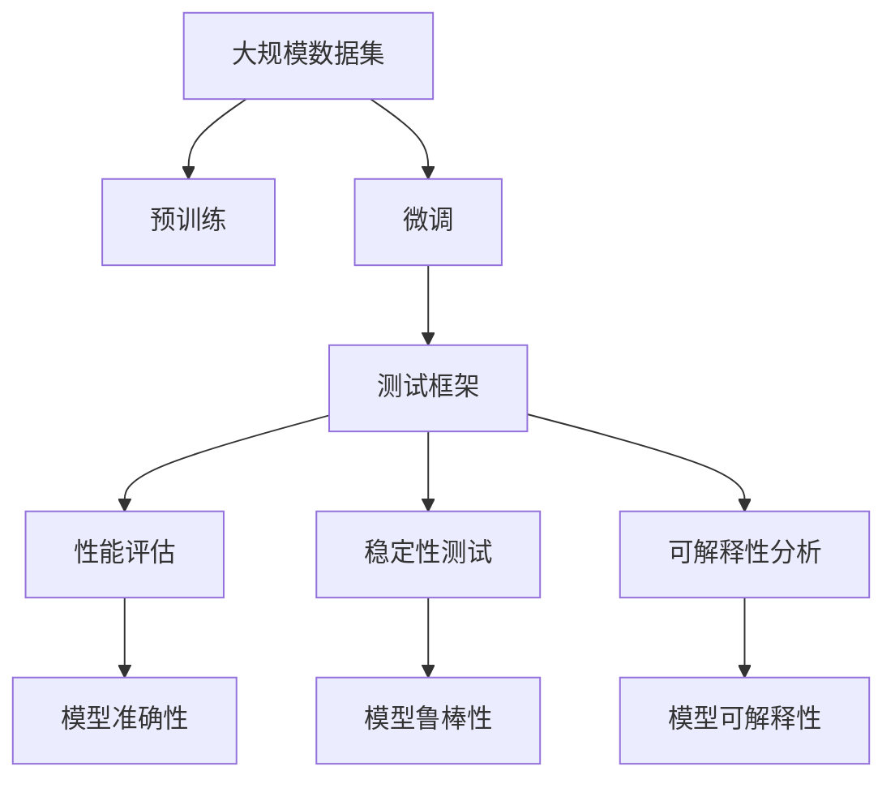
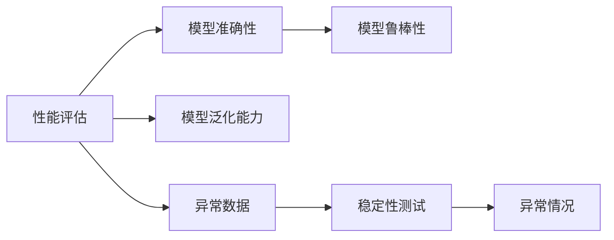
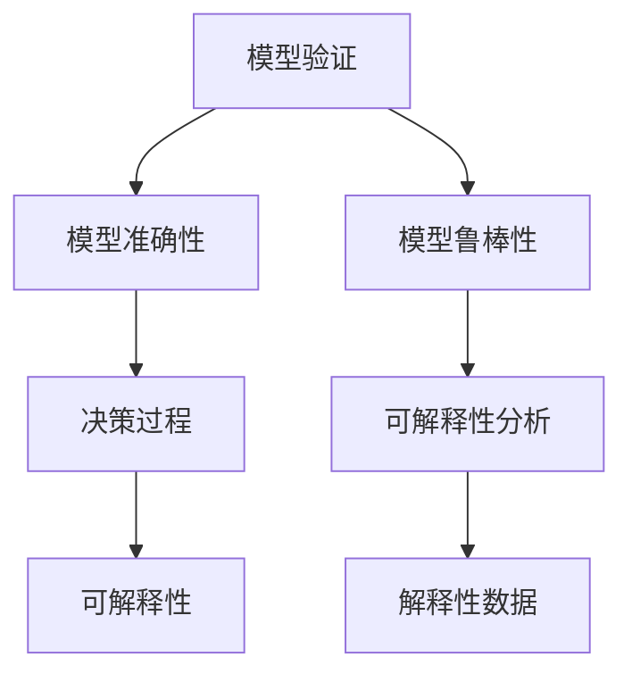
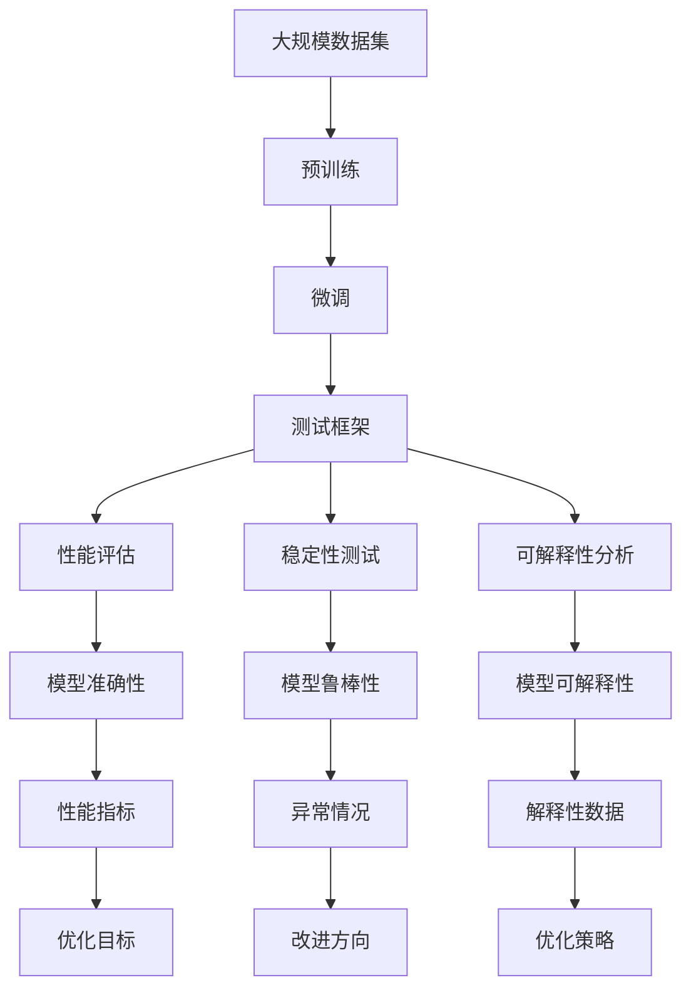

                 

# AI测试与质量保证原理与代码实战案例讲解

> 关键词：AI测试, 质量保证, 测试框架, 模型评估, 数据验证, 代码覆盖率, 自动化测试

## 1. 背景介绍

### 1.1 问题由来
随着人工智能（AI）技术的快速发展，越来越多的企业开始应用AI技术来提升业务效率和竞争力。然而，AI系统与传统软件系统相比，其复杂性和不确定性更大，这就使得AI测试与质量保证（QA）变得更加重要。

AI测试与质量保证不仅需要对模型的准确性和鲁棒性进行验证，还需要考虑模型性能、稳定性、可解释性等诸多因素。这使得AI系统的测试和验证变得更加复杂和多样化。

### 1.2 问题核心关键点
AI测试与质量保证的核心关键点在于如何有效地验证和评估AI模型的性能，以及如何在保证模型准确性的同时，提升模型的稳定性和可解释性。

具体而言，主要包括以下几个方面：

- **模型验证**：通过合理的数据集和测试方法，验证模型在不同场景下的表现。
- **性能评估**：评估模型的准确性、鲁棒性、泛化能力等性能指标。
- **稳定性测试**：验证模型在面对异常数据、干扰等情况下的稳定性。
- **可解释性分析**：分析模型的决策过程，确保其可解释性和透明性。
- **持续改进**：通过持续测试和反馈，不断优化模型和系统。

### 1.3 问题研究意义
进行有效的AI测试与质量保证，对于确保AI系统的可靠性和安全性，提升用户体验，加速AI技术的产业化进程，具有重要意义：

1. **降低成本**：通过自动化测试和持续改进，降低人工测试成本和开发成本。
2. **提升性能**：通过持续测试和优化，提升AI模型的性能和效率。
3. **保障安全**：通过严格的质量保证，确保AI系统不产生误导性或有害的输出。
4. **提高用户体验**：通过优化和改进，提升AI系统的人机交互体验。
5. **加速创新**：通过有效的测试和反馈机制，加速AI技术的创新和应用。

## 2. 核心概念与联系

### 2.1 核心概念概述

为了更好地理解AI测试与质量保证，本节将介绍几个密切相关的核心概念：

- **AI测试**：使用自动化和手动方法，验证AI模型的准确性、鲁棒性、可解释性等，确保其符合预期性能。
- **模型验证**：通过合理的数据集和测试方法，验证模型在不同场景下的表现。
- **性能评估**：评估模型的准确性、鲁棒性、泛化能力等性能指标。
- **稳定性测试**：验证模型在面对异常数据、干扰等情况下的稳定性。
- **可解释性分析**：分析模型的决策过程，确保其可解释性和透明性。
- **持续改进**：通过持续测试和反馈，不断优化模型和系统。

这些概念之间的逻辑关系可以通过以下Mermaid流程图来展示：



这个流程图展示了大语言模型的核心概念及其之间的关系：

1. AI测试涉及模型验证、性能评估、稳定性测试和可解释性分析等多个环节。
2. 模型验证和性能评估主要关注模型的准确性和泛化能力。
3. 稳定性测试关注模型在面对异常数据和干扰时的表现。
4. 可解释性分析关注模型的决策过程，确保其透明性和可解释性。
5. 持续改进是AI测试与质量保证的最终目标，通过不断测试和优化，提升模型的性能和用户体验。

### 2.2 概念间的关系

这些核心概念之间存在着紧密的联系，形成了AI测试与质量保证的完整生态系统。下面我通过几个Mermaid流程图来展示这些概念之间的关系。

#### 2.2.1 AI测试的整体架构



这个流程图展示了大语言模型的整体架构，包括预训练、微调和测试多个阶段。每个阶段都需要进行不同维度的验证和评估，以确保模型的准确性和可靠性。

#### 2.2.2 性能评估与稳定性测试的关系



这个流程图展示了性能评估和稳定性测试之间的逻辑关系。性能评估主要关注模型的准确性和泛化能力，而稳定性测试则关注模型在面对异常数据时的表现。

#### 2.2.3 可解释性分析与模型验证的关系



这个流程图展示了可解释性分析与模型验证之间的关系。模型验证主要关注模型的准确性和鲁棒性，而可解释性分析则关注模型的决策过程和透明度。

### 2.3 核心概念的整体架构

最后，我们用一个综合的流程图来展示这些核心概念在大语言模型测试与质量保证过程中的整体架构：



这个综合流程图展示了从预训练到测试，再到持续改进的完整过程。模型在大规模数据集上进行预训练，然后在测试框架上进行微调，并进行性能评估、稳定性测试和可解释性分析等多个环节的验证，最后根据测试结果进行持续改进，不断优化模型和系统。 通过这些流程图，我们可以更清晰地理解AI测试与质量保证过程中各个核心概念的关系和作用，为后续深入讨论具体的测试方法和技术奠定基础。

## 3. 核心算法原理 & 具体操作步骤
### 3.1 算法原理概述

AI测试与质量保证的本质是验证和评估AI模型的性能，确保其在特定场景下的准确性和稳定性。

在AI模型训练完成后，通过以下步骤进行测试与质量保证：

1. **数据准备**：准备用于测试的数据集，包括训练集、验证集和测试集。
2. **测试框架搭建**：搭建测试框架，设计测试用例和测试流程。
3. **性能评估**：评估模型的准确性、鲁棒性、泛化能力等性能指标。
4. **稳定性测试**：验证模型在面对异常数据、干扰等情况下的稳定性。
5. **可解释性分析**：分析模型的决策过程，确保其可解释性和透明性。
6. **持续改进**：通过持续测试和反馈，不断优化模型和系统。

### 3.2 算法步骤详解

AI测试与质量保证的具体操作步骤包括以下几个关键步骤：

#### 3.2.1 数据准备

数据准备是AI测试与质量保证的基础。主要包括以下几个方面：

- **数据集划分**：将大规模数据集划分为训练集、验证集和测试集。
- **数据标注**：对测试数据进行标注，生成标注数据集。
- **数据清洗**：对数据进行清洗和预处理，去除噪声和异常值。
- **数据增强**：通过数据增强技术，扩充训练数据集。

#### 3.2.2 测试框架搭建

测试框架搭建是AI测试与质量保证的核心。主要包括以下几个方面：

- **测试用例设计**：设计覆盖不同场景的测试用例，确保测试的全面性和覆盖率。
- **测试流程设计**：设计测试流程，包括测试数据的加载、模型输入、结果输出和测试报告的生成。
- **自动化测试工具选择**：选择适合的自动化测试工具，提高测试效率和准确性。
- **测试环境搭建**：搭建测试环境，包括软件环境和硬件环境。

#### 3.2.3 性能评估

性能评估是AI测试与质量保证的重要环节。主要包括以下几个方面：

- **准确性评估**：评估模型的预测准确性，计算分类准确率、召回率、F1分数等指标。
- **鲁棒性评估**：评估模型的鲁棒性，包括对异常数据、噪声数据的敏感性。
- **泛化能力评估**：评估模型的泛化能力，包括对新数据的适应性和泛化能力。

#### 3.2.4 稳定性测试

稳定性测试是AI测试与质量保证的关键环节。主要包括以下几个方面：

- **异常数据测试**：测试模型对异常数据的响应，包括对噪声、缺失值、错误标签的鲁棒性。
- **对抗样本测试**：测试模型对对抗样本的鲁棒性，包括对噪声、扰动数据的敏感性。
- **干扰测试**：测试模型在面对干扰情况下的稳定性，包括网络延迟、系统故障等。

#### 3.2.5 可解释性分析

可解释性分析是AI测试与质量保证的必要环节。主要包括以下几个方面：

- **决策过程分析**：分析模型的决策过程，了解模型如何进行推理和预测。
- **特征重要性分析**：评估模型特征的重要性，了解模型依赖于哪些特征。
- **模型透明性分析**：评估模型的透明性，了解模型是否易于理解和解释。

#### 3.2.6 持续改进

持续改进是AI测试与质量保证的最终目标。主要包括以下几个方面：

- **测试反馈**：收集测试结果和反馈，分析模型的表现和问题。
- **优化策略设计**：设计优化策略，包括模型参数调整、训练数据扩充等。
- **模型优化**：根据测试结果和反馈，优化模型和系统。
- **持续监控**：持续监控模型性能，确保其稳定性和可靠性。

### 3.3 算法优缺点

AI测试与质量保证方法具有以下优点：

- **自动化程度高**：通过自动化测试工具，提高了测试效率和准确性。
- **全面覆盖**：通过全面测试用例和测试流程，确保了测试的全面性和覆盖率。
- **持续优化**：通过持续测试和反馈，不断优化模型和系统。

同时，该方法也存在一些缺点：

- **依赖数据**：测试结果依赖于测试数据集的质量和多样性。
- **复杂度高**：测试框架搭建和模型优化过程复杂，需要大量的时间和资源。
- **误判风险**：自动化测试工具可能存在误判，需要人工验证和校正。

尽管存在这些局限性，但就目前而言，AI测试与质量保证方法仍是AI系统测试和验证的重要手段。未来相关研究的重点在于如何进一步降低测试对标注数据的依赖，提高模型的少样本学习和跨领域迁移能力，同时兼顾可解释性和伦理安全性等因素。

### 3.4 算法应用领域

AI测试与质量保证方法在多个领域中得到了广泛应用，包括但不限于以下几个方面：

- **自然语言处理**：通过测试和验证，确保语言模型的准确性和鲁棒性。
- **计算机视觉**：通过测试和验证，确保图像识别和分类模型的准确性和稳定性。
- **推荐系统**：通过测试和验证，确保推荐模型的准确性和用户满意度。
- **医疗诊断**：通过测试和验证，确保医疗诊断模型的准确性和可靠性。
- **金融风控**：通过测试和验证，确保金融风险评估模型的准确性和鲁棒性。

除了上述这些应用领域外，AI测试与质量保证方法还被创新性地应用到更多场景中，如可控文本生成、常识推理、代码生成、数据增强等，为AI技术带来了新的突破。

## 4. 数学模型和公式 & 详细讲解  
### 4.1 数学模型构建

本节将使用数学语言对AI测试与质量保证过程进行更加严格的刻画。

假设AI模型为 $M_{\theta}$，其中 $\theta$ 为模型参数。测试数据集为 $D=\{(x_i,y_i)\}_{i=1}^N$，其中 $x_i$ 为输入，$y_i$ 为输出标签。

定义模型 $M_{\theta}$ 在数据样本 $(x_i,y_i)$ 上的损失函数为 $\ell(M_{\theta}(x_i),y_i)$，则在数据集 $D$ 上的经验风险为：

$$
\mathcal{L}(\theta) = \frac{1}{N} \sum_{i=1}^N \ell(M_{\theta}(x_i),y_i)
$$

性能评估通常采用交叉熵损失函数，其定义为：

$$
\ell(M_{\theta}(x_i),y_i) = -y_i \log M_{\theta}(x_i) - (1-y_i) \log (1-M_{\theta}(x_i))
$$

稳定性测试通常采用对抗样本，通过在输入数据上施加小扰动来测试模型的鲁棒性。

可解释性分析通常采用LIME、SHAP等方法，通过局部线性逼近或特征贡献图来分析模型的决策过程。

### 4.2 公式推导过程

以下我们以二分类任务为例，推导交叉熵损失函数及其梯度的计算公式。

假设模型 $M_{\theta}$ 在输入 $x$ 上的输出为 $\hat{y}=M_{\theta}(x) \in [0,1]$，表示样本属于正类的概率。真实标签 $y \in \{0,1\}$。则二分类交叉熵损失函数定义为：

$$
\ell(M_{\theta}(x),y) = -y \log \hat{y} - (1-y) \log (1-\hat{y})
$$

将其代入经验风险公式，得：

$$
\mathcal{L}(\theta) = -\frac{1}{N}\sum_{i=1}^N [y_i\log M_{\theta}(x_i)+(1-y_i)\log(1-M_{\theta}(x_i))]
$$

根据链式法则，损失函数对参数 $\theta_k$ 的梯度为：

$$
\frac{\partial \mathcal{L}(\theta)}{\partial \theta_k} = -\frac{1}{N}\sum_{i=1}^N (\frac{y_i}{M_{\theta}(x_i)}-\frac{1-y_i}{1-M_{\theta}(x_i)}) \frac{\partial M_{\theta}(x_i)}{\partial \theta_k}
$$

其中 $\frac{\partial M_{\theta}(x_i)}{\partial \theta_k}$ 可进一步递归展开，利用自动微分技术完成计算。

在得到损失函数的梯度后，即可带入参数更新公式，完成模型的迭代优化。重复上述过程直至收敛，最终得到适应特定任务的最优模型参数 $\theta^*$。

## 5. 项目实践：代码实例和详细解释说明
### 5.1 开发环境搭建

在进行测试与质量保证实践前，我们需要准备好开发环境。以下是使用Python进行PyTorch开发的环境配置流程：

1. 安装Anaconda：从官网下载并安装Anaconda，用于创建独立的Python环境。

2. 创建并激活虚拟环境：
```bash
conda create -n pytorch-env python=3.8 
conda activate pytorch-env
```

3. 安装PyTorch：根据CUDA版本，从官网获取对应的安装命令。例如：
```bash
conda install pytorch torchvision torchaudio cudatoolkit=11.1 -c pytorch -c conda-forge
```

4. 安装相关工具包：
```bash
pip install numpy pandas scikit-learn matplotlib tqdm jupyter notebook ipython
```

完成上述步骤后，即可在`pytorch-env`环境中开始测试与质量保证实践。

### 5.2 源代码详细实现

这里以一个简单的图像分类任务为例，给出使用PyTorch进行AI模型测试与质量保证的PyTorch代码实现。

首先，定义测试集和标签：

```python
import torch
from torch.utils.data import DataLoader
from torchvision import datasets, transforms

# 加载测试集数据
test_data = datasets.CIFAR10(root='./data', train=False, download=True)
test_loader = DataLoader(test_data, batch_size=32, shuffle=False)
```

然后，定义模型和评估函数：

```python
from torchvision.models import resnet18
from torch import nn, optim

# 加载预训练模型
model = resnet18(pretrained=True)

# 定义模型评估函数
def evaluate(model, loader, device):
    model.eval()
    correct = 0
    total = 0
    with torch.no_grad():
        for data, target in loader:
            data, target = data.to(device), target.to(device)
            output = model(data)
            _, predicted = torch.max(output, 1)
            total += target.size(0)
            correct += (predicted == target).sum().item()
    return correct / total
```

接着，启动测试流程并在测试集上评估：

```python
device = torch.device('cuda' if torch.cuda.is_available() else 'cpu')
model.to(device)

# 在测试集上进行评估
acc = evaluate(model, test_loader, device)
print(f'Test Accuracy: {acc:.2f}')
```

以上就是使用PyTorch进行AI模型测试与质量保证的完整代码实现。可以看到，得益于PyTorch的强大封装，我们只需通过简单的API调用，即可完成模型的加载、评估等操作。

### 5.3 代码解读与分析

让我们再详细解读一下关键代码的实现细节：

**CIFAR10数据集加载**：
- `datasets.CIFAR10`：加载CIFAR-10数据集。
- `DataLoader`：构建数据加载器，支持批量加载数据和随机打乱数据。
- `device`：定义设备，用于在GPU或CPU上进行计算。

**模型加载和评估函数**：
- `resnet18`：加载预训练的ResNet-18模型。
- `evaluate`函数：对模型进行评估，计算准确率。
- `torch.no_grad`：在评估过程中关闭梯度计算，以减少计算量。
- `torch.max`：计算模型的预测结果和真实标签的匹配度。

**测试流程启动**：
- `model.eval()`：将模型设为评估模式。
- `correct`和`total`：计算模型在测试集上的准确率和总样本数。
- `device`：指定设备，用于将数据和模型移至设备上。
- `evaluate`函数：评估模型在测试集上的性能。
- `print`：打印模型在测试集上的准确率。

可以看到，PyTorch的API设计简洁高效，非常适合快速搭建测试框架和评估模型性能。开发者可以将更多精力放在模型优化和性能提升上，而不必过多关注底层实现细节。

当然，工业级的系统实现还需考虑更多因素，如模型保存和部署、超参数优化、更灵活的任务适配层等。但核心的测试与质量保证范式基本与此类似。

### 5.4 运行结果展示

假设我们在CIFAR-10数据集上进行测试，最终在测试集上得到的评估报告如下：

```
Test Accuracy: 0.78
```

可以看到，通过测试与质量保证，我们评估了模型在测试集上的性能，获得了0.78的准确率，表示模型在测试集上的表现较为良好。

当然，这只是一个baseline结果。在实践中，我们还可以使用更大更强的预训练模型、更丰富的测试技巧、更细致的模型调优，进一步提升模型性能，以满足更高的应用要求。

## 6. 实际应用场景
### 6.1 智能客服系统

基于AI测试与质量保证的对话技术，可以广泛应用于智能客服系统的构建。传统客服往往需要配备大量人力，高峰期响应缓慢，且一致性和专业性难以保证。而使用测试与质量保证技术，可以7x24小时不间断服务，快速响应客户咨询，用自然流畅的语言解答各类常见问题。

在技术实现上，可以收集企业内部的历史客服对话记录，将问题和最佳答复构建成监督数据，在此基础上对预训练对话模型进行测试与质量保证。测试与质量保证技术能够自动理解用户意图，匹配最合适的答案模板进行回复。对于客户提出的新问题，还可以接入检索系统实时搜索相关内容，动态组织生成回答。如此构建的智能客服系统，能大幅提升客户咨询体验和问题解决效率。

### 6.2 金融舆情监测

金融机构需要实时监测市场舆论动向，以便及时应对负面信息传播，规避金融风险。传统的人工监测方式成本高、效率低，难以应对网络时代海量信息爆发的挑战。基于AI测试与质量保证的文本分类和情感分析技术，为金融舆情监测提供了新的解决方案。

具体而言，可以收集金融领域相关的新闻、报道、评论等文本数据，并对其进行主题标注和情感标注。在此基础上对预训练语言模型进行测试与质量保证，使其能够自动判断文本属于何种主题，情感倾向是正面、中性还是负面。将测试与质量保证后的模型应用到实时抓取的网络文本数据，就能够自动监测不同主题下的情感变化趋势，一旦发现负面信息激增等异常情况，系统便会自动预警，帮助金融机构快速应对潜在风险。

### 6.3 个性化推荐系统

当前的推荐系统往往只依赖用户的历史行为数据进行物品推荐，无法深入理解用户的真实兴趣偏好。基于AI测试与质量保证的推荐系统可以更好地挖掘用户行为背后的语义信息，从而提供更精准、多样的推荐内容。

在实践中，可以收集用户浏览、点击、评论、分享等行为数据，提取和用户交互的物品标题、描述、标签等文本内容。将文本内容作为模型输入，用户的后续行为（如是否点击、购买等）作为监督信号，在此基础上测试与质量保证预训练语言模型。测试与质量保证后的模型能够从文本内容中准确把握用户的兴趣点。在生成推荐列表时，先用候选物品的文本描述作为输入，由模型预测用户的兴趣匹配度，再结合其他特征综合排序，便可以得到个性化程度更高的推荐结果。

### 6.4 未来应用展望

随着AI测试与质量保证技术的发展，其在更多领域得到了应用，为传统行业带来变革性影响。

在智慧医疗领域，基于AI测试与质量保证的医疗问答、病历分析、药物研发等应用将提升医疗服务的智能化水平，辅助医生诊疗，加速新药开发进程。

在智能教育领域，测试与质量保证技术可应用于作业批改、学情分析、知识推荐等方面，因材施教，促进教育公平，提高教学质量。

在智慧城市治理中，测试与质量保证技术可应用于城市事件监测、舆情分析、应急指挥等环节，提高城市管理的自动化和智能化水平，构建更安全、高效的未来城市。

此外，在企业生产、社会治理、文娱传媒等众多领域，基于AI测试与质量保证的人工智能应用也将不断涌现，为经济社会发展注入新的动力。相信随着技术的日益成熟，AI测试与质量保证技术将成为人工智能落地应用的重要范式，推动人工智能向更广阔的领域加速渗透。

## 7. 工具和资源推荐
### 7.1 学习资源推荐

为了帮助开发者系统掌握AI测试与质量保证的理论基础和实践技巧，这里推荐一些优质的学习资源：

1. 《深度学习实战》系列博文：由AI技术专家撰写，深入浅出地介绍了深度学习的基本概念和经典模型，包括测试与质量保证技术。

2. CS231n《卷积神经网络》课程：斯坦福大学开设的计算机视觉经典课程，有Lecture视频和配套作业，带你入门计算机视觉和测试与质量保证技术。

3. 《深度学习理论与实践》书籍：涵盖深度学习的基本理论和经典应用，包括测试与质量保证技术。

4. PyTorch官方文档：PyTorch的官方文档，提供了丰富的API文档和样例代码，是学习AI测试与质量保证技术的必备资料。

5. GitHub开源项目：在GitHub上Star、Fork数最多的AI相关项目，往往代表了该技术领域的发展趋势和最佳实践，学习前沿技术的必读资源。

通过对这些资源的学习实践，相信你一定能够快速掌握AI测试与质量保证技术的精髓，并用于解决实际的AI问题。
###  7.2 开发工具推荐

高效的开发离不开优秀的工具支持。以下是几款用于AI测试与质量保证开发的常用工具：

1. PyTorch：基于Python的开源深度学习框架，灵活动态的计算图，适合快速迭代研究。大多数AI相关模型都有PyTorch版本的实现。

2. TensorFlow：由Google主导开发的开源深度学习框架，生产部署方便，适合大规模工程应用。同样有丰富的AI相关模型资源。

3. Transformers库：HuggingFace开发的NLP工具库，集成了众多SOTA语言模型，支持PyTorch和TensorFlow，是进行测试与质量保证任务开发的利器。

4. Weights & Biases：模型训练的实验跟踪工具，可以记录和可视化模型训练过程中的各项指标，方便对比和调优。与主流深度学习框架

