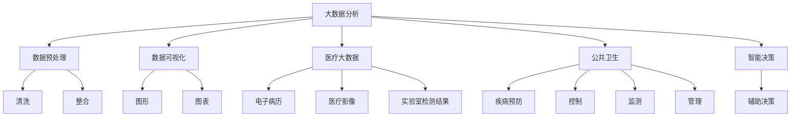

                 

# 省医疗大数据可视化分析与应用

> 关键词：大数据分析, 可视化技术, 医疗健康, 公共卫生, 智能决策

## 1. 背景介绍

### 1.1 问题由来
随着科技的发展，医疗健康数据量呈爆炸式增长。据统计，全球每年产生的数据量已经达到数十ZB（Zettabyte）。以中国为例，医疗行业的数据量也在快速增长。据预测，到2025年，中国的医疗数据规模将达到1.8 ZB，数据类型包括电子病历、影像数据、实验室检测结果等，覆盖病患信息、治疗方案、健康评估等多个方面。这些医疗数据蕴含着海量的临床知识、专家经验，是医疗决策的重要支撑。

然而，医疗数据往往具有复杂性、多源异构性等特点，数据格式、语言编码、单位转换等问题使得数据整合、分析、利用变得十分困难。医疗大数据的处理需要高度的专业知识、高效的算法和强大的计算能力，这对于医疗健康领域的决策支持、疾病预防、个性化医疗等方面具有重要的应用价值。

### 1.2 问题核心关键点
本节将围绕省医疗大数据可视化分析应用的核心问题展开讨论，主要包括：

- 大数据分析与可视化技术在医疗领域的应用价值
- 数据预处理、清洗、整合方法
- 大数据分析中的算法与技术
- 基于可视化的分析应用

### 1.3 问题研究意义
研究省医疗大数据可视化分析与应用，对于提升公共卫生水平、推动医疗服务智能化、支撑精准医疗等具有重要意义：

1. **提升公共卫生水平**：通过数据分析，可以快速发现公共卫生风险，优化疾病防控策略，提升公共健康水平。
2. **推动医疗服务智能化**：数据可视化的技术可以辅助医生、医院管理者进行决策，提升医疗服务质量。
3. **支撑精准医疗**：大数据分析可以帮助识别个性化医疗方案，提高治疗效果。
4. **推动行业创新**：基于大数据分析的可视化应用，可以推动医疗健康行业的创新发展，激发新的商业价值。

## 2. 核心概念与联系

### 2.1 核心概念概述

在探讨省医疗大数据可视化分析与应用的过程中，需要明确以下几个核心概念：

- **大数据分析（Big Data Analytics）**：利用先进的数据处理和分析技术，从海量数据中提取有价值的信息，支持决策和运营优化。
- **数据可视化（Data Visualization）**：将复杂数据通过图形、图表等形式直观呈现，便于理解和分析。
- **医疗大数据（Healthcare Big Data）**：医疗健康领域产生的海量数据，包括电子病历、医疗影像、实验室检测结果等。
- **公共卫生（Public Health）**：涉及疾病预防、控制、监测和管理的综合性活动，目的是保护和提高人群的健康水平。
- **智能决策（Intelligent Decision Making）**：基于数据分析和人工智能技术，辅助决策者进行科学决策。

这些概念相互联系，共同构成了省医疗大数据可视化分析与应用的基础框架。

### 2.2 概念间的关系

这些核心概念之间的关系可以用以下Mermaid流程图表示：



此流程图展示了核心概念之间的关系：

- **数据预处理**：对原始医疗数据进行清洗、整合，消除噪音，保证数据质量。
- **数据可视化**：将清洗后的数据通过图形、图表等形式直观展示，便于分析和理解。
- **智能决策**：结合数据分析结果，辅助决策者做出科学的决策，提升医疗服务水平。

通过这些核心概念的结合，可以实现对省医疗大数据的综合分析与应用。

## 3. 核心算法原理 & 具体操作步骤

### 3.1 算法原理概述

省医疗大数据可视化分析与应用的核心算法原理基于以下两个关键步骤：

1. **数据预处理与清洗**：对原始医疗数据进行去重、降噪、填充缺失值等处理，确保数据质量。
2. **数据可视化和分析**：利用数据可视化技术，将处理后的数据通过图形、图表等形式直观展示，结合大数据分析技术，提取有价值的信息，支持决策。

### 3.2 算法步骤详解

#### 3.2.1 数据预处理与清洗

数据预处理与清洗是省医疗大数据分析的基础，主要包括以下几个步骤：

1. **数据导入与检查**：从不同数据源导入数据，检查数据格式、编码等。
2. **数据清洗**：处理缺失值、异常值、重复数据等。
3. **数据标准化与归一化**：统一数据格式，如单位转换、数据标准化等。
4. **数据整合**：对不同数据源的数据进行整合，建立统一的数据模型。

#### 3.2.2 数据可视化和分析

数据可视化和分析是省医疗大数据分析的关键步骤，主要包括以下几个方面：

1. **数据探索**：通过数据可视化工具，如Tableau、Power BI等，对数据进行初步探索，发现数据特征和规律。
2. **数据挖掘**：利用数据挖掘算法，如聚类、分类、回归等，提取有价值的信息。
3. **交互式分析**：通过交互式分析工具，如Google Analytics、Tableau等，对数据进行深入分析，支持决策。

### 3.3 算法优缺点

#### 3.3.1 优点

省医疗大数据可视化分析与应用具有以下优点：

1. **提高决策效率**：通过可视化和分析，快速发现数据中的关键信息，辅助决策者进行科学决策。
2. **增强数据理解**：通过直观的图表和图形，易于理解和分析数据，发现数据背后的规律和趋势。
3. **促进数据驱动**：结合数据可视化和分析，推动医疗健康领域的数据驱动决策，提升医疗服务水平。

#### 3.3.2 缺点

1. **数据质量依赖**：数据的准确性和完整性对分析结果的影响较大，数据预处理和清洗需要较高的专业能力。
2. **技术门槛较高**：数据可视化分析需要掌握多种工具和技术，如Python、R、SQL等，对于非专业人士有一定难度。
3. **隐私和安全问题**：医疗数据涉及患者隐私，需要采取严格的隐私保护和安全措施。

### 3.4 算法应用领域

省医疗大数据可视化分析与应用广泛适用于以下几个领域：

1. **公共卫生监测**：通过数据分析和可视化，监测疾病流行趋势、疫情发展等。
2. **疾病预防控制**：结合数据分析结果，制定科学的预防控制措施，提升公共健康水平。
3. **个性化医疗**：基于数据分析结果，提供个性化的医疗方案，提升治疗效果。
4. **医疗服务优化**：通过数据分析，优化医院运营管理、提升医疗服务质量。
5. **健康管理**：结合数据分析结果，进行健康风险评估、疾病预测等。

## 4. 数学模型和公式 & 详细讲解 & 举例说明

### 4.1 数学模型构建

在省医疗大数据可视化分析与应用中，数据预处理、清洗、整合等步骤涉及大量数学模型和算法。以下以一个简单的例子来说明数据预处理中的缺失值处理：

假设我们有一个数据集，包含一些患者的年龄、性别、血压、血糖等数据，部分患者缺失了一些数据。为了进行分析，我们需要对这些缺失值进行处理。

1. **均值填补**：使用均值填补法，将缺失值替换为该列的平均值。
2. **插值法填补**：使用插值法，根据相邻的数据点进行填补。
3. **KNN填补**：使用K近邻算法，找到与缺失值最相似的数据点进行填补。

### 4.2 公式推导过程

以均值填补为例，公式推导过程如下：

设缺失值在列$X$的第$i$行，使用均值填补法进行填补，公式如下：

$$
X_{i} = \frac{1}{n}\sum_{j=1}^{n}X_{j}
$$

其中，$n$为该列的样本数，$X_{i}$表示处理后的数据，$X_{j}$表示原始数据。

### 4.3 案例分析与讲解

以某省医院电子病历数据为例，进行数据分析和可视化：

1. **数据预处理**：将原始的电子病历数据导入数据库，进行数据清洗和标准化。
2. **数据可视化**：使用Tableau进行数据探索，生成饼图、柱状图、散点图等。
3. **数据分析**：利用数据分析算法，如聚类、分类等，提取有价值的信息。
4. **交互式分析**：使用Tableau进行交互式分析，生成动态仪表盘，支持实时查询。

通过数据分析和可视化，可以发现疾病流行趋势、患者特征分布等关键信息，为公共卫生决策提供支持。

## 5. 项目实践：代码实例和详细解释说明

### 5.1 开发环境搭建

为了进行省医疗大数据可视化分析与应用，需要搭建一个开发环境，包括：

1. **开发语言**：Python、R等。
2. **数据处理工具**：SQL、Hadoop、Spark等。
3. **可视化工具**：Tableau、Power BI、Matplotlib等。
4. **编程环境**：Jupyter Notebook、PyCharm等。

### 5.2 源代码详细实现

以下是一个简单的Python代码示例，用于对电子病历数据进行初步处理和可视化：

```python
import pandas as pd
import matplotlib.pyplot as plt
import seaborn as sns

# 读取电子病历数据
data = pd.read_csv('electronic_health_records.csv')

# 数据清洗
data.dropna(inplace=True)  # 删除缺失值
data.drop_duplicates(inplace=True)  # 删除重复数据

# 数据标准化
data['age'] = data['age'].astype(int)  # 年龄转换为整数
data['blood_pressure'] = data['blood_pressure'].astype(float)  # 血压转换为浮点数

# 数据可视化
sns.histplot(data['age'], kde=True, color='blue', bins=20)
plt.title('Electronic Health Records Age Distribution')
plt.show()
```

### 5.3 代码解读与分析

在上述代码中，首先使用Pandas库读取电子病历数据，然后进行数据清洗和标准化处理。最后使用Seaborn库生成直方图，展示年龄分布情况。

通过代码示例，可以看出数据处理和可视化的基本流程和实现方法。

### 5.4 运行结果展示

运行上述代码后，生成一个直方图，展示电子病历数据中患者的年龄分布情况。


通过可视化结果，可以直观地看到数据分布特征，为后续的深入分析提供基础。

## 6. 实际应用场景

### 6.1 公共卫生监测

公共卫生监测是省医疗大数据可视化分析与应用的典型场景。通过分析各类公共卫生数据，可以实时监控疾病流行趋势、疫情发展等，及时采取措施，防止疾病传播。

以某省的新冠疫情为例，通过数据分析和可视化，可以实时监控每日新增病例、死亡病例、治愈病例等关键指标，为疫情防控提供决策支持。

### 6.2 疾病预防控制

疾病预防控制是省医疗大数据可视化分析与应用的另一个重要场景。通过数据分析和可视化，可以制定科学的预防控制措施，提升公共健康水平。

以某省的流感防治为例，通过分析历年的流感病例数据，可以发现季节性规律，制定科学的防治措施，提前预防流感爆发。

### 6.3 个性化医疗

个性化医疗是省医疗大数据可视化分析与应用的高级应用场景。通过数据分析和可视化，可以为患者提供个性化的医疗方案，提升治疗效果。

以某省的癌症治疗为例，通过分析患者的基因数据、病历数据等，可以制定个性化的治疗方案，提升治疗效果。

### 6.4 未来应用展望

随着技术的进步，省医疗大数据可视化分析与应用将有以下几个发展方向：

1. **实时数据处理**：结合实时数据处理技术，如Kafka、Spark Streaming等，实现实时数据可视化和分析。
2. **多数据源整合**：整合来自不同数据源的数据，如电子病历、医疗影像、实验室检测结果等，提升数据质量。
3. **智能决策支持**：结合人工智能技术，如深度学习、自然语言处理等，提供智能决策支持。
4. **隐私保护与数据安全**：采取严格的隐私保护和安全措施，确保数据安全。

## 7. 工具和资源推荐

### 7.1 学习资源推荐

为了深入学习省医疗大数据可视化分析与应用，推荐以下学习资源：

1. **数据科学基础**：通过《数据科学导论》等书籍，学习数据处理、数据分析、数据可视化等基本概念和技能。
2. **医疗大数据应用**：通过《医疗大数据应用实践》等书籍，学习医疗大数据分析、可视化等应用。
3. **编程语言**：通过《Python编程实战》等书籍，学习Python编程语言。
4. **数据处理工具**：通过《SQL入门教程》等书籍，学习SQL数据库操作。
5. **可视化工具**：通过《Tableau 10实战指南》等书籍，学习Tableau数据可视化技术。

### 7.2 开发工具推荐

以下开发工具可用于省医疗大数据可视化分析与应用：

1. **Python**：数据处理和分析的通用编程语言，支持Pandas、NumPy、Matplotlib等库。
2. **R**：数据科学和统计分析的常用语言，支持ggplot2、dplyr等库。
3. **Tableau**：数据可视化的主流工具，支持拖放式操作。
4. **Power BI**：微软的数据可视化工具，支持强大的数据处理和分析功能。
5. **Jupyter Notebook**：Python编程的交互式环境，支持代码、图表、文本等混合展示。

### 7.3 相关论文推荐

以下是几篇省医疗大数据可视化分析与应用的经典论文：

1. **数据挖掘与公共卫生**：通过大数据分析，发现公共卫生领域的潜在风险和趋势。
2. **医疗大数据可视化**：介绍如何利用大数据可视化技术，提升医疗服务质量。
3. **智能决策支持系统**：探讨利用大数据分析技术，提供智能决策支持。
4. **隐私保护与数据安全**：研究如何保护医疗数据的隐私和安全，确保数据使用合规。

## 8. 总结：未来发展趋势与挑战

### 8.1 研究成果总结

省医疗大数据可视化分析与应用的研究成果涵盖了数据预处理、数据可视化、智能决策等多个方面，推动了医疗健康领域的智能化发展。

### 8.2 未来发展趋势

未来，省医疗大数据可视化分析与应用将有以下几个发展趋势：

1. **实时数据处理**：结合实时数据处理技术，实现实时数据可视化和分析。
2. **多数据源整合**：整合来自不同数据源的数据，提升数据质量。
3. **智能决策支持**：结合人工智能技术，提供智能决策支持。
4. **隐私保护与数据安全**：采取严格的隐私保护和安全措施，确保数据安全。

### 8.3 面临的挑战

尽管省医疗大数据可视化分析与应用取得了显著进展，但仍面临以下挑战：

1. **数据质量问题**：原始数据的准确性和完整性对分析结果的影响较大，数据预处理和清洗需要较高的专业能力。
2. **技术门槛较高**：数据可视化分析需要掌握多种工具和技术，如Python、R、SQL等，对于非专业人士有一定难度。
3. **隐私和安全问题**：医疗数据涉及患者隐私，需要采取严格的隐私保护和安全措施。

### 8.4 研究展望

未来的研究需要在以下几个方面寻求新的突破：

1. **实时数据处理技术**：研究实时数据处理技术，提升数据可视化和分析的实时性。
2. **多数据源整合方法**：研究多数据源整合方法，提升数据质量和分析的全面性。
3. **智能决策支持技术**：研究智能决策支持技术，提升决策的科学性和效率。
4. **隐私保护和安全措施**：研究隐私保护和安全措施，确保数据安全。

## 9. 附录：常见问题与解答

### 9.1 Q1: 大数据分析与可视化技术在医疗领域的应用价值是什么？

**A1**: 大数据分析与可视化技术在医疗领域的应用价值主要体现在以下几个方面：

1. **提升决策效率**：通过数据分析和可视化，快速发现数据中的关键信息，辅助决策者进行科学决策。
2. **增强数据理解**：通过直观的图表和图形，易于理解和分析数据，发现数据背后的规律和趋势。
3. **促进数据驱动**：结合数据可视化和分析，推动医疗健康领域的数据驱动决策，提升医疗服务水平。

### 9.2 Q2: 数据预处理、清洗、整合的方法有哪些？

**A2**: 数据预处理、清洗、整合的方法主要包括以下几种：

1. **数据导入与检查**：从不同数据源导入数据，检查数据格式、编码等。
2. **数据清洗**：处理缺失值、异常值、重复数据等。
3. **数据标准化与归一化**：统一数据格式，如单位转换、数据标准化等。
4. **数据整合**：对不同数据源的数据进行整合，建立统一的数据模型。

### 9.3 Q3: 如何降低数据预处理和清洗的复杂度？

**A3**: 降低数据预处理和清洗的复杂度可以从以下几个方面入手：

1. **自动化工具**：使用自动化工具，如ETL工具、数据清洗工具等，提高数据处理的效率。
2. **数据预处理模板**：根据数据类型和特点，设计通用的数据预处理模板，减少人工干预。
3. **数据质量检查**：在数据预处理过程中，进行数据质量检查，及时发现和处理问题。

### 9.4 Q4: 数据可视化工具有哪些？

**A4**: 常用的数据可视化工具包括：

1. **Tableau**：支持拖放式操作，易于使用。
2. **Power BI**：微软的数据可视化工具，支持强大的数据处理和分析功能。
3. **Matplotlib**：Python的绘图库，支持多种图表类型。
4. **Seaborn**：基于Matplotlib的高级绘图库，支持统计图表。

### 9.5 Q5: 如何保护医疗数据的隐私和安全？

**A5**: 保护医疗数据的隐私和安全可以从以下几个方面入手：

1. **数据匿名化**：对医疗数据进行匿名化处理，防止数据泄露。
2. **访问控制**：对数据访问进行严格控制，确保只有授权人员可以访问数据。
3. **加密技术**：对数据进行加密处理，防止数据被未授权访问。
4. **隐私保护法律**：遵循相关法律法规，保护患者隐私。

通过以上问题的解答，可以更好地理解省医疗大数据可视化分析与应用的核心概念和技术方法。

---

作者：禅与计算机程序设计艺术 / Zen and the Art of Computer Programming

