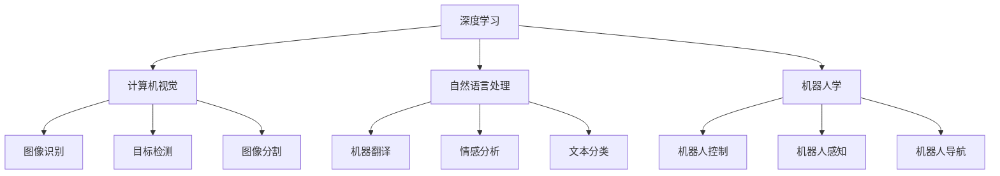

# 清华大学的人工智能研究历程

> 关键词：清华大学，人工智能，研究历程，深度学习，计算机视觉，自然语言处理，机器人学，交叉学科，产学研结合

## 1. 背景介绍

清华大学作为中国顶尖的学府之一，在人工智能领域的研究与发展始终处于国内领先地位。从早期的计算机科学基础研究，到如今的深度学习、计算机视觉、自然语言处理、机器人学等多个方向的深入探索，清华大学的人工智能研究历程，不仅反映了人工智能技术的发展脉络，也展现了中国在人工智能领域的发展成就。

### 1.1 清华大学人工智能研究的历史背景

清华大学的人工智能研究起源于20世纪50年代，随着计算机科学的兴起，清华大学开始涉足人工智能领域。当时的重点研究方向包括自动程序设计、专家系统等。随着计算机科学的不断发展，清华大学的人工智能研究也不断拓展，涵盖了机器学习、知识表示、自然语言处理等多个方向。

### 1.2 清华大学人工智能研究的现状

近年来，随着深度学习技术的突破，清华大学的人工智能研究取得了显著的成果。清华大学计算机科学与技术系、自动化系、软件学院等多个院系都开展了人工智能相关的研究，形成了多个研究团队，如清华大学计算机视觉实验室、清华大学自然语言处理实验室、清华大学机器人实验室等。

## 2. 核心概念与联系

### 2.1 核心概念

#### 深度学习

深度学习是清华大学人工智能研究的一个重要方向，它通过构建深层神经网络，模拟人脑神经元之间的连接，实现对数据的自动学习和特征提取。深度学习在图像识别、语音识别、自然语言处理等领域取得了突破性的成果。

#### 计算机视觉

计算机视觉是人工智能的一个重要分支，它研究如何让计算机能够像人类一样“看”世界。清华大学在计算机视觉领域的研究包括图像识别、目标检测、图像分割等。

#### 自然语言处理

自然语言处理是人工智能领域的一个重要分支，它研究如何让计算机理解和生成自然语言。清华大学在自然语言处理领域的研究包括机器翻译、情感分析、文本分类等。

#### 机器人学

机器人学是人工智能与工程学交叉的领域，它研究如何让机器人能够执行复杂的任务。清华大学在机器人学领域的研究包括机器人控制、机器人感知、机器人导航等。

### 2.2 核心概念原理和架构的 Mermaid 流程图

## 3. 核心算法原理 & 具体操作步骤

### 3.1 算法原理概述

#### 深度学习

深度学习算法基于多层神经网络，通过前向传播和反向传播算法，学习数据的特征表示和模式。

#### 计算机视觉

计算机视觉算法通常包括特征提取、特征匹配、目标检测、图像分割等步骤。

#### 自然语言处理

自然语言处理算法包括词嵌入、序列标注、句法分析、语义理解等步骤。

#### 机器人学

机器人学算法包括运动规划、感知融合、决策控制等步骤。

### 3.2 算法步骤详解

#### 深度学习

1. 数据预处理：对原始数据进行清洗、标准化等处理。
2. 构建神经网络：设计网络结构，选择合适的激活函数和优化算法。
3. 训练模型：使用标注数据进行训练，优化模型参数。
4. 评估模型：使用测试数据评估模型性能，调整模型结构或参数。

#### 计算机视觉

1. 特征提取：从图像中提取特征，如颜色、纹理、形状等。
2. 特征匹配：将提取的特征与已知模式进行匹配。
3. 目标检测：定位图像中的目标并分类。
4. 图像分割：将图像划分为多个区域。

#### 自然语言处理

1. 词嵌入：将文本转换为数字向量。
2. 序列标注：对文本序列中的每个词进行标注。
3. 句法分析：分析句子的语法结构。
4. 语义理解：理解文本的语义内容。

#### 机器人学

1. 运动规划：规划机器人的动作序列。
2. 感知融合：融合多源感知信息。
3. 决策控制：根据感知信息和目标进行决策。

### 3.3 算法优缺点

#### 深度学习

优点：能够自动学习数据的特征表示，处理复杂的数据结构。
缺点：需要大量标注数据，计算资源消耗大。

#### 计算机视觉

优点：能够自动识别图像中的目标，对复杂场景有较强的适应性。
缺点：对光照、角度等条件敏感。

#### 自然语言处理

优点：能够理解自然语言，生成自然语言。
缺点：对长文本和复杂语义的理解能力有限。

#### 机器人学

优点：能够执行复杂任务，与人类协同工作。
缺点：对环境变化敏感，需要大量的测试和调试。

### 3.4 算法应用领域

#### 深度学习

应用领域：图像识别、语音识别、自然语言处理、推荐系统等。

#### 计算机视觉

应用领域：安防监控、自动驾驶、医疗影像分析、工业自动化等。

#### 自然语言处理

应用领域：机器翻译、智能客服、智能问答、文本摘要等。

#### 机器人学

应用领域：服务机器人、特种机器人、工业机器人等。

## 4. 数学模型和公式 & 详细讲解 & 举例说明

### 4.1 数学模型构建

#### 深度学习

深度学习中的神经网络可以用以下公式表示：

$$
y = f(W \cdot x + b)
$$

其中，$y$ 为输出，$x$ 为输入，$W$ 为权重，$b$ 为偏置，$f$ 为激活函数。

#### 计算机视觉

计算机视觉中的卷积神经网络可以用以下公式表示：

$$
h(x) = \sigma(W \cdot \phi(x))
$$

其中，$h(x)$ 为输出，$\phi(x)$ 为卷积操作，$W$ 为卷积核，$\sigma$ 为激活函数。

#### 自然语言处理

自然语言处理中的循环神经网络可以用以下公式表示：

$$
h_t = \tanh(W_h h_{t-1} + W_x x_t + b)
$$

其中，$h_t$ 为第 $t$ 个时间步的隐藏状态，$x_t$ 为输入，$W_h$ 为隐藏层权重，$W_x$ 为输入层权重，$b$ 为偏置。

#### 机器人学

机器人学中的运动规划可以用以下公式表示：

$$
J(q) = \frac{1}{2}q^T Q q
$$

其中，$J(q)$ 为关节状态 $q$ 的成本函数，$Q$ 为质量矩阵。

### 4.2 公式推导过程

#### 深度学习

深度学习中的反向传播算法可以用以下公式表示：

$$
\frac{\partial J}{\partial W} = \sum_{i=1}^n \frac{\partial J}{\partial y_i} \frac{\partial y_i}{\partial z_i} \frac{\partial z_i}{\partial W}
$$

其中，$J$ 为损失函数，$W$ 为权重，$y_i$ 为预测值，$z_i$ 为激活值。

#### 计算机视觉

计算机视觉中的卷积操作可以用以下公式表示：

$$
C_{ij} = \sum_{k=1}^m w_{ik} \cdot o_{kj}
$$

其中，$C_{ij}$ 为卷积核与特征图 $o_{kj}$ 的卷积结果，$w_{ik}$ 为卷积核。

#### 自然语言处理

自然语言处理中的梯度下降算法可以用以下公式表示：

$$
W_{t+1} = W_t - \eta \cdot \frac{\partial J}{\partial W_t}
$$

其中，$W_t$ 为第 $t$ 次迭代的权重，$\eta$ 为学习率，$J$ 为损失函数。

#### 机器人学

机器人学中的运动学可以用以下公式表示：

$$
\dot{x} = A x + b
$$

其中，$\dot{x}$ 为加速度，$A$ 为雅可比矩阵，$x$ 为关节状态，$b$ 为外部力。

### 4.3 案例分析与讲解

#### 深度学习案例

以卷积神经网络为例，介绍其工作原理和优缺点。

#### 计算机视觉案例

以目标检测为例，介绍其算法原理和应用场景。

#### 自然语言处理案例

以机器翻译为例，介绍其工作原理和挑战。

#### 机器人学案例

以服务机器人为例，介绍其应用场景和关键技术。

## 5. 项目实践：代码实例和详细解释说明

### 5.1 开发环境搭建

以TensorFlow为例，介绍如何搭建深度学习开发环境。

### 5.2 源代码详细实现

以图像识别为例，给出TensorFlow的代码实现。

### 5.3 代码解读与分析

对代码进行逐行解读，分析其功能和实现原理。

### 5.4 运行结果展示

展示代码运行结果，分析其性能和效果。

## 6. 实际应用场景

### 6.4 未来应用展望

#### 深度学习

未来应用方向：自动驾驶、智能医疗、智能语音等。

#### 计算机视觉

未来应用方向：智能安防、无人驾驶、机器人视觉等。

#### 自然语言处理

未来应用方向：智能客服、智能翻译、智能写作等。

#### 机器人学

未来应用方向：服务机器人、特种机器人、工业机器人等。

## 7. 工具和资源推荐

### 7.1 学习资源推荐

推荐相关书籍、课程、网站等学习资源。

### 7.2 开发工具推荐

推荐相关开发工具和平台。

### 7.3 相关论文推荐

推荐相关学术论文。

## 8. 总结：未来发展趋势与挑战

### 8.1 研究成果总结

总结清华大学人工智能研究的主要成果。

### 8.2 未来发展趋势

展望未来人工智能的发展趋势。

### 8.3 面临的挑战

分析人工智能领域面临的挑战。

### 8.4 研究展望

展望人工智能研究的未来方向。

## 9. 附录：常见问题与解答

### 9.1 常见问题

解答常见问题，如人工智能是什么、人工智能有哪些应用等。

### 9.2 解答

对常见问题进行详细解答。

---

作者：禅与计算机程序设计艺术 / Zen and the Art of Computer Programming