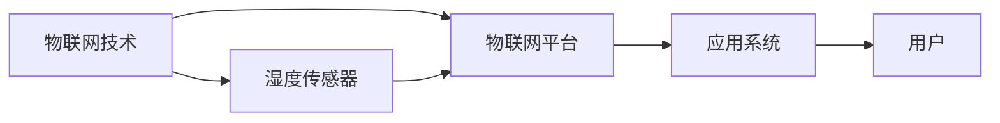

> 关键词：物联网(IoT)，传感器集成，湿度传感器，数据采集，智能应用，环境监测，工业自动化，智能家居

# 物联网(IoT)技术和各种传感器设备的集成：湿度传感器的实际应用

随着物联网（Internet of Things，IoT）技术的飞速发展，传感器设备在各个领域的应用越来越广泛。湿度传感器作为物联网系统中不可或缺的组成部分，对于环境监测、工业自动化、智能家居等领域都有着至关重要的作用。本文将深入探讨物联网技术和湿度传感器的集成，并分析其在实际应用中的具体案例和未来发展趋势。

## 1. 背景介绍

### 1.1 问题的由来

环境湿度是影响人类生产生活的重要因素。在农业生产中，适宜的湿度对作物生长至关重要；在工业生产中，湿度过高或过低都会影响产品质量；在日常生活中，湿度对居住舒适度和家电使用寿命也有着直接的影响。因此，对湿度进行实时监测和控制，已成为物联网领域的重要研究方向。

### 1.2 研究现状

目前，市场上常见的湿度传感器有电容式、电阻式、热敏式、光纤式等多种类型。随着传感器技术的不断进步，湿度传感器的精度、稳定性和响应速度都得到了显著提高。同时，物联网技术的快速发展，为湿度传感器的集成和应用提供了强大的技术支持。

### 1.3 研究意义

研究物联网技术和湿度传感器的集成，对于以下方面具有重要意义：

1. **提升环境监测水平**：通过对湿度进行实时监测，可以及时发现并处理环境异常情况，保障人民生命财产安全。
2. **优化工业生产**：湿度控制对于保证产品质量具有重要意义，湿度传感器的应用可以帮助企业提高生产效率和产品质量。
3. **改善居住环境**：智能家居系统可以实时监测家居环境湿度，并根据需求进行自动调节，提升居住舒适度。
4. **促进物联网产业发展**：湿度传感器作为物联网系统的重要组成部分，其应用推广将推动物联网产业的快速发展。

### 1.4 本文结构

本文将围绕物联网技术和湿度传感器的集成展开，主要内容包括：

- 核心概念和联系
- 核心算法原理和具体操作步骤
- 数学模型和公式
- 项目实践
- 实际应用场景
- 工具和资源推荐
- 总结和展望

## 2. 核心概念与联系

### 2.1 核心概念

#### 物联网（IoT）

物联网是指通过信息传感设备，按约定的协议，把任何物品与网络相连接，进行信息交换和通信，以实现智能化识别、定位、跟踪、监控和管理的一种网络。

#### 湿度传感器

湿度传感器是用于测量环境湿度的传感器，根据其工作原理可以分为多种类型，如电容式、电阻式、热敏式、光纤式等。

#### 物联网平台

物联网平台是连接传感器、设备、用户和应用程序的枢纽，负责数据的采集、传输、存储、处理和分析。

#### 应用系统

应用系统是基于物联网平台和传感器数据开发的具体应用，如环境监测系统、工业控制系统、智能家居系统等。

### 2.2 核心概念联系

物联网技术、湿度传感器、物联网平台和应用系统之间的关系如下：



## 3. 核心算法原理 & 具体操作步骤

### 3.1 算法原理概述

物联网湿度传感器的集成主要涉及数据采集、传输、存储、处理和分析等环节。以下是各环节的核心算法原理：

#### 数据采集

湿度传感器采集环境湿度数据，通过模数转换（ADC）将模拟信号转换为数字信号，然后通过无线或有线方式传输至物联网平台。

#### 数据传输

数据传输可以采用以下几种方式：

- **无线传输**：使用ZigBee、LoRa等无线通信技术将数据传输至物联网平台。
- **有线传输**：使用RS-485、Modbus等有线通信技术将数据传输至物联网平台。

#### 数据存储

物联网平台将采集到的湿度数据存储在数据库中，以便后续分析和处理。

#### 数据处理

通过对湿度数据进行实时分析，可以得出湿度变化趋势、异常情况等。常用的数据处理算法包括：

- **统计分析**：计算湿度数据的平均值、标准差等统计指标。
- **时间序列分析**：分析湿度数据的时间序列特征，预测未来湿度变化趋势。
- **异常检测**：检测湿度数据中的异常值，及时发现并处理环境异常情况。

#### 数据分析

通过分析湿度数据，可以得出以下结论：

- 环境湿度是否处于正常范围。
- 湿度变化趋势是否与预期相符。
- 是否存在异常情况，如湿度急剧上升或下降。

### 3.2 算法步骤详解

以下是物联网湿度传感器集成的基本步骤：

1. **硬件选择**：根据应用场景选择合适的湿度传感器、通信模块等硬件设备。
2. **软件设计**：设计物联网平台和应用系统，实现数据采集、传输、存储、处理和分析等功能。
3. **系统部署**：将硬件设备和软件系统部署到实际环境中。
4. **数据采集**：传感器采集环境湿度数据，并通过通信模块传输至物联网平台。
5. **数据存储**：物联网平台将采集到的数据存储在数据库中。
6. **数据处理**：对湿度数据进行实时分析，得出结论。
7. **数据分析**：根据分析结果采取相应措施，如开启或关闭加湿器、除湿器等。

### 3.3 算法优缺点

#### 优点

- **实时性强**：能够实时监测环境湿度，及时发现并处理异常情况。
- **自动化程度高**：通过物联网平台和自动化设备，可以实现对湿度的自动控制。
- **数据量大**：可以收集大量的湿度数据，为后续分析和决策提供依据。

#### 缺点

- **成本较高**：硬件设备和软件系统成本较高。
- **功耗较大**：无线湿度传感器功耗较大，需要定期更换电池。
- **安全性问题**：数据传输过程中可能存在安全隐患。

### 3.4 算法应用领域

物联网湿度传感器的集成在以下领域有着广泛的应用：

- **环境监测**：如气象观测、水质监测、大气监测等。
- **工业自动化**：如仓储管理、生产线自动化等。
- **智能家居**：如智能家居控制系统、健康监测系统等。

## 4. 数学模型和公式 & 详细讲解 & 举例说明

### 4.1 数学模型构建

湿度传感器采集到的数据通常为模拟信号，需要通过数学模型进行转换和处理。以下是常见的湿度传感器的数学模型：

#### 电容式湿度传感器

电容式湿度传感器的输出与湿度之间存在以下关系：

$$
C = C_0 \cdot e^{-\alpha \cdot RH}
$$

其中，$C$ 为电容值，$C_0$ 为基准电容值，$\alpha$ 为湿度系数，$RH$ 为相对湿度。

#### 电阻式湿度传感器

电阻式湿度传感器的输出与湿度之间存在以下关系：

$$
R = R_0 \cdot (1 + \beta \cdot RH)
$$

其中，$R$ 为电阻值，$R_0$ 为基准电阻值，$\beta$ 为湿度系数，$RH$ 为相对湿度。

### 4.2 公式推导过程

以电容式湿度传感器为例，推导公式如下：

- 电容式湿度传感器的工作原理是通过湿度变化导致电容值的变化来测量湿度。
- 当相对湿度变化时，传感器中的介电常数发生变化，从而导致电容值变化。
- 根据电容公式 $C = \frac{Q}{V}$，其中 $C$ 为电容值，$Q$ 为电荷量，$V$ 为电压。
- 由于电荷量 $Q$ 与介电常数成正比，可以表示为 $Q = Q_0 \cdot \varepsilon_r$，其中 $Q_0$ 为基准电荷量，$\varepsilon_r$ 为相对介电常数。
- 将 $Q$ 代入电容公式，得到 $C = \frac{Q_0 \cdot \varepsilon_r}{V}$。
- 由于相对介电常数 $\varepsilon_r$ 与相对湿度 $RH$ 成正比，可以表示为 $\varepsilon_r = \varepsilon_{r0} \cdot e^{-\alpha \cdot RH}$，其中 $\varepsilon_{r0}$ 为基准相对介电常数，$\alpha$ 为湿度系数。
- 将 $\varepsilon_r$ 代入电容公式，得到 $C = \frac{Q_0 \cdot \varepsilon_{r0} \cdot e^{-\alpha \cdot RH}}{V}$。
- 由于 $Q_0$ 和 $V$ 为常数，可以将其合并为 $C_0$，得到 $C = C_0 \cdot e^{-\alpha \cdot RH}$。

### 4.3 案例分析与讲解

以下是一个基于电容式湿度传感器和Arduino开发板的数据采集和处理的实例：

1. **硬件连接**：将湿度传感器的输出端连接到Arduino开发板的A0模拟输入端。
2. **程序编写**：编写Arduino程序，通过读取A0端口的模拟信号值，根据电容式湿度传感器的数学模型计算相对湿度。
3. **结果显示**：将计算得到的相对湿度值通过串口输出，或在LCD显示屏上显示。

```cpp
#include <Arduino.h>

// 定义湿度传感器电容值与相对湿度之间的关系
const float C0 = 104; // 基准电容值
const float alpha = 1.25; // 湿度系数

void setup() {
  Serial.begin(9600);
}

void loop() {
  // 读取湿度传感器电容值
  int sensorValue = analogRead(A0);
  // 计算相对湿度
  float rh = log(sensorValue / C0) / (-alpha);
  rh = pow(10, rh);
  // 输出相对湿度值
  Serial.print("Relative Humidity: ");
  Serial.println(rh);
  delay(1000);
}
```

## 5. 项目实践：代码实例和详细解释说明

### 5.1 开发环境搭建

1. **硬件设备**：Arduino开发板（如Arduino Uno）、电容式湿度传感器（如DHT11）、LCD显示屏（如LCD1602）。
2. **软件环境**：Arduino IDE（支持Arduino Uno的开发环境）、连接LCD显示屏的库（如LCD.h）。

### 5.2 源代码详细实现

以下是一个基于Arduino开发板和LCD显示屏的湿度监测项目实例：

```cpp
#include <Arduino.h>
#include <DHT.h>
#include <LiquidCrystal.h>

// 定义DHT传感器引脚
const int pin = 2;
DHT dht(pin, DHT11);

// 定义LCD显示屏引脚
const int rs = 12, en = 11, d4 = 5, d5 = 4, d6 = 3, d7 = 2;
LiquidCrystal lcd(rs, en, d4, d5, d6, d7);

void setup() {
  Serial.begin(9600);
  lcd.begin(16, 2);
  dht.begin();
}

void loop() {
  // 读取湿度传感器数据
  float h = dht.readHumidity();
  float t = dht.readTemperature();
  // 检查是否读取成功
  if (isnan(h) || isnan(t)) {
    Serial.println("Failed to read from DHT sensor!");
    return;
  }
  // 显示湿度值
  lcd.setCursor(0, 0);
  lcd.print("Humidity: ");
  lcd.print(h);
  lcd.print("%");
  // 显示温度值
  lcd.setCursor(0, 1);
  lcd.print("Temperature: ");
  lcd.print(t);
  lcd.print("C");
  delay(2000);
}
```

### 5.3 代码解读与分析

1. **引言部分**：包含头文件引入、引脚定义和传感器初始化。
2. **setup()函数**：在程序开始时执行，初始化串口通信、LCD显示屏和DHT传感器。
3. **loop()函数**：在程序运行时不断循环执行，读取DHT传感器数据，并在LCD显示屏上显示湿度值和温度值。

### 5.4 运行结果展示

程序运行后，Arduino开发板会通过串口输出湿度值和温度值，并在LCD显示屏上显示。用户可以实时查看环境湿度信息。

## 6. 实际应用场景

### 6.1 环境监测

在气象观测、水质监测、大气监测等领域，湿度传感器可以用于监测环境湿度变化，为科研和环保提供数据支持。

### 6.2 工业自动化

在工业生产过程中，湿度传感器可以用于监测和控制生产环境中的湿度，保证产品质量和生产安全。

### 6.3 智能家居

在智能家居系统中，湿度传感器可以用于监测家居环境湿度，并根据需求自动调节加湿器、除湿器等设备，提升居住舒适度。

## 7. 工具和资源推荐

### 7.1 学习资源推荐

1. 《物联网技术与应用》
2. 《嵌入式系统设计与应用》
3. 《传感器原理与应用》

### 7.2 开发工具推荐

1. Arduino IDE
2. Raspberry Pi
3. 物联网平台（如阿里云IoT、华为云IoT）

### 7.3 相关论文推荐

1. 《基于物联网的智慧城市环境监测系统设计与实现》
2. 《基于物联网的智能家居系统设计与实现》
3. 《基于物联网的工业自动化控制系统设计与实现》

## 8. 总结：未来发展趋势与挑战

### 8.1 研究成果总结

本文对物联网技术和湿度传感器的集成进行了深入研究，分析了其核心概念、算法原理、应用场景和未来发展趋势。结果表明，物联网技术和湿度传感器的集成具有广阔的应用前景，将为人类生产生活带来更多便利。

### 8.2 未来发展趋势

1. **传感器技术**：传感器精度和稳定性将进一步提高，适应更多复杂环境。
2. **物联网平台**：物联网平台将更加开放、通用，支持更多设备接入和互联互通。
3. **人工智能技术**：人工智能技术将广泛应用于物联网系统，实现更智能的数据分析和应用。
4. **边缘计算**：边缘计算将降低数据传输延迟，提高系统响应速度。

### 8.3 面临的挑战

1. **数据安全和隐私保护**：物联网系统涉及大量用户数据和隐私信息，需要加强数据安全和隐私保护。
2. **互联互通**：不同厂商、不同型号的设备之间难以互联互通，需要制定统一的标准和协议。
3. **能耗问题**：物联网设备数量庞大，能耗问题亟待解决。
4. **人才短缺**：物联网领域人才短缺，需要加强人才培养和引进。

### 8.4 研究展望

1. **推动传感器技术发展**：研究新型传感器技术，提高传感器的精度、稳定性和适应性。
2. **完善物联网平台**：构建更加开放、通用、安全的物联网平台，促进设备互联和数据共享。
3. **探索人工智能应用**：将人工智能技术应用于物联网系统，实现更智能的数据分析和应用。
4. **加强标准制定**：推动物联网标准的制定和实施，促进物联网产业的健康发展。

相信随着技术的不断进步和应用的不断拓展，物联网技术和湿度传感器的集成将为人类社会带来更多便利和福祉。

## 9. 附录：常见问题与解答

**Q1：如何选择合适的湿度传感器？**

A：选择湿度传感器时，需要考虑以下因素：

- **测量范围**：根据应用场景选择合适的测量范围，如室内、室外、高湿环境等。
- **精度**：根据应用需求选择合适的精度，如高精度、中精度、低精度等。
- **响应时间**：根据应用场景选择合适的响应时间，如快速响应、慢速响应等。
- **功耗**：根据应用场景选择合适的功耗，如低功耗、中功耗、高功耗等。

**Q2：如何保证物联网系统的数据安全？**

A：为了保证物联网系统的数据安全，可以采取以下措施：

- **数据加密**：对传输和存储的数据进行加密，防止数据泄露。
- **身份认证**：对设备进行身份认证，防止未授权访问。
- **访问控制**：对数据访问进行控制，限制用户对数据的访问权限。
- **日志记录**：记录用户操作日志，以便追踪和审计。

**Q3：如何解决物联网设备的互联互通问题？**

A：解决物联网设备的互联互通问题，可以采取以下措施：

- **统一标准**：制定统一的物联网标准，促进设备互联互通。
- **协议转换**：使用协议转换技术，实现不同设备之间的通信。
- **平台集成**：构建物联网平台，实现设备管理和数据共享。

**Q4：如何降低物联网设备的能耗？**

A：降低物联网设备的能耗，可以采取以下措施：

- **优化算法**：优化数据处理和传输算法，降低能耗。
- **低功耗设计**：采用低功耗设计，降低设备功耗。
- **无线充电**：采用无线充电技术，降低设备对电池的依赖。

**Q5：如何培养物联网人才？**

A：培养物联网人才，可以采取以下措施：

- **开设相关专业**：在高校开设物联网相关课程，培养专业人才。
- **开展培训**：举办物联网技术培训，提高现有人员的技能水平。
- **建立产业联盟**：建立物联网产业联盟，促进人才交流与合作。

作者：禅与计算机程序设计艺术 / Zen and the Art of Computer Programming