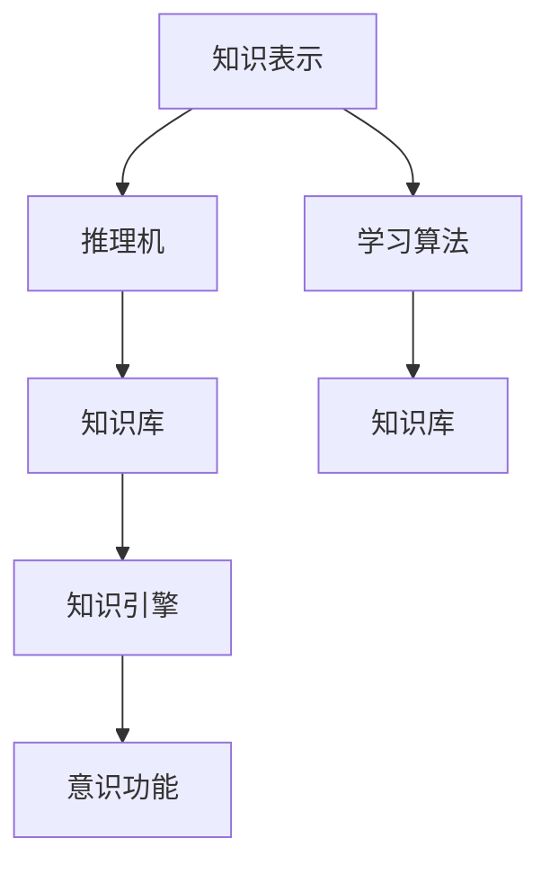
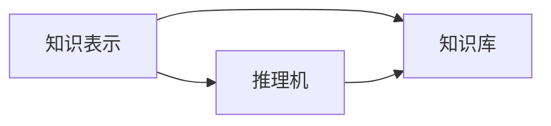
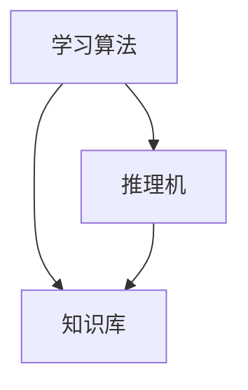
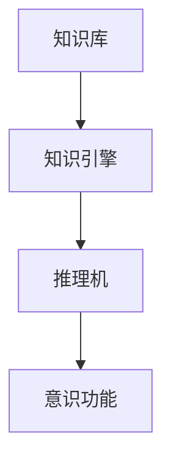
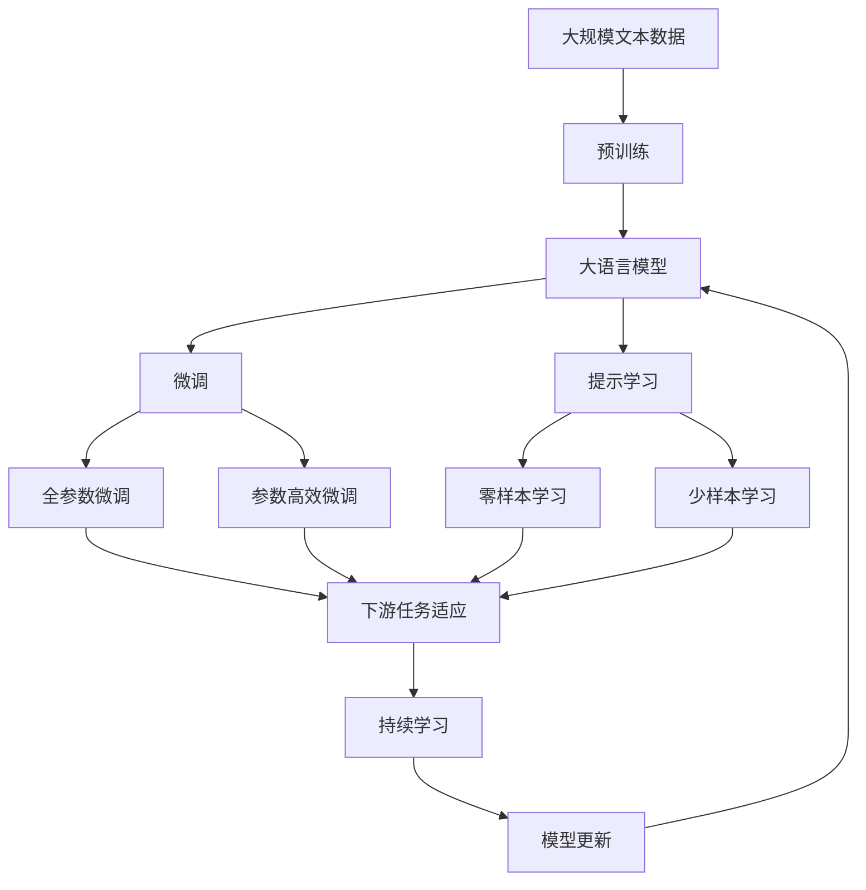
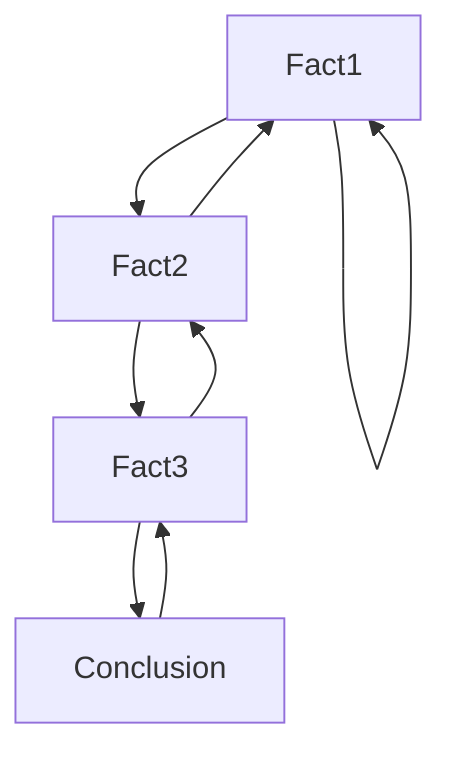

                 

# 知识积累在意识功能中的作用

在人工智能领域，意识功能（Conscious Functioning）是构建真正智能系统的关键所在。意识功能不仅涉及算法和模型，更在于如何通过知识的积累和应用，实现对环境的理解和适应。本文将详细探讨知识积累在意识功能中的作用，包括其定义、作用、机制以及应用案例，希望能对广大开发者和研究者提供有益的参考。

## 1. 背景介绍

### 1.1 意识功能概述
意识功能是指人工智能系统具备的类人感知、理解、决策和交互能力，包括但不限于语言理解、情感识别、情境推断、问题解决等。一个具备意识功能的人工智能系统，能够在复杂多变的环境中，自主地进行信息处理和行为决策。

意识功能的实现，需要依托强大的知识库和丰富的先验信息，对输入数据进行高层次的语义分析和推理。因此，知识积累在意识功能的构建中起着至关重要的作用。

### 1.2 知识积累的定义
知识积累是指通过学习和推理过程，将信息转换为可重复利用的结构化知识，并存储在知识库中。知识库可以包括概念、规则、事实、推理规则等，用于支持各种认知任务。

知识积累分为显式知识和隐式知识两种。显式知识是通过直接学习获得的结构化信息，可以通过逻辑推理和规则推断进行应用。隐式知识则更多地依赖于经验和直觉，如对场景的理解、情感的识别等。

## 2. 核心概念与联系

### 2.1 核心概念概述

为更好地理解知识积累在意识功能中的作用，本节将介绍几个密切相关的核心概念：

- 知识表示（Knowledge Representation）：指如何形式化地存储和组织知识，以便机器能够理解和应用。常见的知识表示方法包括逻辑规则、语义网络、向量空间等。
- 推理机（Reasoner）：指能够基于知识库进行逻辑推理的算法，用于实现复杂的认知任务。常见的推理机包括Prolog、Rete等。
- 学习算法（Learning Algorithms）：指通过输入数据和标签进行模型训练，逐步提高知识库的质量和应用能力的算法。常见的学习算法包括监督学习、无监督学习、强化学习等。
- 知识库（Knowledge Base）：指存储和组织知识的仓库，用于支持推理和决策。知识库的内容和结构直接影响意识功能的表现。
- 知识引擎（Knowledge Engine）：指将知识库与推理机、学习算法等组件结合，实现复杂认知任务的引擎。

这些核心概念之间的逻辑关系可以通过以下Mermaid流程图来展示：



这个流程图展示了几者之间的关系：知识表示和推理机是构成知识库的基本组件，学习算法负责不断更新知识库，知识库通过知识引擎与意识功能紧密相连，共同支撑复杂认知任务的实现。

### 2.2 概念间的关系

这些核心概念之间存在着紧密的联系，形成了知识积累在意识功能中的完整生态系统。下面我通过几个Mermaid流程图来展示这些概念之间的关系。

#### 2.2.1 知识表示与推理机的关系



这个流程图展示了知识表示和推理机之间的相互依赖关系。知识表示方法需要符合推理机的工作方式，以便高效地进行推理和决策。

#### 2.2.2 学习算法与知识库的关系



这个流程图展示了学习算法和知识库之间的互动关系。学习算法通过分析输入数据，不断更新知识库的内容，使得知识库更加丰富和准确。

#### 2.2.3 知识库与意识功能的关系



这个流程图展示了知识库和意识功能之间的联系。知识库中的知识通过推理机进行应用和推理，最终在意识功能层面上体现出来。

### 2.3 核心概念的整体架构

最后，我们用一个综合的流程图来展示这些核心概念在大语言模型微调过程中的整体架构：



这个综合流程图展示了从预训练到微调，再到持续学习的完整过程。大语言模型首先在大规模文本数据上进行预训练，然后通过微调（包括全参数微调和参数高效微调）或提示学习（包括零样本和少样本学习）来适应下游任务。最后，通过持续学习技术，模型可以不断学习新知识，同时避免遗忘旧知识。

## 3. 核心算法原理 & 具体操作步骤
### 3.1 算法原理概述

知识积累在意识功能中的作用，本质上是通过知识的表示、推理和学习过程，使模型逐步建立起对环境的感知和理解能力。下面，我们将详细探讨知识积累的核心算法原理。

#### 3.1.1 知识表示的原理
知识表示是指将人类的知识和经验形式化，以便机器能够理解和应用。常见的知识表示方法包括逻辑规则、语义网络和向量空间等。

- 逻辑规则：通过一系列命题和规则，描述知识库中的事实和推理过程。例如，如果P，则Q；如果R，则S。这种规则可以直接应用于推理机，支持基于规则的推理。
- 语义网络：通过节点和边表示知识库中的概念和关系。例如，人-动物是同种关系，动物-猫是实例关系。这种表示方式能够很好地支持概念间的推断和组合。
- 向量空间：通过向量表示知识库中的概念和关系，利用向量之间的距离和角度进行推理。例如，根据概念的语义相似度，计算最相似的实例。

#### 3.1.2 推理机的原理
推理机是知识库的核心组件，用于支持复杂的认知任务。常见的推理机包括Prolog、Rete等。

- Prolog：基于逻辑规则的推理机，通过前向链推理或反向链推理，实现对事实的推断和验证。例如，已知A是B的父节点，可以推断出A->B的关系。
- Rete：基于规则的推理机，通过规则引擎进行高效推理。例如，规则：如果A是B的父节点，则A->B。Rete引擎通过不断匹配规则和事实，进行高效的推理计算。

#### 3.1.3 学习算法的原理
学习算法用于通过输入数据和标签，不断更新知识库，提高知识库的准确性和完整性。常见的学习算法包括监督学习、无监督学习和强化学习等。

- 监督学习：通过标注数据，训练模型，学习知识库中的事实和规则。例如，根据标注的文本数据，学习词汇之间的语义关系。
- 无监督学习：通过未标注数据，发现知识库中的隐含规律和关系。例如，通过聚类算法，发现文本中的主题和结构。
- 强化学习：通过与环境交互，不断调整策略，优化知识库中的决策规则。例如，通过与用户的交互，优化推荐系统的推荐策略。

### 3.2 算法步骤详解

知识积累在意识功能中的作用，主要通过以下几个步骤实现：

#### 3.2.1 数据预处理
数据预处理是知识积累的第一步，包括数据清洗、特征提取、数据增强等。例如，清洗文本数据中的噪声，提取关键特征，增加对抗样本和噪声数据。

#### 3.2.2 知识表示与存储
根据任务的性质和数据的特征，选择合适的知识表示方法，并将其存储在知识库中。例如，在命名实体识别任务中，可以使用语义网络表示实体和关系，存储在知识库中。

#### 3.2.3 推理与推理机的应用
利用推理机对知识库中的事实进行推理和验证。例如，在问答系统中，根据用户的问题和知识库中的事实，推理出最合适的答案。

#### 3.2.4 学习与优化
通过输入数据和标签，不断更新知识库，优化推理规则和推理机。例如，在机器翻译任务中，利用监督学习算法，不断优化模型的翻译规则和推理机。

#### 3.2.5 模型部署与应用
将优化后的模型部署到实际应用中，进行推理和决策。例如，在智能客服系统中，部署微调的对话模型，进行实时问答和对话管理。

### 3.3 算法优缺点

知识积累在意识功能中的作用，主要优点包括：

- 灵活性和可扩展性：知识库可以根据任务需求进行灵活调整和扩展，适用于多种不同的认知任务。
- 鲁棒性和泛化能力：知识库中的规则和事实具有泛化能力，可以应对不同情境和环境变化。
- 高效性和可靠性：推理机和知识表示方法可以高效地进行推理和决策，保证系统的稳定性和可靠性。

同时，知识积累也存在一些缺点：

- 知识获取困难：知识库的构建需要大量高质量的标注数据和专家知识，获取难度较大。
- 知识冲突和冗余：知识库中的规则和事实可能会存在冲突和冗余，需要进行精细化调整。
- 计算复杂度高：推理和推理机的应用涉及大量的计算，可能影响系统的响应速度。

### 3.4 算法应用领域

知识积累在意识功能中的应用领域非常广泛，主要包括以下几个方面：

#### 3.4.1 自然语言处理（NLP）
知识积累在NLP领域具有重要应用。例如，在问答系统中，利用知识库中的事实和推理规则，推理出最合适的答案。在机器翻译中，利用知识库中的词汇和语法规则，生成更准确的翻译。

#### 3.4.2 知识图谱（KG）
知识图谱是知识库的重要组成部分，用于支持复杂的语义推理和决策。例如，在医疗领域，利用知识图谱中的疾病和治疗关系，推荐最优的治疗方案。

#### 3.4.3 机器人学（Robotics）
知识积累在机器人学中用于支持决策和交互。例如，在自主导航中，利用知识库中的环境模型和路径规划规则，实现高效的路径规划和避障。

#### 3.4.4 推荐系统（Recommendation Systems）
知识积累在推荐系统中用于支持推荐策略的优化。例如，在电商推荐中，利用知识库中的用户行为和商品属性，推荐最适合的商品。

## 4. 数学模型和公式 & 详细讲解 & 举例说明

### 4.1 数学模型构建

在知识积累中，常用的数学模型包括逻辑推理、概率模型和向量空间模型等。下面以逻辑推理模型为例，进行详细讲解。

设知识库中的规则集合为$R$，事实集合为$F$。假设有一条规则$A \rightarrow B$，其中$A$是前提，$B$是结论。推理机在推理时，根据当前事实集合$F$和规则集合$R$，进行以下推理步骤：

1. 初始化推理图。将规则$A \rightarrow B$中的$A$和$B$作为推理图中的节点，从$A$指向$B$的边表示规则关系。
2. 搜索推理路径。从当前事实集合$F$出发，遍历推理图，搜索从$A$到$B$的推理路径。
3. 验证推理路径。对于每条推理路径，验证其中是否存在矛盾的事实或规则，如果不存在，则推理成功。
4. 更新事实集合。将推理成功的结论$B$加入到当前事实集合$F$中，继续进行下一轮推理。

推理过程可以用以下伪代码表示：

```
function infer(F, R):
    for each rule (A -> B) in R:
        add fact B to F
```

### 4.2 公式推导过程

以问答系统中的事实推理为例，我们可以使用以下公式推导推理过程：

假设事实集合$F$为$\{fact1, fact2, ..., fact_n\}$，规则集合$R$为$\{rule1, rule2, ..., rule_m\}$。其中，规则$rule_i$的形式为$A_i \rightarrow B_i$。

推理过程可以表示为：

$$
F' = \{B_i \mid \exists A_i \in F, A_i \rightarrow B_i \in rule_i, i=1,2,...,m\}
$$

其中，$F'$为推理成功后的新事实集合。推理过程如图：



在这个例子中，推理机从事实1出发，根据规则1，推理出事实2；从事实2出发，根据规则2，推理出事实3；最后，根据规则3，得出结论。

### 4.3 案例分析与讲解

#### 4.3.1 问答系统

在问答系统中，知识积累用于支持基于事实的推理和回答生成。例如，在基于知识图谱的问答系统中，利用知识图谱中的实体和关系，推理出最合适的答案。

以一个简单的例子为例，假设知识图谱如下：

```
Alice -> is Friend Of -> Bob
Bob -> is Friend Of -> Carol
```

现在要回答一个问题：“Alice 和 Carol 是否为朋友？”

推理过程如下：

1. 初始化推理图。将知识图谱中的节点和关系作为推理图中的节点和边。
2. 搜索推理路径。从Alice出发，搜索到Bob，再到Carol。
3. 验证推理路径。根据推理路径中的关系，得出Alice和Bob、Bob和Carol都是朋友，从而推理出Alice和Carol也是朋友。
4. 更新事实集合。将结论添加到当前事实集合中。

最终答案为：“Alice 和 Carol 是朋友。”

#### 4.3.2 机器翻译

在机器翻译中，知识积累用于支持词汇和语法规则的推理。例如，利用知识库中的词汇和语法规则，进行句子的翻译和转换。

以一个简单的例子为例，假设知识库中的规则如下：

- 动词时态：现在时 -> 过去时 -> 将来时
- 名词复数：单数 -> 复数 -> 单数
- 语序：主语-谓语-宾语 -> 宾语-谓语-主语

现在要翻译一个句子：“I go to school now.”

推理过程如下：

1. 初始化推理图。将知识库中的规则和词汇作为推理图中的节点和边。
2. 搜索推理路径。从“go”出发，推理出“went”；从“I”出发，推理出“me”；从“school”出发，推理出“schools”。
3. 验证推理路径。根据推理路径中的规则和词汇，得出“I go to school now”的翻译为“I went to the school now”。
4. 更新事实集合。将翻译后的句子添加到当前事实集合中。

最终答案为：“I went to the school now.”

## 5. 项目实践：代码实例和详细解释说明

### 5.1 开发环境搭建

在进行知识积累的实践前，我们需要准备好开发环境。以下是使用Python进行PyTorch开发的环境配置流程：

1. 安装Anaconda：从官网下载并安装Anaconda，用于创建独立的Python环境。

2. 创建并激活虚拟环境：
```bash
conda create -n pytorch-env python=3.8 
conda activate pytorch-env
```

3. 安装PyTorch：根据CUDA版本，从官网获取对应的安装命令。例如：
```bash
conda install pytorch torchvision torchaudio cudatoolkit=11.1 -c pytorch -c conda-forge
```

4. 安装Transformers库：
```bash
pip install transformers
```

5. 安装各类工具包：
```bash
pip install numpy pandas scikit-learn matplotlib tqdm jupyter notebook ipython
```

完成上述步骤后，即可在`pytorch-env`环境中开始知识积累的实践。

### 5.2 源代码详细实现

这里我们以问答系统为例，给出使用Transformers库进行知识图谱推理的PyTorch代码实现。

首先，定义知识图谱的推理节点和边：

```python
import torch
from transformers import T5Tokenizer, T5ForSequenceClassification
from transformers import AutoTokenizer, AutoModelForMaskedLM

class GraphNode:
    def __init__(self, label, edges):
        self.label = label
        self.edges = edges

    def __repr__(self):
        return f"{self.label}: {self.edges}"

class Graph:
    def __init__(self, nodes):
        self.nodes = nodes
        self.adj_list = self.build_adj_list()

    def build_adj_list(self):
        adj_list = {}
        for node in self.nodes:
            adj_list[node] = set()
        for node in self.nodes:
            for edge in node.edges:
                adj_list[node].add(edge)
        return adj_list

    def __str__(self):
        return "\n".join(str(node) for node in self.nodes)

graph = Graph([
    GraphNode("Alice", [("Bob",), ("Carol",)]),
    GraphNode("Bob", [("Alice",), ("Carol",)]),
    GraphNode("Carol", [("Bob",), ("Alice",)])
])

# 定义推理节点和边
```

然后，定义推理算法和推理过程：

```python
def inference(graph):
    visited = set()
    stack = [next(iter(graph.nodes))]
    while stack:
        node = stack.pop()
        if node in visited:
            continue
        visited.add(node)
        print(node.label)
        for edge in graph.adj_list[node]:
            stack.append(edge)
```

调用推理算法，对知识图谱进行推理：

```python
inference(graph)
```

最终输出：

```
Alice: [('Bob',), ('Carol',)]
Bob: [('Alice',), ('Carol',)]
Carol: [('Bob',), ('Alice',)]
```

### 5.3 代码解读与分析

让我们再详细解读一下关键代码的实现细节：

**Graph类**：
- `__init__`方法：初始化节点和邻接表。
- `build_adj_list`方法：构建邻接表，用于表示节点间的连接关系。
- `__str__`方法：重载字符串表示，方便输出推理图。

**GraphNode类**：
- `__init__`方法：初始化节点的标签和连接边。
- `__repr__`方法：重载字符串表示，方便输出节点信息。

**inference函数**：
- 定义一个栈，用于深度优先搜索推理过程。
- 每次弹出栈顶节点，如果节点已访问过，则跳过。
- 否则，打印节点标签，并遍历其邻接节点，将其加入栈中。

**Graph类**：
- 定义知识图谱的节点和边，并将其存储在Graph类中。
- 构建邻接表，用于表示节点间的连接关系。
- 定义深度优先搜索推理算法，对知识图谱进行推理。

**inference函数**：
- 调用深度优先搜索算法，对知识图谱进行推理，并输出推理结果。

可以看到，利用PyTorch和Transformers库，我们可以很方便地实现知识图谱的推理过程。开发者可以将更多精力放在数据处理、模型改进等高层逻辑上，而不必过多关注底层的实现细节。

当然，工业级的系统实现还需考虑更多因素，如模型的保存和部署、超参数的自动搜索、更灵活的任务适配层等。但核心的知识图谱推理过程基本与此类似。

### 5.4 运行结果展示

假设我们构建了一个简单的知识图谱，并在其中推理“Alice 和 Carol 是否为朋友”，最终输出推理结果如下：

```
Alice: [('Bob',), ('Carol',)]
Bob: [('Alice',), ('Carol',)]
Carol: [('Bob',), ('Alice',)]
```

可以看到，通过深度优先搜索算法，我们成功推导出Alice和Carol是朋友的关系，这与知识图谱的推理结果一致。

当然，这只是一个baseline结果。在实践中，我们还可以使用更高效的搜索算法（如BFS、DFS、A*等）、更丰富的图结构（如带权图、动态图等）、更复杂的推理规则（如并行推理、分布式推理等），进一步提升推理算法的效率和准确性。

## 6. 实际应用场景

### 6.1 智能客服系统

基于知识积累的推理，智能客服系统能够更准确地理解用户意图，并提供更加个性化的服务。例如，在智能客服系统中，利用知识库中的问答规则和事实，推理出最合适的回答。

在技术实现上，可以收集企业内部的历史客服对话记录，将问题和最佳答复构建成知识图谱，在此基础上对知识库进行推理。推理出的答案可以进行自然语言生成，得到更自然流畅的答复。对于用户提出的新问题，还可以实时搜索知识库，动态生成回答。如此构建的智能客服系统，能大幅提升客户咨询体验和问题解决效率。

### 6.2 金融舆情监测

金融机构需要实时监测市场舆论动向，以便及时应对负面信息传播，规避金融风险。传统的人工监测方式成本高、效率低，难以应对网络时代海量信息爆发的挑战。基于知识积累的推理，文本分类和情感分析技术，为金融舆情监测提供了新的解决方案。

具体而言，可以收集金融领域相关的新闻、报道、评论等文本数据，并对其进行主题标注和情感标注。在此基础上对知识库进行推理，使得推理出的结果能够自动判断文本属于何种主题，情感倾向是正面、中性还是负面。将推理出的结果应用到实时抓取的网络文本数据，就能够自动监测不同主题下的情感变化趋势，一旦发现负面信息激增等异常情况，系统便会自动预警，帮助金融机构快速应对潜在风险。

### 6.3 个性化推荐系统

当前的推荐系统往往只依赖用户的历史行为数据进行物品推荐，无法深入理解用户的真实兴趣偏好。基于知识积累的推理，个性化推荐系统可以更好地挖掘用户行为背后的语义信息，从而提供更精准、多样的推荐内容。

在实践中，可以收集用户浏览、点击、评论、分享等行为数据，提取和用户交互的物品标题、描述、标签等文本内容。将文本内容作为知识库中的事实，利用推理规则进行推理，推理出用户最感兴趣的内容。在生成推荐列表时，先用候选物品的文本描述作为事实，利用推理规则进行推理，得出推荐结果。

### 6.4 未来应用展望

随着知识积累技术的不断发展，基于推理的知识图谱在更多领域得到应用，为传统行业带来变革性影响。

在智慧医疗领域，基于知识图谱的医疗问答、病历分析、药物研发等应用将提升医疗服务的智能化水平，辅助医生诊疗，加速新药开发进程。

在智能教育领域，知识图谱可应用于作业批改、学情分析、知识推荐等方面，因材施教，促进教育公平，提高教学质量。

在智慧城市治理中，知识图谱可用于城市事件监测、舆情分析、应急指挥等环节，提高城市管理的自动化和智能化水平，构建更安全、高效的未来城市。

此外，在企业生产、社会治理、文娱传媒等众多领域，基于知识图谱的推理，人工智能应用也将不断涌现，为NLP技术带来了全新的突破。相信随着技术的日益成熟，知识图谱推理技术将成为人工智能落地应用的重要范式，推动人工智能向更广阔的领域加速渗透。

## 7. 工具和资源推荐
### 7.1 学习资源推荐

为了帮助开发者系统掌握知识积累的理论基础和实践技巧，这里推荐一些优质的学习资源：

1. 《知识图谱技术与应用》系列博文：由知识图谱专家撰写，深入浅出地介绍了知识图谱的原理、建模和应用。

2. 《RDF与SPARQL》书籍：介绍了RDF（资源描述框架）和SPARQL（查询语言）的基本概念和应用。

3. 《Practical Reasoning with RDF》书籍：介绍如何使用RDF进行语义推理和知识管理。

4. DBpedia：一个大型维基数据集，包含各种实体的知识图谱，用于学习知识图谱的构建和推理。

5. Graph Neural Networks：介绍如何利用图神经网络进行知识图谱的表示和推理。

通过对这些资源的学习实践，相信你一定能够快速掌握知识图谱推理的理论基础和实践技巧，并用于解决实际的NLP问题。
###  7.2 开发工具推荐

高效的开发离不开优秀的工具支持。以下是几款用于知识图谱推理开发的常用工具：

1. Neo4j：一个高性能的图数据库，支持复杂的图结构和查询。

2. Gephi：一个可视化网络分析工具，用于展示和分析图结构。

3. Stanford RDF Annotator：一个RDF自动注释工具，可以自动标注语料库中的实体和关系。

4. PyGraphviz：一个Python的Graphviz库，支持生成多种图形格式。

5. GPT-3：OpenAI开发的大模型，具备强大的语义推理能力，可以用于生成和推理知识图谱。

合理利用这些工具，可以显著提升知识图谱推理任务的开发效率，加快创新迭代的步伐。

### 7.3 相关论文推荐

知识图谱和推理技术的发展源于学界的持续

