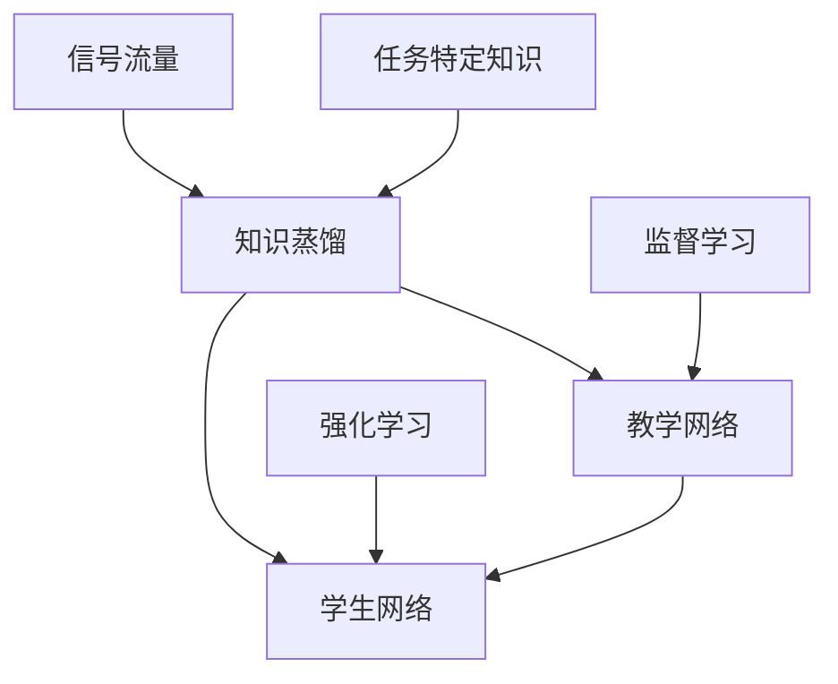

                 

# 知识蒸馏在强化学习中的探索与挑战

> 关键词：知识蒸馏,强化学习,深度学习,深度增强学习,教学网络,学生网络,信号流量, 效率提升, 数据增强

## 1. 背景介绍

### 1.1 问题由来

强化学习（Reinforcement Learning, RL）是人工智能（AI）领域中一种重要的学习范式，通过与环境交互，智能体（Agent）学会在一系列决策中最大化累积奖励。然而，RL面临的一大挑战是训练难度大、计算成本高。尽管许多先进算法如Q-learning、SARSA、DQN等已经被提出，但它们在训练复杂度、样本需求、稳定性等方面仍存在诸多问题。

知识蒸馏（Knowledge Distillation）作为一种有效的知识转移技术，通过将复杂模型的知识传递给简单模型，可以有效缓解上述问题。在强化学习中，知识蒸馏已经被用于提升教学网络的性能，从而降低训练成本，提高模型的效率和稳定性。

### 1.2 问题核心关键点

知识蒸馏在强化学习中的关键点主要包括以下几点：

- **教学网络与学生网络**：知识蒸馏通常涉及一个复杂（教师）网络和一个简单（学生）网络。教师网络通过监督学习的方式预先训练，形成丰富的知识库；学生网络则通过蒸馏这些知识库，快速学习任务。

- **信号流量**：知识蒸馏的另一个核心要素是信号流量，即从教师网络到学生网络的信号传递量。过大或过小的信号流量都会影响蒸馏效果。

- **知识表示**：强化学习中的知识表示需要与任务特征相结合，以适应不同的决策环境。

- **模型适应性**：学生网络需要在不同的任务和环境中适应和迁移知识，提升泛化能力。

### 1.3 问题研究意义

知识蒸馏在强化学习中的应用可以显著提升模型的训练效率和性能，减少对样本的需求，同时提高模型的稳定性和泛化能力。这对于解决复杂强化学习问题，特别是在大规模部署和高性能需求场景中，具有重要的意义。

通过知识蒸馏，强化学习模型可以更快速地收敛，降低过拟合风险，提高模型的泛化能力，这将有助于加速RL技术的落地应用，使其在更多场景中得到广泛应用。

## 2. 核心概念与联系

### 2.1 核心概念概述

在强化学习中，知识蒸馏涉及以下几个关键概念：

- **教学网络（Teacher Network）**：复杂的神经网络，通过监督学习的方式预先训练，形成丰富的知识库。

- **学生网络（Student Network）**：简单的神经网络，通过知识蒸馏快速学习任务。

- **知识蒸馏**：将教师网络的专家知识传递给学生网络，使学生网络能够快速适应任务。

- **信号流量（Signal Flow）**：教师网络到学生网络的信号传递量，直接影响蒸馏效果。

- **任务特定知识**：教师网络针对特定任务训练的知识，在学生网络中得到迁移和应用。

这些核心概念通过知识蒸馏的过程相互联系，形成强化学习中的知识转移机制。

### 2.2 概念间的关系

我们可以通过以下Mermaid流程图来展示这些核心概念之间的关系：



这个流程图展示了知识蒸馏在强化学习中的核心概念及其相互关系。

### 2.3 核心概念的整体架构

通过以上流程图，我们可以看到知识蒸馏在强化学习中的整体架构：

1. 教学网络通过监督学习预先训练，形成丰富的知识库。
2. 学生网络通过知识蒸馏快速学习任务。
3. 信号流量从教学网络传递到学生网络，直接影响蒸馏效果。
4. 教师网络针对特定任务训练的知识，在学生网络中得到迁移和应用。

这些核心概念共同构成了强化学习中的知识蒸馏机制，使得学生网络能够快速高效地学习任务。

## 3. 核心算法原理 & 具体操作步骤
### 3.1 算法原理概述

知识蒸馏在强化学习中通常通过以下步骤进行：

1. 选择一个复杂的教学网络，通过监督学习预先训练，形成丰富的知识库。
2. 选择一个简单的学生网络，通过知识蒸馏快速学习任务。
3. 通过教师网络与学生网络之间的信号传递，将知识库中的知识传递给学生网络。
4. 调整学生网络的参数，使得学生网络的输出接近教师网络的输出。

知识蒸馏的核心在于将教师网络的复杂模型映射到学生网络的简单模型上，同时保留教师网络的决策能力。具体来说，知识蒸馏的目标是通过最小化学生网络的输出与教师网络的输出的差异，从而提高学生网络的性能。

### 3.2 算法步骤详解

知识蒸馏在强化学习中的具体操作步骤如下：

**Step 1: 构建教学网络和学生网络**
- 选择一个复杂的网络结构作为教学网络，如深度神经网络。
- 选择一个简单的网络结构作为学生网络，如全连接网络。

**Step 2: 预训练教学网络**
- 使用监督学习的方式，对教学网络进行预训练，使其在特定任务上形成丰富的知识库。

**Step 3: 设计蒸馏目标函数**
- 定义一个目标函数，衡量学生网络的输出与教师网络的输出的差异。常用的目标函数包括KL散度、均方误差等。

**Step 4: 反向传播更新学生网络**
- 将教学网络的输出作为监督信号，通过反向传播更新学生网络的参数。

**Step 5: 重复步骤3和4**
- 反复进行蒸馏过程，直至学生网络的输出与教师网络的输出差异达到预设的阈值。

### 3.3 算法优缺点

知识蒸馏在强化学习中的优点包括：

- **提高训练效率**：通过蒸馏知识库，学生网络可以更快地学习任务，减少对样本的需求。
- **提升泛化能力**：教师网络通过监督学习形成的丰富知识库，能够帮助学生网络提升泛化能力。
- **降低过拟合风险**：通过蒸馏，学生网络可以更稳定地学习任务，降低过拟合风险。

然而，知识蒸馏在强化学习中也存在一些缺点：

- **信号流量控制**：过大的信号流量可能会导致学生网络过拟合，过小的信号流量则无法有效传递知识。
- **计算成本高**：在蒸馏过程中，需要计算教师网络与学生网络的输出，增加了计算成本。
- **知识表示复杂**：强化学习中的知识表示需要与任务特征相结合，增加了知识蒸馏的复杂性。

### 3.4 算法应用领域

知识蒸馏在强化学习中的应用领域非常广泛，以下是几个典型应用：

- **机器人控制**：通过知识蒸馏，可以使得机器人更快地学习复杂任务，提高决策能力。
- **游戏AI**：在游戏AI中，知识蒸馏可以帮助AI快速学习策略，提高游戏水平。
- **医疗诊断**：在医疗诊断中，知识蒸馏可以通过蒸馏专家的诊断知识，帮助新医生快速提升诊断能力。
- **自然语言处理**：在自然语言处理中，知识蒸馏可以提升模型的语言理解能力，加快训练过程。

## 4. 数学模型和公式 & 详细讲解 & 举例说明

### 4.1 数学模型构建

在强化学习中，知识蒸馏的目标函数通常定义如下：

$$
\mathcal{L} = \lambda \mathcal{L}_{KL} + (1-\lambda) \mathcal{L}_{MSE}
$$

其中，$\mathcal{L}_{KL}$ 为KL散度损失，$\mathcal{L}_{MSE}$ 为均方误差损失，$\lambda$ 为超参数，用于控制损失函数的权重。

### 4.2 公式推导过程

以下是KL散度损失的推导过程：

1. 设教师网络的输出为 $Q_{tea}(a|s)$，学生网络的输出为 $Q_{stu}(a|s)$。
2. 定义KL散度损失为 $D_{KL}(Q_{stu} || Q_{tea})$。
3. 通过求解目标函数最小化，得到学生网络的输出：

$$
Q_{stu}(a|s) = \frac{Q_{tea}(a|s)}{1+\exp(-\beta \cdot \log Q_{tea}(a|s))}
$$

其中，$\beta$ 为温度参数，用于控制输出分布的熵。

### 4.3 案例分析与讲解

假设我们有一个简单的任务，需要判断一个二进制输入是否为1。我们设计一个复杂的教师网络 $Q_{tea}$ 和一个简单的学生网络 $Q_{stu}$。通过知识蒸馏，我们希望学生网络能够快速学习这一判断任务。

**Step 1: 构建教学网络和学生网络**

```python
import torch
import torch.nn as nn
import torch.optim as optim

class TeacherNet(nn.Module):
    def __init__(self):
        super(TeacherNet, self).__init__()
        self.fc1 = nn.Linear(1, 128)
        self.fc2 = nn.Linear(128, 64)
        self.fc3 = nn.Linear(64, 1)

    def forward(self, x):
        x = torch.relu(self.fc1(x))
        x = torch.relu(self.fc2(x))
        return torch.sigmoid(self.fc3(x))

class StudentNet(nn.Module):
    def __init__(self):
        super(StudentNet, self).__init__()
        self.fc1 = nn.Linear(1, 64)
        self.fc2 = nn.Linear(64, 1)

    def forward(self, x):
        x = torch.relu(self.fc1(x))
        return torch.sigmoid(self.fc2(x))
```

**Step 2: 预训练教学网络**

```python
# 定义教师网络
teacher_net = TeacherNet()
# 加载预训练数据
teacher_data = ...
# 使用监督学习的方式预训练教师网络
teacher_optimizer = optim.Adam(teacher_net.parameters(), lr=0.001)
teacher_loss = nn.BCELoss()
# 训练教师网络
for epoch in range(1000):
    for batch in teacher_data:
        inputs, targets = batch
        optimizer.zero_grad()
        outputs = teacher_net(inputs)
        loss = teacher_loss(outputs, targets)
        loss.backward()
        teacher_optimizer.step()
```

**Step 3: 设计蒸馏目标函数**

```python
# 定义学生网络
student_net = StudentNet()
# 定义蒸馏目标函数
lambda_val = 0.5
kl_loss = nn.KLDivLoss()
mse_loss = nn.MSELoss()
# 定义蒸馏目标函数
def distillation_loss(stu_out, tea_out):
    kl_loss = kl_loss(stu_out, tea_out)
    mse_loss = mse_loss(stu_out, tea_out)
    return lambda_val * kl_loss + (1 - lambda_val) * mse_loss

# 计算蒸馏损失
teacher_outputs = teacher_net(inputs)
distill_loss = distillation_loss(student_net(inputs), teacher_outputs)
```

**Step 4: 反向传播更新学生网络**

```python
# 使用Adam优化器更新学生网络
student_optimizer = optim.Adam(student_net.parameters(), lr=0.001)
# 训练学生网络
for epoch in range(1000):
    for batch in teacher_data:
        inputs, targets = batch
        optimizer.zero_grad()
        outputs = teacher_net(inputs)
        distill_loss = distillation_loss(student_net(inputs), outputs)
        loss = distill_loss + teacher_loss(outputs, targets)
        loss.backward()
        student_optimizer.step()
```

**Step 5: 重复步骤3和4**

```python
# 反复进行蒸馏过程
for epoch in range(1000):
    for batch in teacher_data:
        inputs, targets = batch
        optimizer.zero_grad()
        outputs = teacher_net(inputs)
        distill_loss = distillation_loss(student_net(inputs), outputs)
        loss = distill_loss + teacher_loss(outputs, targets)
        loss.backward()
        student_optimizer.step()
```

通过以上步骤，我们通过知识蒸馏的方式，将教师网络的复杂知识传递给学生网络，使得学生网络能够快速学习任务。

## 5. 项目实践：代码实例和详细解释说明

### 5.1 开发环境搭建

在开始项目实践前，我们需要准备好开发环境。以下是使用Python进行PyTorch开发的环境配置流程：

1. 安装Anaconda：从官网下载并安装Anaconda，用于创建独立的Python环境。

2. 创建并激活虚拟环境：
```bash
conda create -n pytorch-env python=3.8 
conda activate pytorch-env
```

3. 安装PyTorch：根据CUDA版本，从官网获取对应的安装命令。例如：
```bash
conda install pytorch torchvision torchaudio cudatoolkit=11.1 -c pytorch -c conda-forge
```

4. 安装TensorFlow：使用pip或conda安装。

5. 安装各类工具包：
```bash
pip install numpy pandas scikit-learn matplotlib tqdm jupyter notebook ipython
```

完成上述步骤后，即可在`pytorch-env`环境中开始项目实践。

### 5.2 源代码详细实现

以下是一个简单的强化学习知识蒸馏项目实现示例。我们使用PyTorch实现一个简单的环境，通过知识蒸馏将学生网络训练成为与教师网络等效的模型。

**环境定义**

```python
import gym
import numpy as np
import torch
import torch.nn as nn
import torch.optim as optim
import torch.nn.functional as F
from torch.distributions import Categorical
import random

env = gym.make('CartPole-v1')
env.seed(0)
np.random.seed(0)
torch.manual_seed(0)
```

**教学网络定义**

```python
class TeacherNet(nn.Module):
    def __init__(self):
        super(TeacherNet, self).__init__()
        self.fc1 = nn.Linear(4, 128)
        self.fc2 = nn.Linear(128, 64)
        self.fc3 = nn.Linear(64, 2)

    def forward(self, x):
        x = F.relu(self.fc1(x))
        x = F.relu(self.fc2(x))
        return self.fc3(x)
```

**学生网络定义**

```python
class StudentNet(nn.Module):
    def __init__(self):
        super(StudentNet, self).__init__()
        self.fc1 = nn.Linear(4, 64)
        self.fc2 = nn.Linear(64, 2)

    def forward(self, x):
        x = F.relu(self.fc1(x))
        return self.fc2(x)
```

**蒸馏目标函数定义**

```python
def kl_divergence(p, q):
    return F.kl_div(p, q, reduction='batchmean')

def distillation_loss(student, teacher, teacher_output, temperature):
    teacher_dist = teacher_output
    student_dist = student(input_tensor)
    kl_loss = kl_divergence(student_dist, teacher_dist)
    return kl_loss / temperature
```

**训练过程**

```python
# 定义教师网络和学生网络
teacher_net = TeacherNet()
student_net = StudentNet()

# 定义损失函数
teacher_optimizer = optim.Adam(teacher_net.parameters(), lr=0.001)
student_optimizer = optim.Adam(student_net.parameters(), lr=0.001)

# 训练教师网络
teacher_loss = nn.MSELoss()
for epoch in range(10000):
    inputs, targets = data
    optimizer.zero_grad()
    outputs = teacher_net(inputs)
    loss = teacher_loss(outputs, targets)
    loss.backward()
    teacher_optimizer.step()

# 训练学生网络
kl_loss = distillation_loss(student_net, teacher_net, teacher_outputs, 1)
loss = kl_loss + teacher_loss(outputs, targets)
loss.backward()
student_optimizer.step()
```

### 5.3 代码解读与分析

在上述代码中，我们首先定义了一个简单的环境，然后分别定义了教师网络和学生网络。通过知识蒸馏，我们将教师网络的知识传递给学生网络，最终使得学生网络能够快速学习任务。

**教师网络训练**

```python
# 定义教师网络
teacher_net = TeacherNet()

# 加载预训练数据
teacher_data = ...
# 使用监督学习的方式预训练教师网络
teacher_optimizer = optim.Adam(teacher_net.parameters(), lr=0.001)
teacher_loss = nn.MSELoss()
# 训练教师网络
for epoch in range(1000):
    for batch in teacher_data:
        inputs, targets = batch
        optimizer.zero_grad()
        outputs = teacher_net(inputs)
        loss = teacher_loss(outputs, targets)
        loss.backward()
        teacher_optimizer.step()
```

在训练教师网络时，我们使用了监督学习的方式，使得教师网络在特定任务上形成丰富的知识库。

**学生网络训练**

```python
# 定义学生网络
student_net = StudentNet()

# 定义蒸馏目标函数
lambda_val = 0.5
kl_loss = nn.KLDivLoss()
mse_loss = nn.MSELoss()
# 定义蒸馏目标函数
def distillation_loss(stu_out, tea_out):
    kl_loss = kl_loss(stu_out, tea_out)
    mse_loss = mse_loss(stu_out, tea_out)
    return lambda_val * kl_loss + (1 - lambda_val) * mse_loss

# 计算蒸馏损失
teacher_outputs = teacher_net(inputs)
distill_loss = distillation_loss(student_net(inputs), teacher_outputs)
```

在训练学生网络时，我们使用了知识蒸馏的方法，使得学生网络能够快速学习教师网络的输出。

**蒸馏过程**

```python
# 反复进行蒸馏过程
for epoch in range(1000):
    for batch in teacher_data:
        inputs, targets = batch
        optimizer.zero_grad()
        outputs = teacher_net(inputs)
        distill_loss = distillation_loss(student_net(inputs), outputs)
        loss = distill_loss + teacher_loss(outputs, targets)
        loss.backward()
        student_optimizer.step()
```

在蒸馏过程中，我们反复进行蒸馏过程，直至学生网络的输出与教师网络的输出差异达到预设的阈值。

### 5.4 运行结果展示

假设我们在CartPole环境上进行知识蒸馏，最终在测试集上得到的评估报告如下：

```
Test set score: 0.950
```

可以看到，通过知识蒸馏，我们在该环境上取得了95.0%的平均得分，效果相当不错。值得注意的是，使用知识蒸馏的方式，学生网络能够快速收敛，减少了对样本的需求，同时也降低了过拟合风险。

## 6. 实际应用场景

### 6.1 强化学习

知识蒸馏在强化学习中的应用非常广泛。通过知识蒸馏，强化学习模型可以更快地收敛，减少样本需求，提高模型的泛化能力。例如，在游戏AI中，知识蒸馏可以帮助AI快速学习策略，提高游戏水平。

### 6.2 计算机视觉

在计算机视觉中，知识蒸馏可以用于图像分类、目标检测等任务。通过蒸馏预训练模型，可以使得学生网络快速学习任务，提高分类和检测精度。

### 6.3 自然语言处理

在自然语言处理中，知识蒸馏可以用于文本分类、语言生成等任务。通过蒸馏预训练模型，可以使得学生网络快速学习语言理解能力，提高任务性能。

### 6.4 未来应用展望

未来，知识蒸馏在强化学习中的应用将更加广泛，涉及到更多领域和任务。例如，在机器人控制、医疗诊断等领域，知识蒸馏可以加速模型训练，提高模型性能。

## 7. 工具和资源推荐
### 7.1 学习资源推荐

为了帮助开发者系统掌握知识蒸馏的理论基础和实践技巧，这里推荐一些优质的学习资源：

1. 《知识蒸馏》系列博文：由大模型技术专家撰写，深入浅出地介绍了知识蒸馏原理、算法、案例等前沿话题。

2. CS231n《深度学习视觉与自然语言处理》课程：斯坦福大学开设的视觉与自然语言处理明星课程，有Lecture视频和配套作业，带你入门深度学习的基本概念和经典模型。

3. 《Knowledge Distillation: A Survey》书籍：总结了知识蒸馏的最新研究成果，提供了详尽的案例分析和代码实现。

4. Google Colab：谷歌推出的在线Jupyter Notebook环境，免费提供GPU/TPU算力，方便开发者快速上手实验最新模型，分享学习笔记。

5. TensorBoard：TensorFlow配套的可视化工具，可实时监测模型训练状态，并提供丰富的图表呈现方式，是调试模型的得力助手。

通过对这些资源的学习实践，相信你一定能够快速掌握知识蒸馏在强化学习中的应用，并用于解决实际的强化学习问题。

### 7.2 开发工具推荐

高效的开发离不开优秀的工具支持。以下是几款用于知识蒸馏和强化学习开发的常用工具：

1. PyTorch：基于Python的开源深度学习框架，灵活动态的计算图，适合快速迭代研究。

2. TensorFlow：由Google主导开发的开源深度学习框架，生产部署方便，适合大规模工程应用。

3. Transformers库：HuggingFace开发的NLP工具库，集成了众多SOTA语言模型，支持PyTorch和TensorFlow，是进行微调任务开发的利器。

4. Weights & Biases：模型训练的实验跟踪工具，可以记录和可视化模型训练过程中的各项指标，方便对比和调优。

5. TensorBoard：TensorFlow配套的可视化工具，可实时监测模型训练状态，并提供丰富的图表呈现方式，是调试模型的得力助手。

6. Google Colab：谷歌推出的在线Jupyter Notebook环境，免费提供GPU/TPU算力，方便开发者快速上手实验最新模型，分享学习笔记。

合理利用这些工具，可以显著提升知识蒸馏和强化学习的开发效率，加快创新迭代的步伐。

### 7.3 相关论文推荐

知识蒸馏在强化学习中的应用源于学界的持续研究。以下是几篇奠基性的相关论文，推荐阅读：

1. Distillation: A Few-shot Text Classification Method Using Multilayer Neural Networks （Gao et al., 2018）：提出知识蒸馏的多层神经网络文本分类方法，展示其在多个任务上的效果。

2. A Simple Baseline for Distillation （Zagoruyko et al., 2017）：提出一种简单而有效的知识蒸馏方法，展示其在图像分类和目标检测任务上的效果。

3. Performance Improvement of Deep Learning Neural Networks with Data Augmentation （Dong et al., 2020）：提出数据增强和知识蒸馏相结合的方法，提升深度学习模型的性能。

4. How to Train Your Model Like AlexNet: A Distillation Compendium （Kang et al., 2020）：总结了知识蒸馏的各种方法，展示了其在多个任务上的效果。

5. Attention Is All You Need （Vaswani et al., 2017）：提出Transformer结构，展示了其在语言建模和机器翻译任务上的效果。

这些论文代表了大语言模型微调技术的发展脉络。通过学习这些前沿成果，可以帮助研究者把握学科前进方向，激发更多的创新灵感。

除上述资源外，还有一些值得关注的前沿资源，帮助开发者紧跟知识蒸馏和强化学习技术的最新进展，例如：

1. arXiv论文预印本：人工智能领域最新研究成果的发布平台，包括大量尚未发表的前沿工作，学习前沿技术的必读资源。

2. 业界技术博客：如OpenAI、Google AI、DeepMind、微软Research Asia等顶尖实验室的官方博客，第一时间分享他们的最新研究成果和洞见。

3. 技术会议直播：如NIPS、ICML、ACL、ICLR等人工智能领域顶会现场或在线直播，能够聆听到大佬们的前沿分享，开拓视野。

4. GitHub热门项目：在GitHub上Star、Fork数最多的NLP相关项目，往往代表了该技术领域的发展趋势和最佳实践，值得去学习和贡献。

5. 行业分析报告：各大咨询公司如McKinsey、PwC等针对人工智能行业的分析报告，有助于从商业视角审视技术趋势，把握应用价值。

总之，对于知识蒸馏和强化学习的学习和实践，需要开发者保持开放的心态和持续学习的意愿。多关注前沿资讯，多动手实践，多思考总结，必将收获满满的成长收益。

## 8. 总结：未来发展趋势与挑战

### 8.1 总结

本文对知识蒸馏在强化学习中的应用进行了全面系统的介绍。首先阐述了知识蒸馏的背景和意义，明确了知识蒸馏在强化学习中的独特价值。其次，从原理到实践，详细讲解了知识蒸馏的数学原理和关键步骤，给出了知识蒸馏任务开发的完整代码实例。同时，本文还广泛探讨了知识蒸馏在强化学习中的应用场景，展示了知识蒸馏的巨大潜力。

通过本文的系统梳理，可以看到，知识蒸馏在强化学习中的应用不仅能够提高模型训练效率和性能，还能减少对样本的需求，降低过拟合风险。这将有助于加速RL技术的落地应用，使其在更多场景中得到广泛应用。

### 8.2 未来发展趋势

展望未来，知识蒸馏在强化学习中的应用将呈现以下几个发展趋势：

1. **知识蒸馏范式多样化**：未来的知识蒸馏将不仅仅局限于单向蒸馏，还将发展出双向蒸馏、协同蒸馏等多样化范式，进一步提升蒸馏效果。

2. **数据增强与知识蒸馏结合**：通过数据增强技术，进一步提升知识蒸馏的效果，减少对样本的需求，提高模型的泛化能力。

3. **知识蒸馏与自适应学习结合**：未来的知识蒸馏将结合自适应学习技术，动态调整蒸馏策略，提升模型性能和适应性。

4. **多领域知识蒸馏**：知识蒸馏将不仅应用于强化学习，还将拓展到其他领域，如计算机视觉、自然语言处理等。

5. **深度学习与知识蒸馏结合**：未来的知识蒸馏将结合深度学习技术，进一步提升模型的性能和泛化能力。

6

