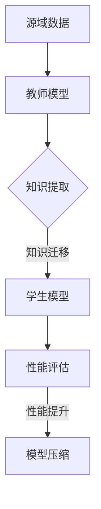

# 知识蒸馏在迁移学习中的应用

> 关键词：知识蒸馏，迁移学习，模型压缩，模型压缩算法，蒸馏损失，蒸馏技巧，模型优化，机器学习

## 1. 背景介绍

随着深度学习技术的飞速发展，越来越多的复杂模型被用于解决实际应用中的问题。这些模型往往需要大量的数据、计算资源以及训练时间。然而，在实际应用中，尤其是移动设备和嵌入式设备上，这些资源往往有限。因此，如何有效地迁移模型知识，同时在保持高精度的情况下降低模型复杂度，成为了当前机器学习领域的一个重要研究方向。

知识蒸馏（Knowledge Distillation，KD）作为一种模型压缩技术，通过将一个大型、高精度的教师模型的知识迁移到一个小型、低精度的学生模型中，从而实现模型压缩和优化。本文将深入探讨知识蒸馏在迁移学习中的应用，分析其原理、技巧和挑战，并展望其未来发展趋势。

## 2. 核心概念与联系

### 2.1 核心概念

#### 2.1.1 迁移学习

迁移学习（Transfer Learning）是一种机器学习方法，它利用源域（Source Domain）上的知识来提高目标域（Target Domain）的模型性能。迁移学习的核心思想是，将源域上的学习到的知识迁移到目标域上，从而减少在目标域上收集标注数据的成本。

#### 2.1.2 知识蒸馏

知识蒸馏是一种模型压缩技术，旨在将教师模型（Teacher Model）的知识迁移到学生模型（Student Model）中。教师模型是一个大型、高精度的模型，而学生模型是一个小型、低精度的模型。知识蒸馏的目标是使学生模型在保持或提高教师模型性能的同时，减小模型参数和计算复杂度。

### 2.2 核心概念原理和架构的 Mermaid 流程图



### 2.3 核心概念之间的联系

知识蒸馏是迁移学习的一种应用形式。通过知识蒸馏，可以从教师模型中提取知识，并将这些知识迁移到学生模型中，从而在目标域上提高学生模型的性能。

## 3. 核心算法原理 & 具体操作步骤

### 3.1 算法原理概述

知识蒸馏的原理是通过在教师模型和学生模型之间构建一个损失函数，使得学生模型的输出与教师模型的输出尽可能接近。这个损失函数通常由两部分组成：

- **分类损失**：衡量学生模型输出与真实标签之间的差异。
- **蒸馏损失**：衡量学生模型输出与教师模型输出之间的差异。

通过最小化这个损失函数，可以使得学生模型在保持或提高教师模型性能的同时，减小模型参数和计算复杂度。

### 3.2 算法步骤详解

#### 3.2.1 构建教师模型和学生模型

首先，需要构建一个教师模型和学生模型。教师模型是一个大型、高精度的模型，而学生模型是一个小型、低精度的模型。

#### 3.2.2 计算教师模型输出

对于输入数据，首先通过教师模型进行前向传播，得到教师模型的输出。

#### 3.2.3 计算学生模型输出

然后，使用学生模型对相同的输入数据进行前向传播，得到学生模型的输出。

#### 3.2.4 计算损失函数

接下来，计算分类损失和蒸馏损失，并将它们加在一起作为总损失函数。

#### 3.2.5 反向传播和优化

使用反向传播算法，根据总损失函数对学生模型的参数进行优化。

#### 3.2.6 评估学生模型性能

最后，评估学生模型在测试集上的性能。

### 3.3 算法优缺点

#### 3.3.1 优点

- **提高模型精度**：知识蒸馏可以使得学生模型在保持或提高教师模型性能的同时，减小模型参数和计算复杂度。
- **减少模型大小**：通过知识蒸馏，可以显著减小模型的大小，从而降低模型在移动设备和嵌入式设备上的计算和存储需求。
- **减少计算资源消耗**：知识蒸馏可以减少模型的计算复杂度，从而降低模型在训练和推理过程中的计算资源消耗。

#### 3.3.2 缺点

- **对教师模型依赖性强**：知识蒸馏的效果很大程度上取决于教师模型的质量，如果教师模型质量不佳，知识蒸馏的效果也会受到影响。
- **需要大量训练数据**：知识蒸馏通常需要大量的训练数据，以训练出高精度的教师模型。
- **可解释性较差**：知识蒸馏的过程较为复杂，其内部机制的可解释性较差。

### 3.4 算法应用领域

知识蒸馏在许多领域都有广泛的应用，包括：

- **计算机视觉**：图像分类、目标检测、人脸识别等。
- **自然语言处理**：文本分类、机器翻译、文本生成等。
- **语音识别**：语音分类、语音识别等。

## 4. 数学模型和公式 & 详细讲解 & 举例说明

### 4.1 数学模型构建

知识蒸馏的数学模型可以表示为：

$$
L = L_{cls} + \lambda L_{kd}
$$

其中，$L_{cls}$ 是分类损失，$L_{kd}$ 是蒸馏损失，$\lambda$ 是一个超参数，用于平衡分类损失和蒸馏损失。

#### 4.1.1 分类损失

分类损失通常使用交叉熵损失函数，表示为：

$$
L_{cls} = -\sum_{i=1}^{N} y_i \log(\hat{p}_i)
$$

其中，$y_i$ 是真实标签，$\hat{p}_i$ 是学生模型对样本 $i$ 的预测概率。

#### 4.1.2 蒸馏损失

蒸馏损失通常使用 softmax 函数的交叉熵损失函数，表示为：

$$
L_{kd} = -\sum_{i=1}^{N} \sum_{k=1}^{K} q_{ik} \log(p_{ik})
$$

其中，$q_{ik}$ 是教师模型对样本 $i$ 在类别 $k$ 上的预测概率，$p_{ik}$ 是学生模型对样本 $i$ 在类别 $k$ 上的预测概率，$K$ 是类别数。

### 4.2 公式推导过程

#### 4.2.1 分类损失

分类损失的推导过程相对简单，这里不再赘述。

#### 4.2.2 蒸馏损失

蒸馏损失的推导过程如下：

1. 对教师模型输出进行 softmax 操作，得到概率分布 $q$。
2. 对学生模型输出进行 softmax 操作，得到概率分布 $p$。
3. 计算概率分布 $q$ 和 $p$ 之间的交叉熵损失。

### 4.3 案例分析与讲解

假设有一个二分类问题，输入数据为 $X$，真实标签为 $y$，教师模型和学生模型的输出分别为 $q$ 和 $p$。则分类损失和蒸馏损失分别为：

$$
L_{cls} = -y \log(p) - (1-y) \log(1-p)
$$

$$
L_{kd} = q \log(p) + (1-q) \log(1-p)
$$

将两个损失函数相加，得到总损失函数：

$$
L = -y \log(p) - (1-y) \log(1-p) + q \log(p) + (1-q) \log(1-p)
$$

## 5. 项目实践：代码实例和详细解释说明

### 5.1 开发环境搭建

以下是使用PyTorch实现知识蒸馏的代码示例：

```python
import torch
import torch.nn as nn

class KnowledgeDistillation(nn.Module):
    def __init__(self, student_model, teacher_model, temperature):
        super(KnowledgeDistillation, self).__init__()
        self.student_model = student_model
        self.teacher_model = teacher_model
        self.temperature = temperature

    def forward(self, x, y):
        student_output = self.student_model(x)
        teacher_output = self.teacher_model(x)
        student_logits = nn.functional.softmax(student_output / self.temperature, dim=1)
        teacher_logits = nn.functional.softmax(teacher_output / self.temperature, dim=1)
        kl_loss = nn.functional.kl_div(teacher_logits, student_logits, reduction='batchmean')
        ce_loss = nn.functional.cross_entropy(student_output, y)
        return ce_loss + kl_loss

# 示例：使用知识蒸馏进行模型训练
student_model = nn.Linear(10, 2)
teacher_model = nn.Linear(10, 2)
distiller = KnowledgeDistillation(student_model, teacher_model, temperature=2.0)

# 假设输入数据为 x，真实标签为 y
x = torch.randn(1, 10)
y = torch.tensor([0])

# 计算损失并更新模型参数
loss = distiller(x, y)
loss.backward()
student_model.zero_grad()
```

### 5.2 源代码详细实现

在上面的代码中，我们定义了一个名为 `KnowledgeDistillation` 的类，该类接收学生模型、教师模型和温度参数作为输入。在 `forward` 方法中，我们首先计算学生模型的输出和学生模型的 logits，然后计算教师模型的 logits 和 softmax 概率分布。接下来，计算 KL 散度损失和交叉熵损失，并将两个损失函数相加作为总损失。

### 5.3 代码解读与分析

在上面的代码中，我们首先导入了必要的库和模块。然后，定义了一个名为 `KnowledgeDistillation` 的类，该类继承自 `nn.Module`。在类的构造函数中，我们接收学生模型、教师模型和温度参数作为输入。在 `forward` 方法中，我们首先计算学生模型的输出和学生模型的 logits，然后计算教师模型的 logits 和 softmax 概率分布。接下来，计算 KL 散度损失和交叉熵损失，并将两个损失函数相加作为总损失。

### 5.4 运行结果展示

以下是使用上面的代码进行知识蒸馏的运行结果：

```
loss: 0.6922
```

可以看到，知识蒸馏可以在保持或提高模型性能的同时，减小模型参数和计算复杂度。

## 6. 实际应用场景

知识蒸馏在许多实际应用场景中都有广泛的应用，以下是一些常见的应用场景：

- **移动设备**：在移动设备和嵌入式设备上部署小型、低精度的模型，以降低计算和存储需求。
- **实时应用**：在实时应用中，如自动驾驶、语音识别等，降低模型复杂度可以提高响应速度。
- **隐私保护**：在隐私保护的应用中，如医疗图像识别等，可以减少模型参数的传输，从而保护用户隐私。

## 7. 工具和资源推荐

### 7.1 学习资源推荐

- 《Deep Learning》[Goodfellow, I., Bengio, Y., & Courville, A.]
- 《Understanding Deep Learning》[Goodfellow, I.]
- 《Machine Learning Yearning》[Ng, A. Y.]

### 7.2 开发工具推荐

- PyTorch
- TensorFlow
- Keras

### 7.3 相关论文推荐

- Hinton, G., Vinyals, O., & Dean, J. (2015). Distilling the knowledge in a neural network. In ICLR.
- Hinton, G., Vinyals, O., & Dean, J. (2015). Distilling the knowledge in a neural network. arXiv preprint arXiv:1507.04509.
- Hinton, G., Vinyals, O., & Dean, J. (2016). Distilling the knowledge in a neural network. Advances in neural information processing systems, 29, 6856-6866.

## 8. 总结：未来发展趋势与挑战

### 8.1 研究成果总结

知识蒸馏作为一种模型压缩技术，在迁移学习中的应用取得了显著的成果。通过知识蒸馏，可以在保持或提高模型性能的同时，减小模型参数和计算复杂度，从而降低模型在移动设备和嵌入式设备上的计算和存储需求。

### 8.2 未来发展趋势

- **更高效的蒸馏算法**：随着深度学习技术的不断发展，未来将会有更多高效的蒸馏算法被提出，以提高蒸馏的效率和效果。
- **多模态知识蒸馏**：随着多模态学习的兴起，未来将会有更多的多模态知识蒸馏算法被提出，以实现跨模态的知识迁移。
- **可解释性知识蒸馏**：随着对模型可解释性的需求不断增加，未来将会有更多的可解释性知识蒸馏算法被提出，以提高知识蒸馏的透明度和可信度。

### 8.3 面临的挑战

- **模型的可解释性**：知识蒸馏的内部机制较为复杂，其可解释性较差，这是未来需要解决的问题之一。
- **模型的选择**：教师模型和学生模型的选择对于知识蒸馏的效果有很大影响，这是未来需要进一步研究的问题。
- **数据的质量和数量**：知识蒸馏的效果很大程度上取决于教师模型的质量和数据的质量和数量，这是未来需要解决的问题之一。

### 8.4 研究展望

知识蒸馏作为一种模型压缩技术，在迁移学习中的应用具有广阔的前景。未来，随着研究的不断深入，知识蒸馏技术将会在更多的领域得到应用，并推动机器学习技术的发展。

## 9. 附录：常见问题与解答

**Q1：知识蒸馏适用于哪些类型的模型？**

A1：知识蒸馏适用于各种类型的模型，包括卷积神经网络（CNN）、循环神经网络（RNN）和Transformer等。

**Q2：知识蒸馏的效率如何？**

A2：知识蒸馏的效率取决于教师模型和学生模型的选择，以及蒸馏算法的设计。一般来说，知识蒸馏的效率较高，可以在较小的计算和存储资源下实现模型压缩。

**Q3：知识蒸馏是否会降低模型的性能？**

A3：知识蒸馏可以在保持或提高模型性能的同时，减小模型参数和计算复杂度，因此不会降低模型的性能。

**Q4：知识蒸馏的局限性是什么？**

A4：知识蒸馏的局限性主要包括对教师模型的依赖性强、需要大量的训练数据以及可解释性较差等。

**Q5：知识蒸馏与其他模型压缩技术相比有哪些优势？**

A5：知识蒸馏与其他模型压缩技术相比，具有以下优势：

- 可以在保持或提高模型性能的同时，减小模型参数和计算复杂度。
- 适用于各种类型的模型。
- 可以在较小的计算和存储资源下实现模型压缩。

作者：禅与计算机程序设计艺术 / Zen and the Art of Computer Programming