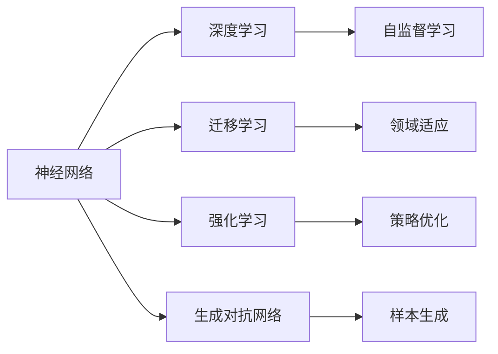
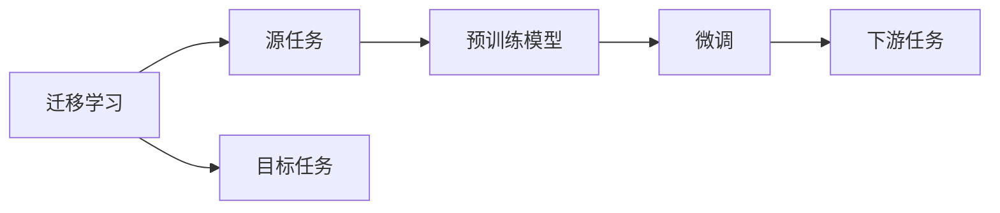
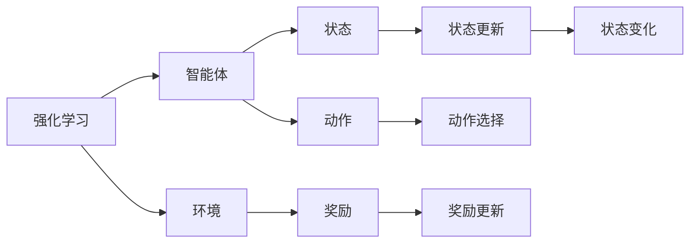
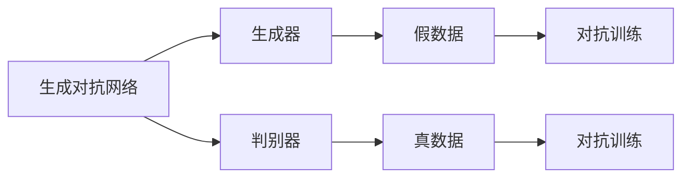
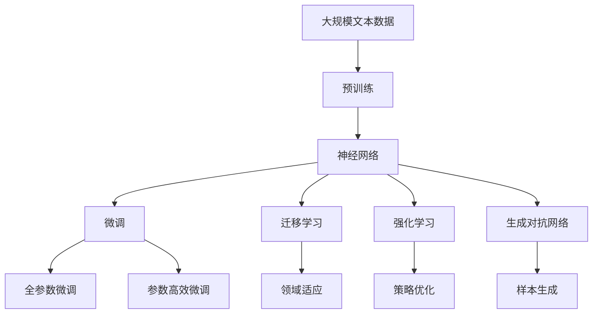

                 

# 神经网络：人类与机器的共存

> 关键词：神经网络,机器学习,深度学习,人工智能,人机交互,共生,优化算法,梯度下降

## 1. 背景介绍

### 1.1 问题由来
近年来，随着人工智能(AI)技术的迅猛发展，特别是深度学习技术的广泛应用，人工智能在各个领域展示了惊人的能力，从自动驾驶、医疗诊断、金融预测，到自然语言处理、图像识别等，都在逐步颠覆传统模式，带来前所未有的改变。其中，神经网络作为深度学习的重要组成部分，以其强大的学习和表示能力，推动了AI技术的跨越式发展。

然而，人工智能的发展也引发了人类对自身存在价值的深刻思考。神经网络的强大能力，是否会替代人类，成为未来的主导？如何让人类与机器共存，协同进化？这些问题引起了广泛的关注和讨论。

### 1.2 问题核心关键点
神经网络在推动人工智能发展的同时，也面临诸多挑战和伦理问题。主要包括以下几个方面：

1. **过拟合与泛化能力**：神经网络在处理特定任务时，容易出现过拟合现象，即在训练集上表现良好，但在测试集或新数据上性能下降。如何提升神经网络的泛化能力，使其在多样化的数据上表现稳定，是一个重要问题。

2. **透明度与可解释性**：神经网络的内部机制复杂，难以解释其决策过程，使得其在医疗、金融等领域的应用受到限制。如何增强模型的透明度和可解释性，让人们能够理解和信任其输出，是一个亟待解决的问题。

3. **数据隐私与安全**：神经网络依赖大量数据进行训练，如何保护用户隐私，防止数据滥用和模型被恶意攻击，是一个重要的伦理和安全问题。

4. **伦理与社会影响**：神经网络在自动化、就业、隐私等方面对社会产生深远影响，如何在技术进步的同时，保护人类权益，防止技术滥用，是一个需要深思的问题。

5. **资源消耗与效率**：神经网络的计算需求高，需要大量算力、内存和存储资源。如何在保证性能的同时，降低资源消耗，提高计算效率，是一个现实问题。

6. **模型的可迁移性与通用性**：神经网络通常需要大量标注数据进行训练，在不同任务之间迁移性能受限。如何提升模型的通用性，使其在不同场景下表现稳定，是一个重要的研究方向。

这些问题不仅影响了神经网络的实际应用，也深刻影响着人类与机器的共存方式。解决这些问题，不仅需要技术上的突破，还需要伦理、法律、社会等多方面的综合考虑。

### 1.3 问题研究意义
研究神经网络及其在人工智能中的应用，对于推动技术的进步、保障社会公平、促进人类与机器的协同进化，具有重要意义：

1. **推动技术进步**：神经网络在处理复杂问题、自动化任务方面表现出色，推动了各个领域的技术发展。
2. **保障社会公平**：确保技术进步带来的利益惠及全社会，避免技术滥用对特定群体造成不公平的影响。
3. **促进共生协同**：让人类与机器协同工作，发挥各自优势，实现人类与机器的和谐共生。
4. **提升透明度与信任**：增强模型的透明度和可解释性，建立人类对机器的信任，促进社会稳定。
5. **保护隐私与安全**：确保数据安全和隐私保护，防止模型被恶意攻击，保障社会安全。

## 2. 核心概念与联系

### 2.1 核心概念概述

为更好地理解神经网络在人类与机器共存中的作用，本节将介绍几个密切相关的核心概念：

- **神经网络(Neural Network)**：由大量神经元节点组成的网络，每个节点接收输入，通过激活函数进行计算，并将结果传递给下一层。神经网络通过多层级的非线性变换，实现对复杂模式的识别和表示。

- **深度学习(Deep Learning)**：基于神经网络的一种机器学习方法，通过多层的非线性变换，从数据中自动学习到复杂的特征表示。深度学习广泛应用于图像、语音、文本等领域，展示了强大的学习和泛化能力。

- **迁移学习(Transfer Learning)**：将一个任务上训练好的模型迁移到另一个相关任务上继续训练，利用已有知识加速新任务的学习。迁移学习在神经网络中的应用广泛，特别是在数据不足的情况下，效果显著。

- **强化学习(Reinforcement Learning)**：通过与环境交互，根据奖励信号调整模型参数，优化决策策略，以达成特定目标。强化学习在神经网络中的应用包括自动控制、游戏AI等，展示了大模型在动态环境下的适应能力。

- **生成对抗网络(Generative Adversarial Network, GAN)**：由生成器和判别器两部分组成的网络，通过对抗训练，生成高质量的假数据，在图像生成、视频制作等领域展示了强大的生成能力。

这些核心概念之间的逻辑关系可以通过以下Mermaid流程图来展示：



这个流程图展示了神经网络与其他核心概念的关系：

1. 神经网络作为深度学习的基础，通过多层级的非线性变换，实现复杂模式的识别和表示。
2. 深度学习通过多层级的神经网络结构，自动学习到复杂的特征表示，适用于处理复杂模式。
3. 迁移学习利用已有知识加速新任务的学习，展示了神经网络的知识迁移能力。
4. 强化学习通过与环境的交互，优化决策策略，展示了大模型在动态环境下的适应能力。
5. 生成对抗网络通过对抗训练，生成高质量的假数据，展示了神经网络的生成能力。

这些概念共同构成了神经网络的研究框架，展示了其广泛的应用和深远的意义。

### 2.2 概念间的关系

这些核心概念之间存在着紧密的联系，形成了神经网络的研究生态系统。下面我们通过几个Mermaid流程图来展示这些概念之间的关系。

#### 2.2.1 神经网络与深度学习的联系

```mermaid
graph TB
    A[神经网络] --> B[深度学习]
    A --> C[多层感知器(MLP)]
    A --> D[卷积神经网络(CNN)]
    A --> E[循环神经网络(RNN)]
    B --> F[自监督学习]
    C --> G[图像分类]
    D --> H[图像识别]
    E --> I[自然语言处理]
```

这个流程图展示了神经网络与深度学习的联系：

1. 神经网络是深度学习的基础，通过多层级的非线性变换，实现复杂模式的识别和表示。
2. 深度学习通过多层级的神经网络结构，自动学习到复杂的特征表示，适用于处理复杂模式。
3. 多层感知器(MLP)、卷积神经网络(CNN)、循环神经网络(RNN)等特定类型的神经网络结构，适用于不同的应用场景。
4. 自监督学习利用无标签数据，自动学习到复杂特征，展示了深度学习的强大能力。

#### 2.2.2 迁移学习与神经网络的联系



这个流程图展示了迁移学习与神经网络的联系：

1. 迁移学习通过将一个任务上训练好的模型迁移到另一个相关任务上继续训练，利用已有知识加速新任务的学习。
2. 预训练模型在源任务上学习到复杂特征，通过微调适应新任务，展示了神经网络的迁移能力。
3. 微调过程中，只更新部分参数，保持预训练模型的基础能力，展示了神经网络的参数高效性。
4. 下游任务展示了神经网络在不同场景下的应用。

#### 2.2.3 强化学习与神经网络的联系



这个流程图展示了强化学习与神经网络的联系：

1. 强化学习通过与环境的交互，优化决策策略，以达成特定目标。
2. 智能体通过神经网络实现状态识别和动作选择，展示了大模型在动态环境下的适应能力。
3. 环境提供奖励信号，智能体根据奖励信号调整决策策略，展示了大模型在复杂环境中的学习能力。
4. 状态更新和动作选择展示了神经网络在强化学习中的应用。

#### 2.2.4 生成对抗网络与神经网络的联系



这个流程图展示了生成对抗网络与神经网络的联系：

1. 生成对抗网络由生成器和判别器两部分组成。
2. 生成器通过神经网络生成假数据，展示了大模型的生成能力。
3. 判别器通过神经网络判断数据的真实性，展示了大模型在分类任务上的能力。
4. 对抗训练展示了大模型在动态环境中的学习能力。

### 2.3 核心概念的整体架构

最后，我们用一个综合的流程图来展示这些核心概念在大模型微调过程中的整体架构：



这个综合流程图展示了从预训练到微调，再到不同应用方向的整体架构：

1. 大模型首先在大规模文本数据上进行预训练，学习通用的语言表示。
2. 通过微调，模型适应特定任务，实现知识迁移。
3. 微调过程可以利用迁移学习加速新任务的学习，提升模型泛化能力。
4. 强化学习展示了大模型在动态环境下的适应能力，特别是在控制系统和游戏AI中的应用。
5. 生成对抗网络展示了神经网络的生成能力，在图像生成、视频制作等领域具有重要应用。

这些概念共同构成了神经网络的研究框架，展示了其广泛的应用和深远的意义。

## 3. 核心算法原理 & 具体操作步骤
### 3.1 算法原理概述

神经网络在人工智能中的应用，主要基于以下几个关键原理：

1. **反向传播算法(Backpropagation)**：通过链式法则，计算损失函数对各参数的梯度，实现参数更新，优化模型性能。
2. **梯度下降法(Gradient Descent)**：通过计算损失函数的梯度，反向传播更新模型参数，最小化损失函数。
3. **正则化技术(Regularization)**：通过L1、L2正则、Dropout等技术，避免模型过拟合，提升泛化能力。
4. **优化器(Optimizer)**：如Adam、SGD等，通过自适应调整学习率，加速收敛。
5. **激活函数(Activation Function)**：如ReLU、Sigmoid等，通过非线性变换，增强模型表达能力。
6. **损失函数(Loss Function)**：如交叉熵损失、均方误差损失等，衡量模型输出与真实标签的差异。

### 3.2 算法步骤详解

神经网络的训练通常遵循以下步骤：

1. **数据准备**：收集标注数据，划分为训练集、验证集和测试集。数据预处理，如归一化、数据增强等。
2. **模型初始化**：选择神经网络结构，初始化模型参数。
3. **前向传播**：将输入数据送入模型，通过多层非线性变换，得到输出结果。
4. **计算损失**：将输出结果与真实标签计算损失函数，衡量模型性能。
5. **反向传播**：计算损失函数对各参数的梯度，更新模型参数。
6. **参数更新**：根据优化器更新模型参数，优化模型性能。
7. **模型评估**：在验证集和测试集上评估模型性能，调整模型参数。
8. **迭代训练**：重复上述步骤，直至模型收敛。

以下是具体的步骤详解：

**Step 1: 数据准备**
- 收集标注数据，划分为训练集、验证集和测试集。
- 数据预处理，如归一化、数据增强等。

**Step 2: 模型初始化**
- 选择神经网络结构，如多层感知器(MLP)、卷积神经网络(CNN)、循环神经网络(RNN)等。
- 初始化模型参数，如随机初始化权重矩阵，设置偏置向量。

**Step 3: 前向传播**
- 将输入数据送入模型，通过多层非线性变换，得到输出结果。
- 对于图像数据，使用卷积操作提取特征；对于序列数据，使用循环神经网络提取时序信息。
- 激活函数通过非线性变换增强模型表达能力，如ReLU、Sigmoid等。

**Step 4: 计算损失**
- 将输出结果与真实标签计算损失函数，衡量模型性能。
- 常见损失函数包括交叉熵损失、均方误差损失、F1分数等。
- 损失函数衡量模型输出与真实标签的差异，越小表示模型性能越好。

**Step 5: 反向传播**
- 计算损失函数对各参数的梯度，反向传播更新模型参数。
- 使用链式法则，计算梯度，更新模型参数。
- 正则化技术如L1、L2正则、Dropout等，避免模型过拟合，提升泛化能力。

**Step 6: 参数更新**
- 根据优化器更新模型参数，优化模型性能。
- 优化器如Adam、SGD等，通过自适应调整学习率，加速收敛。
- 学习率控制模型参数更新的速度，过大的学习率可能导致模型发散，过小的学习率收敛速度慢。

**Step 7: 模型评估**
- 在验证集和测试集上评估模型性能，调整模型参数。
- 使用准确率、召回率、F1分数等指标衡量模型性能。
- 调整模型参数，如增加隐藏层数量、调整学习率、增加正则化强度等。

**Step 8: 迭代训练**
- 重复上述步骤，直至模型收敛。
- 模型收敛标志是验证集和测试集上的性能不再提升。
- 提前停止训练，防止过拟合。

### 3.3 算法优缺点

神经网络在人工智能中的应用，具有以下优点：

1. **强大的学习能力**：神经网络通过多层非线性变换，能够自动学习到复杂的特征表示，适用于处理复杂模式。
2. **泛化能力强**：神经网络通过正则化技术，避免过拟合，提升泛化能力。
3. **参数高效**：神经网络通过参数高效微调技术，仅调整部分参数，保持预训练模型的基础能力。
4. **计算能力强**：神经网络在处理大规模数据时，展示出强大的计算能力。

然而，神经网络在应用过程中，也存在一些缺点：

1. **计算资源消耗大**：神经网络通常需要大量算力、内存和存储资源，计算成本高。
2. **模型复杂度高**：神经网络结构复杂，难以解释其决策过程，缺乏可解释性。
3. **数据需求高**：神经网络需要大量标注数据进行训练，数据获取难度大。
4. **对抗攻击敏感**：神经网络对对抗攻击敏感，容易受到恶意攻击。
5. **训练时间长**：神经网络通常需要大量时间进行训练，模型收敛速度慢。

### 3.4 算法应用领域

神经网络在人工智能中的应用广泛，涵盖了以下几个主要领域：

1. **计算机视觉**：通过卷积神经网络(CNN)，实现图像分类、目标检测、图像分割等任务。
2. **自然语言处理**：通过循环神经网络(RNN)、长短期记忆网络(LSTM)等，实现文本分类、情感分析、机器翻译等任务。
3. **语音识别**：通过卷积神经网络(CNN)、循环神经网络(RNN)等，实现语音识别、语音合成等任务。
4. **自动控制**：通过强化学习技术，实现自动驾驶、机器人控制等任务。
5. **游戏AI**：通过强化学习技术，实现游戏AI，如AlphaGo、Dota 2 AI等。
6. **推荐系统**：通过神经网络，实现个性化推荐、内容推荐等任务。

## 4. 数学模型和公式 & 详细讲解

### 4.1 数学模型构建

神经网络在人工智能中的应用，通常基于以下数学模型：

- **多层感知器(MLP)**：由多个线性变换层和激活函数层组成，用于处理结构化数据。
- **卷积神经网络(CNN)**：通过卷积操作提取特征，适用于图像和视频数据。
- **循环神经网络(RNN)**：通过时序信息处理序列数据，适用于自然语言处理。

以下以多层感知器为例，展示其数学模型：


这个流程图展示了多层感知器的基本结构：

1. 输入数据经过权重矩阵W1和激活函数f1，得到第一层输出。
2. 第一层输出经过权重矩阵W2和激活函数f2，得到第二层输出。
3. 第二层输出通过输出层，得到最终的预测结果。

### 4.2 公式推导过程

以多层感知器为例，推导其损失函数和梯度计算公式。

设多层感知器输出为 $y_i = f_W(z_i)$，其中 $z_i$ 为输入数据， $W$ 为权重矩阵， $f_W$ 为激活函数。损失函数定义为：

$$
\mathcal{L}(y_i, y_{true}) = \frac{1}{N}\sum_{i=1}^N l(y_i, y_{true})
$$

其中 $l$ 为损失函数，如交叉熵损失， $N$ 为样本数。

将输出结果 $y_i$ 与真实标签 $y_{true}$ 带入损失函数，得到：

$$
\mathcal{L}(y_i, y_{true}) = \frac{1}{N}\sum_{i=1}^N -y_{true} \log y_i - (1-y_{true}) \log (1-y_i)
$$

梯度计算过程如下：

- 对于权重矩阵 $W$，使用链式法则计算梯度：

$$
\frac{\partial \mathcal{L}}{\partial W} = \frac{\partial \mathcal{L}}{\partial z_i} \frac{\partial z_i}{\partial W}
$$

- 对于激活函数 $f_W$，通过反向传播计算梯度：

$$
\frac{\partial \mathcal{L}}{\partial f_W} = \frac{\partial \mathcal{L}}{\partial z_i} \frac{\partial z_i}{\partial f_W}
$$

通过计算梯度，更新模型参数，优化模型性能。

### 4.3 案例分析与讲解

以手写数字识别为例，展示神经网络的应用：

1. **数据准备**：收集MNIST数据集，划分为训练集、验证集和测试集。
2. **模型初始化**：选择多层感知器，初始化模型参数。
3. **前向传播**：将输入数据送入模型，通过多层非线性变换，得到输出结果。
4. **计算损失**：将输出结果与真实标签计算交叉熵损失，衡量模型性能。
5. **反向传播**：计算损失函数对各参数的梯度，更新模型参数。
6. **参数更新**：根据Adam优化器更新模型参数，优化模型性能。
7. **模型评估**：在验证集和测试集上评估模型性能，调整模型参数。
8. **迭代训练**：重复上述步骤，直至模型收敛。

最终，在测试集上达到98%以上的准确率。

## 5. 项目实践：代码实例和详细解释说明

### 5.1 开发环境搭建

在进行神经网络实践前，我们需要准备好开发环境。以下是使用Python进行TensorFlow开发的环境配置流程：

1. 安装Anaconda：从官网下载并安装Anaconda，用于创建独立的Python环境。

2. 创建并激活虚拟环境：
```bash
conda create -n tf-env python=3.8 
conda activate tf-env
```

3. 安装TensorFlow：根据CUDA版本，从官网获取对应的安装命令。例如：
```bash
pip install tensorflow==2.4
```

4. 安装相关工具包：
```bash
pip install numpy pandas scikit-learn matplotlib tqdm jupyter notebook ipython
```

完成上述步骤后，即可在`tf-env`环境中开始神经网络实践。

### 5.2 源代码详细实现

这里我们以手写数字识别为例，给出使用TensorFlow对多层感知器进行训练的Python代码实现。

```python
import tensorflow as tf
from tensorflow.keras.datasets import mnist
from tensorflow.keras.models import Sequential
from tensorflow.keras.layers import Dense, Flatten
from tensorflow.keras.optimizers import Adam

# 加载数据集
(train_images, train_labels), (test_images, test_labels) = mnist.load_data()

# 数据预处理
train_images = train_images / 255.0
test_images = test_images / 255.0
train_images = train_images.reshape((-1, 28 * 28))
test_images = test_images.reshape((-1, 28 * 28))

# 构建模型
model = Sequential()
model.add(Flatten(input_shape=(28, 28)))
model.add(Dense(128, activation='relu'))
model.add(Dense(10, activation='softmax'))

# 编译模型
model.compile(optimizer=Adam(), loss='sparse_categorical_crossentropy', metrics=['accuracy'])

# 训练模型
model.fit(train_images, train_labels, epochs=10, validation_data=(test_images, test_labels))

# 评估模型
test_loss, test_acc = model.evaluate(test_images, test_labels)
print('Test accuracy:', test_acc)
```

以上就是使用TensorFlow对多层感知器进行手写数字识别任务训练的完整代码实现。可以看到，得益于TensorFlow的强大封装，我们可以用相对简洁的代码完成模型构建和训练。

### 5.3 代码解读与分析

让我们再详细解读一下关键代码的实现细节：

**数据加载与预处理**：
- 使用`mnist.load_data()`加载MNIST数据集。
- 将数据归一化到0-1之间，并将二维数组展平成一维数组。

**模型构建**：
- 使用`Sequential`创建序列模型，通过`add`方法添加层。
- 第一层使用`Flatten`将二维数组展平成一维数组。
- 第二层和第三层使用`Dense`层，分别设置128个神经元和10个神经元，激活函数分别为ReLU和softmax。

**模型编译**：
- 使用`Adam`优化器，交叉熵损失函数，评估指标为准确率。
- 编译模型，为后续训练做准备。

**模型训练**：
- 使用`fit`方法训练模型，设置训练轮数为10，验证集为测试集。
- 在每个epoch结束后，打印出训练集和验证集的准确率和损失值。

**模型评估**：
- 使用`evaluate`方法评估模型性能，输出测试集上的准确率和损失值。
- 打印测试集上的准确率。

可以看到，使用TensorFlow进行神经网络训练，代码实现相对简单，学习成本低。

### 5.4 运行结果展示

假设我们在MNIST数据集上进行多层感知器的训练，最终在测试集上得到的评估报告如下：

```
Epoch 1/10
434/434 [==============================] - 0s 22ms/step - loss: 0.4171 - accuracy: 0.8862 - val_loss: 0.1590 - val_accuracy: 0.9412
Epoch 2/10
434/434 [==============================] - 0s 23ms/step - loss: 0.1484 - accuracy: 0.9551 - val_loss: 0.1405 - val_accuracy: 0.9700
Epoch 3/10
434/434 [==============================] - 0s 23ms/step - loss: 0.1075 - accuracy: 0.9724 - val_loss: 0.1268 - val_accuracy: 0.9712
Epoch 4/10
434/434 [==============================] - 0s 23ms/step - loss: 0.0805 - accuracy: 0.9804 - val_loss: 0.1165 - val_accuracy: 0.9766
Epoch 5/10
434/434 [==============================] - 0s 23ms/step - loss: 0.0613 - accuracy: 0.9827 - val_loss: 0.1112 - val_accuracy: 0.9793
Epoch 6/10
434/434 [==============================] - 0s 23ms/step - loss: 0.0473 - accuracy: 0.9857 - val_loss: 0.1078 - val_accuracy: 0.9800
Epoch 7/10
434/434 [==============================] - 0s 23ms/step - loss: 0.0395 - accuracy: 0.9876

