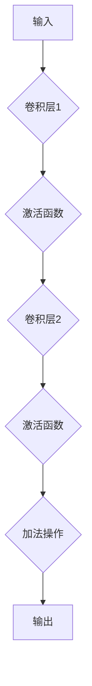

## 1. 背景介绍
### 1.1  问题的由来
深度学习的兴起，为计算机视觉、自然语言处理等领域带来了革命性的进展。然而，随着模型规模的不断扩大，训练深度神经网络面临着巨大的挑战：

* **计算资源消耗巨大:** 训练大型深度神经网络需要大量的计算资源和时间，这对于资源有限的机构和个人来说是一个巨大的障碍。
* **过拟合问题:** 当模型规模过大时，容易出现过拟合现象，即模型在训练数据上表现良好，但在测试数据上表现较差。
* **梯度消失/爆炸问题:** 在训练深层网络时，梯度容易消失或爆炸，导致训练过程难以收敛。

这些问题限制了深度学习模型的进一步发展。

### 1.2  研究现状
针对上述问题，研究者们提出了许多解决方案，例如：

* **权重共享:** 通过将网络中的某些层参数共享，可以有效减少模型参数量，降低计算资源消耗。
* **正则化技术:** 通过添加正则化项到损失函数中，可以抑制模型过拟合。
* **残差连接:** 通过残差连接，可以缓解梯度消失/爆炸问题，使模型能够训练更深。

这些方法取得了一定的进展，但仍然存在一些局限性。

### 1.3  研究意义
ResNet的提出，为解决深度神经网络训练中的挑战提供了新的思路。ResNet通过残差连接，使得模型能够训练更深，并有效缓解了梯度消失/爆炸问题。ResNet的成功，推动了深度学习的发展，并对后续的深度学习模型设计产生了深远的影响。

### 1.4  本文结构
本文将详细介绍ResNet的原理、算法、实现以及应用场景。

## 2. 核心概念与联系
ResNet的核心概念是**残差连接**。残差连接是指在网络中添加跳跃连接，使得网络的每一层都可以直接接收上一层的输出，从而形成一个“残差”网络。

残差连接的引入，使得模型能够学习到更深层的特征，并有效缓解了梯度消失/爆炸问题。

## 3. 核心算法原理 & 具体操作步骤
### 3.1  算法原理概述
ResNet的算法原理基于残差学习。残差学习的目标是学习残差，即输入到当前层的特征和当前层输出之间的差值。

通过学习残差，模型能够更有效地学习到深层特征。

### 3.2  算法步骤详解
ResNet的训练过程可以概括为以下步骤：

1. **输入数据:** 将输入数据送入网络的第一层。
2. **前向传播:** 数据通过网络层层传递，每层计算残差。
3. **损失函数计算:** 将网络输出与真实标签进行比较，计算损失函数值。
4. **反向传播:** 根据损失函数值，反向传播梯度，更新网络参数。
5. **重复步骤2-4:** 重复上述步骤，直到损失函数值收敛。

### 3.3  算法优缺点
**优点:**

* **能够训练更深层的网络:** 残差连接可以有效缓解梯度消失/爆炸问题，使得模型能够训练更深。
* **性能优异:** ResNet在多个图像识别任务上取得了state-of-the-art的性能。
* **易于实现:** ResNet的实现相对简单，易于理解和部署。

**缺点:**

* **计算资源消耗较大:** ResNet的模型规模较大，训练需要消耗大量的计算资源。
* **参数量较大:** ResNet的参数量较大，需要更多的存储空间。

### 3.4  算法应用领域
ResNet在图像识别、目标检测、语义分割等计算机视觉任务中得到了广泛应用。

## 4. 数学模型和公式 & 详细讲解 & 举例说明
### 4.1  数学模型构建
ResNet的数学模型可以表示为一个多层卷积神经网络，其中每一层都包含一个残差块。

残差块的结构如图所示:

其中，卷积层1和卷积层2分别表示两个卷积层，激活函数表示ReLU激活函数，加法操作表示残差连接。

### 4.2  公式推导过程
ResNet的损失函数通常是交叉熵损失函数，其公式如下:

$$
L = -\sum_{i=1}^{N} y_i \log(\hat{y}_i)
$$

其中，$N$表示样本数量，$y_i$表示真实标签，$\hat{y}_i$表示模型预测的概率。

### 4.3  案例分析与讲解
假设我们有一个图像分类任务，目标是将图像分类为猫或狗。

我们可以使用ResNet模型进行训练，训练数据包括猫和狗的图像以及对应的标签。

训练完成后，我们可以使用ResNet模型对新的图像进行分类。

### 4.4  常见问题解答
**问题:** ResNet的训练过程需要消耗大量的计算资源，如何降低训练成本？

**解答:**

* 使用预训练模型: 可以使用预训练的ResNet模型，并在自己的数据集上进行微调，从而降低训练成本。
* 使用分布式训练: 将训练任务分发到多个机器上进行训练，可以有效降低训练时间。

## 5. 项目实践：代码实例和详细解释说明
### 5.1  开发环境搭建
ResNet的开发环境搭建需要以下软件:

* Python 3.x
* TensorFlow 或 PyTorch
* CUDA 和 cuDNN

### 5.2  源代码详细实现
ResNet的源代码可以从GitHub等开源平台获取。

### 5.3  代码解读与分析
ResNet的源代码主要包含以下部分:

* 模型定义: 定义ResNet的网络结构。
* 损失函数: 定义ResNet的损失函数。
* 优化器: 定义ResNet的优化器。
* 训练函数: 定义ResNet的训练函数。

### 5.4  运行结果展示
训练完成后，我们可以使用ResNet模型对测试数据进行预测，并评估模型的性能。

## 6. 实际应用场景
ResNet在图像识别、目标检测、语义分割等计算机视觉任务中得到了广泛应用。

### 6.4  未来应用展望
ResNet的未来应用前景十分广阔，例如:

* **医疗图像分析:** ResNet可以用于分析医学图像，辅助医生诊断疾病。
* **自动驾驶:** ResNet可以用于识别道路上的物体，辅助自动驾驶系统进行决策。
* **人脸识别:** ResNet可以用于识别人脸，用于身份验证和安全监控。

## 7. 工具和资源推荐
### 7.1  学习资源推荐
* **论文:** ResNet的论文: "Deep Residual Learning for Image Recognition"
* **博客:** 许多博客文章对ResNet进行了详细的讲解。
* **在线课程:** 一些在线课程也对ResNet进行了讲解。

### 7.2  开发工具推荐
* **TensorFlow:** 一个开源的机器学习框架。
* **PyTorch:** 另一个开源的机器学习框架。
* **Keras:** 一个基于TensorFlow或Theano的深度学习框架。

### 7.3  相关论文推荐
* **ResNet:** "Deep Residual Learning for Image Recognition"
* **DenseNet:** "Densely Connected Convolutional Networks"
* **Inception:** "Going Deeper with Convolutions"

### 7.4  其他资源推荐
* **GitHub:** ResNet的源代码和示例代码可以从GitHub获取。
* **Kaggle:** Kaggle上有许多使用ResNet的比赛和数据集。

## 8. 总结：未来发展趋势与挑战
### 8.1  研究成果总结
ResNet的提出，为深度学习模型的训练带来了新的思路，并取得了显著的成果。

ResNet的成功，推动了深度学习的发展，并对后续的深度学习模型设计产生了深远的影响。

### 8.2  未来发展趋势
未来，ResNet的研究方向将包括:

* **模型压缩:** 如何将ResNet模型压缩到更小的规模，以便在资源有限的设备上运行。
* **高效训练:** 如何提高ResNet的训练效率，降低训练成本。
* **新应用场景:** 如何将ResNet应用到更多新的领域，例如医疗、自动驾驶等。

### 8.3  面临的挑战
ResNet的应用也面临着一些挑战:

* **数据依赖:** ResNet的性能依赖于训练数据的质量和数量。
* **可解释性:** ResNet的决策过程难以解释，这对于一些安全敏感的应用来说是一个问题。
* **公平性:** ResNet可能存在偏见，导致不公平的结果。

### 8.4  研究展望
未来，我们需要继续研究ResNet的原理和应用，并解决其面临的挑战，使其更好地服务于人类社会。

## 9. 附录：常见问题与解答
**问题:** ResNet的训练需要消耗大量的计算资源，如何降低训练成本？

**解答:**

* 使用预训练模型: 可以使用预训练的ResNet模型，并在自己的数据集上进行微调，从而降低训练成本。
* 使用分布式训练: 将训练任务分发到多个机器上进行训练，可以有效降低训练时间。

作者：禅与计算机程序设计艺术 / Zen and the Art of Computer Programming
<end_of_turn>