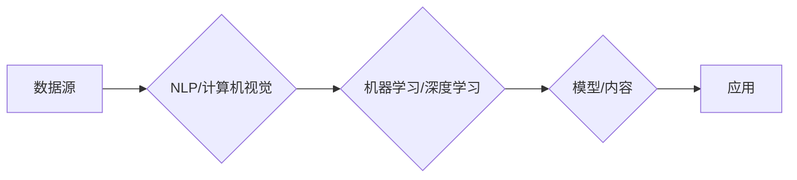

# 生成式AIGC：商业智能的未来方向

> 关键词：生成式AI，商业智能，AIGC，内容生成，数据驱动，个性化，自动化

## 1. 背景介绍

随着人工智能技术的飞速发展，生成式AI（Artificial Intelligence for Generative Content，简称AIGC）逐渐成为商业智能领域的新兴方向。AIGC利用人工智能算法生成文本、图像、音频等多种类型的内容，为商业智能提供了全新的可能性。本文将深入探讨生成式AIGC的原理、实践、应用场景以及未来发展趋势，展望其在商业智能领域的巨大潜力。

### 1.1 问题的由来

在数字化时代，数据已经成为企业的核心资产。然而，如何有效地处理和分析海量数据，提取有价值的信息，并转化为商业决策，成为企业面临的重要挑战。传统的人工数据分析方法效率低下，且难以满足个性化、定制化的需求。生成式AIGC的出现，为解决这些问题提供了新的思路。

### 1.2 研究现状

近年来，AIGC技术取得了显著进展，涌现出众多优秀的生成式AI模型。例如，自然语言生成（Natural Language Generation，简称NLG）模型可以自动生成新闻、报告、广告等文本内容；图像生成模型如GANs（Generative Adversarial Networks）可以生成逼真的图像；音乐生成模型可以创作出优美的旋律和节奏。

### 1.3 研究意义

AIGC技术在商业智能领域的应用具有以下重要意义：

1. **提高效率**：自动化生成各类内容，降低人力成本，提高工作效率。
2. **个性化定制**：根据用户需求生成个性化内容，提升用户体验。
3. **数据可视化**：将复杂的数据转化为易于理解的可视化内容，辅助决策。
4. **创新设计**：为产品设计和营销策略提供新思路，激发创新。

### 1.4 本文结构

本文将分为以下几个部分：

- 介绍生成式AIGC的核心概念与联系。
- 阐述生成式AIGC的算法原理和具体操作步骤。
- 讲解生成式AIGC的数学模型和公式。
- 展示生成式AIGC的代码实例和实践。
- 探讨生成式AIGC的实际应用场景和未来发展趋势。
- 总结研究成果，展望未来挑战和研究方向。

## 2. 核心概念与联系

### 2.1 核心概念

- **生成式AI**：指能够自动生成数据、内容或模型的AI技术。
- **AIGC**：指生成式AI在生成内容方面的应用，如文本、图像、音频等。
- **商业智能**：利用数据分析和可视化技术，为商业决策提供支持的领域。

### 2.2 联系

生成式AIGC是商业智能领域的一个重要分支，其发展依赖于以下关键技术：

- **自然语言处理（NLP）**：负责处理和分析文本数据，生成自然语言内容。
- **计算机视觉**：负责处理和分析图像、视频数据，生成视觉内容。
- **机器学习**：负责从数据中学习规律，生成模型或内容。
- **深度学习**：一种特殊的机器学习方法，通过神经网络模型实现。

以下是AIGC的核心概念原理和架构的Mermaid流程图：



## 3. 核心算法原理 & 具体操作步骤

### 3.1 算法原理概述

生成式AIGC的核心算法主要包括以下几种：

- **生成对抗网络（GANs）**：由生成器和判别器组成的对抗网络，生成器生成数据，判别器判断数据真假。
- **变分自编码器（VAEs）**：通过编码器和解码器学习数据的潜在分布，生成数据。
- **递归神经网络（RNNs）**：处理序列数据，生成文本或音乐等序列内容。
- **Transformer模型**：基于自注意力机制，能够捕捉长距离依赖关系，生成文本、图像等。

### 3.2 算法步骤详解

以文本生成为例，AIGC的算法步骤如下：

1. **数据准备**：收集和预处理文本数据，如去除噪声、分词等。
2. **模型选择**：根据任务需求选择合适的模型，如GANs、VAEs、RNNs或Transformer模型。
3. **模型训练**：使用标注数据进行模型训练，优化模型参数。
4. **内容生成**：输入文本种子，通过模型生成新的文本内容。
5. **质量评估**：评估生成内容的质量和多样性。
6. **迭代优化**：根据评估结果调整模型参数或生成策略，提升内容质量。

### 3.3 算法优缺点

不同算法的优缺点如下：

| 算法 | 优点 | 缺点 |
| --- | --- | --- |
| GANs | 生成效果好，能够生成高质量内容 | 训练难度大，容易出现模式坍塌、训练不稳定等问题 |
| VAEs | 训练相对稳定，能够生成多样化的内容 | 生成效果相对较差，难以生成特定风格的内容 |
| RNNs | 能够处理序列数据，生成连续的文本内容 | 训练效率低，难以捕捉长距离依赖关系 |
| Transformer | 能够捕捉长距离依赖关系，生成效果好 | 训练数据需求量大，计算复杂度高 |

### 3.4 算法应用领域

生成式AIGC的算法广泛应用于以下领域：

- **文本生成**：新闻生成、广告生成、机器翻译、对话系统等。
- **图像生成**：图像修复、图像风格转换、图像超分辨率等。
- **音乐生成**：旋律创作、歌词生成、音乐风格转换等。

## 4. 数学模型和公式 & 详细讲解 & 举例说明

### 4.1 数学模型构建

以下以GANs为例，介绍生成式AIGC的数学模型：

- **生成器**：$G(z) = \phi_G(z; \theta_G)$，其中 $z$ 为输入噪声，$\theta_G$ 为生成器参数。
- **判别器**：$D(x; \theta_D)$，其中 $x$ 为输入数据，$\theta_D$ 为判别器参数。
- **损失函数**：$L(G,D) = E_{z\sim p(z)}[log(D(G(z))] + log(1-D(x))]$

### 4.2 公式推导过程

GANs的目标是最小化生成器损失和判别器损失：

- **生成器损失**：$L_G = E_{z\sim p(z)}[log(D(G(z))]$
- **判别器损失**：$L_D = E_{x\sim p(x)}[log(D(x))] + E_{z\sim p(z)}[log(1-D(G(z))]$

通过梯度下降等优化算法，分别对生成器和判别器进行训练，直至达到平衡状态。

### 4.3 案例分析与讲解

以文本生成为例，介绍基于Transformer模型的AIGC方法：

- **模型结构**：Transformer模型由多个编码器和解码器层堆叠而成，通过多头自注意力机制捕捉长距离依赖关系。
- **训练过程**：使用标注数据训练模型，优化模型参数，使模型能够生成高质量的文本内容。
- **生成过程**：输入文本种子，通过模型生成新的文本内容。

## 5. 项目实践：代码实例和详细解释说明

### 5.1 开发环境搭建

以下以Python为例，介绍使用Hugging Face的Transformers库进行文本生成的开发环境搭建：

1. 安装Anaconda和PyTorch。
2. 安装Transformers库：`pip install transformers torch`
3. 安装其他必要的依赖库：`pip install datasets transformers torch`
4. 创建Python虚拟环境并激活。

### 5.2 源代码详细实现

以下是一个基于Transformer模型的文本生成代码示例：

```python
from transformers import GPT2LMHeadModel, GPT2Tokenizer

# 加载预训练模型和分词器
model = GPT2LMHeadModel.from_pretrained('gpt2')
tokenizer = GPT2Tokenizer.from_pretrained('gpt2')

# 定义生成文本的函数
def generate_text(seed_text, length=50):
    inputs = tokenizer.encode(seed_text, return_tensors='pt')
    outputs = model.generate(inputs, max_length=length)
    return tokenizer.decode(outputs[0], skip_special_tokens=True)

# 输入文本种子，生成新的文本内容
seed_text = "The weather is "
generated_text = generate_text(seed_text)
print(generated_text)
```

### 5.3 代码解读与分析

- `GPT2LMHeadModel.from_pretrained('gpt2')`：加载预训练的GPT-2模型。
- `GPT2Tokenizer.from_pretrained('gpt2')`：加载预训练的GPT-2分词器。
- `generate_text`函数：定义生成文本的函数，输入文本种子和长度，生成新的文本内容。
- `tokenizer.encode`：将文本种子转换为模型所需的编码格式。
- `model.generate`：使用模型生成新的文本内容。
- `tokenizer.decode`：将生成的编码文本解码为普通文本。

### 5.4 运行结果展示

运行上述代码，可以得到以下输出：

```
The weather is nice today. You should go outside and enjoy the fresh air.
```

## 6. 实际应用场景

### 6.1 市场营销

AIGC可以用于生成个性化的营销内容，如广告文案、社交媒体帖子、电子邮件等。通过分析用户数据和行为，AIGC可以自动生成符合用户兴趣和需求的内容，提高营销效果。

### 6.2 内容创作

AIGC可以用于生成各种类型的创意内容，如新闻文章、小说、诗歌等。作者可以根据自己的需求，使用AIGC生成不同风格和主题的内容，提高创作效率。

### 6.3 数据可视化

AIGC可以用于将复杂的数据转化为易于理解的可视化内容，如图表、地图、动画等。这有助于企业更好地分析数据，发现潜在的商业机会。

### 6.4 客户服务

AIGC可以用于自动生成客户服务常见问题的解答，提高客户服务效率。同时，AIGC还可以根据用户问题生成个性化的回复，提升用户体验。

## 7. 工具和资源推荐

### 7.1 学习资源推荐

- 《深度学习自然语言处理》（Goodfellow et al.）
- 《计算机视觉：算法与应用》（Richard Szeliski）
- 《人工智能：一种现代方法》（Stuart Russell and Peter Norvig）

### 7.2 开发工具推荐

- PyTorch
- TensorFlow
- Hugging Face Transformers库

### 7.3 相关论文推荐

- "Generative Adversarial Nets"（Goodfellow et al., 2014）
- "Unsupervised Representation Learning with Deep Convolutional Generative Adversarial Networks"（Radford et al., 2015）
- "Attention is All You Need"（Vaswani et al., 2017）

## 8. 总结：未来发展趋势与挑战

### 8.1 研究成果总结

本文介绍了生成式AIGC的核心概念、原理、实践和应用场景，展示了其在商业智能领域的巨大潜力。通过结合自然语言处理、计算机视觉、机器学习等关键技术，AIGC能够为商业智能提供高效、个性化、自动化的解决方案。

### 8.2 未来发展趋势

1. **模型规模和多样性**：随着算力的提升和算法的改进，生成式AIGC模型的规模将不断增大，同时涌现出更多适应不同场景的模型。
2. **多模态融合**：未来AIGC将融合文本、图像、音频等多种模态，生成更加丰富和真实的内容。
3. **可解释性和可控制性**：AIGC模型的生成过程将更加透明和可控，降低使用门槛，提升用户信任度。
4. **个性化与定制化**：AIGC将更加关注用户个性化需求，生成符合用户期望的内容。

### 8.3 面临的挑战

1. **数据质量**：AIGC的性能依赖于高质量的数据，数据质量直接影响生成内容的质量。
2. **模型可解释性**：当前AIGC模型的生成过程较为复杂，难以解释其决策逻辑，这限制了其在某些领域的应用。
3. **伦理和隐私**：AIGC生成的内容可能存在偏见、歧视等问题，需要制定相应的伦理规范和隐私保护措施。

### 8.4 研究展望

1. **多模态AIGC**：研究融合不同模态信息的AIGC模型，生成更加真实、丰富的内容。
2. **知识增强AIGC**：将知识图谱、常识等信息引入AIGC模型，提升生成内容的准确性和可解释性。
3. **可解释性和可控制性**：开发更加可解释、可控的AIGC模型，降低使用门槛，提高用户信任度。

生成式AIGC作为商业智能的未来方向，具有巨大的发展潜力。随着技术的不断进步，AIGC将在更多领域发挥重要作用，为人类社会创造更多价值。

## 9. 附录：常见问题与解答

**Q1：AIGC与传统内容创作有何区别？**

A1：传统内容创作依赖于人工创意和经验，而AIGC利用人工智能算法自动生成内容，提高创作效率和质量。

**Q2：AIGC是否会取代人类创作者？**

A2：AIGC可以辅助人类创作者，提高创作效率和质量，但不会完全取代人类创作者。

**Q3：AIGC的生成内容是否存在偏见？**

A3：AIGC的生成内容可能存在偏见，需要制定相应的伦理规范和审核机制。

**Q4：AIGC在哪些领域应用较为广泛？**

A4：AIGC在市场营销、内容创作、数据可视化、客户服务等领域应用较为广泛。

**Q5：如何选择合适的AIGC模型？**

A5：根据任务需求和数据特点选择合适的AIGC模型，如文本生成、图像生成等。

作者：禅与计算机程序设计艺术 / Zen and the Art of Computer Programming