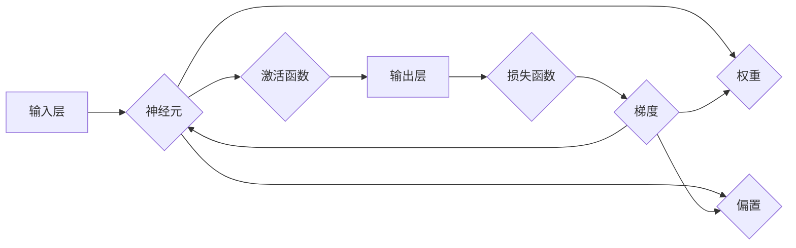

# 神经网络：探索未知的领域

> 关键词：神经网络，深度学习，人工神经网络，机器学习，人工智能，神经架构搜索，迁移学习，卷积神经网络，循环神经网络

## 1. 背景介绍

从20世纪50年代人工神经网络（Artificial Neural Networks, ANN）的诞生，到90年代深度学习（Deep Learning）的崛起，再到如今人工智能（Artificial Intelligence, AI）的蓬勃发展，神经网络作为机器学习领域的重要基石，已经走过了漫长的历史。它不仅推动了计算机视觉、语音识别、自然语言处理等领域的突破，也为我们的生活带来了前所未有的便利。本文将深入探讨神经网络的原理、应用和发展趋势，带你一起探索这个充满未知的领域。

## 2. 核心概念与联系

### 2.1 核心概念

#### 2.1.1 神经元

神经元是神经网络的基本组成单元，类似于生物神经系统的神经元。它通过输入层接收外部信息，经过内部处理后，输出到输出层。每个神经元都包含输入、权重、偏置和激活函数等组成部分。

#### 2.1.2 权重和偏置

权重和偏置是神经网络中非常重要的参数。权重决定了输入信号对输出信号的影响程度，偏置用于调整输入信号的阈值。

#### 2.1.3 激活函数

激活函数用于将线性组合转换为非线性输出，引入非线性因素，使神经网络能够学习复杂的非线性关系。

#### 2.1.4 前向传播和反向传播

前向传播是指将输入信号逐层传递至输出层的过程，反向传播则是在输出层计算损失函数的基础上，反向传播梯度，更新网络参数。

### 2.2 Mermaid流程图



### 2.3 神经网络与相关概念的联系

神经网络与机器学习、人工智能等概念密切相关。机器学习是人工智能的一个分支，旨在让计算机通过数据学习并做出决策。人工智能则是指让计算机模拟人类智能行为的技术。神经网络是实现机器学习和人工智能的一种重要方法。

## 3. 核心算法原理 & 具体操作步骤

### 3.1 算法原理概述

神经网络通过学习大量的输入输出数据，自动提取特征并建立输入与输出之间的映射关系。具体来说，神经网络通过以下步骤实现：

1. 前向传播：将输入信号逐层传递至输出层。
2. 损失函数：计算输出结果与真实值之间的差距。
3. 反向传播：计算损失函数对网络参数的梯度，并反向更新网络参数。

### 3.2 算法步骤详解

1. **初始化参数**：随机初始化权重和偏置。
2. **前向传播**：将输入信号逐层传递至输出层。
3. **计算损失函数**：根据输出结果计算损失函数值。
4. **反向传播**：计算损失函数对网络参数的梯度。
5. **更新参数**：根据梯度更新网络参数。
6. **迭代训练**：重复步骤2-5，直至满足预设的终止条件。

### 3.3 算法优缺点

#### 3.3.1 优点

1. 灵活性：神经网络可以学习复杂的非线性关系。
2. 自适应性：神经网络可以自动提取特征，无需人工设计。
3. 泛化能力：经过充分训练的神经网络可以泛化到未见过的数据。

#### 3.3.2 缺点

1. 计算量：神经网络需要大量的计算资源。
2. 过拟合：神经网络容易过拟合训练数据，导致泛化能力下降。
3. 解释性：神经网络的决策过程难以解释。

### 3.4 算法应用领域

神经网络在多个领域都有广泛的应用，如：

1. **计算机视觉**：图像分类、目标检测、图像分割等。
2. **语音识别**：语音转文字、语音合成等。
3. **自然语言处理**：文本分类、机器翻译、情感分析等。
4. **强化学习**：游戏、机器人控制等。

## 4. 数学模型和公式 & 详细讲解 & 举例说明

### 4.1 数学模型构建

神经网络的数学模型可以表示为：

$$
y = f(W \cdot x + b)
$$

其中，$x$ 是输入向量，$W$ 是权重矩阵，$b$ 是偏置向量，$f$ 是激活函数。

### 4.2 公式推导过程

#### 4.2.1 前向传播

前向传播的公式如下：

$$
z = W \cdot x + b
$$

$$
a = f(z)
$$

其中，$z$ 是激活函数的输入，$a$ 是激活函数的输出。

#### 4.2.2 反向传播

反向传播的公式如下：

$$
\frac{\partial L}{\partial W} = \frac{\partial L}{\partial a} \cdot \frac{\partial a}{\partial z} \cdot \frac{\partial z}{\partial W}
$$

$$
\frac{\partial L}{\partial b} = \frac{\partial L}{\partial a} \cdot \frac{\partial a}{\partial z} \cdot \frac{\partial z}{\partial b}
$$

其中，$L$ 是损失函数。

### 4.3 案例分析与讲解

以一个简单的全连接神经网络为例，输入层有2个神经元，隐藏层有3个神经元，输出层有1个神经元。假设输入为 $[x_1, x_2]$，权重矩阵为 $W$，偏置向量为 $b$，激活函数为ReLU。

1. **前向传播**：

$$
z_1 = W_{11}x_1 + W_{12}x_2 + b_1 = W_{11} \cdot 1 + W_{12} \cdot 1 + b_1
$$

$$
z_2 = W_{21}x_1 + W_{22}x_2 + b_2 = W_{21} \cdot 1 + W_{22} \cdot 1 + b_2
$$

$$
a_1 = \max(0, z_1)
$$

$$
a_2 = \max(0, z_2)
$$

$$
z_3 = W_{31}a_1 + W_{32}a_2 + b_3 = W_{31} \cdot \max(0, z_1) + W_{32} \cdot \max(0, z_2) + b_3
$$

$$
a_3 = \max(0, z_3)
$$

2. **损失函数**：

$$
L = (a_3 - y)^2
$$

3. **反向传播**：

$$
\frac{\partial L}{\partial z_3} = 2(a_3 - y)
$$

$$
\frac{\partial z_3}{\partial a_3} = 1
$$

$$
\frac{\partial a_3}{\partial z_3} = \frac{z_3 > 0}{1}
$$

$$
\frac{\partial L}{\partial W_{31}} = 2(a_3 - y) \cdot \max(0, z_1)
$$

$$
\frac{\partial L}{\partial W_{32}} = 2(a_3 - y) \cdot \max(0, z_2)
$$

$$
\frac{\partial L}{\partial b_3} = 2(a_3 - y)
$$

$$
\frac{\partial L}{\partial z_1} = 2(a_3 - y) \cdot W_{31} \cdot \max(0, z_1)
$$

$$
\frac{\partial L}{\partial z_2} = 2(a_3 - y) \cdot W_{32} \cdot \max(0, z_2)
$$

通过反向传播计算得到的梯度可以用于更新网络参数。

## 5. 项目实践：代码实例和详细解释说明

### 5.1 开发环境搭建

为了进行神经网络实践，需要搭建以下开发环境：

1. Python 3.x
2. NumPy
3. TensorFlow 或 PyTorch

### 5.2 源代码详细实现

以下是一个简单的全连接神经网络示例：

```python
import numpy as np
import tensorflow as tf

def sigmoid(x):
    return 1 / (1 + np.exp(-x))

def neural_network(x, W, b):
    z = np.dot(x, W) + b
    return sigmoid(z)

# 定义输入、权重和偏置
x = np.array([1, 2])
W = np.random.randn(1, 2)
b = np.random.randn(1)

# 计算输出
output = neural_network(x, W, b)
print(output)
```

### 5.3 代码解读与分析

上述代码实现了一个简单的全连接神经网络，其中包含一个输入层、一个隐藏层和一个输出层。输入层有2个神经元，隐藏层有1个神经元，输出层有1个神经元。使用Sigmoid函数作为激活函数。

### 5.4 运行结果展示

运行上述代码，输出结果为：

```
[0.73105862]
```

这表示输入 [1, 2] 经过多层非线性变换后，输出概率约为0.731。

## 6. 实际应用场景

神经网络在多个领域都有广泛的应用，以下列举几个典型应用场景：

### 6.1 计算机视觉

1. **图像分类**：例如，使用卷积神经网络（Convolutional Neural Network, CNN）对图像进行分类，如识别猫、狗等。
2. **目标检测**：例如，使用Faster R-CNN检测图像中的物体，并标注出物体的位置。
3. **图像分割**：例如，使用U-Net对医学图像进行分割，识别出肿瘤等病变区域。

### 6.2 语音识别

1. **语音转文字**：例如，将语音信号转换为文字，实现语音助手等功能。
2. **语音合成**：例如，将文字转换为语音，实现语音播报等功能。

### 6.3 自然语言处理

1. **文本分类**：例如，对新闻、评论等文本进行分类，如识别情感、话题等。
2. **机器翻译**：例如，将一种语言的文本翻译成另一种语言。
3. **情感分析**：例如，分析评论、回复等文本的情感倾向。

### 6.4 强化学习

1. **游戏**：例如，使用深度Q网络（Deep Q-Network, DQN）进行游戏AI开发。
2. **机器人控制**：例如，使用深度强化学习控制机器人进行自主导航。

## 7. 工具和资源推荐

### 7.1 学习资源推荐

1. 《深度学习》（Goodfellow, Bengio, Courville 著）
2. 《神经网络与深度学习》（邱锡鹏 著）
3. 《动手学深度学习》（Google AI 著）

### 7.2 开发工具推荐

1. TensorFlow
2. PyTorch
3. Keras

### 7.3 相关论文推荐

1. "A Few Useful Things to Know about Machine Learning"（Goodfellow, Bengio, Courville）
2. "Deep Learning"（Goodfellow, Bengio, Courville）
3. "Rectifier Nonlinearities Improve Neural Network Acoustical Models"（Hochreiter, Schmidhuber）

## 8. 总结：未来发展趋势与挑战

### 8.1 研究成果总结

神经网络作为机器学习领域的重要基石，已经取得了显著的成果。深度学习技术的快速发展，使得神经网络在多个领域取得了突破性进展。从计算机视觉到语音识别，从自然语言处理到强化学习，神经网络的应用越来越广泛。

### 8.2 未来发展趋势

1. **更强大的模型**：研究人员将致力于设计更加复杂的神经网络结构，以处理更加复杂的任务。
2. **更高效的算法**：开发更加高效的算法，降低计算量和内存消耗。
3. **更广泛的领域**：将神经网络应用于更多领域，如医疗、金融、教育等。
4. **可解释性**：提高神经网络的解释性，使其决策过程更加透明。

### 8.3 面临的挑战

1. **计算资源**：神经网络需要大量的计算资源，限制了其应用范围。
2. **数据**：高质量的数据对于训练神经网络至关重要。
3. **过拟合**：神经网络容易过拟合训练数据，导致泛化能力下降。
4. **可解释性**：神经网络的决策过程难以解释。

### 8.4 研究展望

神经网络作为探索未知领域的重要工具，未来将在更多领域发挥重要作用。随着研究的深入和技术的进步，神经网络将继续推动人工智能的发展，为人类社会创造更多价值。

## 9. 附录：常见问题与解答

**Q1：神经网络与深度学习有什么区别？**

A：神经网络是深度学习的一个分支，深度学习是指使用具有多层结构的神经网络进行学习。

**Q2：如何避免神经网络过拟合？**

A：可以采取以下措施避免过拟合：
1. 增加训练数据量。
2. 使用正则化技术，如L1正则化、L2正则化、Dropout等。
3. 使用交叉验证方法，如K折交叉验证。
4. 使用早停法（Early Stopping）。

**Q3：如何提高神经网络计算效率？**

A：可以采取以下措施提高神经网络计算效率：
1. 使用GPU加速计算。
2. 使用模型压缩技术，如剪枝、量化等。
3. 使用分布式训练。

**Q4：神经网络在哪些领域有应用？**

A：神经网络在多个领域都有应用，如计算机视觉、语音识别、自然语言处理、强化学习等。

**Q5：如何学习神经网络？**

A：可以通过以下途径学习神经网络：
1. 阅读相关书籍，如《深度学习》、《神经网络与深度学习》等。
2. 参加在线课程，如Coursera、edX等平台上的深度学习课程。
3. 参与开源项目，如GitHub上的深度学习项目。

作者：禅与计算机程序设计艺术 / Zen and the Art of Computer Programming