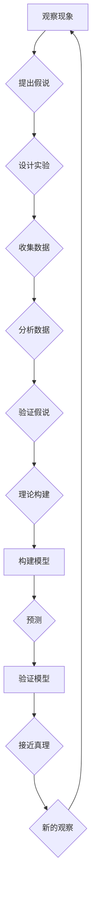

# 科学探究：从假说到真理

> 关键词：科学方法，假说，实证，真理，哲学，逻辑，实验设计，数据分析，模型验证

## 1. 背景介绍

科学探究是人类认识世界、探索真理的重要途径。从古希腊的哲学思辨到现代科学实验，科学方法的发展历程充满了对未知世界的无尽探索和对已有知识的不断修正。本文将深入探讨科学探究的本质，从假说到真理，揭示科学方法的内在逻辑和应用实践。

### 1.1 科学探究的起源

科学探究的起源可以追溯到古希腊时期，当时的哲学家们开始使用逻辑推理和实证观察来探索自然现象。亚里士多德提出了形式逻辑，而他的学生柏拉图则通过对话形式探讨哲学问题。这些早期的探索为后来的科学方法奠定了基础。

### 1.2 科学方法的发展

随着时代的变迁，科学方法不断发展完善。文艺复兴时期，伽利略通过实验验证理论，开创了实验科学的方法。牛顿的经典力学体系则将数学与实验相结合，成为科学方法的重要里程碑。20世纪初，量子力学和相对论的提出，标志着科学方法在理论深度上的突破。

### 1.3 科学探究的意义

科学探究不仅推动了人类对自然界的认识，也深刻影响了社会发展和人类生活。从医学到工程，从经济学到心理学，科学探究的方法为各个领域提供了强大的理论支撑和技术保障。

## 2. 核心概念与联系

科学探究的核心概念包括假说、实证、理论、模型和真理。以下是一个使用Mermaid流程图展示这些概念之间的联系：



### 2.1 观察现象

科学探究始于对自然现象的观察。观察是科学探究的第一步，它为我们提供了对世界的初步认识。

### 2.2 提出假说

基于观察，科学家会提出假说，即对观察现象的可能解释。

### 2.3 设计实验

为了验证假说，科学家需要设计实验。实验旨在通过控制变量来观察假说在特定条件下的表现。

### 2.4 收集数据

在实验过程中，科学家会收集数据，这些数据将用于验证或否定假说。

### 2.5 分析数据

收集到的数据需要进行分析，以判断假说是否成立。

### 2.6 验证假说

通过分析数据，科学家可以验证或否定假说。

### 2.7 理论构建

如果假说得到验证，科学家会构建理论，以解释观察到的现象。

### 2.8 构建模型

理论往往需要通过模型来具体体现。模型是对理论的一种数学或物理表述。

### 2.9 预测

模型可以用来预测未来可能发生的事件。

### 2.10 验证模型

通过实验或观察来验证模型的预测。

### 2.11 接近真理

科学探究的最终目标是接近真理，即对自然现象的准确解释。

## 3. 核心算法原理 & 具体操作步骤

### 3.1 算法原理概述

科学探究的过程可以看作是一种算法，其核心原理是逻辑推理和实证观察。以下是科学探究的基本步骤：

1. 观察现象
2. 提出假说
3. 设计实验
4. 收集数据
5. 分析数据
6. 验证假说
7. 理论构建
8. 构建模型
9. 预测
10. 验证模型

### 3.2 算法步骤详解

#### 3.2.1 观察现象

观察现象是科学探究的起点。科学家通过感官或仪器设备来收集关于自然现象的信息。

#### 3.2.2 提出假说

基于观察，科学家会提出假说，即对观察现象的可能解释。

#### 3.2.3 设计实验

为了验证假说，科学家需要设计实验。实验设计需要考虑以下因素：

- 实验目的
- 实验变量
- 实验控制
- 实验方法
- 数据收集

#### 3.2.4 收集数据

在实验过程中，科学家会收集数据。数据收集需要确保数据的准确性和可靠性。

#### 3.2.5 分析数据

收集到的数据需要进行分析，以判断假说是否成立。数据分析可以使用统计方法、数学模型或逻辑推理。

#### 3.2.6 验证假说

通过分析数据，科学家可以验证或否定假说。

#### 3.2.7 理论构建

如果假说得到验证，科学家会构建理论，以解释观察到的现象。

#### 3.2.8 构建模型

理论往往需要通过模型来具体体现。模型是对理论的一种数学或物理表述。

#### 3.2.9 预测

模型可以用来预测未来可能发生的事件。

#### 3.2.10 验证模型

通过实验或观察来验证模型的预测。

### 3.3 算法优缺点

#### 3.3.1 优点

- 逻辑严密：科学探究的步骤遵循逻辑推理，确保结论的可靠性。
- 可重复性：科学探究的结果可以通过实验或观察进行重复验证。
- 可证伪性：科学理论必须经得起实验或观察的证伪。

#### 3.3.2 缺点

- 认知偏差：科学家在观察、实验和数据分析过程中可能会受到认知偏差的影响。
- 实验误差：实验过程中可能存在误差，影响实验结果的准确性。
- 数据偏差：数据收集和分析过程中可能存在偏差，影响结论的可靠性。

### 3.4 算法应用领域

科学探究的方法几乎应用于所有科学领域，包括物理学、化学、生物学、医学、心理学等。

## 4. 数学模型和公式 & 详细讲解 & 举例说明

### 4.1 数学模型构建

数学模型是科学探究的重要工具。以下是一个简单的数学模型示例：

$$
y = mx + b
$$

其中，$y$ 是因变量，$x$ 是自变量，$m$ 是斜率，$b$ 是截距。

### 4.2 公式推导过程

以牛顿第二定律为例，推导过程如下：

$$
F = ma
$$

其中，$F$ 是力，$m$ 是质量，$a$ 是加速度。

我们可以将其表示为：

$$
a = \frac{F}{m}
$$

### 4.3 案例分析与讲解

以下是一个科学探究的案例：

#### 案例背景

科学家们观察到，在加热水时，水的温度会升高。

#### 提出假说

水分子在加热过程中吸收能量，导致其运动加剧，从而温度升高。

#### 实验设计

科学家设计了一个实验，将水加热，并测量其温度变化。

#### 数据收集

实验结果显示，随着加热时间的增加，水的温度也相应升高。

#### 数据分析

根据实验数据，科学家发现水的温度与加热时间之间存在线性关系。

#### 验证假说

实验结果支持了原始假说，即水分子在加热过程中吸收能量，导致其运动加剧，从而温度升高。

## 5. 项目实践：代码实例和详细解释说明

### 5.1 开发环境搭建

为了进行科学探究，我们需要搭建一个开发环境。以下是Python开发环境的基本配置：

1. 安装Python：从Python官网下载并安装Python。
2. 安装Jupyter Notebook：用于编写和运行Python代码。
3. 安装科学计算库：如NumPy、SciPy、Matplotlib等。

### 5.2 源代码详细实现

以下是一个使用Python进行数据分析的代码实例：

```python
import numpy as np
import matplotlib.pyplot as plt

# 假设我们有以下数据
x = np.array([1, 2, 3, 4, 5])
y = np.array([2, 4, 5, 4, 5])

# 绘制散点图
plt.scatter(x, y)
plt.xlabel('x')
plt.ylabel('y')
plt.show()

# 拟合线性模型
m, b = np.polyfit(x, y, 1)
y_pred = m * x + b

# 绘制拟合曲线
plt.plot(x, y, 'o', label='Original data')
plt.plot(x, y_pred, 'r', label='Fitted line')
plt.xlabel('x')
plt.ylabel('y')
plt.legend()
plt.show()
```

### 5.3 代码解读与分析

上述代码首先导入了NumPy和Matplotlib库。然后定义了实验数据`x`和`y`。接着，使用`scatter`函数绘制了散点图，并使用`xlabel`和`ylabel`函数设置了坐标轴标签。最后，使用`plot`函数绘制了拟合曲线。

### 5.4 运行结果展示

运行上述代码后，会显示两个图像：一个是散点图，另一个是拟合曲线。从图中可以看出，散点点与拟合曲线大致重合，说明线性模型能够较好地描述数据之间的关系。

## 6. 实际应用场景

### 6.1 天文学

在天文学中，科学家使用科学探究的方法来研究宇宙的起源和结构。例如，通过观测宇宙背景辐射，科学家提出了大爆炸理论。

### 6.2 生物学

在生物学中，科学家使用科学探究的方法来研究生命的起源和进化。例如，通过实验验证了孟德尔的遗传定律。

### 6.3 医学

在医学中，科学家使用科学探究的方法来研究疾病的原因和治疗方法。例如，通过临床试验验证了新药物的有效性。

## 7. 工具和资源推荐

### 7.1 学习资源推荐

1. 《科学方法导论》
2. 《科学探究与发现》
3. 《科学哲学导论》

### 7.2 开发工具推荐

1. Python
2. Jupyter Notebook
3. NumPy
4. SciPy
5. Matplotlib

### 7.3 相关论文推荐

1. 《科学方法的历史与发展》
2. 《科学哲学的探索》
3. 《科学探究的艺术》

## 8. 总结：未来发展趋势与挑战

### 8.1 研究成果总结

科学探究的方法在各个领域都取得了显著的成果。从物理学到生物学，从天文学到医学，科学探究的方法为人类认识世界、探索真理提供了强大的工具。

### 8.2 未来发展趋势

未来，科学探究的方法将继续发展，以下是一些趋势：

1. 多学科交叉：科学探究将更加注重多学科交叉，跨学科研究将成为主流。
2. 数据驱动：随着大数据时代的到来，数据驱动的研究方法将更加重要。
3. 人工智能：人工智能技术将用于辅助科学探究，提高效率和准确性。

### 8.3 面临的挑战

科学探究也面临着一些挑战：

1. 数据质量：数据质量是科学探究的基础，如何保证数据质量是一个重要挑战。
2. 知识整合：如何将来自不同领域的知识进行整合，是一个重要挑战。
3. 假说验证：如何验证复杂的科学假说，是一个重要挑战。

### 8.4 研究展望

未来，科学探究将更加注重实证观察、逻辑推理和模型验证。通过不断改进科学方法，人类将更好地认识世界、探索真理。

## 9. 附录：常见问题与解答

**Q1：科学探究的目的是什么？**

A: 科学探究的目的是探索自然界的规律，揭示事物的本质，为人类认识世界、改造世界提供理论指导和实践依据。

**Q2：科学探究的方法有哪些？**

A: 科学探究的方法包括观察、实验、理论构建、模型验证等。

**Q3：科学探究的结果是否一定正确？**

A: 科学探究的结果可能是正确的，也可能是错误的。科学探究的过程是一个不断修正错误、逼近真理的过程。

**Q4：如何进行科学探究？**

A: 进行科学探究需要遵循以下步骤：
1. 观察现象
2. 提出假说
3. 设计实验
4. 收集数据
5. 分析数据
6. 验证假说
7. 理论构建
8. 构建模型
9. 预测
10. 验证模型

**Q5：科学探究的重要性是什么？**

A: 科学探究是人类认识世界、探索真理的重要途径，它推动了人类社会的发展和进步。

作者：禅与计算机程序设计艺术 / Zen and the Art of Computer Programming