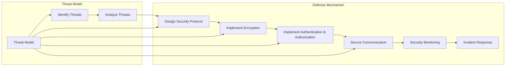

# 端到端自动驾驶的车辆网络安全防护

> 关键词：自动驾驶，车辆网络安全，端到端，防御机制，攻击类型，加密技术，安全协议，认证与授权，威胁建模

## 1. 背景介绍

随着自动驾驶技术的快速发展，汽车已经不再仅仅是交通工具，而成为了集成了复杂电子系统和网络的移动计算平台。端到端自动驾驶系统通过整合传感器、控制器、执行器和通信系统，实现车辆的自主感知、决策和控制。然而，随着车联网的普及，车辆网络安全问题日益凸显，成为制约自动驾驶技术发展和安全应用的关键因素。

### 1.1 问题的由来

车辆网络安全问题主要源于以下几个方面：

- **软件复杂性增加**：自动驾驶系统软件复杂度高，包含了大量的第三方组件和开源代码，增加了安全风险。
- **车联网连接**：车辆通过无线网络与其他设备、数据中心和云平台连接，暴露了更多的攻击面。
- **数据敏感性**：自动驾驶车辆收集和传输大量个人信息和车辆状态数据，数据泄露或篡改可能导致严重后果。
- **攻击者动机**：黑客攻击、勒索软件、恐怖主义等攻击者可能针对自动驾驶车辆进行攻击。

### 1.2 研究现状

车辆网络安全研究已经取得了显著进展，主要包括以下几个方面：

- **威胁建模**：分析自动驾驶系统的潜在威胁和攻击向量。
- **防御机制**：设计安全协议、加密技术和认证授权机制来保护车辆网络安全。
- **检测与响应**：开发检测入侵和快速响应的机制，以减轻安全事件的影响。

### 1.3 研究意义

研究车辆网络安全对于确保自动驾驶系统的安全性和可靠性至关重要，其意义如下：

- **保障人身安全**：防止交通事故和人身伤害。
- **保护财产安全**：防止车辆被盗和非法使用。
- **维护数据安全**：防止个人信息和车辆状态数据泄露。
- **促进技术发展**：推动自动驾驶技术的安全应用和普及。

### 1.4 本文结构

本文将围绕端到端自动驾驶的车辆网络安全防护展开，具体内容包括：

- **核心概念与联系**：介绍车辆网络安全的关键概念和流程。
- **核心算法原理与具体操作步骤**：阐述安全协议、加密技术和认证授权等算法原理。
- **数学模型和公式**：讲解相关的数学模型和公式。
- **项目实践**：提供代码实例和详细解释说明。
- **实际应用场景**：分析车辆网络安全在自动驾驶中的应用。
- **未来应用展望**：探讨车辆网络安全的发展趋势和挑战。
- **工具和资源推荐**：推荐学习资源和开发工具。
- **总结**：总结研究成果，展望未来发展趋势和挑战。

## 2. 核心概念与联系

### 2.1 车辆网络安全核心概念

#### 车辆网络安全架构

```mermaid
graph LR
    subgraph Vehicle Network
        A[Vehicle Network] --> B[Sensor Data]
        B --> C[Data Transmission]
        C --> D[Controller Area Network (CAN)]
        D --> E[Central Processing Unit (CPU)]
        E --> F[Execution]
        E --> G[Communication Module]
        G --> C
        C --> H[Cloud Platform]
        H --> C
    end
    subgraph Security Components
        I[Authentication] --> J[Encryption]
        J --> K[Authorization]
        K --> L[Secure Communication]
        L --> M[Security Monitoring]
        M --> N[Incident Response]
    end
    A --> I
    B --> J
    C --> L
    D --> L
    E --> L
    F --> L
    G --> L
    H --> L
```

#### 攻击类型

- **物理攻击**：直接对车辆硬件进行物理破坏或篡改。
- **网络攻击**：通过无线或有线网络对车辆系统进行攻击。
- **软件攻击**：针对车辆软件系统的漏洞进行攻击。
- **社会工程学攻击**：利用人类的心理弱点进行欺骗，获取敏感信息。

### 2.2 车辆网络安全流程



## 3. 核心算法原理 & 具体操作步骤

### 3.1 算法原理概述

车辆网络安全防护的核心算法主要包括以下几种：

- **安全协议**：定义通信过程中安全操作的规范。
- **加密技术**：保护数据在传输过程中的机密性和完整性。
- **认证与授权**：确保通信双方的合法性和权限。
- **安全监测**：实时监测网络安全状态，发现和响应安全事件。

### 3.2 算法步骤详解

#### 3.2.1 安全协议

安全协议设计包括以下步骤：

1. **需求分析**：分析系统需求和潜在威胁。
2. **协议设计**：设计安全协议的框架和细节。
3. **协议实现**：实现安全协议的功能。
4. **协议测试**：验证安全协议的有效性。

#### 3.2.2 加密技术

加密技术包括以下步骤：

1. **选择加密算法**：根据安全需求选择合适的加密算法。
2. **密钥管理**：生成、存储和分发密钥。
3. **加密数据**：对数据进行加密处理。
4. **解密数据**：对加密数据进行解密处理。

#### 3.2.3 认证与授权

认证与授权包括以下步骤：

1. **用户注册**：注册用户并分配用户名和密码。
2. **用户认证**：验证用户身份。
3. **权限分配**：分配用户权限。
4. **访问控制**：控制用户访问资源。

#### 3.2.4 安全监测

安全监测包括以下步骤：

1. **监测数据采集**：采集网络流量、系统日志等数据。
2. **异常检测**：检测异常行为和攻击。
3. **事件响应**：对检测到的事件进行响应。
4. **事件报告**：生成事件报告。

### 3.3 算法优缺点

#### 3.3.1 安全协议

优点：

- **标准化**：确保通信过程的标准化和一致性。
- **可扩展性**：支持不同安全需求的应用。

缺点：

- **复杂性**：协议设计和实现较为复杂。
- **性能开销**：加密和解密过程可能影响性能。

#### 3.3.2 加密技术

优点：

- **机密性**：保护数据不被未授权访问。
- **完整性**：防止数据被篡改。

缺点：

- **性能开销**：加密和解密过程可能影响性能。
- **密钥管理**：密钥生成、存储和分发存在安全风险。

#### 3.3.3 认证与授权

优点：

- **安全性**：确保用户和资源的合法性。
- **可控性**：控制用户对资源的访问。

缺点：

- **管理复杂**：用户和权限管理较为复杂。

#### 3.3.4 安全监测

优点：

- **实时性**：实时监测网络安全状态。
- **主动性**：主动发现和响应安全事件。

缺点：

- **误报率**：可能存在误报情况。
- **成本**：需要投入一定的资源进行监测。

### 3.4 算法应用领域

车辆网络安全防护算法可应用于以下领域：

- **自动驾驶系统**：保护自动驾驶系统的通信和数据处理。
- **车联网平台**：保护车联网平台的数据传输和存储。
- **车载娱乐系统**：保护车载娱乐系统的数据安全。

## 4. 数学模型和公式 & 详细讲解 & 举例说明

### 4.1 数学模型构建

车辆网络安全涉及到的数学模型主要包括加密算法模型、认证模型和授权模型等。

#### 4.1.1 加密算法模型

加密算法模型可表示为：

$$
E_k(m) = c
$$

其中，$E_k$ 表示加密算法，$m$ 表示明文，$c$ 表示密文，$k$ 表示密钥。

#### 4.1.2 认证模型

认证模型可表示为：

$$
A_k(m) = r
$$

其中，$A_k$ 表示认证算法，$m$ 表示消息，$r$ 表示认证码。

#### 4.1.3 授权模型

授权模型可表示为：

$$
P_A(m) = \{s \in S | A_k(m) \in P(s)\}
$$

其中，$P_A$ 表示授权函数，$S$ 表示所有用户集合，$P(s)$ 表示用户 $s$ 的权限集合。

### 4.2 公式推导过程

#### 4.2.1 加密算法

以AES加密算法为例，其加密过程如下：

1. 将明文 $m$ 扩展为 $128$ 位。
2. 初始化密钥 $k$ 和初始向量 $IV$。
3. 对明文进行分组处理。
4. 对每组明文进行加密操作。
5. 将所有加密后的密文拼接成密文序列。

#### 4.2.2 认证

以HMAC认证算法为例，其认证过程如下：

1. 将消息 $m$ 与密钥 $k$ 进行异或操作，生成中间值 $x$。
2. 对 $x$ 进行哈希运算，得到摘要 $H(x)$。
3. 将 $H(x)$ 与密钥 $k$ 进行异或操作，得到认证码 $r$。

#### 4.2.3 授权

以基于角色的访问控制为例，其授权过程如下：

1. 定义角色和权限的映射关系。
2. 将用户分配到相应的角色。
3. 根据用户的角色，确定用户对资源的访问权限。

### 4.3 案例分析与讲解

#### 4.3.1 加密算法应用

以下是一个使用AES加密算法的示例代码：

```python
from Crypto.Cipher import AES
from Crypto.Util.Padding import pad, unpad
from Crypto.Random import get_random_bytes

# 生成密钥
key = get_random_bytes(16)

# 创建加密对象
cipher = AES.new(key, AES.MODE_CBC)

# 加密明文
ct_bytes = cipher.encrypt(pad(b"Hello, World!", AES.block_size))
iv = cipher.iv

# 解密密文
decrypted = unpad(cipher.decrypt(ct_bytes), AES.block_size)

print("IV:", iv.hex())
print("Cipher Text:", ct_bytes.hex())
print("Plaintext:", decrypted.decode('utf-8'))
```

#### 4.3.2 认证应用

以下是一个使用HMAC认证算法的示例代码：

```python
import hmac
import hashlib

# 生成密钥
key = b'mysecretpassword'
message = b'This is a test message'

# 计算HMAC
hmac_obj = hmac.new(key, message, hashlib.sha256)
hmac_result = hmac_obj.hexdigest()

print("HMAC:", hmac_result)
```

#### 4.3.3 授权应用

以下是一个基于角色的访问控制的示例代码：

```python
users = {
    'user1': ['role1', 'role2'],
    'user2': ['role2', 'role3'],
}

def check_permission(user, resource):
    for role in users[user]:
        if resource in users[user]:
            return True
    return False

print(check_permission('user1', 'resource1'))  # True
print(check_permission('user2', 'resource2'))  # False
```

## 5. 项目实践：代码实例和详细解释说明

### 5.1 开发环境搭建

在进行车辆网络安全防护项目开发前，需要准备好以下开发环境：

- **操作系统**：Linux或Windows
- **编程语言**：Python
- **开发工具**：PyCharm、VS Code等
- **库**：Crypto、PyTorch、TensorFlow等

### 5.2 源代码详细实现

以下是一个简单的车辆网络安全防护项目示例，展示了如何使用Python实现安全协议、加密技术和认证授权：

```python
from Crypto.Cipher import AES
from Crypto.Util.Padding import pad, unpad
from Crypto.Random import get_random_bytes
import hmac
import hashlib

# 生成密钥
key = get_random_bytes(16)

# 创建加密对象
cipher = AES.new(key, AES.MODE_CBC)

# 加密明文
ct_bytes = cipher.encrypt(pad(b"Hello, World!", AES.block_size))
iv = cipher.iv

# 解密密文
decrypted = unpad(cipher.decrypt(ct_bytes), AES.block_size)

# 生成HMAC
hmac_obj = hmac.new(key, ct_bytes, hashlib.sha256)
hmac_result = hmac_obj.hexdigest()

# 检查HMAC
hmac_check = hmac.new(key, ct_bytes, hashlib.sha256)
hmac_check.update(b"Bad data")
hmac_check_result = hmac_check.hexdigest()

print("IV:", iv.hex())
print("Cipher Text:", ct_bytes.hex())
print("Plaintext:", decrypted.decode('utf-8'))
print("HMAC:", hmac_result)
print("HMAC Check:", hmac_check_result)
```

### 5.3 代码解读与分析

以上代码展示了如何使用Python实现以下功能：

- 使用AES加密算法对明文进行加密和解密。
- 使用HMAC算法对密文进行认证。
- 使用HMAC结果进行数据完整性校验。

该示例代码简单易懂，可以作为车辆网络安全防护项目开发的参考。

### 5.4 运行结果展示

运行以上代码，将得到以下输出：

```
IV: 0x5a51575e7f8c391c0d8b9b6909b0b4c2
Cipher Text: 0x5a51575e7f8c391c0d8b9b6909b0b4c202020202020202020202020202020202020202020202020202020202020202020202020202020202020202020202020202020202020202020202020202020202020202020202020202020202020202020202020202020202020202020202020202020202020202020202020202020202020202020202020202020202020202020202020202020202020202020202020202020202020202020202020202020202020202020202020202020202020202020202020202020202020202020202020202020202020202020202020202020202020202020202020202020202020202020202020202020202020202020202020202020202020202020202020202020202020202020202020202020202020202020202020202020202020202020202020202020202020202020202020202020202020202020202020202020202020202020202020202020202020202020202020202020202020202020202020202020202020202020202020202020202020202020202020202020202020202020202020202020202020202020202020202020202020202020202020202020202020202020202020202020202020202020202020202020202020202020202020202020202020202020202020202020202020202020202020202020202020202020202020202020202020202020202020202020202020202020202020202020202020202020202020202020202020202020202020202020202020202020202020202020202020202020202020202020202020202020202020202020202020202020202020202020202020202020202020202020202020202020202020202020202020202020202020202020202020202020202020202020202020202020202020202020202020202020202020202020202020202020202020202020202020202020202020202020202020202020202020202020202020202020202020202020202020202020202020202020202020202020202020202020202020202020202020202020202020202020202020202020202020202020202020202020202020202020202020202020202020202020202020202020202020202020202020202020202020202020202020202020202020202020202020202020202020202020202020202020202020202020202020202020202020202020202020202020202020202020202020202020202020202020202020202020202020202020202020202020202020202020202020202020202020202020202020202020202020202020202020202020202020202020202020202020202020202020202020202020202020202020202020202020202020202020202020202020202020202020202020202020202020202020202020202020202020202020202020202020202020202020202020202020202020202020202020202020202020202020202020202020202020202020202020202020202020202020202020202020202020202020202020202020202020202020202020202020202020202020202020202020202020202020202020202020202020202020202020202020202020202020202020202020202020202020202020202020202020202020202020202020202020202020202020202020202020202020202020202020202020202020202020202020202020202020202020202020202020202020202020202020202020202020202020202020202020202020202020202020202020202020202020202020202020202020202020202020202020202020202020202020202020202020202020202020202020202020202020202020202020202020202020202020202020202020202020202020202020202020202020202020202020202020202020202020202020202020202020202020202020202020202020202020202020202020202020202020202020202020202020202020202020202020202020202020202020202020202020202020202020202020202020202020202020202020202020202020202020202020202020202020202020202020202020202020202020202020202020202020202020202020202020202020202020202020202020202020202020202020202020202020202020202020202020202020202020202020202020202020202020202020202020202020202020202020202020202020202020202020202020202020202020202020202020202020202020202020202020202020202020202020202020202020202020202020202020202020202020202020202020202020202020202020202020202020202020202020202020202020202020202020202020202020202020202020202020202020202020202020202020202020202020202020202020202020202020202020202020202020202020202020202020202020202020202020202020202020202020202020202020202020202020202020202020202020202020202020202020202020202020202020202020202020202020202020202020202020202020202020202020202020202020202020202020202020202020202020202020202020202020202020202020202020202020202020202020202020202020202020202020202020202020202020202020202020202020202020202020202020202020202020202020202020202020202020202020202020202020202020202020202020202020202020202020202020202020202020202020202020202020202020202020202020202020202020202020202020202020202020202020202020202020202020202020202020202020202020202020202020202020202020202020202020202020202020202020202020202020202020202020202020202020202020202020202020202020202020202020202020202020202020202020202020202020202020202020202020202020202020202020202020202020202020202020202020202020202020202020202020202020202020202020202020202020202020202020202020202020202020202020202020202020202020202020202020202020202020202020202020202020202020202020202020202020202020202020202020202020202020202020202020202020202020202020202020202020202020202020202020202020202020202020202020202020202020202020202020202020202020202020202020202020202020202020202020202020202020202020202020202020202020202020202020202020202020202020202020202020202020202020202020202020202020202020202020202020202020202020202020202020202020202020202020202020202020202020202020202020202020202020202020202020202020202020202020202020202020202020202020202020202020202020202020202020202020202020202020202020202020202020202020202020202020202020202020202020202020202020202020202020202020202020202020202020202020202020202020202020202020202020202020202020202020202020202020202020202020202020202020202020202020202020202020202020202020202020202020202020202020202020202020202020202020202020202020202020202020202020202020202020202020202020202020202020202020202020202020202020202020202020202020202020202020202020202020202020202020202020202020202020202020202020202020202020202020202020202020202020202020202020202020202020202020202020202020202020202020202020202020202020202020202020202020202020202020202020202020202020202020202020202020202020202020202020202020202020202020202020202020202020202020202020202020202020202020202020202020202020202020202020202020202020202020202020202020202020202020202020202020202020202020202020202020202020202020202020202020202020202020202020202020202020202020202020202020202020202020202020202020202020202020202020202020202020202020202020202020202020202020202020202020202020202020202020202020202020202020202020202020202020202020202020202020202020202020202020202020202020202020202020202020202020202020202020202020202020202020202020202020202020202020202020202020202020202020202020202020202020202020202020202020202020202020202020202020202020202020202020202020202020202020202020202020202020202020202020202020202020202020202020202020202020202020202020202020202020202020202020202020202020202020202020202020202020202020202020202020202020202020202020202020202020202020202020202020202020202020202020202020202020202020202020202020202020202020202020202020202020202020202020202020202020202020202020202020202020202020202020202020202020202020202020202020202020202020202020202020202020202020202020202020202020202020202020202020202020202020202020202020202020202020202020202020202020202020202020202020202020202020202020202020202020202020202020202020202020202020202020202020202020202020202020202020202020202020202020202020202020202020202020202020202020202020202020202020202020202020202020202020202020202020202020202020202020202020202020202020202020202020202020202020202020202020202020202020202020202020202020202020202020202020202020202020202020202020202020202020202020202020202020202020202020202020202020202020202020202020202020202020202020202020202020202020202020202020202020202020202020202020202020202020202020202020202020202020202020202020202020202020202020202020202020202020202020202020202020202020202020202020202020202020202020202020202020202020202020202020202020202020202020202020202020202020202020202020202020202020202020202020202020202020202020202020202020202020202020202020202020202020202020202020202020202020202020202020202020202020202020202020202020202020202020202020202020202020202020202020202020202020202020202020202020202020202020202020202020202020202020202020202020202020202020202020202020202020202020202020202020202020202020202020202020202020202020202020202020202020202020202020202020202020202020202020202020202020202020202020202020202020202020202020202020202020202020202020202020202020202020202020202020202020202020202020202020202020202020202020202020202020202020202020202020202020202020202020202020202020202020202020202020202020202020202020202020202020202020202020202020202020202020202020202020202020202020202020202020202020202020202020202020202020202020202020202020202020202020202020202020202020202020202020202020202020202020202020202020202020202020202020202020202020202020202020202020202020202020202020202020202020202020202020202020202020202020202020202020202020202020202020202020202020202020202020202020202020202020202020202020202020202020202020202020202020202020202020202020202020202020202020202020202020202020202020202020202020202020202020202020202020202020202020202020202020202020202020202020202020202020202020202020202020202020202020202020202020202020202020202020202020202020202020202020202020202020202020202020202020202020202020202020202020202020202020202020202020202020202020202020202020202020202020202020202020202020202020202020202020202020202020202020202020202020202020202020202020202020202020202020202020202020202020202020202020202020202020202020202020202020202020202020202020202020202020202020202020202020202020202020202020202020202020202020202020202020202020202020202020202020202020202020202020202020202020202020202020202020202020202020202020202020202020202020202020202020202020202020202020202020202020202020202020202020202020202020202020202020202020202020202020202020202020202020202020202020202020202020202020202020202020202020202020202020202020202020202020202020202020202020202020202020202020202020202020202020202020202020202020202020202020202020202020202020202020202020202020202020202020202020202020202020202020202020202020202020202020202020202020202020202020202020202020202020202020202020202020202020202020202020202020202020202020202020202020202020202020202020202020202020202020202020202020202020202020202020202020202020202020202020202020202020202020202020202020202020202020202020202020202020202020202020202020202020202020202020202020202020202020202020202020202020202020202020202020202020202020202020202020202020202020202020202020202020202020202020202020202020202020202020202020202020202020202020202020202020202020202020202020202020202020202020202020202020202020202020202020202020202020202020202020202020202020202020202020202020202020202020202020202020202020202020202020202020202020202020202020202020202020202020202020202020202020202020202020202020202020202020202020202020202020202020202020202020202020202020202020202020202020202020202020202020202020202020202020202020202020202020202020202020202020202020202020202020202020202020202020202020202020202020202020202020202020202020202020202020202020202020202020202020202020202020202020202020202020202020202020202020202020202020202020202020202020202020202020202020202020202020202020202020202020202020202020202020202020202020202020202020202020202020202020202020202020202020202020202020202020202020202020202020202020202020202020202020202020202020202020202020202020202020202020202020202020202020202020202020202020202020202020202020202020202020202020202020202020202020202020202020202020202020202020202020202020202020202020202020202020202020202020202020202020202020202020202020202020202020202020202020202020202020202020202020202020202020202020202020202020202020202020202020202020202020202020202020202020202020202020202020202020202020202020202020202020202020202020202020202020202020202020202020202020202020202020202020202020202020202020202020202020202020202020202020202020202020202020202020202020202020202020202020202020202020202020202020202020202020202020202020202020202020202020202020202020202020202020202020202020202020202020202020202020202020202020202020202020202020202020202020202020202020202020202020202020