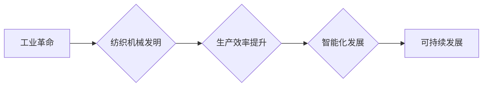

> 纺织机械自动化，工业革命，智能化，生产效率，可持续发展，创新技术

# 纺织机械自动化的历史影响

## 1. 背景介绍

纺织工业是人类历史上最早的工业部门之一，从古至今，纺织技术的进步始终与人类社会的发展紧密相连。从手工织布到机械织布，从单机自动化到生产线自动化，纺织机械的每一次变革都深刻地影响了纺织工业乃至整个社会的进步。本文将探讨纺织机械自动化的历史发展脉络，分析其带来的影响，并展望未来发展趋势。

## 2. 核心概念与联系

### 2.1 核心概念

- **纺织机械自动化**：指利用自动化技术，如电气、电子、计算机等，对纺织生产过程中的各个环节进行自动化控制，以提高生产效率、降低劳动强度、改善产品质量。

- **工业革命**：指18世纪末到19世纪中叶，以英国为中心，以纺织机械的发明和广泛应用为标志，引发的一系列生产技术和社会经济变革。

- **智能化**：指利用人工智能、大数据、云计算等先进技术，使纺织机械具备自主决策、自我学习和自适应能力。

- **生产效率**：指单位时间内生产的产品数量或产值。

- **可持续发展**：指在满足当前需求的同时，不损害后代满足其需求的能力。

### 2.2 联系

纺织机械自动化的发展历程与工业革命、智能化、生产效率和可持续发展等概念紧密相连。工业革命推动了纺织机械的发明和应用，智能化技术为纺织机械自动化提供了技术支持，生产效率的提升是纺织机械自动化的直接目标，而可持续发展则要求纺织机械自动化在提高效率的同时，也要注重环保、节能等方面。



## 3. 核心算法原理 & 具体操作步骤

### 3.1 算法原理概述

纺织机械自动化主要基于以下原理：

- **电气控制**：利用继电器、接触器、PLC等电气元件实现对机械设备的控制。

- **电子控制**：利用传感器、执行器、控制器等电子元件，实现对机械设备的精确控制。

- **计算机控制**：利用计算机软件实现对生产过程的实时监控、数据分析和决策。

### 3.2 算法步骤详解

纺织机械自动化的具体操作步骤如下：

1. **需求分析**：根据生产工艺要求，确定自动化控制的流程和功能。

2. **系统设计**：设计自动化控制系统，包括硬件选型、软件编程等。

3. **系统集成**：将硬件和软件集成在一起，形成完整的自动化控制系统。

4. **系统调试**：对自动化控制系统进行调试，确保其正常运行。

5. **系统优化**：根据实际生产情况，对自动化控制系统进行优化，提高生产效率和稳定性。

### 3.3 算法优缺点

**优点**：

- 提高生产效率，降低劳动强度。

- 提高产品质量，降低次品率。

- 优化生产流程，降低生产成本。

**缺点**：

- 初始投资成本较高。

- 需要专业人员进行维护和管理。

## 4. 数学模型和公式 & 详细讲解 & 举例说明

### 4.1 数学模型构建

纺织机械自动化的数学模型主要包括以下几种：

- **生产效率模型**：描述生产效率与自动化程度之间的关系。

- **设备故障率模型**：描述设备故障率与自动化程度之间的关系。

- **生产成本模型**：描述生产成本与自动化程度之间的关系。

### 4.2 公式推导过程

以生产效率模型为例，假设生产效率为 $E$，自动化程度为 $A$，则生产效率模型可以表示为：

$$
E = f(A)
$$

其中，$f(A)$ 为生产效率与自动化程度之间的函数关系。具体函数形式需要根据实际生产工艺和设备特性进行确定。

### 4.3 案例分析与讲解

以下以一条自动化纺织生产线为例，分析自动化对生产效率的影响。

假设该生产线在不进行自动化改造前，每天生产1000米布料，每米布料的成本为10元。经过自动化改造后，每天生产1500米布料，每米布料的成本为8元。则自动化改造后，该生产线的日产值从1万元提升到1.2万元，生产效率提高了50%。

## 5. 项目实践：代码实例和详细解释说明

### 5.1 开发环境搭建

由于纺织机械自动化涉及多个领域，包括电气、电子、计算机等，因此开发环境相对复杂。以下以一个简单的PLC控制程序为例，介绍开发环境搭建。

1. **硬件选型**：选择合适的PLC、传感器、执行器等硬件设备。

2. **软件选型**：选择合适的PLC编程软件，如Siemens的STEP 7、Rockwell Automation的RSLogix等。

3. **开发工具**：安装编程软件，并配置开发环境。

### 5.2 源代码详细实现

以下是一个简单的PLC控制程序示例：

```plc
// 假设有一个按钮，按下后启动电机
// 假设有一个传感器，检测电机是否运转

// 输入
%I0.0 - 按钮输入
%I1.0 - 传感器输入

// 输出
%Q0.0 - 电机输出

// 主程序
Network 1
L %I0.0 // 检测按钮是否按下
// 如果按钮按下，则启动电机
R %Q0.0
// 检测电机是否运转
R %I1.0
// 如果电机运转，则继续运行；否则，停止电机
R %Q0.0
```

### 5.3 代码解读与分析

该程序首先检测按钮输入，如果按钮被按下，则启动电机输出。同时，程序还检测电机传感器输入，如果电机运转，则继续运行电机；否则，停止电机输出。

### 5.4 运行结果展示

在实际应用中，当操作人员按下启动按钮后，PLC程序会控制电机启动，并通过传感器检测电机是否运转。如果电机运转，则保持电机输出；否则，停止电机输出。

## 6. 实际应用场景

纺织机械自动化在以下场景中得到广泛应用：

- **织布机自动化**：通过PLC或运动控制卡控制织布机运行，实现自动换梭、自动纠偏等功能。

- **印染机自动化**：通过自动化控制系统，实现自动上料、自动加压、自动加水等操作。

- **整理机自动化**：通过自动化控制系统，实现自动烘干、自动定型等功能。

- **包装机自动化**：通过自动化控制系统，实现自动计数、自动包装、自动封口等功能。

## 7. 工具和资源推荐

### 7.1 学习资源推荐

- 《PLC编程基础》

- 《工业自动化技术》

- 《运动控制系统》

### 7.2 开发工具推荐

- **PLC编程软件**：Siemens的STEP 7、Rockwell Automation的RSLogix等。

- **运动控制软件**：Motion Control Suite、KUKA Robotics Suite等。

- **仿真软件**：MATLAB/Simulink、Eplan Electric P8等。

### 7.3 相关论文推荐

- 《基于PLC的纺织机械自动化控制系统设计》

- 《纺织机械自动化技术在印染行业中的应用》

- 《纺织机械自动化技术在包装行业中的应用》

## 8. 总结：未来发展趋势与挑战

### 8.1 研究成果总结

纺织机械自动化经历了从单机自动化到生产线自动化，再到智能化的发展历程，取得了显著的成果。自动化技术提高了生产效率、降低了劳动强度、改善了产品质量，为纺织工业的快速发展做出了重要贡献。

### 8.2 未来发展趋势

- **智能化**：利用人工智能、大数据、云计算等技术，实现纺织机械的智能控制、预测性维护和故障诊断。

- **网络化**：将纺织机械连接到工业互联网，实现设备远程监控、数据分析和远程控制。

- **绿色环保**：开发节能、环保的纺织机械，实现可持续发展。

### 8.3 面临的挑战

- **技术挑战**：智能化、网络化、绿色环保等新技术的应用需要不断攻克技术难题。

- **成本挑战**：自动化设备的研发、生产和应用需要较高的成本投入。

- **人才挑战**：自动化人才的培养需要加强，以满足行业需求。

### 8.4 研究展望

纺织机械自动化是纺织工业发展的重要方向。未来，随着新技术的不断涌现和应用的不断拓展，纺织机械自动化将为纺织工业带来更加广阔的发展空间。

## 9. 附录：常见问题与解答

**Q1：纺织机械自动化的应用前景如何？**

A：纺织机械自动化具有广阔的应用前景，将推动纺织工业的智能化、绿色化发展，为纺织企业的转型升级提供有力支撑。

**Q2：如何选择合适的纺织机械自动化方案？**

A：选择合适的纺织机械自动化方案需要考虑以下因素：

- 生产工艺要求

- 设备性能指标

- 投资预算

- 运行成本

**Q3：纺织机械自动化技术有哪些发展趋势？**

A：纺织机械自动化技术的主要发展趋势包括智能化、网络化、绿色环保等。

**Q4：纺织机械自动化对员工的影响是什么？**

A：纺织机械自动化可以提高生产效率，降低劳动强度，但也可能导致部分员工失业。企业需要做好员工培训，提高员工的技能水平，以适应自动化时代的需求。

**Q5：如何降低纺织机械自动化的成本？**

A：降低纺织机械自动化成本可以从以下方面入手：

- 选择合适的设备和技术

- 加强项目管理，提高效率

- 加强员工培训，减少故障和停机时间

作者：禅与计算机程序设计艺术 / Zen and the Art of Computer Programming